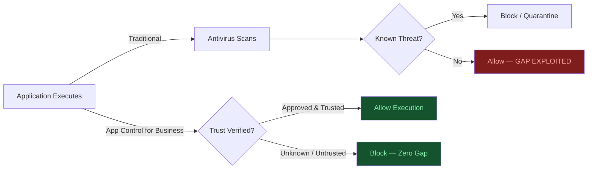
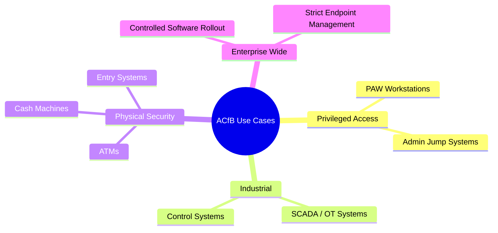
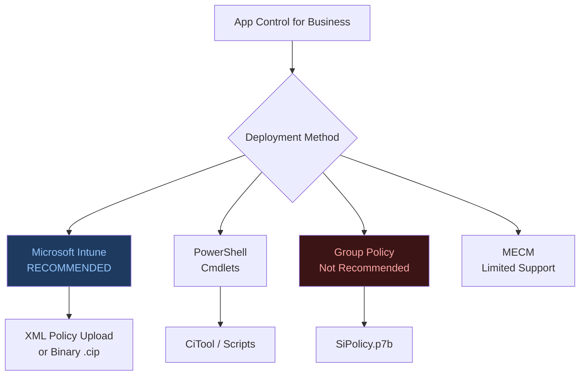
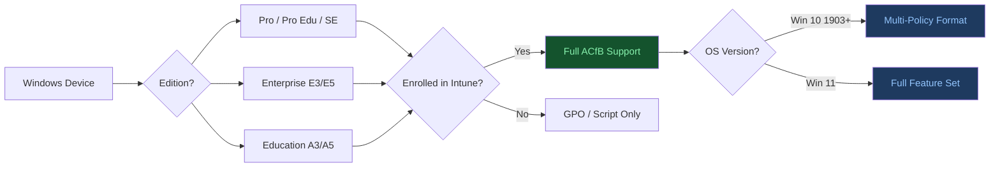
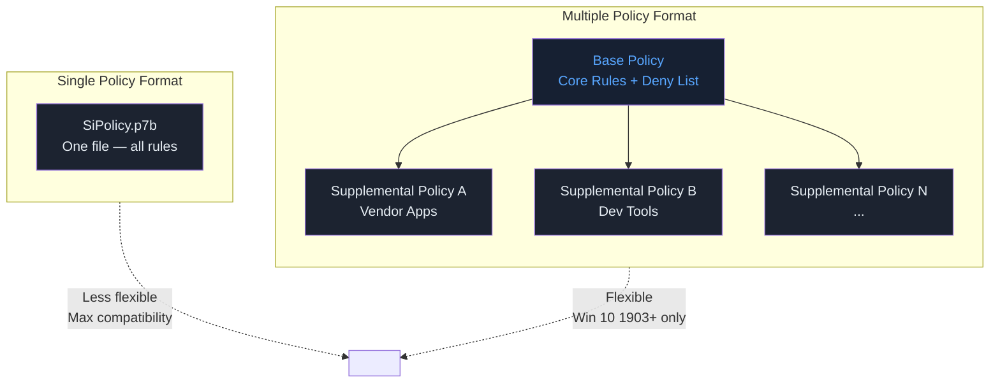
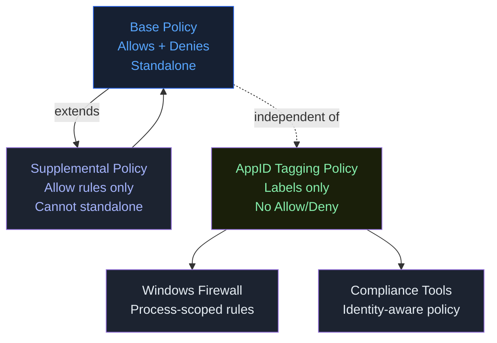

# Mastering App Control for Business
## Part 1: Introduction & Key Concepts

**Author:** Anubhav  
**Source:** ctrlshiftenter.cloud — Patrick Seltmann  
**Status:** Corporate Reference Document  
**Category:** Endpoint Security | Endpoint Management  

---

## Table of Contents

1. [Why Application Control Matters](#1-why-application-control-matters)
2. [Key Use Cases](#2-key-use-cases)
3. [How to Deploy App Control for Business](#3-how-to-deploy-app-control-for-business)
4. [Licensing & Device Requirements](#4-licensing--device-requirements)
5. [App Control for Business vs. AppLocker](#5-app-control-for-business-vs-applocker)
6. [Key Features](#6-key-features)
7. [Benefits](#7-benefits)
8. [Policy Formats](#8-policy-formats)
9. [Policy Types](#9-policy-types)
10. [Core Terminology](#10-core-terminology)

---

## 1. Why Application Control Matters

Traditional security solutions are **reactive** — they respond after a threat has already executed. This creates a gap between detection and response that attackers actively exploit.

**App Control for Business (ACfB)** shifts the model from *trust everything* to **trust must be earned**. Every application, script, and driver must be verified as safe before it is permitted to run.

### Implications

- Reduces the attack surface by preventing unauthorized code execution
- Blocks malicious software before it can run — not after
- Requires careful planning; misconfiguration can disrupt legitimate workloads

### Implementation Recommendations

| # | Recommendation |
|---|----------------|
| 1 | Establish clear processes for application approval |
| 2 | Standardize endpoint configurations across the organization |
| 3 | Understand policy impact before rolling out organization-wide |
| 4 | Enforce centralized endpoint control — limit user-driven software decisions |



---

## 2. Key Use Cases

ACfB is particularly well-suited for the following environments:

- **Privileged Access Workstations (PAW)** and administrative jump systems
- **Industrial control systems** and OT/SCADA environments
- **Physical security systems** — ATMs, cash machines, access control systems
- **Enterprise-wide enforcement** where infrastructure is well-documented, software rollout is controlled, and endpoint management is mature



---

## 3. How to Deploy App Control for Business

### Smart App Control (SAC) — Built-in, Unmanaged

Windows 11 (22H2+) ships with **Smart App Control (SAC)**, an automatic, unmanaged enforcement layer that evaluates application reputation using Microsoft's **Intelligent Security Graph** (AI/ML-backed).

> **Important:** SAC is disabled on systems upgraded from Windows 10 in-place. It is only active on clean installs of Windows 11.

SAC is powered by **Code Integrity (CI)**, a Windows core component that enforces policy checks beginning at system boot — covering the kernel, drivers, and signed binaries.

### Managed Deployment Options

| Method | Recommended |
|--------|-------------|
| **Microsoft Intune** | Yes (preferred) |
| PowerShell | Yes (scripted deployments) |
| Microsoft Configuration Manager (MECM) | Limited built-in support |
| Group Policy | Not recommended |

### Rule Criteria Supported

- Code-signing certificate attributes
- Binary metadata: filename, file version, file hash
- Application reputation (Microsoft Intelligent Security Graph)
- Managed installer trust (e.g., Intune, SCCM)
- Execution path (Windows 10 1903+)
- Initiating/parent process



---

## 4. Licensing & Device Requirements

### Supported Windows Editions

| Windows Pro | Windows Enterprise | Windows Pro Education/SE | Windows Education |
|-------------|-------------------|--------------------------|-------------------|
| Yes | Yes | Yes | Yes |

### License Entitlements

| Windows Pro/Pro Edu/SE | Enterprise E3 | Enterprise E5 | Education A3 | Education A5 |
|------------------------|--------------|--------------|--------------|--------------|
| Yes | Yes | Yes | Yes | Yes |

### Supported Device Configurations (via Intune)

| Configuration | Minimum Version |
|---------------|----------------|
| Windows Enterprise / Education | Windows 10 v1903 or later; Windows 11 |
| Windows Professional | Windows 10 with KB5019959; Windows 11 22H2 with KB5019980 |
| Windows 11 SE | Supported (Education tenants only) |
| Azure Virtual Desktop (AVD) | Supported; multi-session via Endpoint Security node |
| Co-managed devices | Set Endpoint Protection slider to **Intune** |

> An additional **Intune license** is required to deploy ACfB policies via Intune.



---

## 5. App Control for Business vs. AppLocker

| Capability | App Control for Business | AppLocker |
|---|---|---|
| Platform support | Windows 10, 11, Server 2016+ | Windows 8+ |
| Management | Intune, MECM, GPO, PowerShell | GPO (primary), Intune (OMA-URI only) |
| Rule types | Hash, Publisher, Path, File Properties, Reputation, Managed Installer, COM | Hash, Publisher, Path, File Properties (limited), Packaged Apps |
| Kernel-mode enforcement | Yes | No (user-mode only) |
| Multiple policies | Yes (Windows 10 1903+) | No — single active policy per system |
| Managed installer support | Yes | No |
| Reputation-based intelligence | Yes (Microsoft ISG) | No |
| Path rule exclusions | No — runtime user-writeability check enforced | Yes |
| Script enforcement | Comprehensive (PowerShell, VBScript, JS) | Basic (.exe, .com, .bat, .cmd) |
| AppID Tagging | Yes | No |
| MDE integration | Strong | Limited |
| Complexity | High initial setup, robust long-term | Moderate setup, fewer controls |

---

## 6. Key Features

### Execution Control
Prevents unauthorized applications, scripts, and drivers from running. Only approved and trusted code executes. This eliminates the majority of initial attack vectors that rely on malicious file or script execution.

### Virtualization-Based Security (VBS) Integration
ACfB leverages **VBS** to create a protected isolation layer — **Virtual Secure Mode (VSM)** — within Windows. Security-critical operations occur inside VSM:

- **LSASS Protection** — prevents credential dumping via code injection
- **Code Integrity Checks** — validates applications before execution in hardware-isolated context

This makes it significantly harder for attackers to bypass Windows security controls even with elevated privileges.

---

## 7. Benefits

### Defense Against Advanced Threats and Zero-Days
By blocking unapproved applications and scripts, ACfB reduces exposure to:
- Unknown zero-day exploits
- Fileless malware
- Living-off-the-land (LotL) attack techniques

### Regulatory Compliance Support
ACfB helps organizations demonstrate compliance with frameworks including:

| Framework | Relevance |
|-----------|-----------|
| **HIPAA** | Restricts unauthorized software on systems handling PHI |
| **PCI DSS** | Controls execution environment for cardholder data systems |
| **GDPR** | Reduces risk of unauthorized data access via rogue applications |

---

## 8. Policy Formats

ACfB policies are **XML-based files** compiled to binary and enforced by Code Integrity.

### Single Policy Format

One policy file containing all rules.

- **Most compatible** — works on all Windows 10 versions including Server 2016/2019+
- Simpler to manage but less flexible
- Analogous to a **Local GPO**

**Storage locations:**

```
EFI System Partition:  \Microsoft\Boot\SiPolicy.p7b
OS Volume:             \Windows\System32\CodeIntegrity\SiPolicy.p7b
```

### Multiple Policy Format

Combines a **Base Policy** with one or more **Supplemental Policies**.

- Requires Windows 10 1903+ or Windows Server 2025
- Supports up to 32 supplemental policies (April 2024 update removes this limit)
- Analogous to **Domain GPOs** — layered, scoped control
- Base Policy = trunk; Supplemental Policies = branches

**Storage locations:**

```
OS Volume:             \Windows\System32\CodeIntegrity\CiPolicies\Active\{PolicyId GUID}.cip
EFI System Partition:  \Microsoft\Boot\CiPolicies\Active\{PolicyId GUID}.cip
```

### Signed Policies

Policies can be **cryptographically signed** to prevent tampering or unauthorized removal. This is the most secure configuration but requires careful key management.

> Signing details and management procedures will be covered in a future part of this series.



---

## 9. Policy Types

### Base Policy
- Standalone — operates independently
- Can contain both **allow** and **deny** rules
- Multiple base policies can coexist on a single system

### Supplemental Policy
- Cannot operate independently — extends a Base Policy
- Can only add **allow rules** (no deny rules)
- Deny rules in a base policy **cannot be overridden** by supplemental allow rules
- Useful for scoping application exceptions without modifying the core base policy

### AppID Tagging Policy
- Does **not** allow or block execution
- Applies **custom labels/tags** to applications based on defined rules
- Tags enable other systems (firewalls, compliance tools) to treat tagged apps differently
- User-mode only; does not apply to kernel-mode files

### Comparison Matrix

| Feature | Base Policy | Supplemental Policy | AppID Tagging Policy |
|---|---|---|---|
| Can be standalone | Yes | No | Yes |
| Can have deny rules | Yes | No | No |
| Applies to kernel-mode files | Yes | Yes | No |
| Can be signed | Yes | Yes | Yes |
| Removable without certificate (signed) | No | Yes | No |
| Supports audit mode | Yes | No | No |
| Supports enforcement mode | Yes | Yes | No |
| Typical audience | Security Admins | App Owners / Project Teams | Compliance / Inventory |
| Impact if removed/corrupted | High | Medium | Low |



---

## 10. Core Terminology

| Term | Definition |
|------|-----------|
| **Policy ID (GUID)** | Unique identifier for every policy. No two policies can share the same ID on a system. Deploying a policy with an existing ID replaces the prior policy. |
| **Audit Mode** | Policy is active but non-blocking. Events are logged for files that *would have been* blocked. Used for pre-enforcement validation and policy tuning. |
| **Enforced Mode** | Active protection. Only explicitly approved files and code can execute. All else is blocked. Default state when audit mode is not specified. |
| **Code Integrity (CI)** | The Windows subsystem responsible for enforcing ACfB policies. Runs checks at kernel boot for deep, early-stage protection. |
| **Virtual Secure Mode (VSM)** | Hardware-isolated environment created by VBS. Security-critical operations (LSASS protection, code integrity checks) execute here. |
| **Microsoft Intelligent Security Graph (ISG)** | AI/ML-powered reputation service used by SAC and ACfB to evaluate application trustworthiness. |
| **Managed Installer** | A trusted software deployment system (e.g., Intune, SCCM) whose installations are automatically trusted by ACfB policy. |
| **ApplicationControl CSP** | The Windows Configuration Service Provider used by Intune to deploy ACfB policies. Replaces the legacy AppLocker CSP. |

```mermaid
sequenceDiagram
    participant Admin
    participant Policy as ACfB Policy
    participant CI as Code Integrity (CI)
    participant App as Application

    Admin->>Policy: Deploy in Audit Mode (Option 3)
    App->>CI: Requests execution
    CI->>Policy: Check rules
    Policy-->>CI: Would be blocked (audit)
    CI-->>App: ALLOW (audit — not blocked)
    CI->>Admin: Log Event 3034 (would-be block)
    Note over Admin: Review logs, tune rules
    Admin->>Policy: Remove Audit Mode → Enforce
    App->>CI: Requests execution
    CI->>Policy: Check rules
    Policy-->>CI: Not in allowlist
    CI-->>App: BLOCK — Event 3077 logged
    style Admin fill:#1e3a5f,color:#93c5fd
    style CI fill:#162032,color:#58a6ff
```

---

## Series Navigation

| Part | Topic |
|------|-------|
| **Part 1** | Introduction & Key Concepts *(this document)* |
| Part 2 | Policy Templates & Rule Options |
| Part 3 | Application ID Tagging Policies & Managed Installer |
| Part 4 | *(forthcoming)* |
| Part 5 | *(forthcoming)* |
| Part 6 | Sign, Apply, and Remove Signed Policies |
| Part 7 | Maintaining Policies with Azure DevOps (or PowerShell) |

---

*Document compiled by Anubhav from source material published at ctrlshiftenter.cloud.*  
*Original author: Patrick Seltmann. For organizational reference use.*
