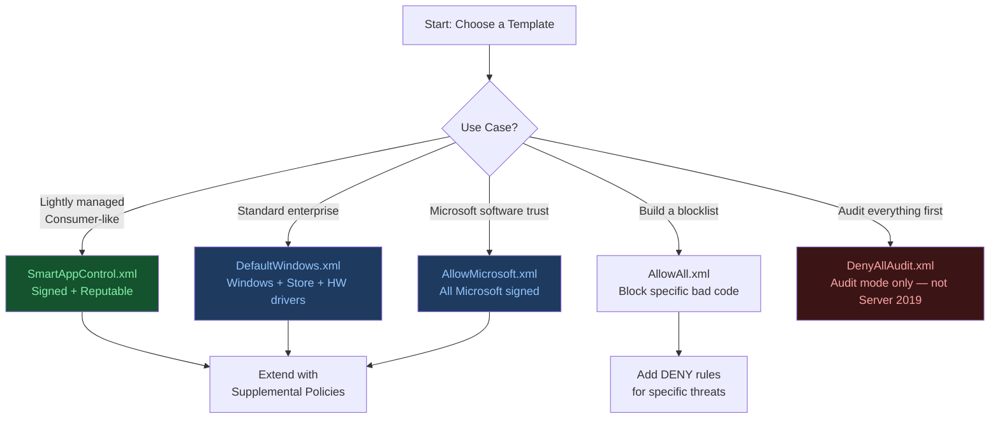
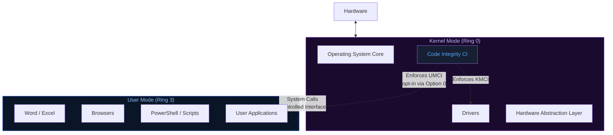
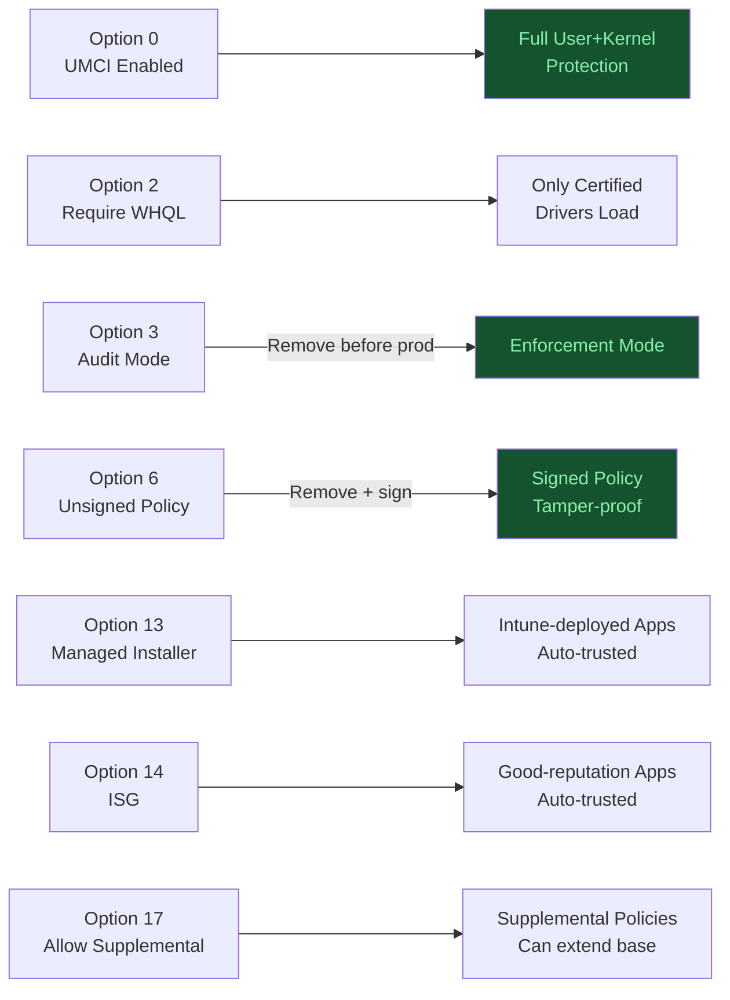
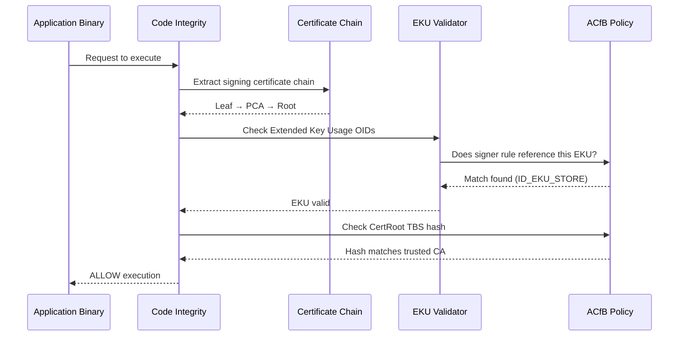
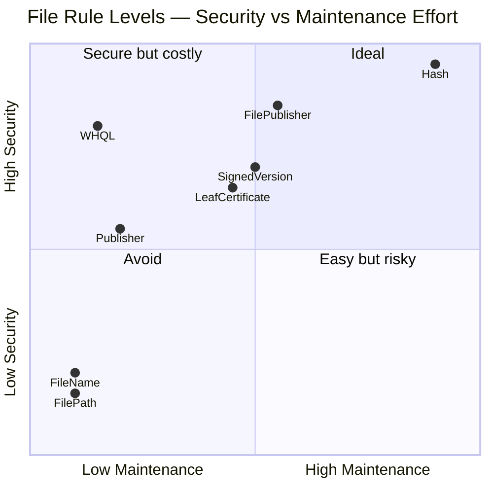
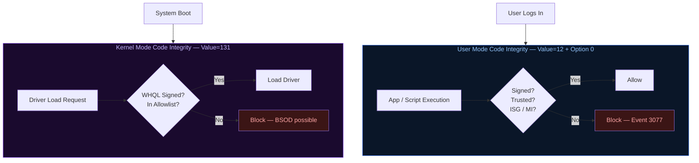
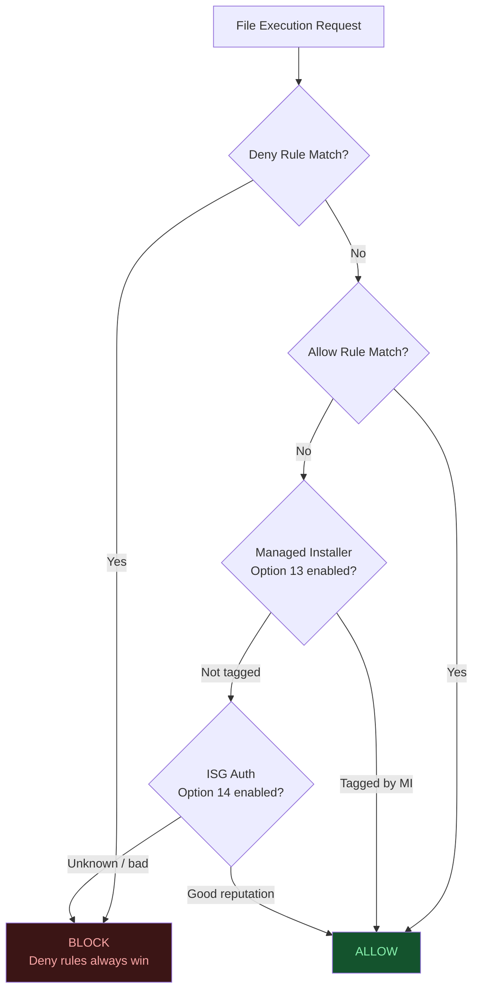

# Mastering App Control for Business
## Part 2: Policy Templates & Rule Options

**Author:** Anubhav Gain  
**Source:** ctrlshiftenter.cloud — Patrick Seltmann  
**Status:** Corporate Reference Document  
**Category:** Endpoint Security | Endpoint Management  

---

## Table of Contents

1. [Policy Templates](#1-policy-templates)
2. [Block Header Information](#2-block-header-information)
3. [Rule (Security) Options](#3-rule-security-options)
4. [EKU — Enhanced Key Usages](#4-eku--enhanced-key-usages)
5. [File Rules & Signer Rules](#5-file-rules--signer-rules)
6. [Signing Scenarios](#6-signing-scenarios)
7. [Update Policy Signers](#7-update-policy-signers)
8. [Allow vs. Deny Rule Processing Order](#8-allow-vs-deny-rule-processing-order)
9. [Complete Example Policy XML](#9-complete-example-policy-xml)

---

## 1. Policy Templates

Microsoft ships a set of **example base policies** with Windows and the WDAC Wizard. These serve as starting points for creating custom policies rather than writing from scratch.

### Base Policy Reference Table

| Policy File | Description | Primary Path(s) |
|---|---|---|
| **DefaultWindows_\*.xml** | Allows Windows components, third-party hardware/software kernel drivers, and Store apps. Basis for Intune deployments. | `%OSDrive%\Windows\schemas\CodeIntegrity\ExamplePolicies\DefaultWindows_*.xml` and `%ProgramFiles%\WindowsApps\Microsoft.WDAC.WDACWizard*\Templates\DefaultWindows_*.xml` |
| **AllowMicrosoft.xml** | Extends DefaultWindows with Microsoft product root certificate rules. | Same path pattern as DefaultWindows_\*.xml |
| **AllowAll.xml** | Permits everything. Useful as the base for blocklist-only policies — all block policies include this file plus explicit DENY rules. | `ExamplePolicies\AllowAll.xml` |
| **AllowAll_EnableHVCI.xml** | Enables memory integrity (HVCI) enforcement via App Control. | `ExamplePolicies\AllowAll_EnableHVCI.xml` |
| **DenyAllAudit.xml** | **WARNING:** Causes boot issues on Windows Server 2019 and earlier. Use in audit mode only, for tracking binaries on critical systems. | `ExamplePolicies\DenyAllAudit.xml` |
| **Microsoft Configuration Manager** | Policy XML generated by MECM's built-in App Control integration. | `%OSDrive%\Windows\CCM\DeviceGuard` on managed endpoint |
| **SmartAppControl.xml** | Based on Smart App Control; designed for lightly managed systems. Contains one unsupported rule that **must be removed** before enterprise use. See *Use the Smart App Control policy* in Microsoft docs. | `ExamplePolicies\SmartAppControl.xml` and `WDACWizard*\Templates\SignedReputable.xml` |
| **DefaultWindows_Supplemental.xml** | Example supplemental policy showing how to extend DefaultWindows_Audit.xml to allow a single Microsoft-signed file. | `ExamplePolicies\DefaultWindows_Supplemental.xml` |
| **Microsoft Recommended Block List** | Windows and Microsoft-signed code that Microsoft recommends blocking. | `WDACWizard*\Templates\Recommended_UserMode_Blocklist.xml` |
| **Microsoft recommended driver blocklist** | Blocks known vulnerable and malicious kernel drivers. | *Microsoft recommended driver block rules* docs, `ExamplePolicies\RecommendedDriverBlock_Enforced.xml`, and `WDACWizard*\Templates\Recommended_Driver_Blocklist.xml` |
| **Windows S mode** | Enforcement rules for Windows S mode. | `WDACWizard*\Templates\WinSiPolicy.xml.xml` |
| **Windows 11 SE** | Enforcement rules for Windows 11 SE (education/schools). | `WDACWizard*\Templates\WinSEPolicy.xml.xml` |

> **Recommendation:** Always start from a Microsoft-provided template rather than authoring a policy from scratch. The DefaultWindows or AllowMicrosoft templates are the recommended starting points for most enterprise deployments.



---

## 2. Block Header Information

Every App Control policy XML begins with a `<SiPolicy>` root element whose attributes define the policy's identity and behavior. The table below documents the key attributes using **AllowMicrosoft.xml** as the reference structure.

### XML Header Attributes

| Attribute | Purpose |
|---|---|
| **xmlns** | XML namespace used by the policy schema |
| **PolicyType** | Defines the policy type: `Base Policy` or `Supplemental Policy` |
| **VersionEx** | Policy version string — used for tracking and update management |
| **PolicyID** | Unique policy identifier in GUID format. No two active policies on a system may share the same PolicyID |
| **BasePolicyID** | For base policies, this is identical to PolicyID. For supplemental policies, this contains the PolicyID of the parent base policy |
| **PlatformID** | Identifies the target platform. Currently only one valid identifier exists: `{2E07F7E4-194C-4D20-B7C9-6F44A6C5A234}` (Windows) |

---

## 3. Rule (Security) Options

### User Mode vs. Kernel Mode

Understanding execution modes is essential for configuring App Control policy rule options correctly.

#### User Mode

- Limited access to hardware and firmware
- Lower privilege level than kernel mode
- Runs standard user applications: Word, Excel, browsers, video players
- Each application receives a **private memory space**
- Applications cannot access each other's data
- A crash in one application does not crash the system

#### Kernel Mode

- **Unlimited access** to hardware and firmware
- OS core functions execute here
- Controls and mediates system calls from user-mode processes
- Includes the **Hardware Abstraction Layer (HAL)** — the bridge between the OS and hardware
- All kernel-mode processes share the **same memory space**
- Includes the OS, system processes, and certain security components
- A crash in a kernel-mode process can affect the **entire system**

#### Key Differentiator from AppLocker

| Characteristic | App Control for Business | AppLocker |
|---|---|---|
| Default enforcement level | **Kernel mode** | User mode only |
| Opt-in to user mode | Yes — via `Enabled:UMCI` rule option | N/A |
| Policy scope | Device-scoped only | Device or user scoped |
| Protection depth | Deeper — kernel-level by default | Shallower — user-level only |



### Verify UMCI / KMCI Status

Use the following PowerShell command to check the current code integrity enforcement status:

```powershell
Get-CimInstance -ClassName Win32_DeviceGuard -Namespace root\Microsoft\Windows\DeviceGuard | select -Property codeintegrity | fl
```

**Returned values:**

| Value | Meaning |
|---|---|
| `0` | Disabled / not running |
| `1` | Audit mode |
| `2` | Enforcement mode |

### Rule Options Reference Table

All 21 rule options available in App Control for Business policies are documented below.

| Rule Option | Rule Number | Description | Valid in Supplemental Policies? |
|---|---|---|---|
| **Enabled:UMCI** | 0 | Enables User Mode Code Integrity — validates user-mode executables and scripts. By default, ACfB only restricts kernel-mode binaries. | No |
| **Enabled:Boot Menu Protection** | 1 | Currently not supported. | No |
| **Required:WHQL** | 2 | All drivers must be WHQL-signed. Removes legacy driver support. Kernel drivers for Windows 10+ should be WHQL certified. | No |
| **Enabled:Audit Mode** | 3 | Logs attempts to run applications, binaries, and scripts that would be blocked in enforced mode. Must be removed to enforce the policy. | No |
| **Disabled:Flight Signing** | 4 | Prevents execution of Windows Insider builds (flightroot-signed binaries). For organizations that want only released Windows versions in production. | No |
| **Enabled:Inherit Default Policy** | 5 | Reserved for future use. No current effect. | Yes |
| **Enabled:Unsigned System Integrity Policy** *(default)* | 6 | Allows unsigned policies to be deployed. When removed, all policies must be signed and `UpdatePolicySigners` must be specified. | Yes |
| **Allowed:Debug Policy Augmented** | 7 | Currently not supported. | Yes |
| **Required:EV Signers** | 8 | Requires kernel drivers to be WHQL-certified **and** signed with an Extended Verification (EV) certificate. | No |
| **Enabled:Advanced Boot Options Menu** | 9 | Enables the F8 boot menu (disabled by default in enforced policies). Useful for recovery scenarios but introduces a physical-access security risk. | No |
| **Enabled:Boot Audit on Failure** | 10 | If an enforcement-mode policy causes a boot-critical driver failure, automatically switches to audit mode to allow Windows to load. Failures are logged. | No |
| **Disabled:Script Enforcement** | 11 | Disables enforcement of scripts including PowerShell, wscript.exe, cscript.exe, mshta.exe, and MSXML. Note: some script hosts behave differently even in audit mode. | No |
| **Required:Enforce Store Applications** | 12 | ACfB policies also apply to UWP applications from the Microsoft Store. | No |
| **Enabled:Managed Installer** | 13 | Automatically trusts applications installed by a configured managed installer (SCCM, Intune). | Yes |
| **Enabled:Intelligent Security Graph Authorization** | 14 | Automatically trusts applications classified as "known good" by the Microsoft Intelligent Security Graph (ISG). | Yes |
| **Enabled:Invalidate EAs on Reboot** | 15 | When ISG authorization is enabled, forces periodic revalidation of file reputations by clearing extended file attributes on reboot. | No |
| **Enabled:Update Policy No Reboot** | 16 | Allows policy updates to apply without a system reboot. Requires Windows 10 1709+ or Server 2019+. | No |
| **Enabled:Allow Supplemental Policies** | 17 | Enables supplemental policies to extend the base policy without requiring a full policy replacement. Requires Windows 10 1903+ or Server 2022+. | No |
| **Disabled:Runtime FilePath Rule Protection** | 18 | Disables the default runtime check that restricts FilePath rules to admin-writable locations only. Requires Windows 10 1903+ or Server 2022+. | Yes |
| **Enabled:Dynamic Code Security** | 19 | Enforces ACfB on .NET applications and dynamically loaded libraries. Always enforced if any UMCI policy enables it. No audit mode available. Requires Windows 10 1803+ or Server 2019+. | No |
| **Enabled:Revoked Expired As Unsigned** | 20 | Treats binaries signed with revoked certificates or certificates with a Lifetime Signing EKU that have expired as unsigned — relevant in enterprise signing scenarios. | No |
| **Enabled:Developer Mode Dynamic Code Trust** | — | Allows UWP applications debugged in Visual Studio or deployed via Device Portal to be trusted when Developer Mode is active on the device. | No |



### Setting and Removing Rule Options via PowerShell

```powershell
# Set options (add to policy)
Set-RuleOption -FilePath policy.xml -Option 0,1,5

# Remove options (delete from policy)
Set-RuleOption -FilePath policy.xml -Option 0,1,5 -delete
```

---

## 4. EKU — Enhanced Key Usages

**Enhanced Key Usage (EKU)** is an X.509 certificate extension that defines what a certificate is authorized to do. Each EKU is identified by an **Object Identifier (OID)**.

### EKU Attributes

| Attribute | Description |
|---|---|
| **ID** | Internal ID for referencing the EKU within policies (e.g., `ID_EKU_STORE`, `ID_EKU_WHQL`, `ID_EKU_WINDOW`, `ID_EKU_ANYCUSTOMINFORMATION`) |
| **FriendlyName** | Human-readable display name (e.g., `Windows Store EKU`) |
| **Value** | Internal Microsoft identifier built from an encoded OID. Reference: *OBJECT IDENTIFIER – Win32 apps \| Microsoft Learn* |

### How EKUs Work with Signer Rules

EKUs act as a **whitelist** defining the functions a certificate is permitted to perform. In ACfB policy XML:

- EKUs are **almost always linked to a signer rule**
- If a signer rule references an EKU that does not exist in the policy, **the signer rule is rejected**

**Example:** A signer rule for `ID_SIGNER_STORE` defines the trusted CA `Microsoft MarketPlace PCA 2011`. A certificate from this CA is trusted **only if**:

1. It is issued by a root CA with TBS hash: `FC9EDE3DCCA09186B2D3BF9B738A2050CB1A554DA2DCADB55F3F72EE17721378`
2. The certificate contains EKU `ID_EKU_STORE` with `Value="010a2b0601040182374c0301"`

### OID Namespace

> OIDs beginning with `1.3.6.1.4.311` are from Microsoft. The authoritative Microsoft reference OID is `1.3.6.1.4.1.311`.

### OID Encoding Process

The `Value` attribute (e.g., `010a2b0601040182374c0301`) is derived from the encoded OID. The full encoding process is documented at: *OBJECT IDENTIFIER – Win32 apps \| Microsoft Learn*.

When **decoding** with Matt Greaber's script, replace the first two digits of the encoded value with `06` before processing.

### PowerShell Encode / Decode Scripts

The following scripts are available from the blog author's Azure DevOps repository:

- `Decode-OID.ps1` — decodes an encoded OID value back to its dotted-decimal form
- `Encode-OID.ps1` — encodes a dotted-decimal OID to the ACfB policy value format



---

## 5. File Rules & Signer Rules

### File Rules Overview

File rules define the **file attributes** that must be valid for a file to be trusted by the policy.

#### File Rule Attributes

| Attribute | Description |
|---|---|
| **ID** | Internal unique identifier for the rule |
| **FriendlyName** | Human-readable display name |
| **FileName** | The file name to match (e.g., `RefreshPolicy.exe`) |
| **MinimumFileVersion** | Minimum accepted file version for the rule to apply |

#### File Version Range Logic

| Condition | Behavior |
|---|---|
| Both Min and Max specified | Allow/Deny files where version >= Min **AND** <= Max |
| Min only | Allow files >= Min; Deny files <= Min |
| Max only | Allow files <= Max; Deny files >= Max |

### File Rule Levels

| Rule Level | Description |
|---|---|
| **Hash** | Authenticode/PE image hash per binary. Most specific, highest maintenance — hash changes on every application update. |
| **FileName** | Matches on original filename. Less specific than hash. Typically no policy update required when the binary updates. Uses `OriginalFileName` by default; use `-SpecificFileNameLevel` to match on alternatives such as `ProductName`. |
| **FilePath** | Allows binaries from specific paths. Requires Windows 10 1903+. **User mode only** — cannot allow kernel drivers via this level. |
| **SignedVersion** | Publisher rule combined with a minimum version number. |
| **Publisher** | PCA certificate + CN of leaf certificate. Trusts all files from a specific CA issued to a specific company. |
| **FilePublisher** | FileName + Publisher + minimum version. Trusts specific files from a specific publisher at or above a specified version. Uses `OriginalFileName` by default. |
| **LeafCertificate** | Matches on the individual signing certificate. No policy update needed for new app versions using the same cert; however, leaf certs have shorter validity periods. |
| **PcaCertificate** | Highest available certificate in the chain below the root. The scan does not resolve the full chain online. |
| **RootCertificate** | Not supported. |
| **WHQL** | Trusts only binaries submitted to and signed by the Windows Hardware Qualification Lab. Primarily used for kernel binaries. |
| **WHQLPublisher** | WHQL + CN on leaf certificate. Primarily for kernel binaries. |
| **WHQLFilePublisher** | FileName + WHQLPublisher + minimum version. Primarily for kernel binaries. |



---

### Hash-Based Rule

**Use:** Best for high-security environments where only exact, known-good binaries must run. Requires frequent policy updates whenever applications are updated, as the hash changes with every file modification.

```xml
<!-- Allow: Hash-Based File Rule -->
<FileRules>
    <FileAttrib ID="ID_FILE_HASH_EXAMPLE" FriendlyName="ExampleApplication.exe HashRule"
        FileName="ExampleApplication.exe" MinimumFileVersion="1.0.0.0">
        <Hash Type="SHA256" Value="A3F5E9D3C2B1A4E5F6D7A8C9B0E1F2D3A4B5C6D7E8F9A0B1C2D3E4F5A6B7C8D9" />
    </FileAttrib>
</FileRules>

<!-- Deny: Hash-Based File Rule -->
<FileRules>
    <Deny ID="ID_DENY_FILE_HASH" FriendlyName="Deny ExampleApplication.exe HashRule">
        <Hash Type="SHA256" Value="B3C5D7E9F2A4C6B8D1E3F5A7C9B0E2D4A6F8C1B2D3E5F7A9C0D1E2F3A4B5C6" />
    </Deny>
</FileRules>
```

---

### File Name-Based Rule

**Use:** Less strict than hash. No policy update needed when the file updates as long as the filename is unchanged. Less secure — a different binary with the same filename could be permitted.

```xml
<!-- Allow: File Name-Based Rule -->
<FileRules>
    <FileAttrib ID="ID_FILE_NAME_ALLOW" FriendlyName="Allow ExampleApplication.exe"
        FileName="ExampleApplication.exe" />
</FileRules>

<!-- Deny: File Name-Based Rule -->
<FileRules>
    <Deny ID="ID_DENY_FILE_NAME" FriendlyName="Deny ExampleApplication.exe"
        FileName="ExampleApplication.exe" />
</FileRules>
```

---

### File Path-Based Rule

**Use:** Permits all files within a specific folder path. Provides low administrative overhead but offers less control — any file placed in the allowed directory will be permitted to run.

```xml
<!-- Allow: File Path-Based Rule -->
<FileRules>
    <FileAttrib ID="ID_FILE_PATH_EXAMPLE" FriendlyName="ExampleApp FilePathRule"
        FilePath="C:\Program Files\ExampleApp\" />
</FileRules>

<!-- Deny: File Path-Based Rule -->
<FileRules>
    <Deny ID="ID_DENY_FILE_PATH" FriendlyName="Deny Execution from Downloads"
        FilePath="C:\Users\Public\Downloads\" />
</FileRules>
```

---

### Signed Version-Based Rule

**Use:** Ensures only newer, signed versions of an application can run. Reduces policy update frequency compared to hash rules. Requires a valid signing certificate throughout the software lifecycle.

```xml
<Signers>
    <Signer ID="ID_SIGNER_EXAMPLE" Name="Example Corp">
        <CertRoot Type="PcaCertificate" Value="A1B2C3D4E5F6G7H8I9J0K1L2M3N4O5P6" />
    </Signer>
</Signers>

<FileRules>
    <FileAttrib ID="ID_SIGNED_VERSION_ALLOW" FriendlyName="Allow ExampleApplication.exe Signed Version Rule"
        FileName="ExampleApplication.exe" MinimumFileVersion="2.0.0.0">
        <SignerRef SignerID="ID_SIGNER_EXAMPLE" />
    </FileAttrib>
</FileRules>
```

---

### Publisher-Based Rule

**Use:** Trusts all software signed by a specific vendor (e.g., Microsoft, Adobe). Broad trust for a known publisher. If the vendor rotates or updates their signing certificates, the policy requires updating.

```xml
<Signers>
    <Signer ID="ID_SIGNER_TRUSTED_PUBLISHER" Name="Trusted Publisher">
        <CertRoot Type="PcaCertificate" Value="ABCDEF1234567890ABCDEF1234567890ABCDEF12" />
    </Signer>
</Signers>

<SigningScenarios>
    <SigningScenario Value="12" ID="ID_SIGNINGSCENARIO_ALLOW_TRUSTED_PUBLISHER"
        FriendlyName="Allow Trusted Publisher">
        <ProductSigners>
            <AllowedSigners>
                <AllowedSigner SignerId="ID_SIGNER_TRUSTED_PUBLISHER" />
            </AllowedSigners>
        </ProductSigners>
    </SigningScenario>
</SigningScenarios>
```

---

### File Publisher Rule

**Use:** The most recommended rule level for precision. Combines FileName + Publisher + minimum version — trusts only a specific file from a specific publisher at or above a specific version.

```xml
<!-- Allow: File Publisher Rule -->
<Signers>
    <Signer ID="ID_SIGNER_FILEPUBLISHER" Name="Example Corp Publisher">
        <CertRoot Type="PcaCertificate" Value="ABCDEF1234567890ABCDEF1234567890ABCDEF12" />
        <FileAttribRef RuleID="ID_FILE_FILEPUBLISHER_ALLOW" />
    </Signer>
</Signers>

<FileRules>
    <FileAttrib ID="ID_FILE_FILEPUBLISHER_ALLOW" FriendlyName="Allow ExampleApp.exe FilePublisher"
        FileName="ExampleApplication.exe" MinimumFileVersion="2.0.0.0" />
</FileRules>

<!-- Deny: File Publisher Rule -->
<Signers>
    <Signer ID="ID_SIGNER_FILEPUBLISHER_DENY" Name="Denied Publisher">
        <CertRoot Type="PcaCertificate" Value="FEDCBA9876543210FEDCBA9876543210FEDCBA98" />
        <FileAttribRef RuleID="ID_FILE_FILEPUBLISHER_DENY" />
    </Signer>
</Signers>

<FileRules>
    <Deny ID="ID_FILE_FILEPUBLISHER_DENY" FriendlyName="Deny DeniedApp.exe FilePublisher"
        FileName="DeniedApplication.exe" MinimumFileVersion="0.0.0.0" />
</FileRules>
```

---

### Leaf Certificate-Based Rule

**Use:** Allows any software signed with a specific individual signing certificate. No policy update is required for new application versions as long as the same certificate is used. However, leaf certificates have shorter validity periods than CA certificates — the policy must be updated when the certificate expires.

```xml
<Signers>
    <Signer ID="ID_SIGNER_LEAF" Name="Example Leaf Certificate Signer">
        <CertRoot Type="LeafCertificate" Value="ABCDEF1234567890ABCDEF1234567890ABCDEF12" />
    </Signer>
</Signers>
```

---

### PCA Certificate-Based Rule

**Use:** Trusts all software signed by a specific Certificate Authority at the PCA level — one level below the root in the certificate chain. Provides broad trust for all certificates issued by a corporate or vendor CA. The policy scan does not resolve the full chain online.

```xml
<Signers>
    <Signer ID="ID_SIGNER_PCA" Name="Corporate CA Signer">
        <CertRoot Type="PcaCertificate" Value="ABCDEF1234567890ABCDEF1234567890ABCDEF12" />
    </Signer>
</Signers>
```

---

### WHQL-Signed Rule

**Use:** Restricts kernel-mode drivers to those validated and signed by the **Windows Hardware Quality Labs**. Prevents malware-infected or untrusted drivers from loading at the kernel level. Reduces system crash risk from incompatible or unvalidated drivers.

```xml
<FileRules>
    <FileAttrib ID="ID_WHQL_EXAMPLE" FriendlyName="WHQL Only Drivers">
        <WHQL />
    </FileAttrib>
</FileRules>
```

---

### WHQL Publisher Rule

**Use:** Restricts WHQL-certified drivers further to those from a specific vendor's CN only. More restrictive than WHQL alone — suitable for environments with standardized hardware.

| Use Case | Example |
|---|---|
| Restricting GPU drivers | Allow only NVIDIA WHQL-certified drivers |
| Standardizing network drivers | Ensure only Intel-certified NIC drivers are installed |
| Restricting peripheral drivers | Allow only approved keyboard/mouse manufacturer WHQL drivers |

```xml
<Signers>
    <Signer ID="ID_SIGNER_WHQL_PUBLISHER" Name="NVIDIA WHQL Publisher">
        <CertRoot Type="Whql" Value="ABCDEF1234567890ABCDEF1234567890ABCDEF12" />
        <CertPublisher Value="NVIDIA Corporation" />
    </Signer>
</Signers>
```

---

## 6. Signing Scenarios

Signing scenarios define whether a given set of signer rules applies to **kernel-mode** or **user-mode** code. Each signing scenario is identified by a numeric `Value` attribute.

### Kernel Mode Code Integrity (KMCI) — Value="131"

Prevents the loading of unsigned, modified, or untrusted kernel-mode drivers. Because the kernel operates at the highest privilege level, a compromised kernel driver can result in complete system takeover.

```xml
<SigningScenarios>
    <SigningScenario Value="131" ID="ID_SIGNINGSCENARIO_KMCI"
        FriendlyName="Kernel Mode Signing Scenario">
        <ProductSigners>
            <AllowedSigners>
                <AllowedSigner SignerId="ID_SIGNER_MICROSOFT_PRODUCT_1997" />
                <AllowedSigner SignerId="ID_SIGNER_MICROSOFT_PRODUCT_2001" />
            </AllowedSigners>
        </ProductSigners>
    </SigningScenario>
</SigningScenarios>
```

### User Mode Code Integrity (UMCI) — Value="12"

Enforces security at the application and script execution level. Ensures only signed, approved executables can run. Restricts PowerShell, JavaScript, and VBScript to trusted sources. Blocks scripting-based attacks and unsigned application execution.

> **Prerequisite:** The `Enabled:UMCI` rule option (Option 0) must be present in the policy for UMCI signing scenarios to take effect.

```xml
<SigningScenarios>
    <SigningScenario Value="12" ID="ID_SIGNINGSCENARIO_UMCI"
        FriendlyName="User Mode Signing Scenario">
        <ProductSigners>
            <AllowedSigners>
                <AllowedSigner SignerId="ID_SIGNER_MICROSOFT_PRODUCT_1997_UMCI" />
                <AllowedSigner SignerId="ID_SIGNER_MICROSOFT_PRODUCT_2001_UMCI" />
            </AllowedSigners>
        </ProductSigners>
    </SigningScenario>
</SigningScenarios>
```



---

## 7. Update Policy Signers

When **Option 6** (`Enabled:Unsigned System Integrity Policy`) is removed from the policy, all policies must be cryptographically signed. In this configuration, the `<UpdatePolicySigners>` section specifies which certificates are authorized to update the policy in the future.

> **Important:** If Option 6 is removed without correctly configuring `UpdatePolicySigners`, the policy becomes unmodifiable and may permanently lock the system. Validate this configuration thoroughly in audit mode before enforcing.

```xml
<UpdatePolicySigners>
    <Signer ID="ID_SIGNER_IT_ADMIN" Name="Corporate IT Security Administrator">
        <CertRoot Type="CustomCodeCertificate" Value="ABCDEF1234567890ABCDEF1234567890ABCDEF12" />
    </Signer>
</UpdatePolicySigners>
```

---

## 8. Allow vs. Deny Rule Processing Order

App Control for Business evaluates rules in a **fixed order**. Understanding this order is critical for writing correct policies and diagnosing unexpected allow or block behavior.

### Processing Sequence

| Step | Action |
|---|---|
| 1 | Check all **deny rules** — deny rules are evaluated first |
| 2 | Process **allow rules** |
| 3 | If no deny or allow rule matches, check **Managed Installer** approval (if the policy enables it) |
| 4 | If still no match, fall back to **ISG** reputation check (if permitted by policy) |

> **Note:** A deny rule always wins. If a file matches both a deny rule and an allow rule, the file is blocked.

### Operational Recommendation

Use **separate ALLOW and DENY policies** on Windows versions that support multiple active App Control policies. Keeping allow and deny logic in distinct policy files makes policies easier to read, audit, and maintain over time.



---

## 9. Complete Example Policy XML

The following is a comprehensive example policy XML demonstrating all major rule types covered in this document. Each section is annotated with inline comments.

```xml
<?xml version="1.0" encoding="utf-8"?>
<SiPolicy xmlns="urn:schemas-microsoft-com:sipolicy"
          PolicyType="Base Policy"
          VersionEx="1.0.0.0"
          PolicyID="{A1B2C3D4-E5F6-7890-ABCD-EF1234567890}"
          BasePolicyID="{A1B2C3D4-E5F6-7890-ABCD-EF1234567890}"
          PlatformID="{2E07F7E4-194C-4D20-B7C9-6F44A6C5A234}">

    <!-- =====================================================================
         RULE OPTIONS
         Defines the behavioral options for this policy.
         Option 3  = Audit Mode (log-only; remove to enforce)
         Option 6  = Allow unsigned policies (default; remove to require signing)
         Option 13 = Trust Managed Installer (Intune / SCCM)
         Option 17 = Allow supplemental policies to extend this base policy
         ===================================================================== -->
    <Rules>
        <Rule>
            <Option>Enabled:Audit Mode</Option>         <!-- Option 3 -->
        </Rule>
        <Rule>
            <Option>Enabled:Unsigned System Integrity Policy</Option> <!-- Option 6 -->
        </Rule>
        <Rule>
            <Option>Enabled:Managed Installer</Option>  <!-- Option 13 -->
        </Rule>
        <Rule>
            <Option>Enabled:Allow Supplemental Policies</Option> <!-- Option 17 -->
        </Rule>
    </Rules>

    <!-- =====================================================================
         EKUs — ENHANCED KEY USAGES
         Defines the certificate usages that signer rules may reference.
         ===================================================================== -->
    <EKUs>
        <EKU ID="ID_EKU_WINDOWS_STORE"
             FriendlyName="Windows Store EKU"
             Value="010a2b0601040182374c0301" />
        <EKU ID="ID_EKU_WHQL"
             FriendlyName="Windows Hardware Quality Labs EKU"
             Value="010a2b0601040182370a030b" />
    </EKUs>

    <!-- =====================================================================
         FILE RULES
         Defines per-file trust conditions.
         ===================================================================== -->
    <FileRules>

        <!-- 1. Hash-based allow rule — most specific, tied to exact binary content -->
        <FileAttrib ID="ID_FILE_HASH_EXAMPLE"
                    FriendlyName="ExampleApplication.exe HashRule"
                    FileName="ExampleApplication.exe"
                    MinimumFileVersion="1.0.0.0">
            <Hash Type="SHA256"
                  Value="A3F5E9D3C2B1A4E5F6D7A8C9B0E1F2D3A4B5C6D7E8F9A0B1C2D3E4F5A6B7C8D9" />
        </FileAttrib>

        <!-- 2. Hash-based deny rule — explicitly blocks a specific binary -->
        <Deny ID="ID_DENY_FILE_HASH"
              FriendlyName="Deny ExampleApplication.exe HashRule">
            <Hash Type="SHA256"
                  Value="B3C5D7E9F2A4C6B8D1E3F5A7C9B0E2D4A6F8C1B2D3E5F7A9C0D1E2F3A4B5C6" />
        </Deny>

        <!-- 3. File name-based allow rule — less specific; no update on rename-free upgrades -->
        <FileAttrib ID="ID_FILE_NAME_ALLOW"
                    FriendlyName="Allow ExampleApplication.exe by Name"
                    FileName="ExampleApplication.exe" />

        <!-- 4. File name-based deny rule -->
        <Deny ID="ID_DENY_FILE_NAME"
              FriendlyName="Deny ExampleApplication.exe by Name"
              FileName="ExampleApplication.exe" />

        <!-- 5. File path-based allow rule — permits any file under this path -->
        <FileAttrib ID="ID_FILE_PATH_ALLOW"
                    FriendlyName="Allow files in Program Files\ExampleApp"
                    FilePath="C:\Program Files\ExampleApp\" />

        <!-- 6. File path-based deny rule — blocks execution from a user-writable location -->
        <Deny ID="ID_DENY_FILE_PATH"
              FriendlyName="Deny Execution from Downloads"
              FilePath="C:\Users\Public\Downloads\" />

        <!-- 7. Signed version allow rule — tied to signer below; minimum version enforced -->
        <FileAttrib ID="ID_SIGNED_VERSION_ALLOW"
                    FriendlyName="Allow ExampleApplication.exe v2+ Signed"
                    FileName="ExampleApplication.exe"
                    MinimumFileVersion="2.0.0.0">
            <SignerRef SignerID="ID_SIGNER_EXAMPLE_CORP" />
        </FileAttrib>

        <!-- 8. File publisher allow rule — FileName + Publisher + MinVersion (most recommended) -->
        <FileAttrib ID="ID_FILE_FILEPUBLISHER_ALLOW"
                    FriendlyName="Allow ExampleApplication.exe FilePublisher"
                    FileName="ExampleApplication.exe"
                    MinimumFileVersion="2.0.0.0" />

        <!-- 9. WHQL-only driver rule — kernel drivers must be WHQL-certified -->
        <FileAttrib ID="ID_WHQL_EXAMPLE"
                    FriendlyName="WHQL Only Drivers">
            <WHQL />
        </FileAttrib>

    </FileRules>

    <!-- =====================================================================
         SIGNERS
         Defines trusted signing identities referenced by signing scenarios
         and file publisher rules.
         ===================================================================== -->
    <Signers>

        <!-- Publisher-level signer: trusts all files from Example Corp's PCA -->
        <Signer ID="ID_SIGNER_EXAMPLE_CORP" Name="Example Corp">
            <CertRoot Type="PcaCertificate"
                      Value="A1B2C3D4E5F6G7H8I9J0K1L2M3N4O5P6" />
        </Signer>

        <!-- FilePublisher signer: FileName + PCA + MinVersion (allow) -->
        <Signer ID="ID_SIGNER_FILEPUBLISHER_ALLOW" Name="Example Corp Publisher">
            <CertRoot Type="PcaCertificate"
                      Value="ABCDEF1234567890ABCDEF1234567890ABCDEF12" />
            <FileAttribRef RuleID="ID_FILE_FILEPUBLISHER_ALLOW" />
        </Signer>

        <!-- Leaf certificate signer: trusts a specific signing certificate -->
        <Signer ID="ID_SIGNER_LEAF" Name="Example Leaf Certificate Signer">
            <CertRoot Type="LeafCertificate"
                      Value="ABCDEF1234567890ABCDEF1234567890ABCDEF12" />
        </Signer>

        <!-- WHQL Publisher signer: WHQL-certified + specific vendor CN -->
        <Signer ID="ID_SIGNER_WHQL_PUBLISHER" Name="NVIDIA WHQL Publisher">
            <CertRoot Type="Whql"
                      Value="ABCDEF1234567890ABCDEF1234567890ABCDEF12" />
            <CertPublisher Value="NVIDIA Corporation" />
        </Signer>

        <!-- Trusted publisher signer: broad vendor trust via PCA -->
        <Signer ID="ID_SIGNER_TRUSTED_PUBLISHER" Name="Trusted Publisher">
            <CertRoot Type="PcaCertificate"
                      Value="ABCDEF1234567890ABCDEF1234567890ABCDEF12" />
        </Signer>

        <!-- Microsoft product signers for KMCI and UMCI -->
        <Signer ID="ID_SIGNER_MICROSOFT_PRODUCT_1997" Name="Microsoft Product 1997">
            <CertRoot Type="PcaCertificate"
                      Value="1111111111111111111111111111111111111111" />
        </Signer>
        <Signer ID="ID_SIGNER_MICROSOFT_PRODUCT_2001" Name="Microsoft Product 2001">
            <CertRoot Type="PcaCertificate"
                      Value="2222222222222222222222222222222222222222" />
        </Signer>
        <Signer ID="ID_SIGNER_MICROSOFT_PRODUCT_1997_UMCI" Name="Microsoft Product 1997 (UMCI)">
            <CertRoot Type="PcaCertificate"
                      Value="1111111111111111111111111111111111111111" />
        </Signer>
        <Signer ID="ID_SIGNER_MICROSOFT_PRODUCT_2001_UMCI" Name="Microsoft Product 2001 (UMCI)">
            <CertRoot Type="PcaCertificate"
                      Value="2222222222222222222222222222222222222222" />
        </Signer>

    </Signers>

    <!-- =====================================================================
         SIGNING SCENARIOS
         Defines which signers are trusted for kernel-mode (131) and
         user-mode (12) code respectively.
         ===================================================================== -->
    <SigningScenarios>

        <!-- KMCI — Value="131": Kernel Mode Code Integrity
             Prevents loading unsigned/untrusted kernel-mode drivers.
             A compromised kernel driver = full system takeover. -->
        <SigningScenario Value="131" ID="ID_SIGNINGSCENARIO_KMCI"
                         FriendlyName="Kernel Mode Signing Scenario">
            <ProductSigners>
                <AllowedSigners>
                    <AllowedSigner SignerId="ID_SIGNER_MICROSOFT_PRODUCT_1997" />
                    <AllowedSigner SignerId="ID_SIGNER_MICROSOFT_PRODUCT_2001" />
                    <AllowedSigner SignerId="ID_SIGNER_WHQL_PUBLISHER" />
                </AllowedSigners>
            </ProductSigners>
        </SigningScenario>

        <!-- UMCI — Value="12": User Mode Code Integrity
             Enforces code signing for executables and scripts.
             Requires Enabled:UMCI (Option 0) in the Rules section. -->
        <SigningScenario Value="12" ID="ID_SIGNINGSCENARIO_UMCI"
                         FriendlyName="User Mode Signing Scenario">
            <ProductSigners>
                <AllowedSigners>
                    <AllowedSigner SignerId="ID_SIGNER_MICROSOFT_PRODUCT_1997_UMCI" />
                    <AllowedSigner SignerId="ID_SIGNER_MICROSOFT_PRODUCT_2001_UMCI" />
                    <AllowedSigner SignerId="ID_SIGNER_FILEPUBLISHER_ALLOW" />
                    <AllowedSigner SignerId="ID_SIGNER_TRUSTED_PUBLISHER" />
                    <AllowedSigner SignerId="ID_SIGNER_EXAMPLE_CORP" />
                    <AllowedSigner SignerId="ID_SIGNER_LEAF" />
                </AllowedSigners>
                <DeniedSigners>
                    <!-- Add denied signer IDs here as needed -->
                </DeniedSigners>
                <FileRulesRef>
                    <FileRuleRef RuleID="ID_FILE_HASH_EXAMPLE" />
                    <FileRuleRef RuleID="ID_DENY_FILE_HASH" />
                    <FileRuleRef RuleID="ID_FILE_NAME_ALLOW" />
                    <FileRuleRef RuleID="ID_DENY_FILE_NAME" />
                    <FileRuleRef RuleID="ID_FILE_PATH_ALLOW" />
                    <FileRuleRef RuleID="ID_DENY_FILE_PATH" />
                    <FileRuleRef RuleID="ID_SIGNED_VERSION_ALLOW" />
                    <FileRuleRef RuleID="ID_FILE_FILEPUBLISHER_ALLOW" />
                </FileRulesRef>
            </ProductSigners>
        </SigningScenario>

    </SigningScenarios>

    <!-- =====================================================================
         UPDATE POLICY SIGNERS
         Specifies which certificates are authorized to update this policy.
         Required when Option 6 (Unsigned System Integrity Policy) is removed.
         ===================================================================== -->
    <UpdatePolicySigners>
        <Signer ID="ID_SIGNER_IT_ADMIN" Name="Corporate IT Security Administrator">
            <CertRoot Type="CustomCodeCertificate"
                      Value="ABCDEF1234567890ABCDEF1234567890ABCDEF12" />
        </Signer>
    </UpdatePolicySigners>

</SiPolicy>
```

> **Note:** All certificate `Value` attributes in this example are illustrative placeholders. Replace them with the actual TBS hash or certificate thumbprint values from your environment.

---

## Series Navigation

| Part | Topic |
|------|-------|
| Part 1 | Introduction & Key Concepts |
| **Part 2** | Policy Templates & Rule Options *(this document)* |
| Part 3 | Application ID Tagging Policies & Managed Installer |
| Part 4 | *(forthcoming)* |
| Part 5 | *(forthcoming)* |
| Part 6 | Sign, Apply, and Remove Signed Policies |
| Part 7 | Maintaining Policies with Azure DevOps (or PowerShell) |

---

*Document compiled by Anubhav Gain from source material published at ctrlshiftenter.cloud.*  
*Original author: Patrick Seltmann. For organizational reference use.*
