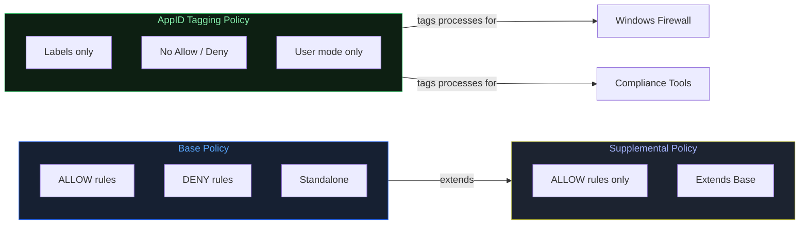
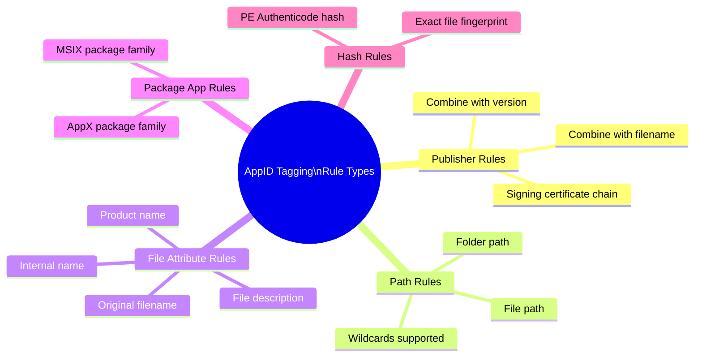
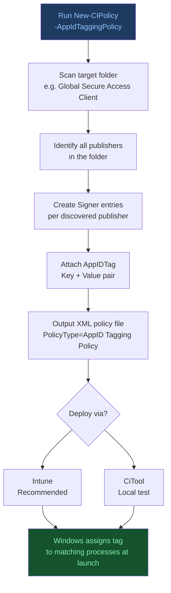
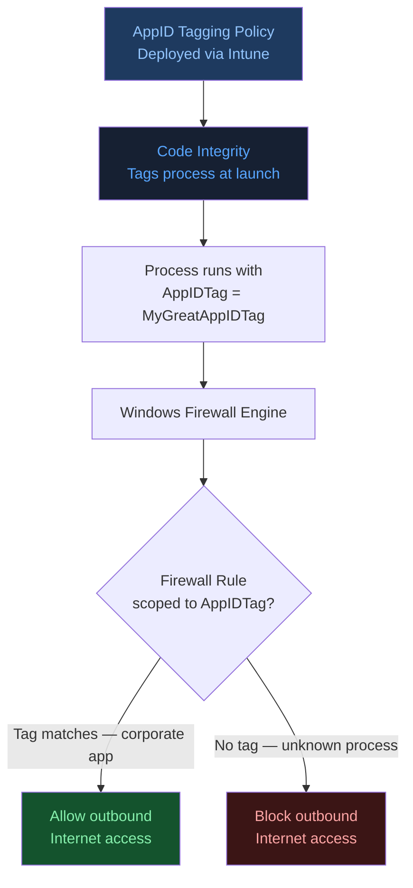
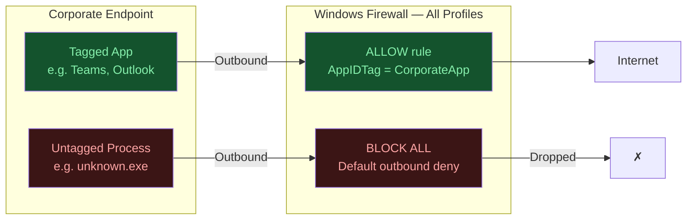
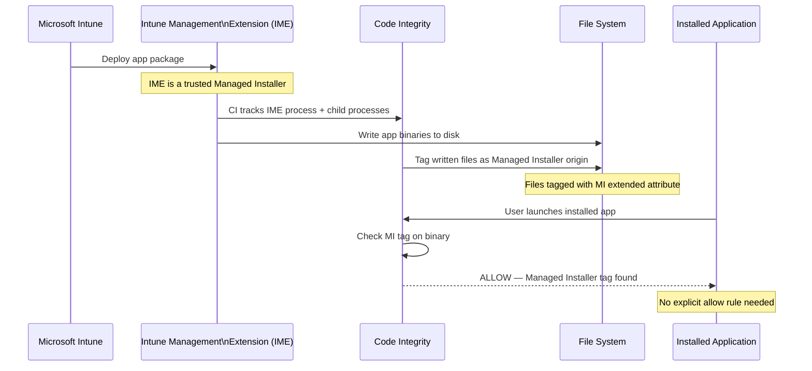
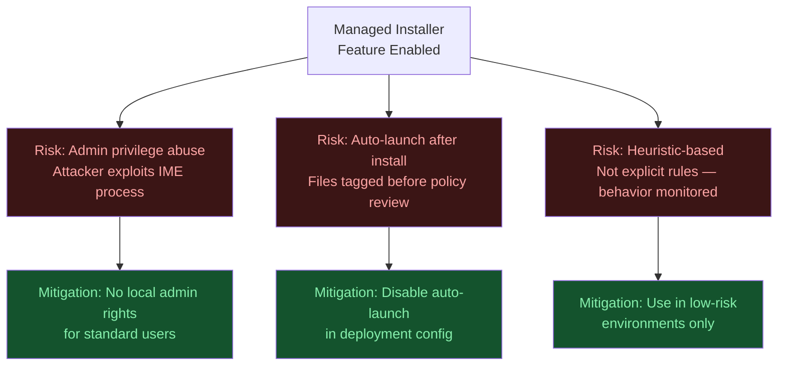

# Mastering App Control for Business
## Part 3: Application ID Tagging Policies & Managed Installer

**Author:** Anubhav Gain  
**Source:** ctrlshiftenter.cloud — Patrick Seltmann  
**Status:** Corporate Reference Document  
**Category:** Endpoint Security | Endpoint Management  

---

## Table of Contents

1. [Application ID Tagging Policy](#1-application-id-tagging-policy)
2. [Platform Requirements](#2-platform-requirements)
3. [Supported Rule Types](#3-supported-rule-types)
4. [Creating a Tagging Policy via PowerShell](#4-creating-a-tagging-policy-via-powershell)
5. [Example Tagging Policy XML Output](#5-example-tagging-policy-xml-output)
6. [Windows Firewall and Application ID Tagging](#6-windows-firewall-and-application-id-tagging)
7. [Block Outbound Traffic by Default — Allow Only Tagged Processes](#7-block-outbound-traffic-by-default--allow-only-tagged-processes)
8. [Managed Installer](#8-managed-installer)
9. [How Managed Installer Works](#9-how-managed-installer-works)
10. [Security Considerations](#10-security-considerations)
11. [Enabling Managed Installer in Intune](#11-enabling-managed-installer-in-intune)

---

## 1. Application ID Tagging Policy

AppID Tagging Policies do **not** allow or block execution. They tag applications and files based on predefined rules using custom labels. Because no enforcement decision is made, they can only be used in conjunction with **user-mode policy rules**.

Tags can be any alphanumeric string including symbols such as `: / , . _`

> **Key distinction:** An AppID Tagging Policy is purely a labeling mechanism. Enforcement decisions belong to the base or supplemental policy — or to systems such as Windows Firewall that consume those tags.



---

## 2. Platform Requirements

### Client

| Platform | Minimum Version |
|----------|----------------|
| Windows 10 | 20H1 and newer |
| Windows 11 | All versions |

### Server

| Platform | Minimum Version |
|----------|----------------|
| Windows Server | 2022 and newer |

---

## 3. Supported Rule Types

| Rule Type | Description |
|-----------|-------------|
| **Publisher** | Based on the signing certificate chain. Can be combined with original filename and version number for additional precision. |
| **Path** | Based on file path or folder path. Wildcards are supported. |
| **File Attribute** | Targets fixed file properties: original filename, file description, product name, or internal name. |
| **Package App Name** | Based on the package family name of an AppX or MSIX application. |
| **Hash** | Matches files using the PE Authenticode hash — a unique fingerprint of the file. |



---

## 4. Creating a Tagging Policy via PowerShell

The following example creates a tagging policy targeting the **Global Secure Access Client**, scanning its installation directory and applying a custom key/value tag:

```powershell
New-CIPolicy -Level Publisher -ScanPath "C:\Program Files\Global Secure Access Client" -AppIdTaggingPolicy -AppIdTaggingKey "MyCustomKey" -AppIdTaggingValue "MyGreatAppTagID"
```



> **Note:** The scanning process may take several minutes and can trigger antivirus activity on the scanned directory. Plan maintenance windows accordingly or configure antivirus exclusions for the scan path during policy creation.

---

## 5. Example Tagging Policy XML Output

The command in Section 4 produces an XML policy file with `PolicyType="AppID Tagging Policy"`. The structure below illustrates a publisher-based tagging policy with a custom `AppIDTag` applied to a signing scenario:

```xml
<?xml version="1.0" encoding="utf-8"?>
<SiPolicy xmlns="urn:schemas-microsoft-com:sipolicy" PolicyType="AppID Tagging Policy">
  <VersionEx>10.0.0.0</VersionEx>
  <PlatformID>{2E07F7E4-194C-4D20-B7C9-6F44A6C5A234}</PlatformID>
  <Rules>
    <Rule>
      <Option>Enabled:Unsigned System Integrity Policy</Option>
    </Rule>
  </Rules>
  <EKUs />
  <FileRules />
  <Signers>
    <Signer ID="ID_SIGNER_S_53" Name="Microsoft Code Signing PCA 2011">
      <CertRoot Type="TBS" Value="F6F717A43AD9ABDDC8CEFDDE1C505462535E7D1307E630F9544A2D14FE8BF26E" />
      <CertPublisher Value="Microsoft Corporation" />
    </Signer>
    <Signer ID="ID_SIGNER_S_54" Name="Microsoft Windows Third Party Component CA 2012">
      <CertRoot Type="TBS" Value="CEC1AFD0E310C55C1DCC601AB8E172917706AA32FB5EAF826813547FDF02DD46" />
      <CertPublisher Value="Microsoft Windows Hardware Compatibility Publisher" />
    </Signer>
  </Signers>
  <SigningScenarios>
    <SigningScenario Value="12" ID="ID_SIGNINGSCENARIO_WINDOWS" FriendlyName="Auto generated policy on 03-29-2025">
      <ProductSigners>
        <AllowedSigners>
          <AllowedSigner SignerId="ID_SIGNER_S_53" />
          <AllowedSigner SignerId="ID_SIGNER_S_54" />
        </AllowedSigners>
      </ProductSigners>
      <AppIDTags>
        <AppIDTag Key="MyCustomKey" Value="MyGreatAppIDTag" />
      </AppIDTags>
    </SigningScenario>
  </SigningScenarios>
  <UpdatePolicySigners />
  <PolicyTypeID>{A244370E-44C9-4C06-B551-F6016E563076}</PolicyTypeID>
</SiPolicy>
```

### XML Structure Highlights

| Element | Purpose |
|---------|---------|
| `PolicyType="AppID Tagging Policy"` | Identifies the policy as a tagging-only policy — no allow/deny enforcement. |
| `<AppIDTag Key="..." Value="..." />` | The custom label applied to processes matching the signing scenario. |
| `<SigningScenario Value="12">` | Defines the user-mode signing context. AppID Tagging Policies operate in user mode only. |
| `<PolicyTypeID>` | GUID that uniquely distinguishes this as an AppID Tagging Policy type. |

---

## 6. Windows Firewall and Application ID Tagging

Windows Firewall has native support for AppID Tagging Policies. Firewall rules can be scoped to an application or a group of applications defined in base or supplemental policies.

When an application is launched, App Control for Business assigns the configured **Application ID Tag** to the process. Windows Firewall then matches that tag against its rule set — **without requiring absolute file paths or path variables**.

### Key Capability

You can tag Windows OS components and corporate business applications using an AppID Tagging Policy. Based on those tags, Windows Firewall rules can:

- Allow outbound internet access **only** for explicitly trusted, tagged applications
- Block all other outbound internet traffic from the endpoint
- Conversely, block specific tagged applications while permitting all other traffic

### Firewall + AppID Tagging Architecture

```
[ Application Launched ]
         |
         v
[ ACfB AppID Tagging Policy ]
   --> Tags process with custom AppIDTag
         |
         v
[ Windows Firewall Rule ]
   --> Matches rule by AppIDTag
   --> Allow / Block outbound traffic
```

This removes the operational burden of maintaining explicit file path lists in firewall rules and makes the ruleset resilient to application updates or path changes.



---

## 7. Block Outbound Traffic by Default — Allow Only Tagged Processes

> **WARNING:** This configuration enforces a default-deny outbound posture. Act with caution. Validate thoroughly in a pilot environment before broad deployment. Misconfiguration can disrupt legitimate business applications and network-dependent workloads.

### Deployment Guidance

| Step | Action |
|------|--------|
| 1 | Define and deploy an AppID Tagging Policy for all trusted applications that require internet access. |
| 2 | Configure Windows Firewall base settings to **block outbound** traffic by default. |
| 3 | Create Windows Firewall Rule Policies that **allow outbound** traffic only for processes carrying the trusted AppID Tag. |
| 4 | Apply configuration to **domain, private, AND public** network profiles to ensure consistent enforcement across all network contexts. |
| 5 | Roll out to a pilot group first. Monitor Event Viewer and MDE alerts before expanding. |

> **Profile coverage is mandatory.** Applying the block-by-default rule only to the domain profile leaves endpoints exposed on public networks — a common misconfiguration in mobile and remote-work scenarios.



---

## 8. Managed Installer

A Managed Installer is configured using a mechanism similar to an AppID Tagging Policy. It enables **automatic allowlisting** of applications deployed through Microsoft Intune Management Extension — without requiring administrators to manually create explicit allow rules for every deployed application.

> **Current limitation:** At the time of writing, **Microsoft Intune is the only supported Managed Installer**. No other deployment system can be designated as a Managed Installer through the standard Intune configuration workflow.

---

## 9. How Managed Installer Works

When the Managed Installer feature is active, Windows tracks the origin of files written to disk during software deployment:

| Step | Description |
|------|-------------|
| **1. Installer Execution** | A trusted installer binary is executed by Microsoft Intune Management Extension. Windows begins tracking the process and all child processes spawned from it. |
| **2. File Origin Tagging** | Any files written to disk by the tracked process are tagged internally as originating from the Managed Installer. |
| **3. Automatic Trust** | If the App Control policy has **`Enabled:Managed Installer` (Rule Option 13)** active, tagged files are automatically permitted to execute — no explicit allow rule required. |

### Rule Option Reference

| Rule Option | Value | Effect |
|-------------|-------|--------|
| `Enabled:Managed Installer` | Option 13 | Files written by the designated Managed Installer are automatically trusted for execution. |

The Managed Installer feature uses a special rule set embedded in the policy to define which installer binaries are recognized as trusted by the organization.



---

## 10. Security Considerations

The Managed Installer feature is **heuristic-based** — it monitors process behavior during setup rather than applying explicit allow or deny rules. This makes it powerful for operational efficiency but requires careful scoping in high-security environments.

### Best Fit Profile

Managed Installer is best suited for environments where:

- End users do **not** have local administrator rights
- Most or all applications are deployed through Microsoft Intune
- Software inventory is well-governed and deployment pipelines are controlled

### Risk Register

| Risk | Description | Mitigation |
|------|-------------|------------|
| **Admin privilege exploitation** | If an attacker gains administrator rights, they could inject code into the Microsoft Intune Management Extension process and have it trusted automatically. | Enforce strong privileged access controls (PAW, JIT admin). Combine with MDE alerts for process injection. |
| **Post-install auto-launch trust** | If an installer automatically launches the application immediately after installation, files created during that first execution may also be tagged as Managed Installer-trusted. | Configure deployment methods to **not** auto-execute the application after install. Validate in a test environment. |
| **Heuristic limitations** | Trust is based on observed behavior — not a cryptographic proof of provenance. Unusual installer behavior may produce unexpected trust grants. | Audit Managed Installer events regularly via Event Viewer or MDE Advanced Hunting. |

> **Defense-in-depth reminder:** Managed Installer should be layered with other controls — including MDE, privileged access management, and network segmentation — not treated as a standalone control.



---

## 11. Enabling Managed Installer in Intune

Managed Installer is configured through the **Endpoint Security** node in the Microsoft Intune admin center.

### Navigation Path

```
intune.microsoft.com
  └── Endpoint security
        └── App Control for Business (preview)
              └── Managed installer tab
                    └── Add  →  [Add Intune as Managed Installer]
```

### Step-by-Step

| Step | Action |
|------|--------|
| 1 | Navigate to [intune.microsoft.com](https://intune.microsoft.com) and sign in with an account that has Endpoint Security Manager or equivalent rights. |
| 2 | Select **Endpoint security** from the left navigation pane. |
| 3 | Select **App Control for Business (preview)**. |
| 4 | Select the **Managed installer** tab. |
| 5 | Click **Add** to designate Microsoft Intune Management Extension as the Managed Installer for your tenant. |

> **Important:** After enabling, allow time for the configuration to propagate to enrolled devices. Verify via MDE or Event Viewer that the Managed Installer tag is being applied to files during subsequent Intune-driven deployments.

---

## Series Navigation

| Part | Topic |
|------|-------|
| Part 1 | Introduction & Key Concepts |
| Part 2 | Policy Templates & Rule Options |
| **Part 3** | Application ID Tagging Policies & Managed Installer *(this document)* |
| Part 4 | *(forthcoming)* |
| Part 5 | *(forthcoming)* |
| Part 6 | Sign, Apply, and Remove Signed Policies |
| Part 7 | Maintaining Policies with Azure DevOps (or PowerShell) |

---

*Document compiled by Anubhav Gain from source material published at ctrlshiftenter.cloud.*  
*Original author: Patrick Seltmann. For organizational reference use.*
