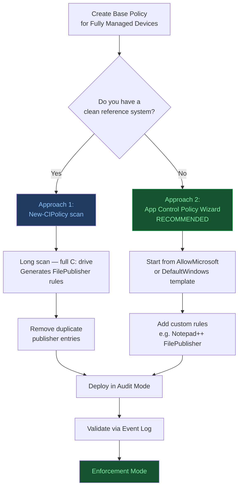
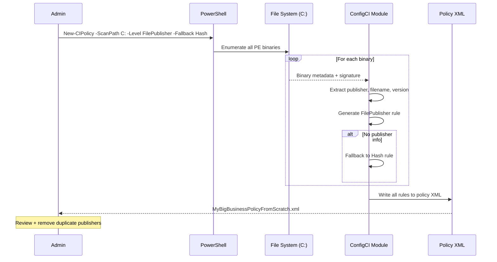
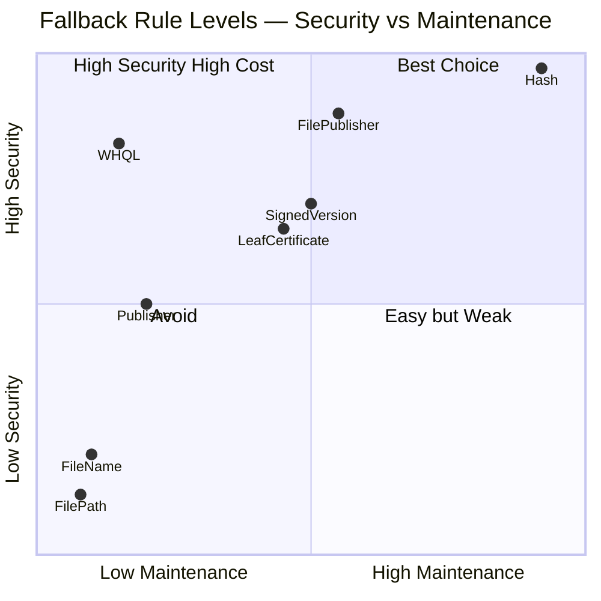
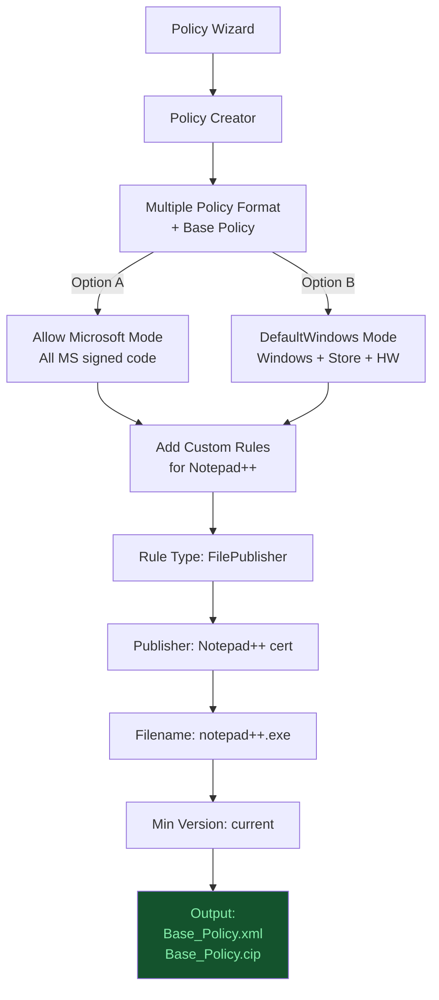
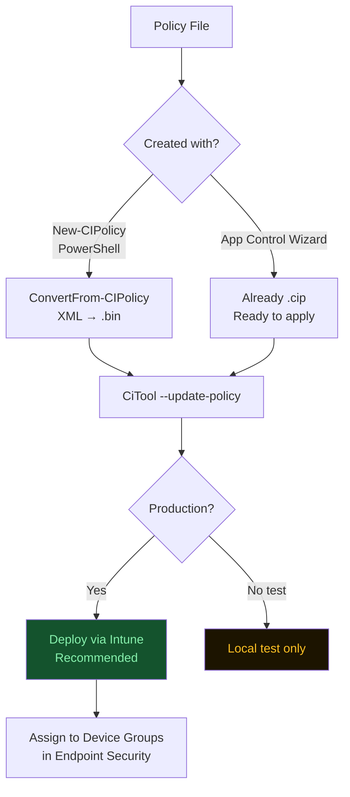
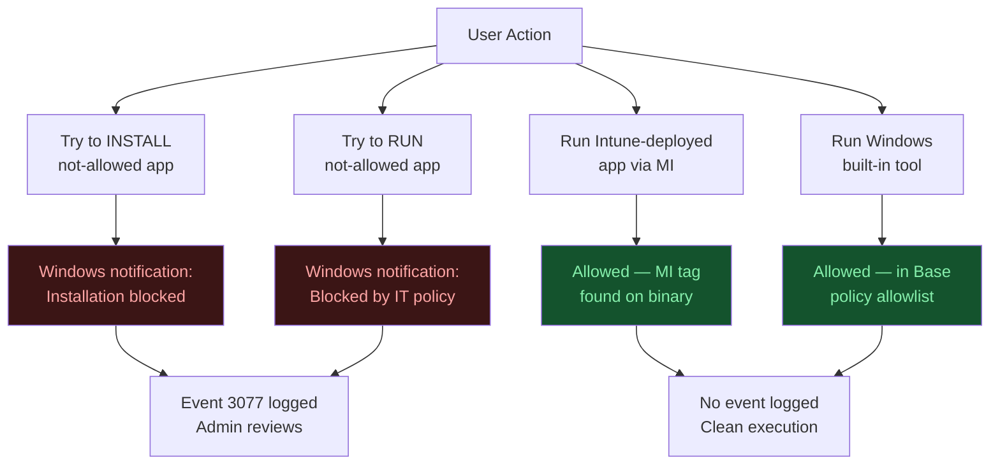

# Mastering App Control for Business
## Part 5: Create a Base Policy for Fully Managed Devices

**Author:** Anubhav Gain  
**Source:** ctrlshiftenter.cloud — Patrick Seltmann  
**Status:** Corporate Reference Document  
**Category:** Endpoint Security | Endpoint Management  

---

## Table of Contents

1. [Overview](#1-overview)
2. [Approach 1: Creating a Base Policy from Scratch with PowerShell](#2-approach-1-creating-a-base-policy-from-scratch-with-powershell)
3. [New-CIPolicy Parameters Explained](#3-new-cipolicy-parameters-explained)
4. [Fallback Levels: Security & Maintenance Comparison](#4-fallback-levels-security--maintenance-comparison)
5. [Approach 2: App Control Policy Wizard with Custom Rules](#5-approach-2-app-control-policy-wizard-with-custom-rules)
6. [Apply Policy Locally](#6-apply-policy-locally)
7. [User Experience with Enforced Policies](#7-user-experience-with-enforced-policies)
8. [Troubleshooting Policies](#8-troubleshooting-policies)

---

## 1. Overview

Two approaches are covered for creating a base policy for fully managed devices:

1. **Create a policy from scratch using PowerShell** — scanning a reference system to build a comprehensive rule set
2. **Create a policy using the App Control Policy Wizard** — select a pre-built template and add custom file rules (e.g., for Notepad++)

> **Recommendation:** Use one of the two highlighted policy templates from the App Control Policy Wizard and add additional rules as needed, rather than creating a policy from scratch. This reduces complexity and accelerates deployment.



### Key Deployment Principles

| # | Principle |
|---|-----------|
| 1 | Always deploy all policies in **audit mode** first |
| 2 | Test broadly across representative devices before switching to enforcement |
| 3 | Monitor the **Microsoft-Windows-CodeIntegrity/Operational** event log to identify issues during audit phase |
| 4 | Validate policy behavior thoroughly before any organization-wide rollout |

---

## 2. Approach 1: Creating a Base Policy from Scratch with PowerShell

### Prerequisites

Set up a **reference system** that is representative of your users' devices. Install all applications that should be trusted. The scan will enumerate every file on the system — the more representative the reference machine, the more accurate the resulting policy.

### Run the Scan

> **Note:** This scan will take a long time — every file on the specified path is inspected and evaluated.

```powershell
New-CIPolicy -MultiplePolicy -filePath "C:\temp\MyBigBusinessPolicyFromScratch.xml" -ScanPath C: -OmitPaths "C:\Windows.old" -Level FilePublisher -UserPEs -Fallback Hash
```



### Set Policy Metadata

```powershell
Set-CIPolicyIdInfo -FilePath C:\temp\MyBigBusinessPolicyFromScratch.xml -PolicyName "MyBigBusinessPolicyFromScratch"
Set-CIPolicyVersion -FilePath C:\temp\MyBigBusinessPolicyFromScratch.xml -Version "1.0.0.0"
```

### Set Security Options

```powershell
Set-RuleOption -FilePath C:\temp\MyBigBusinessPolicyFromScratch.xml -Option 0   # Enabled:UMCI
Set-RuleOption -FilePath C:\temp\MyBigBusinessPolicyFromScratch.xml -Option 2   # Required:WHQL
Set-RuleOption -FilePath C:\temp\MyBigBusinessPolicyFromScratch.xml -Option 3   # Enabled:Audit Mode
Set-RuleOption -FilePath C:\temp\MyBigBusinessPolicyFromScratch.xml -Option 4   # Disabled:Flight Signing
Set-RuleOption -FilePath C:\temp\MyBigBusinessPolicyFromScratch.xml -Option 9   # Enabled:Advanced Boot Options Menu
Set-RuleOption -FilePath C:\temp\MyBigBusinessPolicyFromScratch.xml -Option 10  # Enabled:Boot Audit on Failure
Set-RuleOption -FilePath C:\temp\MyBigBusinessPolicyFromScratch.xml -Option 12  # Required:Enforce Store Applications
Set-RuleOption -FilePath C:\temp\MyBigBusinessPolicyFromScratch.xml -Option 13  # Enabled:Managed Installer
Set-RuleOption -FilePath C:\temp\MyBigBusinessPolicyFromScratch.xml -Option 17  # Enabled:Allow Supplemental Policies
Set-RuleOption -FilePath C:\temp\MyBigBusinessPolicyFromScratch.xml -Option 19  # Enabled:Dynamic Code Security

Set-HVCIOptions -Strict -FilePath C:\temp\MyBigBusinessPolicyFromScratch.xml
```



```mermaid
flowchart LR
    subgraph FULLY_MANAGED["Fully Managed Device — Security Options"]
        O0[Option 0\nUMCI — User+Kernel\nFull coverage]
        O2[Option 2\nWHQL — Certified\ndrivers only]
        O3[Option 3\nAudit Mode first]
        O4[Option 4\nNo Flight Signing\nRelease builds only]
        O9[Option 9\nF8 Boot Menu\nTroubleshooting]
        O10[Option 10\nBoot Audit on Fail\nSafety net]
        O12[Option 12\nEnforce Store Apps]
        O13[Option 13\nManaged Installer]
        O17[Option 17\nAllow Supplemental]
        O19[Option 19\nDynamic Code Security\n.NET + dynamic libs]
        HVCI[Set-HVCIOptions -Strict\nMemory Integrity]
    end
    style FULLY_MANAGED fill:#162032,color:#58a6ff,stroke:#2563eb
```

> **HVCI Reference:** Enable memory integrity | Microsoft Learn

### Post-Scan Notes

After the scan completes, the policy XML will include any application installed on the reference system — for example, Notepad++ will appear as a trusted publisher with file hashes as fallback rules. When the resulting XML is opened in the App Control Policy Wizard, **duplicated trusted publisher entries** may be visible. It is recommended to review and remove duplicates before deploying.

---

## 3. New-CIPolicy Parameters Explained

| Parameter | Description | Value Used |
|-----------|-------------|------------|
| `-MultiplePolicy` | Creates policy in multiple policy format (not single policy format) | — |
| `-filePath` | Path for the Code Integrity policy XML output file | Local file path |
| `-ScanPath` | Path for the cmdlet to scan; can be local or remote | `C:` (entire system) |
| `-Level` | Primary level of detail for generated rules. See file rule levels documentation. | `FilePublisher` — combines FileName + Publisher (PCA cert CN of leaf) + minimum version. Trusts specific files from a specific publisher at or above the specified version. Uses `OriginalFileName` by default. |
| `-UserPEs` | Includes user-mode files in the scan | — |
| `-Fallback` | Array of fallback levels if the primary level cannot generate a rule | `Hash` — individual Authenticode/PE image hash per binary. Most specific, highest maintenance effort. Hash changes on every binary update. |
| `-OmitPaths` | Array of paths to omit from the search | Exclude `C:\Windows.old` if it exists |

> **Full parameter reference:** New-CIPolicy (ConfigCI) | Microsoft Learn

---

## 4. Fallback Levels: Security & Maintenance Comparison

| Fallback Level | Security Level | Description | Maintenance Effort |
|----------------|---------------|-------------|-------------------|
| **FileName** | Low | Matches only on file name (e.g., `app.exe`). Easy to spoof; no publisher validation. | Low — names rarely change, but offers poor security |
| **FilePath** | Low | Allows all files from a specific folder. Does not validate the actual files present. | Low — unless folder structure changes |
| **Publisher** | Medium | Allows any file signed by the same company certificate (e.g., Microsoft, Adobe). | Low — as long as the signing certificate remains valid |
| **LeafCertificate** | Acceptable | Allows all files signed with a specific leaf certificate. Safer than Publisher; permits all files signed by that certificate. | Medium — leaf certificates may expire more frequently |
| **SignedVersion** | Acceptable | Allows files from the same publisher at or above a specified version. | Medium-High — can introduce risk if newer versions are problematic |
| **FilePublisher** | High | Allows specific files (based on original file name) signed by a specific publisher with a minimum version constraint. | Medium — update only when publisher CA or file name changes |
| **Hash** | Very High | Allows only that exact binary version of a file. | High — requires updates for every file change or software update |
| **WHQL options** | High (drivers) | Trusts only Microsoft-certified drivers via WHQL. Best choice for kernel-mode protection. | Low — stable, centrally managed by Microsoft |



---

## 5. Approach 2: App Control Policy Wizard with Custom Rules

> **Recommendation:** Use one of the two highlighted ACfB templates from the Wizard and add custom allow rules as needed, rather than defining all rules manually.

### Steps

| Step | Action |
|------|--------|
| 1 | Open **App Control Policy Wizard** and select **Policy Creator** |
| 2 | Select **Multiple Policy Format** (enables supplemental policy extension later) and **Base Policy** |
| 3 | Select one of the two highlighted ACfB templates — for example, **Allow Microsoft Mode** |
| 4 | Assign the policy a name and define the output directory |
| 5 | Define the policy rules as appropriate for your environment |
| 6 | Add custom allow rules for any additional applications (e.g., Notepad++) to the base policy |

### Wizard Output

The wizard produces two files automatically:

| Output File | Description |
|-------------|-------------|
| Base policy XML | Human-readable source policy definition |
| Base policy binary (`.cip`) | Ready-to-apply binary; no conversion step required |



---

## 6. Apply Policy Locally

### If Policy Was Created with New-CIPolicy

The XML must be converted to binary format before it can be applied:

```powershell
ConvertFrom-CIPolicy -XmlFilePath C:\temp\MyBigBusinessPolicyFromScratch.xml -BinaryFilePath C:\temp\MyBigBusinessPolicyFromScratch.bin
```

### If Policy Was Created with App Control Policy Wizard

The binary is already generated by the wizard — no conversion step is needed.

### Apply the Policy

```powershell
CiTool --update-policy "C:\temp\MyBigBusinessFromWizard.cip"
```

> **Note:** The `CiTool` command applies the policy directly. No system restart is required for the policy to become active.



---

## 7. User Experience with Enforced Policies

Once a policy is active in enforcement mode, the following behavior applies:

- The device does **not** need to restart after the policy is applied
- If a user attempts to open a disallowed application, execution is **automatically blocked**

### Error Notifications

| Scenario | User-Visible Behavior |
|----------|-----------------------|
| Attempting to **install** a not-allowed application | Windows notification displayed to the user |
| Attempting to **execute** an already-installed not-allowed application | Windows notification displayed to the user |



---

## 8. Troubleshooting Policies

Refer to the validation methods covered in Part 4 of this series for full troubleshooting procedures.

### Quick Reference: Key Tools

| Tool / Location | Purpose |
|-----------------|---------|
| `citool --list-policies` | Lists all active policies and their current state |
| `C:\Windows\System32\CodeIntegrity\` | Inspect the CodeIntegrity folder for deployed policy files |
| **Microsoft-Windows-CodeIntegrity/Operational** event log | Primary log for policy activity and enforcement events |

### Key Event IDs

| Event ID | Meaning |
|----------|---------|
| **3099** | Policy successfully loaded |
| **3034** | File would be blocked in enforced mode (allowed in audit mode) |

> **Reference:** See Part 4 of this series for detailed troubleshooting steps and event log analysis procedures.

---

## Series Navigation

| Part | Topic |
|------|-------|
| Part 1 | Introduction & Key Concepts |
| Part 2 | Policy Templates & Rule Options |
| Part 3 | Application ID Tagging Policies & Managed Installer |
| Part 4 | Deploy App Control Policies with Microsoft Intune |
| **Part 5** | Create a Base Policy for Fully Managed Devices *(this document)* |
| Part 6 | Sign, Apply, and Remove Signed Policies |
| Part 7 | Maintaining Policies with Azure DevOps (or PowerShell) |

---

*Document compiled by Anubhav Gain from source material published at ctrlshiftenter.cloud.*  
*Original author: Patrick Seltmann. For organizational reference use.*
