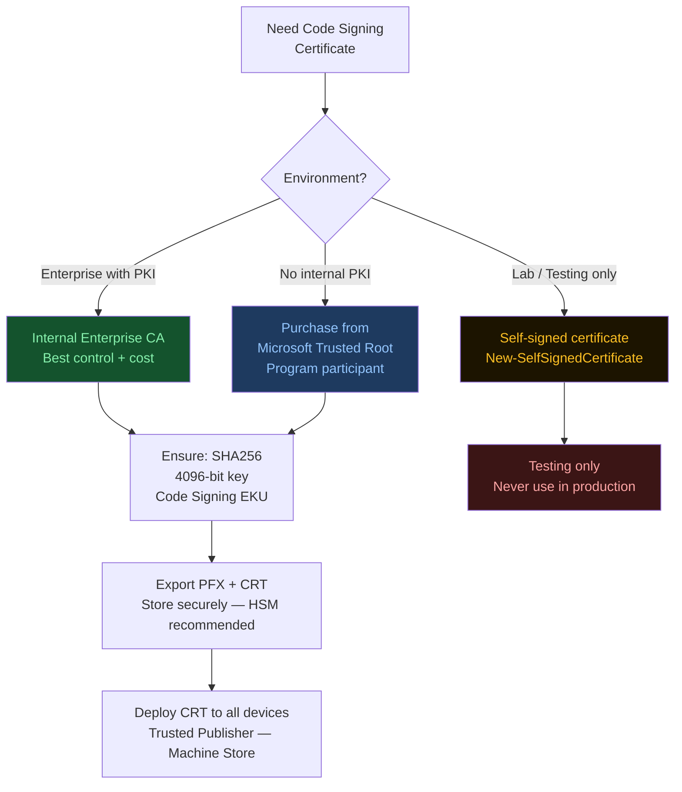
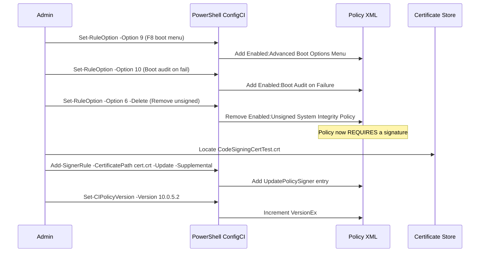
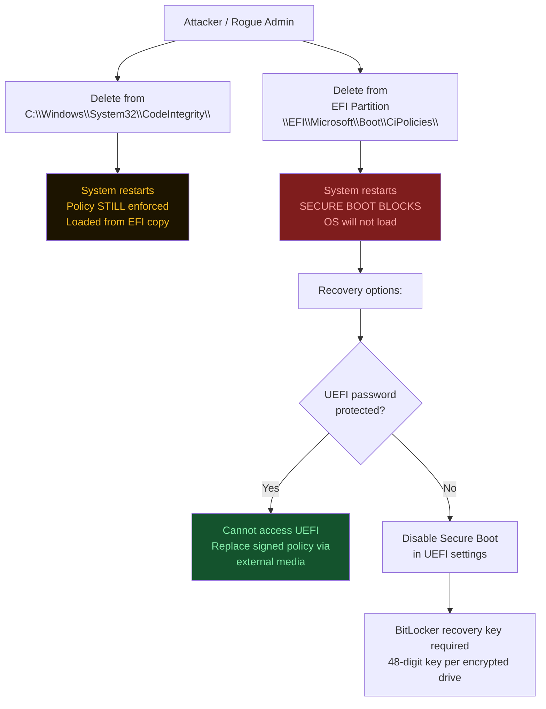

# Mastering App Control for Business
## Part 6: Sign, Apply and Remove Signed Policies

**Author:** Anubhav Gain  
**Source:** ctrlshiftenter.cloud — Patrick Seltmann  
**Status:** Corporate Reference Document  
**Category:** Endpoint Security | Endpoint Management  

---

## Table of Contents

1. [Overview](#1-overview)
2. [Requirements](#2-requirements)
   - [Code Signing Certificate](#code-signing-certificate)
   - [System Requirements](#system-requirements)
   - [Tooling](#tooling)
   - [Create Self-Signed Certificate (Testing Only)](#create-self-signed-certificate-testing-only)
   - [Important Certificate Security Notes](#important-certificate-security-notes)
3. [Signing the Policy](#3-signing-the-policy)
   - [Preparation — PowerShell](#preparation--powershell)
   - [Preparation — App Control Wizard](#preparation--app-control-wizard)
4. [Convert to Binary and Sign](#4-convert-to-binary-and-sign)
   - [SignTool Parameters Explained](#signtool-parameters-explained)
   - [Verify the Signed Policy](#verify-the-signed-policy)
5. [Apply the Signed Policy](#5-apply-the-signed-policy)
6. [What Happens When Someone Tries to Delete a Signed Policy](#6-what-happens-when-someone-tries-to-delete-a-signed-policy)
   - [Deleting from the Windows File System](#deleting-from-the-windows-file-system)
   - [Deleting from the EFI Partition](#deleting-from-the-efi-partition)
   - [Why UEFI/BIOS Password Is Critical](#why-uefibios-password-is-critical)
7. [Removing a Signed Policy](#7-removing-a-signed-policy)

---

## 1. Overview

Unsigned policies are appropriate for testing and lab environments. **Signed policies are required for secure production environments.** An unsigned policy that has been deployed without cryptographic protection is a potential attack surface — it is not protected against tampering or unauthorized removal.

> **Critical Warning:** Before applying any signed policy, always deploy an unsigned version first to validate all policy rules and uncover configuration issues. Signed policies are extremely difficult to remove once applied. If a signed policy file is deleted from the EFI partition after being applied, **the system will fail to boot** until a properly signed replacement policy is manually re-applied.

> **Important:** Applying a signed policy without restarting the system afterward is functionally equivalent to deploying an unsigned policy. Anti-tampering protection provided by Secure Boot does **not** take effect until after a full system reboot.

**Reference:** [Use signed policies to protect App Control for Business against tampering | Microsoft Learn](https://learn.microsoft.com/en-us/windows/security/application-security/application-control/app-control-for-business/deployment/use-signed-policies-to-protect-appcontrol-against-tampering)

```mermaid
flowchart TD
    subgraph UNSIGNED["Unsigned Policy"]
        U1[Policy file on disk]
        U2[Admin deletes file]
        U3[Policy removed — no protection]
        U1 --> U2 --> U3
    end
    subgraph SIGNED["Signed Policy + Secure Boot"]
        S1[Policy signed with cert]
        S2[Applied + Rebooted]
        S3[Anti-tamper active]
        S4[Admin deletes from C:\\]
        S5[Policy STILL enforced\nfrom EFI partition]
        S6[Delete from EFI]
        S7[SYSTEM WILL NOT BOOT\nuntil replacement deployed]
        S1 --> S2 --> S3
        S3 --> S4 --> S5
        S5 --> S6 --> S7
    end
    style UNSIGNED fill:#3b1515,color:#fca5a5,stroke:#ef4444
    style SIGNED fill:#162032,color:#58a6ff,stroke:#2563eb
    style S7 fill:#7f1d1d,color:#fca5a5
    style U3 fill:#7f1d1d,color:#fca5a5
```



---

## 2. Requirements

### Code Signing Certificate

A valid code signing certificate is required to sign ACfB policies. The following options are available:

| # | Option | Use Case |
|---|--------|----------|
| 1 | Issue from your internal enterprise private key infrastructure (PKI) | Production |
| 2 | Purchase from a Microsoft Trusted Root Program participant | Production |
| 3 | Use a self-signed certificate | **Testing only** |

### System Requirements

- All devices on which signed policies will be applied **must have UEFI and Secure Boot enabled**.

### Tooling

**SignTool.exe** is required to sign policy binaries. It is part of the Windows Software Development Kit (SDK).

After SDK installation, SignTool.exe is located in the `\Bin` folder. Example path:

```
C:\Program Files (x86)\Windows Kits\10\bin\10.0.26100.0\x64\signtool.exe
```

### Create Self-Signed Certificate (Testing Only)

The following PowerShell script creates a self-signed code signing certificate and exports it in both PFX and CRT formats:

```powershell
# Parameters
$certName = "CodeSigningCertTest"
$certPath = "Cert:\CurrentUser\My"
$validYears = 1

# Create self-signed certificate
$cert = New-SelfSignedCertificate `
    -Subject "CN=$certName" `
    -Type CodeSigningCert `
    -CertStoreLocation $certPath `
    -KeyUsage DigitalSignature `
    -KeyExportPolicy Exportable `
    -NotAfter (Get-Date).AddYears($validYears) `
    -HashAlgorithm "SHA256" `
    -KeyLength 4096

# Export as PFX (includes private key)
$pfxPath = "$env:USERPROFILE\Desktop\$certName.pfx"
$certPassword = Read-Host -Prompt "Enter a password for the PFX-Container" -AsSecureString
Export-PfxCertificate `
    -Cert $cert `
    -FilePath $pfxPath `
    -Password $certPassword

# Export certificate as CRT (DER format — public key only)
$crtPath = "$env:USERPROFILE\Desktop\$certName.crt"
Export-Certificate `
    -Cert $cert `
    -FilePath $crtPath

Write-Host "Certificate was created and exported with private key to: $pfxPath"
Write-Host "Certificate was exported to: $crtPath"
```



### Important Certificate Security Notes

- Export **both** the certificate (`.crt`) and PFX container (`.pfx`) and store them in a secure location (e.g., a hardware security module).
- The PFX container contains the **public and private key**. Anyone with access to this file can disable deployed signed ACfB policies.
- All devices on which signed policies are applied **must trust the code signing certificate** (Trusted Publisher — machine certificate store).
- Rename the certificate's app registration to conform to your organization's naming convention.

---

## 3. Signing the Policy

### Preparation — PowerShell

Before signing, enable the following rule options to ensure the system remains recoverable if a policy issue is encountered after signing:

```powershell
# Option 9: Enabled:Advanced Boot Options Menu (F8 menu)
Set-RuleOption -FilePath C:\temp\MyBigBusiness_v10.0.5.1.xml -Option 9

# Option 10: Enabled:Boot Audit on Failure
Set-RuleOption -FilePath C:\temp\MyBigBusiness_v10.0.5.1.xml -Option 10
```

> **Warning:** If Options 9 and 10 are not enabled and a policy failure occurs, the system may be left in an unbootable state.

Remove the unsigned policy option (Option 6) to enforce the signing requirement:

```powershell
Set-RuleOption -FilePath C:\temp\MyBigBusiness_v10.0.5.1.xml -Option 6 -Delete
```

Add an `UpdatePolicySigner` rule referencing the code signing certificate:

```powershell
# Note: Omit -Supplemental if your policy does not allow supplemental policies
Add-SignerRule -FilePath C:\temp\MyBigBusinessFromWizard_v10.0.5.1.xml -CertificatePath $env:Userprofile\Desktop\CodeSigningCertTest.crt -Update -Supplemental
```

This creates an `<UpdatePolicySigner>` entry in the policy XML that references the signing certificate. Only a party holding the corresponding private key will be able to update or replace this signed policy.

**Reference:** [Add-SignerRule (ConfigCI) | Microsoft Learn](https://learn.microsoft.com/en-us/powershell/module/configci/add-signerrule)

Increment the policy version and rename the file to reflect the new version:

```powershell
Set-CIPolicyVersion -FilePath C:\temp\MyBigBusiness_v10.0.5.1.xml -Version 10.0.5.2
Rename-Item -Path C:\temp\MyBigBusiness_v10.0.5.1.xml -NewName C:\temp\MyBigBusiness_v10.0.5.2.xml
```



### Preparation — App Control Wizard

The same preparation steps can be performed through the **App Control Policy Wizard** UI. After completing the wizard, add the signer rule via command line:

```powershell
# Note: Omit -Supplemental if your policy does not allow supplemental policies
Add-SignerRule -FilePath C:\temp\MyBigBusinessFromWizard_v10.0.5.2.xml -CertificatePath $env:Userprofile\Desktop\CodeSigningCertTest.crt -Update -Supplemental
```

---

## 4. Convert to Binary and Sign

Ensure the certificate with its **private key** is imported into the current user's personal certificate store before proceeding.

Convert the XML policy to a binary `.cip` file:

```powershell
$PolicyID = Set-CIPolicyIdInfo -FilePath "C:\temp\MyBigBusinessFromWizard_v10.0.5.2.xml" -ResetPolicyID
$PolicyID = $PolicyID.Substring(11)
$PolicyBIN = "C:\temp\" + $PolicyID + ".cip"
ConvertFrom-CIPolicy -XmlFilePath "C:\temp\MyBigBusinessFromWizard_v10.0.5.2.xml" -BinaryFilePath $PolicyBIN
```

Sign the policy binary using SignTool.exe:

```powershell
"C:\Program Files (x86)\Windows Kits\10\bin\10.0.26100.0\x64\signtool.exe" sign -v -n "CodeSigningCertTest" -p7 . -p7co 1.3.6.1.4.1.311.79.1 -fd sha256 "C:\temp\{fe1dbc91-5bb7-45f5-9164-299bdff9694d}.cip"
```

```mermaid
flowchart TD
    XML[Policy XML v10.0.5.2] --> CONV[ConvertFrom-CIPolicy\nXML → {GUID}.cip]
    CONV --> CIP[{GUID}.cip\nUnsigned binary]
    CIP --> SIGN[SignTool.exe sign\n-p7co 1.3.6.1.4.1.311.79.1\n-fd sha256\n-n CodeSigningCertTest]
    SIGN --> P7[{GUID}.cip.p7\nSigned policy]
    P7 --> REN[Rename to\n{GUID}.cip]
    REN --> VERIFY[certutil -asn\nor PowerShell SignedCms]
    VERIFY --> APPLY[CiTool --update-policy]
    APPLY --> REBOOT[Reboot device]
    REBOOT --> ACTIVE[Signed policy active\nAnti-tamper protection ON]
    style ACTIVE fill:#14532d,color:#86efac
    style SIGN fill:#162032,color:#58a6ff
```

### SignTool Parameters Explained

| Parameter | Purpose |
|-----------|---------|
| `sign` | Instructs SignTool to sign the specified file |
| `-v` | Verbose mode — displays detailed output during signing |
| `-n "CodeSigningCertTest"` | Selects the certificate from the user's personal cert store by subject name |
| `-p7 .` | Outputs the signature in PKCS #7 format to the current directory |
| `-p7co 1.3.6.1.4.1.311.79.1` | Adds the OID that identifies the file as an ACfB policy signature |
| `-fd sha256` | Specifies SHA256 as the file digest hashing algorithm |

After signing, a new file with a `.p7` extension appears in the working directory. **Rename this file** so it matches the GUID-based `.cip` naming convention:

```
{fe1dbc91-5bb7-45f5-9164-299bdff9694d}.cip
```

### Verify the Signed Policy

Use `certutil.exe` to inspect the ASN.1 structure of the signed policy binary:

```powershell
# Using certutil
certutil.exe -asn "C:\temp\done{fe1dbc91-5bb7-45f5-9164-299bdff9694d}.cip.p7"
```

Use PowerShell to extract additional certificate details from the signed binary:

```powershell
# Using PowerShell for additional signature info
$CIPolicyBin = "C:\temp\done\{fe1dbc91-5bb7-45f5-9164-299bdff9694d}.cip"
Add-Type -AssemblyName 'System.Security'
$SignedCryptoMsgSyntax = New-Object -TypeName System.Security.Cryptography.Pkcs.SignedCms
$SignedCryptoMsgSyntax.Decode([System.IO.File]::ReadAllBytes($CIPolicyBin))
$SignedCryptoMsgSyntax.Certificates | Format-List -Property *
```

---

## 5. Apply the Signed Policy

Deploy the signed policy binary using `CiTool`:

```powershell
CiTool --update-policy "C:\temp\done\{fe1dbc91-5bb7-45f5-9164-299bdff9694d}.cip"
```

Verify that the policy has been applied successfully:

```powershell
CiTool --list-policies
```

After application, because UEFI Secure Boot is in use, anti-tampering protection activates and protects the ACfB policy against unauthorized modification or removal.

> **A final system reboot is required** for signed policy protection to fully take effect. Until the reboot occurs, the policy can still be removed as easily as an unsigned policy.

---

## 6. What Happens When Someone Tries to Delete a Signed Policy

### Deleting from the Windows File System

Signed policy files reside in the following OS volume locations:

| Format | Path |
|--------|------|
| Multi-policy format | `C:\Windows\System32\CodeIntegrity\CiPolicies\Active\{PolicyId}.cip` |
| Single-policy format | `C:\Windows\System32\CodeIntegrity\SiPolicy.p7b` |

**Result:** If the file is deleted and the system is restarted — **nothing happens**. The policy remains active. Enforcement is still shown in `msinfo32.exe`. This behavior is by design — it protects against rogue administrators attempting to bypass security post-boot. The active policy in memory and on the EFI partition continues to govern execution.

### Deleting from the EFI Partition

The EFI partition stores policy files at:

| Format | Path |
|--------|------|
| Multi-policy format | `\EFI\Microsoft\Boot\CiPolicies\Active\{PolicyId}.cip` |
| Single-policy format | `\EFI\Microsoft\Boot\SiPolicy.p7b` |

**Result:** Deleting the policy from the EFI partition has no immediate effect. However, on the **next reboot, the system will fail to boot**. Secure Boot detects the missing or invalid signature and prevents the operating system from starting.

**Recovery options:**

1. Enter UEFI firmware settings and manually disable Secure Boot.



### Why UEFI/BIOS Password Is Critical

Always protect the UEFI/BIOS with a password. This is a key security recommendation for any environment deploying signed ACfB policies.

| Scenario | Outcome |
|----------|---------|
| **UEFI password protected** | Attacker cannot enter UEFI settings. Combined with BitLocker, the device is extremely secure even against physical attacks. |
| **UEFI NOT password protected** | Attacker may disable Secure Boot or flash firmware. However, the OS drive and all encrypted drives remain protected by BitLocker — 48-digit recovery keys are required for access. |

---

## 7. Removing a Signed Policy

Removing a signed ACfB policy is **not** as simple as deleting a file. Follow this multi-step process carefully and in order.

### Step 1: Create a Replacement Policy

Create a new replacement policy that satisfies all of the following conditions:

- **Rule Option 6 enabled:** `Enabled:Unsigned System Integrity Policy`
- Uses the **same Policy ID (GUID)** as the existing signed policy
- Has a **higher or equal version number** than the existing policy
- Contains an `<UpdatePolicySigners>` section referencing the same code signing certificate thumbprint
- Is **signed** with a certificate listed in the `<UpdatePolicySigners>` of the original policy

### Step 2: Stop the Old Policy from Being Re-deployed

If the original signed policy was deployed via Group Policy, Intune, or another management method, **disable or unlink that deployment first**. Failing to do so will cause the old signed policy to be re-applied after reboot, overwriting the replacement.

### Step 3: Deploy the Replacement Policy

Deploy the replacement policy using the same method as the original (GPO, Intune, or `CiTool` locally).

**Restart the device.**

### Step 4: Remove the Replacement Policy

Once the device has rebooted with the replacement policy active, remove it using `CiTool`:

```powershell
CiTool.exe --remove-policy "{YourPolicyId-GUID}"
```

**Restart the device.**

### Step 5: Delete Policy Files from Disk

After the policy is inactive, delete the remaining policy files from both the OS volume and the EFI partition.

**Multi-policy format:**

```
<EFI Partition>\Microsoft\Boot\CiPolicies\Active\{PolicyId}.cip
C:\Windows\System32\CodeIntegrity\CiPolicies\Active\{PolicyId}.cip
```

**Single-policy format:**

```
<EFI Partition>\Microsoft\Boot\SiPolicy.p7b
C:\Windows\System32\CodeIntegrity\SiPolicy.p7b
```

**Restart the device.**

```mermaid
flowchart TD
    START[Need to remove\nsigned policy] --> STOP[Step 1: Stop re-deployment\nDisable GPO / Intune assignment]
    STOP --> REPLACE[Step 2: Create Replacement Policy\n— Same PolicyID GUID\n— Higher or equal version\n— Option 6 re-enabled\n— UpdatePolicySigner included\n— Signed with SAME certificate]
    REPLACE --> SIGN[Step 3: Sign replacement\nwith original certificate]
    SIGN --> DEPLOY[Step 4: Deploy replacement\nvia same method]
    DEPLOY --> REBOOT1[Step 5: Reboot device]
    REBOOT1 --> REMOVE[Step 6: CiTool.exe\n--remove-policy {GUID}]
    REMOVE --> REBOOT2[Step 7: Reboot device]
    REBOOT2 --> DELETE[Step 8: Delete .cip files\nfrom disk + EFI partition]
    DELETE --> REBOOT3[Step 9: Final reboot]
    REBOOT3 --> DONE[Policy fully removed]
    style START fill:#3b1515,color:#fca5a5
    style DONE fill:#14532d,color:#86efac
    style SIGN fill:#162032,color:#58a6ff
```

---

```mermaid
flowchart TD
    UEFI[UEFI Firmware\nPassword Protected] --> SB[Secure Boot\nEnabled]
    SB --> EFI_LOAD[Load EFI Policy\n{GUID}.cip from EFI partition]
    EFI_LOAD --> CI[Code Integrity\nVerifies policy signature]
    CI --> CHAIN[Certificate chain\nvalidated against UEFI DB]
    CHAIN --> OS[Windows OS loads\nwith policy enforced]
    OS --> BL[BitLocker FDE\n48-digit recovery key]
    BL --> APPS[All applications\nvalidated before execution]
    style UEFI fill:#1a0a2e,color:#c4b5fd,stroke:#7c3aed
    style SB fill:#162032,color:#58a6ff
    style APPS fill:#14532d,color:#86efac
```

## Series Navigation

| Part | Topic |
|------|-------|
| Part 1 | Introduction & Key Concepts |
| Part 2 | Policy Templates & Rule Options |
| Part 3 | Application ID Tagging Policies & Managed Installer |
| Part 4 | Starter Base Policy for Lightly Managed Devices |
| Part 5 | *(forthcoming)* |
| **Part 6** | Sign, Apply and Remove Signed Policies *(this document)* |
| Part 7 | Maintaining Policies with Azure DevOps (or PowerShell) |

---

*Document compiled by Anubhav Gain from source material published at ctrlshiftenter.cloud.*  
*Original author: Patrick Seltmann. For organizational reference use.*
