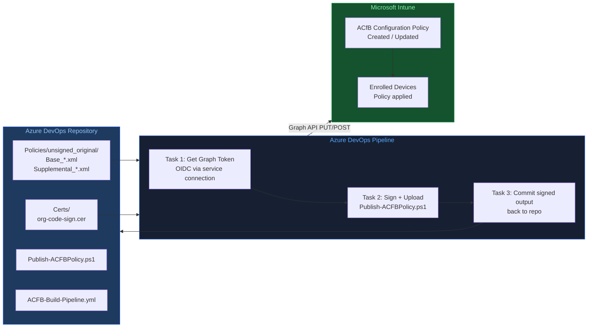
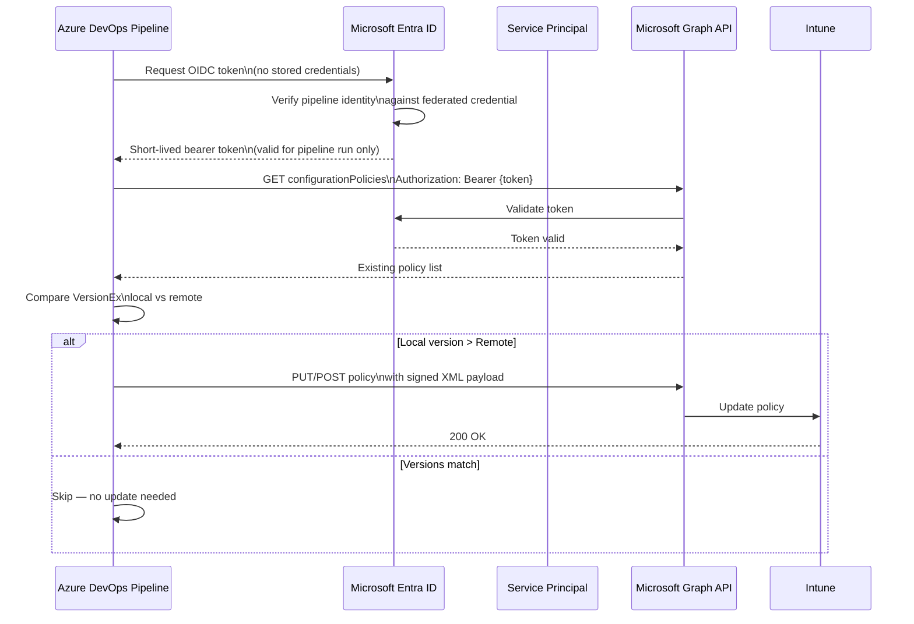
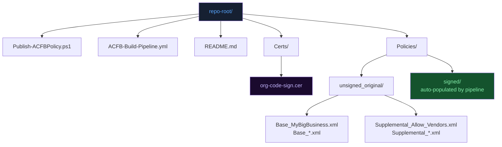
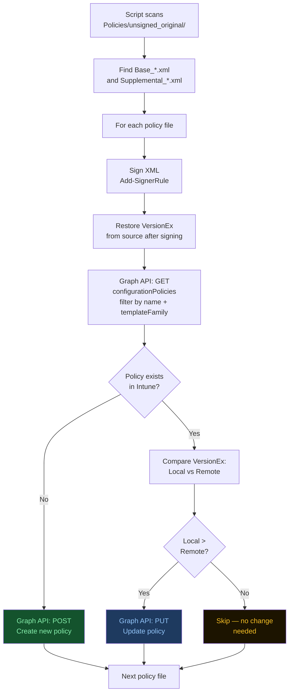
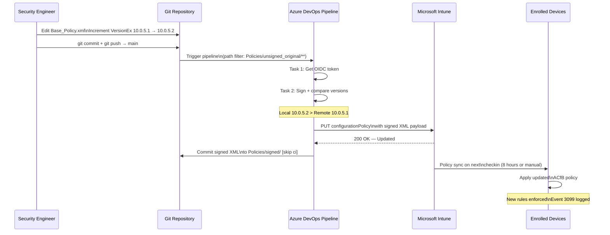
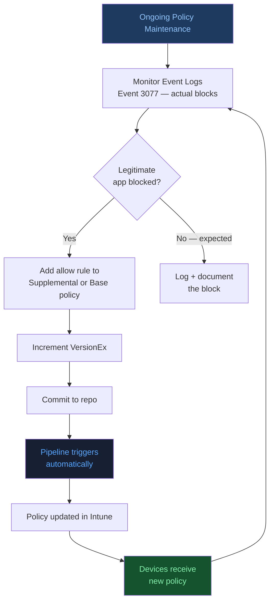

# Mastering App Control for Business
## Part 7: Maintaining Policies with Azure DevOps (or PowerShell)

**Author:** Anubhav Gain  
**Source:** ctrlshiftenter.cloud — Patrick Seltmann  
**Status:** Corporate Reference Document  
**Category:** Endpoint Security | Endpoint Management  

---

## Table of Contents

1. [Overview](#1-overview)
2. [Azure DevOps Setup](#2-azure-devops-setup)
3. [Workload Identity Federation](#3-workload-identity-federation)
4. [Create Service Connection for Workload Identity Federation](#4-create-service-connection-for-workload-identity-federation)
5. [Grant API Permissions to the Service Principal](#5-grant-api-permissions-to-the-service-principal)
6. [Azure DevOps Repository Structure](#6-azure-devops-repository-structure)
7. [Azure DevOps Pipeline](#7-azure-devops-pipeline)
8. [Pipeline YAML Reference](#8-pipeline-yaml-reference)
9. [PowerShell Script: Publish-ACFBPolicy.ps1](#9-powershell-script-publish-acfbpolicyps1)
10. [Workflow: Commit to Pipeline to Intune](#10-workflow-commit-to-pipeline-to-intune)
11. [Microsoft Graph API Details](#11-microsoft-graph-api-details)

---

## 1. Overview

This document describes how to maintain **App Control for Business (ACfB) policies as code**, using an **Azure DevOps Pipeline** for automated deployment and **PowerShell 7** for interactive use — with **Git version control** as the source of truth.

The approach provides:

- Full audit trail for all policy changes via Git history
- Automated signing and Intune upload on every commit to `main`
- No stored secrets — authentication uses short-lived OIDC tokens
- Support for both CI/CD (pipeline) and manual (interactive) workflows

> **Prerequisite:** An Azure DevOps organization must be connected to your Microsoft Entra ID tenant before proceeding.



---

## 2. Azure DevOps Setup

### Organization & Project Requirements

| Requirement | Details |
|---|---|
| Azure DevOps organization | Provision at https://aex.dev.azure.com/ |
| Project with Git repository | At least one project containing a Git repo is required |

---

## 3. Workload Identity Federation

To prevent storing secrets in Azure DevOps, the pipeline authenticates against Microsoft Graph using **Workload Identity Federation (OIDC-based)** — a secretless authentication pattern.

### How It Works

| Step | Action |
|---|---|
| 1 | Pipeline executes — Azure DevOps requests authentication from Microsoft Entra ID via service principal |
| 2 | Instead of stored credentials, Entra ID verifies the request and issues a short-lived token |
| 3 | Token is valid only for the duration of the pipeline run |
| 4 | Token grants access only to resources specified in its permissions |

This eliminates long-lived secrets from the pipeline entirely, reducing credential exposure risk.



---

## 4. Create Service Connection for Workload Identity Federation

### Navigation Path

```
Project settings → Service connections → Create service connection
→ Azure Resource Manager → Workload Identity federation (automatic)
```

### Scope Configuration

| Setting | Value |
|---|---|
| Scope level | Subscription (Resource Group) |
| Default role assigned | Contributor (scoped to selected Resource Group) |

> **Note:** The Contributor role grants more permissions than strictly required. You may assign a less privileged role such as **Reader** — however, the workload identity **must be assigned at least one role** on the resource group, or all authentication attempts will fail. These permissions are fully scoped to the assigned resource group and do not extend beyond it.

---

## 5. Grant API Permissions to the Service Principal

After creating the federated identity:

1. Navigate to the automatically created **App Registration** in Microsoft Entra ID
2. Rename the app registration to comply with your organizational naming convention
3. Assign the required **Microsoft Graph API permissions** to enable the MS Graph API calls used by the publishing script

The required scope is: `DeviceManagementConfiguration.ReadWrite.All`

---

## 6. Azure DevOps Repository Structure

The following structure is used for the policy-as-code repository:

```
repo-root/
├─ Publish-ACFBPolicy.ps1
├─ ACFB-Build-Pipeline.yml
├─ README.md
├─ Certs/
│  └─ org-code-sign.cer
├─ Policies/
│  ├─ unsigned_original/
│  │  ├─ Base_MyBigBusinessFromWizard.xml
│  │  └─ Supplemental_Allow_Vendors.xml
│  └─ signed/          ← target directory (auto-populated by pipeline)
```

| Folder / File | Purpose |
|---|---|
| `Publish-ACFBPolicy.ps1` | Core script — signs and uploads policies to Intune via Graph |
| `ACFB-Build-Pipeline.yml` | Pipeline definition |
| `Certs/` | Signing certificate(s) (.cer / .crt) |
| `Policies/unsigned_original/` | Source XML files — edit these when updating policies |
| `Policies/signed/` | Output directory — auto-populated by the pipeline after signing |

> **Source files** are available at: [PatrickSeltmann/AppControlForBusiness_DevOps](https://github.com/PatrickSeltmann/AppControlForBusiness_DevOps) on GitHub.



---

## 7. Azure DevOps Pipeline

### Build Service Permissions

Before the pipeline can commit signed output back to the repository, the **build service** account must have **Contribute** rights granted on the repository.

**Navigation:**

```
Project settings → Repositories → [Your Repo] → Security
→ [Project] Build Service → Contribute → Allow
```

### Create the Pipeline

| Step | Action |
|---|---|
| 1 | Upload `Publish-ACFBPolicy.ps1` and signer certificate to the repository |
| 2 | Navigate to **Pipelines → New pipeline** |
| 3 | Select **"Existing Azure Pipelines YAML file"** |
| 4 | Choose `ACFB-Build-Pipeline.yml` from the repository |

> **Note:** The first pipeline run will prompt for permission to use the service connection. Approve when prompted.

---

## 8. Pipeline YAML Reference

The pipeline uses a **one-script approach**: a single PowerShell script handles signing and Intune upload. Three pipeline tasks orchestrate the full workflow.

```yaml
# Pipeline: Build & Publish ACfB Policies
# One-script approach: sign the XML and upload it
# Service connection to Entra ID / Graph: 'AC4B' (OIDC / workload identity)
# Script file lives in the repo: Publish-ACFBPolicy.ps1
# Certificates must be stored under Certs\*.cer or *.crt

trigger:
  branches:
    include:
      - main                  # Run only for changes on main branch
  paths:
    include:
      - Policies/unsigned_original/**   # Run only if files under this folder changed

pool:
  vmImage: windows-2022       # Microsoft-hosted Windows agent

steps:
- checkout: self
  persistCredentials: true
  clean: true                 # Start with a clean workspace
  fetchDepth: 0               # Full history (needed for rebase/push)

# Step 1: Get Microsoft Graph access token using OIDC
- task: AzureCLI@2
  displayName: Get Microsoft Graph access token (OIDC)
  inputs:
    azureSubscription: AC4B   # Name of your service connection
    scriptType: pscore
    scriptLocation: inlineScript
    inlineScript: |
      $json = az account get-access-token --resource-type ms-graph -o json
      $accessToken = ($json | ConvertFrom-Json).accessToken
      if ([string]::IsNullOrWhiteSpace($accessToken)) { throw "Failed to obtain MS Graph token." }
      Write-Host "##vso[task.setvariable variable=secret;issecret=true]$accessToken"

# Step 2: Run the script that signs and uploads the policies
- task: PowerShell@2
  displayName: Build & publish ACfB policies
  inputs:
    targetType: filePath
    filePath: Publish-ACFBPolicy.ps1
    arguments: >
      -PolicyRootDir "$(Build.SourcesDirectory)\Policies\unsigned_original"
      -OutputPolicyDir "$(Build.SourcesDirectory)\Policies\signed"
      -CertFolder "$(Build.SourcesDirectory)\Certs"
      -AccessToken "$(secret)"
    pwsh: true
    workingDirectory: '$(Build.SourcesDirectory)'

# Step 3: Commit signed output back to repo (skip for PRs)
- task: PowerShell@2
  displayName: Commit signed policies (only if changed)
  condition: and(succeeded(), ne(variables['Build.Reason'], 'PullRequest'))
  inputs:
    targetType: inline
    pwsh: true
    script: |
      $ErrorActionPreference = 'Stop'
      git config --global user.email "pipeline@domain.tbd"
      git config --global user.name  "Pipeline ACfB Build"
      git config --global --add safe.directory "$(Build.SourcesDirectory)"
      $branch = "$(Build.SourceBranchName)"
      if (-not $branch) { $branch = "main" }
      git checkout $branch
      git pull --rebase origin $branch
      git add "Policies/signed"
      # Commit with [skip ci] to prevent triggering pipeline again
```

```mermaid
flowchart TD
    TRIGGER[Trigger:\nPush to main branch\nPolicies/unsigned_original/**] --> S1
    subgraph S1["Stage 1: Get Token"]
        AZ[AzureCLI@2 Task\naz account get-access-token\n--resource-type ms-graph]
        TOKEN[Secret pipeline variable\n$secret — masked in logs]
        AZ --> TOKEN
    end
    S1 --> S2
    subgraph S2["Stage 2: Build & Publish"]
        PS[PowerShell@2 Task\nPublish-ACFBPolicy.ps1]
        SIGN[Add-SignerRule\nSign XML with cert]
        VER[Compare VersionEx\nLocal vs Intune]
        UPLOAD[Graph API\nPOST or PUT policy]
        PS --> SIGN --> VER --> UPLOAD
    end
    S2 --> S3
    subgraph S3["Stage 3: Commit Signed"]
        GIT[git add Policies/signed\ngit commit skip ci\ngit push]
    end
    style TRIGGER fill:#1e3a5f,color:#93c5fd
    style S1 fill:#162032,color:#58a6ff
    style S2 fill:#14532d,color:#86efac
    style S3 fill:#1e3a5f,color:#93c5fd
```

### Pipeline Task Summary

| Task | Purpose |
|---|---|
| `AzureCLI@2` | Obtains a short-lived MS Graph access token via OIDC service connection |
| `PowerShell@2` (Build) | Calls `Publish-ACFBPolicy.ps1` to sign and upload policies to Intune |
| `PowerShell@2` (Commit) | Commits signed XMLs back to `Policies/signed/` with `[skip ci]` to prevent a pipeline loop |

> The `[skip ci]` commit message flag prevents the pipeline from re-triggering on the signed output commit.

---

## 9. PowerShell Script: Publish-ACFBPolicy.ps1

The script automates the full ACfB policy publishing flow. It can be executed via Azure DevOps Pipeline **or** interactively via PowerShell 7 on a local workstation.

### Script Parameters

| Parameter | Description | Default |
|---|---|---|
| `-PolicyRootDir` | Folder containing unsigned policy XMLs (`Base_*.xml` / `Supplemental_*.xml`) | `.\Policies\unsigned_original` |
| `-OutputPolicyDir` | Folder where signed policy XML copies are written and uploaded from | `.\Policies\signed` |
| `-CertFolder` | Folder containing `.cer` or `.crt` files for signing. First found match is used. | `.\Certs` |
| `-TenantId` | Optional tenant ID hint for interactive `Connect-MgGraph`. Ignored when `-AccessToken` is provided. | `$null` |
| `-AccessToken` | Bearer token for non-interactive (CI/CD) auth. If provided, no interactive login is prompted. | — |
| `-DryRun` | If set, prints what would be done without uploading to Intune. | — |

### Script Logic

The script performs the following steps in sequence:

| Step | Action |
|---|---|
| 1 | Scans source folder for policy XMLs matching `Base_*.xml` or `Supplemental_*.xml` |
| 2 | Copies each file to the output folder |
| 3 | Signs each policy using the `.cer`/`.crt` certificate found in the Certs folder |
| 4 | Restores the original `VersionEx` after signing (the signing tool resets it) |
| 5 | Queries Intune via Microsoft Graph for an existing policy with matching name and template family |
| 6 | Compares `VersionEx` — local vs. remote (Intune) |
| 7 | Creates, updates, or skips based on version comparison result |
| 8 | Uploads signed XML to Intune via Graph API |

### Version Comparison Logic

| Condition | Action |
|---|---|
| No existing policy found in Intune | **CREATE** new policy |
| Local `VersionEx` > remote `VersionEx` | **UPDATE** existing policy |
| Versions match, or remote is newer | **SKIP** — no update required |

> **Important:** When you modify a local policy XML, you **must manually increment the `VersionEx`** value in the XML. This is the mechanism the script uses to determine what requires updating. Without a version bump, the script will skip the policy even if the content has changed.



### Template Families

| Policy Type | Template ID | Template Family |
|---|---|---|
| Base | `4321b946-b76b-4450-8afd-769c08b16ffc_1` | `endpointSecurityApplicationControl` |
| Supplemental | `08441ae9-e0c0-4e57-8e8b-6e72405cd64f_1` | `endpointSecurityApplicationControlSupplementalPolicy` |

### Authentication Modes

| Mode | Method | When to Use |
|---|---|---|
| **CI/CD (non-interactive)** | Pass `-AccessToken` from Azure DevOps OIDC step | Pipeline runs |
| **Manual (interactive)** | `Connect-MgGraph` prompt via `Microsoft.Graph.Authentication` module | Local workstation use |

Required Microsoft Graph scope: `DeviceManagementConfiguration.ReadWrite.All`

### Module Requirements

| Requirement | Details |
|---|---|
| PowerShell version | 7+ (enforced via `#Requires -Version 7.0`) |
| `Microsoft.Graph.Authentication` | Auto-installed on demand if not present |
| `Add-SignerRule` | Must be available on PATH (part of the WDAC toolset) |

### Example Usage

**Interactive (manual) run:**

```powershell
pwsh .\Publish-ACFBPolicy.ps1 `
  -PolicyRootDir .\Policies\unsigned_original `
  -OutputPolicyDir .\Policies\signed `
  -CertFolder .\Certs
```

**With specific tenant (interactive login):**

```powershell
pwsh .\Publish-ACFBPolicy.ps1 `
  -TenantId "00000000-0000-0000-0000-000000000000"
```

**CI/CD (Azure DevOps — token passed from AzureCLI@2 step):**

```powershell
pwsh .\Publish-ACFBPolicy.ps1 `
  -PolicyRootDir "$(Build.SourcesDirectory)\Policies\unsigned_original" `
  -OutputPolicyDir "$(Build.SourcesDirectory)\Policies\signed" `
  -CertFolder "$(Build.SourcesDirectory)\Certs" `
  -AccessToken "$(secret)"
```

**Dry run (simulate without uploading):**

```powershell
pwsh .\Publish-ACFBPolicy.ps1 -DryRun
```

---

## 10. Workflow: Commit to Pipeline to Intune

The end-to-end workflow for updating a policy:

| Step | Actor | Action |
|---|---|---|
| 1 | Engineer | Modifies policy XML in `Policies/unsigned_original/` |
| 2 | Engineer | Increments `VersionEx` manually in the XML |
| 3 | Engineer | Commits and pushes to `main` branch |
| 4 | Azure DevOps | Pipeline triggers (path filter: `Policies/unsigned_original/**`) |
| 5 | Pipeline | Obtains short-lived Graph token via OIDC service connection |
| 6 | Pipeline | `Publish-ACFBPolicy.ps1` signs XML, compares versions, creates or updates policy in Intune |
| 7 | Pipeline | Signed XML committed back to `Policies/signed/` with `[skip ci]` to prevent pipeline re-trigger |



### Key Design Decisions

| Decision | Rationale |
|---|---|
| Path-based trigger (`Policies/unsigned_original/**`) | Prevents pipeline from running on unrelated file changes |
| `[skip ci]` on signed output commit | Breaks the feedback loop that would otherwise re-trigger the pipeline |
| `VersionEx` as update signal | Provides explicit, auditable versioning without relying on content diffing |
| OIDC token (no stored secrets) | Eliminates long-lived credential exposure in the pipeline |

---

## 11. Microsoft Graph API Details

| Detail | Value |
|---|---|
| API version | Microsoft Graph **beta** |
| API endpoint | `https://graph.microsoft.com/beta/deviceManagement/configurationPolicies` |
| Setting definition for XML embedding | `device_vendor_msft_policy_config_applicationcontrol_policies_{policyguid}_xml` |
| Required scope | `DeviceManagementConfiguration.ReadWrite.All` |

> The `beta` endpoint is required because ACfB configuration policies are not yet available on the v1.0 Microsoft Graph endpoint.

---



## Series Navigation

| Part | Topic |
|------|-------|
| Part 1 | Introduction & Key Concepts |
| Part 2 | Policy Templates & Rule Options |
| Part 3 | Application ID Tagging Policies & Managed Installer |
| Part 4 | Starter Base Policy for Lightly Managed Devices |
| Part 5 | Create a Base Policy for Fully Managed Devices |
| Part 6 | Sign, Apply, and Remove Signed Policies |
| **Part 7** | Maintaining Policies with Azure DevOps (or PowerShell) *(this document — final part)* |

---

*Document compiled by Anubhav Gain from source material published at ctrlshiftenter.cloud.*  
*Original author: Patrick Seltmann. For organizational reference use.*
