# Mastering App Control for Business
## Part 8: AppLocker, Managed Installer (Option 13) & Selective MSI Allowlisting — End-to-End

**Author:** Anubhav Gain
**Status:** Corporate Reference Document
**Category:** Endpoint Security | Endpoint Management

---

## Table of Contents

1. [What is AppLocker — and Why It Matters for WDAC](#1-what-is-applocker--and-why-it-matters-for-wdac)
2. [AppLocker Rule Collections Deep Dive](#2-applocker-rule-collections-deep-dive)
3. [The ManagedInstaller Rule Collection](#3-the-managedinstaller-rule-collection)
4. [AppLockerFltr.sys — The Kernel Filter Driver](#4-applockerfltr.sys--the-kernel-filter-driver)
5. [KERNEL.SMARTLOCKER.ORIGINCLAIM — The EA Stamp](#5-kernelsmartlockeroriginclaim--the-ea-stamp)
6. [WDAC Option 13 — Enabled:Managed Installer](#6-wdac-option-13--enabledmanaged-installer)
7. [File Evaluation Precedence Order](#7-file-evaluation-precedence-order)
8. [Trust Model A — Blanket MI Trust (WITH Option 13)](#8-trust-model-a--blanket-mi-trust-with-option-13)
9. [Trust Model B — Selective Allowlisting (WITHOUT Option 13)](#9-trust-model-b--selective-allowlisting-without-option-13)
10. [Side-by-Side Trust Model Comparison](#10-side-by-side-trust-model-comparison)
11. [FilePublisher vs Hash vs Publisher Rules](#11-filepublisher-vs-hash-vs-publisher-rules)
12. [Our PoC Architecture — End-to-End](#12-our-poc-architecture--end-to-end)
13. [Selective Allowlist Workflow — Step by Step](#13-selective-allowlist-workflow--step-by-step)
14. [approved-apps.json — The Allowlist Contract](#14-approved-appsjson--the-allowlist-contract)
15. [Supplemental Policy Lifecycle](#15-supplemental-policy-lifecycle)
16. [What Happens at Execution Time](#16-what-happens-at-execution-time)
17. [CodeIntegrity Event Log Reference](#17-codeintegrity-event-log-reference)
18. [Known Limitations — Both Trust Models](#18-known-limitations--both-trust-models)
19. [Decision Guide — When to Use MI vs Explicit Rules](#19-decision-guide--when-to-use-mi-vs-explicit-rules)
20. [Security Considerations](#20-security-considerations)
21. [Glossary](#21-glossary)

---

## 1. What is AppLocker — and Why It Matters for WDAC

AppLocker is a Windows feature that lets administrators restrict which applications users can run. It predates WDAC (Windows Defender Application Control) and operates at a higher abstraction level — it works on **application identity** rather than binary integrity.

The critical relationship between AppLocker and WDAC for this document:

> **AppLocker does not enforce WDAC policies. But it is the only mechanism through which WDAC's Managed Installer feature works.**

The two systems are coupled specifically for the Managed Installer scenario: AppLocker designates which processes are trusted installers, and WDAC trusts the files those installers write. Without AppLocker running, WDAC's Option 13 has no effect.

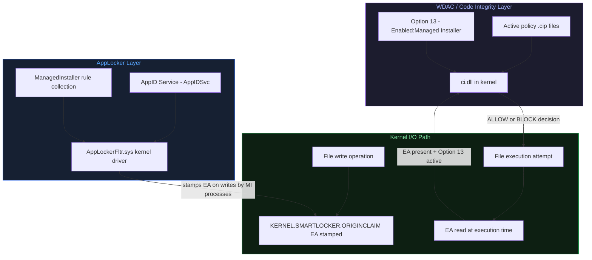

### AppLocker vs WDAC — Key Differences

| Feature | AppLocker | WDAC |
|---------|-----------|------|
| Kernel enforcement | No (user-mode service) | Yes (ci.dll in kernel) |
| Bypass risk | Admin can disable AppIDSvc | Signed policy required to modify |
| Granularity | Per-user, per-group rules | Machine-wide binary trust |
| Managed Installer | Designates trusted installers | Trusts files those installers wrote |
| Required together? | Only for MI scenario | Only needs AppLocker for MI |
| Policy format | XML via GPO or cmdlets | XML → .cip binary |

---

## 2. AppLocker Rule Collections Deep Dive

AppLocker organises rules into **rule collections** — each targeting a different type of executable object. Understanding these collections is essential because the ManagedInstaller collection is a special extension of this system.

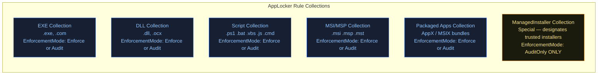

### Enforcement Modes

Each collection has its own enforcement mode:

- **Enforce** — actively blocks or allows based on rules
- **AuditOnly** — logs what would happen but never blocks
- **Not configured** — collection is inactive

> **Critical:** The ManagedInstaller collection **must always use AuditOnly**. Setting it to Enforce would cause the MI tagging mechanism to misfire. This is by design and documented by Microsoft.

### Rule Types Within Collections

Each collection supports three rule types:

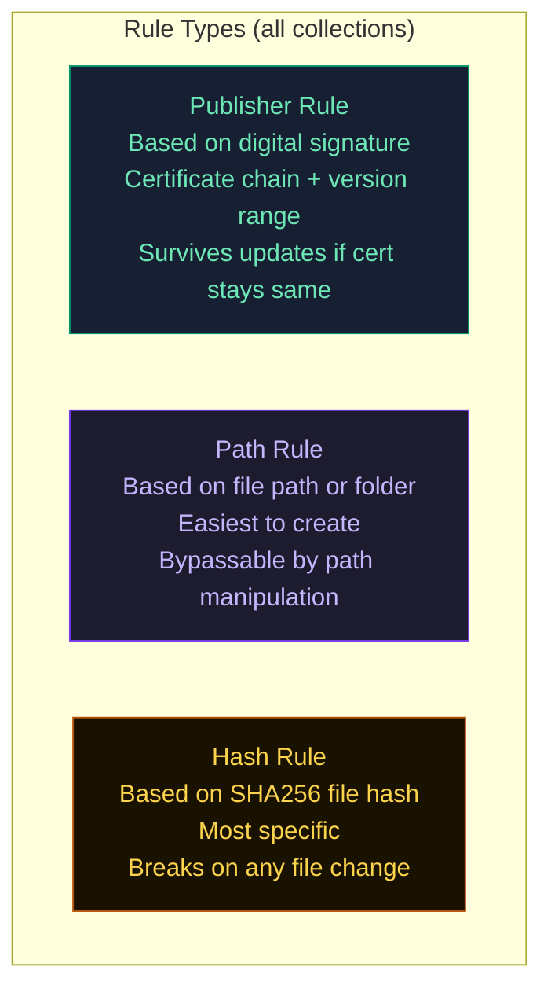

### Services Enforcement Tracking

A subtle but critical requirement for Managed Installer activation: the DLL and EXE collections must include a `<Services EnforcementMode="Enabled" />` element inside `<RuleCollectionExtensions>`. Without this, the kernel filter driver `AppLockerFltr.sys` does not activate MI tracking for service-hosted processes (like SCCM's CCMExec.exe which runs as a service).

```xml
<RuleCollectionExtensions>
  <ThresholdExtensions>
    <Services EnforcementMode="Enabled" />
  </ThresholdExtensions>
  <RedstoneExtensions>
    <SystemApps Allow="Enabled"/>
  </RedstoneExtensions>
</RuleCollectionExtensions>
```

---

## 3. The ManagedInstaller Rule Collection

The ManagedInstaller rule collection is the most unusual in AppLocker. It cannot be created through the GPO UI, cannot be created through standard `New-AppLockerPolicy` cmdlets alone, and must be hand-crafted as XML or post-processed via PowerShell.

### What It Does

It designates specific binaries as **trusted installation agents**. When a designated binary runs, `AppLockerFltr.sys` tracks every file write made by that process and its children, stamping each file with a kernel EA.

### Structure of the ManagedInstaller Collection

```xml
<RuleCollection Type="ManagedInstaller" EnforcementMode="AuditOnly">
  <FilePublisherRule
    Id="{unique-guid}"
    Name="Microsoft Windows Installer"
    Description="Designates msiexec.exe as a Managed Installer"
    UserOrGroupSid="S-1-1-0"
    Action="Allow">
    <Conditions>
      <FilePublisherCondition
        PublisherName="O=MICROSOFT CORPORATION, L=REDMOND, S=WASHINGTON, C=US"
        ProductName="*"
        BinaryName="MSIEXEC.EXE">
        <BinaryVersionRange
          LowSection="5.0.0.0"
          HighSection="*" />
      </FilePublisherCondition>
    </Conditions>
  </FilePublisherRule>
</RuleCollection>
```

### Key Rules — Why They Are Structured This Way

```mermaid
flowchart TD
    subgraph POLICY["AppLocker-ManagedInstaller.xml Structure"]
        direction TB

        subgraph DLL_COLL["DLL Collection — AuditOnly"]
            D1["Benign DENY rule\nTarget: %OSDRIVE%\\ThisWillBeBlocked.dll\nFile does NOT exist\nPurpose: activate AppLockerFltr for DLL loads"]
            D2["Services enforcement stub\nActivates MI tracking for service-hosted DLLs"]
        end

        subgraph EXE_COLL["EXE Collection — AuditOnly"]
            E1["Benign DENY rule\nTarget: %OSDRIVE%\\ThisWillBeBlocked.exe\nFile does NOT exist\nPurpose: activate AppLockerFltr for EXE runs"]
            E2["Services enforcement stub\nActivates MI tracking for service-hosted EXEs"]
        end

        subgraph MI_COLL["ManagedInstaller Collection — AuditOnly"]
            M1["msiexec.exe FilePublisherRule\nMicrosoft signed, v5.0+\nDesignates Windows Installer"]
            M2["IntuneWindowsAgent.exe FilePublisherRule\nMicrosoft signed, v1.39+\nDesignates Intune Management Extension"]
            M3["CCMExec.exe FilePublisherRule\nMicrosoft signed, v5.0+\nDesignates SCCM Client Service"]
            M4["CCMSetup.exe FilePublisherRule\nMicrosoft signed, v5.0+\nDesignates SCCM Setup Bootstrapper"]
        end
    end

    D1 -->|"required for"| AppLockerFltr["AppLockerFltr.sys activation"]
    E1 -->|"required for"| AppLockerFltr
    D2 -->|"required for"| AppLockerFltr
    E2 -->|"required for"| AppLockerFltr
    M1 -->|"tells driver to track"| AppLockerFltr
    M2 -->|"tells driver to track"| AppLockerFltr
    M3 -->|"tells driver to track"| AppLockerFltr
    M4 -->|"tells driver to track"| AppLockerFltr

    style DLL_COLL fill:#162032,color:#93c5fd,stroke:#2563eb
    style EXE_COLL fill:#1c1c2e,color:#a5b4fc,stroke:#7c3aed
    style MI_COLL fill:#1a1a0d,color:#fde68a,stroke:#d97706
    style AppLockerFltr fill:#0d1f12,color:#86efac,stroke:#16a34a
```

### The "Safe Merge" Design Pattern

The benign DENY rules targeting `%OSDRIVE%\ThisWillBeBlocked.*` are a deliberate design pattern:

1. AppLocker's MI tracking only activates when at least one collection is in enforce mode (not just audit)
2. But we don't want to accidentally block anything real
3. Solution: create a DENY rule targeting a guaranteed-nonexistent file
4. Result: DLL and EXE collections are technically "in effect", activating the driver — but nothing is actually blocked

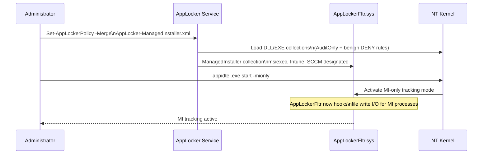

### Activating MI Tracking — `appidtel start -mionly`

The `appidtel.exe` command is often missed. Even with AppIDSvc running and the MI policy applied, the kernel filter may not activate MI tracking unless `appidtel start -mionly` is run. The `-mionly` flag tells the service to enable only the Managed Installer tracking path, without enabling full AppLocker enforcement.

---

## 4. AppLockerFltr.sys — The Kernel Filter Driver

`AppLockerFltr.sys` is a **filesystem minifilter driver** that sits in the Windows kernel I/O stack. It is loaded and managed by the AppID service (AppIDSvc).

### What a Minifilter Driver Is

Windows implements filesystem operations as a layered stack of drivers. A minifilter inserts itself into this stack and can intercept, modify, or annotate I/O operations at the kernel level — before or after the actual filesystem driver processes them.

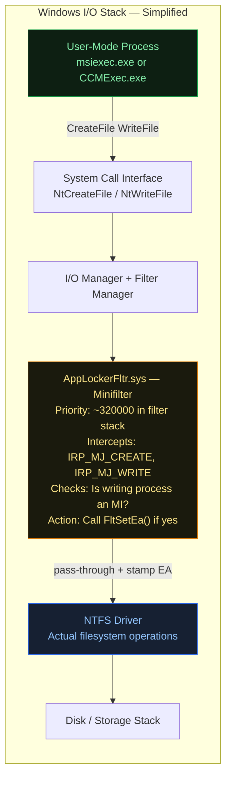

### How Process Tracking Works

When `AppLockerFltr.sys` is active, it maintains an in-memory table of process tokens that are currently running under MI context. The tracking logic:

1. **Process creation hook**: When a new process spawns, the driver checks if its parent is an MI-designated process. If yes, the child process inherits MI context.
2. **Write interception**: For every file write (`IRP_MJ_CREATE` with write access or `IRP_MJ_WRITE`), the driver checks the calling process's token against the MI process table.
3. **EA stamping**: If the writing process is in the MI context table, `FltSetEa()` is called to write the `KERNEL.SMARTLOCKER.ORIGINCLAIM` extended attribute.

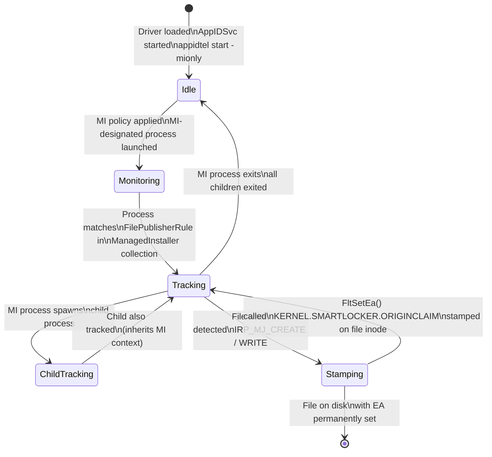

### Critical Ordering Requirement

The driver only stamps files written **after** it is loaded and the MI process was started **after** the AppLocker policy was applied. This means:

- Pre-existing installations have **no EA** → not trusted by Option 13
- An msiexec.exe process that was already running when the policy was applied has **no MI context** → files it writes are not stamped
- You must start a **fresh** msiexec.exe process after the policy activates

---

## 5. KERNEL.SMARTLOCKER.ORIGINCLAIM — The EA Stamp

Extended Attributes (EAs) in NTFS are arbitrary key-value pairs stored directly in a file's inode (the MFT record). They are separate from the file's content and survive the file being read, copied (on same volume), or moved within the same NTFS volume.

### EA Structure

The `KERNEL.SMARTLOCKER.ORIGINCLAIM` EA is a 92-byte binary blob. The critical byte is at offset 4:

```
Offset  Size  Value   Meaning
------  ----  ------  -------
0       4     varies  Header / version
4       1     0x00    Origin = Managed Installer
4       1     0x01    Origin = Intelligent Security Graph (ISG)
5       87    varies  Additional metadata (process info, timestamp, etc.)
```

### Reading the EA — P/Invoke NtQueryEaFile

The `KERNEL.SMARTLOCKER.ORIGINCLAIM` EA is a **kernel EA** — it is not directly readable via standard Win32 APIs like `GetFileInformationByHandle`. You must use the native NT API `NtQueryEaFile` via P/Invoke:

```csharp
// Structure layout for NtQueryEaFile
[StructLayout(LayoutKind.Sequential)]
struct FILE_FULL_EA_INFORMATION {
    public uint  NextEntryOffset;
    public byte  Flags;
    public byte  EaNameLength;
    public ushort EaValueLength;
    // EaName follows (null-terminated ASCII)
    // EaValue follows immediately after EaName
}
```

The PoC's `05-Verify-MITags.ps1` uses `Add-Type` to expose this via PowerShell:

```powershell
# Read the raw EA from a file's inode
$eaData = [NativeEA]::GetEA($filePath, 'KERNEL.SMARTLOCKER.ORIGINCLAIM')
if ($eaData -ne $null -and $eaData.Length -ge 5) {
    if ($eaData[4] -eq 0x00) { "MI origin" }
    if ($eaData[4] -eq 0x01) { "ISG origin" }
}
```

### EA Persistence Behaviour

```mermaid
flowchart LR
    subgraph PERSIST["EA Persistence Scenarios"]
        direction TB
        S1["File copied SAME volume\n→ EA preserved"]
        S2["File moved SAME volume\n→ EA preserved"]
        S3["File copied DIFFERENT volume\n→ EA LOST (different NTFS journal)"]
        S4["AppLocker policy removed\n→ EA remains on disk"]
        S5["Option 13 removed from WDAC\n→ EA remains but NOT honoured"]
        S6["File updated / overwritten\n→ EA on NEW file version depends\non whether MI process writes it"]
        S7["OS reboot\n→ EA preserved"]
        S8["User modifies file content\n→ EA preserved (content change\ndoes not clear EA)"]
    end

    S1:::good
    S2:::good
    S3:::bad
    S4:::neutral
    S5:::bad
    S6:::warn
    S7:::good
    S8:::warn

    classDef good fill:#0d1f12,color:#86efac,stroke:#16a34a
    classDef bad fill:#1f0d0d,color:#fca5a5,stroke:#dc2626
    classDef neutral fill:#1c1c2e,color:#a5b4fc,stroke:#7c3aed
    classDef warn fill:#1a1a0d,color:#fde68a,stroke:#d97706
```

---

## 6. WDAC Option 13 — Enabled:Managed Installer

Option 13 is set in the WDAC policy XML using the `Set-RuleOption` PowerShell cmdlet:

```powershell
Set-RuleOption -FilePath $policyXml -Option 13
# Results in this XML element:
# <Rule><Option>Enabled:Managed Installer</Option></Rule>
```

### What it Does Inside ci.dll

`ci.dll` is the Code Integrity kernel component. When evaluating a PE (executable or DLL) at load time, it:

1. Reads all active `.cip` policy files from `C:\Windows\System32\CodeIntegrity\CiPolicies\Active\`
2. For each file being loaded, walks the evaluation precedence order (see Section 7)
3. **Option 13 adds one step**: call `NtQueryEaFile` on the target file to check for `KERNEL.SMARTLOCKER.ORIGINCLAIM` with `byte[4] == 0x00`
4. If found and no explicit DENY rule matches → **ALLOW**

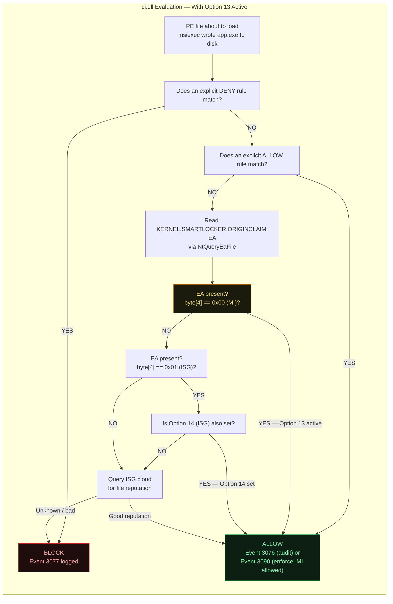

### What Option 13 Does NOT Do

| Misconception | Reality |
|--------------|---------|
| Option 13 trusts msiexec.exe itself | msiexec.exe is MS-signed → trusted by DefaultWindows base policy regardless |
| Option 13 scans files at execution | Only reads a pre-stamped EA — O(1) lookup, no crypto verification |
| Removing Option 13 removes trust from installed files | Files already allowed by explicit rules still run. Only EA-based trust stops working. |
| Option 13 works without AppLocker | AppLockerFltr.sys must be running to stamp EAs. Without it, no EAs exist, Option 13 finds nothing. |
| Option 13 trusts all pre-existing installs | Only files written AFTER AppLockerFltr was active AND MI process was freshly started |
| Option 13 + msiexec = trust any MSI | Trust applies to files WRITTEN by msiexec — not the MSI package itself |

---

## 7. File Evaluation Precedence Order

This is the exact order `ci.dll` uses when deciding whether to allow or block a file. Understanding this order is essential for troubleshooting unexpected blocks or unexpected allows.

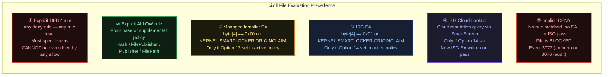

> **Key insight:** DENY always wins. Even if a file has a valid MI EA and Option 13 is set, a matching explicit DENY rule will block it. Always check for unintentional DENY rules when diagnosing unexpected blocks.

---

## 8. Trust Model A — Blanket MI Trust (WITH Option 13)

This is the original Managed Installer design. It is intended for enterprise environments where a trusted software distribution system (Intune, SCCM) deploys all applications and administrators want automatic trust propagation without managing explicit per-app rules.

### Full End-to-End Flow

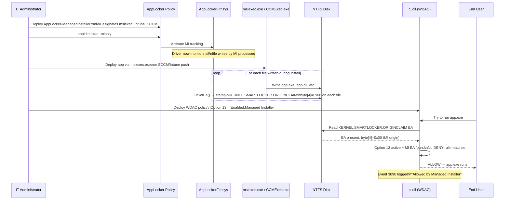

### Architecture Diagram

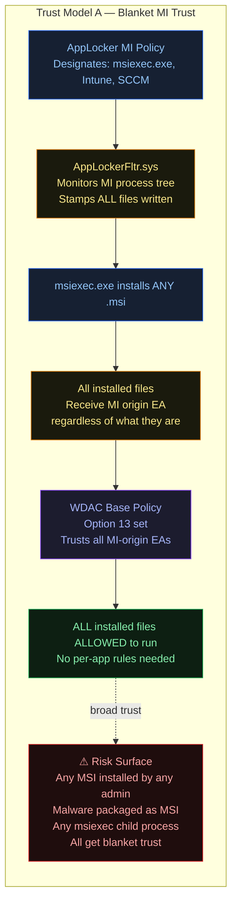

### When to Use Trust Model A

- Organisation uses Intune or SCCM for **100% of application deployments**
- Endpoint users are standard users (cannot install software themselves)
- IT team controls the deployment pipeline end-to-end
- Acceptable to trust everything the distribution system deploys
- Management overhead of per-app rules is not viable at scale (hundreds of apps)

---

## 9. Trust Model B — Selective Allowlisting (WITHOUT Option 13)

This is the model implemented in our PoC. Option 13 is **not set** in the WDAC policy. Instead, each approved application gets its own supplemental WDAC policy containing explicit `FilePublisher` and/or `Hash` allow rules for the files in that application's install directory.

### How It Differs

```
Trust Model A: "I trust the process that installed this"
               Trust = process identity at write time

Trust Model B: "I trust these specific files"
               Trust = file identity at execution time
               (publisher cert + filename + version, or SHA256 hash)
```

### Full End-to-End Flow

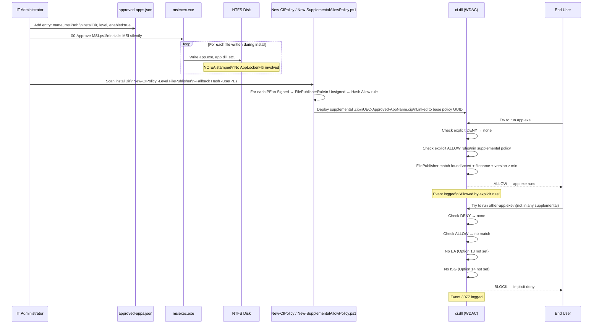

### Architecture Diagram

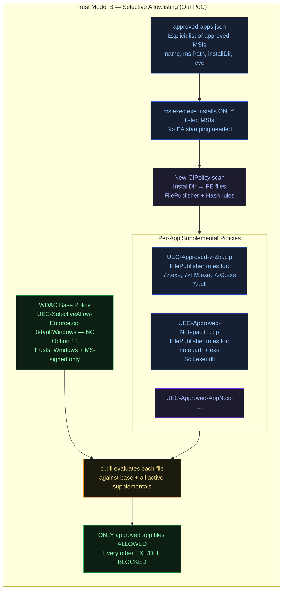

---

## 10. Side-by-Side Trust Model Comparison

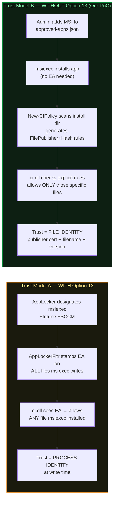

| Dimension | Trust Model A (Option 13 / MI) | Trust Model B (Selective) |
|-----------|-------------------------------|--------------------------|
| Trust basis | Who wrote the file | What the file is |
| Granularity | All files by MI process | Per-file, per-version |
| Survives updates | Yes — new files auto-tagged | Partially — FilePublisher survives minor updates; Hash breaks |
| Admin overhead | Low — set once | Medium — re-scan after updates |
| Attack surface | Higher — any MSI = trusted | Lower — only listed apps trusted |
| Self-updating apps | Handled if updater is MI | Not handled — must re-approve |
| Admin bypass risk | High — admin can install malware MSI | Medium — admin controls approved list |
| Per-app revocation | Not possible (policy-level) | Yes — remove one supplemental .cip |
| Scale | Enterprise (hundreds of apps) | Small-medium (dozens of apps) |
| Option 13 in policy | Required | Not set |
| AppLocker required | Yes (AppLockerFltr) | No |
| EA tagging | Yes | No |

---

## 11. FilePublisher vs Hash vs Publisher Rules

Understanding these three rule types is critical for the Selective Allowlist model — they determine how fragile or resilient your supplemental policies are across app updates.

```mermaid
flowchart TD
    subgraph FILEPUB["FilePublisher Rule — Recommended"]
        direction TB
        FP1["What it matches:\nPublisher cert chain\n+ specific filename (e.g. 7z.exe)\n+ version ≥ minimum version"]
        FP2["XML structure:\n<FilePublisherCondition\n  PublisherName='O=IGOR PAVLOV'\n  ProductName='*'\n  BinaryName='7Z.EXE'>\n  <BinaryVersionRange\n    LowSection='22.0.0.0'\n    HighSection='*' />\n</FilePublisherCondition>"]
        FP3["Survives: minor version bumps\nBreaks if: publisher re-signs with new cert,\nrenames file, version below minimum"]
    end

    subgraph HASH["Hash Rule — Fallback for Unsigned Files"]
        direction TB
        H1["What it matches:\nSHA256 (Authenticode) hash of exact binary"]
        H2["XML structure:\n<Allow\n  ID='ID_ALLOW_X'\n  Hash='A3F9...'\n  FriendlyName='app.exe v1.0' />"]
        H3["Survives: nothing — any byte change = new hash\nBreaks on: ANY update, patch, recompile"]
    end

    subgraph PUB["Publisher Rule — Too Broad"]
        direction TB
        P1["What it matches:\nAll files signed by publisher cert\nRegardless of filename or version"]
        P2["Effective result:\nTrust everything from Adobe Systems Inc.\nTrust everything from Igor Pavlov\nVery broad trust surface"]
        P3["Use only if: you trust the publisher\nfor ALL their software\nNot just one specific app"]
    end

    FILEPUB:::good
    HASH:::warn
    PUB:::bad

    classDef good fill:#0d1f12,color:#86efac,stroke:#16a34a
    classDef warn fill:#1a1a0d,color:#fde68a,stroke:#d97706
    classDef bad fill:#1f0d0d,color:#fca5a5,stroke:#dc2626
```

### How New-CIPolicy Chooses the Rule Level

When `New-SupplementalAllowPolicy.ps1` runs `New-CIPolicy -Level FilePublisher -Fallback Hash`:

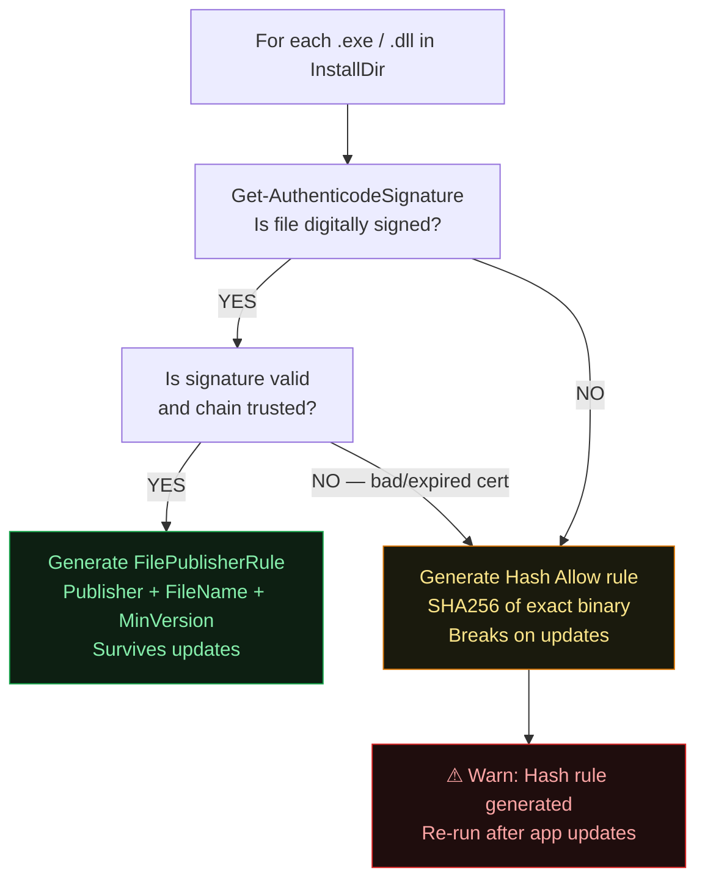

---

## 12. Our PoC Architecture — End-to-End

The PoC lives at `PoC/ManagedInstallerPoC/` and implements Trust Model B (Selective Allowlisting).

### Repository Layout

```
PoC/ManagedInstallerPoC/
│
├── policies/
│   ├── approved-apps.json                    ← Allowlist: which MSIs to approve
│   ├── AppLocker-ManagedInstaller.xml         ← Reference only (Trust Model A)
│   ├── AppLocker-Clear.xml                    ← Teardown: clear all AppLocker rules
│   └── WDAC-ManagedInstaller-Audit-TEMPLATE.xml ← Reference only (Trust Model A)
│
├── scripts/
│   ├── 00-Approve-MSI.ps1                    ← NEW: Master approval script
│   ├── 01-Deploy-AppLockerMI.ps1             ← Reference only (Trust Model A)
│   ├── 02-Build-WDACPolicy.ps1               ← Build base policy (NO Option 13)
│   ├── 03-Deploy-WDACPolicy.ps1              ← Deploy base .cip
│   ├── 04-Test-ManagedInstall.ps1            ← Install MSI + auto-generate supplemental
│   ├── 05-Verify-MITags.ps1                  ← Verify event logs
│   ├── 06-Teardown.ps1                       ← Remove all policies
│   └── New-SupplementalAllowPolicy.ps1        ← REWRITTEN: dir scan + FilePublisher+Hash
│
└── output/                                    ← Generated at runtime
    ├── UEC-SelectiveAllow-Enforce.xml         ← Base policy XML
    ├── UEC-SelectiveAllow-Enforce.cip         ← Base policy binary
    ├── policy-metadata.json                   ← Base policy GUID + paths
    ├── UEC-Approved-7-Zip.xml                 ← Supplemental for 7-Zip
    ├── UEC-Approved-7-Zip.cip                 ← Supplemental binary (deployed)
    ├── supplemental-7-Zip-metadata.json       ← Supplemental metadata
    └── ...                                    ← One set per approved app
```

### Component Interaction Map

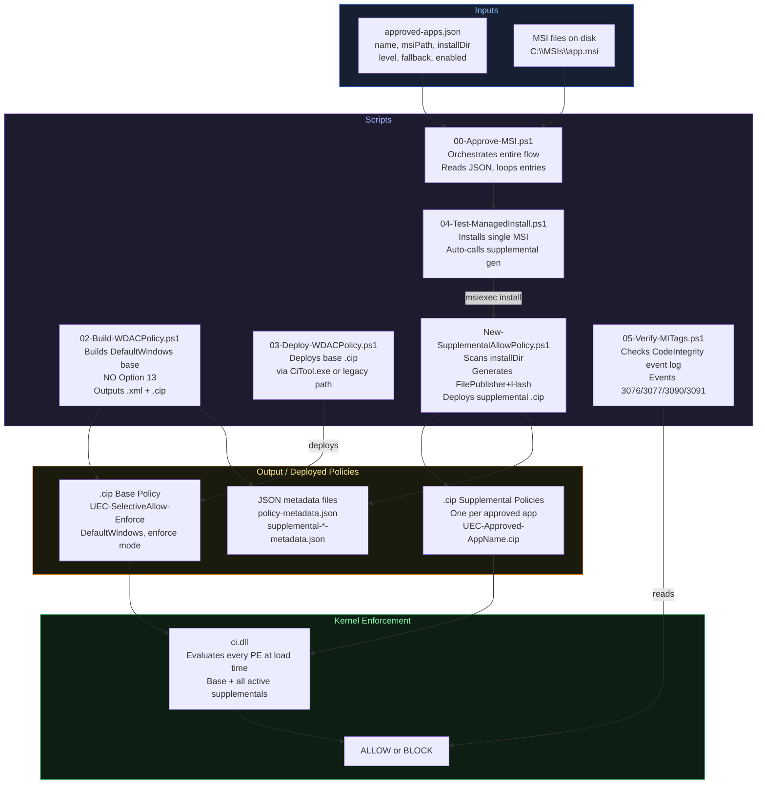

---

## 13. Selective Allowlist Workflow — Step by Step

### Prerequisites

- Windows 10 1903+ or Windows 11 (multiple-policy format required)
- PowerShell 5.1+ running as Administrator
- ConfigCI module: `Add-WindowsCapability -Online -Name 'ConfigCI~~~~0.0.1.0'`
- MSI files downloaded/available locally
- Base WDAC policy not already enforcing conflicting rules

### Full Step-by-Step Workflow

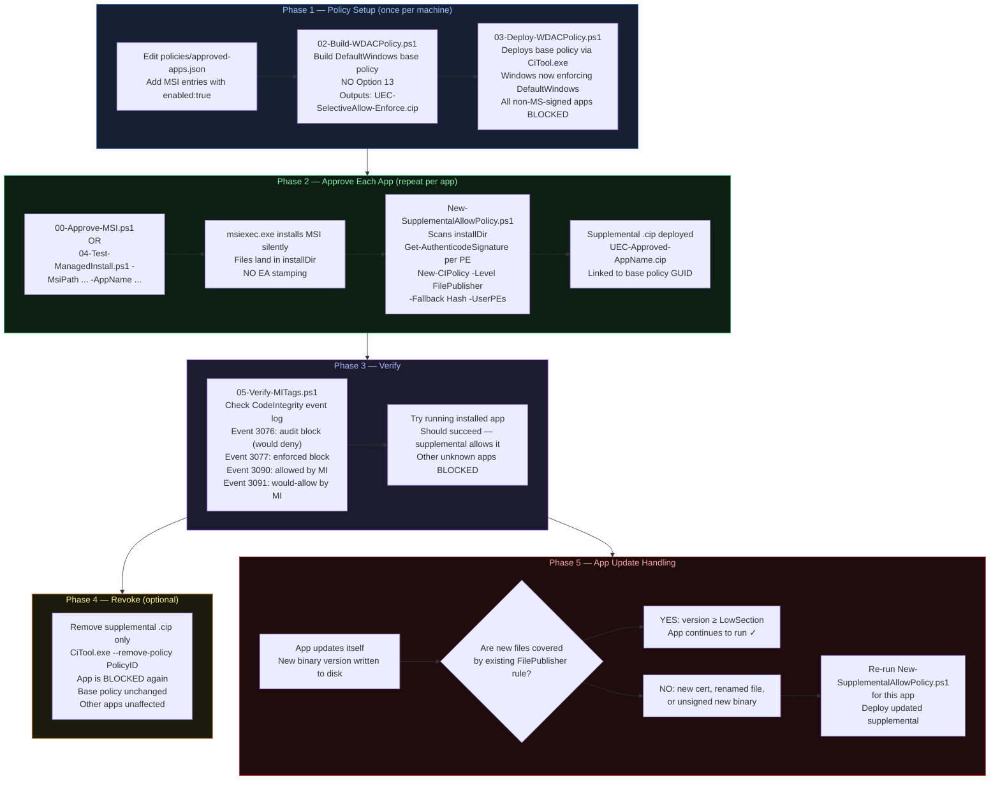

---

## 14. approved-apps.json — The Allowlist Contract

The `approved-apps.json` file is the single source of truth for which applications are trusted on a machine. Each entry represents one approved MSI.

### Schema

```json
{
  "name":       "string — short label, used in policy filenames",
  "msiPath":    "string — absolute path to the .msi file",
  "installDir": "string — expected install dir after MSI runs",
  "level":      "FilePublisher | Hash — primary rule level",
  "fallback":   "Hash — fallback for unsigned files",
  "enabled":    "boolean — true to include in approval run"
}
```

### Example

```json
[
  {
    "name":       "7-Zip",
    "msiPath":    "C:\\MSIs\\7z2408-x64.msi",
    "installDir": "C:\\Program Files\\7-Zip",
    "level":      "FilePublisher",
    "fallback":   "Hash",
    "enabled":    true
  },
  {
    "name":       "Notepad++",
    "msiPath":    "C:\\MSIs\\npp.8.6.7.Installer.msi",
    "installDir": "C:\\Program Files\\Notepad++",
    "level":      "FilePublisher",
    "fallback":   "Hash",
    "enabled":    false
  }
]
```

### How 00-Approve-MSI.ps1 Uses It

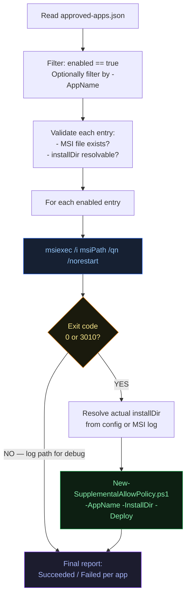

---

## 15. Supplemental Policy Lifecycle

Each approved app generates exactly one supplemental `.cip` policy file. Understanding its lifecycle is essential for ongoing management.

```mermaid
stateDiagram-v2
    [*] --> NotExist: App not yet approved

    NotExist --> Building: 00-Approve-MSI.ps1 runs\nor New-SupplementalAllowPolicy.ps1 runs

    Building --> Deployed: ConvertFrom-CIPolicy → .cip\nCiTool --update-policy .cip\nLinked to base PolicyID

    Deployed --> Active: ci.dll loads supplemental\nApp files are ALLOWED

    Active --> Stale: App updates to new version\nHash rules no longer match\nor new files added outside scan

    Stale --> Building: Re-run New-SupplementalAllowPolicy.ps1\nRe-scan installDir

    Active --> Removed: CiTool --remove-policy PolicyID\nor delete .cip from CiPolicies\\Active\\

    Removed --> NotExist: App files BLOCKED again\nBase policy unchanged
```

### Per-App Policy File Naming

| App | XML | Binary | Metadata |
|-----|-----|--------|----------|
| 7-Zip | `UEC-Approved-7-Zip.xml` | `UEC-Approved-7-Zip.cip` | `supplemental-7-Zip-metadata.json` |
| Notepad++ | `UEC-Approved-Notepad--.xml` | `UEC-Approved-Notepad--.cip` | `supplemental-Notepad---metadata.json` |
| Any name | `UEC-Approved-<safeName>.xml` | `UEC-Approved-<safeName>.cip` | `supplemental-<safeName>-metadata.json` |

> Safe name = AppName with `[^\w\-]` replaced by `-`

### Supplemental Policy Limits

Active policy count limit on Windows:

| OS patch state | Max active policies |
|---------------|-------------------|
| Pre-April 2024 | 32 (base + all supplementals + inbox policies) |
| Post-April 2024 | Unlimited |

Install the April 2024 Cumulative Update to remove the 32-policy ceiling.

---

## 16. What Happens at Execution Time

This section traces exactly what happens from the moment a user double-clicks an EXE through to allow or block, in our current Trust Model B setup.

### Scenario 1 — Approved App (7-Zip) Runs

```mermaid
sequenceDiagram
    participant User as User double-clicks 7zFM.exe
    participant Kernel as NT Kernel
    participant CI as ci.dll
    participant BasePolicy as UEC-SelectiveAllow-Enforce.cip
    participant SupPolicy as UEC-Approved-7-Zip.cip
    participant EventLog as CodeIntegrity EventLog

    User->>Kernel: CreateProcess("C:\Program Files\7-Zip\7zFM.exe")
    Kernel->>CI: Code integrity check required
    CI->>BasePolicy: Load rules — DefaultWindows\nNo Option 13
    CI->>SupPolicy: Load rules — FilePublisher for 7z*.exe\nPublisher=Igor Pavlov, version≥22.0
    CI->>CI: Step 1: Explicit DENY? No match
    CI->>CI: Step 2: Explicit ALLOW? Check supplemental
    CI->>CI: FilePublisherRule matches:\n7zFM.exe, signed Igor Pavlov, v24.08≥22.0 ✓
    CI-->>Kernel: ALLOW
    Kernel-->>User: 7zFM.exe launches successfully
    CI->>EventLog: (no block event — allowed by rule)
```

### Scenario 2 — Non-Approved App Blocked

```mermaid
sequenceDiagram
    participant User as User runs random-app.exe
    participant Kernel as NT Kernel
    participant CI as ci.dll
    participant BasePolicy as UEC-SelectiveAllow-Enforce.cip
    participant SupPolicy as All Supplemental Policies
    participant EventLog as CodeIntegrity EventLog

    User->>Kernel: CreateProcess("C:\Downloads\random-app.exe")
    Kernel->>CI: Code integrity check required
    CI->>BasePolicy: DefaultWindows rules — not MS-signed → no match
    CI->>SupPolicy: All supplementals — no entry for random-app.exe
    CI->>CI: Step 1: DENY? No
    CI->>CI: Step 2: ALLOW explicit? No
    CI->>CI: Step 3: MI EA? Option 13 not set — skip
    CI->>CI: Step 4: ISG? Option 14 not set — skip
    CI->>CI: Step 5: Implicit DENY
    CI-->>Kernel: BLOCK
    Kernel-->>User: Access denied — application blocked
    CI->>EventLog: Event 3077 — "Code Integrity blocked an unsigned file"\nfileName=random-app.exe
```

### Scenario 3 — App Updated, Hash Rule Stale

```mermaid
sequenceDiagram
    participant AppUpdater as App Self-Updater
    participant Disk as NTFS Disk
    participant User as User runs app.exe v2.0
    participant CI as ci.dll
    participant SupPolicy as UEC-Approved-App.cip (v1.0 rules)
    participant Admin as IT Admin

    AppUpdater->>Disk: Overwrite app.exe with v2.0 binary
    Note over Disk: Old Hash rule in supplemental\nno longer matches new binary

    User->>CI: Try to run app.exe v2.0
    CI->>SupPolicy: Hash rule for app.exe:\nExpected SHA256 = <v1.0 hash>
    CI->>CI: SHA256 of new binary ≠ stored hash
    CI->>CI: FilePublisher rule (if exists) — check version
    Note over CI: IF FilePublisher rule with\nLowSection ≤ v2.0 → ALLOW\nIF only Hash rule → BLOCK

    alt FilePublisher rule covers v2.0
        CI-->>User: ALLOW — FilePublisher matched
    else Only Hash rule existed
        CI-->>User: BLOCK — hash mismatch
        Admin->>Admin: Re-run New-SupplementalAllowPolicy.ps1\nfor this app to refresh rules
    end
```

---

## 17. CodeIntegrity Event Log Reference

Location: `Applications and Services Logs > Microsoft > Windows > CodeIntegrity > Operational`

PowerShell to query:
```powershell
Get-WinEvent -LogName 'Microsoft-Windows-CodeIntegrity/Operational' |
    Where-Object { $_.Id -in @(3076, 3077, 3090, 3091) } |
    Select-Object TimeCreated, Id, Message |
    Format-List
```

### Event IDs

| Event ID | Mode | Meaning | Trust Source |
|----------|------|---------|-------------|
| **3076** | Audit | Would have been blocked in enforce mode | — |
| **3077** | Enforce | File was blocked | No rule matched |
| **3090** | Enforce | File allowed — Managed Installer EA | Option 13 + MI EA |
| **3091** | Audit | Would have been allowed by MI | Option 13 + MI EA (audit) |
| **3092** | Enforce | File allowed — ISG | Option 14 + ISG EA |
| **3033** | Either | Driver blocked by WDAC | No valid WHQL/EV cert |
| **3034** | Audit | Driver would be blocked | — |

```mermaid
flowchart LR
    subgraph EVENTS["Event Log Signal Map"]
        direction TB
        E3076["Event 3076\nAudit mode — would block\nUse to identify gaps\nbefore switching to enforce"]
        E3077["Event 3077\nEnforce mode — BLOCKED\nFile name in event details\nAdd to supplemental to fix"]
        E3090["Event 3090\nAllowed by MI origin\nOption 13 active\nbyte[4]=0x00 EA found"]
        E3091["Event 3091\nAudit — would-allow by MI\nOption 13 + audit mode\nProof of EA without enforce"]
    end

    E3076:::audit
    E3077:::block
    E3090:::allow
    E3091:::audit

    classDef audit fill:#1c1c2e,color:#a5b4fc,stroke:#7c3aed
    classDef block fill:#1f0d0d,color:#fca5a5,stroke:#dc2626
    classDef allow fill:#0d1f12,color:#86efac,stroke:#16a34a
```

### Diagnosis Workflow Using Events

```mermaid
flowchart TD
    PROBLEM["User reports: app won't run"]
    QUERY["Query CodeIntegrity log\nFilter: Id in 3076, 3077, 3090, 3091"]
    FOUND3077{"Event 3077 found\nfor app binary?"}
    FOUND3090{"Event 3090 found?"]
    CHECK_SUPP["Check supplemental policies\nIs app in approved-apps.json?\nWas supplemental deployed?"]
    RESCAN["Re-run New-SupplementalAllowPolicy.ps1\nfor this app\nRedeploy supplemental"]
    CHECK_EA["Check if MI is active\nRun 05-Verify-MITags.ps1"]
    NOAPP["App not in approved list\nAdd to approved-apps.json\nRun 00-Approve-MSI.ps1"]
    FIXED["App should now run"]

    PROBLEM --> QUERY
    QUERY --> FOUND3077
    FOUND3077 -->|YES| CHECK_SUPP
    FOUND3077 -->|NO| FOUND3090
    FOUND3090 -->|YES - running Trust Model A| CHECK_EA
    FOUND3090 -->|NO| NOAPP
    CHECK_SUPP -->|"Supplemental missing"| NOAPP
    CHECK_SUPP -->|"Supplemental exists but stale"| RESCAN
    RESCAN --> FIXED
    NOAPP --> FIXED

    style FIXED fill:#0d1f12,color:#86efac,stroke:#16a34a
    style PROBLEM fill:#1f0d0d,color:#fca5a5,stroke:#dc2626
```

---

## 18. Known Limitations — Both Trust Models

### Trust Model A (Option 13 / MI) Limitations

```mermaid
flowchart TD
    subgraph LIMITS_A["Limitations of Option 13 / MI Trust"]
        L1["Self-updating apps\nApp rewrites its own files\nNew version not written by MI process\n→ EA not stamped on new version\n→ Updated app BLOCKED"]
        L2["Admin abuse\nLocal admin can designate any EXE\nas Managed Installer via custom XML\nBypass intent of allowlisting"]
        L3["First-run extension\nIf installed app runs at end of install\nFiles created during first run ALSO get MI EA\nRisk: malware that runs at install time\ngets its files trusted automatically"]
        L4["Extract-and-run timing\nInstaller extracts EXE to temp dir\nImmediately runs it\nEA may not be stamped before execution\nRace condition in some installers"]
        L5["Kernel drivers excluded\nMI only applies to user-mode files\nDrivers still need explicit signer rules\nin WDAC policy"]
        L6["Pre-existing installs not covered\nFiles installed before MI was active\nhave no EA → not trusted by Option 13"]
    end

    style LIMITS_A fill:#1f0d0d,color:#fca5a5,stroke:#dc2626
```

### Trust Model B (Selective / Our PoC) Limitations

```mermaid
flowchart TD
    subgraph LIMITS_B["Limitations of Selective Allowlisting"]
        L1["Hash rule fragility\nUnsigned files → Hash rules\nAny binary change breaks the rule\nMust re-run New-SupplementalAllowPolicy\nafter EVERY app update"]
        L2["Self-updating apps\nApp writes new files not in original scan\nNew files not covered by supplemental\nUser gets blocked after auto-update\nChrome, Teams, Slack, VS Code affected"]
        L3["Policy count ceiling\nPre-April-2024 patch: max 32 active .cip files\nBase + all supplementals + inbox policies\nApprove >30 apps = BSOD risk"]
        L4["Supplemental can only add trust\nCannot use supplemental to DENY something\nBase policy DENY is the only way to block\na previously allowed binary"]
        L5["installDir must be correct\nIf app installs to unexpected path\n(e.g. version-stamped subfolder)\nScan misses the files\nApp blocked unexpectedly"]
        L6["DLL sideloading risk\nIf attacker places malicious DLL\nin the approved app's install dir\nand it matches a FilePublisher rule\n(same publisher, same filename)\nit gets allowed"]
    end

    style LIMITS_B fill:#1a1a0d,color:#fde68a,stroke:#d97706
```

---

## 19. Decision Guide — When to Use MI vs Explicit Rules

```mermaid
flowchart TD
    START["What is your deployment model?"]

    Q1{"Do you use Intune,\nSCCM, or similar MDM\nfor ALL deployments?"}
    Q2{"Are endpoint users\nstandard users (no admin)?"}
    Q3{"Can you accept blanket\ntrust for everything\nyour MDM deploys?"}
    Q4{"Do you have < 30 apps\nto approve?"}
    Q5{"Are your apps\nmainly signed by\nreputable publishers?"}
    Q6{"Do your apps\nself-update\n(Chrome, Teams, etc.)?"}

    MI["Use Trust Model A\nManaged Installer + Option 13\nMDM-based blanket trust\nLow overhead at scale"]
    SELECTIVE["Use Trust Model B\nSelective Allowlisting\nExplicit FilePublisher + Hash rules\nHigher control, more maintenance"]
    HYBRID["Consider Hybrid:\nOption 13 for MDM-deployed apps\n+ supplemental for specific unsigned\nor self-updating apps"]
    WARN_SELF["Note: self-updating apps\nneed separate handling in\neither trust model"]

    START --> Q1
    Q1 -->|YES| Q2
    Q1 -->|NO| SELECTIVE
    Q2 -->|YES| Q3
    Q2 -->|NO - admin users| SELECTIVE
    Q3 -->|YES| MI
    Q3 -->|NO - need granularity| Q4
    Q4 -->|YES| Q5
    Q4 -->|NO - too many| MI
    Q5 -->|YES - mostly signed| SELECTIVE
    Q5 -->|NO - many unsigned| HYBRID
    Q6 -->|YES| WARN_SELF
    WARN_SELF --> HYBRID

    style MI fill:#0d1f12,color:#86efac,stroke:#16a34a
    style SELECTIVE fill:#162032,color:#93c5fd,stroke:#2563eb
    style HYBRID fill:#1c1c2e,color:#a5b4fc,stroke:#7c3aed
    style WARN_SELF fill:#1a1a0d,color:#fde68a,stroke:#d97706
```

---

## 20. Security Considerations

### Trust Model A Security Model

```
Attack surface: msiexec.exe and its entire process tree
Bypass scenario: attacker creates malicious.msi → runs msiexec → malware gets MI EA
                  → WDAC Option 13 allows malware to execute
Mitigation:      restrict who can run msiexec (standard users cannot install MSIs)
                  + monitor for unusual MSI installations
```

### Trust Model B Security Model

```
Attack surface: the approved-apps.json list and who controls it
Bypass scenario: attacker modifies approved-apps.json → adds malicious MSI → runs 00-Approve-MSI.ps1
                  → malware gets supplemental policy → WDAC allows malware
Mitigation:      protect approved-apps.json with ACLs
                  + require signed policies (sign the .cip with EV cert)
                  + audit supplemental policy deployments via Event Log
```

### Comparing Attack Surfaces

```mermaid
quadrantChart
    title Attack Surface vs Management Overhead
    x-axis Low Overhead --> High Overhead
    y-axis Low Security --> High Security
    quadrant-1 Ideal
    quadrant-2 High Security High Cost
    quadrant-3 Avoid
    quadrant-4 Easy but Risky
    Trust Model A - Option 13: [0.2, 0.4]
    Trust Model B - Selective: [0.6, 0.75]
    Hash Only: [0.85, 0.9]
    Publisher Only: [0.1, 0.25]
    No Policy: [0.05, 0.05]
```

### Common Hardening Additions

1. **Sign the base and supplemental policies** — unsigned policies can be removed by any admin. Signed policies require the signing cert to modify or remove.
2. **EFI partition storage** — signed policies stored in EFI survive OS reinstall and are much harder to tamper with.
3. **Audit logging** — monitor `CodeIntegrity` event log + AppLocker event log for anomalies.
4. **HVCI (Hypervisor-Protected Code Integrity)** — runs ci.dll in a protected VM, preventing even kernel-level tampering.

---

## 21. Glossary

| Term | Definition |
|------|-----------|
| **AppLocker** | Windows policy engine for restricting application execution. Operates at user-mode service level. |
| **AppLockerFltr.sys** | Kernel filesystem minifilter driver. Monitors file writes by MI processes and stamps EAs. |
| **AppIDSvc** | AppID Service. Required for AppLocker and MI tracking to function. |
| **appidtel** | CLI tool that activates MI tracking: `appidtel start -mionly` |
| **ci.dll** | Code Integrity kernel DLL. Evaluates every PE at load time against active WDAC policies. |
| **CiTool.exe** | Windows 11 22H2+ CLI for policy management: deploy, remove, query active policies. |
| **ConfigCI** | PowerShell module providing WDAC cmdlets: New-CIPolicy, Set-RuleOption, ConvertFrom-CIPolicy, etc. |
| **EA (Extended Attribute)** | Key-value metadata stored in an NTFS file inode. Separate from file content. |
| **FilePublisher rule** | WDAC rule matching publisher cert + filename + version range. Recommended level. |
| **Hash rule** | WDAC rule matching exact SHA256 of a binary. Breaks on any change. |
| **ISG** | Intelligent Security Graph. Microsoft cloud reputation service. WDAC Option 14. |
| **Managed Installer (MI)** | Trust mechanism where WDAC trusts files written by designated installer processes. |
| **ManagedInstaller collection** | Special AppLocker rule collection that designates MI processes. AuditOnly enforced. |
| **KERNEL.SMARTLOCKER.ORIGINCLAIM** | NT extended attribute stamped by AppLockerFltr on files written by MI processes. |
| **Option 13** | WDAC policy rule: `Enabled:Managed Installer`. Tells ci.dll to trust MI-origin EAs. |
| **Option 14** | WDAC policy rule: `Enabled:Intelligent Security Graph`. Trusts ISG-origin EAs. |
| **Policy ID (GUID)** | Unique identifier for a WDAC policy. Base and supplemental linked via this GUID. |
| **Supplemental policy** | WDAC policy that extends a base policy. Can only add ALLOW rules. References base PolicyID. |
| **UMCI** | User Mode Code Integrity. Option 0 in WDAC. Extends enforcement to user-mode binaries. |
| **WDAC** | Windows Defender Application Control. Kernel-enforced binary trust policy system. |
| **DefaultWindows policy** | WDAC template that trusts all Windows inbox components and WHQL drivers. Starting point for custom policies. |

---

*Document covers: AppLocker architecture, ManagedInstaller rule collection, AppLockerFltr.sys kernel filter, KERNEL.SMARTLOCKER.ORIGINCLAIM EA mechanism, WDAC Option 13 evaluation, Trust Model A (blanket MI), Trust Model B (selective supplemental allowlisting), PoC end-to-end flow, event log diagnosis, limitations, and security considerations.*
