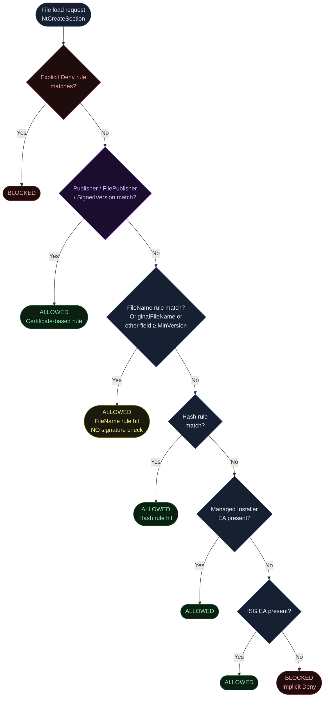
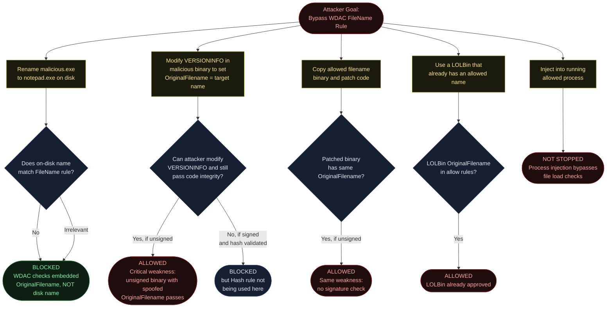
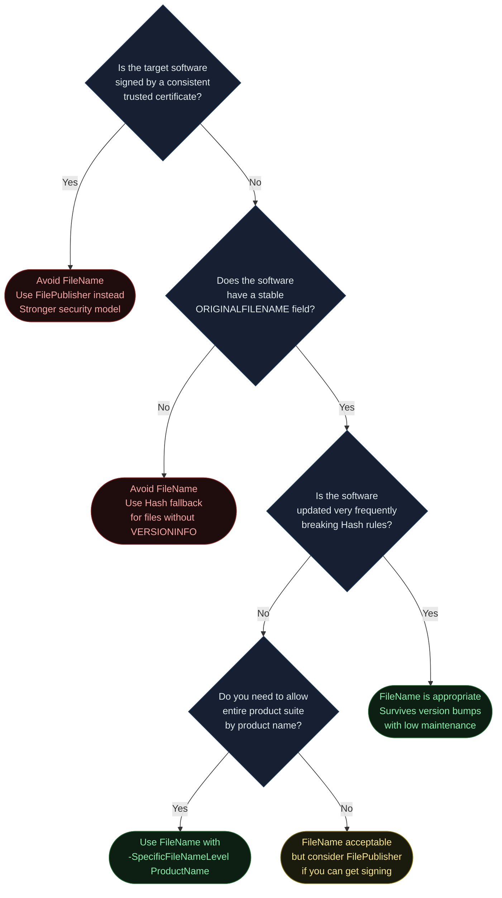
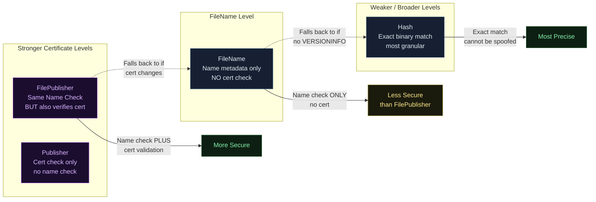
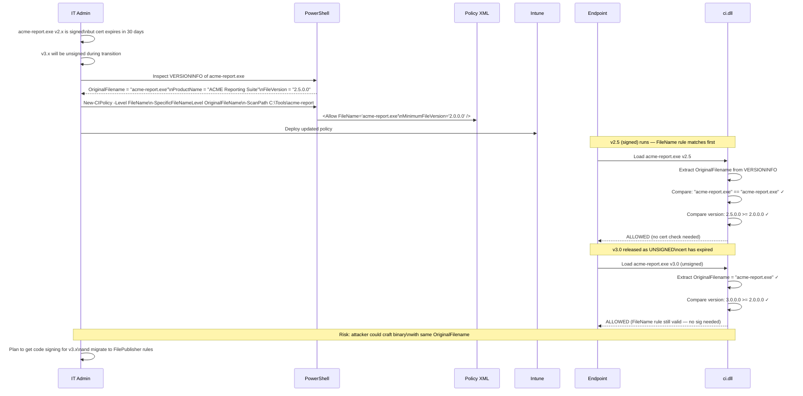

<!-- Author: Anubhav Gain | Category: WDAC File Rule Levels | Topic: FileName -->

# WDAC File Rule Level: FileName

## Table of Contents

1. [Overview](#overview)
2. [How It Works](#how-it-works)
3. [Where in the Evaluation Stack](#where-in-the-evaluation-stack)
4. [XML Representation](#xml-representation)
5. [PowerShell Usage](#powershell-usage)
6. [Pros and Cons](#pros-and-cons)
7. [Attack Resistance Analysis](#attack-resistance-analysis)
8. [When to Use vs When to Avoid](#when-to-use-vs-when-to-avoid)
9. [Interaction with Other Levels](#interaction-with-other-levels)
10. [Real-World Scenario](#real-world-scenario)
11. [OS Version and Compatibility Notes](#os-version-and-compatibility-notes)
12. [Common Mistakes and Gotchas](#common-mistakes-and-gotchas)
13. [Summary Table](#summary-table)

---

## Overview

The **FileName** rule level in WDAC App Control for Business allows or denies execution based on metadata embedded in the file's PE (Portable Executable) VERSIONINFO resource — not based on the file's name on disk. This is a subtle but critical distinction that trips up many administrators.

When WDAC talks about "FileName", it does not mean the filename you see in Windows Explorer (`notepad.exe` on the filesystem). It means the value of the `OriginalFileName` field stored inside the binary itself as part of its compiled-in version information. You can change the file's name on disk to anything you like — `OriginalFileName` inside the PE does not change unless the source code is recompiled with a different value.

A FileName rule also requires a **minimum file version** (`MinimumFileVersion`), which acts as a version floor. Files that carry the matching original filename AND have a version number equal to or greater than the specified minimum will be allowed. Version `0.0.0.0` effectively means "any version with this name."

The most important security caveat: **FileName rules do not verify the signer or publisher**. Any file — signed or unsigned, from Microsoft or from a random developer — that carries the matching `OriginalFileName` metadata will pass a FileName rule. This makes FileName rules significantly weaker than FilePublisher rules and fundamentally different in their trust model.

Despite this limitation, FileName rules are valuable in specific scenarios: allowing a product that is self-updated frequently (so Hash rules would break constantly), allowing a product line from a vendor who rotates signing certificates (so Publisher rules break), or allowing software by product name across versions without needing to track individual file hashes.

---

## How It Works

### The VERSIONINFO Resource and OriginalFileName

Every well-written Windows executable contains a `VERSIONINFO` resource embedded in its `.rsrc` section. This resource is compiled into the binary at build time and contains structured metadata:

```
VERSIONINFO
  FILEVERSION     23, 1, 0, 0
  PRODUCTVERSION  23, 1, 0, 0
  FILEFLAGSMASK   0x3fL
  FILEFLAGS       0x0L
  FILEOS          0x40004L
  FILETYPE        0x1L
  FILESUBTYPE     0x0L
  BEGIN
    BLOCK "StringFileInfo"
    BEGIN
      BLOCK "040904b0"
      BEGIN
        VALUE "OriginalFilename",   "7zFM.exe"
        VALUE "InternalName",       "7zFM"
        VALUE "FileDescription",    "7-Zip File Manager"
        VALUE "ProductName",        "7-Zip"
        VALUE "CompanyName",        "Igor Pavlov"
        VALUE "FileVersion",        "23.01"
        VALUE "ProductVersion",     "23.01"
        VALUE "LegalCopyright",     "Copyright (c) 1999-2023 Igor Pavlov"
      END
    END
    BLOCK "VarFileInfo"
    BEGIN
      VALUE "Translation", 0x0409, 0x04B0
    END
  END
```

The WDAC FileName level specifically targets these string fields. The default sub-level is `OriginalFileName`, but you can target any of the other fields using `-SpecificFileNameLevel`.

### SpecificFileNameLevel Options

When you use `-Level FileName`, the PowerShell cmdlet defaults to creating a rule based on `OriginalFileName`. You can override this:

| `-SpecificFileNameLevel` Value | PE Field Used | Notes |
|---|---|---|
| `OriginalFileName` | `OriginalFilename` string value | Default; most stable, set at compile time |
| `InternalName` | `InternalName` string value | Often matches OriginalFileName without extension |
| `FileDescription` | `FileDescription` string value | Human-readable; may be localized |
| `ProductName` | `ProductName` string value | Allows all files from a product suite by product name |
| `PackageFamilyName` | UWP Package Family Name | For Universal Windows Platform apps |
| `FilePath` | Filesystem path at policy creation time | Special case — see Level-FilePath.md |

### How WDAC Reads These Fields at Runtime

At runtime, when a binary is about to be loaded via `NtCreateSection(SEC_IMAGE)`, the kernel's code integrity component (`ci.dll`) reads the PE's resource directory to locate the `VERSIONINFO` resource. It then parses the `StringFileInfo` block to extract the relevant field value.

The comparison is **case-insensitive** and **exact string match** (no wildcards). The version comparison is a simple four-part numeric comparison (`Major.Minor.Build.Revision`), where the file must be `≥ MinimumFileVersion`.

### Inspecting OriginalFileName on a Live File

```powershell
# Method 1: VersionInfo property
(Get-Item "C:\Windows\System32\notepad.exe").VersionInfo |
    Select-Object OriginalFilename, InternalName, FileDescription, ProductName, FileVersion

# Method 2: Shell.Application COM object (shows exact embedded values)
$shell = New-Object -ComObject Shell.Application
$folder = $shell.Namespace("C:\Windows\System32")
$file = $folder.ParseName("notepad.exe")
# Property 34 = Product Version, 33 = File Version
Write-Host $file.ExtendedProperty("System.Software.ProductName")

# Method 3: Win32 API via P/Invoke (most accurate)
[System.Diagnostics.FileVersionInfo]::GetVersionInfo(
    "C:\Windows\System32\notepad.exe"
) | Select-Object OriginalFilename, InternalName, FileDescription, ProductName
```

### Version Comparison Mechanics

The version floor works as a four-component integer comparison:

```
File Version: 23.01.00.00   →  [23][1][0][0]
Min Version:  10.0.0.0      →  [10][0][0][0]

23 > 10 → File version is ABOVE the minimum → ALLOWED

File Version: 5.0.0.0       →  [5][0][0][0]
Min Version:  10.0.0.0      →  [10][0][0][0]

5 < 10 → File version is BELOW the minimum → NO MATCH (falls through)
```

Using `MinimumFileVersion="0.0.0.0"` accepts any version of the file with the matching name.

---

## Where in the Evaluation Stack



Note the yellow warning color on the FileName match — this represents the fact that FileName rules grant access without any signature verification. Any binary carrying the right embedded name passes, regardless of its publisher, origin, or signing status.

---

## XML Representation

### FileRules Section — Allow by OriginalFileName

```xml
<FileRules>
  <!--
    FileName rule allowing any file with OriginalFilename = "notepad.exe"
    at version 11.0.0.0 or higher.
    WARNING: This allows ANY binary with this embedded name, signed or not.
  -->
  <Allow
    ID="ID_ALLOW_A_NOTEPAD_FN_1"
    FriendlyName="Notepad by OriginalFileName v11+"
    FileName="notepad.exe"
    MinimumFileVersion="11.0.0.0" />
</FileRules>
```

### Allow by ProductName (Covers Entire Product Suite)

```xml
<FileRules>
  <!--
    ProductName-based FileName rule.
    All executables from the "7-Zip" product at any version are allowed.
    Requires -SpecificFileNameLevel ProductName when generating via PowerShell.
  -->
  <Allow
    ID="ID_ALLOW_A_7ZIP_SUITE_FN_1"
    FriendlyName="7-Zip product suite by ProductName"
    FileName="7-Zip"
    MinimumFileVersion="0.0.0.0" />
</FileRules>
```

### Deny by FileName

```xml
<FileRules>
  <!--
    Deny all versions of a file by OriginalFileName.
    Blocks any binary embedding this original filename from running.
  -->
  <Deny
    ID="ID_DENY_D_BLOCKED_TOOL_FN_1"
    FriendlyName="Block legacy-scanner.exe by name"
    FileName="legacy-scanner.exe"
    MinimumFileVersion="0.0.0.0" />
</FileRules>
```

### Full Signing Scenario Wiring

```xml
<SigningScenarios>
  <SigningScenario Value="131" ID="ID_SIGNINGSCENARIO_UMCI" FriendlyName="User Mode">
    <ProductSigners>
      <!-- Certificate-based rules go here -->
      <AllowedSigners />
    </ProductSigners>
    <FileRulesRef>
      <!-- FileName rules are NOT tied to signers — they go here directly -->
      <FileRuleRef RuleID="ID_ALLOW_A_NOTEPAD_FN_1" />
      <FileRuleRef RuleID="ID_ALLOW_A_7ZIP_SUITE_FN_1" />
    </FileRulesRef>
  </SigningScenario>
</SigningScenarios>
```

### Comparison: FileName vs FilePublisher XML

```xml
<!-- FileName rule — NO signer check -->
<Allow ID="ID_ALLOW_A_NOTEPAD_FN"
       FriendlyName="Notepad by name only"
       FileName="notepad.exe"
       MinimumFileVersion="10.0.0.0" />

<!-- FilePublisher rule — INCLUDES signer check via FileAttribRef -->
<Allow ID="ID_ALLOW_A_NOTEPAD_FP"
       FriendlyName="Notepad by FilePublisher"
       FileName="notepad.exe"
       MinimumFileVersion="10.0.0.0" />
<!-- FilePublisher also requires a Signer entry with FileAttribRef:
<Signer ID="ID_SIGNER_MICROSOFT">
  <CertRoot Type="TBS" Value="...thumbprint..." />
  <CertPublisher Value="Microsoft Windows" />
  <FileAttribRef RuleID="ID_ALLOW_A_NOTEPAD_FP" />
</Signer>
-->
```

The key difference: `FilePublisher` requires the file to be signed by a specific publisher AND carry the matching filename. `FileName` only checks the embedded metadata — no certificate required.

---

## PowerShell Usage

### Basic FileName Rule Generation (OriginalFileName Default)

```powershell
# Create a FileName-level policy for a specific file
# Defaults to OriginalFileName sub-level
New-CIPolicy `
    -Level FileName `
    -ScanPath "C:\Program Files\7-Zip" `
    -UserPEs `
    -OutputFilePath "C:\Policies\7zip-filename-policy.xml"
```

### Using SpecificFileNameLevel

```powershell
# Use ProductName as the matching field instead of OriginalFileName
# This allows ALL 7-Zip files by product name, across any version
New-CIPolicy `
    -Level FileName `
    -SpecificFileNameLevel ProductName `
    -ScanPath "C:\Program Files\7-Zip" `
    -UserPEs `
    -OutputFilePath "C:\Policies\7zip-productname-policy.xml"
```

```powershell
# Use InternalName as the matching field
New-CIPolicy `
    -Level FileName `
    -SpecificFileNameLevel InternalName `
    -ScanPath "C:\Tools\MyApp" `
    -UserPEs `
    -OutputFilePath "C:\Policies\myapp-internalname-policy.xml"
```

```powershell
# Use FileDescription as the matching field
New-CIPolicy `
    -Level FileName `
    -SpecificFileNameLevel FileDescription `
    -ScanPath "C:\Tools\MyApp" `
    -UserPEs `
    -OutputFilePath "C:\Policies\myapp-description-policy.xml"
```

### FileName with Hash Fallback

```powershell
# Use FileName as primary; fall back to Hash for files without VERSIONINFO
New-CIPolicy `
    -Level FileName `
    -Fallback Hash `
    -ScanPath "C:\Program Files\MyProduct" `
    -UserPEs `
    -OutputFilePath "C:\Policies\myproduct-fn-hash.xml"
```

This is important because not all executables have a VERSIONINFO resource. Older tools, stripped binaries, and some Go/Rust/C++ executables may lack this metadata entirely. Without a fallback, these files would have no rule generated and would be denied.

### Generate Individual Rules

```powershell
# Create a rule object for a single file
$rules = New-CIPolicyRule `
    -Level FileName `
    -DriverFilePath "C:\Tools\legacy-tool.exe"

# Inspect the generated rule to see what OriginalFileName was found
$rules | Where-Object { $_.TypeId -eq "FileAttrib" } |
    Select-Object FriendlyName, FileName, MinimumFileVersion

# Add to existing policy
Merge-CIPolicy `
    -PolicyPaths "C:\Policies\base-policy.xml" `
    -OutputFilePath "C:\Policies\updated-policy.xml" `
    -Rules $rules
```

### Audit Version Info Before Creating Rules

```powershell
# Audit all EXEs in a folder for their VERSIONINFO fields
# Helps understand what FileName rules will be created
Get-ChildItem "C:\Tools" -Recurse -Filter "*.exe" | ForEach-Object {
    $vi = $_.VersionInfo
    [PSCustomObject]@{
        FilePath        = $_.FullName
        FileName        = $_.Name
        OriginalFilename = $vi.OriginalFilename
        InternalName    = $vi.InternalName
        FileDescription = $vi.FileDescription
        ProductName     = $vi.ProductName
        FileVersion     = $vi.FileVersion
        HasVersionInfo  = ($vi.OriginalFilename -ne $null -and $vi.OriginalFilename -ne "")
    }
} | Export-Csv "C:\Reports\version-info-audit.csv" -NoTypeInformation
```

---

## Pros and Cons

| Attribute | Details |
|---|---|
| **Precision** | Medium — targets a name, not a specific binary |
| **Security Strength** | Lower than Publisher/FilePublisher — no signature check |
| **Update Resilience** | High — name-based rules survive patches and version bumps |
| **Unsigned File Support** | Yes — unsigned files with matching name metadata pass |
| **Kernel Driver Support** | Yes (when used under KMCI scenario) |
| **Maintenance Burden** | Low — set-and-forget unless OriginalFileName changes |
| **Spoofability** | Yes — any binary can embed the target name in its VERSIONINFO |
| **Sub-level Flexibility** | High — ProductName, InternalName, FileDescription all available |
| **Recommended Primary Use** | Frequently updated software without stable signing |
| **Recommended Fallback Use** | Not recommended as fallback (weaker than Hash for security) |
| **Risk of Over-Permission** | Medium-High — grants access to any file claiming the right name |

---

## Attack Resistance Analysis



### Critical Security Note

The single most important security implication of FileName rules: **an attacker with the ability to drop an unsigned binary can craft any VERSIONINFO they want and pass a FileName rule**. This requires the attacker to already have write access to a location from which the binary can be executed — but if your threat model includes insider attackers or compromised user accounts, FileName rules alone are insufficient.

For this reason, Microsoft's guidance is to use `FilePublisher` (which includes a signature check) rather than `FileName` whenever possible. FileName should be reserved for cases where the software is unsigned by design or where the certificate situation is unstable.

---

## When to Use vs When to Avoid



---

## Interaction with Other Levels



### FileName vs FilePublisher: Side-by-Side

| Feature | FileName | FilePublisher |
|---|---|---|
| Checks OriginalFilename | Yes | Yes |
| Checks MinimumFileVersion | Yes | Yes |
| Checks signer certificate | **No** | **Yes** |
| Unsigned files pass | Yes | No |
| Survives certificate rotation | Yes | No |
| Spoof risk | High | Low |
| Maintenance burden | Low | Low-Medium |

---

## Real-World Scenario

An enterprise allows a legacy internal reporting tool (`acme-report.exe`) that is signed with an expiring certificate. Rather than deal with re-signing logistics, the admin uses FileName rules to bridge the gap.



This scenario demonstrates the legitimate use case: bridging periods of certificate instability or transition. The admin accepts the security trade-off (no cert check) as temporary.

---

## OS Version and Compatibility Notes

| Windows Version | FileName Rules | SpecificFileNameLevel | Notes |
|---|---|---|---|
| Windows 10 1507 | Yes (basic) | Limited | Early WDAC, ProductName support varied |
| Windows 10 1607 | Yes | Yes | SpecificFileNameLevel properly supported |
| Windows 10 1703 | Yes | Yes | Multiple policy format available |
| Windows 10 1903+ | Yes | Yes | Full feature parity |
| Windows 11 21H2+ | Yes | Yes | Full support |
| Windows Server 2016 | Yes | Yes | Full support |
| Windows Server 2019 | Yes | Yes | Full support |
| Windows Server 2022 | Yes | Yes | Full support |

Note: `PackageFamilyName` as a SpecificFileNameLevel target requires Windows 10 1709 or later for full UWP app support.

---

## Common Mistakes and Gotchas

- **Confusing on-disk filename with OriginalFilename**: The most common mistake. If a file is renamed on disk to `evil.exe`, a FileName rule for `notepad.exe` will NOT fire — because the rule checks the embedded `OriginalFilename` field inside the PE, not the filesystem name. But also the inverse: renaming `notepad.exe` to `something-else.exe` on disk does NOT prevent the FileName rule from matching (if OriginalFilename inside is still `notepad.exe`).

- **Assuming unsigned files are blocked**: FileName rules explicitly do NOT require a signature. A malicious binary with `OriginalFilename=notepad.exe` set in its VERSIONINFO will pass the FileName rule. Always pair FileName rules with an understanding that unsigned files from any source can pass.

- **Files without VERSIONINFO are silently skipped**: If a binary has no VERSIONINFO resource at all (some stripped C/C++ binaries, many Go binaries), the FileName rule simply does not match. The file will fall through to Hash or be denied. Ensure you use `-Fallback Hash` when scanning directories with such files.

- **Localization issues with FileDescription and ProductName**: Both `FileDescription` and `ProductName` fields can be localized. A multilingual application may have different values in different language builds. A rule created from the English build may not match the Japanese build. `OriginalFilename` and `InternalName` are typically not localized.

- **Using MinimumFileVersion 0.0.0.0 excessively**: While convenient, setting all version floors to `0.0.0.0` means even extremely old versions of software pass the rule. Consider setting a reasonable baseline version that represents the oldest acceptable version in your environment.

- **ProductName rules granting overly broad access**: If a vendor ships many different products and they all use the same ProductName, a ProductName-based rule allows all of them. Verify the ProductName field is specific enough before creating such rules.

- **Forgetting that FileName is weaker than FilePublisher**: Teams sometimes choose FileName to avoid dealing with certificate management, not realizing they have meaningfully reduced their security posture. Document this decision and plan migration to FilePublisher once signing is established.

- **FileName rules in KMCI context**: FileName rules can technically appear in kernel mode scenarios, but kernel drivers are generally expected to be signed (WHQL or otherwise). Using FileName rules for kernel drivers in production is unusual and potentially risky — the lack of signature verification is especially concerning for kernel code.

---

## Summary Table

| Attribute | Value |
|---|---|
| **Rule Level Name** | FileName |
| **XML Element** | `<Allow FileName="..." MinimumFileVersion="..."/>` |
| **What is Checked** | Embedded VERSIONINFO field (OriginalFilename by default) |
| **Signature Required** | No — unsigned files can pass |
| **Minimum Version Check** | Yes — `MinimumFileVersion` attribute |
| **Sub-levels Available** | OriginalFileName, InternalName, FileDescription, ProductName, PackageFamilyName |
| **Covers Unsigned Files** | Yes |
| **Works for Kernel Drivers** | Yes (but not recommended without signing) |
| **Spoofable** | Yes — any binary can set any VERSIONINFO |
| **Update Resilience** | High — name rarely changes across versions |
| **Maintenance Burden** | Low |
| **Security Strength** | Medium-Low (no cert check) |
| **vs FilePublisher** | Weaker — FilePublisher includes cert validation |
| **PowerShell Level Name** | `FileName` |
| **SpecificFileNameLevel Flag** | `-SpecificFileNameLevel <value>` |
| **Min Windows Version** | Windows 10 1507 / Server 2016 (basic); 1607 for full SpecificFileNameLevel |
