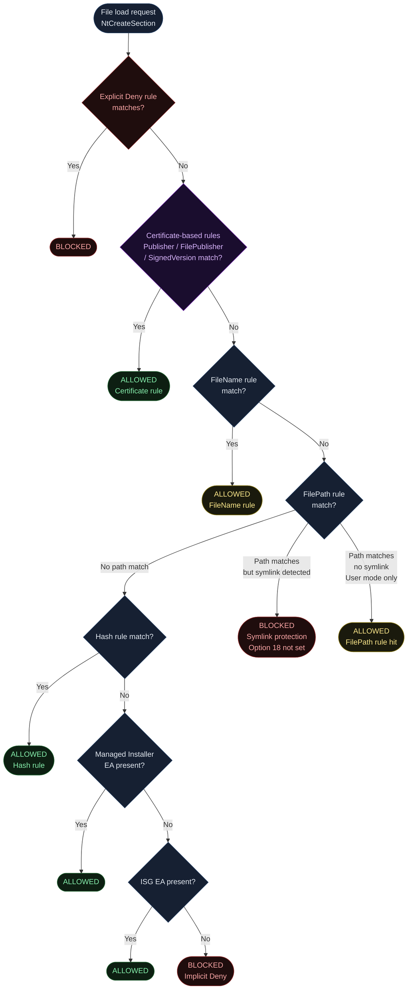
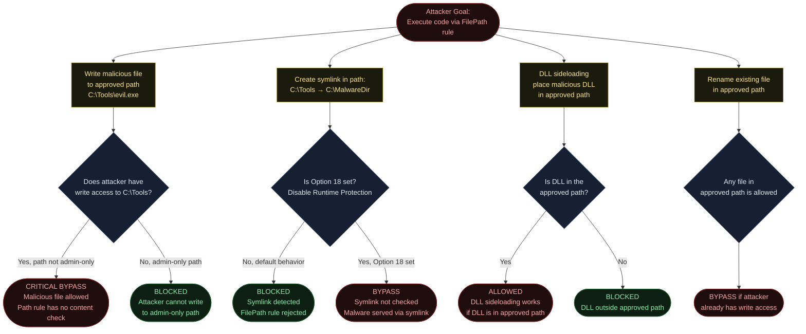
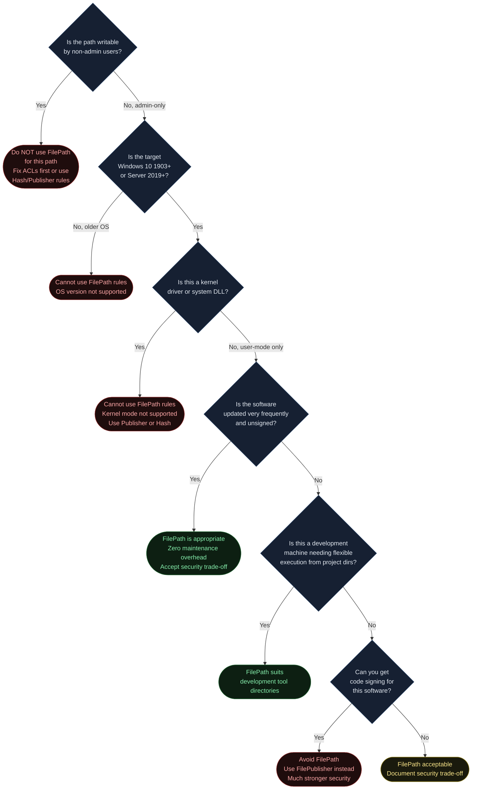
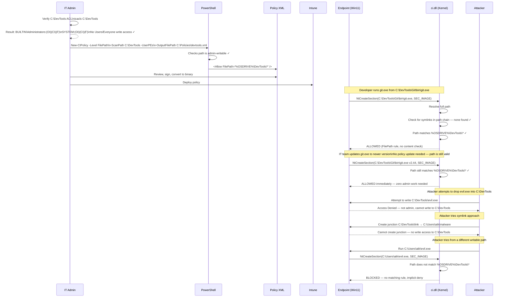

<!-- Author: Anubhav Gain | Category: WDAC File Rule Levels | Topic: FilePath -->

# WDAC File Rule Level: FilePath

## Table of Contents

1. [Overview](#overview)
2. [How It Works](#how-it-works)
3. [Where in the Evaluation Stack](#where-in-the-evaluation-stack)
4. [XML Representation](#xml-representation)
5. [PowerShell Usage](#powershell-usage)
6. [Pros and Cons](#pros-and-cons)
7. [Attack Resistance Analysis](#attack-resistance-analysis)
8. [When to Use vs When to Avoid](#when-to-use-vs-when-to-avoid)
9. [Interaction with Other Levels](#interaction-with-other-levels)
10. [Real-World Scenario](#real-world-scenario)
11. [Option 18 — Disable Runtime FilePath Rule Protection](#option-18--disable-runtime-filepath-rule-protection)
12. [OS Version and Compatibility Notes](#os-version-and-compatibility-notes)
13. [Common Mistakes and Gotchas](#common-mistakes-and-gotchas)
14. [Summary Table](#summary-table)

---

## Overview

The **FilePath** rule level in WDAC App Control for Business allows execution of any code located at a specified filesystem path — without checking what that code actually is. Unlike Hash rules (which check the binary's content) or Publisher rules (which check the binary's digital signature), FilePath rules answer a single question: "Is this binary being loaded from an approved directory?"

In plain English: a FilePath rule for `C:\Tools\*` tells WDAC to allow anything loaded from `C:\Tools\` and its subdirectories, regardless of what those files contain, whether they are signed or unsigned, and whether they have been modified.

This makes FilePath rules the most operationally convenient rule level — and the weakest from a security perspective. They require essentially zero maintenance (no policy updates when software is patched), but they provide no protection against malicious code planted in an approved directory.

**Critical restrictions you must understand before using FilePath rules:**

1. **User mode only** — FilePath rules cannot allow kernel drivers. They apply exclusively to UMCI (User Mode Code Integrity, Scenario 131). Kernel mode code must be approved via certificate-based rules or Hash rules.
2. **Windows 10 1903 or later** — FilePath rules were introduced in version 1903 (May 2019 Update). Earlier versions of Windows cannot evaluate these rules.
3. **Admin-write-only paths** — By default, WDAC only allows FilePath rules pointing to locations that are writable exclusively by administrators. If a standard user can write to the path, WDAC will refuse to create a FilePath rule for it (protection against privilege escalation via path-based allowlisting).
4. **Symlink and junction vulnerability** — Unless Option 18 is set, WDAC performs a runtime check to ensure the path is not a symlink or junction that could redirect execution to unauthorized locations. This is a significant security enhancement introduced alongside FilePath rules.

---

## How It Works

### The Runtime Path Check

Unlike other rule levels which examine the binary's content or metadata, FilePath rules operate at the path level. When `ci.dll` intercepts a file load via `NtCreateSection(SEC_IMAGE)`, it evaluates the **fully resolved NT namespace path** of the file being loaded against the list of FilePath patterns in the policy.

The evaluation steps are:

1. The kernel resolves the file's path to a fully qualified NT object namespace path (e.g., `\Device\HarddiskVolume3\Tools\myapp.exe`)
2. WDAC converts this to a Win32-style path equivalent for policy matching
3. The path is compared against each FilePath rule's pattern using wildcard matching
4. If a match is found, the file is allowed (subject to symlink checks — see below)

### Path Matching and Wildcards

FilePath rules support wildcard matching. Two wildcard forms are relevant:

| Pattern | Matches |
|---|---|
| `C:\Tools\*` | Everything directly inside `C:\Tools\` and any subdirectory |
| `C:\Tools\` | Same as `C:\Tools\*` — trailing slash implies recursive wildcard |
| `C:\Tools\myapp.exe` | Exact path to a single binary |
| `%OSDRIVE%\Tools\*` | Environment variable expansion — `%OSDRIVE%` = the Windows OS drive |

Environment variables available for use in FilePath rules include:
- `%WINDIR%` — Windows directory (`C:\Windows`)
- `%SYSTEM32%` — System32 directory (`C:\Windows\System32`)
- `%OSDRIVE%` — OS volume root (e.g., `C:\`)
- `%PROGRAMFILES%` — Program Files (`C:\Program Files`)
- `%PROGRAMFILESX86%` — Program Files (x86)

Using environment variables is strongly recommended over hardcoded drive letters, because the OS drive letter is not always `C:` (especially on systems with multiple disks or non-standard configurations).

### Symlink and Junction Attack Vector

Consider this attack scenario without symlink protection:

```
Step 1: Attacker has write access to C:\Users\victim\
Step 2: Attacker deletes C:\Users\victim\Downloads\ (or waits for it to be empty)
Step 3: Attacker creates a symlink: C:\Users\victim\Downloads → C:\MalwareFolder
Step 4: Admin has a FilePath rule for C:\Users\victim\Downloads\*
Step 5: Malware in C:\MalwareFolder\ is now accessible via the allowed path
Step 6: Any binary in C:\MalwareFolder\ appears to WDAC as being loaded from C:\Users\victim\Downloads\
```

WDAC's default behavior (when Option 18 is NOT set) protects against this by checking whether the path contains any symbolic links or junction points during evaluation. If a symlink is detected in the path chain, the FilePath rule match is rejected and the file is not allowed.

### Admin-Write-Only Path Requirement

When generating a FilePath policy with `New-CIPolicy`, the cmdlet checks whether the target path is writable only by administrators. If a path has `Everyone: Write`, `Users: Write`, or similar permissions, the cmdlet will refuse to generate a FilePath rule for it.

This is by design: a FilePath rule for a user-writable path would allow any user to place and execute arbitrary code. The admin-write-only requirement ensures that only administrators can place files in the approved locations, preserving the integrity of the allowlist.

To check path permissions:

```powershell
# Check ACL on a path before creating a FilePath rule
Get-Acl "C:\Tools" | Format-List
icacls "C:\Tools"
```

### UNC Path Considerations

FilePath rules can reference UNC paths (e.g., `\\server\share\tools\*`) to allow execution from network shares. However, this introduces significant security risks:
- Network traffic can be intercepted or redirected (MITM)
- Network share ACLs may be misconfigured
- SMB relay attacks can serve arbitrary files

If you use UNC FilePath rules, you **must** enable SMB signing and UNC hardening:

```powershell
# Enable UNC path hardening (required for UNC FilePath rules to be safe)
# Set via Group Policy: Computer Configuration → Administrative Templates →
# MS Security Guide → Enable UNC Hardened Access
```

---

## Where in the Evaluation Stack



Note the yellow warning on the FilePath ALLOWED outcome — like FileName rules, FilePath rules do not check content or signatures. The yellow represents the security caveat inherent to path-based allowlisting.

FilePath rules are also notable for the symlink-check branch: when a FilePath pattern matches but the path contains a symlink or junction, the default behavior is to **block** the file load. This is an automatic protection built into the FilePath rule evaluation logic.

---

## XML Representation

### Basic FilePath Allow Rule

```xml
<FileRules>
  <!--
    FilePath Allow rule: anything loaded from C:\Tools\ is allowed.
    No content or signature check is performed.
    Requires Windows 10 1903+ and admin-only write access to C:\Tools.
  -->
  <Allow
    ID="ID_ALLOW_A_TOOLS_PATH_1"
    FriendlyName="Allow C:\Tools directory"
    FilePath="C:\Tools\*" />
</FileRules>
```

### FilePath Allow with Environment Variable

```xml
<FileRules>
  <!--
    Use %OSDRIVE% to avoid hardcoding the drive letter.
    This allows C:\Tools\ on most systems, D:\Tools\ on systems
    where Windows is installed on D:, etc.
  -->
  <Allow
    ID="ID_ALLOW_A_TOOLS_ENV_PATH_1"
    FriendlyName="Allow Tools directory on OS drive"
    FilePath="%OSDRIVE%\Tools\*" />

  <!--
    Allow a specific portable application folder.
  -->
  <Allow
    ID="ID_ALLOW_A_PORTABLEAPP_1"
    FriendlyName="Allow PortableApps on OS drive"
    FilePath="%OSDRIVE%\PortableApps\*" />
</FileRules>
```

### FilePath Deny Rule

```xml
<FileRules>
  <!--
    Deny all execution from a specific path.
    Useful for blocking execution from user download directories.
  -->
  <Deny
    ID="ID_DENY_D_DOWNLOADS_PATH_1"
    FriendlyName="Block execution from Downloads folder"
    FilePath="%USERPROFILE%\Downloads\*" />
</FileRules>
```

### Signing Scenario Wiring

FilePath rules, like all non-Signer rules, go into `<FileRulesRef>` under the signing scenario. Note that FilePath rules can only appear under UMCI (Scenario 131) — they cannot appear in KMCI (Scenario 12).

```xml
<SigningScenarios>
  <!-- UMCI — User Mode Code Integrity -->
  <SigningScenario Value="131" ID="ID_SIGNINGSCENARIO_UMCI" FriendlyName="User Mode">
    <ProductSigners>
      <AllowedSigners />
    </ProductSigners>
    <FileRulesRef>
      <!-- FilePath rules ARE valid here (user mode) -->
      <FileRuleRef RuleID="ID_ALLOW_A_TOOLS_PATH_1" />
      <FileRuleRef RuleID="ID_ALLOW_A_PORTABLEAPP_1" />
    </FileRulesRef>
  </SigningScenario>

  <!-- KMCI — Kernel Mode Code Integrity -->
  <SigningScenario Value="12" ID="ID_SIGNINGSCENARIO_KMCI" FriendlyName="Kernel Mode">
    <ProductSigners>
      <!-- Kernel drivers CANNOT use FilePath rules -->
      <!-- Must use Publisher/Hash rules here -->
    </ProductSigners>
    <!-- No FilePath refs here — unsupported for kernel mode -->
  </SigningScenario>
</SigningScenarios>
```

### Complete Example with Option 18

```xml
<SiPolicy xmlns="urn:schemas-microsoft-com:sipolicy" PolicyType="Base Policy">
  <VersionEx>10.0.0.0</VersionEx>
  <PolicyID>{YOUR-POLICY-GUID}</PolicyID>
  <BasePolicyID>{YOUR-POLICY-GUID}</BasePolicyID>
  <PlatformID>{2E07F7E4-194C-4D20-B96C-1AD3BB1CAB21}</PlatformID>
  <Rules>
    <Rule>
      <Option>Enabled:Unsigned System Integrity Policy</Option>
    </Rule>
    <!-- Option 18: Disable runtime symlink protection for FilePath rules -->
    <!-- WARNING: Only set this if you fully understand the security implications -->
    <Rule>
      <Option>Disabled:Runtime FilePath Rule Protection</Option>
    </Rule>
  </Rules>
  <EKUs />
  <FileRules>
    <Allow ID="ID_ALLOW_A_TOOLS_PATH" FriendlyName="Allow C:\Tools"
           FilePath="%OSDRIVE%\Tools\*" />
  </FileRules>
  <Signers />
  <SigningScenarios>
    <SigningScenario Value="131" ID="ID_SIGNINGSCENARIO_UMCI" FriendlyName="User Mode">
      <ProductSigners><AllowedSigners /></ProductSigners>
      <FileRulesRef>
        <FileRuleRef RuleID="ID_ALLOW_A_TOOLS_PATH" />
      </FileRulesRef>
    </SigningScenario>
  </SigningScenarios>
  <UpdatePolicySigners />
  <CiSigners />
  <HvciOptions>0</HvciOptions>
</SiPolicy>
```

---

## PowerShell Usage

### Create a FilePath Policy from a Directory Scan

```powershell
# Generate a FilePath policy by scanning a directory
# WDAC cmdlets will check that C:\Tools is admin-writable
New-CIPolicy `
    -Level FilePath `
    -ScanPath "C:\Tools" `
    -UserPEs `
    -OutputFilePath "C:\Policies\tools-filepath-policy.xml"
```

### Create an Individual FilePath Rule

```powershell
# Create a single FilePath rule for a specific directory
$rule = New-CIPolicyRule `
    -Level FilePath `
    -DriverFilePath "C:\PortableApps\7-ZipPortable\App\7-Zip64\7zFM.exe"

# The rule will capture the directory, not just the single file
# Inspect what was generated
$rule | Select-Object FriendlyName, FilePath

# Merge into an existing policy
Merge-CIPolicy `
    -PolicyPaths "C:\Policies\existing-policy.xml" `
    -OutputFilePath "C:\Policies\merged-policy.xml" `
    -Rules $rule
```

### Add Option 18 (Disable Runtime FilePath Rule Protection) via PowerShell

```powershell
# Set Option 18 using Set-RuleOption
# This DISABLES the symlink protection — use with extreme caution
Set-RuleOption `
    -FilePath "C:\Policies\my-policy.xml" `
    -Option 18

# To REMOVE Option 18 (re-enable symlink protection):
Set-RuleOption `
    -FilePath "C:\Policies\my-policy.xml" `
    -Option 18 `
    -Delete
```

### Check Current Policy Options

```powershell
# Read the current options set in a policy
Get-RuleOption -FilePath "C:\Policies\my-policy.xml" |
    Where-Object { $_.Name -like "*FilePath*" -or $_.Name -like "*Runtime*" }
```

### Create FilePath Rules with Environment Variables

```powershell
# Manually craft a FilePath rule using environment variables
# (The PowerShell cmdlets may not auto-substitute env vars — manual XML edit may be needed)
[xml]$policy = Get-Content "C:\Policies\my-policy.xml"
$ns = "urn:schemas-microsoft-com:sipolicy"
$nsm = New-Object System.Xml.XmlNamespaceManager($policy.NameTable)
$nsm.AddNamespace("si", $ns)

$fileRules = $policy.SelectSingleNode("//si:FileRules", $nsm)
$newRule = $policy.CreateElement("Allow", $ns)
$newRule.SetAttribute("ID", "ID_ALLOW_A_TOOLS_ENV")
$newRule.SetAttribute("FriendlyName", "Allow Tools on OS Drive")
$newRule.SetAttribute("FilePath", "%OSDRIVE%\Tools\*")
$fileRules.AppendChild($newRule)
$policy.Save("C:\Policies\my-policy.xml")
```

### Audit Path Permissions Before Creating Rules

```powershell
# Verify that a path is admin-write-only (required for FilePath rules)
function Test-AdminWriteOnly {
    param([string]$Path)

    $acl = Get-Acl $Path
    $userWritable = $acl.Access | Where-Object {
        $_.FileSystemRights -match "Write|FullControl|Modify" -and
        $_.IdentityReference -match "Users|Everyone|Authenticated Users" -and
        $_.AccessControlType -eq "Allow"
    }

    if ($userWritable) {
        Write-Warning "Path '$Path' is writable by non-admin users. FilePath rule NOT recommended."
        $userWritable | Select-Object IdentityReference, FileSystemRights
    } else {
        Write-Host "Path '$Path' is admin-write-only. Safe for FilePath rules." -ForegroundColor Green
    }
}

Test-AdminWriteOnly -Path "C:\Tools"
Test-AdminWriteOnly -Path "C:\ProgramData\MyApp"
```

---

## Pros and Cons

| Attribute | Details |
|---|---|
| **Precision** | Very low — any code in the approved directory is allowed |
| **Security Strength** | Low — no content, signature, or identity check |
| **Update Resilience** | Perfect — no policy update needed when software is updated |
| **Unsigned File Support** | Yes — unsigned files in the path are allowed |
| **Kernel Driver Support** | No — UMCI only |
| **Maintenance Burden** | Very low — path rarely changes |
| **Symlink Attack Risk** | Present — mitigated by default symlink checks (Option 18 disables this) |
| **Admin-Write Path Required** | Yes — WDAC enforces this constraint |
| **Min Windows Version** | Windows 10 1903 / Server 2019 (with May 2019 update) |
| **Recommended Use Case** | Development machines, portable tool directories with admin control |
| **Risk** | High if the approved path can be written to by users |

---

## Attack Resistance Analysis



### Security Summary for FilePath Rules

FilePath rules are fundamentally weaker than all other rule levels because they do not inspect the binary. The entire security guarantee rests on two pillars:

1. **Filesystem ACL integrity** — The approved directory must be writable only by administrators. If this breaks (misconfigured ACLs, elevated compromise), the FilePath rule becomes a door for attackers.
2. **Symlink protection** (Option 18 NOT set) — The default symlink check prevents path redirection attacks.

If both of these hold, FilePath rules provide a reasonable trust boundary. If either is compromised, they provide no protection.

---

## When to Use vs When to Avoid



---

## Interaction with Other Levels

```mermaid
flowchart LR
    subgraph Stronger Levels evaluated first
        PUB[Publisher\nCert chain check]
        FPB[FilePublisher\nCert + name + version]
        SV[SignedVersion\nCert + version floor]
        FN[FileName\nEmbedded name metadata]
    end

    subgraph FilePath Level
        FP[FilePath\nDirectory location only\nNO content check\nUMCI only]
    end

    subgraph Weaker / More Specific Levels evaluated after
        HASH[Hash\nExact binary fingerprint]
    end

    PUB --> |Falls through if\nunsigned or cert mismatch| FPB
    FPB --> |Falls through| SV
    SV --> |Falls through| FN
    FN --> |Falls through if\nno VERSIONINFO or\nno name match| FP
    FP --> |Falls through if\npath does not match| HASH
    HASH --> |Falls through| DENY([Implicit Deny])

    FP -.->|Typical fallback\npairing| HASH

    style PUB fill:#1a0d2e,stroke:#6b21a8,color:#d8b4fe
    style FPB fill:#1a0d2e,stroke:#6b21a8,color:#d8b4fe
    style SV fill:#1a0d2e,stroke:#6b21a8,color:#d8b4fe
    style FN fill:#162032,stroke:#1e3a5f,color:#e2e8f0
    style FP fill:#1a1a0d,stroke:#7a6a00,color:#fde68a
    style HASH fill:#162032,stroke:#1e3a5f,color:#e2e8f0
    style DENY fill:#1f0d0d,stroke:#7f1d1d,color:#fca5a5
```



Note: when you specify `-Level FilePath -Fallback Hash` in `New-CIPolicy`, the cmdlet uses FilePath as the primary level but records Hash rules for files that don't qualify for path-based rules (e.g., files that were in non-admin-writable paths, or when the admin wants to pin specific files within the allowed directory).

---

## Real-World Scenario

An enterprise has a portfolio of portable development tools that developers run from `C:\DevTools`. These tools are updated by the IT team directly (admin-only write access). Developers cannot write to this path. The tools are a mix of signed and unsigned utilities.



---

## Option 18 — Disable Runtime FilePath Rule Protection

Option 18 (`Disabled:Runtime FilePath Rule Protection`) controls whether WDAC checks for symlinks and junctions during FilePath rule evaluation. This option deserves its own section because its implications are significant.

```mermaid
flowchart TD
    subgraph With Option 18 NOT set (Default - Recommended)
        D1([File load from\napproved path]) --> D2{Check for symlinks\nor junctions in\npath chain}
        D2 -- Symlink found --> D3([BLOCKED\nPath integrity check fails\nAttacker cannot redirect path])
        D2 -- No symlinks --> D4([ALLOWED\nPath is clean])
    end

    subgraph With Option 18 SET (Not Recommended)
        E1([File load from\napproved path]) --> E2{Path matches\nFilePath pattern?}
        E2 -- Yes --> E3([ALLOWED\nNo symlink check\nSymlink attacks possible])
        E2 -- No --> E4([BLOCKED])
    end

    style D1 fill:#162032,stroke:#1e3a5f,color:#e2e8f0
    style D2 fill:#162032,stroke:#1e3a5f,color:#e2e8f0
    style D3 fill:#0d1f12,stroke:#1a5c2a,color:#86efac
    style D4 fill:#0d1f12,stroke:#1a5c2a,color:#86efac
    style E1 fill:#1a1a0d,stroke:#7a6a00,color:#fde68a
    style E2 fill:#1a1a0d,stroke:#7a6a00,color:#fde68a
    style E3 fill:#1f0d0d,stroke:#7f1d1d,color:#fca5a5
    style E4 fill:#0d1f12,stroke:#1a5c2a,color:#86efac
```

### When Might You Set Option 18?

There are rare legitimate scenarios:

- **Legacy application compatibility**: Some applications use junction points as part of their installation design. The application itself is not malicious, but it uses junctions to share components between versions.
- **VSS (Volume Shadow Copy) paths**: VSS creates symbolic links for snapshots. If you need to allow execution from VSS paths, Option 18 may be needed.
- **CI/CD environments**: Build systems that use junction points to manage multiple toolchain versions in the same base path.

### When Should You NOT Set Option 18?

- In any production or end-user environment
- On systems that process untrusted input
- On systems accessible to non-administrator users
- Whenever alternative solutions exist (e.g., restructure the path so no junctions are needed)

---

## OS Version and Compatibility Notes

| Windows Version | FilePath Rules | Symlink Protection (Option 18) | Notes |
|---|---|---|---|
| Windows 10 pre-1903 | No | N/A | FilePath rules not supported |
| Windows 10 1903 | Yes | Yes (default on) | First version with FilePath support |
| Windows 10 1909 | Yes | Yes | Stable implementation |
| Windows 10 2004+ | Yes | Yes | Full feature parity |
| Windows 11 21H2+ | Yes | Yes | Full support |
| Windows Server 2019 (1809) | No | N/A | Server 2019 base did not include 1903 features |
| Windows Server 2019 (SAC) | Yes | Yes | Semi-Annual Channel builds with 1903+ features |
| Windows Server 2022 | Yes | Yes | Full support |
| Windows Server 2025 | Yes | Yes | Full support |

**Important**: Windows Server 2019 in LTSC configuration (the common datacenter build based on 1809) does NOT support FilePath rules. Only Server 2022 and later guarantee FilePath rule support in the LTSC track.

---

## Common Mistakes and Gotchas

- **Using FilePath rules on Windows Server 2019 LTSC**: Many organizations run Server 2019 thinking they have 1903+ features, but Server 2019 LTSC is based on 1809. FilePath rules will silently not work or may cause unexpected evaluation outcomes. Always verify OS build with `winver` or `[System.Environment]::OSVersion`.

- **Creating FilePath rules for user-writable directories**: Directories like `%TEMP%`, `%USERPROFILE%\AppData`, `%USERPROFILE%\Downloads`, and `C:\Users\*\` are writable by users. A FilePath rule for any of these is effectively useless as a security control — attackers can drop malware there and have it executed. The PowerShell cmdlet should warn about this, but manual XML authoring may not. Always verify ACLs.

- **Forgetting that FilePath rules are UMCI only**: If you are building a policy that needs to allow kernel drivers, do not use FilePath rules. They will not match in the KMCI (Scenario 12) evaluation. Kernel drivers must be allowed via Publisher/Hash rules.

- **Not accounting for path variability**: Hardcoding `C:\Tools\*` works on systems where Windows is on C:. On systems with D:\Windows or E:\Windows, the path does not match. Always use `%OSDRIVE%\Tools\*` for portability.

- **Setting Option 18 without understanding the implications**: Administrators sometimes set Option 18 because a legitimate application uses junctions and is being blocked by the symlink check. This is understandable but opens a significant attack vector. The correct approach is usually to restructure the application's installation path or move the application to a non-junction path.

- **Confusing FilePath rule with AppLocker path rule**: AppLocker's path rules use the on-disk filename/path as seen in Windows Explorer. WDAC FilePath rules use the NT object namespace path (fully resolved). In practice they look similar, but the underlying mechanics differ, and junction/symlink handling differs significantly.

- **Using FilePath rules as the primary/sole rule level**: FilePath-only policies are the weakest form of WDAC. They should always be combined with Publisher and FilePublisher rules for known software, with FilePath serving only as the fallback for tools where stronger rules are not feasible.

- **Environment variable expansion on deployment targets**: Environment variables like `%OSDRIVE%` are evaluated at rule-application time on the endpoint, not at policy creation time. Verify that the target endpoints have these environment variables set correctly (they normally do by default, but custom system configurations may vary).

---

## Summary Table

| Attribute | Value |
|---|---|
| **Rule Level Name** | FilePath |
| **XML Element** | `<Allow FilePath="path\*"/>` or `<Deny FilePath="path\*"/>` |
| **What is Checked** | Filesystem path of binary being loaded |
| **Content Check** | None — no hash or signature verification |
| **Signature Required** | No |
| **Kernel Mode Support** | No — UMCI (Scenario 131) only |
| **User Mode Support** | Yes |
| **Wildcard Support** | Yes — `*` wildcard, env variable expansion |
| **Symlink Attack** | Mitigated by default; disabled by Option 18 |
| **Admin-Write Requirement** | Yes — path must not be user-writable |
| **Min Windows Version** | Windows 10 1903 / Server 2022 (LTSC) |
| **Maintenance Burden** | Very Low — survives all updates |
| **Security Strength** | Low — any file in the path is allowed |
| **Option 18 Interaction** | Setting Option 18 disables symlink protection |
| **PowerShell Level Name** | `FilePath` |
| **Best Use Case** | Developer tool directories, portable app folders on admin-controlled paths |
