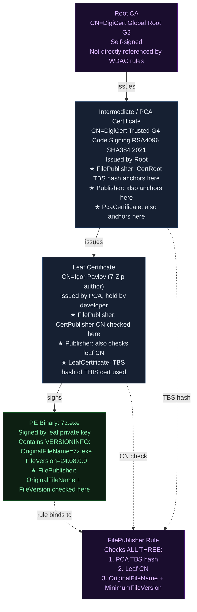
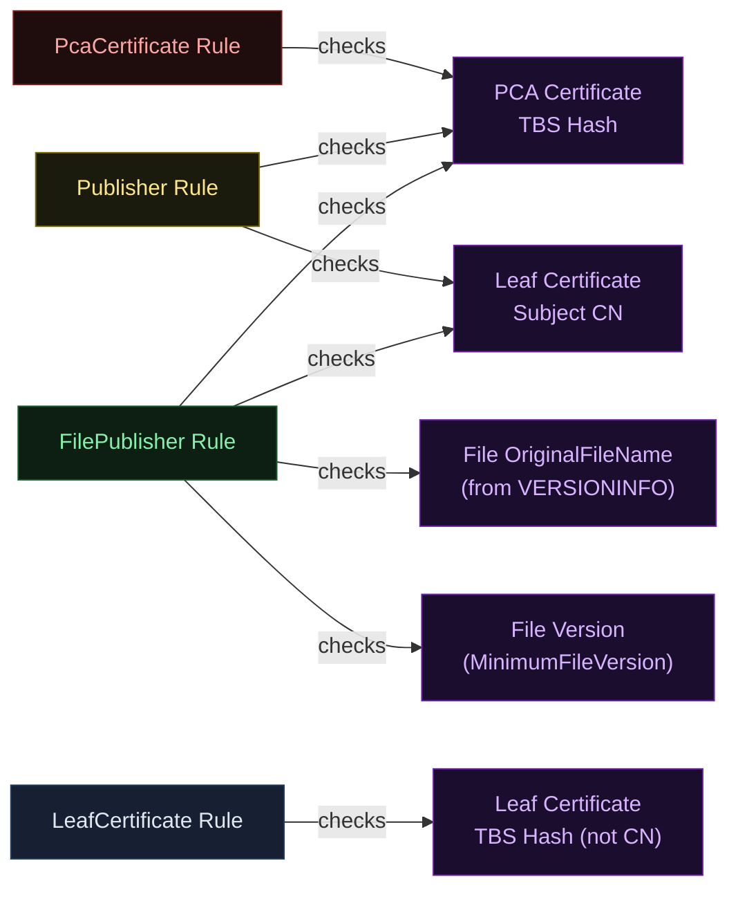
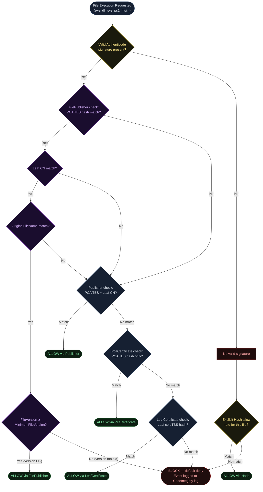
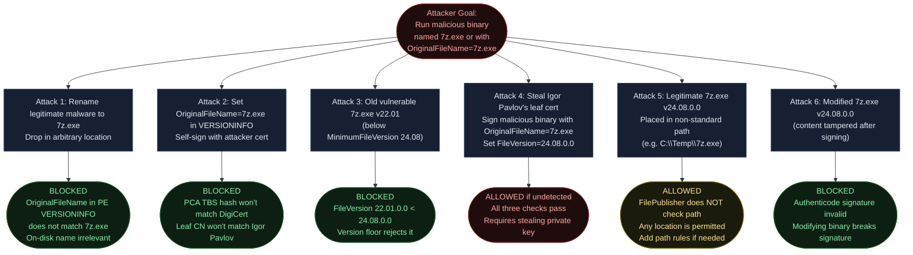
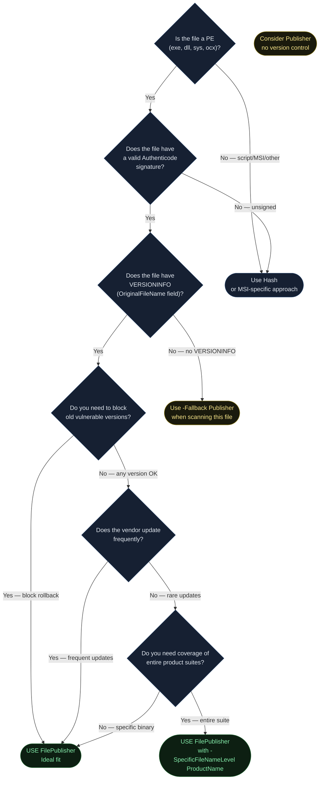

<!-- Author: Anubhav Gain | Category: WDAC File Rule Levels | Topic: FilePublisher -->

# WDAC File Rule Level: FilePublisher

## Table of Contents

1. [Overview](#1-overview)
2. [How It Works](#2-how-it-works)
3. [The Triple-Binding Deep Dive](#3-the-triple-binding-deep-dive)
4. [Certificate Chain Anatomy](#4-certificate-chain-anatomy)
5. [Where in the Evaluation Stack](#5-where-in-the-evaluation-stack)
6. [XML Representation](#6-xml-representation)
7. [PowerShell Examples](#7-powershell-examples)
8. [The -SpecificFileNameLevel Option](#8-the--specificfilenamelevel-option)
9. [Pros and Cons](#9-pros-and-cons)
10. [Attack Resistance Analysis](#10-attack-resistance-analysis)
11. [When to Use vs When to Avoid](#11-when-to-use-vs-when-to-avoid)
12. [Double-Signed File Behavior](#12-double-signed-file-behavior)
13. [MSI and Non-PE File Exception](#13-msi-and-non-pe-file-exception)
14. [Real-World Scenario](#14-real-world-scenario)
15. [OS Version and Compatibility Notes](#15-os-version-and-compatibility-notes)
16. [Common Mistakes and Gotchas](#16-common-mistakes-and-gotchas)
17. [Summary Table](#17-summary-table)

---

## 1. Overview

**FilePublisher is the gold standard rule level for most enterprise WDAC deployments.** It offers the optimal balance between specificity and maintainability — tight enough to prevent abuse, flexible enough to survive routine application updates.

FilePublisher combines three independent binding criteria into a single rule:

1. **OriginalFileName** — the filename baked into the PE file's `VERSIONINFO` resource at compile time (not the on-disk filename, which can be renamed)
2. **Publisher** — the combination of the intermediate CA (PCA) TBS hash and the leaf certificate Subject CN, exactly as in the Publisher rule level
3. **MinimumFileVersion** — a version floor below which files are rejected even if they pass the name and publisher checks

A file must satisfy **all three criteria simultaneously** to be allowed by a FilePublisher rule. This triple-binding creates a rule that is simultaneously:
- Resistant to filename spoofing (uses embedded OriginalFileName, not the on-disk name)
- Resistant to unauthorized signers (publisher check gates on CA + CN)
- Resistant to version rollback attacks (MinimumFileVersion blocks downgraded binaries)

Understanding FilePublisher deeply requires understanding each of its three components, how they interact, and the specific edge cases that affect real-world deployments. This document covers all of that in detail.

---

## 2. How It Works

### Step-by-Step: What ConfigCI Does When Generating FilePublisher Rules

When you run `New-CIPolicy -Level FilePublisher` against a directory of PE files, ConfigCI performs the following for each file:

**Step 1: Read the PE VERSIONINFO Resource**

ConfigCI calls into the Windows resource parsing APIs to extract the `VS_VERSIONINFO` structure embedded in the PE file during compilation. From this structure, it reads:
- `OriginalFileName` — the filename the developer assigned at build time
- `FileVersion` — the version tuple (Major.Minor.Build.Revision)
- `ProductName`, `ProductVersion`, `InternalName`, `CompanyName` — available for `-SpecificFileNameLevel`

**Step 2: Extract Certificate Chain Information**

ConfigCI extracts the Authenticode signature and builds the certificate chain:
- PCA certificate TBS hash → used in `<CertRoot Type="TBS" Value="..."/>`
- Leaf certificate Subject CN → used in `<CertPublisher Value="..."/>`

**Step 3: Create FileAttrib Element**

ConfigCI generates a `<FileAttrib>` element that captures the file-specific attributes:

```xml
<FileAttrib ID="ID_FILEATTRIB_7ZIP" FriendlyName="7-Zip 7z.exe" FileName="7z.exe" MinimumFileVersion="24.08.0.0"/>
```

**Step 4: Link FileAttrib to Signer**

ConfigCI generates a `<Signer>` element (identical structure to Publisher) and adds a `<FileAttribRef>` child that links the signer to the specific file attribute:

```xml
<Signer ID="ID_SIGNER_7ZIP" Name="DigiCert Code Signing PCA">
  <CertRoot Type="TBS" Value="AABBCC..."/>
  <CertPublisher Value="Igor Pavlov"/>
  <FileAttribRef RuleID="ID_FILEATTRIB_7ZIP"/>
</Signer>
```

**Step 5: At Enforcement Time**

When a binary attempts to execute, ConfigCI checks:
1. Does the file's certificate chain produce a PCA TBS hash matching `<CertRoot Value="..."/>`?
2. Does the file's leaf certificate CN match `<CertPublisher Value="..."/>`?
3. Does the file's embedded `OriginalFileName` match `<FileAttrib FileName="..."/>`?
4. Is the file's `FileVersion` ≥ `<FileAttrib MinimumFileVersion="..."/>`?

All four conditions must be true simultaneously. Failure of any one means the FilePublisher rule does not match this file (other rules may still match).

---

## 3. The Triple-Binding Deep Dive

### Binding 1: OriginalFileName (Anti-Rename Protection)

The `OriginalFileName` field is embedded in the PE binary at compile time and is part of the `VERSIONINFO` resource structure. It is the filename the developer intended the binary to have.

**Why OriginalFileName instead of the disk filename?**

On-disk filenames can trivially be changed by anyone with file system write access. `OriginalFileName` is part of the binary's content — you cannot change it without modifying the binary itself (which would invalidate the Authenticode signature).

```powershell
# Read OriginalFileName from a PE file
$vi = (Get-Item "C:\Program Files\7-Zip\7z.exe").VersionInfo
Write-Host "OriginalFileName: $($vi.OriginalFilename)"
Write-Host "FileVersion:      $($vi.FileVersion)"
Write-Host "ProductName:      $($vi.ProductName)"
Write-Host "CompanyName:      $($vi.CompanyName)"
Write-Host "InternalName:     $($vi.InternalName)"
```

**What if a file has no VERSIONINFO?**

If the PE file has no embedded VERSIONINFO resource (e.g., some older tools, deliberately stripped binaries, or non-PE files), ConfigCI cannot generate a FilePublisher rule and falls back to the next level specified in `-Fallback`. Typically this means falling back to Publisher or Hash.

### Binding 2: Publisher (PCA + Leaf CN)

This is identical to the Publisher rule level. See Level-Publisher.md for the full explanation of:
- What "PCA" means (intermediate CA)
- TBS hash computation
- Leaf CN case-sensitive matching
- How ConfigCI resolves the chain

### Binding 3: MinimumFileVersion (Anti-Downgrade Protection)

The `MinimumFileVersion` field specifies the **lowest file version that is allowed**. It corresponds to the `FileVersion` field in the PE's `VERSIONINFO` resource, expressed as a four-part version: `Major.Minor.Build.Revision`.

**Version comparison semantics:**
- `24.08.0.0` allows `24.08.0.0`, `24.08.0.1`, `24.09.0.0`, `25.0.0.0` — anything ≥ the floor
- `24.08.0.0` blocks `24.07.0.0`, `23.0.0.0`, `1.0.0.0` — anything below the floor

When ConfigCI scans a file, it sets `MinimumFileVersion` to the **current version of the scanned file**. This means:
- Any future update (version bump) will still pass the rule without policy changes
- The current version passes exactly
- Any older version (e.g., a known-vulnerable older release) is blocked

**The version floor strategy:**

```
Current scanned version: 24.08.0.0
MinimumFileVersion set to: 24.08.0.0

Later scenarios:
  v24.08.0.0 deployed → ALLOWED (equals floor)
  v24.09.0.0 released → ALLOWED (above floor)
  v25.00.0.0 released → ALLOWED (above floor)
  v24.07.0.0 (old vuln version) → BLOCKED (below floor)
  v1.0.0.0 (ancient version) → BLOCKED (below floor)
```

This is a key security benefit: FilePublisher rules automatically provide version-rollback protection without any additional configuration.

---

## 4. Certificate Chain Anatomy



### FilePublisher vs Other Levels — What Each Checks



---

## 5. Where in the Evaluation Stack



**Important:** ConfigCI evaluates all applicable rules concurrently — a file is allowed if any one rule (from any level) permits it. The flowchart above shows logical precedence for understanding, not strict sequential evaluation.

The key behavior to note: if a FilePublisher rule matches on PCA + CN + FileName but the version check fails (file is too old), ConfigCI does **not** automatically fall through to a Publisher rule. The version-too-old case results in a block (assuming no other broader rule allows it). This is by design — it prevents downgrades.

---

## 6. XML Representation

### Complete FilePublisher Rule XML

```xml
<?xml version="1.0" encoding="utf-8"?>
<SiPolicy xmlns="urn:schemas-microsoft-com:sipolicy" PolicyType="Base Policy">

  <!-- Options section omitted for brevity -->

  <FileRules>

    <!--
      FileAttrib elements define file-specific attributes.
      Each FileAttrib is linked to one or more Signers via FileAttribRef.
      A single Signer can reference multiple FileAttribs (= trust multiple files
      from the same publisher).
    -->

    <!-- 7-Zip main executable -->
    <FileAttrib
        ID="ID_FILEATTRIB_7Z_EXE"
        FriendlyName="7-Zip 7z.exe FilePublisher Rule"
        FileName="7z.exe"
        MinimumFileVersion="24.08.0.0"/>

    <!-- 7-Zip GUI executable -->
    <FileAttrib
        ID="ID_FILEATTRIB_7ZFM_EXE"
        FriendlyName="7-Zip 7zFM.exe FilePublisher Rule"
        FileName="7zFM.exe"
        MinimumFileVersion="24.08.0.0"/>

    <!-- 7-Zip DLL -->
    <FileAttrib
        ID="ID_FILEATTRIB_7ZG_EXE"
        FriendlyName="7-Zip 7zG.exe FilePublisher Rule"
        FileName="7zG.exe"
        MinimumFileVersion="24.08.0.0"/>

    <!-- 7-Zip Shell Extension DLL -->
    <FileAttrib
        ID="ID_FILEATTRIB_7Z_DLL"
        FriendlyName="7-Zip 7-zip.dll FilePublisher Rule"
        FileName="7-zip.dll"
        MinimumFileVersion="24.08.0.0"/>

  </FileRules>

  <Signers>

    <!--
      A single Signer covers all files from the same publisher.
      FileAttribRef elements link this signer to specific file attributes.
      The Signer itself is a Publisher-level rule (PCA TBS + Leaf CN).
      FileAttribRef adds the per-file binding.
    -->
    <Signer ID="ID_SIGNER_7ZIP_001" Name="DigiCert Trusted G4 Code Signing RSA4096 SHA384 2021">

      <!--
        CertRoot: TBS hash of the intermediate CA (PCA) certificate
        This uniquely identifies the CA that issued the leaf cert
      -->
      <CertRoot Type="TBS" Value="3F9001EA83C560D712C24CF213C3D312CB3BFF51EE89435D3430BD06B5D0EECE"/>

      <!--
        CertPublisher: exact Subject CN of the leaf (end-entity) certificate
        Case-sensitive match required
      -->
      <CertPublisher Value="Igor Pavlov"/>

      <!--
        FileAttribRef elements link this signer to specific FileAttrib rules.
        Without FileAttribRef, this would be a Publisher-level rule.
        WITH FileAttribRef, ConfigCI only allows files where BOTH:
          (a) The signer matches (PCA TBS + Leaf CN), AND
          (b) The file's OriginalFileName + FileVersion match this FileAttrib
      -->
      <FileAttribRef RuleID="ID_FILEATTRIB_7Z_EXE"/>
      <FileAttribRef RuleID="ID_FILEATTRIB_7ZFM_EXE"/>
      <FileAttribRef RuleID="ID_FILEATTRIB_7ZG_EXE"/>
      <FileAttribRef RuleID="ID_FILEATTRIB_7Z_DLL"/>

    </Signer>

    <!--
      Example: Google Chrome executables
      Multiple files from same publisher under one Signer
    -->
    <Signer ID="ID_SIGNER_GOOGLE_001" Name="DigiCert SHA2 Assured ID Code Signing CA">
      <CertRoot Type="TBS" Value="1FB86B1168EC831F616CE5A19D821E5A73510DC9..."/>
      <CertPublisher Value="Google LLC"/>
      <FileAttribRef RuleID="ID_FILEATTRIB_CHROME_EXE"/>
      <FileAttribRef RuleID="ID_FILEATTRIB_CHROME_DLL"/>
    </Signer>

  </Signers>

  <SigningScenarios>

    <!-- User mode executables, DLLs, scripts -->
    <SigningScenario Value="12" ID="ID_SIGNINGSCENARIO_WINDOWS" FriendlyName="User Mode">
      <ProductSigners>
        <AllowedSigners>
          <AllowedSigner SignerID="ID_SIGNER_7ZIP_001"/>
          <AllowedSigner SignerID="ID_SIGNER_GOOGLE_001"/>
        </AllowedSigners>
      </ProductSigners>
    </SigningScenario>

  </SigningScenarios>

</SiPolicy>
```

### XML Element Reference for FilePublisher

| Element | Attribute | Role in FilePublisher |
|---|---|---|
| `<FileAttrib>` | `ID` | Unique identifier for cross-referencing |
| `<FileAttrib>` | `FriendlyName` | Human-readable description |
| `<FileAttrib>` | `FileName` | Matches against PE `OriginalFileName` from VERSIONINFO |
| `<FileAttrib>` | `MinimumFileVersion` | Version floor — file must be ≥ this version |
| `<Signer>` | `ID` | Unique identifier |
| `<Signer>` | `Name` | Human-readable label (often PCA CN) |
| `<CertRoot>` | `Type="TBS"`, `Value` | TBS hash of PCA intermediate certificate |
| `<CertPublisher>` | `Value` | Exact leaf certificate Subject CN |
| `<FileAttribRef>` | `RuleID` | Links signer to a specific FileAttrib |
| `<AllowedSigner>` | `SignerID` | References a Signer in the signing scenario |

### How the Link Works: Signer + FileAttribRef = FilePublisher

```
Evaluation logic (pseudo-code):
  foreach (Signer signer in AllowedSigners):
    if (signer.CertRoot.TBSHash == file.PCAChainTBSHash) AND
       (signer.CertPublisher.CN == file.LeafCertCN):
         // Publisher check passed
         if (signer.FileAttribRef.Count == 0):
           // No FileAttribRef → this is a Publisher rule → ALLOW
           return ALLOW
         else:
           // Has FileAttribRef → must also match file attributes
           foreach (FileAttribRef ref in signer.FileAttribRef):
             FileAttrib fa = GetFileAttrib(ref.RuleID)
             if (fa.FileName == file.OriginalFileName) AND
                (file.FileVersion >= fa.MinimumFileVersion):
               return ALLOW
           // No matching FileAttrib → this signer doesn't allow this file
```

---

## 7. PowerShell Examples

### Generate FilePublisher Policy from a Directory

```powershell
# Primary command: generate FilePublisher rules for all PE files in a directory
New-CIPolicy `
    -Level FilePublisher `
    -ScanPath "C:\Program Files\7-Zip" `
    -UserPEs `
    -Fallback Publisher, Hash `
    -OutputFilePath "C:\Policies\7ZipFilePublisher.xml"

# Parameters explained:
# -Level FilePublisher   : Primary rule level
# -ScanPath              : Directory to scan recursively
# -UserPEs               : Include user-mode executables (not just drivers)
# -Fallback Publisher, Hash :
#     If FilePublisher cannot be created (e.g., no VERSIONINFO),
#     first try Publisher level;
#     if Publisher also fails (unsigned), use Hash
# -OutputFilePath        : Output XML file
```

### Generate FilePublisher Rule for a Single File

```powershell
# Single file, FilePublisher level
$rule = New-CIPolicyRule `
    -Level FilePublisher `
    -DriverFilePath "C:\Program Files\7-Zip\7z.exe" `
    -Fallback Hash

# Inspect what was generated
$rule | Format-List *

# The rule object will contain:
# - Signer with CertRoot (PCA TBS hash)
# - Signer with CertPublisher (leaf CN)
# - FileAttrib with FileName (OriginalFileName) and MinimumFileVersion
# - FileAttribRef linking the Signer to the FileAttrib
```

### Inspect What FilePublisher Will Generate Before Running

```powershell
function Get-WDACFilePublisherInfo {
    param([string]$FilePath)

    $sig = Get-AuthenticodeSignature -FilePath $FilePath
    if ($sig.Status -ne "Valid") {
        Write-Warning "Signature status: $($sig.Status) — FilePublisher rule may not be possible"
        return
    }

    $vi = (Get-Item $FilePath).VersionInfo
    $leaf = $sig.SignerCertificate
    $chain = [System.Security.Cryptography.X509Certificates.X509Chain]::new()
    $chain.ChainPolicy.RevocationMode = "NoCheck"
    $null = $chain.Build($leaf)

    Write-Host "`n=== FilePublisher Rule Preview: $FilePath ===" -ForegroundColor Cyan

    Write-Host "`n[FILE ATTRIBUTES - FileAttrib element]"
    Write-Host "  OriginalFileName : $($vi.OriginalFilename)"
    Write-Host "  FileVersion      : $($vi.FileVersion)"
    Write-Host "  ProductName      : $($vi.ProductName)"
    Write-Host "  InternalName     : $($vi.InternalName)"
    Write-Host "  CompanyName      : $($vi.CompanyName)"

    Write-Host "`n[PUBLISHER - Signer CertRoot (PCA)]"
    if ($chain.ChainElements.Count -ge 2) {
        $pca = $chain.ChainElements[1].Certificate
        Write-Host "  PCA Subject      : $($pca.Subject)"
        Write-Host "  PCA Thumbprint   : $($pca.Thumbprint)"
        Write-Host "  PCA Valid Until  : $($pca.NotAfter)"
    }

    Write-Host "`n[PUBLISHER - Signer CertPublisher (Leaf CN)]"
    Write-Host "  Leaf CN          : $($leaf.GetNameInfo('SimpleName', $false))"
    Write-Host "  Leaf Subject     : $($leaf.Subject)"
    Write-Host "  Leaf Valid Until : $($leaf.NotAfter)"

    Write-Host "`n[RESULTING XML SKETCH]"
    Write-Host "  <FileAttrib FileName=`"$($vi.OriginalFilename)`" MinimumFileVersion=`"$($vi.FileVersion)`"/>"
    Write-Host "  <Signer><CertPublisher Value=`"$($leaf.GetNameInfo('SimpleName', $false))`"/>"
    Write-Host "          <FileAttribRef .../></Signer>"
}

# Usage
Get-WDACFilePublisherInfo -FilePath "C:\Program Files\7-Zip\7z.exe"
Get-WDACFilePublisherInfo -FilePath "C:\Program Files\Google\Chrome\Application\chrome.exe"
```

### Merging FilePublisher Rules into a Base Policy

```powershell
# Create rules for multiple applications
$rules7zip  = New-CIPolicyRule -Level FilePublisher -DriverFilePath "C:\Program Files\7-Zip\7z.exe" -Fallback Hash
$rulesChrome = New-CIPolicyRule -Level FilePublisher -DriverFilePath "C:\Program Files\Google\Chrome\Application\chrome.exe" -Fallback Hash

# Combine all rules
$allRules = $rules7zip + $rulesChrome

# Generate a policy from combined rules
New-CIPolicy `
    -Rules $allRules `
    -OutputFilePath "C:\Policies\AppPolicy.xml"

# Convert to binary for deployment
ConvertFrom-CIPolicy `
    -XmlFilePath "C:\Policies\AppPolicy.xml" `
    -BinaryFilePath "C:\Policies\AppPolicy.cip"
```

### Updating MinimumFileVersion After an App Update

```powershell
# Scenario: 7-Zip updated from 24.08 to 24.09
# Existing policy has MinimumFileVersion="24.08.0.0"
# New version is 24.09.0.0 — this PASSES the existing rule (>= 24.08)
# No policy update needed for upgrades!

# BUT: if you want to RAISE the floor (require 24.09+ to block 24.08):
# 1. Rescan with the new version installed
New-CIPolicy `
    -Level FilePublisher `
    -ScanPath "C:\Program Files\7-Zip" `
    -UserPEs `
    -Fallback Publisher, Hash `
    -OutputFilePath "C:\Policies\7ZipFilePublisher_v2409.xml"

# 2. The new rule will have MinimumFileVersion="24.09.0.0"
# 3. Deploy the updated policy — now v24.08 is blocked
```

---

## 8. The -SpecificFileNameLevel Option

By default, FilePublisher uses `OriginalFileName` from the PE VERSIONINFO resource. The `-SpecificFileNameLevel` parameter allows you to change which VERSIONINFO field is used for the filename binding:

```powershell
# Use ProductName instead of OriginalFileName
New-CIPolicy `
    -Level FilePublisher `
    -SpecificFileNameLevel ProductName `
    -ScanPath "C:\Program Files\Microsoft Office" `
    -UserPEs `
    -OutputFilePath "C:\Policies\OfficeByProduct.xml"
```

### Available -SpecificFileNameLevel Values

| Value | VERSIONINFO Field | Use When |
|---|---|---|
| `OriginalFileName` (default) | `OriginalFileName` | Standard — most specific, anti-rename |
| `InternalName` | `InternalName` | When OriginalFileName is inconsistent across versions |
| `FileDescription` | `FileDescription` | Human-readable description |
| `ProductName` | `ProductName` | Broader — covers entire product suite with one name |
| `PackageFamilyName` | App package family name | UWP/MSIX applications |
| `FilePath` | On-disk file path | Path-based (broader, lower security) |

### ProductName Example: Covering Entire Office Suite

```powershell
# Instead of individual rules for winword.exe, excel.exe, powerpoint.exe...
# One FileAttrib per VERSIONINFO field value covers all Office binaries

# With -SpecificFileNameLevel ProductName:
# FileAttrib FileName="Microsoft Office" covers ALL Office executables
# that have ProductName="Microsoft Office" in their VERSIONINFO

New-CIPolicy `
    -Level FilePublisher `
    -SpecificFileNameLevel ProductName `
    -ScanPath "C:\Program Files\Microsoft Office\root\Office16" `
    -UserPEs `
    -Fallback Publisher, Hash `
    -OutputFilePath "C:\Policies\OfficeProductName.xml"
```

### Security Trade-offs of -SpecificFileNameLevel

| Level | Specificity | Maintenance | Spoofing Risk |
|---|---|---|---|
| OriginalFileName | Highest | Per-binary | Must spoof exact original filename |
| InternalName | High | Per-binary | Must know internal name |
| ProductName | Medium | Per product suite | Must have same ProductName |
| FilePath | Low | Path-based | Can be bypassed with path manipulation |

---

## 9. Pros and Cons

| Factor | Assessment |
|---|---|
| **Specificity** | High — triple-binding reduces false positives |
| **Maintenance burden** | Low-Medium — survives version updates; breaks on publisher change |
| **Version control** | Excellent — MinimumFileVersion blocks rollback attacks |
| **Setup complexity** | Medium — more elements per rule than Publisher |
| **Policy XML size** | Larger than Publisher (FileAttrib elements add overhead) |
| **Works for unsigned files** | No — requires Authenticode signature and VERSIONINFO |
| **Works for MSI/script** | No for MSI (see section 13); limited for scripts |
| **Kernel driver support** | Yes |
| **User mode support** | Yes |
| **Survives app update** | Yes — new version ≥ floor passes automatically |
| **Survives cert renewal** | Partially — leaf cert renewal OK; CA change breaks rule |

### Pros

- **Best balance of security and manageability** for most enterprise deployments
- **Version floor** prevents rollback attacks without requiring policy updates on upgrades
- **Anti-rename**: OriginalFileName cannot be changed without breaking the signature
- **Granular trust**: one rule = one specific file from one specific publisher at a minimum version
- **Survives app updates**: no policy change needed when vendor increments version
- **Widely supported**: Microsoft-recommended primary level for enterprise WDAC policies

### Cons

- **The "pinned publisher" problem**: if a vendor switches to a new CA or changes leaf cert CN (e.g., company rename), all FilePublisher rules for that vendor break
- **No MSI support**: MSI installers lack PE VERSIONINFO — FilePublisher cannot be created for them
- **VERSIONINFO required**: files with no embedded VERSIONINFO fall back to Publisher or Hash
- **Larger policy files**: FileAttrib elements add XML overhead at scale
- **Version field inconsistency**: some vendors use ProductVersion vs FileVersion inconsistently; FilePublisher uses FileVersion only
- **Not applicable for scripts**: PowerShell scripts, batch files lack PE signatures (use Publisher or Hash for scripts)

---

## 10. Attack Resistance Analysis



### Residual Risks Summary

| Risk | Severity | Mitigation |
|---|---|---|
| Stolen leaf cert private key | High | Code signing cert protection (HSM, short validity) |
| No path restriction | Medium | Add path-based rules or use PathPublisher for high-risk paths |
| MSI installers not covered | Medium | Use Publisher or Hash for MSI files |
| Vendor switches CA | Low | Monitor vendor PKI; maintain fallback Hash rules for critical files |

---

## 11. When to Use vs When to Avoid



---

## 12. Double-Signed File Behavior

Many Windows PE files carry multiple Authenticode signatures — for example, a primary SHA-256 signature and a legacy SHA-1 counter-signature. Some files (particularly Microsoft-signed OS components) may carry two full signature blocks.

When ConfigCI scans a double-signed file at FilePublisher level:

1. It processes each signature independently
2. For each signature, it extracts the PCA TBS hash and leaf CN
3. If the two signatures come from **different CA chains** (different PCA TBS hashes), two separate `<Signer>` elements are created, each with the same `<FileAttribRef>`
4. If the two signatures share the same PCA chain but differ only in leaf cert (rare), two `<CertPublisher>` matches are needed — this produces two `<Signer>` elements

**Example: A file with SHA-256 and SHA-1 dual signatures**

```xml
<FileRules>
  <!-- Single FileAttrib for the file — shared by both signers -->
  <FileAttrib
      ID="ID_FILEATTRIB_EXAMPLE"
      FriendlyName="example.dll"
      FileName="example.dll"
      MinimumFileVersion="10.0.19041.0"/>
</FileRules>

<Signers>
  <!-- Signer from SHA-256 signature chain -->
  <Signer ID="ID_SIGNER_SHA256" Name="Microsoft Code Signing PCA 2011">
    <CertRoot Type="TBS" Value="4E80BE107C860A21A..."/>
    <CertPublisher Value="Microsoft Windows"/>
    <FileAttribRef RuleID="ID_FILEATTRIB_EXAMPLE"/>
  </Signer>

  <!-- Signer from SHA-1 signature chain (legacy, older CA) -->
  <Signer ID="ID_SIGNER_SHA1" Name="Microsoft Code Signing PCA">
    <CertRoot Type="TBS" Value="580A6F4CC4E4B669B..."/>
    <CertPublisher Value="Microsoft Windows"/>
    <FileAttribRef RuleID="ID_FILEATTRIB_EXAMPLE"/>
  </Signer>
</Signers>
```

**At enforcement time:** ConfigCI checks all signatures in the file against all rules. The file is allowed if any one signature matches any one rule. Dual-signed files therefore have two chances to match — this is the intended behavior and increases robustness.

**Policy size implication:** Large directories of dual-signed Microsoft OS files will produce roughly 2× the expected number of Signer elements. This is normal.

---

## 13. MSI and Non-PE File Exception

### Why MSI Files Cannot Use FilePublisher

MSI files are structured storage files — they are not Portable Executable (PE) format binaries. As a result:
- They do not have a `VS_VERSIONINFO` resource structure
- There is no `OriginalFileName` field
- There is no `FileVersion` field in PE format

Without `OriginalFileName` and `FileVersion`, ConfigCI cannot construct the `<FileAttrib>` element that is essential for FilePublisher. The scan will fall back to the next level in `-Fallback`.

### What to Use Instead for MSI Files

| File Type | Recommended Rule Level | Reason |
|---|---|---|
| MSI installer | Publisher | MSI carries Authenticode; use publisher trust |
| MSIX package | Publisher or PackageFamilyName | MSIX has its own trust model |
| PowerShell scripts (.ps1) | Publisher (script signing) | Scripts don't have PE VERSIONINFO |
| Batch files (.bat/.cmd) | Hash | Batch files rarely signed |
| VBScript (.vbs) | Hash | Rarely signed |
| DLL (with VERSIONINFO) | FilePublisher | Normal PE with VERSIONINFO |
| EXE (with VERSIONINFO) | FilePublisher | Normal PE with VERSIONINFO |
| SYS driver (with VERSIONINFO) | FilePublisher | Kernel drivers typically have VERSIONINFO |

### Handling MSI in a FilePublisher Policy

```powershell
# Scan a directory containing both PE files and MSI installers
# -Fallback Publisher handles MSI (and other non-VERSIONINFO files)
New-CIPolicy `
    -Level FilePublisher `
    -ScanPath "C:\Software\Adobe" `
    -UserPEs `
    -Fallback Publisher, Hash `
    -OutputFilePath "C:\Policies\AdobePolicy.xml"

# The resulting XML will contain:
# - FilePublisher rules for .exe and .dll files (have VERSIONINFO)
# - Publisher rules for .msi files (no VERSIONINFO, fallback to Publisher)
# - Hash rules for truly unsigned files (final fallback)
```

---

## 14. Real-World Scenario

**Scenario: Enterprise deploying 7-Zip via SCCM with update-resilient policy**

```mermaid
sequenceDiagram
    participant Admin as IT Admin
    participant RefPC as Reference Machine
    participant PS as PowerShell ConfigCI
    participant SCCM as SCCM/Intune
    participant Fleet as Enterprise Fleet (1000 PCs)
    participant SevenZip as 7-Zip Update Server

    Note over Admin,Fleet: Initial Deployment

    Admin->>RefPC: Install 7-Zip v24.08 on reference machine
    Admin->>PS: New-CIPolicy -Level FilePublisher -ScanPath "C:\Program Files\7-Zip"
    PS->>RefPC: Reads 7z.exe VERSIONINFO: OriginalFileName=7z.exe, FileVersion=24.08.0.0
    PS->>RefPC: Reads Authenticode: PCA=DigiCert Trusted G4, Leaf CN=Igor Pavlov
    PS-->>Admin: Generates FileAttrib(FileName=7z.exe, MinimumFileVersion=24.08.0.0)
    PS-->>Admin: Generates Signer(CertRoot=[DigiCert TBS], CertPublisher=Igor Pavlov)
    Admin->>SCCM: Upload policy + deploy 7-Zip v24.08 package
    SCCM->>Fleet: Deploy policy + 7-Zip v24.08
    Fleet->>Fleet: 7z.exe runs: PCA match + Leaf CN match + FileName match + 24.08≥24.08 ✓

    Note over Admin,Fleet: 3 months later: 7-Zip v24.09 released

    SevenZip->>Fleet: Windows Update / SCCM delivers 7-Zip v24.09
    Fleet->>Fleet: New 7z.exe: OriginalFileName=7z.exe, FileVersion=24.09.0.0
    Fleet->>Fleet: Policy check: PCA match ✓ Leaf CN=Igor Pavlov ✓ FileName=7z.exe ✓
    Fleet->>Fleet: Version check: 24.09.0.0 >= 24.08.0.0 ✓
    Fleet-->>Fleet: ALLOWED — no policy update required!

    Note over Admin,Fleet: Security incident: 7-Zip v22.01 (vulnerable) found on some machines

    Admin->>Fleet: Attempt to run v22.01 7z.exe
    Fleet->>Fleet: Policy check: PCA ✓ Leaf CN ✓ FileName ✓
    Fleet->>Fleet: Version check: 22.01.0.0 >= 24.08.0.0? NO
    Fleet-->>Fleet: BLOCKED — version floor prevents rollback
    Fleet->>Fleet: Event 3077 logged to CodeIntegrity audit log

    style Admin fill:#162032,stroke:#1e3a5f,color:#e2e8f0
    style RefPC fill:#162032,stroke:#1e3a5f,color:#e2e8f0
    style PS fill:#1a0d2e,stroke:#6b21a8,color:#d8b4fe
    style SCCM fill:#162032,stroke:#1e3a5f,color:#e2e8f0
    style Fleet fill:#0d1f12,stroke:#1a5c2a,color:#86efac
    style SevenZip fill:#162032,stroke:#1e3a5f,color:#e2e8f0
```

---

## 15. OS Version and Compatibility Notes

| Feature | Windows Version | Notes |
|---|---|---|
| FilePublisher level (UMCI) | Windows 10 1703+ | FileAttrib/FileAttribRef elements introduced |
| FilePublisher level (KMCI) | Windows 10 1703+ | Kernel mode FilePublisher support |
| `-SpecificFileNameLevel` | Windows 10 1709+ | ProductName, InternalName, etc. |
| `PackageFamilyName` in FileAttrib | Windows 10 1709+ | UWP app trust |
| Multiple active policies | Windows 10 1903+ | Enables supplemental + base policy combo |
| CiTool.exe deployment | Windows 11 22H2+ | No-reboot policy update |
| HVCI + FilePublisher | Windows 10 1703+ | HVCI enforces KMCI FilePublisher rules strictly |
| `New-CIPolicyRule -Level FilePublisher` | Windows 10 1703+ | PowerShell cmdlet support |

### Minimum Version for FilePublisher

FilePublisher is not available on Windows 10 1607 (Anniversary Update) and earlier. On those versions, Publisher is the most specific cert-based level available. Always check `%SystemRoot%\System32\CI.dll` version if deploying to mixed fleets with older Windows versions.

---

## 16. Common Mistakes and Gotchas

### Mistake 1: Forgetting FilePublisher Does NOT Check File Path

A FilePublisher rule allows `7z.exe` (with matching publisher and version) **anywhere on disk** — `C:\Program Files\7-Zip\7z.exe`, `C:\Temp\7z.exe`, `C:\Users\Public\7z.exe`. If you need path restriction, combine FilePublisher with path-based controls or use separate path deny rules.

### Mistake 2: Expecting Version Downgrades to Be Blocked When Using Publisher Fallback

If your policy has a FilePublisher rule for 7z.exe with MinimumFileVersion=24.08 **and** a Publisher rule for Igor Pavlov (added as fallback), the Publisher rule has no version restriction. An old v22.01 7z.exe that fails FilePublisher will still be allowed by the Publisher fallback rule.

**Solution:** If version protection matters, do NOT include a Publisher-level fallback for the same vendor. Use only Hash as the fallback, or accept that unsigned/no-VERSIONINFO files are blocked.

### Mistake 3: OriginalFileName vs On-Disk Filename Confusion

```powershell
# Confusing scenario:
# File on disk: C:\Tools\compression-tool.exe
# VERSIONINFO OriginalFileName: 7z.exe
# VERSIONINFO FileVersion: 24.08.0.0
# Signed by: Igor Pavlov cert chain

# FilePublisher rule has FileName="7z.exe"
# Even though file is named "compression-tool.exe" on disk,
# it WILL match the FilePublisher rule because OriginalFileName="7z.exe"
# This is by design — prevents bypass by renaming
```

### Mistake 4: Version String Format Mismatches

FileVersion in PE VERSIONINFO is a 64-bit value (four 16-bit fields). MinimumFileVersion must be expressed as `Major.Minor.Build.Revision`. Mismatches in field count cause evaluation errors:

```xml
<!-- WRONG — only three parts -->
<FileAttrib MinimumFileVersion="24.08.0"/>

<!-- CORRECT — four parts required -->
<FileAttrib MinimumFileVersion="24.08.0.0"/>
```

### Mistake 5: MSI Silently Falls Back to Publisher

When scanning a directory containing both PE files and MSI files with `-Level FilePublisher -Fallback Publisher`, the resulting policy will silently contain Publisher rules for the MSI files. This is broader than expected. Audit the generated XML to confirm which rules were created at which level.

```powershell
# After generating policy, inspect what levels were actually used
[xml]$policy = Get-Content "C:\Policies\MyPolicy.xml"
$signers = $policy.SiPolicy.Signers.Signer
$fileAttribs = $policy.SiPolicy.FileRules.FileAttrib

Write-Host "FilePublisher rules (have FileAttribRef): $(($signers | Where-Object { $_.FileAttribRef }).Count)"
Write-Host "Publisher rules (no FileAttribRef):        $(($signers | Where-Object { -not $_.FileAttribRef }).Count)"
Write-Host "FileAttrib elements:                        $($fileAttribs.Count)"
```

### Mistake 6: The "Pinned Publisher" Problem After Cert Renewal

If a vendor renews their code signing certificate and the new leaf certificate has a different CN (e.g., company renamed from "Acme Corp" to "Acme Software LLC"), all FilePublisher rules with `<CertPublisher Value="Acme Corp"/>` will stop matching. The new binaries will be blocked.

**Mitigation strategies:**
- Subscribe to vendor security announcements for PKI changes
- Keep audit mode enabled on a subset of machines to detect future breaks early
- Maintain `-Fallback Hash` rules for critical business applications

### Mistake 7: Ignoring the FileVersion vs ProductVersion Distinction

`MinimumFileVersion` uses the `FileVersion` field from VERSIONINFO, **not** `ProductVersion`. Some vendors increment ProductVersion for marketing releases but FileVersion lags behind, or vice versa. Always verify which field is actually changing on update by inspecting with `(Get-Item $path).VersionInfo`.

---

## 17. Summary Table

| Property | Value |
|---|---|
| **Rule Level Name** | FilePublisher |
| **Binding 1** | Intermediate CA (PCA) TBS hash — `<CertRoot Type="TBS">` |
| **Binding 2** | Leaf certificate Subject CN — `<CertPublisher Value="..."/>` |
| **Binding 3** | OriginalFileName from PE VERSIONINFO — `<FileAttrib FileName="..."/>` |
| **Binding 4** | MinimumFileVersion from PE VERSIONINFO — `<FileAttrib MinimumFileVersion="..."/>` |
| **Version Floor Direction** | ≥ MinimumFileVersion (higher versions pass; lower versions blocked) |
| **Filename Field Used** | OriginalFileName by default; overridable via `-SpecificFileNameLevel` |
| **Works for MSI** | No — MSI lacks PE VERSIONINFO; falls back to Publisher or Hash |
| **Works for Scripts** | No — scripts lack PE signatures and VERSIONINFO |
| **Survives App Updates** | Yes — newer versions pass the floor automatically |
| **Survives Cert Renewal** | Partial — leaf CN change breaks rule; CA change breaks rule |
| **Blocks Version Rollback** | Yes — MinimumFileVersion enforces floor |
| **XML Elements** | `<FileAttrib>` + `<Signer>` + `<CertRoot>` + `<CertPublisher>` + `<FileAttribRef>` |
| **PowerShell Parameter** | `-Level FilePublisher` |
| **Key Advantage** | Triple binding = best security/maintenance balance |
| **Key Limitation** | Publisher infrastructure change requires policy update |
| **Recommended Fallback** | `-Fallback Publisher, Hash` |
| **Introduced** | Windows 10 1703 |
| **Microsoft Recommendation** | Primary level for most enterprise deployments |
