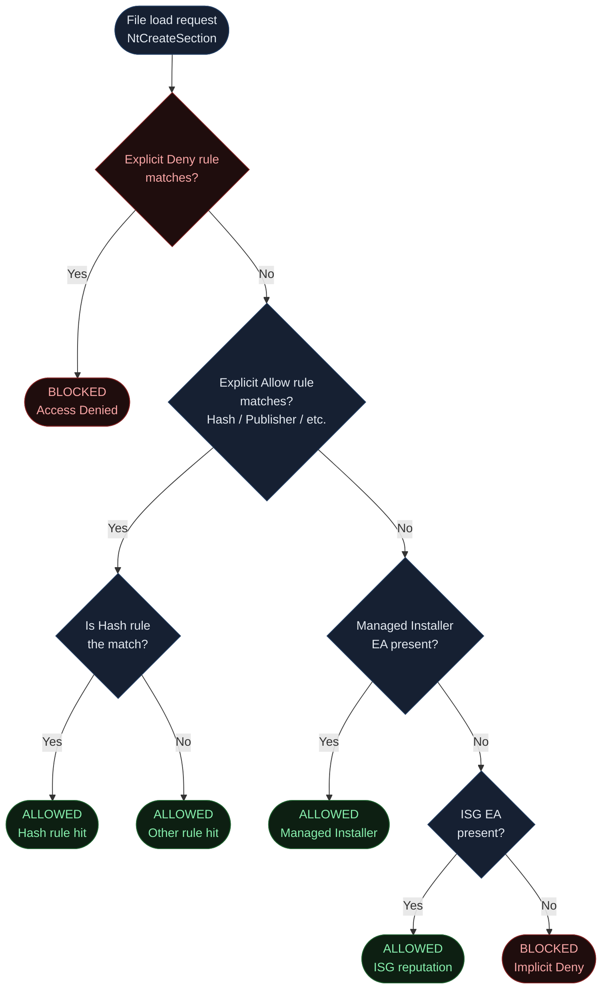
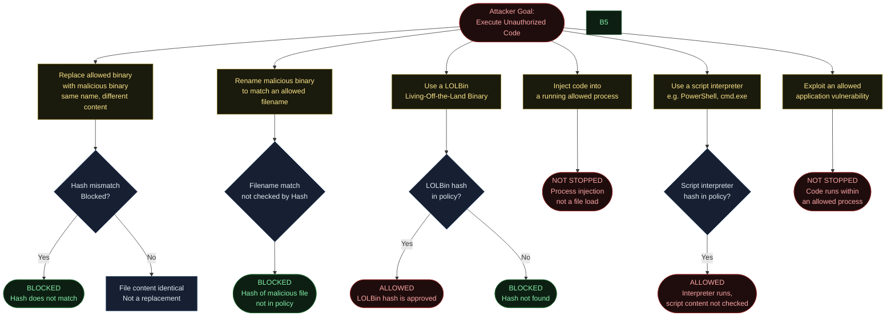
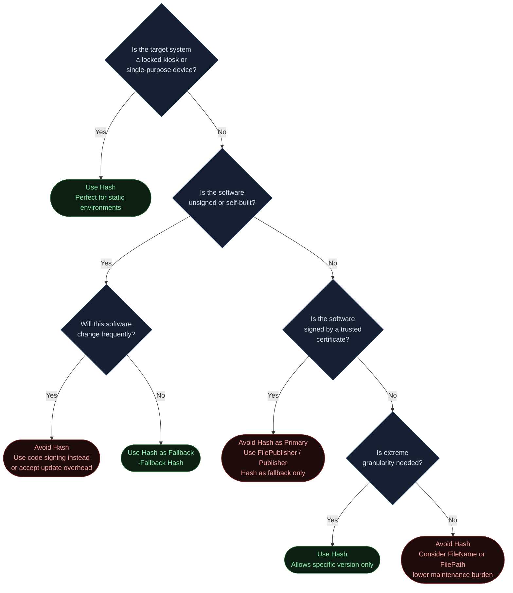
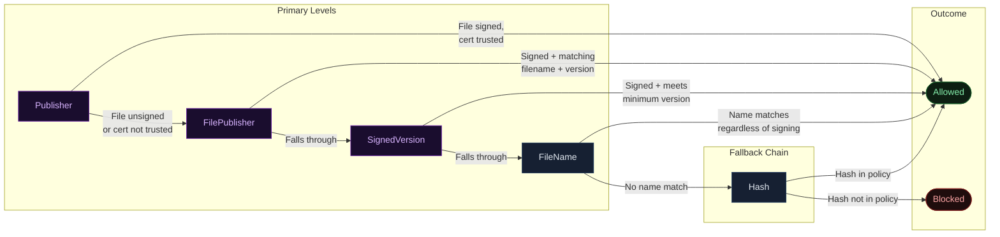
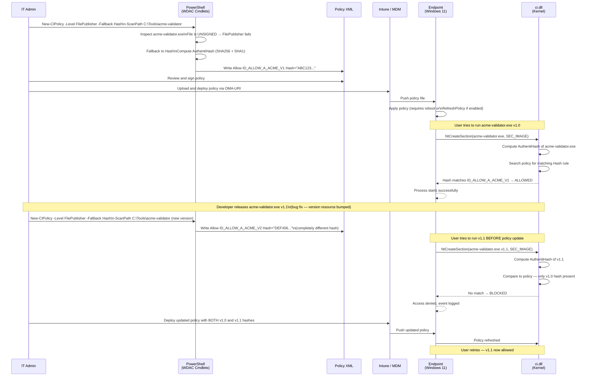

<!-- Author: Anubhav Gain | Category: WDAC File Rule Levels | Topic: Hash -->

# WDAC File Rule Level: Hash

## Table of Contents

1. [Overview](#overview)
2. [How It Works](#how-it-works)
3. [Where in the Evaluation Stack](#where-in-the-evaluation-stack)
4. [XML Representation](#xml-representation)
5. [PowerShell Usage](#powershell-usage)
6. [Pros and Cons](#pros-and-cons)
7. [Attack Resistance Analysis](#attack-resistance-analysis)
8. [When to Use vs When to Avoid](#when-to-use-vs-when-to-avoid)
9. [Interaction with Other Levels](#interaction-with-other-levels)
10. [Real-World Scenario](#real-world-scenario)
11. [OS Version and Compatibility Notes](#os-version-and-compatibility-notes)
12. [Common Mistakes and Gotchas](#common-mistakes-and-gotchas)
13. [Summary Table](#summary-table)

---

## Overview

The **Hash** rule level in Windows Defender Application Control (WDAC, also known as App Control for Business) is the most granular and cryptographically precise rule level available. A Hash rule allows or denies execution of a specific binary file by computing a cryptographic fingerprint — the **AuthentiHash** — of the file's PE (Portable Executable) image sections and comparing it to a pre-recorded value in the policy.

In plain English: when you create a Hash rule for `notepad.exe`, WDAC records the exact byte-level fingerprint of that specific version of `notepad.exe`. If even one byte changes — whether it is a code change, a version resource bump, or a digital signature replacement — the fingerprint no longer matches and the file will be blocked (or no longer explicitly allowed).

Hash rules are the ultimate backstop in WDAC policies. They are routinely used as the **fallback level** for unsigned files or files that do not carry a trustworthy certificate chain. If all other levels (Publisher, FilePublisher, SignedVersion) fail to produce a match, WDAC falls through to Hash as the final explicit allow mechanism before reaching the implicit deny at the bottom of the stack.

Understanding Hash rules deeply means understanding how Windows computes the hash, what causes a hash to change, and why the operational overhead of maintaining them at scale — think thousands of files across an enterprise fleet — is the primary reason they are rarely used as the sole rule level for signed software.

---

## How It Works

### The AuthentiHash — Not a Plain File Hash

A common misconception is that WDAC uses a plain SHA-256 hash of the entire file (like what `Get-FileHash` returns). It does **not**. WDAC uses the **AuthentiHash**, which is defined by the Authenticode specification (part of the Windows Portable Executable and COFF specification).

The AuthentiHash is computed over specific regions of the PE file, explicitly **excluding** the areas that change when a digital signature is applied or updated:

1. The checksum field in the `IMAGE_OPTIONAL_HEADER`
2. The Certificate Table entry in the Data Directory
3. The Attribute Certificate Table itself (the appended `PKCS#7` signature blob)

This design means the hash is stable regardless of whether the file is signed or unsigned — signing a file does not invalidate its AuthentiHash. The hash covers the actual executable code, initialized data, and resource sections, but not the signature wrapper around them.

```
PE File Layout (simplified):

 ┌─────────────────────────────┐
 │  DOS Header                 │  ◄─ hashed
 │  PE Signature               │  ◄─ hashed
 │  File Header (COFF)         │  ◄─ hashed
 │  Optional Header            │
 │    ├─ [Checksum field]       │  ◄─ EXCLUDED from hash
 │    └─ [Other fields]        │  ◄─ hashed
 │  Data Directory             │
 │    ├─ [Certificate Table]   │  ◄─ EXCLUDED from hash
 │    └─ [Other entries]       │  ◄─ hashed
 │  Section Headers            │  ◄─ hashed
 │  Section Data (.text, etc.) │  ◄─ hashed
 │  Section Data (.data, etc.) │  ◄─ hashed
 │  Section Data (.rsrc, etc.) │  ◄─ hashed
 │  [Attribute Certificate]    │  ◄─ EXCLUDED from hash
 └─────────────────────────────┘
```

### SHA-1 vs SHA-256

WDAC stores **both** SHA-1 and SHA-256 AuthentiHashes in Hash rules. When the policy engine evaluates a file, it computes both hash values and checks both. This dual-hash approach provides backward compatibility with older systems while ensuring strong cryptographic integrity on modern systems.

In generated XML you will see both hashes present. SHA-256 is the authoritative value on Windows 10/11 and Windows Server 2016+. SHA-1 is legacy but still carried.

### Where ci.dll Performs the Check

Windows Code Integrity (`ci.dll`, loaded into the kernel) intercepts binary load operations at the `NtCreateSection` call level when `SEC_IMAGE` is specified. Before the PE image is mapped, the kernel computes the AuthentiHash of the image on disk, then walks the active WDAC policy's allow/deny rules searching for a matching Hash entry.

The match is a direct byte comparison of the computed SHA-256 AuthentiHash against each `<Allow>` or `<Deny>` record tagged as a Hash rule. There is no fuzzy matching, no version tolerance, no path prefix — just an exact 256-bit comparison.

### What Changes Break a Hash Rule

Because the hash covers the `.rsrc` section, **any** of the following will invalidate a previously recorded Hash rule:

| Change Type | Breaks Hash? |
|---|---|
| Code change (logic, instructions) | Yes |
| Bug fix patch | Yes |
| Security update | Yes |
| Version number bump (VERSIONINFO resource) | Yes |
| Icon or manifest resource change | Yes |
| Adding/replacing Authenticode signature | No (excluded from hash) |
| Re-signing with a different certificate | No (excluded from hash) |
| Changing file name (renaming) | No (hash is content-based) |
| Moving file to a different path | No |
| Changing file timestamps | No |

This last column explains why re-signing does not invalidate hashes but virtually every Windows Update does.

### Dual-Signed Files

Some executables carry two Authenticode signatures (e.g., a file signed with both an SHA-1 and an SHA-256 Authenticode certificate). In this case, the file has two signature blobs appended. Because both signature blobs are excluded from the AuthentiHash computation, the AuthentiHash is **identical** regardless of which signature is present. The single hash covers both cases.

However, when WDAC generates a policy for a dual-signed file, it may generate two Allow entries (one anchored to each signer) at Publisher/FilePublisher levels. At the Hash level, only one hash entry is needed because the content is the same regardless of which signature applies.

### Get-FileHash vs AuthentiHash

```powershell
# This gives you the RAW SHA-256 hash of the entire file bytes
# This is NOT what WDAC uses
Get-FileHash -Path "C:\Windows\System32\notepad.exe" -Algorithm SHA256

# To see the Authenticode hash (close to AuthentiHash concept):
Get-AuthenticodeSignature -FilePath "C:\Windows\System32\notepad.exe" |
    Select-Object -ExpandProperty SignerCertificate |
    Select-Object Thumbprint

# The actual AuthentiHash as WDAC will record it can be extracted via:
[System.Security.Cryptography.X509Certificates.X509Certificate2]::new(
    "C:\Windows\System32\notepad.exe"
)
```

The most reliable way to see the exact hash WDAC will record is to run `New-CIPolicy` and inspect the generated XML, or use `Get-AppLockerFileInformation`:

```powershell
Get-AppLockerFileInformation -Path "C:\Windows\System32\notepad.exe" |
    Select-Object -ExpandProperty Hash
```

---

## Where in the Evaluation Stack



The Hash level sits inside the "Explicit Allow rule matches?" box. When WDAC walks the explicit allow rules, it checks all rule types in the policy; the Hash comparison happens as part of that walk. If a Hash rule matches, evaluation short-circuits and the file is allowed without checking Publisher or other rule types.

Deny Hash rules are checked earlier — in the "Explicit Deny" phase — and they override all allow rules. A Deny Hash rule is the most precise deny mechanism available: it blocks one exact version of one binary, nothing more and nothing less.

---

## XML Representation

### FileRules Section — Allow

```xml
<FileRules>
  <!-- Hash Allow rule for a specific version of 7-Zip file manager -->
  <Allow
    ID="ID_ALLOW_A_7ZIP_FM_1_0"
    FriendlyName="7-Zip File Manager 23.01 x64"
    Hash="B9E6D7F32A4C1D8E5F3A2B7C9D4E6F1A3B5C8D2E4F7A9B1C3D5E8F2A4B6C9D" />

  <!-- Hash Allow rule — SHA-1 companion entry (auto-generated) -->
  <Allow
    ID="ID_ALLOW_A_7ZIP_FM_1_1"
    FriendlyName="7-Zip File Manager 23.01 x64 (SHA1)"
    Hash="A1B2C3D4E5F6A7B8C9D0E1F2A3B4C5D6E7F8A9B0" />
</FileRules>
```

### FileRules Section — Deny

```xml
<FileRules>
  <!-- Hash Deny rule — blocks a specific known-bad binary -->
  <Deny
    ID="ID_DENY_D_MALWARE_SAMPLE_1"
    FriendlyName="Known malware sample hash"
    Hash="DEADBEEF1234567890ABCDEF1234567890ABCDEF1234567890ABCDEF12345678" />
</FileRules>
```

### Signing Scenarios — FileRulesRef

Hash rules must be referenced inside the appropriate `<SigningScenario>` block. Unlike Signer-based rules which are referenced inside `<Signers>`, Hash rules go into `<FileRulesRef>` directly under the signing scenario:

```xml
<SigningScenarios>
  <!-- Scenario 131 = UMCI (User Mode Code Integrity) -->
  <SigningScenario Value="131" ID="ID_SIGNINGSCENARIO_UMCI" FriendlyName="User Mode">
    <ProductSigners>
      <!-- Signer-based rules go here -->
    </ProductSigners>
    <FileRulesRef>
      <!-- Hash-based allows referenced here -->
      <FileRuleRef RuleID="ID_ALLOW_A_7ZIP_FM_1_0" />
      <FileRuleRef RuleID="ID_ALLOW_A_7ZIP_FM_1_1" />
    </FileRulesRef>
  </SigningScenario>

  <!-- Scenario 12 = KMCI (Kernel Mode Code Integrity) -->
  <SigningScenario Value="12" ID="ID_SIGNINGSCENARIO_KMCI" FriendlyName="Kernel Mode">
    <ProductSigners>
      <!-- Kernel driver rules go here -->
    </ProductSigners>
    <FileRulesRef>
      <!-- Kernel-mode Hash allows can go here too -->
    </FileRulesRef>
  </SigningScenario>
</SigningScenarios>
```

### Complete Minimal Example

```xml
<?xml version="1.0" encoding="utf-8"?>
<SiPolicy xmlns="urn:schemas-microsoft-com:sipolicy" PolicyType="Base Policy">
  <VersionEx>10.0.0.0</VersionEx>
  <PolicyID>{YOUR-POLICY-GUID-HERE}</PolicyID>
  <BasePolicyID>{YOUR-POLICY-GUID-HERE}</BasePolicyID>
  <PlatformID>{2E07F7E4-194C-4D20-B96C-1AD3BB1CAB21}</PlatformID>
  <Rules>
    <Rule>
      <Option>Enabled:Unsigned System Integrity Policy</Option>
    </Rule>
    <Rule>
      <Option>Enabled:Audit Mode</Option>
    </Rule>
  </Rules>
  <EKUs />
  <FileRules>
    <Allow ID="ID_ALLOW_A_NOTEPAD" FriendlyName="Notepad 11.2310.33.0"
           Hash="ABC123...64HEXCHARS..." />
  </FileRules>
  <Signers />
  <SigningScenarios>
    <SigningScenario Value="131" ID="ID_SIGNINGSCENARIO_UMCI" FriendlyName="User Mode">
      <ProductSigners />
      <FileRulesRef>
        <FileRuleRef RuleID="ID_ALLOW_A_NOTEPAD" />
      </FileRulesRef>
    </SigningScenario>
  </SigningScenarios>
  <UpdatePolicySigners />
  <CiSigners />
  <HvciOptions>0</HvciOptions>
</SiPolicy>
```

---

## PowerShell Usage

### Generate a Policy Using Hash Level

```powershell
# Scan a single file and create a Hash-based policy
New-CIPolicy `
    -Level Hash `
    -FilePath "C:\Tools\MyApp\myapp.exe" `
    -UserPEs `
    -OutputFilePath "C:\Policies\myapp-hash-policy.xml"
```

### Scan a Directory with Hash as Primary Level

```powershell
# Scan an entire directory; use Hash for all files (signed and unsigned)
New-CIPolicy `
    -Level Hash `
    -ScanPath "C:\Tools\PortableApps" `
    -UserPEs `
    -OutputFilePath "C:\Policies\portable-apps-policy.xml" `
    -MultiplePolicyFormat
```

### Hash as Fallback (Typical Production Pattern)

```powershell
# Primary: FilePublisher for signed files
# Fallback: Hash for unsigned files or files without version info
New-CIPolicy `
    -Level FilePublisher `
    -Fallback Hash `
    -ScanPath "C:\Program Files\MyApp" `
    -UserPEs `
    -OutputFilePath "C:\Policies\myapp-policy.xml"
```

This is the most common real-world pattern. Most files from a vendor will be signed and match at the `FilePublisher` level. Any file that is unsigned or lacks VERSIONINFO will fall through to `Hash`.

### Generate Hash Rules for Individual Files

```powershell
# Create individual rules (returns CimInstance objects, not a full policy)
$rules = New-CIPolicyRule `
    -Level Hash `
    -DriverFilePath "C:\Tools\Unsigned\tool.exe"

# Inspect the generated rule
$rules | Format-List *

# Merge into an existing policy
Merge-CIPolicy `
    -PolicyPaths "C:\Policies\existing-policy.xml" `
    -OutputFilePath "C:\Policies\merged-policy.xml" `
    -Rules $rules
```

### Bulk Hash Extraction via Get-AppLockerFileInformation

```powershell
# Get hash info for all EXEs in a folder (useful for auditing)
Get-AppLockerFileInformation `
    -Directory "C:\Tools" `
    -Recurse `
    -FileType Exe |
    Select-Object -ExpandProperty Hash |
    Select-Object HashAlgorithm, HashDataString |
    Export-Csv "C:\Reports\tool-hashes.csv" -NoTypeInformation
```

### Comparing AuthentiHash to Get-FileHash Output

```powershell
# Plain file hash (NOT what WDAC uses)
$plainHash = Get-FileHash -Path "C:\Tools\app.exe" -Algorithm SHA256
Write-Host "Plain SHA256: $($plainHash.Hash)"

# WDAC AuthentiHash (via policy generation)
$rule = New-CIPolicyRule -Level Hash -DriverFilePath "C:\Tools\app.exe"
$hashInPolicy = ($rule | Where-Object { $_.TypeId -eq "FileAttrib" }).Hash
Write-Host "AuthentiHash: $hashInPolicy"

# These values WILL differ if the file is signed
# They are IDENTICAL if the file is unsigned (no signature blob to exclude)
```

---

## Pros and Cons

| Attribute | Details |
|---|---|
| **Precision** | Absolute — exactly one version of exactly one binary |
| **Security Strength** | Maximum. Cannot be bypassed by renaming, moving, or re-signing |
| **Update Resilience** | Very poor — every patch or version bump invalidates the hash |
| **Unsigned File Support** | Yes — works for both signed and unsigned binaries |
| **Kernel Driver Support** | Yes — works in KMCI (Scenario 12) |
| **Maintenance Burden** | Very high at scale — thousands of rules for a fleet |
| **Policy Size Impact** | Large — each file version adds two XML entries (SHA1 + SHA256) |
| **Windows Update Impact** | Severe — OS components updated monthly invalidate all Hash rules |
| **Recommended Primary Use** | Standalone kiosks, single-purpose systems, small locked fleets |
| **Recommended Fallback Use** | As `-Fallback Hash` for unsigned files in larger policies |
| **Detection of Tampered Files** | Yes — any modification is detected (hash mismatch) |

---

## Attack Resistance Analysis



### What Hash Rules Stop

- Binary substitution attacks (replacing an allowed file with a trojanized version)
- Renamed malicious executables (no filename matching — hash alone decides)
- Slightly modified malware variants (even one byte change = new hash)
- Unsigned tools dropped by attackers

### What Hash Rules Do NOT Stop

- Process injection (code injected into already-running allowed processes)
- Memory-only attacks (fileless malware)
- Exploiting vulnerabilities within allowed applications
- Script-based attacks via allowed interpreters (PowerShell, cmd, wscript)
- DLL sideloading (the DLL must also have a Hash rule, but sideloading as a technique is partially mitigated)

---

## When to Use vs When to Avoid



---

## Interaction with Other Levels



When specifying `-Fallback Hash` in `New-CIPolicy`, this fallback chain is exactly what happens at policy generation time. For each scanned file, PowerShell's WDAC cmdlets attempt to create a rule at the primary level. If the file does not qualify (e.g., it is unsigned, so Publisher fails), they fall back to Hash and record the file's AuthentiHash.

---

## Real-World Scenario

The following sequence shows an enterprise deploying a custom internal tool (`acme-validator.exe`) that is unsigned.



This scenario illustrates the core operational challenge with Hash rules: every new version of the tool requires a policy update cycle that must complete before users can run the new binary. In a large organization with thousands of endpoints and frequent updates, this creates a support burden.

---

## OS Version and Compatibility Notes

| Windows Version | Hash Allow Rules | Hash Deny Rules | Notes |
|---|---|---|---|
| Windows 10 1507 (LTSB) | Yes | Yes | WDAC v1, basic hash support |
| Windows 10 1607 (LTSB 2016) | Yes | Yes | Multiple policy support added |
| Windows 10 1703 | Yes | Yes | Audit mode improvements |
| Windows 10 1903 | Yes | Yes | FilePath rules added (separate) |
| Windows 10 2004+ | Yes | Yes | HVCI integration improvements |
| Windows 11 21H2+ | Yes | Yes | Full support, improved tooling |
| Windows Server 2016 | Yes | Yes | Full support |
| Windows Server 2019 | Yes | Yes | Full support |
| Windows Server 2022 | Yes | Yes | Full support, HVCI capable |
| Windows Server 2025 | Yes | Yes | Full support |

Hash rules work across all WDAC-capable Windows versions. There are no known version-specific limitations for Hash rules specifically (unlike FilePath rules which are user-mode only and require 1903+).

---

## Common Mistakes and Gotchas

- **Using Get-FileHash instead of AuthentiHash**: `Get-FileHash` returns the hash of the entire file bytes. WDAC uses AuthentiHash which excludes the signature region. For unsigned files these are identical; for signed files they differ. Always generate hashes through `New-CIPolicy` or `New-CIPolicyRule` to get the correct value.

- **Forgetting both SHA1 and SHA256 entries**: When manually authoring policy XML, WDAC requires both hash types for maximum compatibility. The PowerShell cmdlets generate both automatically. Missing the SHA1 entry can cause evaluation failures on some configurations.

- **Expecting Hash rules to survive Windows Update**: OS binaries (in `System32`, `SysWOW64`, etc.) are updated monthly via Windows Update. Any Hash rules pointing at OS files will break after the next CU (Cumulative Update). Never use Hash as the primary level for OS-owned files — use Publisher or FilePublisher instead.

- **Not using `-Fallback Hash` for unsigned software**: When scanning a mixed directory (some signed, some unsigned), omitting `-Fallback Hash` will silently skip unsigned files. They will have no rule in the policy and will be blocked by implicit deny.

- **Policy size explosion**: At scale, a Hash policy for a mid-size application suite can contain thousands of XML entries. Each entry has two hash values (SHA1 + SHA256). The compiled binary policy (.p7b) size grows proportionally. Very large policies can impact boot and load performance.

- **Forgetting to update policy during software deployment**: When deploying new software via SCCM/Intune, if the WDAC policy is not updated simultaneously, users will see the new application blocked. The policy update and software deployment must be coordinated.

- **Assuming Hash rules work like file integrity monitoring**: A Hash rule allows/denies based on the hash at policy creation time. If a file is later replaced with the same hash (e.g., legitimate re-deployment), it still passes. Hash rules are not real-time integrity monitors — they are identity validators.

- **Conflating user-mode and kernel-mode**: Kernel drivers (`.sys` files) need to be under `SigningScenario Value="12"` (KMCI). User-mode executables go under `Value="131"` (UMCI). Placing a kernel driver's hash under the user-mode scenario will not allow it to load.

---

## Summary Table

| Attribute | Value |
|---|---|
| **Rule Level Name** | Hash |
| **XML Element** | `<Allow ... Hash="..."/>` or `<Deny ... Hash="..."/>` |
| **Hash Algorithm** | SHA-256 AuthentiHash (+ SHA-1 companion) |
| **Covers Signed Files** | Yes |
| **Covers Unsigned Files** | Yes |
| **Works for Kernel Drivers** | Yes (KMCI, Scenario 12) |
| **Works for User-Mode PEs** | Yes (UMCI, Scenario 131) |
| **Granularity** | Single file, single version |
| **Breaks on Patch/Update** | Yes |
| **Maintenance Burden** | Very High |
| **Security Strength** | Maximum — no spoofing possible |
| **Typical Role** | Fallback for unsigned files; primary for locked kiosks |
| **PowerShell Level Name** | `Hash` |
| **Min Windows Version** | Windows 10 1507 / Server 2016 |
