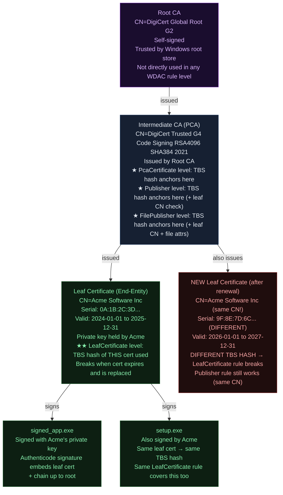
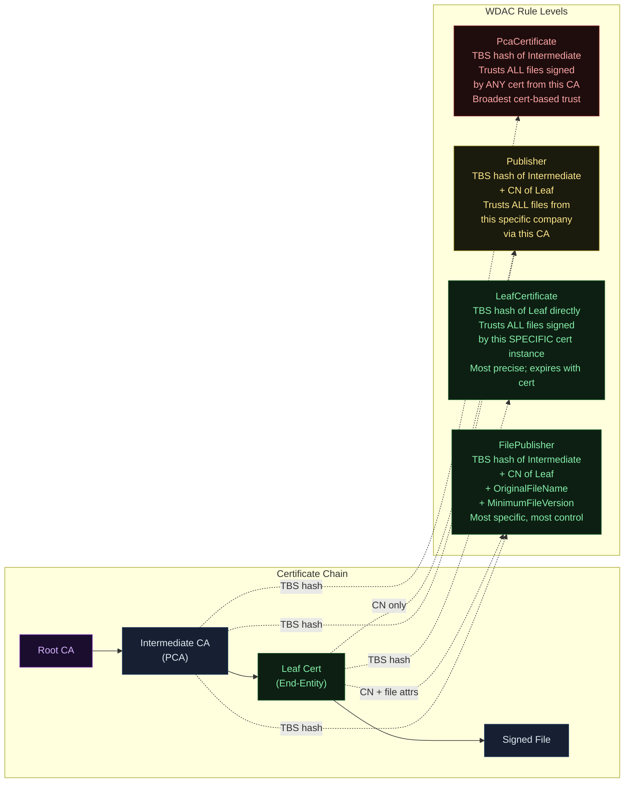
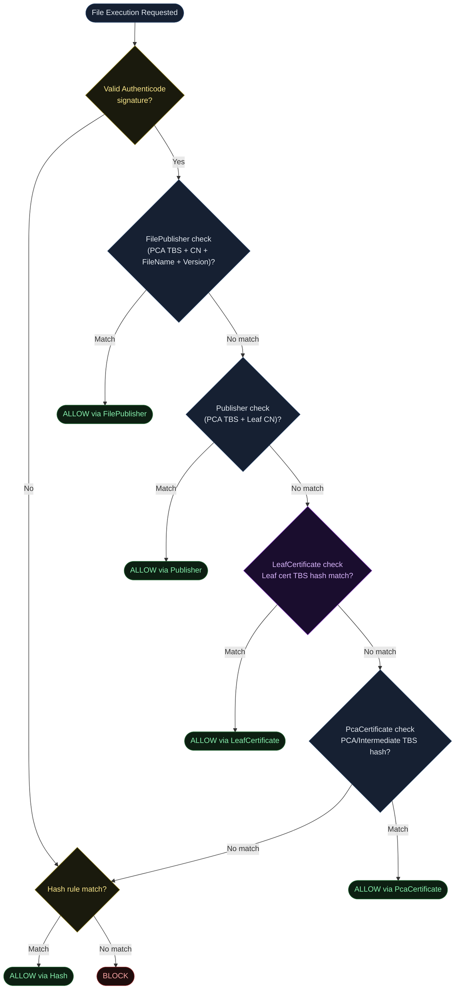
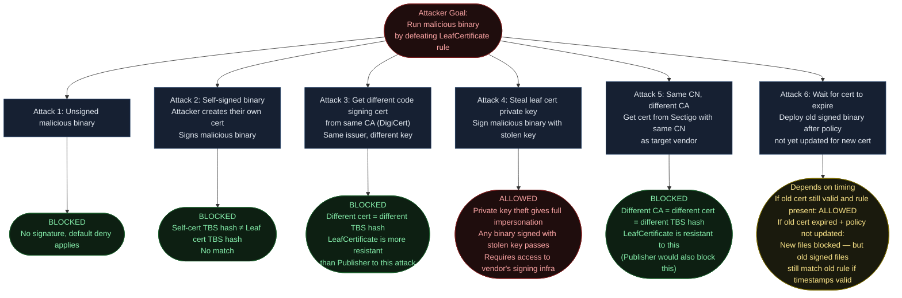
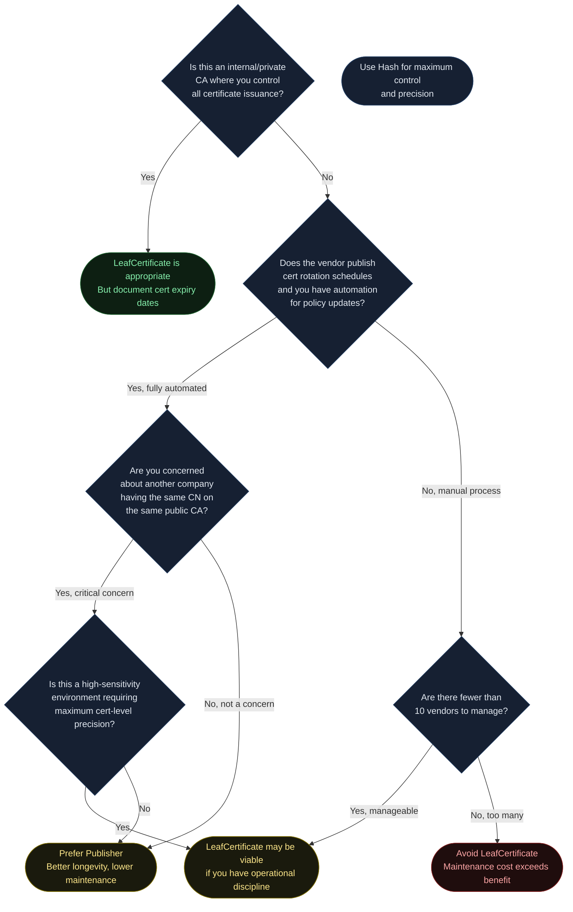

<!-- Author: Anubhav Gain | Category: WDAC File Rule Levels | Topic: LeafCertificate -->

# WDAC File Rule Level: LeafCertificate

## Table of Contents

1. [Overview](#1-overview)
2. [How It Works](#2-how-it-works)
3. [Certificate Chain Anatomy](#3-certificate-chain-anatomy)
4. [Leaf Certificate vs Publisher vs PcaCertificate — The Key Differences](#4-leaf-certificate-vs-publisher-vs-pcacertificate--the-key-differences)
5. [Where in the Evaluation Stack](#5-where-in-the-evaluation-stack)
6. [XML Representation](#6-xml-representation)
7. [PowerShell Examples](#7-powershell-examples)
8. [Pros and Cons](#8-pros-and-cons)
9. [The Maintenance Problem: Leaf Cert Validity Periods](#9-the-maintenance-problem-leaf-cert-validity-periods)
10. [Attack Resistance Analysis](#10-attack-resistance-analysis)
11. [When to Use vs When to Avoid](#11-when-to-use-vs-when-to-avoid)
12. [Double-Signed File Behavior](#12-double-signed-file-behavior)
13. [Real-World Scenario](#13-real-world-scenario)
14. [OS Version and Compatibility Notes](#14-os-version-and-compatibility-notes)
15. [Common Mistakes and Gotchas](#15-common-mistakes-and-gotchas)
16. [Summary Table](#16-summary-table)

---

## 1. Overview

The **LeafCertificate** rule level trusts files based on the **end-entity (leaf) certificate** that was used to directly sign those files. This is the actual code-signing certificate held and used by the software vendor or developer — the one at the bottom of the certificate chain, the certificate whose private key the signing tool uses.

To understand LeafCertificate, you first need to understand what "leaf" means in PKI:

```
Root CA (self-signed, universally trusted)
  └── Intermediate CA (issued by Root, issues certs to others)
        └── Leaf Certificate (issued to vendor, used to actually sign files)
              └── Signed binary (exe, dll, sys...)
```

The **leaf certificate** is the terminal node in this tree — it does not issue other certificates. It belongs to the entity (person, company) that actually signs the software. Examples:
- A developer's personal code signing certificate
- A company's EV (Extended Validation) code signing certificate
- A vendor's standard OV (Organization Validation) code signing cert

**What makes LeafCertificate distinct from Publisher?**

| Aspect | LeafCertificate | Publisher |
|---|---|---|
| Certificate anchored | Leaf (end-entity) TBS hash | Intermediate CA (PCA) TBS hash |
| Additional CN check | None | Yes — requires leaf CN match |
| Breaks on cert renewal | Always | Only if CN changes |
| More specific | Yes | No |

LeafCertificate anchors directly to a **specific instance of the leaf certificate** — a specific key pair, specific validity period, specific serial number — via its TBS hash. When that certificate expires and the vendor gets a new one (even with the same CN), the TBS hash changes and the rule breaks.

This is the fundamental trade-off: LeafCertificate is more precise than Publisher (no one else with the same CA can match), but it requires more frequent policy updates due to leaf cert expiry.

---

## 2. How It Works

### How ConfigCI Generates a LeafCertificate Rule

When you run `New-CIPolicy -Level LeafCertificate` against PE files, ConfigCI:

1. Extracts the Authenticode signature from each PE file
2. Gets the **leaf certificate** (index 0 in the chain) — the signing certificate itself
3. Computes the **TBS (To-Be-Signed) hash** of that leaf certificate
4. Creates a `<Signer>` element with `<CertRoot Type="TBS" Value="[leaf cert TBS hash]"/>`
5. Does **NOT** add a `<CertPublisher>` element — that's what distinguishes LeafCertificate from Publisher level

The absence of `<CertPublisher>` is crucial. When ConfigCI evaluates a file:
- If `<CertRoot>` matches the leaf cert TBS hash AND there is no `<CertPublisher>` — this is a LeafCertificate rule
- If `<CertRoot>` matches the intermediate CA TBS hash AND there is a `<CertPublisher>` — this is a Publisher rule

### The TBS Hash Mechanism

The TBS hash uniquely identifies a specific certificate instance. Two certificates with:
- Same subject CN
- Same issuer
- Different validity periods (different key pairs, different serial numbers)

Will have **different TBS hashes**. This means a LeafCertificate rule that was generated from a cert valid 2023-2025 will NOT match a new cert valid 2025-2027, even if both were issued to the same company with the same CN.

```powershell
# How to get the TBS hash of a leaf certificate
$sig = Get-AuthenticodeSignature "C:\path\to\signed.exe"
$leaf = $sig.SignerCertificate

# The TBS hash is computed over the to-be-signed portion of the cert
# ConfigCI uses SHA-256 for TBS hash on modern systems
Write-Host "Leaf Certificate TBS would be computed from:"
Write-Host "  Subject:    $($leaf.Subject)"
Write-Host "  Issuer:     $($leaf.Issuer)"
Write-Host "  Serial:     $($leaf.SerialNumber)"
Write-Host "  NotBefore:  $($leaf.NotBefore)"
Write-Host "  NotAfter:   $($leaf.NotAfter)"
Write-Host "  Thumbprint: $($leaf.Thumbprint)"
# The actual TBS hash is available after New-CIPolicyRule generates the rule
```

### ConfigCI Chain Walking for LeafCertificate

When ConfigCI processes a file for LeafCertificate level, it stops at the **first certificate in the chain** (the leaf, index 0) rather than walking up to the intermediate CA. This is the reverse of PcaCertificate behavior:

```
PcaCertificate: walks UP the chain, stops at highest resolvable cert (usually index 1 from leaf)
Publisher:      walks UP the chain, uses index 1 TBS hash + index 0 CN
LeafCertificate: stays at the BOTTOM (index 0) — uses leaf cert TBS hash directly
```

---

## 3. Certificate Chain Anatomy



The diagram highlights the critical weakness: the new leaf cert after renewal has the same CN but a **different TBS hash** — the LeafCertificate rule breaks, while a Publisher rule (using the intermediate CA + CN) would survive the renewal.

---

## 4. Leaf Certificate vs Publisher vs PcaCertificate — The Key Differences



### Specificity vs Maintenance Comparison Table

| Level | Cert Anchored | Additional Filter | Specificity | Maintenance Burden | Survives Cert Renewal |
|---|---|---|---|---|---|
| PcaCertificate | Intermediate CA | None | Lowest | Very Low | Yes (CA certs last 10-20 years) |
| Publisher | Intermediate CA | Leaf CN | Medium | Low | Partial (CN must stay same) |
| **LeafCertificate** | **Leaf cert directly** | **None** | **High** | **High** | **No — breaks on renewal** |
| FilePublisher | Intermediate CA | Leaf CN + FileName + Version | Highest | Low-Medium | Partial |
| Hash | File content | — | Perfect | Very High | N/A (file content based) |

LeafCertificate occupies an unusual position: it is more specific than Publisher (different companies signing with the same CA won't match) but does NOT include any filename or version filters (all files from this specific cert pass). Its maintenance burden approaches Hash without offering Hash's absolute specificity.

---

## 5. Where in the Evaluation Stack



LeafCertificate sits between Publisher and PcaCertificate in the specificity hierarchy. In terms of trust breadth:
- More specific than Publisher (targets one cert instance, not all certs from a CA with a given CN)
- Broader than Hash (any file signed by this leaf cert, not a specific file content)
- Will be evaluated after Publisher rules and before PcaCertificate rules

---

## 6. XML Representation

### LeafCertificate Rule XML

The distinguishing XML feature of LeafCertificate compared to Publisher is:
1. `<CertRoot Type="TBS" Value="..."/>` uses the **leaf cert TBS hash** (not the intermediate CA TBS hash)
2. There is **no `<CertPublisher>` element** (which is what distinguishes it from Publisher level)

```xml
<?xml version="1.0" encoding="utf-8"?>
<SiPolicy xmlns="urn:schemas-microsoft-com:sipolicy" PolicyType="Base Policy">

  <Signers>

    <!--
      LeafCertificate Rule for Acme Software Inc
      
      KEY DISTINCTION from Publisher:
      - CertRoot Value = TBS hash of the LEAF certificate (not the intermediate CA)
      - NO CertPublisher element (CertPublisher is what makes Publisher level)
      - NO FileAttribRef (that would make it FilePublisher level)
      
      This rule allows ANY file signed by the specific leaf cert whose TBS hash
      is listed here, regardless of filename, version, or path.
    -->
    <Signer ID="ID_SIGNER_ACME_LEAF" Name="Acme Software Inc Code Signing Cert 2024">

      <!--
        CertRoot: TBS hash of the LEAF certificate
        This is the end-entity cert, NOT the intermediate CA
        If Acme renews their cert in 2026, this value will be DIFFERENT
        and this rule will stop matching new Acme-signed files
      -->
      <CertRoot Type="TBS" Value="A1B2C3D4E5F6789012345678901234567890ABCDEF1234567890ABCDEF123456"/>

      <!--
        NO CertPublisher element here.
        If there were a CertPublisher element, this would be a Publisher rule.
        The absence of CertPublisher is what makes this LeafCertificate level.
      -->

      <!--
        NO FileAttribRef element here.
        If there were FileAttribRef, this would be FilePublisher level.
        All files from this leaf cert are trusted — no file-specific filter.
      -->

    </Signer>

    <!--
      COMPARISON: What Publisher looks like for the same vendor
      Publisher uses the INTERMEDIATE CA TBS hash + leaf CN
      This would survive cert renewal as long as Acme keeps using the same CA
      and same CN.
    -->
    <Signer ID="ID_SIGNER_ACME_PUBLISHER" Name="DigiCert Intermediate CA">
      <CertRoot Type="TBS" Value="FFEE...DDCC"/>  <!-- Intermediate CA TBS hash -->
      <CertPublisher Value="Acme Software Inc"/>   <!-- Leaf CN — makes this Publisher level -->
    </Signer>

  </Signers>

  <SigningScenarios>
    <SigningScenario Value="12" ID="ID_SIGNINGSCENARIO_WINDOWS" FriendlyName="User Mode">
      <ProductSigners>
        <AllowedSigners>
          <AllowedSigner SignerID="ID_SIGNER_ACME_LEAF"/>
        </AllowedSigners>
      </ProductSigners>
    </SigningScenario>
  </SigningScenarios>

</SiPolicy>
```

### XML Differentiator: LeafCertificate vs Publisher vs PcaCertificate

```xml
<!-- PcaCertificate: Intermediate CA TBS hash, no CertPublisher, no FileAttribRef -->
<Signer ID="ID_SIGNER_PCA" Name="DigiCert Intermediate CA">
  <CertRoot Type="TBS" Value="[Intermediate CA TBS hash]"/>
  <!-- No CertPublisher → PcaCertificate level -->
</Signer>

<!-- Publisher: Intermediate CA TBS hash + CertPublisher with leaf CN -->
<Signer ID="ID_SIGNER_PUB" Name="DigiCert Intermediate CA">
  <CertRoot Type="TBS" Value="[Intermediate CA TBS hash]"/>
  <CertPublisher Value="Acme Software Inc"/>  <!-- Adds CN filter → Publisher level -->
</Signer>

<!-- LeafCertificate: Leaf cert TBS hash, no CertPublisher -->
<Signer ID="ID_SIGNER_LEAF" Name="Acme Software Inc Code Signing Cert 2024">
  <CertRoot Type="TBS" Value="[Leaf cert TBS hash]"/>
  <!-- No CertPublisher → LeafCertificate level -->
  <!-- The difference from PcaCertificate: this TBS hash is for the LEAF, not PCA -->
</Signer>
```

**Important note for XML inspection:** When reading a WDAC policy XML, you cannot tell by looking at the XML alone whether a `<Signer>` with no `<CertPublisher>` is a LeafCertificate or a PcaCertificate rule. You need to know which certificate the TBS hash refers to. ConfigCI's `FriendlyName` attribute on the `<Signer>` element is the human clue — it should name the certificate the rule was generated from.

---

## 7. PowerShell Examples

### Generate a LeafCertificate Policy

```powershell
# Generate LeafCertificate rules from a directory of signed PE files
New-CIPolicy `
    -Level LeafCertificate `
    -ScanPath "C:\Program Files\AcmeSoftware" `
    -UserPEs `
    -Fallback Publisher, Hash `
    -OutputFilePath "C:\Policies\AcmeLeafCert.xml"

# Parameters:
# -Level LeafCertificate  : Use leaf cert TBS hash as the trust anchor
# -Fallback Publisher, Hash : If LeafCert fails (shouldn't for signed files),
#                             try Publisher, then Hash
```

### Generate LeafCertificate Rule for a Single File

```powershell
# Single file LeafCertificate rule
$rule = New-CIPolicyRule `
    -Level LeafCertificate `
    -DriverFilePath "C:\Program Files\AcmeSoftware\acme.exe" `
    -Fallback Hash

$rule | Format-List *
```

### Inspecting a File's Leaf Certificate for LeafCertificate Context

```powershell
function Get-WDACLeafCertInfo {
    param([string]$FilePath)

    $sig = Get-AuthenticodeSignature -FilePath $FilePath
    if ($sig.Status -ne "Valid") {
        Write-Warning "Signature status: $($sig.Status)"
        return
    }

    $leaf = $sig.SignerCertificate

    # Build chain to show context
    $chain = [System.Security.Cryptography.X509Certificates.X509Chain]::new()
    $chain.ChainPolicy.RevocationMode = "NoCheck"
    $null = $chain.Build($leaf)

    Write-Host "`n=== LeafCertificate Analysis: $([System.IO.Path]::GetFileName($FilePath)) ===" -ForegroundColor Cyan

    Write-Host "`n[LEAF CERTIFICATE — This is what LeafCertificate rule uses]" -ForegroundColor Green
    Write-Host "  Subject:         $($leaf.Subject)"
    Write-Host "  Issuer:          $($leaf.Issuer)"
    Write-Host "  Serial Number:   $($leaf.SerialNumber)"
    Write-Host "  Valid From:      $($leaf.NotBefore.ToShortDateString())"
    Write-Host "  Valid Until:     $($leaf.NotAfter.ToShortDateString())"
    Write-Host "  Thumbprint:      $($leaf.Thumbprint)"
    $daysRemaining = ($leaf.NotAfter - (Get-Date)).Days
    $warningColor = if ($daysRemaining -lt 90) { "Red" } elseif ($daysRemaining -lt 180) { "Yellow" } else { "Green" }
    Write-Host "  Days Until Expiry: $daysRemaining" -ForegroundColor $warningColor

    Write-Host "`n[INTERMEDIATE CA — What Publisher rule would use instead]" -ForegroundColor Yellow
    if ($chain.ChainElements.Count -ge 2) {
        $pca = $chain.ChainElements[1].Certificate
        Write-Host "  Subject:     $($pca.Subject)"
        Write-Host "  Valid Until: $($pca.NotAfter.ToShortDateString())"
        Write-Host "  (This cert's TBS hash would be used by Publisher/FilePublisher)"
    }

    Write-Host "`n[RISK ASSESSMENT]"
    if ($daysRemaining -lt 90) {
        Write-Warning "  CRITICAL: LeafCertificate rule will expire in $daysRemaining days!"
        Write-Host "  Recommendation: Use Publisher level instead for better resilience."
    } elseif ($daysRemaining -lt 365) {
        Write-Warning "  WARNING: LeafCertificate rule expires within 1 year ($daysRemaining days)"
        Write-Host "  Plan policy update before $($leaf.NotAfter.ToShortDateString())"
    } else {
        Write-Host "  OK: Leaf cert valid for $daysRemaining more days"
        Write-Host "  Note: Plan policy refresh before $($leaf.NotAfter.ToShortDateString())"
    }
}

# Usage
Get-WDACLeafCertInfo -FilePath "C:\Program Files\AcmeSoftware\acme.exe"
```

### Monitoring Upcoming LeafCertificate Rule Expirations

```powershell
# Scan a deployed policy XML and report upcoming cert expirations
function Get-PolicyLeafCertExpirations {
    param([string]$PolicyXmlPath)

    [xml]$policy = Get-Content $PolicyXmlPath

    $signers = $policy.SiPolicy.Signers.Signer |
        Where-Object { $null -ne $_.CertRoot -and $null -eq $_.CertPublisher }

    if (-not $signers) {
        Write-Host "No LeafCertificate-level rules found in policy."
        return
    }

    Write-Host "LeafCertificate rules in: $PolicyXmlPath"
    Write-Host "Note: Cannot determine expiry from TBS hash alone."
    Write-Host "Cross-reference with your certificate inventory system."
    Write-Host ""

    foreach ($signer in $signers) {
        Write-Host "Signer: $($signer.Name)"
        Write-Host "  CertRoot TBS: $($signer.CertRoot.Value)"
        Write-Host "  FriendlyName: $($signer.Name)"
        Write-Host ""
    }
}

Get-PolicyLeafCertExpirations -PolicyXmlPath "C:\Policies\AcmeLeafCert.xml"
```

---

## 8. Pros and Cons

| Factor | Assessment |
|---|---|
| **Specificity** | High — targets exact cert instance |
| **Maintenance burden** | High — cert expires in 1-3 years |
| **Policy update frequency** | Annual or more frequent |
| **False positive risk** | Very low — exact cert match |
| **Survives cert renewal** | No — new cert = new TBS hash = rule breaks |
| **Survives CN change** | No — TBS hash changes with any cert change |
| **Better than Publisher at** | Preventing other companies with same CN on same CA from matching |
| **Worse than Publisher at** | Longevity — requires more frequent updates |
| **Blocks sibling companies** | Yes — Publisher would allow any "Acme" from same CA |
| **Works for kernel drivers** | Yes |
| **Works for user mode** | Yes |

### Pros

- **Maximum precision among cert-based levels**: Only files signed by this exact certificate pass. Unlike Publisher, another company can't sneak through by having the same CN on the same CA.
- **No false positives from CA-sharing**: Large public CAs issue certs to thousands of companies. LeafCertificate ensures only this specific cert's files are trusted.
- **Good for high-trust internal tooling**: When you control the PKI and issue short-lived leaf certs, LeafCertificate combined with automation can be very tight.
- **Simpler XML than FilePublisher**: No `<FileAttrib>` elements needed — one `<Signer>` covers all files from that cert.

### Cons

- **Annual policy updates required**: Standard code signing certs are valid 1-3 years. When a vendor renews, files signed with the new cert won't match your rule.
- **Unannounced cert rotation breaks policies**: Vendors sometimes obtain a new cert mid-cycle (cert theft, CA migration) without notifying customers.
- **Operational risk**: A cert expiry that you didn't anticipate = blocked production software = incident.
- **No meaningful advantage over Publisher in most cases**: If you want "all Acme Software files," Publisher gives you that with far less maintenance overhead.
- **Not distinguishable from PcaCertificate by XML alone**: Both use `<CertRoot>` without `<CertPublisher>`.

---

## 9. The Maintenance Problem: Leaf Cert Validity Periods

This deserves its own section because it is the primary reason LeafCertificate is rarely recommended as the primary trust level for vendor software.

### Typical Leaf Cert Lifetimes

| Certificate Type | Typical Validity | Notes |
|---|---|---|
| EV Code Signing (OV/EV) | 1 year | Industry-wide CAB Forum maximum as of 2023 |
| Standard OV Code Signing | 1-3 years | Being reduced to 1 year by CA/B Forum |
| Internal CA issued certs | Variable | You control the CA — can set longer validity |
| Hardware-bound (HSM) certs | 1-3 years | Must be renewed/re-key when expired |

### The Expiry Timeline Problem

```
Today: Jan 2025
  └── Vendor cert valid until: Dec 2025
        └── Your LeafCertificate rule works ✓

Jan 2026: Vendor renews cert (new key pair, same CN)
  └── New cert TBS hash is DIFFERENT from old cert TBS hash
  └── Your LeafCertificate rule still references OLD cert TBS hash
        └── New vendor binaries → NO MATCH → BLOCKED

Impact: Production outage until policy updated
```

### Maintenance Calendar

When you deploy a LeafCertificate rule, you must:

1. Record the expiry date of the leaf certificate used for each rule
2. Schedule a policy update task 60-90 days before each cert expiry
3. Coordinate with the software vendor to obtain new files signed with the renewed cert
4. Scan the new files, generate updated rules, test in audit mode, deploy before old cert expires
5. Keep the old rule active until you confirm no files signed by the old cert are still in use

This is a significant operational overhead compared to Publisher, where the same vendor using the same CA with the same CN requires no policy update on cert renewal.

### Comparison: Maintenance Burden by Rule Level

| Level | Trigger for Policy Update | Frequency |
|---|---|---|
| Hash | Any file change (patch, update) | With every update |
| LeafCertificate | Leaf cert renewal or new vendor cert | 1-3 years per vendor |
| Publisher | Vendor changes CA or CN | Rare — years to decades |
| PcaCertificate | CA changes its intermediate cert | Very rare — decades |

---

## 10. Attack Resistance Analysis



### LeafCertificate vs Publisher: Attack Resistance Comparison

LeafCertificate has one specific advantage over Publisher: it blocks the scenario where an attacker obtains a legitimate cert from the same CA with the same CN. For example:
- Publisher rule trusts `<CertPublisher Value="Acme Software Inc"/>` from DigiCert
- An attacker somehow gets DigiCert to issue them a cert with CN="Acme Software Inc" (very unlikely with EV, but theoretically possible with OV for similar company names)
- Publisher rule would allow it; LeafCertificate rule would not (different TBS hash)

In practice, CA/B Forum rules make this scenario very difficult, so this advantage is largely theoretical for well-operated CAs.

---

## 11. When to Use vs When to Avoid



### Scenarios Where LeafCertificate Makes Sense

1. **Internal PKI**: Your organization runs its own CA. You issue leaf certs to internal tools. You control renewal schedules. Automation updates policies on cert issuance.

2. **Short-lived cert rotation as a security feature**: Some security-conscious vendors issue new certs every 90 days intentionally. In this case, Publisher would also work, but LeafCertificate ensures you're explicitly tracking which cert instance is trusted.

3. **Forensic/legal requirements**: In some high-assurance environments, you need to document exactly which certificate instance authorized a binary to run. LeafCertificate provides that granularity in the audit trail.

### Scenarios Where LeafCertificate Should Be Avoided

1. **General enterprise software management**: Use Publisher or FilePublisher instead — far lower maintenance.
2. **Large vendor catalog**: Managing cert expirations for 100 vendors is impractical.
3. **Frequently renewing vendors**: If a vendor uses 1-year certs, you're doing annual policy updates forever.
4. **Where FilePublisher achieves the same goal**: FilePublisher's triple-binding often provides more than enough specificity without the maintenance burden of LeafCertificate.

---

## 12. Double-Signed File Behavior

When ConfigCI encounters a file with multiple Authenticode signatures at LeafCertificate level:

1. Each signature has its own leaf certificate
2. ConfigCI extracts the TBS hash of each signature's leaf certificate
3. Each produces a **separate `<Signer>` element** with the respective leaf cert TBS hash
4. The file is allowed if any one of its signatures matches any one LeafCertificate rule

```xml
<!-- Double-signed file: primary SHA-256 + legacy SHA-1 -->

<!-- Rule from primary signature's leaf cert (SHA-256 chain) -->
<Signer ID="ID_SIGNER_LEAF_SHA256" Name="Acme Software Inc (SHA-256 cert)">
  <CertRoot Type="TBS" Value="AABB..."/>  <!-- SHA-256 chain leaf TBS hash -->
</Signer>

<!-- Rule from legacy signature's leaf cert (SHA-1 chain) -->
<Signer ID="ID_SIGNER_LEAF_SHA1" Name="Acme Software Inc (SHA-1 cert)">
  <CertRoot Type="TBS" Value="1122..."/>  <!-- SHA-1 chain leaf cert TBS hash -->
</Signer>
```

**Maintenance implication**: If a file is dual-signed, you have TWO leaf cert TBS hashes to track for expiry. The SHA-1 chain leaf cert may have different validity dates than the SHA-256 chain leaf cert. Both rules need to be maintained independently.

---

## 13. Real-World Scenario

**Scenario: Internal security tool with tight access control requirements**

An organization builds an internal vulnerability scanner. They want only their specific certificate instance to authorize this tool — not anyone else who might have the same company name on the same CA.

```mermaid
sequenceDiagram
    participant SecTeam as Security Team
    participant InternalCA as Internal PKI / CA
    participant BuildSys as Build System
    participant PS as PowerShell ConfigCI
    participant MDM as Intune MDM
    participant Endpoints as Managed Endpoints

    Note over SecTeam,Endpoints: Initial Deployment

    SecTeam->>InternalCA: Request code signing cert for vuln-scanner
    InternalCA-->>BuildSys: Issue cert (CN=SecurityScanTool, Valid 2024-2026)
    BuildSys->>BuildSys: Sign vuln-scanner.exe with issued leaf cert
    SecTeam->>PS: New-CIPolicyRule -Level LeafCertificate -FilePath vuln-scanner.exe
    PS->>PS: Extract leaf cert TBS hash from vuln-scanner.exe signature
    PS-->>SecTeam: <Signer CertRoot TBS=[leaf cert hash]/>
    SecTeam->>MDM: Deploy policy with LeafCertificate rule
    MDM->>Endpoints: Push policy
    Endpoints->>Endpoints: vuln-scanner.exe: leaf TBS hash matches ✓ ALLOWED

    Note over SecTeam,Endpoints: 18 months later: cert nearing expiry

    SecTeam->>InternalCA: Renew cert (new key pair, same CN)
    InternalCA-->>BuildSys: New cert (same CN, DIFFERENT TBS hash)
    BuildSys->>BuildSys: Sign new vuln-scanner.exe with NEW cert
    SecTeam->>PS: New-CIPolicyRule -Level LeafCertificate -FilePath new-vuln-scanner.exe
    PS-->>SecTeam: New <Signer> with NEW TBS hash
    SecTeam->>MDM: Update policy with BOTH old and new Signer rules
    MDM->>Endpoints: Push updated policy

    Note over SecTeam,Endpoints: Transition period: both old and new cert trusted

    SecTeam->>MDM: Remove old rule after all endpoints updated
    MDM->>Endpoints: Final policy with only new cert rule

    style SecTeam fill:#162032,stroke:#1e3a5f,color:#e2e8f0
    style InternalCA fill:#1a0d2e,stroke:#6b21a8,color:#d8b4fe
    style BuildSys fill:#162032,stroke:#1e3a5f,color:#e2e8f0
    style PS fill:#1a0d2e,stroke:#6b21a8,color:#d8b4fe
    style MDM fill:#162032,stroke:#1e3a5f,color:#e2e8f0
    style Endpoints fill:#0d1f12,stroke:#1a5c2a,color:#86efac
```

---

## 14. OS Version and Compatibility Notes

| Feature | Windows Version | Notes |
|---|---|---|
| LeafCertificate level (UMCI) | Windows 10 1507+ | Available since initial WDAC |
| LeafCertificate level (KMCI) | Windows 10 1507+ | Kernel mode support |
| SHA-256 TBS hashes in rules | Windows 10 1703+ | Earlier versions used SHA-1 TBS |
| Multiple active policies | Windows 10 1903+ | Enables supplemental + base combos |
| CiTool.exe for in-place updates | Windows 11 22H2+ | Avoids reboot for policy refresh |
| `New-CIPolicyRule -Level LeafCertificate` | Windows 10 1607+ | PowerShell cmdlet |

### ConfigCI Module Note

The PowerShell `ConfigCI` module is required. On Windows 11 it is built-in. On Windows 10 it may require installing via RSAT or the "Windows Defender Application Control Tools" Windows feature. Running the cmdlets from a workstation with the module and deploying the resulting binary to target machines is the standard workflow.

---

## 15. Common Mistakes and Gotchas

### Mistake 1: Confusing Leaf TBS Hash with Thumbprint

The certificate Thumbprint (SHA-1 hash of the entire encoded certificate) is different from the TBS hash (SHA-256 hash of the to-be-signed portion). WDAC uses TBS hash, not Thumbprint. Do not copy a certificate thumbprint from `certmgr.msc` and put it in your `<CertRoot Value="..."/>`.

```powershell
# DO NOT use thumbprint:
$cert.Thumbprint  # SHA-1 of full cert — NOT what WDAC uses

# The TBS hash is computed by ConfigCI internally
# To verify, generate the rule and inspect the XML:
$rule = New-CIPolicyRule -Level LeafCertificate -DriverFilePath "file.exe"
# Inspect $rule to see the actual TBS hash used
```

### Mistake 2: Not Tracking Cert Expiry Dates

Every LeafCertificate rule you deploy is a future incident waiting to happen if you don't track when the underlying cert expires. Keep a register:

```
Vendor: Acme Software
Cert CN: Acme Software Inc
Cert Serial: 0A1B2C3D
Cert Expiry: 2026-03-15
Policy Update Due: 2025-12-15 (90 days before)
Responsible: IT Security Team
```

### Mistake 3: Removing the Old Rule Too Soon During Cert Rotation

When a vendor renews their cert and you add a new LeafCertificate rule, **do not remove the old rule immediately**. Binaries already deployed on endpoints may still be the old-signed versions. They need the old rule to run. Remove the old rule only after confirming all endpoints have the new-signed binaries.

### Mistake 4: Using LeafCertificate When Publisher Provides Equal Security

For most enterprise software vendors using public CAs, the scenario where Publisher is "too broad" (same CA, same CN, different company) is extremely unlikely due to CA/B Forum identity verification requirements. The additional specificity of LeafCertificate in this context provides almost no security benefit while significantly increasing maintenance burden.

Ask yourself: "Is there a realistic threat where another company with identical CN on the same CA would try to run malicious code on my systems?" If the answer is no, use Publisher.

### Mistake 5: Not Understanding That Expiry ≠ Trust Loss for Timestamped Files

Authenticode signatures include a countersignature timestamp from a timestamping authority. If a file was signed with a valid cert and the signature was timestamped, Windows continues to trust the signature **even after the signing cert expires**. This means:
- A file signed with a cert that expired last year may still be allowed by your LeafCertificate rule (because the timestamp proves it was signed when the cert was valid)
- But NEW files signed with the new cert will NOT match the old rule (they have a new cert TBS hash)

This is an important operational nuance: cert expiry doesn't automatically block all old files — it only affects new files signed with the renewal cert.

### Mistake 6: Assuming XML Structure Alone Tells You the Level

As noted in the XML section, a `<Signer>` with `<CertRoot>` and no `<CertPublisher>` could be either LeafCertificate or PcaCertificate depending on which certificate the TBS hash refers to. When auditing a policy, you need your certificate inventory to cross-reference TBS hashes against known certs to determine which level each rule operates at.

---

## 16. Summary Table

| Property | Value |
|---|---|
| **Rule Level Name** | LeafCertificate |
| **Certificate Anchored** | Leaf (end-entity) certificate — the actual signing cert held by the vendor |
| **Anchor Method** | TBS hash of leaf certificate (`<CertRoot Type="TBS">`) |
| **Additional Filter** | None — no CN check, no filename, no version |
| **Key XML Difference from Publisher** | No `<CertPublisher>` element; `<CertRoot>` TBS hash refers to leaf, not PCA |
| **Key XML Difference from PcaCertificate** | Same XML structure; differs only in WHICH cert's TBS hash is stored |
| **Trust Granularity** | All files signed by this specific certificate instance |
| **Survives App Updates** | Yes — as long as files are still signed by same leaf cert |
| **Survives Cert Renewal** | No — new cert = new TBS hash = rule breaks |
| **Maintenance Frequency** | Every cert renewal cycle (typically 1-3 years per vendor) |
| **Kernel Mode Support** | Yes |
| **User Mode Support** | Yes |
| **Key Advantage over Publisher** | Blocks same-CA/same-CN impersonation scenarios |
| **Key Disadvantage vs Publisher** | Requires policy update on every cert renewal |
| **Primary Use Case** | Internal PKI tools, high-assurance environments with automation |
| **Avoid For** | Large vendor catalogs, software with frequent cert rotations |
| **PowerShell Parameter** | `-Level LeafCertificate` |
| **Introduced** | Windows 10 1507 |
