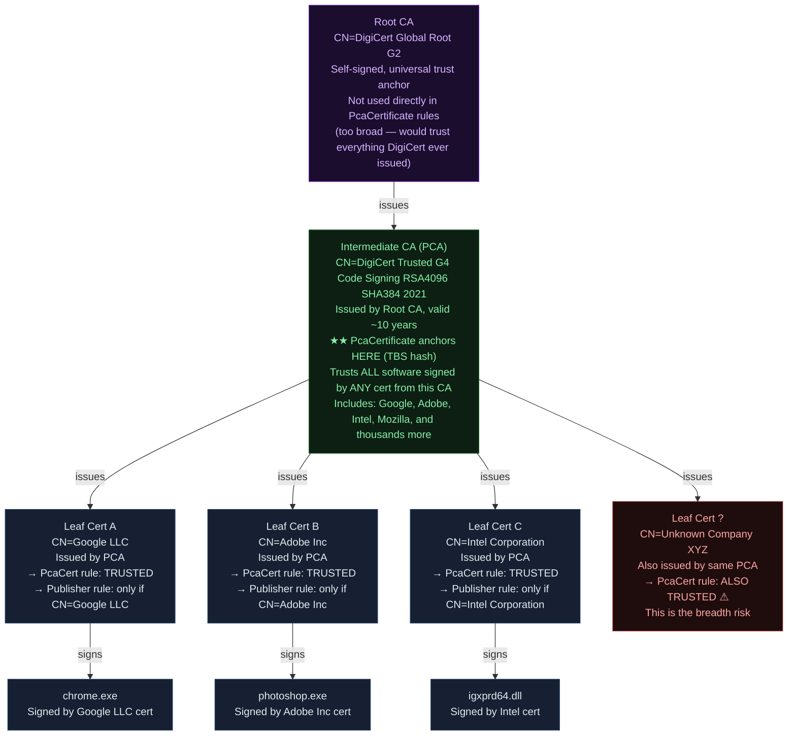
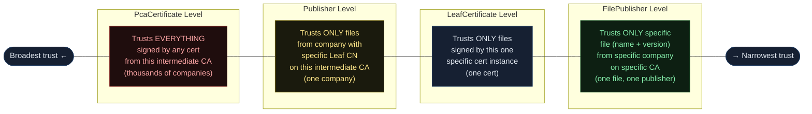
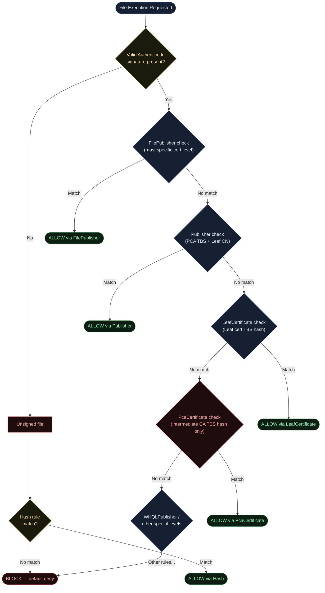
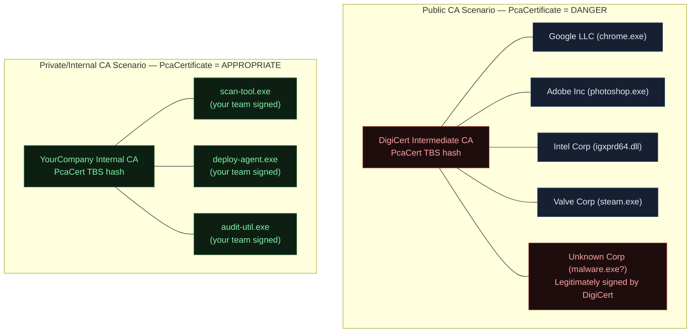
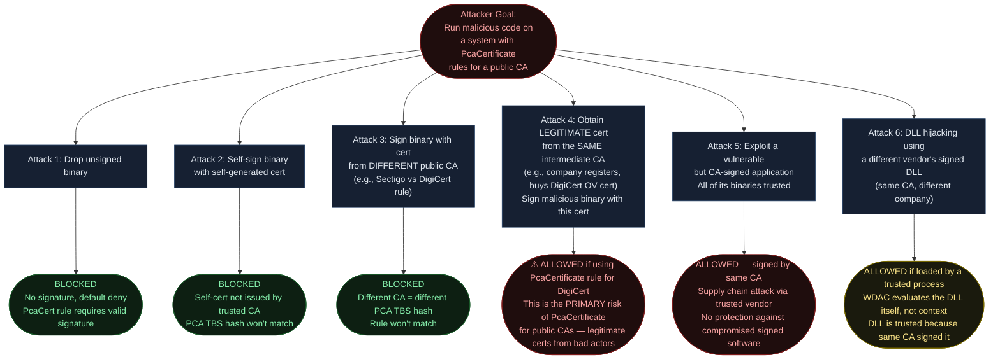
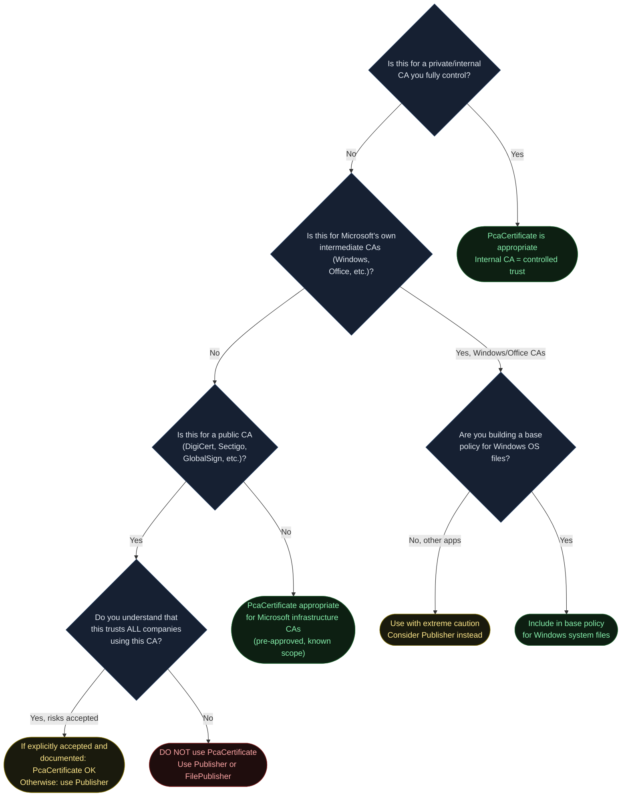

<!-- Author: Anubhav Gain | Category: WDAC File Rule Levels | Topic: PcaCertificate -->

# WDAC File Rule Level: PcaCertificate

## Table of Contents

1. [Overview](#1-overview)
2. [How It Works](#2-how-it-works)
3. [What "PCA" Means and Why Not the Root](#3-what-pca-means-and-why-not-the-root)
4. [Certificate Chain Anatomy](#4-certificate-chain-anatomy)
5. [Where in the Evaluation Stack](#5-where-in-the-evaluation-stack)
6. [XML Representation](#6-xml-representation)
7. [PowerShell Examples](#7-powershell-examples)
8. [Trust Surface: The Breadth Problem](#8-trust-surface-the-breadth-problem)
9. [Pros and Cons](#9-pros-and-cons)
10. [Attack Resistance Analysis](#10-attack-resistance-analysis)
11. [When to Use vs When to Avoid](#11-when-to-use-vs-when-to-avoid)
12. [Double-Signed File Behavior](#12-double-signed-file-behavior)
13. [Real-World Scenario](#13-real-world-scenario)
14. [OS Version and Compatibility Notes](#14-os-version-and-compatibility-notes)
15. [Common Mistakes and Gotchas](#15-common-mistakes-and-gotchas)
16. [Summary Table](#16-summary-table)

---

## 1. Overview

The **PcaCertificate** rule level in Windows Defender Application Control (WDAC) trusts files based on the **intermediate Certificate Authority certificate** that sits between the root CA and the leaf (end-entity) signing certificate in the chain. This is the "second from top" certificate in the typical three-tier PKI hierarchy.

"PCA" in WDAC terminology refers to this intermediate CA level — it is **not** the root CA and **not** the leaf cert. Understanding what PcaCertificate trusts requires understanding the full certificate chain:

```
Root CA (e.g., DigiCert Global Root G2)
  └── Intermediate CA / PCA (e.g., DigiCert Trusted G4 Code Signing RSA4096 SHA384 2021)
        ├── Company A leaf cert (CN=Microsoft Windows)
        ├── Company B leaf cert (CN=Intel Corporation)
        ├── Company C leaf cert (CN=Adobe Inc)
        └── [thousands more companies' certs]
```

A **PcaCertificate rule trusts ALL files signed by ANY leaf cert that chains up to this intermediate CA**. This is the broadest cert-based rule level available in WDAC — broader than Publisher (which filters by leaf CN), broader than LeafCertificate (which targets a specific cert instance), and broader than FilePublisher (which adds filename and version filters on top of Publisher).

**Key Characteristics:**
- Only one certificate checked: the intermediate CA (PCA)
- No leaf CN check
- No filename check
- No version check
- No file path check
- Trust is "CA-wide" — every company whose code signing cert was issued by this CA is trusted

This breadth makes PcaCertificate appropriate in very specific situations (private/internal CA, Microsoft's own infrastructure) and inappropriate for most public CA trust scenarios.

---

## 2. How It Works

### ConfigCI's Chain Walking Logic

When generating a PcaCertificate rule, ConfigCI walks up the certificate chain of a signed PE file and selects a specific certificate to anchor the rule. The selection logic is:

1. Start at the leaf certificate (index 0)
2. Walk up the chain: index 1 (intermediate), index 2 (next intermediate or root)
3. Stop at the **highest certificate in the chain that can be resolved** — either locally (from the Windows certificate store) or via online OCSP/AIA requests
4. This "highest resolvable" cert is used as the PCA anchor

In practice for publicly trusted certificates:
- The resolution typically stops at the **intermediate CA** (index 1 from leaf)
- The actual root CA certificate is often not explicitly included in the chain provided by the file's signature
- Even when the root is available locally (in Windows' Trusted Root Certification Authorities store), ConfigCI may stop at the intermediate

The result: for most real-world signed software, "PcaCertificate level" means the intermediate CA cert.

### Identifying the PCA Certificate

```powershell
# Which cert will ConfigCI use for PcaCertificate level?
function Get-WDACPcaCertInfo {
    param([string]$FilePath)

    $sig = Get-AuthenticodeSignature -FilePath $FilePath
    if ($sig.Status -ne "Valid") {
        Write-Warning "Invalid signature: $($sig.Status)"
        return
    }

    $leaf = $sig.SignerCertificate
    $chain = [System.Security.Cryptography.X509Certificates.X509Chain]::new()
    $chain.ChainPolicy.RevocationMode = "NoCheck"
    $null = $chain.Build($leaf)

    $elements = $chain.ChainElements

    Write-Host "`n=== PcaCertificate Analysis: $([System.IO.Path]::GetFileName($FilePath)) ===" -ForegroundColor Cyan
    Write-Host "`nFull chain ($($elements.Count) certificates):"

    for ($i = 0; $i -lt $elements.Count; $i++) {
        $cert = $elements[$i].Certificate
        $label = switch ($i) {
            0 { "(Leaf — NOT used for PcaCertificate)" }
            { $_ -eq $elements.Count - 1 } { "(Root CA — NOT used for PcaCertificate)" }
            default { "★ (PCA / Intermediate — USED for PcaCertificate TBS hash)" }
        }
        Write-Host "`n  [$i] $label"
        Write-Host "      Subject: $($cert.Subject)"
        Write-Host "      Issuer:  $($cert.Issuer)"
    }

    Write-Host "`n[PcaCertificate Rule Would Trust]"
    Write-Host "All software signed by ANY cert issued by:"
    if ($elements.Count -ge 2) {
        Write-Host "  $($elements[1].Certificate.Subject)"
        Write-Host ""
        Write-Host "WARNING: This includes ALL companies using this CA!"
        Write-Host "  e.g., If using DigiCert intermediate, ALL DigiCert customers are trusted."
    }
}

# Example usage
Get-WDACPcaCertInfo -FilePath "C:\Windows\System32\ntoskrnl.exe"
Get-WDACPcaCertInfo -FilePath "C:\Program Files\Intel\GraphicsDriver\igfxEM.exe"
```

### The TBS Hash

As with all certificate-based WDAC rules, the anchor is the **TBS (To-Be-Signed) hash** of the chosen certificate. For PcaCertificate, this is the TBS hash of the intermediate CA certificate. This hash is stable for the lifetime of that intermediate CA certificate (typically 5-20 years), which is why PcaCertificate rules require very infrequent updates.

---

## 3. What "PCA" Means and Why Not the Root

### The Name "PCA"

"PCA" in WDAC documentation historically stood for **Partner Certificate Authority** — the intermediate CA that a root CA delegates authority to for issuing end-entity certificates to software partners/vendors. Over time it became shorthand for "the intermediate CA level" in WDAC context, regardless of whether the intermediate CA is technically a "partner" of anyone.

When you see `<Signer Name="Microsoft Windows Production PCA 2011">` in WDAC policy XML, the "PCA" in the name refers to this intermediate CA concept.

### Why ConfigCI Stops at the Intermediate CA and Not the Root

There are several reasons ConfigCI uses the intermediate CA rather than the root:

**1. Chain Resolution Limitations**

Files embed their own certificate chain in the Authenticode signature, typically including leaf + one or two intermediates. The root CA certificate is usually NOT embedded — it's expected to be in the local Windows certificate store. When ConfigCI scans offline (no internet, no root store access) or in sandboxed environments, it may not be able to resolve the chain all the way to the root. It stops at the highest cert it can verify.

**2. Root Certs Are Too Broad**

A root CA like "DigiCert Global Root G2" is the trust anchor for potentially thousands of intermediate CAs, which collectively issue certificates to millions of companies. A PcaCertificate rule for the root CA would effectively trust the entire world's signed software — useless for application control.

**3. Intermediate CAs Have Manageable Scope**

An intermediate CA like "Microsoft Windows Production PCA 2011" is specifically scoped to Microsoft Windows binaries. Trusting this intermediate CA is a reasonable and well-defined trust scope.

### Microsoft's Own PCA Certs

Microsoft uses multiple intermediate CA certs, each scoped to a specific purpose:

| Intermediate CA Name | Purpose |
|---|---|
| Microsoft Windows Production PCA 2011 | Core Windows OS components |
| Microsoft Windows PCA 2010 | Older Windows components |
| Microsoft Code Signing PCA 2011 | General Microsoft software |
| Microsoft Code Signing PCA 2010 | Older Microsoft software |
| Microsoft Windows Third Party Component CA 2014 | Third-party drivers in Windows |
| Microsoft Development PCA 2014 | Microsoft development tools |

These are all intermediate CAs — none of them are the root. Trusting any one of them at PcaCertificate level trusts only the software Microsoft has signed with that specific CA.

---

## 4. Certificate Chain Anatomy



### Trust Surface Comparison Across Levels



---

## 5. Where in the Evaluation Stack



PcaCertificate is the broadest cert-based rule level and is checked after more specific cert-based levels. The note: ConfigCI evaluates all applicable rules simultaneously — the flowchart shows logical precedence, not strict sequential evaluation order.

---

## 6. XML Representation

### PcaCertificate Rule XML

The defining characteristic of PcaCertificate XML is:
1. `<CertRoot Type="TBS" Value="..."/>` contains the TBS hash of the **intermediate CA** certificate
2. There is **no `<CertPublisher>` element** — its absence is what makes this PcaCertificate (not Publisher)
3. There is **no `<FileAttribRef>` element** — that would make it FilePublisher

```xml
<?xml version="1.0" encoding="utf-8"?>
<SiPolicy xmlns="urn:schemas-microsoft-com:sipolicy" PolicyType="Base Policy">

  <Signers>

    <!--
      PcaCertificate Rule: Microsoft Windows Production PCA 2011
      
      This rule trusts ALL files signed by ANY leaf cert issued by this
      intermediate CA. For Microsoft Windows Production PCA 2011, that means
      all core Windows OS components.
      
      For a public CA like DigiCert, this would mean THOUSANDS of companies.
      PcaCertificate is only appropriate for well-scoped intermediate CAs.
    -->
    <Signer ID="ID_SIGNER_MSWIN_PCA_2011" Name="Microsoft Windows Production PCA 2011">

      <!--
        CertRoot: TBS hash of the INTERMEDIATE CA certificate
        NOT the root. NOT the leaf. The intermediate CA that issued
        the code signing certificates for Windows components.
        
        This hash is stable for the lifetime of this intermediate CA
        (typically 10-20 years), so this rule rarely needs updating.
      -->
      <CertRoot Type="TBS" Value="4E80BE107C860A21A621E2D0831F85F701AFF1B007AEB99BBBA4B02B72D7B6A5"/>

      <!--
        No CertPublisher here.
        The ABSENCE of CertPublisher is what makes this PcaCertificate level.
        With CertPublisher, this would be a Publisher rule.
        Without CertPublisher, ConfigCI checks ONLY the PCA TBS hash.
        Any leaf cert issued by this CA = trusted.
      -->

    </Signer>

    <!--
      Example: Microsoft Code Signing PCA 2011
      For general Microsoft applications (Office, Edge, etc.)
    -->
    <Signer ID="ID_SIGNER_MS_CODESIGNING_PCA_2011" Name="Microsoft Code Signing PCA 2011">
      <CertRoot Type="TBS" Value="F6F717A43AD9ABDDC8CEFDDE1C505462535E7D1307E630F9544A2D14FE8BF26E"/>
      <!-- No CertPublisher → PcaCertificate level -->
    </Signer>

    <!--
      CONTRAST: What Publisher looks like for the same CA
      Same CertRoot TBS hash, but CertPublisher added → narrows trust to one CN
    -->
    <Signer ID="ID_SIGNER_MS_PUBLISHER" Name="Microsoft Windows Production PCA 2011">
      <CertRoot Type="TBS" Value="4E80BE107C860A21A621E2D0831F85F701AFF1B007AEB99BBBA4B02B72D7B6A5"/>
      <CertPublisher Value="Microsoft Windows"/>  <!-- This makes it Publisher level -->
    </Signer>

  </Signers>

  <SigningScenarios>

    <!-- Kernel Mode — drivers and boot components -->
    <SigningScenario Value="131" ID="ID_SIGNINGSCENARIO_DRIVERS" FriendlyName="Kernel Mode">
      <ProductSigners>
        <AllowedSigners>
          <AllowedSigner SignerID="ID_SIGNER_MSWIN_PCA_2011"/>
        </AllowedSigners>
      </ProductSigners>
    </SigningScenario>

    <!-- User Mode — executables, DLLs -->
    <SigningScenario Value="12" ID="ID_SIGNINGSCENARIO_WINDOWS" FriendlyName="User Mode">
      <ProductSigners>
        <AllowedSigners>
          <AllowedSigner SignerID="ID_SIGNER_MSWIN_PCA_2011"/>
          <AllowedSigner SignerID="ID_SIGNER_MS_CODESIGNING_PCA_2011"/>
        </AllowedSigners>
      </ProductSigners>
    </SigningScenario>

  </SigningScenarios>

</SiPolicy>
```

### XML Element Summary for PcaCertificate

| Element | Attribute | Role |
|---|---|---|
| `<Signer>` | `ID` | Unique identifier for referencing |
| `<Signer>` | `Name` | Human-readable name (typically the intermediate CA's CN) |
| `<CertRoot>` | `Type="TBS"` | Specifies TBS hash identification |
| `<CertRoot>` | `Value` | TBS hash of the INTERMEDIATE CA certificate |
| `<AllowedSigner>` | `SignerID` | References the Signer in a signing scenario |
| `<CertPublisher>` | — | **ABSENT** — its absence is what makes this PcaCertificate, not Publisher |

### How to Tell PcaCertificate from LeafCertificate in XML

Both levels produce a `<Signer>` with only `<CertRoot>` and no `<CertPublisher>`. The XML structures are **identical in form**. The only difference is which certificate's TBS hash is stored:

- **PcaCertificate**: `<CertRoot Value="..."/>` contains intermediate CA TBS hash
- **LeafCertificate**: `<CertRoot Value="..."/>` contains leaf cert TBS hash

You cannot determine the level from XML structure alone. The `Name` attribute on `<Signer>` is the human-readable clue — if it names an intermediate CA (e.g., "DigiCert Code Signing PCA") it's PcaCertificate; if it names a vendor (e.g., "Acme Software Inc") it's likely LeafCertificate.

---

## 7. PowerShell Examples

### Generate PcaCertificate Rules

```powershell
# Generate PcaCertificate rules from Windows system files
New-CIPolicy `
    -Level PcaCertificate `
    -ScanPath "C:\Windows\System32" `
    -Fallback Hash `
    -OutputFilePath "C:\Policies\WindowsPcaPolicy.xml"

# WARNING: Scanning C:\Windows\System32 with PcaCertificate level will produce
# very few rules (because many MS components share the same intermediate CAs)
# but those rules will be VERY broad.
```

### Generate PcaCertificate Rule for a Specific File

```powershell
# Single file PcaCertificate rule
$rule = New-CIPolicyRule `
    -Level PcaCertificate `
    -DriverFilePath "C:\Windows\System32\ntoskrnl.exe" `
    -Fallback Hash

$rule | Format-List *
```

### Inspect What PcaCertificate Rule Will Trust

```powershell
function Get-PcaCertTrustScope {
    param([string]$FilePath)

    $sig = Get-AuthenticodeSignature -FilePath $FilePath
    $leaf = $sig.SignerCertificate
    $chain = [System.Security.Cryptography.X509Certificates.X509Chain]::new()
    $chain.ChainPolicy.RevocationMode = "NoCheck"
    $null = $chain.Build($leaf)

    Write-Host "`n=== PcaCertificate Trust Scope Analysis ===" -ForegroundColor Red
    Write-Host "Analyzing: $FilePath" -ForegroundColor Cyan

    Write-Host "`n[FILE'S LEAF CERT — NOT what PcaCert rule uses]"
    Write-Host "  Subject: $($chain.ChainElements[0].Certificate.Subject)"

    if ($chain.ChainElements.Count -ge 2) {
        $pca = $chain.ChainElements[1].Certificate
        Write-Host "`n[INTERMEDIATE CA / PCA — This IS what PcaCert rule uses]" -ForegroundColor Yellow
        Write-Host "  Subject:    $($pca.Subject)"
        Write-Host "  Issuer:     $($pca.Issuer)"
        Write-Host "  Valid:      $($pca.NotBefore.ToShortDateString()) → $($pca.NotAfter.ToShortDateString())"
        Write-Host "  Thumbprint: $($pca.Thumbprint)"
    }

    Write-Host "`n[RISK WARNING]" -ForegroundColor Red
    Write-Host "A PcaCertificate rule for this file's intermediate CA would trust:"
    Write-Host "  - Every file signed by the leaf cert of this file's vendor"
    Write-Host "  - Every file signed by leaf certs of ALL OTHER companies"
    Write-Host "    that have obtained code signing certs from the same intermediate CA"
    Write-Host ""
    Write-Host "If this is a public CA (DigiCert, Sectigo, GlobalSign, etc.):"
    Write-Host "  THOUSANDS of unrelated companies' software would be trusted."
    Write-Host ""
    Write-Host "Recommendation: Use Publisher level instead to filter by company CN."
}

# See the scope of trust for different files
Get-PcaCertTrustScope -FilePath "C:\Windows\System32\ntoskrnl.exe"   # Microsoft CA — controlled
Get-PcaCertTrustScope -FilePath "C:\Program Files\7-Zip\7z.exe"       # DigiCert — very broad!
```

### Creating a Policy from Internal CA Files Only

```powershell
# For internal/private CA use case:
# Generate PcaCertificate rules from internally-signed tools

# First, verify the cert is from your internal CA
$sig = Get-AuthenticodeSignature "C:\InternalTools\scan-tool.exe"
$chain = [System.Security.Cryptography.X509Certificates.X509Chain]::new()
$chain.ChainPolicy.RevocationMode = "NoCheck"
$null = $chain.Build($sig.SignerCertificate)

Write-Host "Issuer: $($chain.ChainElements[1].Certificate.Subject)"
# Should show: CN=YourCompany Internal Code Signing CA

# Then generate policy — appropriate if issuer is truly your internal CA
New-CIPolicy `
    -Level PcaCertificate `
    -ScanPath "C:\InternalTools" `
    -UserPEs `
    -OutputFilePath "C:\Policies\InternalToolsPolicy.xml"
```

---

## 8. Trust Surface: The Breadth Problem

This section is critical for understanding why PcaCertificate must be used with extreme caution for publicly-trusted intermediate CAs.

### Public CA Trust Surface — A Concrete Example

Consider a PcaCertificate rule generated from a DigiCert-signed file:

```
Your intended trust: "I trust 7-Zip (by Igor Pavlov)"
What PcaCertificate actually trusts:
  Every company that has obtained a code signing cert from
  DigiCert Trusted G4 Code Signing RSA4096 SHA384 2021, which includes:
  
  ✓ Igor Pavlov (7-Zip)
  ✓ Google LLC (Chrome)
  ✓ Adobe Inc (Acrobat)
  ✓ Mozilla Corporation (Firefox)
  ✓ Intel Corporation (drivers)
  ✓ Qualcomm Technologies (drivers)
  ✓ Valve Corporation (Steam)
  ✓ NVIDIA Corporation (drivers)
  ✓ [Thousands of other companies...]
  ✓ Unknown Startup LLC (what they make is unclear to you)
  ✓ Any future company that gets a cert from this CA
```

If an attacker's company obtains a legitimate code signing certificate from the same DigiCert intermediate CA and signs malware, a PcaCertificate rule for that CA would allow the malware. The attacker's cert was legitimately issued — just to malicious actors.

### The Contrast: Private CA Trust Surface

For an internal/private CA, the trust surface is exactly what you define:

```
Your Internal Code Signing CA
  → Tool A (signed by your team)
  → Tool B (signed by your team)  
  → Tool C (signed by your team)
  [Only what your team signed — nothing else]
```

A PcaCertificate rule for your internal CA is entirely appropriate. You control who gets certs from it.

### Trust Surface Comparison Diagram



---

## 9. Pros and Cons

| Factor | Assessment |
|---|---|
| **Trust scope** | Very broad — covers all certs from the intermediate CA |
| **Maintenance burden** | Extremely Low — intermediate CA certs last 10-20 years |
| **Setup complexity** | Very Low — one rule covers vast software catalog |
| **Specificity** | Lowest among cert-based levels |
| **False positive risk** | Very High for public CAs |
| **Appropriate for public CAs** | Almost never — too broad |
| **Appropriate for private CAs** | Yes — controlled scope |
| **Survives leaf cert renewal** | Yes — doesn't check leaf certs at all |
| **Survives publisher CN changes** | Yes — doesn't check leaf CNs |
| **Kernel driver support** | Yes |
| **User mode support** | Yes |

### Pros

- **Near-zero maintenance**: Intermediate CA certs last a decade or more. Once deployed, rarely needs updating.
- **Complete vendor coverage**: Any file the vendor signs (past, present, future) with any cert from this CA is trusted.
- **Simple rules**: A small number of `<Signer>` elements can cover vast software ecosystems.
- **Perfect for internal PKI**: When you control the CA, PcaCertificate maps precisely to "trust everything from my internal signing infrastructure."
- **Good for Windows base policy**: The default Windows base policies use PcaCertificate level for Microsoft's own intermediate CAs.

### Cons

- **Dangerous for public CAs**: A PcaCertificate rule for DigiCert, Sectigo, or GlobalSign trusts thousands of unrelated companies.
- **No granularity**: You cannot use PcaCertificate to trust one vendor from a CA — you get all of them.
- **Attack vector**: Legitimate certs obtained by malicious actors will be trusted if they use the same CA.
- **Not appropriate as the only rule level**: Should be supplemented with more specific rules for vendor software.
- **Audit complexity**: Hard to explain to auditors why all DigiCert-signed software is trusted.

---

## 10. Attack Resistance Analysis



### Key Risk: The "Legitimate Cert" Attack

The most significant risk of PcaCertificate for public CAs is that an attacker can obtain a **legitimate** code signing certificate from the same CA. The CA verifies the attacker's company identity (to varying degrees depending on cert type), issues a valid cert, and the attacker can sign malicious software that passes a PcaCertificate rule targeting that CA's intermediate cert.

- **OV (Organization Validation) certs**: Require proof of business registration. A fake/shell company could pass this.
- **EV (Extended Validation) certs**: More rigorous vetting. Harder to obtain fraudulently, but not impossible.
- **Private CA certs**: Not obtainable by outsiders — this is why PcaCertificate is safe for private CAs.

---

## 11. When to Use vs When to Avoid



### Specific Appropriate Use Cases for PcaCertificate

| Use Case | Why PcaCertificate is OK | Notes |
|---|---|---|
| Microsoft Windows base policies | Microsoft's own intermediate CAs (Windows Production PCA, etc.) have known, bounded scope | These CAs only issue certs to Microsoft teams |
| Internal PKI — developer toolchain | You control the CA — only your tools get certs | Automate cert issuance + policy updates |
| Air-gapped environments with custom PKI | No public CA exposure; policy is the only trust mechanism | Must strictly control who gets internal certs |
| Default Windows allowlist (UMCI) | DefaultWindows_Enforced template uses PcaCertificate for Windows CAs | Supplement with Publisher for third-party |
| Lab/test environments | Lower security requirements; broad trust acceptable | Do not use in production |

---

## 12. Double-Signed File Behavior

When ConfigCI encounters a double-signed file at PcaCertificate level:

1. Each signature has its own certificate chain, each with its own intermediate CA
2. ConfigCI extracts the PCA TBS hash from each signature's chain
3. If the two signatures use **different intermediate CAs** (common for SHA-1 vs SHA-256 chains), two separate `<Signer>` elements are created

```xml
<!-- Primary signature: SHA-256 chain via modern DigiCert CA -->
<Signer ID="ID_SIGNER_DIGICERT_SHA256_PCA" Name="DigiCert Trusted G4 Code Signing RSA4096 SHA384 2021">
  <CertRoot Type="TBS" Value="3F9001EA..."/>
  <!-- No CertPublisher — PcaCertificate level for SHA-256 chain -->
</Signer>

<!-- Secondary signature: SHA-1 chain via older DigiCert CA -->
<Signer ID="ID_SIGNER_DIGICERT_SHA1_PCA" Name="DigiCert High-Assurance Code Signing CA-1">
  <CertRoot Type="TBS" Value="8A4B3F2E..."/>
  <!-- No CertPublisher — PcaCertificate level for SHA-1 chain -->
</Signer>
```

**Trust surface implication:** Dual PcaCertificate rules from a dual-signed file effectively double the trust surface — now you're trusting all certs from TWO intermediate CAs, not one.

**Benefit:** If one signature chain becomes invalid (old SHA-1 CA deprecated), the other PcaCertificate rule still covers the file.

---

## 13. Real-World Scenario

**Scenario: Building a Windows base policy using Microsoft's intermediate CAs**

The most legitimate and common real-world use of PcaCertificate is for the Microsoft infrastructure CAs in a Windows base policy.

```mermaid
sequenceDiagram
    participant Admin as IT Admin
    participant PS as PowerShell ConfigCI
    participant WinRef as Windows Reference Image
    participant Policy as Policy XML
    participant Deploy as Deployment

    Admin->>PS: New-CIPolicy -Level PcaCertificate -FilePath C:\Windows -UserPEs
    PS->>WinRef: Scan Windows system files
    PS->>WinRef: Extract cert chains from ntoskrnl.exe, winlogon.exe, svchost.exe, etc.
    PS->>PS: All resolve to ~4-5 Microsoft intermediate CAs
    PS->>PS: Generate 4-5 PcaCertificate Signer rules
    PS-->>Policy: Write MinimumPolicy.xml

    Note over Policy: Policy contents:
    Note over Policy: Signer: Microsoft Windows Production PCA 2011
    Note over Policy: Signer: Microsoft Code Signing PCA 2011
    Note over Policy: Signer: Microsoft Windows PCA 2010 (legacy)
    Note over Policy: Signer: Microsoft Code Signing PCA 2010 (legacy)

    Admin->>PS: Add third-party apps via Publisher or FilePublisher
    PS-->>Policy: Merge third-party Publisher rules into policy
    Admin->>Deploy: Deploy merged policy in audit mode
    Deploy-->>Admin: Audit logs show what would be blocked
    Admin->>Deploy: Switch to enforcement after validation

    Note over Deploy: A new Windows Update ships
    Note over Deploy: New binaries still signed by same Microsoft intermediate CAs
    Deploy->>Deploy: New binaries evaluated: PCA TBS hash matches ✓
    Deploy-->>Deploy: ALLOWED — no policy update needed for Windows Updates

    Note over Deploy: Third-party app from DigiCert customer (not in policy)
    Deploy->>Deploy: New app evaluated: DigiCert PCA TBS hash
    Deploy->>Deploy: No PcaCertificate rule for DigiCert PCA
    Deploy->>Deploy: No Publisher rule for this vendor
    Deploy-->>Deploy: BLOCKED — expected behavior

    style Admin fill:#162032,stroke:#1e3a5f,color:#e2e8f0
    style PS fill:#1a0d2e,stroke:#6b21a8,color:#d8b4fe
    style WinRef fill:#162032,stroke:#1e3a5f,color:#e2e8f0
    style Policy fill:#162032,stroke:#1e3a5f,color:#e2e8f0
    style Deploy fill:#0d1f12,stroke:#1a5c2a,color:#86efac
```

---

## 14. OS Version and Compatibility Notes

| Feature | Windows Version | Notes |
|---|---|---|
| PcaCertificate level (UMCI) | Windows 10 1507+ | Available since initial WDAC release |
| PcaCertificate level (KMCI) | Windows 10 1507+ | Kernel mode support |
| SHA-256 TBS hashes | Windows 10 1703+ | Older versions used SHA-1 TBS |
| Multiple active policies | Windows 10 1903+ | Allows base + supplemental policy combination |
| CiTool.exe deployment | Windows 11 22H2+ | No-reboot policy deployment |
| `New-CIPolicy -Level PcaCertificate` | Windows 10 1607+ | PowerShell ConfigCI module |
| HVCI compatibility | Windows 10 1703+ | HVCI enforces KMCI rules strictly |

### ConfigCI Default Behavior

When you run `New-CIPolicy` without specifying `-Level`, it defaults to Publisher level (not PcaCertificate). PcaCertificate must be explicitly requested. The default behavior suggests Microsoft's own recommendation: Publisher and FilePublisher are the primary levels for enterprise use; PcaCertificate is more specialized.

### Default Windows Policy Templates

The `C:\Windows\schemas\CodeIntegrity\ExamplePolicies\` directory (Windows 10 1903+) contains example policies. The `DefaultWindows_Enforced.xml` template uses PcaCertificate level for Microsoft's intermediate CAs and illustrates the appropriate pattern: PcaCertificate for well-controlled Microsoft CAs, supplemented by more specific rules for additional trust.

---

## 15. Common Mistakes and Gotchas

### Mistake 1: Using PcaCertificate for Public CA Without Understanding Scope

This is the most dangerous mistake. If you run `New-CIPolicy -Level PcaCertificate` against, say, Chrome or 7-Zip, you'll get a PcaCertificate rule for the DigiCert intermediate CA. This rule will also allow Google Chrome, Adobe Acrobat, Intel drivers, Mozilla Firefox, and thousands of other applications that happen to use the same DigiCert CA.

**Always check:** Before deploying a PcaCertificate rule, verify whether the intermediate CA is private/controlled or a public CA with broad issuance.

### Mistake 2: Thinking PcaCertificate is "PCA + CN" (Confusing with Publisher)

A common source of confusion: "PCA Certificate level" sounds like it might check the PCA cert plus something else. It does not. PcaCertificate checks **only** the PCA/intermediate CA TBS hash. Nothing else. The CN of the leaf cert, the filename, the version — none of these are checked. Publisher is the level that adds the CN check.

### Mistake 3: Using PcaCertificate in the Fallback Chain Without Realizing the Broadness

```powershell
# DANGEROUS — if a file fails FilePublisher and Publisher,
# it falls back to PcaCertificate, which is extremely broad
New-CIPolicy `
    -Level FilePublisher `
    -Fallback Publisher, PcaCertificate, Hash `
    -ScanPath "C:\SomeDirectory"
```

If the files in `C:\SomeDirectory` are signed by a public CA and some lack VERSIONINFO, they'll generate PcaCertificate fallback rules. Suddenly your policy trusts everything from that public CA. Use `-Fallback Publisher, Hash` to avoid this.

### Mistake 4: Not Documenting Which Files Generated Which PcaCertificate Rules

Because PcaCertificate rules represent entire CA authorities rather than specific files or vendors, policy audits become difficult if you don't document why each PcaCertificate rule exists. Include a `FriendlyName` or comment explaining the business justification.

### Mistake 5: Using PcaCertificate for WHQL-Signed Drivers When WHQL Level Exists

For WHQL (Windows Hardware Quality Labs) signed drivers, there is a dedicated `WHQLPublisher` and `WHQLFilePublisher` level that is more appropriate than PcaCertificate. WHQL-level rules scope trust specifically to Microsoft's hardware certification program.

### Mistake 6: Confusing XML Structure with LeafCertificate

Both PcaCertificate and LeafCertificate rules produce identical XML: a `<Signer>` with `<CertRoot>` and no `<CertPublisher>`. The only semantic difference is which certificate's TBS hash is stored. Always use descriptive `Name` attributes on `<Signer>` elements and maintain a certificate inventory to track which TBS hash belongs to which cert and at which level it was generated.

### Mistake 7: Assuming PcaCertificate Rules Never Need Updating

While intermediate CA certs last much longer than leaf certs (10-20 years vs 1-3 years), they do eventually expire or get replaced. Microsoft has transitioned from "PCA 2010" certs to "PCA 2011" certs and will presumably do so again. Plan for periodic reviews of PcaCertificate rules — perhaps every 3-5 years rather than every year like LeafCertificate.

---

## 16. Summary Table

| Property | Value |
|---|---|
| **Rule Level Name** | PcaCertificate |
| **Certificate Anchored** | Intermediate CA (PCA) — one level below root |
| **Anchor Method** | TBS hash of intermediate CA certificate (`<CertRoot Type="TBS">`) |
| **Additional Filter** | None — no CN, no filename, no version, no path |
| **Key XML Difference from Publisher** | No `<CertPublisher>` element; same `<CertRoot>` position |
| **Key XML Difference from LeafCertificate** | Same XML structure; differs in WHICH cert's TBS hash is stored |
| **Trust Granularity** | All files signed by any cert issued by this intermediate CA |
| **Trust Scope for Public CAs** | Thousands of unrelated companies — EXTREMELY BROAD |
| **Trust Scope for Private CAs** | Only files your organization signs — APPROPRIATE |
| **Maintenance Frequency** | Very rare — intermediate CA certs last 10-20 years |
| **Survives Leaf Cert Renewal** | Yes — doesn't check leaf certs |
| **Survives Vendor CN Changes** | Yes — doesn't check leaf cert CNs |
| **Survives Vendor CA Change** | No — new CA = new intermediate = different TBS hash |
| **Kernel Mode Support** | Yes |
| **User Mode Support** | Yes |
| **Appropriate For** | Internal PKI, Microsoft's own Windows CAs, base policies |
| **Inappropriate For** | Public CAs (DigiCert, Sectigo, GlobalSign) for general software |
| **Key Risk** | Legitimately-obtained cert from same public CA allows malicious software |
| **XML Elements** | `<Signer>` + `<CertRoot Type="TBS">` (NO `<CertPublisher>`) |
| **PowerShell Parameter** | `-Level PcaCertificate` |
| **Default in New-CIPolicy** | No — must be explicitly specified |
| **Introduced** | Windows 10 1507 |
| **Microsoft Guidance** | Use for Windows OS base policies; avoid for third-party public CA software |
