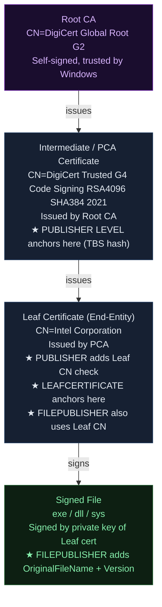
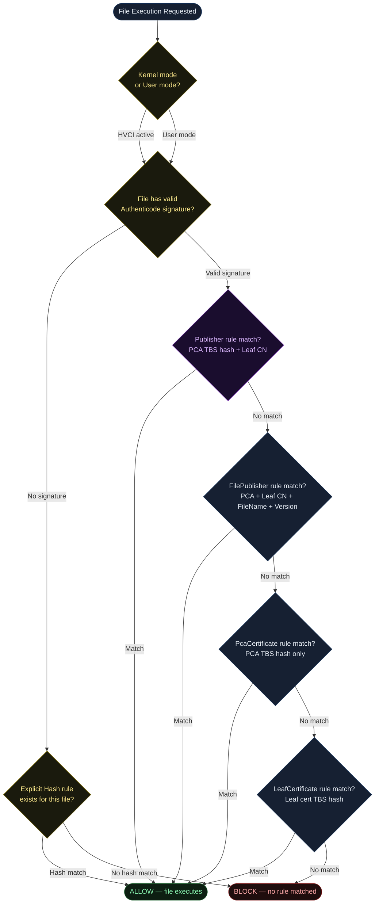
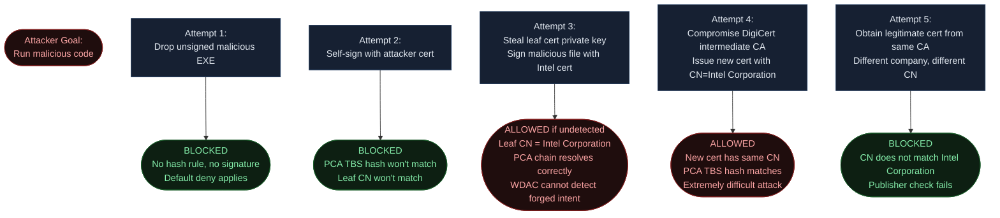
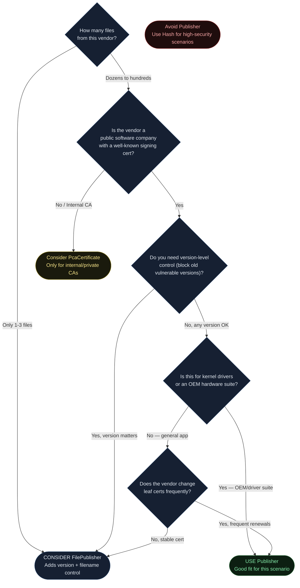

<!-- Author: Anubhav Gain | Category: WDAC File Rule Levels | Topic: Publisher -->

# WDAC File Rule Level: Publisher

## Table of Contents

1. [Overview](#1-overview)
2. [How It Works](#2-how-it-works)
3. [Certificate Chain Anatomy](#3-certificate-chain-anatomy)
4. [Where in the Evaluation Stack](#4-where-in-the-evaluation-stack)
5. [XML Representation](#5-xml-representation)
6. [PowerShell Examples](#6-powershell-examples)
7. [Pros and Cons](#7-pros-and-cons)
8. [Attack Resistance Analysis](#8-attack-resistance-analysis)
9. [When to Use vs When to Avoid](#9-when-to-use-vs-when-to-avoid)
10. [Double-Signed File Behavior](#10-double-signed-file-behavior)
11. [Real-World Scenario](#11-real-world-scenario)
12. [OS Version and Compatibility Notes](#12-os-version-and-compatibility-notes)
13. [Common Mistakes and Gotchas](#13-common-mistakes-and-gotchas)
14. [Summary Table](#14-summary-table)

---

## 1. Overview

The **Publisher** rule level is one of the most practical and widely used certificate-based trust levels in Windows Defender Application Control (WDAC), also known as App Control for Business. It answers a simple question: "Do I trust everything signed by this specific software publisher?"

At its core, Publisher combines two elements:

- **PCA Certificate** — the intermediate Certificate Authority certificate that issued the leaf (end-entity) signing certificate used by the publisher. This is typically one level below the root CA in the certificate chain. ("PCA" historically stood for "Partner Certificate Authority" or is simply shorthand for the intermediate CA level.)
- **Leaf Certificate CN (Common Name)** — the Subject Common Name field of the leaf certificate, which identifies the actual organization or entity that signed the file.

Together, these two elements create a rule that says: "Allow any file signed by a leaf certificate whose CN matches `[Publisher Name]` AND whose certificate was issued by the intermediate CA with TBS hash `[PCA TBS Hash]`."

This means all files from a given publisher — regardless of filename, version, or specific signing certificate renewal — will be trusted, as long as the publisher continues to use the same CA infrastructure.

**Key Characteristics:**
- No filename restriction
- No version floor or ceiling
- No file-specific attributes checked
- Trust is "publisher-wide" — all executables, DLLs, scripts from that publisher pass

---

## 2. How It Works

### The PCA Concept: What Does "PCA" Mean in WDAC?

In WDAC terminology, the "PCA" certificate refers to the **intermediate Certificate Authority certificate** that sits one level below the root in the chain ConfigCI resolves for a given file. This is important to understand precisely:

- It is **NOT** the root CA (e.g., DigiCert Global Root G2)
- It is **NOT** the leaf certificate (the actual signing cert held by the vendor)
- It is the **intermediate CA** — an entity that DigiCert (or another root CA) has authorized to issue code-signing certificates

When WDAC builds a Publisher rule, the `New-CIPolicy` cmdlet (or the `New-CIPolicyRule` cmdlet) performs the following steps:

1. Read the Authenticode signature from the PE file
2. Extract the full certificate chain
3. Walk up the chain, stopping one level below the root (or the highest resolvable certificate if the chain cannot be fully resolved online/locally)
4. Record the **TBS (To-Be-Signed) hash** of that intermediate certificate — this becomes the `<CertRoot Type="TBS" Value="..."/>` element
5. Extract the **Subject CN** of the leaf certificate — this becomes the `<CertPublisher Value="..."/>` element
6. Combine both into a single `<Signer>` entry

### TBS Hash: What Is It?

The TBS (To-Be-Signed) hash is computed over the portion of an X.509 certificate that is actually signed — the certificate body without the outer signature wrapper. This hash uniquely identifies a specific certificate instance (specific key, specific validity period, specific issuer). Using TBS rather than the full certificate hash is a WDAC convention that provides stable identification across different DER encodings.

### Leaf CN Matching: Case Sensitivity

A critical detail: the CN match in Publisher rules is a **case-sensitive string comparison**. If the leaf certificate Subject has CN=`Intel(R) Code Signing` (with specific capitalization), the `<CertPublisher>` value in your XML must exactly match that string. A mismatch due to case or whitespace will cause the rule to fail silently — files won't be blocked with an error, they simply won't match the Publisher rule and will fall through to other rules.

### How ConfigCI Identifies the PCA Certificate

To manually identify which certificate is the "PCA" for a given file:

```powershell
# Step 1: Get the signer certificate from the file
$sig = Get-AuthenticodeSignature "C:\path\to\file.exe"
$leafCert = $sig.SignerCertificate

# Step 2: Build the full chain
$chain = New-Object System.Security.Cryptography.X509Certificates.X509Chain
$chain.Build($leafCert) | Out-Null

# Step 3: List all certs in the chain (index 0 = leaf, last = root)
$chain.ChainElements | ForEach-Object {
    $c = $_.Certificate
    Write-Host "Subject: $($c.Subject)"
    Write-Host "Issuer:  $($c.Issuer)"
    Write-Host "Thumbprint: $($c.Thumbprint)"
    Write-Host "---"
}

# Step 4: The PCA is typically index 1 (chain[1]) — one above the leaf
$pcaCert = $chain.ChainElements[1].Certificate
Write-Host "PCA CN: $($pcaCert.Subject)"
```

For a typical Microsoft-signed system file, the chain might look like:

```
[0] Leaf:  CN=Microsoft Windows, OU=MOPR, O=Microsoft Corporation, ...
[1] PCA:   CN=Microsoft Windows Production PCA 2011
[2] Root:  CN=Microsoft Root Certificate Authority 2010
```

WDAC uses index [1] — the PCA — for the Publisher rule's `<CertRoot>` TBS hash.

### Trust Scope

When a Publisher rule is in effect, ConfigCI checks each PE file at load time:

1. Does the file carry a valid Authenticode signature?
2. Does the chain resolve to the expected PCA certificate (by TBS hash)?
3. Does the leaf CN match `<CertPublisher Value="..."/>`?

If all three pass, the file is allowed — regardless of what the file is named, what version it claims, or where it lives on disk.

---

## 3. Certificate Chain Anatomy

The following diagram shows the full certificate chain and which level each WDAC rule level "anchors" to:



**Publisher Level specifically:**
- Anchors at the **PCA (intermediate) certificate** via its TBS hash
- Additionally requires that the **leaf certificate's CN** matches a specific value
- Does NOT check: filename, file version, file path, or any file attributes

**Contrast with neighboring levels:**

| Level | Anchor Certificate | Additional Checks |
|---|---|---|
| PcaCertificate | PCA cert (TBS hash) | None |
| **Publisher** | **PCA cert (TBS hash)** | **+ Leaf CN match** |
| FilePublisher | PCA cert (TBS hash) | + Leaf CN + OriginalFileName + MinimumFileVersion |
| LeafCertificate | Leaf cert (TBS hash) | None |

---

## 4. Where in the Evaluation Stack



Publisher rules are checked as part of the signer evaluation. ConfigCI evaluates all signer-based rules in parallel against the file's certificate chain — it does not strictly proceed in the linear order shown above. The flowchart illustrates logical precedence for understanding; in practice, CI checks all applicable rules simultaneously and allows the file if any rule permits it.

---

## 5. XML Representation

### Full Publisher Rule XML Structure

A Publisher rule produces the following elements in a WDAC policy XML file (SiPolicy.xml):

```xml
<?xml version="1.0" encoding="utf-8"?>
<SiPolicy xmlns="urn:schemas-microsoft-com:sipolicy" PolicyType="Base Policy">

  <!-- ... other policy elements ... -->

  <Signers>

    <!--
      Publisher Rule for Intel Corporation drivers/software
      - Name attribute: human-readable label, typically the PCA cert CN
      - ID attribute: unique identifier referenced by AllowedSigners
    -->
    <Signer ID="ID_SIGNER_INTEL_001" Name="DigiCert Trusted G4 Code Signing RSA4096 SHA384 2021">

      <!--
        CertRoot anchors this rule to the PCA (intermediate CA) certificate
        - Type="TBS" means the Value is a TBS hash of the PCA certificate
        - Value: SHA-256 TBS hash of the intermediate CA cert, hex-encoded
        This TBS hash uniquely identifies the specific intermediate CA cert
      -->
      <CertRoot Type="TBS" Value="3F9001EA83C560D712C24CF213C3D312CB3BFF51EE89435D3430BD06B5D0EECE"/>

      <!--
        CertPublisher narrows the trust to a specific leaf certificate CN
        - Value: exact string match against SubjectCN of the leaf/end-entity cert
        - This is case-sensitive — must match exactly as it appears in the cert
        Without this element, the rule becomes a PcaCertificate-level rule
      -->
      <CertPublisher Value="Intel Corporation"/>

    </Signer>

    <!-- Example: Microsoft Windows Publisher rule -->
    <Signer ID="ID_SIGNER_MSWIN_001" Name="Microsoft Windows Production PCA 2011">
      <CertRoot Type="TBS" Value="4E80BE107C860A21A621E2D0831F85F701AFF1B007AEB99BBBA4B02B72D7B6A5"/>
      <CertPublisher Value="Microsoft Windows"/>
    </Signer>

  </Signers>

  <!-- ... -->

  <SigningScenarios>

    <!-- Kernel mode (KMCI) — for drivers -->
    <SigningScenario Value="131" ID="ID_SIGNINGSCENARIO_DRIVERS" FriendlyName="Kernel Mode">
      <ProductSigners>
        <AllowedSigners>
          <AllowedSigner SignerID="ID_SIGNER_INTEL_001"/>
          <AllowedSigner SignerID="ID_SIGNER_MSWIN_001"/>
        </AllowedSigners>
      </ProductSigners>
    </SigningScenario>

    <!-- User mode (UMCI) — for executables, DLLs, scripts -->
    <SigningScenario Value="12" ID="ID_SIGNINGSCENARIO_WINDOWS" FriendlyName="User Mode">
      <ProductSigners>
        <AllowedSigners>
          <AllowedSigner SignerID="ID_SIGNER_INTEL_001"/>
          <AllowedSigner SignerID="ID_SIGNER_MSWIN_001"/>
        </AllowedSigners>
      </ProductSigners>
    </SigningScenario>

  </SigningScenarios>

</SiPolicy>
```

### Key XML Elements Explained

| Element | Attribute | Purpose |
|---|---|---|
| `<Signer>` | `ID` | Unique identifier for cross-referencing |
| `<Signer>` | `Name` | Human-readable label (typically PCA CN) |
| `<CertRoot>` | `Type="TBS"` | Specifies TBS hash identification method |
| `<CertRoot>` | `Value` | Hex-encoded TBS hash of the PCA certificate |
| `<CertPublisher>` | `Value` | Exact CN of the leaf certificate Subject |
| `<AllowedSigner>` | `SignerID` | References the Signer by its ID |

### What Makes a Publisher Rule vs a PcaCertificate Rule

The difference is purely the presence or absence of `<CertPublisher>`:

```xml
<!-- PcaCertificate rule — trusts ALL software from this intermediate CA -->
<Signer ID="ID_SIGNER_PCA_ONLY" Name="DigiCert PCA">
  <CertRoot Type="TBS" Value="3F9001EA..."/>
  <!-- NO CertPublisher element -->
</Signer>

<!-- Publisher rule — trusts only Intel-signed software from this CA -->
<Signer ID="ID_SIGNER_INTEL_PUB" Name="DigiCert PCA">
  <CertRoot Type="TBS" Value="3F9001EA..."/>
  <CertPublisher Value="Intel Corporation"/>  <!-- adds CN filter -->
</Signer>
```

---

## 6. PowerShell Examples

### Creating a Publisher Policy from Existing Files

```powershell
# Generate a policy at Publisher level from a directory of files
New-CIPolicy `
    -Level Publisher `
    -FilePath "C:\Intel\Drivers" `
    -ScanPath "C:\Intel\Drivers" `
    -UserPEs `
    -Fallback Hash `
    -OutputFilePath "C:\Policies\IntelPublisher.xml"

# Explanation of parameters:
# -Level Publisher        : Use Publisher as the primary rule level
# -ScanPath               : Directory to scan for PE files
# -UserPEs                : Include user-mode executables (not just kernel drivers)
# -Fallback Hash          : If Publisher level cannot be created (unsigned file),
#                           fall back to Hash level
# -OutputFilePath         : Where to write the resulting policy XML
```

### Creating a Publisher Rule for a Single File

```powershell
# Create a Publisher rule from one specific file
$rule = New-CIPolicyRule `
    -Level Publisher `
    -DriverFilePath "C:\Program Files\Intel\GraphicsDriver\igxprd64.dll" `
    -Fallback Hash

# Inspect the rule object
$rule | Format-List *

# Add the rule to an existing policy
Merge-CIPolicy `
    -PolicyPaths "C:\Policies\BasePolicy.xml" `
    -Rules $rule `
    -OutputFilePath "C:\Policies\MergedPolicy.xml"
```

### Inspecting Publisher Information Before Creating Rules

```powershell
# Full inspection workflow — understand what Publisher rule will be created
function Get-WDACPublisherInfo {
    param([string]$FilePath)

    $sig = Get-AuthenticodeSignature -FilePath $FilePath

    if ($sig.Status -ne "Valid") {
        Write-Warning "File signature status: $($sig.Status)"
        return
    }

    $leafCert = $sig.SignerCertificate

    # Build certificate chain
    $chain = [System.Security.Cryptography.X509Certificates.X509Chain]::new()
    $chain.ChainPolicy.RevocationMode = [System.Security.Cryptography.X509Certificates.X509RevocationMode]::NoCheck
    $null = $chain.Build($leafCert)

    $elements = $chain.ChainElements

    Write-Host "`n=== Certificate Chain for: $FilePath ===" -ForegroundColor Cyan
    for ($i = 0; $i -lt $elements.Count; $i++) {
        $cert = $elements[$i].Certificate
        $label = switch ($i) {
            0 { "LEAF (used for CertPublisher CN)" }
            { $_ -eq $elements.Count - 1 } { "ROOT" }
            default { "INTERMEDIATE/PCA (used for CertRoot TBS hash)" }
        }
        Write-Host "`n[$i] $label"
        Write-Host "    Subject:    $($cert.Subject)"
        Write-Host "    Issuer:     $($cert.Issuer)"
        Write-Host "    Thumbprint: $($cert.Thumbprint)"
        Write-Host "    Valid:      $($cert.NotBefore) → $($cert.NotAfter)"
    }

    Write-Host "`n=== Publisher Rule Would Use ===" -ForegroundColor Yellow
    Write-Host "CertPublisher (Leaf CN): $($elements[0].Certificate.GetNameInfo('SimpleName', $false))"
    if ($elements.Count -ge 2) {
        Write-Host "CertRoot PCA Subject:    $($elements[1].Certificate.Subject)"
    }
}

# Usage
Get-WDACPublisherInfo -FilePath "C:\Windows\System32\ntoskrnl.exe"
Get-WDACPublisherInfo -FilePath "C:\Program Files\Intel\Wi-Fi\driver\netwtw14.sys"
```

### Converting a Policy to Binary and Deploying

```powershell
# After generating the XML policy, convert to binary
$policyXml = "C:\Policies\IntelPublisher.xml"
$policyBin = "C:\Policies\IntelPublisher.cip"

ConvertFrom-CIPolicy -XmlFilePath $policyXml -BinaryFilePath $policyBin

# Copy to enforcement location (kernel reads from this path)
$policyGuid = "{PolicyGUID}" # Extract from XML PolicyID attribute
Copy-Item $policyBin "C:\Windows\System32\CodeIntegrity\CiPolicies\Active\$policyGuid.cip"

# Restart required for policy to take effect (or use CiTool.exe on Win11)
# CiTool.exe --update-policy $policyBin  (Windows 11 22H2+ only)
```

---

## 7. Pros and Cons

| Factor | Assessment |
|---|---|
| **Setup complexity** | Low — one scan generates rules for all files from a publisher |
| **Maintenance burden** | Low — survives app updates as long as same publisher signs new versions |
| **Specificity** | Medium — narrower than PcaCertificate, broader than FilePublisher |
| **False positives** | Low risk — tied to specific publisher identity |
| **Attack surface** | Medium-High — compromise of publisher's signing infrastructure = all files allowed |
| **Survives cert renewal** | Partially — survives leaf cert renewal if PCA stays same. Breaks if publisher switches CAs |
| **Works with unsigned files** | No — unsigned files require Hash fallback |
| **Works with MSI installers** | Yes — MSIs can carry Authenticode signatures at Publisher level |
| **Kernel driver support** | Yes — works for KMCI (kernel mode) and UMCI (user mode) |
| **Ease of understanding** | High — "trust this company's software" is intuitive |

### Pros

- **Wide coverage with minimal rules**: A single Publisher rule covers an entire vendor's software catalog.
- **Survives version updates**: When a vendor releases a new version with the same CN, no policy update needed.
- **Survives filename changes**: Vendor can rename a tool and the rule still applies.
- **Appropriate for OEM software**: Perfect for device driver suites where hundreds of files from one OEM need to be trusted.
- **Manageable rule count**: Fewer rules = smaller policy XML = faster evaluation.

### Cons

- **Publisher-wide trust**: A compromised publisher signing key allows the attacker to sign ANY file and have it run.
- **No version protection**: If a known-vulnerable old version of software exists and is Publisher-signed, it will be allowed.
- **No filename protection**: A malicious file can be signed with a compromised publisher cert and still pass.
- **CA dependency**: If the publisher switches from DigiCert to Sectigo, the PCA TBS hash changes and rules break.
- **Harder to audit**: "All Intel-signed files allowed" is a broad trust that can be hard to justify in high-security environments.

---

## 8. Attack Resistance Analysis



### Attack Surface Summary

| Attack Vector | Publisher Resistance | Notes |
|---|---|---|
| Unsigned binary | High | Blocked by default deny |
| Self-signed binary | High | PCA TBS hash won't match |
| Stolen leaf cert | Low | If attacker has private key, they can sign arbitrary files |
| Stolen PCA cert (CA compromise) | Low | CA compromise is catastrophic at all cert-based levels |
| Legitimate cert with different CN | High | CN mismatch blocks it |
| Timestamped old binary (expired cert) | Medium | Depends on policy's AllowedSigners + timestamp policy |

---

## 9. When to Use vs When to Avoid



### Decision Summary

**Use Publisher when:**
- You need to trust a broad set of files from one software vendor (e.g., a full driver suite)
- The vendor releases frequent updates and you cannot afford policy updates on every version bump
- Kernel-mode drivers from an OEM need to run (Publisher is appropriate for driver packages)
- The vendor regularly renews leaf certs but stays with the same intermediate CA

**Avoid Publisher when:**
- You need version pinning (a vulnerable old version must be blocked)
- You are operating in a high-assurance environment where per-file control is required
- The "publisher" is a large public CA sub-entity that signs many unrelated companies' code
- You need filename verification as part of your security model

---

## 10. Double-Signed File Behavior

Some files carry two or more Authenticode signatures — this is common for Microsoft OS binaries (e.g., they may carry both a SHA-1 signature for legacy compatibility and a SHA-256 signature) and for files signed by both a vendor and a timestamping authority in certain PKI models.

When ConfigCI scans a double-signed file with `-Level Publisher`, the following occurs:

1. ConfigCI iterates over all embedded signatures in the file
2. For each signature, it builds the certificate chain and extracts the PCA cert and leaf CN
3. It generates a **separate Publisher rule for each distinct (PCA TBS hash, Leaf CN) pair**
4. Both rules are written to the policy XML

```xml
<!-- File with two signatures: primary (SHA-256) and counter-signature (SHA-1) -->

<!-- Rule from primary signature (SHA-256 chain) -->
<Signer ID="ID_SIGNER_INTEL_SHA256" Name="DigiCert Code Signing SHA2">
  <CertRoot Type="TBS" Value="AABBCC..."/>
  <CertPublisher Value="Intel Corporation"/>
</Signer>

<!-- Rule from secondary/nested signature (SHA-1 chain) -->
<Signer ID="ID_SIGNER_INTEL_SHA1" Name="VeriSign Class 3 Code Signing 2010 CA">
  <CertRoot Type="TBS" Value="112233..."/>
  <CertPublisher Value="Intel Corporation"/>
</Signer>
```

At policy enforcement time, ConfigCI checks all signatures in the file against all rules. The file is allowed if **any one** of its signatures matches **any one** Publisher rule.

**Implication for policy size**: Scanning a large directory of dual-signed files will produce roughly twice the number of signer rules. This is expected behavior — it is not a bug.

---

## 11. Real-World Scenario

**Scenario: Enterprise deploying Intel NUC workstations with full Intel driver suite**

An IT administrator needs to allow a complete Intel driver package (graphics, Wi-Fi, Thunderbolt, ME firmware) across 500 workstations. Using Hash rules would require updating rules every time Intel releases driver updates. FilePublisher would require per-executable rules. Publisher is the appropriate choice.

```mermaid
sequenceDiagram
    participant Admin as IT Administrator
    participant Workstation as Reference Workstation
    participant PS as PowerShell / ConfigCI
    participant MDM as Intune MDM
    participant Fleet as 500 Workstations

    Admin->>Workstation: Install full Intel driver package
    Admin->>PS: New-CIPolicy -Level Publisher -ScanPath C:\Intel\Drivers
    PS->>Workstation: Scan all PE files in driver directory
    PS->>PS: Extract PCA TBS hash (DigiCert intermediate)
    PS->>PS: Extract leaf CN (Intel Corporation)
    PS->>PS: Generate <Signer> with CertRoot + CertPublisher
    PS-->>Admin: IntelPublisher.xml generated (5-10 signer rules)
    Admin->>PS: ConvertFrom-CIPolicy -XmlFilePath IntelPublisher.xml -BinaryFilePath IntelPublisher.cip
    Admin->>MDM: Upload .cip policy to Intune
    MDM->>Fleet: Deploy policy via OMA-URI
    Fleet->>Fleet: Policy active on next boot

    Note over Fleet: 6 months later: Intel releases new driver version

    Admin->>Workstation: Intel driver auto-updates via Windows Update
    Fleet->>Fleet: New driver binary runs
    Fleet->>Fleet: ConfigCI checks: PCA TBS hash matches? YES
    Fleet->>Fleet: ConfigCI checks: Leaf CN = "Intel Corporation"? YES
    Fleet-->>Fleet: ALLOWED — no policy update needed

    style Admin fill:#162032,stroke:#1e3a5f,color:#e2e8f0
    style Workstation fill:#162032,stroke:#1e3a5f,color:#e2e8f0
    style PS fill:#1a0d2e,stroke:#6b21a8,color:#d8b4fe
    style MDM fill:#162032,stroke:#1e3a5f,color:#e2e8f0
    style Fleet fill:#0d1f12,stroke:#1a5c2a,color:#86efac
```

---

## 12. OS Version and Compatibility Notes

| Feature | Windows Version | Notes |
|---|---|---|
| Publisher level (UMCI) | Windows 10 1507+ | Available since initial WDAC introduction |
| Publisher level (KMCI) | Windows 10 1507+ | Kernel mode code integrity supported from launch |
| `New-CIPolicy -Level Publisher` | Windows 10 1607+ | PowerShell cmdlet requires RSAT/ConfigCI module |
| CiTool.exe deployment | Windows 11 22H2+ | Allows in-place policy update without reboot |
| Multiple active policies | Windows 10 1903+ | Multiple .cip files in CiPolicies\Active\ |
| SHA-256 TBS hashes | Windows 10 1703+ | Earlier versions use SHA-1; SHA-256 recommended |
| HVCI enforcement | Windows 10 1703+ | Hypervisor-Protected Code Integrity strengthens KMCI |
| Managed Installer interaction | Windows 10 1703+ | Publisher rules override Managed Installer for matching files |

### ConfigCI Module Availability

The `ConfigCI` PowerShell module (`New-CIPolicy`, `New-CIPolicyRule`, `ConvertFrom-CIPolicy`) is available:
- Natively on Windows 11 (no additional install)
- On Windows 10: requires RSAT feature "Windows Defender Application Control Tools" or being on an Enterprise/Education SKU with the module pre-installed
- On Windows Server 2019+: available via Windows Features

---

## 13. Common Mistakes and Gotchas

### Mistake 1: Assuming PCA = Root CA

Many administrators confuse "PCA certificate" with the root CA. The PCA is the **intermediate** — if you look at the chain `Root → Intermediate → Leaf`, the PCA is the intermediate, not the root. WDAC almost never anchors to the actual root CA because root certs are universal trust anchors and would be far too broad.

### Mistake 2: Case-Sensitive CN Mismatch

```powershell
# WRONG — slightly different spacing or capitalization
<CertPublisher Value="intel corporation"/>   # lowercase — will NOT match
<CertPublisher Value="Intel  Corporation"/>   # double space — will NOT match

# CORRECT — must exactly match SubjectCN from the certificate
<CertPublisher Value="Intel Corporation"/>    # exact match
```

Always use `Get-AuthenticodeSignature` and inspect `SignerCertificate.Subject` to get the exact string before writing it into XML.

### Mistake 3: Publisher Rule for MSI Files with No PE Signature

MSI files sometimes embed Authenticode in a different way. If an MSI lacks a standard PE signature, a Publisher rule won't match it. Use `-Fallback Hash` in `New-CIPolicy` to handle unsigned or non-PE files.

### Mistake 4: Publisher Rule Breaks When Vendor Switches CAs

If Intel switches from DigiCert to Sectigo for code signing, the PCA TBS hash changes. Your existing Publisher rule for `CertRoot Value="DigiCert TBS..."` will no longer match new Intel-signed files. You must add a new Publisher rule for the new CA. Monitor vendor PKI change announcements.

### Mistake 5: Expecting Publisher to Block Old Vulnerable Versions

Publisher rules do NOT check file version. If you have a Publisher rule for Intel software and a known-vulnerable old version is present, it will still be allowed. For version-based blocking, you need FilePublisher rules with version floor, or explicit deny Hash rules for vulnerable versions.

### Mistake 6: Not Testing in Audit Mode First

Always deploy WDAC policies in audit mode (`<Option>Enabled:Audit Mode</Option>`) before enforcement. Publisher rules are broad — you need to verify what gets allowed/blocked before enforcement to avoid operational disruption.

### Mistake 7: Forgetting SigningScenario Scope

A Signer defined in `<Signers>` only takes effect when referenced in an `<AllowedSigners>` block within a `<SigningScenario>`. A Signer with no corresponding `<AllowedSigner>` reference has no effect. Always verify your XML has proper references for both KMCI (Value="131") and UMCI (Value="12") scenarios as appropriate.

---

## 14. Summary Table

| Property | Value |
|---|---|
| **Rule Level Name** | Publisher |
| **Certificate Anchored** | Intermediate CA (PCA) — one level below root |
| **Anchor Method** | TBS hash of PCA certificate (`<CertRoot Type="TBS">`) |
| **Additional Filter** | Leaf certificate Subject CN (`<CertPublisher Value="..."/>`) |
| **File Attributes Checked** | None — no filename, no version, no path |
| **Trust Granularity** | All files from a named publisher (via specific CA) |
| **Survives App Updates** | Yes — as long as same publisher CN and same CA |
| **Survives Cert Renewal** | Partially — leaf cert renewal OK, CA change breaks rule |
| **Kernel Mode Support** | Yes |
| **User Mode Support** | Yes |
| **MSI Support** | Yes (if MSI carries Authenticode signature) |
| **Fallback Recommended** | Yes — `-Fallback Hash` for unsigned files |
| **Primary Use Case** | OEM driver suites, vendor software suites with many files |
| **Key Risk** | Publisher signing key compromise allows arbitrary signed files |
| **XML Elements** | `<Signer>` + `<CertRoot Type="TBS">` + `<CertPublisher>` |
| **PowerShell Parameter** | `-Level Publisher` |
| **Introduced** | Windows 10 1507 |
