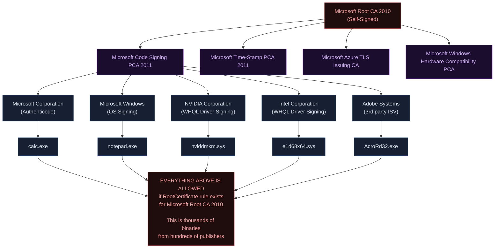
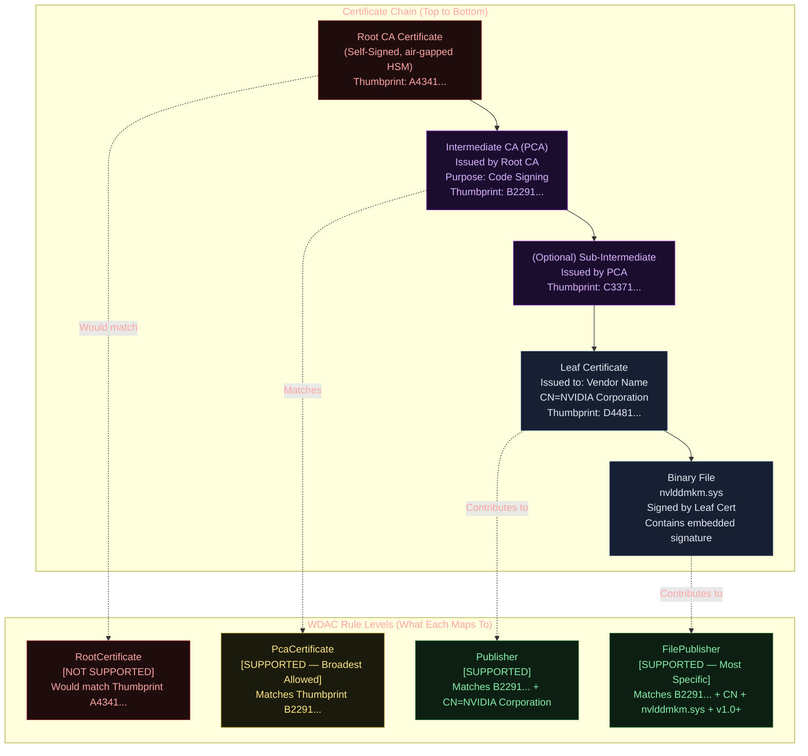
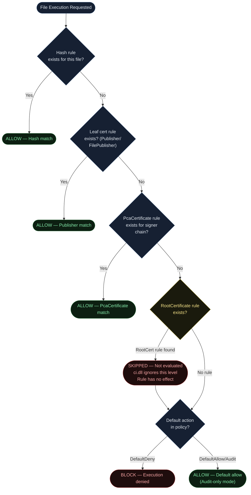
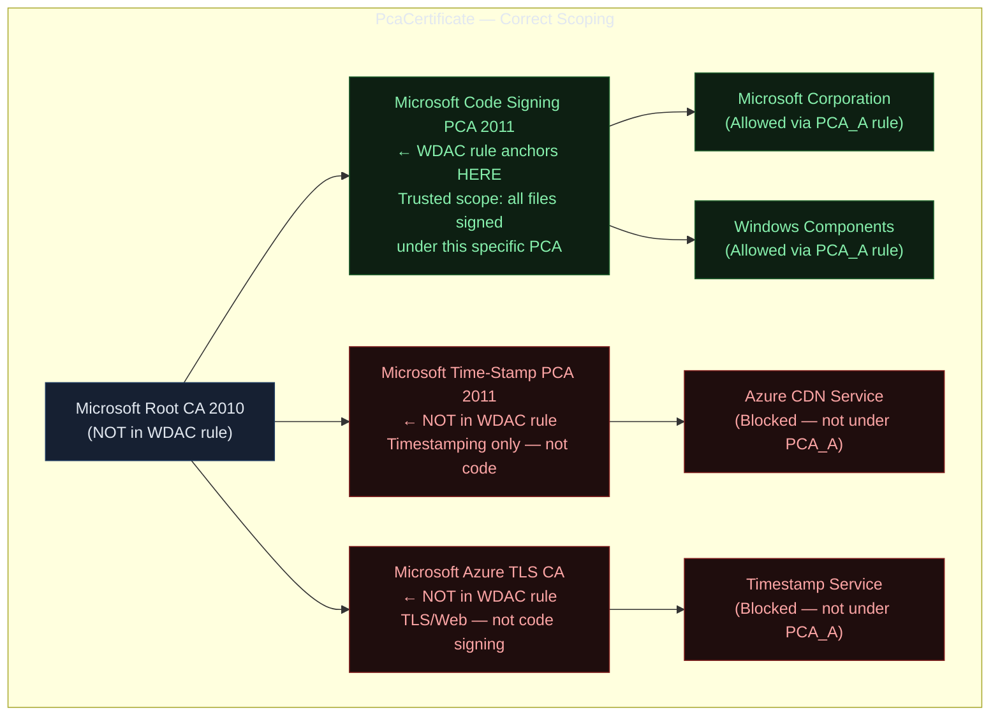
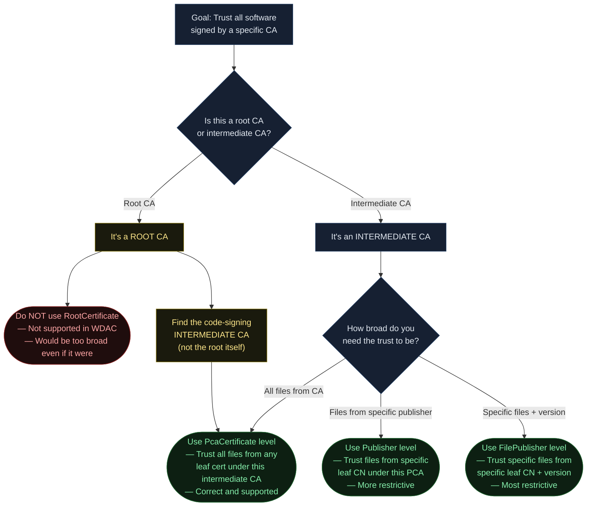
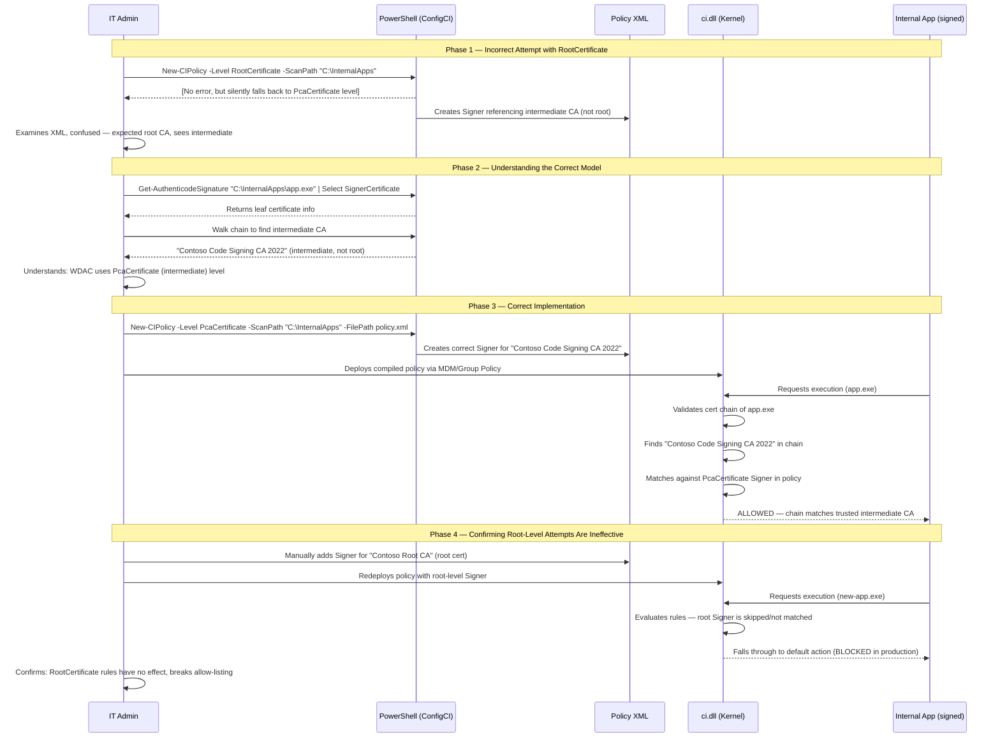

<!-- Author: Anubhav Gain | Category: WDAC File Rule Levels | Topic: RootCertificate -->

# WDAC File Rule Level: RootCertificate

> **CRITICAL:** The `RootCertificate` level is **NOT SUPPORTED** in App Control for Business (WDAC). This document explains why, what happens if you try to use it, and what you should use instead.

---

## Table of Contents

1. [Overview](#1-overview)
2. [Why RootCertificate Is Not Supported](#2-why-rootcertificate-is-not-supported)
3. [The Trust Surface Explosion Problem](#3-the-trust-surface-explosion-problem)
4. [Certificate Chain Anatomy](#4-certificate-chain-anatomy)
5. [Where in the Evaluation Stack](#5-where-in-the-evaluation-stack)
6. [What Happens If You Try It](#6-what-happens-if-you-try-it)
7. [XML Representation (Attempted vs. Correct)](#7-xml-representation-attempted-vs-correct)
8. [PowerShell Examples](#8-powershell-examples)
9. [The Correct Alternative: PcaCertificate](#9-the-correct-alternative-pcacertificate)
10. [Pros & Cons Table](#10-pros--cons-table)
11. [Attack Resistance Analysis](#11-attack-resistance-analysis)
12. [When to Use vs. When to Avoid — Decision Flowchart](#12-when-to-use-vs-when-to-avoid--decision-flowchart)
13. [Real-World Scenario: End-to-End Sequence](#13-real-world-scenario-end-to-end-sequence)
14. [OS Version & Compatibility](#14-os-version--compatibility)
15. [Common Mistakes & Gotchas](#15-common-mistakes--gotchas)
16. [Historical Context](#16-historical-context)
17. [Summary Table](#17-summary-table)

---

## 1. Overview

App Control for Business (the successor to Windows Defender Application Control, still internally called WDAC) uses a tiered system of **file rule levels** to determine how broadly or narrowly a policy trusts signed binaries. These levels range from highly specific (`Hash`) to broadly generalized certificate-based trust.

`RootCertificate` sits conceptually at the very top of the certificate trust chain — it represents the self-signed root CA that anchors an entire PKI hierarchy. In most PKI models, trusting the root means trusting every single certificate ever issued under it, including intermediate CAs and every leaf certificate they sign.

**This is precisely why `RootCertificate` is explicitly excluded from WDAC's supported rule levels.**

The supported rule levels in App Control for Business, from broadest to most specific, are:

| Level | Description |
|---|---|
| PCACertificate | Intermediate (PCA) CA cert — the level just below root |
| Publisher | Leaf cert CN + PCA combined |
| FilePublisher | Publisher + file name + minimum version |
| SignedVersion | Publisher + minimum version (no filename) |
| PcaCertificate | Same as PCACertificate (alias) |
| RootCertificate | **NOT SUPPORTED** |
| WHQL | Windows Hardware Quality Lab EKU |
| WHQLPublisher | WHQL EKU + leaf CN |
| WHQLFilePublisher | WHQL EKU + leaf CN + filename + version |
| FileName | File's internal OriginalFileName attribute |
| FilePath | Specific file path on disk |
| Hash | Cryptographic hash of file contents |

Notice that `RootCertificate` appears in the conceptual hierarchy but is marked **NOT SUPPORTED**. If you attempt to generate rules at this level, WDAC tooling will either refuse or fall back silently to a different level.

---

## 2. Why RootCertificate Is Not Supported

### The Core Problem: Catastrophically Broad Trust

A root CA certificate is the trust anchor for an entire certificate hierarchy. A single root CA may have signed dozens or hundreds of intermediate CAs. Each intermediate CA may have issued thousands of leaf certificates. Each leaf certificate may be used to sign hundreds of software binaries.

If WDAC allowed `RootCertificate` as a rule level, a single XML entry saying "trust Microsoft Root Certificate Authority 2010" would implicitly authorize every binary signed by:

- Every Microsoft product team
- Every third-party ISV that received a code-signing certificate from Microsoft's PKI
- Every driver vendor certified by WHQL
- Every OEM that received an Authenticode certificate under the Microsoft hierarchy
- Historical artifacts and legacy software signed years ago

This is equivalent to saying "allow anything that has ever been vouched for by Microsoft, in any context, for any purpose" — which completely defeats the purpose of application whitelisting.

### The Specific Example: Microsoft Root CA

Consider Microsoft's own certificate hierarchy:

```
Microsoft Root Certificate Authority 2010
  └── Microsoft Code Signing PCA 2011
        ├── Microsoft Corporation (leaf — signs Windows binaries)
        ├── Microsoft Windows (leaf — signs OS components)
        └── [hundreds of other leaf certs]
  └── Microsoft Time-Stamp PCA 2011
  └── Microsoft Azure TLS Issuing CA 01-08
  └── [dozens of other intermediate CAs]
```

Trusting the root would allow ALL of these. There is no mechanism to say "trust the root, but only for binaries from this one product team." The granularity simply does not exist at the root level.

### The Contoso Example

Suppose your organization uses an internal CA called "Contoso Root CA" to sign internal software. You want WDAC to allow all Contoso-signed software. A naive approach might be:

> "I'll create a RootCertificate rule for Contoso Root CA."

The problem: "Contoso Root CA" likely signs:
- Internal application A
- Internal application B  
- VPN client certificates
- Email S/MIME certificates
- Web server TLS certificates
- Contractor laptop certificates

Trusting the root allows anyone with any Contoso-issued certificate — including a contractor who received a personal auth certificate — to run arbitrary signed binaries. The correct approach is to trust the specific **intermediate CA** used only for code signing, not the root.

---

## 3. The Trust Surface Explosion Problem



This diagram illustrates why root-level trust is unworkable: a single rule at the root exposes the entire downstream subtree of certificates and files. WDAC's designers explicitly rejected this model.

---

## 4. Certificate Chain Anatomy

Understanding why root-level trust is dangerous requires understanding the full certificate chain and what each level represents in WDAC.



**Key insight:** WDAC deliberately skips the root level and starts at the PCA (intermediate) level as the broadest permitted trust anchor. This forces policy authors to make a conscious decision about which intermediate CA they trust, rather than blindly inheriting everything from a root.

---

## 5. Where in the Evaluation Stack

When WDAC evaluates a file, `ci.dll` (the Code Integrity kernel component) walks through the policy rules in a specific order. Even if `RootCertificate` were supported, understanding where it would fall helps clarify why it is rejected.



The evaluation engine simply does not have a code path that validates `RootCertificate` rules. If such a rule were somehow injected into a compiled policy binary, the kernel-mode Code Integrity (CI) component would either fail to parse it or silently skip it during rule evaluation. The file would then fall through to the default action.

---

## 6. What Happens If You Try It

### Attempting with PowerShell

If you run:

```powershell
New-CIPolicy -ScanPath "C:\Windows\System32" -Level RootCertificate -FilePath ".\test-policy.xml"
```

The WDAC tooling (ConfigCI module) will silently **fall back to PcaCertificate** and generate rules at that level instead. The output XML will contain `<Signer>` elements referencing the intermediate CA, not the root. There is no error message. The tooling simply treats `RootCertificate` as an invalid level and promotes the rules to the nearest supported level.

### Attempting with Direct XML Authoring

If you manually craft XML with a `<Signer>` element that references a root certificate's thumbprint and add it to a WDAC policy, the following occurs:

1. The policy compiles (no compile-time error)
2. When deployed, `ci.dll` evaluates the rule
3. The rule does **not** match files, because the matching algorithm for signer rules compares against intermediate CA certificates, not root certificates
4. The binary fails to match the malformed rule
5. The binary falls through to the default action (typically deny in production policies)
6. The file is blocked — the opposite of what was intended

**This is a dangerous silent failure mode.** Policy authors who craft such rules will believe they have allowed a set of files, but those files will actually be blocked. This can cause system instability or application failures.

---

## 7. XML Representation (Attempted vs. Correct)

### Incorrect Approach (Root Level — Do NOT Use)

```xml
<!-- INCORRECT: This rule references the root CA thumbprint -->
<!-- WDAC will NOT correctly evaluate this rule -->
<Signer ID="ID_SIGNER_ROOT_EXAMPLE" Name="Microsoft Root Certificate Authority 2010">
  <!-- Root CA Thumbprint — WDAC does not match at this level -->
  <CertRoot Type="TBS" Value="D8C5388AB7301B1BB6A09FE8097E4DE9C1A3C1E7..." />
  <!-- This rule will be silently ignored or cause unexpected blocks -->
</Signer>
```

### Correct Approach (PCA Level — Use This)

```xml
<!-- CORRECT: This rule references the intermediate (PCA) CA thumbprint -->
<!-- WDAC evaluates this correctly -->
<Signer ID="ID_SIGNER_MSFT_PCA" Name="Microsoft Code Signing PCA 2011">
  <!-- Intermediate CA Thumbprint — WDAC matches correctly at this level -->
  <CertRoot Type="TBS" Value="F252E794FE438E35ACE6E53762C0A234A2C52135" />
</Signer>

<!-- Then reference it in signing scenarios -->
<ProductSigners>
  <AllowedSigner SignerID="ID_SIGNER_MSFT_PCA" />
</ProductSigners>
```

### The TBS (To-Be-Signed) Hash

WDAC uses the **TBS (To-Be-Signed) hash** of the certificate, not the full certificate thumbprint. The TBS hash covers the subject, public key, validity period, and extensions — the actual content that was signed by the issuing CA — but excludes the issuing CA's signature itself. This makes it stable across certificate renewals that preserve the same key and subject.

To compute the TBS hash for a certificate:

```powershell
# Get the TBS hash of a certificate from a signed file
$cert = (Get-AuthenticodeSignature "C:\Windows\System32\ntoskrnl.exe").SignerCertificate

# Walk the chain to find the intermediate CA
$chain = New-Object System.Security.Cryptography.X509Certificates.X509Chain
$chain.Build($cert) | Out-Null
$intermediateCert = $chain.ChainElements[1].Certificate  # Index 1 = intermediate, 0 = leaf, 2 = root

# Display the TBS hash (used in WDAC XML)
$intermediateCert.GetRawCertData() | ForEach-Object { [System.BitConverter]::ToString($_).Replace("-","") }
```

---

## 8. PowerShell Examples

### Scanning and Generating Rules (Correct Level)

```powershell
# Generate a policy using PcaCertificate level (the correct alternative to RootCertificate)
# This creates Signer rules for intermediate CAs — not root CAs
New-CIPolicy `
    -ScanPath "C:\Program Files\MyApp\" `
    -Level PcaCertificate `
    -Fallback Hash `
    -FilePath "C:\Policies\MyApp-PCA-Policy.xml" `
    -UserPEs

# Output: Signer elements referencing intermediate CA certs, Hash rules for unsigned files
```

```powershell
# What happens if you accidentally specify RootCertificate:
New-CIPolicy `
    -ScanPath "C:\Program Files\MyApp\" `
    -Level RootCertificate `       # <-- Unsupported
    -Fallback Hash `
    -FilePath "C:\Policies\test.xml"

# Result: WDAC tooling silently promotes to PcaCertificate level
# The output XML will contain intermediate CA signers, not root CA signers
# No error is raised — this is a silent behavior change
```

### Inspecting the Certificate Chain of a Signed File

```powershell
function Get-WDACSignerInfo {
    param([string]$FilePath)
    
    $sig = Get-AuthenticodeSignature -FilePath $FilePath
    if ($sig.Status -ne "Valid") {
        Write-Warning "File is not validly signed: $FilePath"
        return
    }
    
    $chain = New-Object System.Security.Cryptography.X509Certificates.X509Chain
    $chain.Build($sig.SignerCertificate) | Out-Null
    
    $elements = $chain.ChainElements
    Write-Host "Chain for: $FilePath" -ForegroundColor Cyan
    Write-Host ""
    
    for ($i = $elements.Count - 1; $i -ge 0; $i--) {
        $cert = $elements[$i].Certificate
        $level = switch ($i) {
            { $_ -eq ($elements.Count - 1) } { "ROOT (Not used in WDAC rules)" }
            0                                 { "LEAF (Used in Publisher/FilePublisher)" }
            default                           { "INTERMEDIATE/PCA (Used in PcaCertificate rules)" }
        }
        Write-Host "[$level]" -ForegroundColor $(if ($i -eq ($elements.Count - 1)) { "Red" } elseif ($i -eq 0) { "Green" } else { "Yellow" })
        Write-Host "  Subject: $($cert.Subject)"
        Write-Host "  Thumbprint: $($cert.Thumbprint)"
        Write-Host ""
    }
}

# Example usage:
Get-WDACSignerInfo -FilePath "C:\Windows\System32\ntoskrnl.exe"
```

### Verifying That a Policy Has No Root-Level Rules

```powershell
function Test-WDACPolicyForRootRules {
    param([string]$PolicyXmlPath)
    
    [xml]$policy = Get-Content -Path $PolicyXmlPath
    $ns = @{ si = "urn:schemas-microsoft-com:sipolicy" }
    
    $signers = $policy.SelectNodes("//si:Signer", 
        ([System.Xml.XmlNamespaceManager]::new([xml]$policy | Select-Object -ExpandProperty NameTable)))
    
    # Root CA certs are typically self-signed (Subject == Issuer)
    # In practice, check if any signer thumbprint matches known root CA thumbprints
    # This is a heuristic — proper validation requires checking the actual cert
    Write-Host "Policy: $PolicyXmlPath"
    Write-Host "Signer count: $($signers.Count)"
    Write-Host ""
    Write-Host "Note: WDAC does not support RootCertificate level rules." -ForegroundColor Yellow
    Write-Host "All signers in this policy should reference intermediate CA (PCA) certificates." -ForegroundColor Yellow
    Write-Host "If any signer references a self-signed root CA, it will be silently ignored." -ForegroundColor Red
}
```

---

## 9. The Correct Alternative: PcaCertificate

The `PcaCertificate` level trusts binaries whose certificate chain contains a specific **intermediate CA (PCA)** certificate. This is:

- Broad enough to cover all software signed by a CA's leaf certs
- Specific enough to exclude unrelated certificate hierarchies
- The exact security boundary that WDAC's designers intended



### When to Choose Which PCA

| Scenario | Correct PCA to Trust |
|---|---|
| Allow all Windows OS binaries | Microsoft Windows PCA 2011 |
| Allow all Microsoft signed applications | Microsoft Code Signing PCA 2011 |
| Allow WHQL-certified drivers | Use WHQL level instead (EKU-based) |
| Allow internal Contoso apps | Contoso Code Signing Intermediate CA |
| Allow specific vendor software | Vendor's code-signing intermediate CA |

The key principle: identify the **specific intermediate CA** used for code signing — not the root — and trust that. This limits scope to software that specifically went through that CA's issuance process.

---

## 10. Pros & Cons Table

> Note: Since `RootCertificate` is not supported, this table compares the *conceptual* RootCertificate level against the recommended `PcaCertificate` level.

| Attribute | RootCertificate (Conceptual) | PcaCertificate (Recommended) |
|---|---|---|
| **Supported in WDAC** | No — not supported | Yes — fully supported |
| **Trust scope** | Entire PKI tree from root down | Only subtree under specific intermediate CA |
| **Security risk** | Catastrophically broad | Manageable — bounded by CA purpose |
| **Maintenance burden** | Low (set once, forget) | Low (intermediate CAs rarely change) |
| **False positive risk** | Extreme — allows unrelated certs | Low — focused on code-signing CA |
| **Attack surface** | Any cert from the root hierarchy | Only certs from the specific intermediate |
| **WDAC tooling support** | None — silently falls back to PCA | Full support in ConfigCI PowerShell |
| **XML authoring** | Broken — ci.dll ignores it | Correct — matches expected Signer format |
| **Practical equivalent** | n/a | The correct choice for broad CA trust |

---

## 11. Attack Resistance Analysis

```mermaid
graph TD
    subgraph "Attack Scenario A: Compromised Intermediate CA"
        ATK_A["Attacker obtains leaf cert\nfrom a DIFFERENT intermediate CA\nunder the same root"]:::block
        CHECK_A{"Is the leaf cert under\nthe trusted PcaCertificate?"}:::node
        BLOCK_A(["BLOCKED — Different PCA\nPcaCertificate rule does not match"]):::block
        
        ATK_A --> CHECK_A
        CHECK_A -->|"No (different PCA)"| BLOCK_A
    end

    subgraph "Attack Scenario B: Stolen Leaf Certificate"
        ATK_B["Attacker steals a valid leaf cert\nfrom under the trusted PCA"]:::warn
        CHECK_B{"Leaf cert under\ntrusted PCA?"}:::node
        PASS_B(["ALLOWED — PcaCertificate matches\nThis is expected behavior\nMitigate with Publisher/FilePublisher levels"]):::warn
        
        ATK_B --> CHECK_B
        CHECK_B -->|"Yes"| PASS_B
    end

    subgraph "If RootCertificate Were Supported (Hypothetical)"
        ATK_C["Attacker gets ANY cert from\nany intermediate under the root"]:::block
        CHECK_C{"ANY cert under root?"}:::node
        ALLOW_C(["ALLOWED — Root rule matches\nNo way to limit to specific CA branch"]):::block
        
        ATK_C --> CHECK_C
        CHECK_C -->|"Yes (any)"| ALLOW_C
    end

    classDef node fill:#162032,stroke:#1e3a5f,color:#e2e8f0
    classDef allow fill:#0d1f12,stroke:#1a5c2a,color:#86efac
    classDef block fill:#1f0d0d,stroke:#7f1d1d,color:#fca5a5
    classDef warn fill:#1a1a0d,stroke:#7a6a00,color:#fde68a
```



**Key security insight:** Even `PcaCertificate` is vulnerable to stolen leaf certs from under the trusted intermediate. This is why, for high-security environments, `Publisher` or `FilePublisher` levels (which also check the leaf cert's CN) are preferred. `RootCertificate` would be strictly worse than all alternatives.

---

## 12. When to Use vs. When to Avoid — Decision Flowchart



---

## 13. Real-World Scenario: End-to-End Sequence

**Scenario:** An IT admin at Contoso wants to create a WDAC policy that allows all software signed by the company's internal code-signing infrastructure. They initially try `RootCertificate` and discover why it fails, then implement the correct approach.



---

## 14. OS Version & Compatibility

| OS Version | PcaCertificate Support | RootCertificate Support |
|---|---|---|
| Windows 10 1903+ | Full support | Not supported |
| Windows 10 1709–1809 | Full support | Not supported |
| Windows 11 21H2+ | Full support | Not supported |
| Windows Server 2019+ | Full support | Not supported |
| Windows Server 2022 | Full support | Not supported |
| Windows Server 2025 | Full support | Not supported |

`RootCertificate` has never been supported in any version of WDAC or its predecessor (Device Guard / Code Integrity Policies). This is a design decision, not a version limitation.

---

## 15. Common Mistakes & Gotchas

### Mistake 1: Assuming RootCertificate Will Work Like Other Levels

**Wrong assumption:** "I'll add a RootCertificate rule for our enterprise root CA and all our signed software will be allowed."

**Reality:** The rule is silently ignored. Software falls through to the default action, which in enforced mode means a block. This causes unexpected application failures that appear unrelated to WDAC.

**Fix:** Use `PcaCertificate` for the code-signing intermediate CA.

### Mistake 2: Confusing the TBS Hash of Root vs. Intermediate

**Wrong approach:** Extracting the thumbprint of the root CA and putting it in a `<CertRoot Type="TBS">` element in a Signer rule.

**Reality:** WDAC Signer rules match against **intermediate CA** TBS hashes. Providing the root CA's TBS hash will not match any file in the chain walk.

**Fix:** Walk the certificate chain and extract the TBS hash of the **first intermediate CA** (index 1 in the chain, not index 2 which is the root).

### Mistake 3: Trying to Use RootCertificate to "Trust Everything" from a Vendor

**Wrong approach:** Adding a root CA rule to create a blanket "trust this vendor" policy entry.

**Reality:** Even if it worked, it would trust far more than the vendor's software — it would trust every certificate ever issued by that root's entire PKI tree.

**Fix:** Identify the specific intermediate CA the vendor uses for code signing. Create a `PcaCertificate` rule for that specific intermediate. If you need further scoping, use `Publisher` (adds leaf CN) or `FilePublisher` (adds filename and version).

### Mistake 4: No Error Message from WDAC Tooling

The most dangerous aspect of attempting `RootCertificate` is the **complete absence of error messages**. PowerShell's `New-CIPolicy` silently falls back. Direct XML authoring silently fails at runtime. Policy compilation succeeds. Only application failures reveal the problem, often in production.

**Mitigation:** Always review generated policy XML and verify that `<Signer>` elements reference intermediate CA (PCA) certificates, not root CA certificates. You can verify by cross-referencing the TBS hash against known root CA thumbprints.

### Mistake 5: Believing RootCertificate Exists in WDAC Documentation

Some older community blog posts and third-party documentation list `RootCertificate` as a valid level. This is incorrect for App Control for Business. The official Microsoft documentation explicitly lists the supported levels, and `RootCertificate` is not among them.

---

## 16. Historical Context

### Why Was RootCertificate Explicitly Excluded?

When Microsoft designed Windows Defender Application Control (the predecessor to App Control for Business, first shipped in Windows 10 1607 as part of Device Guard), the engineering team considered the full spectrum of certificate-based trust levels.

The inclusion of a `RootCertificate` level was considered and explicitly rejected for the following reasons:

1. **Precedent from AppLocker:** AppLocker, the predecessor policy system, had demonstrated that overly broad certificate trust led to policy bypasses. Administrators would trust a publisher's root CA, and attackers would obtain legitimately-issued certs from that CA for their malware.

2. **Microsoft's own PKI surface:** If Microsoft's own employees used `RootCertificate` to trust Microsoft's root CA for Windows policy deployments, the policy would become essentially useless — it would allow any Microsoft-signed binary, including many that should not be present in a restricted environment.

3. **The PCA layer as the natural trust boundary:** Microsoft's PKI architecture already had a natural boundary at the PCA (Policy/Program Certificate Authority) level. Different PCAs are used for different purposes (OS signing, Authenticode, Azure, timestamping). Trusting at the PCA level allows meaningful segmentation of trust.

4. **Defense in depth:** WDAC is designed as a defense-in-depth control. Making the broadest allowed level still meaningfully restrictive (PcaCertificate rather than RootCertificate) ensures that even broadly-scoped policies provide real security value.

The decision was never revisited because it proved correct: PcaCertificate-level rules provide sufficient coverage for virtually all real-world use cases while maintaining meaningful security boundaries.

---

## 17. Summary Table

| Property | Value |
|---|---|
| **Level Name** | RootCertificate |
| **Supported in WDAC** | **NO — Not Supported** |
| **Why Not Supported** | Trusts entire PKI subtree — catastrophically broad |
| **What ci.dll Does** | Ignores the rule / does not evaluate it |
| **PowerShell Behavior** | Silently falls back to PcaCertificate |
| **XML Authoring Behavior** | Compiles but fails to match at runtime |
| **Correct Alternative** | PcaCertificate (broadest supported level) |
| **Security Risk** | Would be the highest risk level if supported |
| **Use Case** | None — never use this level |
| **Decision Rule** | If you want root-level trust → find the intermediate CA → use PcaCertificate |
| **OS Versions** | Never supported on any Windows version |
| **Kernel Component** | ci.dll (Code Integrity) |
| **Related Levels** | PcaCertificate, Publisher, FilePublisher |
| **Documentation** | Microsoft WDAC File Rule Levels reference (intermediate CA section) |
