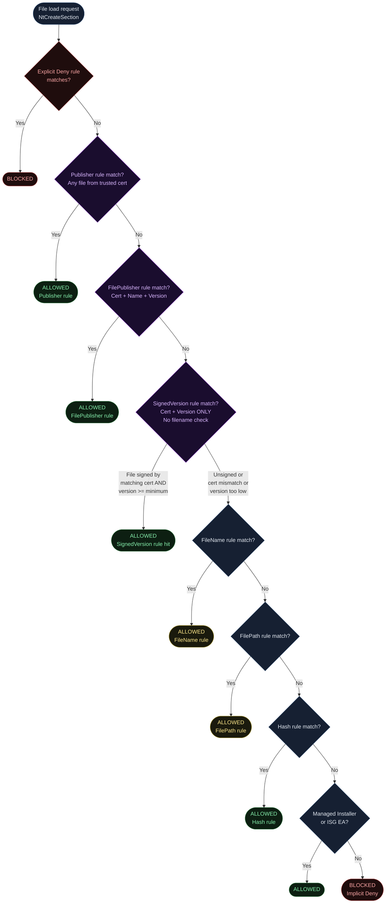
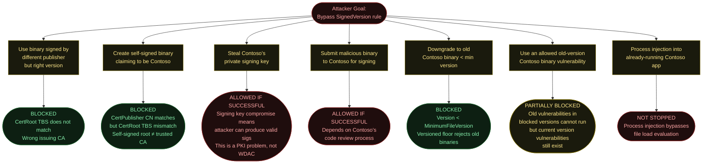
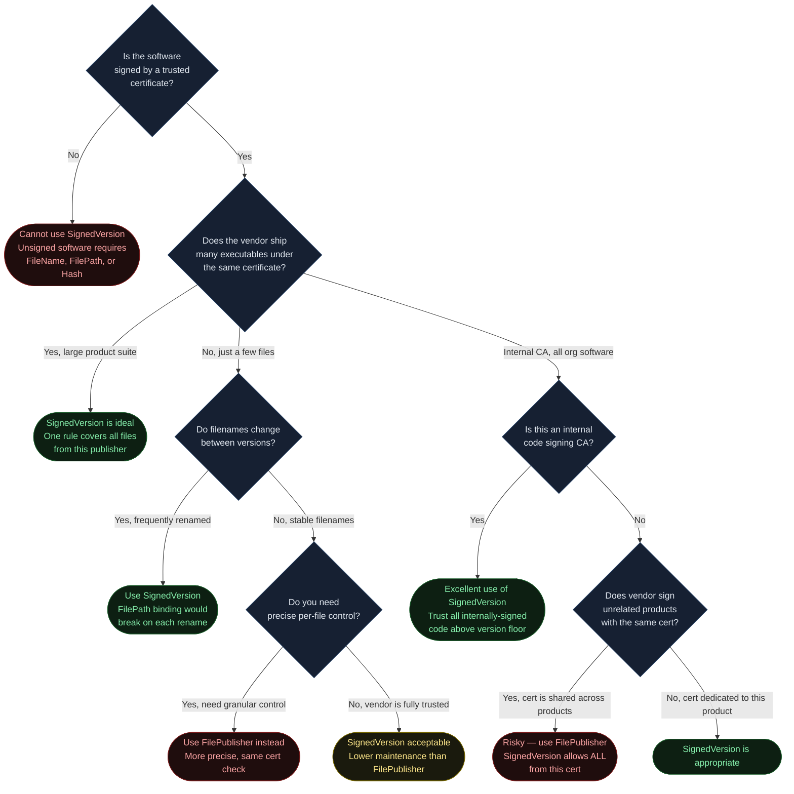
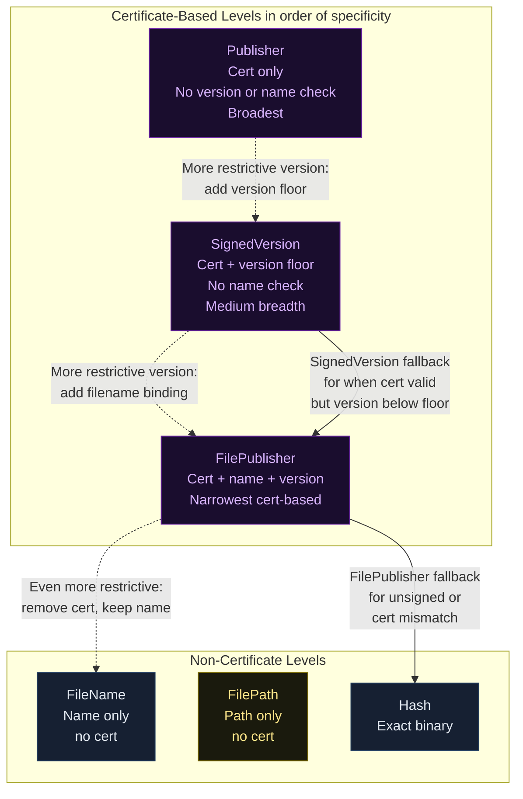
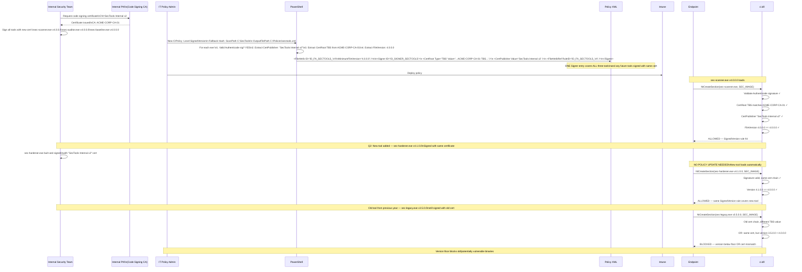

<!-- Author: Anubhav Gain | Category: WDAC File Rule Levels | Topic: SignedVersion -->

# WDAC File Rule Level: SignedVersion

## Table of Contents

1. [Overview](#overview)
2. [How It Works](#how-it-works)
3. [Where in the Evaluation Stack](#where-in-the-evaluation-stack)
4. [XML Representation](#xml-representation)
5. [PowerShell Usage](#powershell-usage)
6. [Pros and Cons](#pros-and-cons)
7. [Attack Resistance Analysis](#attack-resistance-analysis)
8. [When to Use vs When to Avoid](#when-to-use-vs-when-to-avoid)
9. [Interaction with Other Levels](#interaction-with-other-levels)
10. [Real-World Scenario](#real-world-scenario)
11. [OS Version and Compatibility Notes](#os-version-and-compatibility-notes)
12. [Common Mistakes and Gotchas](#common-mistakes-and-gotchas)
13. [Summary Table](#summary-table)

---

## Overview

The **SignedVersion** rule level in WDAC App Control for Business grants execution rights based on two combined criteria: the file must be **signed by a specific publisher** (identified by its certificate chain), and its embedded version number must be **at or above a specified minimum**. There is no filename binding — any file signed by the approved publisher that meets the version requirement will be allowed, regardless of what the file is called or what it does.

In plain English: a SignedVersion rule for publisher "Contoso Ltd" at minimum version `3.0.0.0` means: "I trust everything that Contoso Ltd signs, as long as it is version 3.0 or newer." You do not need to enumerate individual filenames, hashes, or directory paths. If Contoso ships `contoso-app.exe`, `contoso-updater.exe`, `contoso-helper.dll`, and `contoso-driver.sys` — all signed with the same certificate at version 3.x or higher — a single SignedVersion rule covers them all.

This distinguishes SignedVersion from its closest relative, **FilePublisher**. FilePublisher adds a filename constraint on top of the publisher + version check — `"Allow notepad.exe from Microsoft at v10+"`. SignedVersion removes that filename constraint — `"Allow ANYTHING from Microsoft at v10+"`. The trade-off is clear: SignedVersion is more permissive (lower maintenance burden) but potentially allows more than intended if the publisher signs a broad range of software.

SignedVersion is particularly valuable for:
- Vendors who ship entire product suites from a single certificate and you want to allow all of them
- Internal development teams whose certificate is trusted, and any binary they ship at the right version should run
- Situations where the filenames of shipped components change across versions (refactoring, component renaming)

---

## How It Works

### The Two-Part Check

When WDAC evaluates a binary against a SignedVersion rule, two things must be true simultaneously:

1. **Certificate chain validation**: The file must carry a valid Authenticode signature, and the certificate chain (from the leaf signing certificate up through intermediate CAs to the root CA) must match what the policy describes. The policy records the certificate by its TBS (To-Be-Signed) hash — a hash of the certificate's identity fields, not the full certificate. This means the specific certificate instance matters, but certificate renewal (same subject, new validity period) may require policy updates depending on how TBS hashing works with the new cert.

2. **Version floor check**: The file's embedded `FileVersion` or `ProductVersion` (from VERSIONINFO) must be greater than or equal to the `MinimumFileVersion` attribute in the rule. The comparison is a four-component integer comparison, not a string comparison:
   - `Major.Minor.Build.Revision`
   - Each component compared independently, left to right
   - First differing component determines the outcome

### Version Format Deep Dive

```
Version string: "10.0.19041.1"
Components:     [10][0][19041][1]
                 ^   ^   ^     ^
                 |   |   |     Revision (patch level)
                 |   |   Build (can be large numbers)
                 |   Minor
                 Major

Comparison examples:
10.0.0.0 vs 9.9.9.9:   10 > 9 → ALLOWED (major wins)
10.0.0.0 vs 10.1.0.0:  10 == 10, then 0 < 1 → BLOCKED (minor wins)
10.0.19041.0 vs 10.0.18362.0: 10==10, 0==0, 19041 > 18362 → ALLOWED
```

### Publisher Identity: PcaCertificate vs Leaf Certificate

WDAC identifies publishers using a hierarchical certificate specification. The policy records:

- **CertRoot** (`Type="TBS"`, `Value="..."`) — The TBS hash of the issuing CA certificate (the intermediate CA, also called PCA — Primary CA). This is what ties the rule to the specific CA that issued the signing certificate.
- **CertPublisher** (`Value="..."`) — The CN (Common Name) of the leaf signing certificate. This is the `CN=` field in the Subject of the actual code-signing certificate.

Together, these two values uniquely identify a publisher in a way that is resistant to certificate substitution: you cannot simply use any certificate with the same CN — the issuing CA must also match.

### How SignedVersion Differs from FilePublisher in XML

```
FilePublisher rule requires:
  - Signer (PcaCert TBS + leaf CN) → identifies WHO signed it
  - FileAttrib (FileName + MinimumFileVersion) → identifies WHAT was signed
  Both must match simultaneously

SignedVersion rule requires:
  - Signer (PcaCert TBS + leaf CN) → identifies WHO signed it
  - MinimumFileVersion on the Signer itself → version floor only
  No filename constraint — ANY file from this signer at this version passes
```

### Version Source: FileVersion vs ProductVersion

WDAC's version comparison uses the `FileVersion` field from VERSIONINFO, not `ProductVersion`. In most well-maintained software these are the same. However, in some applications:

- `FileVersion` may be the DLL/EXE-specific version
- `ProductVersion` may be the overall product suite version

If a vendor keeps the product at `10.0` but individual DLLs at `10.0.x.y`, the MinimumFileVersion in the rule must be set based on the per-file FileVersion, not the ProductVersion.

```powershell
# Inspect both version fields to understand what WDAC will use
$vi = [System.Diagnostics.FileVersionInfo]::GetVersionInfo("C:\Program Files\App\app.exe")
Write-Host "FileVersion:    $($vi.FileVersion)"
Write-Host "ProductVersion: $($vi.ProductVersion)"
Write-Host "FileVersionRaw: $($vi.FileMajorPart).$($vi.FileMinorPart).$($vi.FileBuildPart).$($vi.FilePrivatePart)"
```

---

## Where in the Evaluation Stack



SignedVersion sits between FilePublisher (which is more specific — requires filename match) and FileName (which requires no signature). It is broader than FilePublisher but narrower than Publisher (which has no version floor).

---

## XML Representation

### Understanding the Dual XML Structure

A SignedVersion rule in WDAC policy requires entries in **two separate sections**:

1. **`<FileRules>`** — Contains a `<FileAttrib>` element that records the `MinimumFileVersion`. This is the version constraint portion.
2. **`<Signers>`** — Contains a `<Signer>` element that describes the certificate (who signed it). The signer references the FileAttrib via a `<FileAttribRef>`.

This two-part structure is shared with FilePublisher rules. The difference is that FilePublisher's `<FileAttrib>` includes both `FileName` and `MinimumFileVersion`, while SignedVersion's `<FileAttrib>` typically has only `MinimumFileVersion` (or the FileName is set to a wildcard pattern).

### FileAttrib for SignedVersion (Version Only)

```xml
<FileRules>
  <!--
    FileAttrib for SignedVersion rule.
    Note: FileName attribute may be omitted or set to a catch-all pattern.
    MinimumFileVersion is the version floor — any version >= this passes.
  -->
  <FileAttrib
    ID="ID_FILEATTRIB_CONTOSO_V3"
    FriendlyName="Contoso Ltd minimum version 3.0.0.0"
    MinimumFileVersion="3.0.0.0" />
</FileRules>
```

### Signer Entry with FileAttribRef

```xml
<Signers>
  <!--
    Signer entry identifying the Contoso Ltd certificate chain.
    CertRoot TBS value = hash of the issuing CA certificate.
    CertPublisher = CN of the leaf code-signing certificate.
    FileAttribRef links this signer to the version constraint above.
  -->
  <Signer ID="ID_SIGNER_CONTOSO_SV" Name="Contoso Ltd SignedVersion">
    <!-- TBS hash of the issuing intermediate CA certificate -->
    <CertRoot Type="TBS" Value="AABBCCDDEEFF00112233445566778899AABBCCDDEEFF001122334455667788" />
    <!-- CN of the leaf code-signing certificate -->
    <CertPublisher Value="Contoso Ltd" />
    <!-- Link to the version floor FileAttrib -->
    <FileAttribRef RuleID="ID_FILEATTRIB_CONTOSO_V3" />
  </Signer>
</Signers>
```

### SigningScenario Wiring

```xml
<SigningScenarios>
  <SigningScenario Value="131" ID="ID_SIGNINGSCENARIO_UMCI" FriendlyName="User Mode">
    <ProductSigners>
      <AllowedSigners>
        <!-- The signer is referenced here for user-mode binaries -->
        <AllowedSigner SignerID="ID_SIGNER_CONTOSO_SV" />
      </AllowedSigners>
    </ProductSigners>
  </SigningScenario>

  <SigningScenario Value="12" ID="ID_SIGNINGSCENARIO_KMCI" FriendlyName="Kernel Mode">
    <ProductSigners>
      <AllowedSigners>
        <!-- If Contoso also ships kernel drivers signed with the same cert -->
        <AllowedSigner SignerID="ID_SIGNER_CONTOSO_SV" />
      </AllowedSigners>
    </ProductSigners>
  </SigningScenario>
</SigningScenarios>
```

### Side-by-Side: SignedVersion vs FilePublisher XML

```xml
<!-- =====================================================
     SIGNED VERSION RULE — covers ALL files from Contoso v3+
     No filename constraint
     ===================================================== -->
<FileRules>
  <FileAttrib ID="ID_FILEATTRIB_CONTOSO_SV"
              FriendlyName="Contoso v3 minimum"
              MinimumFileVersion="3.0.0.0" />
  <!-- No FileName attribute — any filename from this publisher passes -->
</FileRules>
<Signers>
  <Signer ID="ID_SIGNER_CONTOSO_SV" Name="Contoso SignedVersion">
    <CertRoot Type="TBS" Value="AABBCC..." />
    <CertPublisher Value="Contoso Ltd" />
    <FileAttribRef RuleID="ID_FILEATTRIB_CONTOSO_SV" />
  </Signer>
</Signers>

<!-- =====================================================
     FILE PUBLISHER RULE — covers only contoso-app.exe from Contoso v3+
     Filename AND publisher AND version all required
     ===================================================== -->
<FileRules>
  <FileAttrib ID="ID_FILEATTRIB_CONTOSO_FP"
              FriendlyName="Contoso contoso-app.exe v3 minimum"
              FileName="contoso-app.exe"
              MinimumFileVersion="3.0.0.0" />
  <!-- FileName IS present — only this specific filename passes -->
</FileRules>
<Signers>
  <Signer ID="ID_SIGNER_CONTOSO_FP" Name="Contoso FilePublisher">
    <CertRoot Type="TBS" Value="AABBCC..." />
    <CertPublisher Value="Contoso Ltd" />
    <FileAttribRef RuleID="ID_FILEATTRIB_CONTOSO_FP" />
  </Signer>
</Signers>
```

---

## PowerShell Usage

### Generate a SignedVersion Policy

```powershell
# Scan a directory and create SignedVersion rules for signed files
# Files without version info or unsigned files fall back to Hash
New-CIPolicy `
    -Level SignedVersion `
    -Fallback Hash `
    -ScanPath "C:\Program Files\ContosoCorp" `
    -UserPEs `
    -OutputFilePath "C:\Policies\contoso-signedversion.xml"
```

### SignedVersion with Explicit Version Setting

```powershell
# The -Level SignedVersion cmdlet automatically reads the FileVersion
# from each binary and sets MinimumFileVersion to that value.
# To use a different (lower) version floor, you must edit the XML manually
# or merge with a custom rule:

# First, generate the policy
New-CIPolicy `
    -Level SignedVersion `
    -ScanPath "C:\Program Files\ContosoCorp" `
    -UserPEs `
    -OutputFilePath "C:\Policies\contoso-sv.xml"

# Then, lower the version floor in the FileAttrib elements if desired
# (Must be done via XML manipulation — no PowerShell cmdlet parameter for this)
[xml]$policy = Get-Content "C:\Policies\contoso-sv.xml"
$ns = "urn:schemas-microsoft-com:sipolicy"
$nsm = New-Object System.Xml.XmlNamespaceManager($policy.NameTable)
$nsm.AddNamespace("si", $ns)

# Find all FileAttrib elements and lower their MinimumFileVersion
$policy.SelectNodes("//si:FileAttrib", $nsm) | ForEach-Object {
    Write-Host "Current: $($_.FriendlyName) = $($_.MinimumFileVersion)"
    # Optionally set to 0.0.0.0 to accept any version from this publisher
    # $_.MinimumFileVersion = "0.0.0.0"
}
$policy.Save("C:\Policies\contoso-sv.xml")
```

### Generate Individual SignedVersion Rules

```powershell
# Create a SignedVersion rule for a single signed file
$rules = New-CIPolicyRule `
    -Level SignedVersion `
    -DriverFilePath "C:\Program Files\ContosoCorp\contoso-app.exe"

# Inspect the generated rules
$rules | Format-List TypeId, FriendlyName, FileName, MinimumFileVersion, CertPublisher

# Merge into an existing policy
Merge-CIPolicy `
    -PolicyPaths "C:\Policies\existing-policy.xml" `
    -OutputFilePath "C:\Policies\merged-policy.xml" `
    -Rules $rules
```

### Verify Signing Certificate Information Before Rule Creation

```powershell
# Inspect the certificate chain that WDAC will use to build the rule
$sig = Get-AuthenticodeSignature "C:\Program Files\ContosoCorp\contoso-app.exe"

if ($sig.Status -eq "Valid") {
    $chain = New-Object System.Security.Cryptography.X509Certificates.X509Chain
    $chain.Build($sig.SignerCertificate) | Out-Null

    Write-Host "Leaf Certificate (CertPublisher value):"
    Write-Host "  Subject: $($sig.SignerCertificate.Subject)"
    Write-Host "  CN: $(($sig.SignerCertificate.Subject -split ',')[0] -replace 'CN=','')"

    Write-Host "`nIssuing CA (CertRoot TBS will be derived from):"
    $issuingCA = $chain.ChainElements[1].Certificate
    Write-Host "  Subject: $($issuingCA.Subject)"
    Write-Host "  Thumbprint: $($issuingCA.Thumbprint)"
} else {
    Write-Warning "File is not validly signed: $($sig.Status)"
}
```

### Comparing Rule Coverage: SignedVersion vs FilePublisher

```powershell
# This script shows how many rules are generated at each level
# to help you choose between SignedVersion and FilePublisher

$path = "C:\Program Files\ContosoCorp"

# Count rules at FilePublisher level
$fpRules = New-CIPolicy -Level FilePublisher -Fallback Hash `
    -ScanPath $path -UserPEs -OutputFilePath "C:\Temp\fp.xml"
$fpXml = [xml](Get-Content "C:\Temp\fp.xml")
$fpCount = ($fpXml.SiPolicy.FileRules.ChildNodes | Measure-Object).Count
Write-Host "FilePublisher rules: $fpCount"

# Count rules at SignedVersion level
$svRules = New-CIPolicy -Level SignedVersion -Fallback Hash `
    -ScanPath $path -UserPEs -OutputFilePath "C:\Temp\sv.xml"
$svXml = [xml](Get-Content "C:\Temp\sv.xml")
$svCount = ($svXml.SiPolicy.FileRules.ChildNodes | Measure-Object).Count
Write-Host "SignedVersion rules: $svCount"

# SignedVersion should produce fewer rules — one FileAttrib per publisher+version
# instead of one FileAttrib per file per publisher+version
```

---

## Pros and Cons

| Attribute | Details |
|---|---|
| **Precision** | Medium — any file from the publisher at/above version floor |
| **Security Strength** | High — requires valid Authenticode signature from a specific CA chain |
| **Update Resilience** | High — new versions from same publisher pass automatically |
| **Signature Required** | Yes — unsigned files cannot pass |
| **Version Floor Enforcement** | Yes — blocks old/vulnerable versions |
| **Filename Binding** | None — any filename from the publisher passes |
| **Maintenance Burden** | Low — set-and-forget unless publisher changes cert |
| **Kernel Driver Support** | Yes — works in KMCI (Scenario 12) |
| **Over-Permission Risk** | Medium — trusts ALL files from a publisher above version floor |
| **Certificate Rotation Risk** | Medium — cert rotation may require policy update |
| **Recommended Use Case** | Whole product suites, internal signing CAs, frequent component additions |
| **vs FilePublisher** | More permissive — broader coverage, less granularity |
| **vs Publisher** | More restrictive — Publisher has no version floor, allows any version |

---

## Attack Resistance Analysis



### Version Floor as a Security Feature

The `MinimumFileVersion` attribute is not just for operational convenience — it serves as a security control. By setting a meaningful version floor, you prevent attackers from dropping known-vulnerable old versions of trusted software and exploiting those vulnerabilities.

For example: if a critical RCE vulnerability was fixed in version `8.0.1.0` of a trusted component, setting `MinimumFileVersion="8.0.1.0"` ensures that even if an attacker obtains a legitimate signed copy of the older vulnerable version, it cannot run.

However, this protection is only as good as your version floor management. If you set all version floors to `0.0.0.0`, you lose this benefit entirely.

---

## When to Use vs When to Avoid



### When SignedVersion is Better than FilePublisher

| Scenario | Prefer SignedVersion | Prefer FilePublisher |
|---|---|---|
| Large product suite (50+ EXEs from one cert) | Yes — one Signer entry covers all | No — 50+ FileAttrib entries needed |
| Components get renamed between versions | Yes — no filename binding | No — each rename breaks the rule |
| Internal PKI signs all internal apps | Yes — trust the CA, allow all versions ≥ floor | Possible but more granular control |
| Vendor signs completely unrelated products with same cert | No — too permissive | Yes — restrict to specific filenames |
| Single-file application | No advantage | Yes — adds extra verification layer |
| Application that adds new modules frequently | Yes — new modules auto-covered | No — each new module needs a rule |

### When SignedVersion is Worse than FilePublisher

The primary risk with SignedVersion: if a vendor uses the same code-signing certificate across multiple product lines, a SignedVersion rule for that certificate allows **everything** that vendor has ever signed above the version floor — including products you did not intend to allow.

Example: Contoso signs both their "Contoso CRM" and "Contoso Developer Tools" with the same EV certificate. A SignedVersion rule for Contoso allows both product lines. If you only intended to allow CRM, use FilePublisher rules scoped to the CRM-specific filenames.

---

## Interaction with Other Levels



### Specificity Hierarchy

```
Most Permissive (broadest coverage):
  Publisher         → Any version, any filename, matching cert
  SignedVersion     → Any filename, matching cert, version >= floor
  FilePublisher     → Specific filename, matching cert, version >= floor
  FileName          → Specific name, no cert check
  FilePath          → Specific path, no cert or content check
  Hash              → Specific binary fingerprint
Least Permissive (most granular):
```

This hierarchy directly maps to the `-Level` fallback chain in PowerShell. When you specify `-Level FilePublisher -Fallback Hash`, PowerShell attempts FilePublisher first for each file. If it cannot (file is unsigned, or no VERSIONINFO), it falls back to Hash. SignedVersion sits between FilePublisher and Publisher in this spectrum.

---

## Real-World Scenario

An enterprise needs to allow their entire internal toolchain — built by the internal security team, signed by the company's internal code-signing CA. New tools are added quarterly and individual tool names change frequently as the toolchain evolves.



This scenario illustrates the primary benefit of SignedVersion for internal toolchains: once you trust the internal CA and set a reasonable version floor, the policy manages itself. New tools added to the signed suite require no policy updates, and old tools below the version floor are automatically blocked.

---

## OS Version and Compatibility Notes

| Windows Version | SignedVersion Rules | Certificate Chain Validation | Notes |
|---|---|---|---|
| Windows 10 1507 | Yes (basic) | Yes | First WDAC version; SignedVersion supported |
| Windows 10 1607 | Yes | Yes | Multiple policy format added |
| Windows 10 1703+ | Yes | Yes | Improved audit mode and tooling |
| Windows 10 1903+ | Yes | Yes | FilePath also available; SignedVersion unchanged |
| Windows 11 21H2+ | Yes | Yes | Full support; improved policy management |
| Windows Server 2016 | Yes | Yes | Full support |
| Windows Server 2019 | Yes | Yes | Full support |
| Windows Server 2022 | Yes | Yes | Full support |
| Windows Server 2025 | Yes | Yes | Full support |

SignedVersion has been available since the first release of WDAC and works uniformly across all supported versions. There are no known version-specific quirks or feature gaps for this rule level.

---

## Common Mistakes and Gotchas

- **Confusing SignedVersion with FilePublisher**: The two rule levels look almost identical in XML — the only difference is whether `<FileAttrib>` contains a `FileName` attribute. Many administrators assume they created FilePublisher rules when they actually have SignedVersion rules, leading to a broader-than-intended allowlist. Always inspect the `<FileAttrib>` elements to verify whether filenames are present.

- **Setting MinimumFileVersion to 0.0.0.0 universally**: While this means "any version from this publisher", it eliminates the security value of the version floor. Attackers could then use known-vulnerable old versions of trusted software as execution primitives. Set a meaningful version floor that represents the oldest acceptable version in your environment.

- **Not accounting for certificate expiration**: Authenticode signatures remain valid for code integrity purposes even after the signing certificate expires (because the signature was timestamped at signing time). However, if the cert expires AND the file was never timestamped, the signature may be considered invalid by Windows. Always ensure that code is signed with timestamping enabled.

- **Certificate renewal creating new TBS hash**: When a publisher renews their code-signing certificate (same subject, new validity period), the TBS hash of the new certificate differs from the old one. This means the `CertRoot` TBS value in your SignedVersion rule will no longer match files signed with the renewed certificate. You must update the policy to add the new certificate's TBS hash. Monitor vendor certificate renewal notices.

- **Trusting a shared certificate**: Many large software vendors (especially Microsoft) use the same intermediate CA certificate across dozens of products. A SignedVersion rule targeting `CN=Microsoft Windows` signed by the standard Microsoft PCA would allow a vast range of Windows components — possibly more than intended. Be specific about the exact publisher CN you are targeting.

- **Version comparison treats each component independently**: The comparison `10.0.19041.1 >= 10.0.18362.0` is true (19041 > 18362 in the Build component). However, `10.0.19041.1 >= 10.1.0.0` is false (10.0 < 10.1 — Minor component wins). Some administrators assume a "build number greater than" comparison — the actual algorithm compares component by component, left to right. Verify your version floors with test cases.

- **Using SignedVersion when FilePublisher is more appropriate**: If a vendor's certificate is shared across two product lines (say, a productivity suite and a developer toolchain), and you only want to allow the productivity suite, SignedVersion will inadvertently allow the developer toolchain. In these cases, use FilePublisher rules scoped to the specific filenames of the productivity suite.

- **Not specifying both user-mode and kernel-mode scenarios**: If the vendor ships both user-mode applications and kernel-mode drivers, you need the Signer entry to appear in both `<SigningScenario Value="131">` and `<SigningScenario Value="12">`. Simply having the Signer defined globally is not sufficient — it must be referenced in the appropriate AllowedSigners list for each scenario.

- **Assuming SignedVersion blocks file modifications**: A SignedVersion rule verifies the signature and version of a file. If an attacker obtains a legitimately signed binary from the vendor (e.g., downloading an old MSI from a vendor's CDN), they can place it on the system and have it execute — provided it meets the version floor. SignedVersion trusts the certificate, not the context in which the binary arrived.

---

## Summary Table

| Attribute | Value |
|---|---|
| **Rule Level Name** | SignedVersion |
| **Primary XML Element** | `<FileAttrib MinimumFileVersion="..."/>` (no FileName) |
| **Secondary XML Element** | `<Signer>` with `<CertRoot>`, `<CertPublisher>`, `<FileAttribRef>` |
| **What is Checked** | Authenticode certificate chain + FileVersion >= MinimumFileVersion |
| **Filename Binding** | None — any filename from the publisher passes |
| **Signature Required** | Yes — unsigned files cannot pass |
| **Version Floor** | Yes — configurable; `0.0.0.0` = any version |
| **Covers Kernel Drivers** | Yes — works in both UMCI and KMCI |
| **Covers User-Mode PEs** | Yes |
| **Maintenance Burden** | Low — new publisher versions auto-pass without policy update |
| **Security Strength** | High — certificate chain + version floor |
| **Over-Permission Risk** | Medium — broader than FilePublisher |
| **vs Publisher** | More restrictive: adds version floor; Publisher has none |
| **vs FilePublisher** | More permissive: no filename constraint; FilePublisher has one |
| **Certificate Rotation Risk** | Medium — cert renewal changes TBS hash; policy update needed |
| **PowerShell Level Name** | `SignedVersion` |
| **Min Windows Version** | Windows 10 1507 / Server 2016 |
| **Best Use Case** | Internal CAs, large product suites, frequently evolving component sets |
