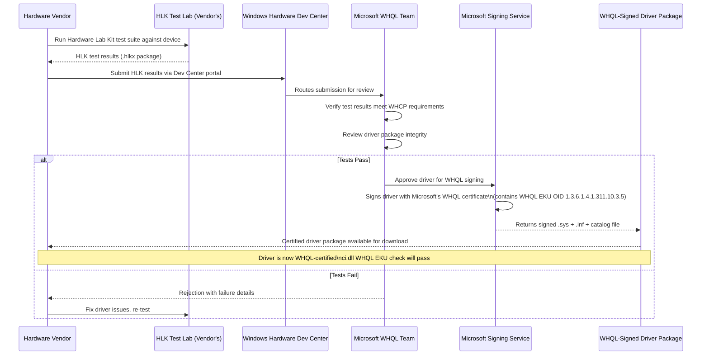
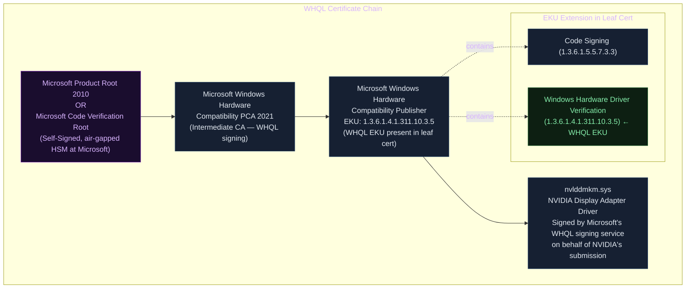
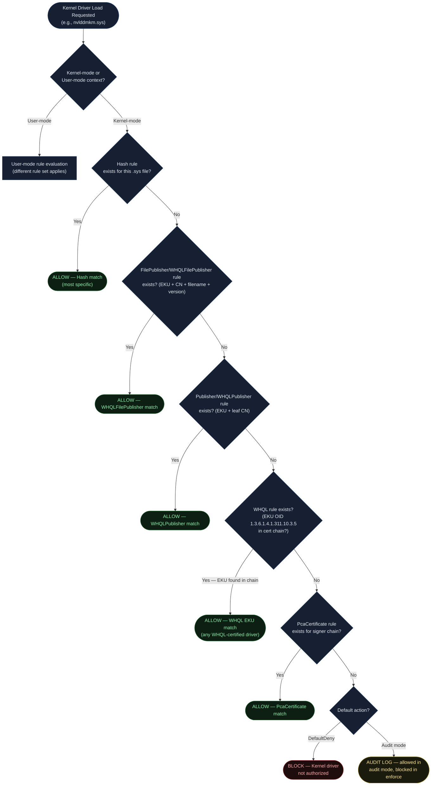
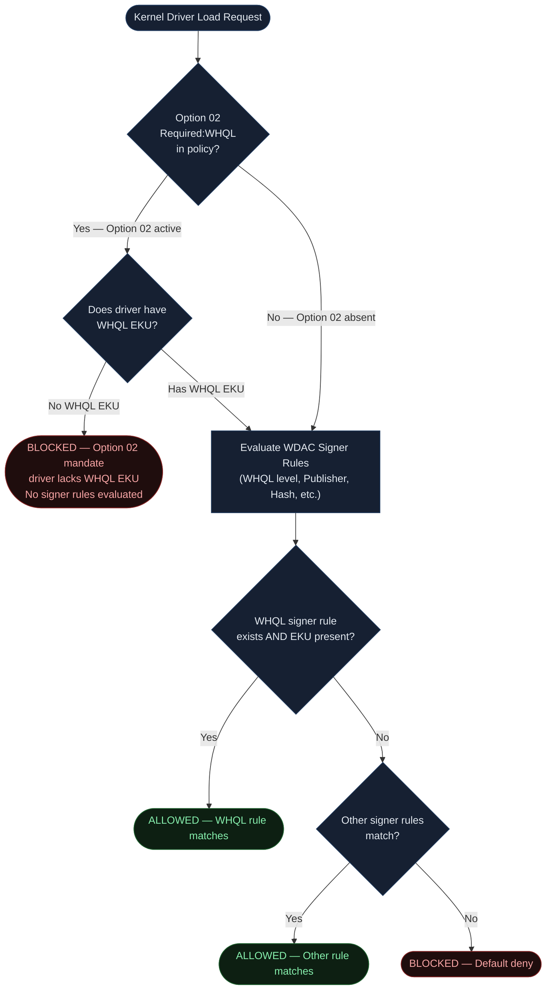
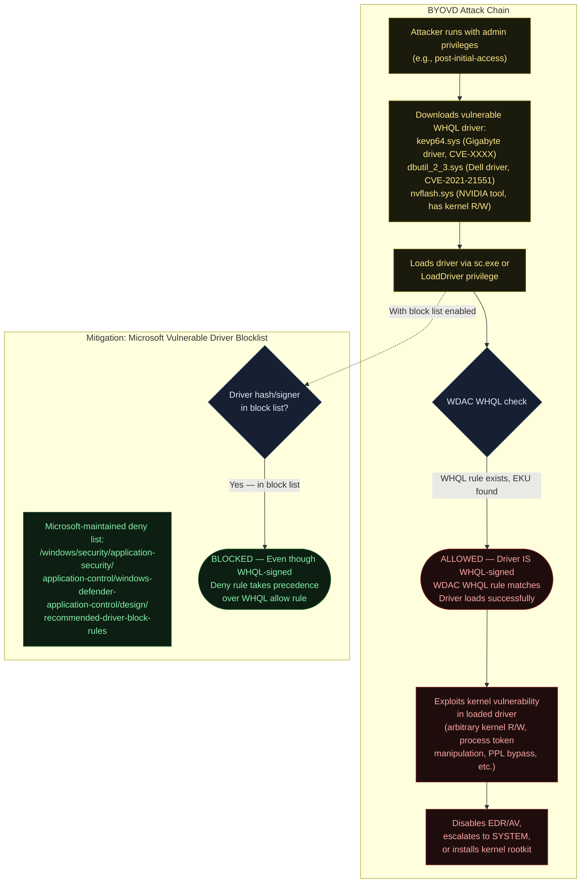
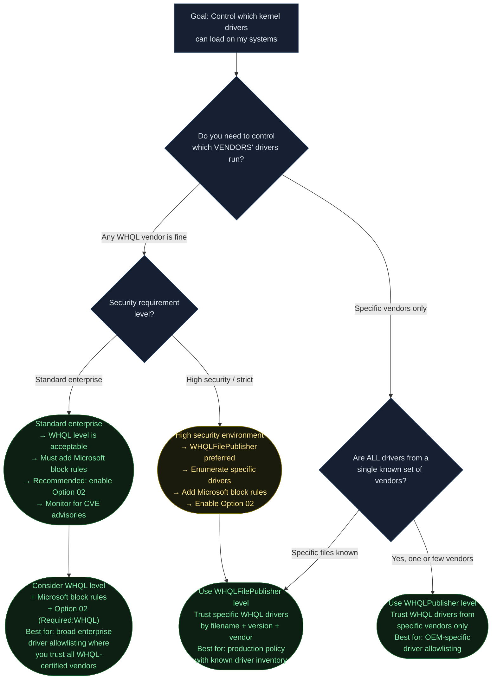
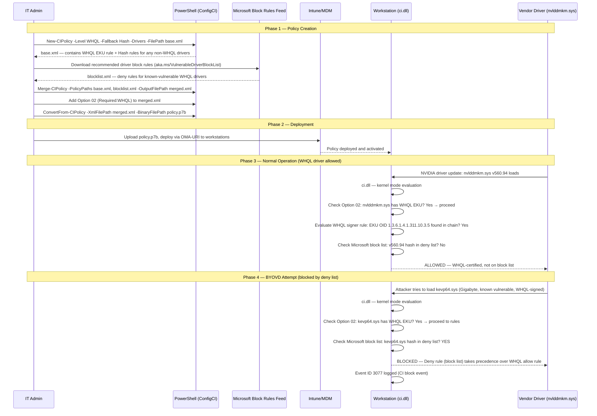

<!-- Author: Anubhav Gain | Category: WDAC File Rule Levels | Topic: WHQL -->

# WDAC File Rule Level: WHQL

> Windows Hardware Quality Lab signing — a Microsoft-operated certification program that tests and cryptographically endorses hardware drivers. The WHQL level in App Control for Business allows files that carry the WHQL Extended Key Usage (EKU) in their signing certificate chain.

---

## Table of Contents

1. [Overview](#1-overview)
2. [What WHQL Is — Background](#2-what-whql-is--background)
3. [The WHQL Certification Process](#3-the-whql-certification-process)
4. [How the WHQL Level Works Technically](#4-how-the-whql-level-works-technically)
5. [The WHQL EKU — OID and Hex Encoding](#5-the-whql-eku--oid-and-hex-encoding)
6. [Certificate Chain / Trust Anatomy](#6-certificate-chain--trust-anatomy)
7. [Where in the Evaluation Stack](#7-where-in-the-evaluation-stack)
8. [XML Representation](#8-xml-representation)
9. [PowerShell Examples](#9-powershell-examples)
10. [WHQL vs. Option 02 (Required:WHQL)](#10-whql-vs-option-02-requiredwhql)
11. [Pros & Cons Table](#11-pros--cons-table)
12. [Attack Resistance Analysis — BYOVD Context](#12-attack-resistance-analysis--byovd-context)
13. [When to Use vs. When to Avoid — Decision Flowchart](#13-when-to-use-vs-when-to-avoid--decision-flowchart)
14. [Real-World Scenario: End-to-End Sequence](#14-real-world-scenario-end-to-end-sequence)
15. [OS Version & Compatibility](#15-os-version--compatibility)
16. [Common Mistakes & Gotchas](#16-common-mistakes--gotchas)
17. [Summary Table](#17-summary-table)

---

## 1. Overview

The `WHQL` file rule level in App Control for Business allows the execution of files whose signing certificate chain contains the **Windows Hardware Quality Lab EKU** (Extended Key Usage). This EKU is placed in certificates issued by Microsoft specifically to drivers and hardware firmware that have passed the Hardware Lab Kit (HLK) test suite and received Microsoft's certification.

Key characteristics of this level:

- **Primarily for kernel-mode binaries:** Drivers (.sys files) and related kernel-mode components are the typical targets. User-mode binaries are rarely WHQL-signed.
- **EKU-based trust:** Unlike most other WDAC levels that key off certificate subject names or thumbprints, WHQL trust is determined by the presence of a specific OID in the certificate's Extended Key Usage extension.
- **Broad by design:** Trusts any driver that Microsoft has certified, regardless of which hardware vendor submitted it.
- **Connected to but distinct from Option 02:** The policy option `Required:WHQL` (Rule Option 02) mandates that all kernel drivers be WHQL-certified; the WHQL rule level is a different concept — it's the trust grant for files that *are* WHQL-signed.

---

## 2. What WHQL Is — Background

### Windows Hardware Quality Lab

The Windows Hardware Quality Lab (WHQL) program, now operationally known as the **Windows Hardware Compatibility Program (WHCP)**, is Microsoft's certification framework for hardware drivers and devices. The program:

1. Defines a test suite (the **Hardware Lab Kit, HLK**) that driver vendors must run against their hardware
2. Requires vendors to submit test results to Microsoft through the **Windows Hardware Dev Center portal**
3. Issues a **WHQL-signed driver package** after verifying the test results meet certification requirements

WHQL signing is distinct from standard Authenticode signing. A regular Authenticode certificate (from DigiCert, Sectigo, etc.) allows a vendor to self-sign their driver with their own identity. WHQL signing means **Microsoft itself cryptographically endorses** the driver using a certificate with the WHQL EKU embedded.

### Why WHQL Matters to WDAC

Before WDAC, the primary kernel-mode trust mechanism was the **kernel-mode code signing policy** introduced in Windows Vista 64-bit (which required all kernel drivers to be signed). WDAC extends this by allowing organizations to specify *which* signed drivers they permit.

The `WHQL` level is the most practical way to allow all properly-certified drivers without enumerating every driver vendor individually. It represents Microsoft's explicit endorsement: "We tested this driver, it met our quality bar, and we signed it with our WHQL certificate."

---

## 3. The WHQL Certification Process



The critical output of this process is a driver package where the `.sys` file (and associated catalog) carries a signature from Microsoft's WHQL signing certificate — a certificate that includes the WHQL EKU OID. This is what WDAC's WHQL level checks for.

---

## 4. How the WHQL Level Works Technically

When `ci.dll` (the kernel's Code Integrity component) evaluates a file against a WDAC policy containing WHQL rules, it performs the following checks:

### Step 1: Is the file kernel-mode?

WHQL rules are evaluated in the **kernel-mode signing scenario**. For user-mode binaries, different rule sets apply. The evaluation context is determined by how the binary is being loaded:
- Kernel drivers loaded via `IoLoadDriver` → kernel-mode scenario
- Executables and DLLs loaded via the process loader → user-mode scenario

### Step 2: Does the certificate chain contain the WHQL EKU?

`ci.dll` walks the certificate chain from the leaf certificate upward. At each level, it checks the Extended Key Usage extension for the presence of OID `1.3.6.1.4.1.311.10.3.5` (Windows Hardware Driver Verification).

The EKU can appear in:
- The **leaf certificate** (most common for WHQL-signed drivers)
- An **intermediate CA certificate** (for enterprise CA hierarchies, less common)

### Step 3: Does the chain root in a trusted WHQL root?

Microsoft uses two root CAs for WHQL signing:
1. **Microsoft Product Root 2010** — for drivers signed after 2010
2. **Microsoft Code Verification Root** — for older drivers signed under the previous root

The chain must root in one of these Microsoft-operated roots. This prevents third-party CAs from issuing "WHQL-like" certificates.

### Step 4: WDAC Policy Rule Match

If a WHQL Signer rule exists in the policy and the above checks pass, the file is allowed. If no WHQL rule exists, the file evaluation continues to other applicable rules.

---

## 5. The WHQL EKU — OID and Hex Encoding

The WHQL EKU has the following OID:

```
OID (dotted decimal): 1.3.6.1.4.1.311.10.3.5
OID meaning:         Microsoft → Products → OIDs → WHQL-related → Windows Hardware Driver Verification
```

In WDAC XML, EKUs are represented as hexadecimal DER-encoded OID values. The encoding process:

1. Start with the OID in dotted decimal: `1.3.6.1.4.1.311.10.3.5`
2. Prepend the ASN.1 OID tag `06` (object identifier)
3. Encode the OID value per BER/DER OID encoding rules
4. Express as uppercase hex

The result:

```
DER-encoded WHQL EKU value: 010A2B0601040182370A0305
```

Breaking down the hex encoding:
- `01` — Length byte (context-dependent in WDAC's encoding format)
- `0A` — Length of the OID content (10 bytes)
- `2B` — Encodes the first two OID components (1.3 → 40×1+3=43=0x2B)
- `06 01 04 01 82 37 0A 03 05` — Remaining OID components encoded per BER rules
  - `06` = 6
  - `01` = 1
  - `04` = 4
  - `01` = 1
  - `82 37` = 311 (multi-byte encoding: 0x82=high byte flag, 0x37=55 → 311)
  - `0A` = 10
  - `03` = 3
  - `05` = 5

In WDAC XML, this appears as:

```xml
<EKU ID="ID_EKU_WHQL" Value="010A2B0601040182370A0305" />
```

---

## 6. Certificate Chain / Trust Anatomy



**Important note on WHQL signing mechanics:** Unlike standard Authenticode where the *vendor* signs their own binary with their *own* private key, WHQL-signed drivers are signed by **Microsoft's private key** (on behalf of the vendor's submission). The vendor submits the driver to Microsoft's portal, and Microsoft signs it. This is why WHQL certs chain to Microsoft roots, not to vendor roots.

---

## 7. Where in the Evaluation Stack



The WHQL level sits **between** `WHQLPublisher`/`WHQLFilePublisher` (more specific) and `PcaCertificate` (broader but different concept). More specific WHQL-based rules are checked first.

---

## 8. XML Representation

A complete WHQL rule in App Control for Business XML consists of two parts:
1. An **EKU element** defining the WHQL OID
2. A **Signer element** referencing that EKU

### Full XML Example

```xml
<?xml version="1.0" encoding="utf-8"?>
<SiPolicy xmlns="urn:schemas-microsoft-com:sipolicy">
  
  <!-- EKU Definitions -->
  <EKUs>
    <!-- Windows Hardware Driver Verification (WHQL) EKU -->
    <!-- OID: 1.3.6.1.4.1.311.10.3.5 -->
    <!-- DER hex encoding: 010A2B0601040182370A0305 -->
    <EKU ID="ID_EKU_WHQL" Value="010A2B0601040182370A0305" />
  </EKUs>

  <!-- Signer Definitions -->
  <Signers>
    <!--
      WHQL Signer: Trusts any file whose cert chain:
      1. Contains the WHQL EKU (defined above)
      2. Chains to Microsoft's WHQL root
      This does NOT restrict to a specific vendor — any WHQL-certified driver matches.
    -->
    <Signer ID="ID_SIGNER_WHQL_KERNEL" Name="Windows Hardware Quality Lab (WHQL) - Kernel Mode">
      <!-- Microsoft Windows Hardware Compatibility PCA (intermediate CA for WHQL) -->
      <!-- TBS hash of the intermediate CA certificate -->
      <CertRoot Type="TBS" Value="3085A90B03EE71B6B33F5EA8A07DBBD40B5B7A89" />
      <!-- Require the WHQL EKU in the chain -->
      <CertEKU ID="ID_EKU_WHQL" />
    </Signer>
  </Signers>

  <!-- Signing Scenarios -->
  <SigningScenarios>
    <!-- Scenario 131 = Kernel Mode Signing -->
    <SigningScenario Value="131" ID="ID_SIGNINGSCENARIO_DRIVERS" FriendlyName="Driver Signing Scenario">
      <ProductSigners>
        <!-- Allow all WHQL-certified kernel drivers -->
        <AllowedSigner SignerID="ID_SIGNER_WHQL_KERNEL" />
      </ProductSigners>
    </SigningScenario>
  </SigningScenarios>

  <!-- Policy Rules -->
  <Rules>
    <Rule>
      <Option>Enabled:Unsigned System Integrity Policy</Option>
    </Rule>
    <!-- Note: NOT including Option 02 (Required:WHQL) here — see Section 10 -->
  </Rules>

</SiPolicy>
```

### Signing Scenario Values

| Value | Scenario | Applies To |
|---|---|---|
| `131` | Kernel Mode | Drivers, kernel components |
| `12` | User Mode | Executables, DLLs |

WHQL rules are almost always placed in the kernel-mode signing scenario (131).

---

## 9. PowerShell Examples

### Generating a WHQL Policy

```powershell
# Generate a policy that allows all WHQL-certified kernel drivers
# New-CIPolicy with Level WHQL creates WHQL EKU-based Signer rules
New-CIPolicy `
    -ScanPath "C:\Windows\System32\drivers\" `
    -Level WHQL `
    -Fallback Hash `       # For any drivers that are NOT WHQL-signed
    -FilePath "C:\Policies\WHQL-Drivers-Policy.xml" `
    -Drivers               # Only scan drivers (kernel mode)

# Output: EKU element for WHQL OID + Signer elements for WHQL intermediate CAs
# Plus Hash rules for any non-WHQL-signed drivers found during scan
```

### Checking If a Driver Is WHQL-Signed

```powershell
function Test-WHQLSigned {
    param([string]$DriverPath)
    
    # The WHQL EKU OID
    $whqlOid = "1.3.6.1.4.1.311.10.3.5"
    
    $sig = Get-AuthenticodeSignature -FilePath $DriverPath
    if ($sig.Status -ne "Valid") {
        Write-Warning "File is not validly signed: $DriverPath"
        return $false
    }
    
    $chain = New-Object System.Security.Cryptography.X509Certificates.X509Chain
    $chain.Build($sig.SignerCertificate) | Out-Null
    
    foreach ($element in $chain.ChainElements) {
        $cert = $element.Certificate
        foreach ($ext in $cert.Extensions) {
            if ($ext -is [System.Security.Cryptography.X509Certificates.X509EnhancedKeyUsageExtension]) {
                foreach ($oid in $ext.EnhancedKeyUsages) {
                    if ($oid.Value -eq $whqlOid) {
                        Write-Host "WHQL-signed: $DriverPath" -ForegroundColor Green
                        Write-Host "  WHQL EKU found in cert: $($cert.Subject)" -ForegroundColor Green
                        return $true
                    }
                }
            }
        }
    }
    
    Write-Host "Not WHQL-signed: $DriverPath" -ForegroundColor Yellow
    return $false
}

# Test a specific driver
Test-WHQLSigned -DriverPath "C:\Windows\System32\drivers\nvlddmkm.sys"
```

### Scanning System32\drivers for WHQL Status

```powershell
# Audit all drivers on the system — identify which are WHQL-signed
$whqlOid = "1.3.6.1.4.1.311.10.3.5"

Get-ChildItem "C:\Windows\System32\drivers\*.sys" | ForEach-Object {
    $driver = $_
    $sig = Get-AuthenticodeSignature -FilePath $driver.FullName -ErrorAction SilentlyContinue
    
    if ($sig -and $sig.Status -eq "Valid") {
        $chain = New-Object System.Security.Cryptography.X509Certificates.X509Chain
        $chain.Build($sig.SignerCertificate) | Out-Null
        
        $isWhql = $false
        foreach ($el in $chain.ChainElements) {
            foreach ($ext in $el.Certificate.Extensions) {
                if ($ext -is [System.Security.Cryptography.X509Certificates.X509EnhancedKeyUsageExtension]) {
                    if ($ext.EnhancedKeyUsages | Where-Object { $_.Value -eq $whqlOid }) {
                        $isWhql = $true
                    }
                }
            }
        }
        
        [PSCustomObject]@{
            Driver    = $driver.Name
            Signer    = $sig.SignerCertificate.Subject -replace "CN=",""
            WHQLSigned = $isWhql
            Status    = $sig.Status
        }
    }
} | Sort-Object WHQLSigned, Driver | Format-Table -AutoSize
```

### Creating a Combined WHQL + Recommended Block Rules Policy

```powershell
# Microsoft-recommended approach: allow WHQL drivers BUT apply the vulnerable driver block rules

# Step 1: Generate base WHQL policy
New-CIPolicy `
    -Level WHQL `
    -Fallback Hash `
    -FilePath "C:\Policies\WHQL-Base.xml" `
    -Drivers

# Step 2: Download Microsoft's recommended block rules (driver blocklist)
# Source: https://aka.ms/VulnerableDriverBlockList
# These block known vulnerable drivers that ARE WHQL-signed but have CVEs
Invoke-WebRequest `
    -Uri "https://aka.ms/VulnerableDriverBlockList" `
    -OutFile "C:\Policies\VulnerableDriverBlockList.xml"

# Step 3: Merge base policy with block rules
Merge-CIPolicy `
    -PolicyPaths "C:\Policies\WHQL-Base.xml", "C:\Policies\VulnerableDriverBlockList.xml" `
    -OutputFilePath "C:\Policies\WHQL-WithBlockList.xml"

# Step 4: Compile to binary
ConvertFrom-CIPolicy `
    -XmlFilePath "C:\Policies\WHQL-WithBlockList.xml" `
    -BinaryFilePath "C:\Policies\WHQL-WithBlockList.p7b"
```

---

## 10. WHQL vs. Option 02 (Required:WHQL)

This is one of the most common sources of confusion regarding WHQL in WDAC. These are two completely different concepts:

| Concept | What It Is | Effect |
|---|---|---|
| **WHQL level** (file rule level) | A trust grant — "allow files that are WHQL-signed" | Files with WHQL EKU are allowed to run |
| **Option 02: Required:WHQL** | A policy mandate — "all kernel drivers MUST be WHQL" | Drivers without WHQL EKU are BLOCKED, regardless of other rules |

### Option 02 Explained

Adding `<Option>Required:WHQL</Option>` to a WDAC policy's `<Rules>` section activates a **global kernel-mode policy** that requires every kernel driver to be WHQL-certified. This is enforced by `ci.dll` before any signer rules are evaluated:

```xml
<Rules>
  <!-- Option 02: ALL kernel drivers must be WHQL-signed -->
  <!-- This blocks even drivers with valid PCA/Publisher rules if they lack WHQL EKU -->
  <Rule>
    <Option>Required:WHQL</Option>
  </Rule>
</Rules>
```

**When you combine both:**



**Practical guidance:**
- Use `WHQL level` when you want to *allow* WHQL-certified drivers as a category
- Use `Option 02` when you want to *mandate* that all drivers must be WHQL (and block non-WHQL drivers even if they have other valid signatures)
- For maximum security, use *both*: Option 02 mandates WHQL, and WHQL level rules allow them

---

## 11. Pros & Cons Table

| Attribute | Assessment |
|---|---|
| **Trust scope** | All WHQL-certified drivers — broad but bounded by Microsoft's certification process |
| **Maintenance burden** | Very low — new WHQL drivers automatically match existing rules |
| **Security validation** | High — Microsoft tested and signed each driver through HLK |
| **False positive risk** | Low for kernel mode; WHQL is specific to hardware drivers |
| **BYOVD vulnerability** | Present — legitimate old WHQL drivers with CVEs still match |
| **Specificity** | Low — cannot distinguish NVIDIA driver from Intel driver at this level |
| **Ease of use** | High — single EKU rule covers all certified drivers |
| **User-mode applicability** | Limited — few user-mode binaries are WHQL-signed |
| **Compatibility** | Excellent — works on all WDAC-capable Windows versions |
| **Kernel stability** | High — WHQL drivers have passed quality testing |

---

## 12. Attack Resistance Analysis — BYOVD Context

### Bring Your Own Vulnerable Driver (BYOVD)

The WHQL level's most significant limitation is its vulnerability to **BYOVD attacks**. In a BYOVD attack, a threat actor loads a legitimately-signed, WHQL-certified driver that contains a known vulnerability (typically a kernel read/write primitive) and exploits it to escalate privileges or disable security software.

**The key insight:** WHQL certification tests whether a driver works correctly for its intended purpose on certified hardware. It does NOT:
- Test for security vulnerabilities in the driver code
- Expire or invalidate a signature when a CVE is discovered
- Prevent old, vulnerable drivers from matching WDAC WHQL rules



### Mitigating BYOVD When Using WHQL Level

The WHQL level should always be combined with Microsoft's **recommended driver block rules** (the vulnerable driver blocklist). This list contains hashes and signer rules for known-vulnerable WHQL-certified drivers. Since deny rules take precedence over allow rules in WDAC, drivers on the block list are blocked even if they would otherwise match the WHQL allow rule.

Key point: **WHQL level alone is insufficient for BYOVD protection.** Always combine with:
1. Microsoft's vulnerable driver block rules (updated regularly)
2. `WHQLFilePublisher` level rules for specific known-good drivers (more restrictive)
3. `Required:WHQL` option (Option 02) to block unsigned kernel drivers

---

## 13. When to Use vs. When to Avoid — Decision Flowchart



---

## 14. Real-World Scenario: End-to-End Sequence

**Scenario:** A manufacturing company deploys WDAC to their workstations. They have various hardware with drivers from Intel, NVIDIA, Realtek, and other vendors. They want to allow all properly-certified drivers without enumerating each vendor.



---

## 15. OS Version & Compatibility

| OS Version | WHQL Level Support | Notes |
|---|---|---|
| Windows 10 1507+ | Full support | WDAC kernel-mode signing scenarios |
| Windows 10 1709+ | Full support + Audit Mode | Separate audit/enforce policy support |
| Windows 11 21H2+ | Full support | Enhanced kernel security, HVCI |
| Windows Server 2016+ | Full support | Server supports WDAC kernel driver control |
| Windows Server 2019+ | Full support | Recommended for server deployments |
| Windows Server 2022+ | Full support | Strong WDAC integration with Secured-Core |
| ARM64 | Full support | WHQL covers ARM64 drivers as well |

**Note on HVCI (Hypervisor-Protected Code Integrity):**
When HVCI (Memory Integrity) is enabled, kernel driver loading is validated by the hypervisor using WDAC policies. WHQL rules work identically in HVCI mode. The additional protection HVCI provides is that even if `ci.dll` were compromised, the hypervisor enforces the policy independently.

---

## 16. Common Mistakes & Gotchas

### Mistake 1: Believing WHQL Means the Driver Is Secure

**Wrong assumption:** "WHQL drivers are Microsoft-approved, so they're safe to run."

**Reality:** WHQL certification tests hardware compatibility and quality, not security. A driver can be WHQL-certified and still contain exploitable vulnerabilities (as demonstrated by dozens of CVEs in WHQL-signed drivers). Always combine WHQL rules with Microsoft's vulnerable driver block list.

### Mistake 2: Forgetting the Fallback

**Wrong approach:** Using WHQL level without a fallback for legacy or internal drivers that are not WHQL-certified.

**Reality:** Many legitimate enterprise drivers (especially legacy hardware or internal development drivers) are not WHQL-signed. Without a fallback (`-Fallback Hash` or `-Fallback Publisher`), these drivers will be blocked.

**Fix:** Always specify `-Fallback Hash` or another appropriate fallback level when generating WHQL policies.

### Mistake 3: Confusing WHQL Level with Option 02

As described in Section 10, these are different. Confusing them leads to policies that either:
- Allow non-WHQL drivers when you intended to block them (forgot Option 02)
- Block valid driver loads that only have PcaCertificate rules (added Option 02 without WHQL allow rules)

### Mistake 4: Not Updating the Block List

**Wrong assumption:** "Once I add the Microsoft block list to my policy, I'm protected forever."

**Reality:** New vulnerable WHQL-signed drivers are discovered regularly. Microsoft updates the block list. Your deployed policy does not auto-update. Schedule regular policy reviews to incorporate updated block rules.

### Mistake 5: Applying WHQL Rules to User-Mode Scenario

WHQL rules are meaningful only in the **kernel-mode signing scenario** (value 131). Adding WHQL EKU rules to user-mode scenario (value 12) rules has no meaningful effect because user-mode binaries are almost never WHQL-signed. If you see WHQL rules in a user-mode policy section, they are likely the result of an overly broad scan and can be removed.

### Mistake 6: The EKU Hex Value Encoding

The WHQL EKU value in WDAC XML (`010A2B0601040182370A0305`) is **not** the raw OID in hex. It is a specific encoding format used by WDAC. Using the wrong encoding (e.g., raw ASN.1 OID bytes without the WDAC-specific prefix) will cause the EKU rule to never match, silently failing to allow WHQL drivers.

Always use the canonical value `010A2B0601040182370A0305` for the WHQL EKU in WDAC XML.

---

## 17. Summary Table

| Property | Value |
|---|---|
| **Level Name** | WHQL |
| **Trust Mechanism** | EKU OID `1.3.6.1.4.1.311.10.3.5` in cert chain |
| **EKU Hex (WDAC XML)** | `010A2B0601040182370A0305` |
| **Primary Use Case** | Kernel-mode driver allowlisting |
| **Trust Scope** | All Microsoft-certified WHQL drivers |
| **Vendor Specificity** | None — any WHQL driver from any vendor matches |
| **BYOVD Risk** | Present — old vulnerable WHQL drivers still match |
| **BYOVD Mitigation** | Microsoft vulnerable driver block rules |
| **Related Option** | Option 02 `Required:WHQL` (mandate, not grant) |
| **More Specific Alternatives** | WHQLPublisher (adds vendor CN), WHQLFilePublisher (adds filename+version) |
| **Signing Scenario** | Kernel mode (131) — rarely user mode (12) |
| **PowerShell Level Name** | `WHQL` |
| **Kernel Component** | ci.dll (Code Integrity) |
| **OS Support** | Windows 10 1507+ / Server 2016+ |
| **HVCI Compatible** | Yes — evaluated by hypervisor in HVCI mode |
| **Block List URL** | `https://aka.ms/VulnerableDriverBlockList` |
