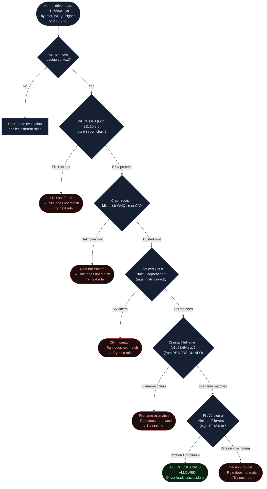
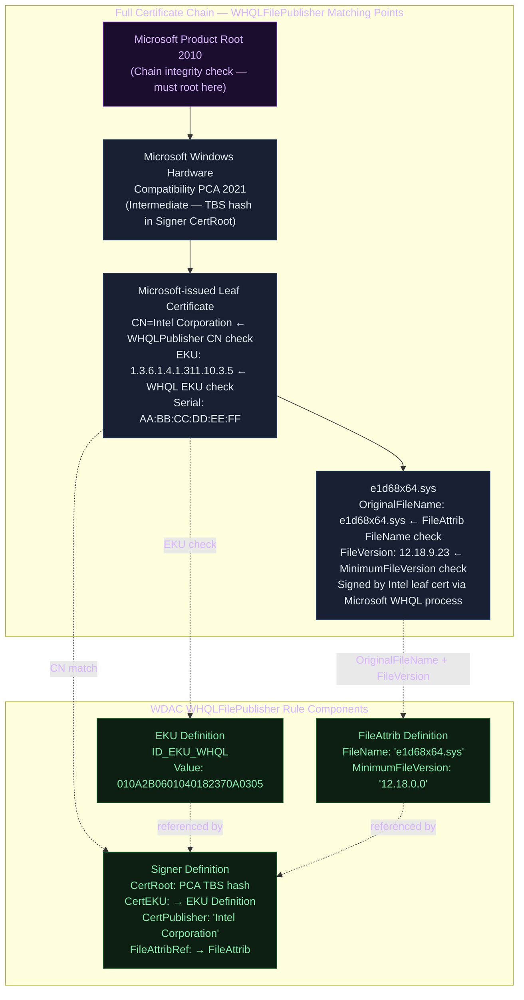
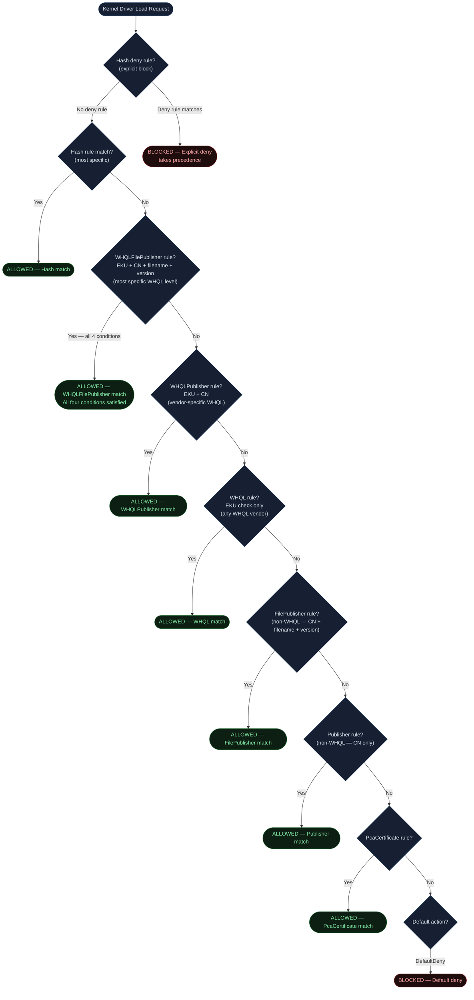
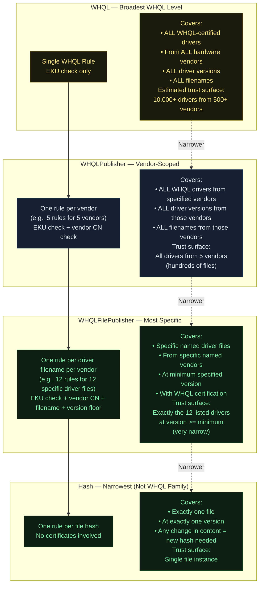
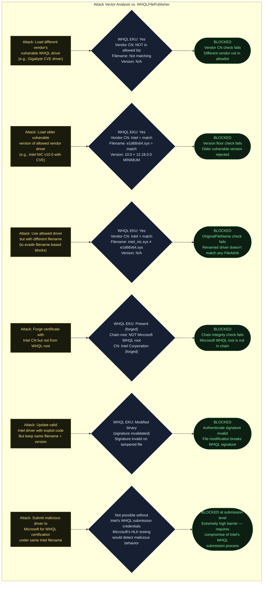
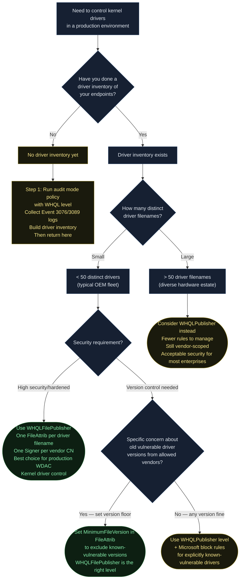
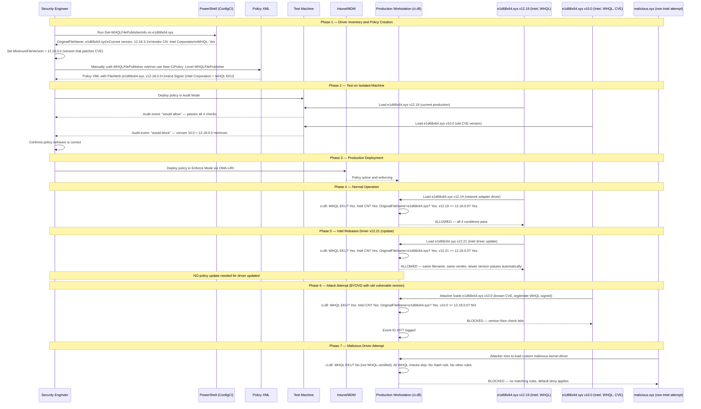

<!-- Author: Anubhav Gain | Category: WDAC File Rule Levels | Topic: WHQLFilePublisher -->

# WDAC File Rule Level: WHQLFilePublisher

> The most specific WHQL-family rule level: combines the WHQL EKU trust check, vendor leaf certificate CN, specific driver filename, and a minimum version floor — granting surgical, version-gated trust for exactly the kernel drivers you have inventoried.

---

## Table of Contents

1. [Overview](#1-overview)
2. [The Triple Binding Concept](#2-the-triple-binding-concept)
3. [How WHQLFilePublisher Works Technically](#3-how-whqlfilepublisher-works-technically)
4. [The WHQLFilePublisher Trust Check Flow](#4-the-whqlfilepublisher-trust-check-flow)
5. [OriginalFileName and -SpecificFileNameLevel](#5-originalfilename-and--specificfilenamelevel)
6. [Certificate Chain / Trust Anatomy](#6-certificate-chain--trust-anatomy)
7. [Where in the Evaluation Stack](#7-where-in-the-evaluation-stack)
8. [XML Representation — Full Example](#8-xml-representation--full-example)
9. [PowerShell Examples](#9-powershell-examples)
10. [All Four WHQL Levels — Trust Surface Comparison](#10-all-four-whql-levels--trust-surface-comparison)
11. [Pros & Cons Table](#11-pros--cons-table)
12. [Attack Resistance Analysis](#12-attack-resistance-analysis)
13. [When to Use vs. When to Avoid — Decision Flowchart](#13-when-to-use-vs-when-to-avoid--decision-flowchart)
14. [Real-World Scenario: Intel NIC Driver Allowlisting](#14-real-world-scenario-intel-nic-driver-allowlisting)
15. [Policy Maintenance: Driver Updates](#15-policy-maintenance-driver-updates)
16. [OS Version & Compatibility](#16-os-version--compatibility)
17. [Common Mistakes & Gotchas](#17-common-mistakes--gotchas)
18. [Summary Table](#18-summary-table)

---

## 1. Overview

`WHQLFilePublisher` is the **most specific level in the WHQL family** and one of the most commonly used levels in production-grade kernel driver allowlisting. It establishes trust through four simultaneous conditions that must all be satisfied:

1. **WHQL EKU:** The file's certificate chain contains the Windows Hardware Quality Lab EKU (OID `1.3.6.1.4.1.311.10.3.5`) — Microsoft certified this driver
2. **Vendor CN:** The leaf certificate's Common Name matches a specific hardware vendor
3. **Filename:** The file's internal `OriginalFileName` (from the PE VERSIONINFO resource) matches a specific value
4. **Minimum Version:** The file's internal `FileVersion` is greater than or equal to a specified floor

This combination creates a rule that means: "Trust this specific driver file, from this specific vendor, as certified by Microsoft, at this version or above." It is surgically precise without being brittle — the version floor ensures that driver updates automatically pass the rule without policy changes.

**Default real-world use:** In a corporate environment managing Intel network adapter drivers, a `WHQLFilePublisher` rule for `e1d68x64.sys` means only that specific Intel driver file (at or above the minimum version the admin approved) will be allowed. An attacker cannot substitute a different driver, even a WHQL-certified one from Intel, unless it has the same filename.

---

## 2. The Triple Binding Concept

The name "triple binding" reflects that the rule simultaneously binds three distinct attributes:

```
WHQLFilePublisher = WHQL EKU binding
                  + Publisher (vendor CN) binding
                  + File attribute (name + version) binding
```

This is analogous to the relationship between `PcaCertificate`, `Publisher`, and `FilePublisher` in the standard non-WHQL levels — except that the entire chain must additionally pass the WHQL EKU check.

| Level Family | Cert EKU | Vendor CN | Filename | Version Floor |
|---|---|---|---|---|
| PcaCertificate | — | — | — | — |
| Publisher | — | Yes | — | — |
| FilePublisher | — | Yes | Yes | Yes |
| WHQL | WHQL OID | — | — | — |
| WHQLPublisher | WHQL OID | Yes | — | — |
| **WHQLFilePublisher** | **WHQL OID** | **Yes** | **Yes** | **Yes** |

Each step adds a constraint that reduces the trust surface. `WHQLFilePublisher` has all constraints active simultaneously.

---

## 3. How WHQLFilePublisher Works Technically

When `ci.dll` evaluates a kernel driver against a `WHQLFilePublisher` rule, it performs these checks in sequence:

### Step 1: Kernel-Mode Context Check
The file must be loading in a kernel-mode context (device driver loader, IoLoadDriver). User-mode binaries fall into a different evaluation path.

### Step 2: WHQL EKU Scan
Walk the certificate chain from the leaf certificate toward the root. At each certificate, examine the Extended Key Usage extension. If OID `1.3.6.1.4.1.311.10.3.5` is not found anywhere in the chain, the rule does not match — evaluation falls through to the next rule.

### Step 3: Chain Integrity Check
Verify the chain roots in a Microsoft WHQL root (Microsoft Product Root 2010 or Microsoft Code Verification Root). This prevents spoofed WHQL EKUs from non-Microsoft CAs.

### Step 4: Leaf CN Match
Extract the Common Name (CN) from the leaf certificate's subject. Compare it (case-sensitive, exact match) against the `<CertPublisher Value="...">` in the WDAC rule. Mismatch = rule does not match.

### Step 5: OriginalFileName Match
Read the PE VERSIONINFO resource from the file binary itself. Extract the `OriginalFileName` string. Compare it against the `<FileAttrib FileName="...">` value in the WDAC rule. Mismatch = rule does not match.

**Note:** This is the `OriginalFileName` embedded at compile time in the PE resource block, not the filename of the file on disk. A renamed file still carries its original compiled-in filename.

### Step 6: Minimum Version Check
Read the `FileVersion` from the PE VERSIONINFO resource. The WDAC rule specifies a `MinimumFileVersion` (four-part: major.minor.build.revision). If the file's version is **strictly less than** the minimum, the rule does not match. Equal or greater passes.

If all six checks pass, the file is allowed. This multi-check evaluation is why `WHQLFilePublisher` provides the strongest trust guarantees while remaining maintainable.

---

## 4. The WHQLFilePublisher Trust Check Flow



Each failed check causes the rule to be skipped (the file evaluation continues to the next applicable rule). If no rule matches, the file reaches the policy's default action.

---

## 5. OriginalFileName and -SpecificFileNameLevel

By default, `WHQLFilePublisher` uses the `OriginalFileName` attribute from the PE VERSIONINFO resource. However, the PowerShell `New-CIPolicy` cmdlet supports the `-SpecificFileNameLevel` parameter to change which VERSIONINFO attribute is used:

| `-SpecificFileNameLevel` Value | Attribute Used | Notes |
|---|---|---|
| `OriginalFileName` (default) | `OriginalFileName` in VERSIONINFO | Stable across disk renames |
| `InternalName` | `InternalName` in VERSIONINFO | Often same as OriginalFileName |
| `FileDescription` | `FileDescription` in VERSIONINFO | Human-readable, may change across versions |
| `ProductName` | `ProductName` in VERSIONINFO | Product-level grouping |
| `PackageFamilyName` | AppX package family name | For packaged apps (not typical for kernel drivers) |

For kernel drivers, `OriginalFileName` is almost always the correct choice. It is:
- Embedded at compile time (resistant to disk-level renaming attacks)
- Stable across minor driver updates
- Specific to the driver binary (not shared across product lines)

### Renaming Attack Resistance

Using `OriginalFileName` rather than the file's name on disk provides an important security property: even if an attacker renames `e1d68x64.sys` to `ntfs.sys` (attempting to masquerade as a system file), the `OriginalFileName` embedded in the PE binary remains `e1d68x64.sys`. The WDAC rule would still correctly identify it. Conversely, a real `ntfs.sys` system file would not match an `e1d68x64.sys` rule even if placed at the expected path.

---

## 6. Certificate Chain / Trust Anatomy



The WHQLFilePublisher rule is more complex than single-element rules because it requires cross-referencing between three XML elements: the `<EKU>` definition, the `<FileAttrib>` definition, and the `<Signer>` that references both.

---

## 7. Where in the Evaluation Stack



`WHQLFilePublisher` is evaluated **before** `WHQLPublisher` and `WHQL` because it is more specific. If a policy contains all three levels of WHQL rules, and a file matches `WHQLFilePublisher`, evaluation stops immediately — the more general WHQL rules are never consulted. This is the standard WDAC specificity-first matching principle.

**Deny rules always take precedence** over allow rules regardless of level. This is how the Microsoft vulnerable driver block list works: even a file that would match a `WHQLFilePublisher` rule is blocked if a deny rule for its hash or signer exists.

---

## 8. XML Representation — Full Example

A `WHQLFilePublisher` rule requires three coordinated XML elements plus a reference in the signing scenarios section. This is the most complex XML structure in the WHQL family.

```xml
<?xml version="1.0" encoding="utf-8"?>
<SiPolicy xmlns="urn:schemas-microsoft-com:sipolicy">

  <!-- ═══════════════════════════════════════════════════════════
       SECTION 1: EKU Definitions
       Define the WHQL EKU OID value used across all WHQL rules
       ═══════════════════════════════════════════════════════════ -->
  <EKUs>
    <!-- Windows Hardware Driver Verification EKU -->
    <!-- OID: 1.3.6.1.4.1.311.10.3.5 -->
    <!-- DER hex encoding used by WDAC: 010A2B0601040182370A0305 -->
    <EKU ID="ID_EKU_WHQL" Value="010A2B0601040182370A0305" />
  </EKUs>

  <!-- ═══════════════════════════════════════════════════════════
       SECTION 2: File Attributes
       Define the filename + version floor for each specific driver
       Each WHQLFilePublisher rule needs a corresponding FileAttrib
       ═══════════════════════════════════════════════════════════ -->
  <FileRules>

    <!--
      FileAttrib for Intel NIC driver e1d68x64.sys
      OriginalFileName: matches the PE VERSIONINFO OriginalFileName field
      MinimumFileVersion: version floor — this version OR HIGHER passes
        - Format: Major.Minor.Build.Revision (four-part)
        - Driver versions AT OR ABOVE 12.18.0.0 will pass
        - Older driver versions will fail this check (blocked)
    -->
    <FileAttrib ID="ID_FILEATTRIB_INTEL_NIC_DRIVER"
                FriendlyName="Intel Ethernet Connection (I219-LM) Driver"
                FileName="e1d68x64.sys"
                MinimumFileVersion="12.18.0.0" />

    <!--
      FileAttrib for Intel Network Adapter Diagnostic Driver
      Separate entry needed per unique OriginalFileName
    -->
    <FileAttrib ID="ID_FILEATTRIB_INTEL_NIC_DIAG"
                FriendlyName="Intel Network Adapter Diagnostic Driver"
                FileName="IntelNA.sys"
                MinimumFileVersion="28.0.0.0" />

    <!--
      FileAttrib for NVIDIA GPU driver
      Note: NVIDIA uses a different vendor CN, so a separate Signer is needed
    -->
    <FileAttrib ID="ID_FILEATTRIB_NVIDIA_GPU"
                FriendlyName="NVIDIA Tesla/Quadro GPU Driver"
                FileName="nvlddmkm.sys"
                MinimumFileVersion="30.0.14.7212" />

  </FileRules>

  <!-- ═══════════════════════════════════════════════════════════
       SECTION 3: Signer Definitions
       One Signer per vendor/CN combination.
       Each Signer can reference multiple FileAttribRef elements
       (multiple driver files from the same vendor).
       ═══════════════════════════════════════════════════════════ -->
  <Signers>

    <!--
      WHQLFilePublisher Signer for Intel Corporation
      Allows ONLY the specific files listed in FileAttribRef elements below.
      If Intel releases a new driver filename not in this list, it is NOT allowed.
      The CertPublisher restricts to Intel's CN specifically.
    -->
    <Signer ID="ID_SIGNER_WHQL_FP_INTEL" Name="WHQLFilePublisher - Intel Corporation">

      <!-- TBS hash of Microsoft Windows Hardware Compatibility PCA 2021 -->
      <!-- This is the intermediate CA that issues WHQL leaf certs -->
      <CertRoot Type="TBS" Value="3085A90B03EE71B6B33F5EA8A07DBBD40B5B7A89" />

      <!-- Require the WHQL EKU — links to the EKU definition above -->
      <CertEKU ID="ID_EKU_WHQL" />

      <!-- Restrict to Intel's leaf CN — this is the WHQLPublisher component -->
      <CertPublisher Value="Intel Corporation" />

      <!-- FileAttribRef: list of specific driver files this rule covers -->
      <!-- Only files with matching OriginalFileName AND version >= minimum will pass -->
      <FileAttribRef RuleID="ID_FILEATTRIB_INTEL_NIC_DRIVER" />
      <FileAttribRef RuleID="ID_FILEATTRIB_INTEL_NIC_DIAG" />
      <!-- Add more FileAttribRef elements for each additional Intel driver file -->

    </Signer>

    <!--
      WHQLFilePublisher Signer for NVIDIA Corporation
      NVIDIA drivers get their own Signer because they have a different leaf CN
    -->
    <Signer ID="ID_SIGNER_WHQL_FP_NVIDIA" Name="WHQLFilePublisher - NVIDIA Corporation">
      <CertRoot Type="TBS" Value="3085A90B03EE71B6B33F5EA8A07DBBD40B5B7A89" />
      <CertEKU ID="ID_EKU_WHQL" />
      <CertPublisher Value="NVIDIA Corporation" />
      <FileAttribRef RuleID="ID_FILEATTRIB_NVIDIA_GPU" />
    </Signer>

  </Signers>

  <!-- ═══════════════════════════════════════════════════════════
       SECTION 4: Signing Scenarios
       Reference signers in the appropriate loading context
       ═══════════════════════════════════════════════════════════ -->
  <SigningScenarios>

    <!-- Scenario 131 = Kernel Mode Signing -->
    <SigningScenario Value="131" ID="ID_SIGNINGSCENARIO_KERNEL" FriendlyName="Kernel Mode">
      <ProductSigners>
        <AllowedSigner SignerID="ID_SIGNER_WHQL_FP_INTEL" />
        <AllowedSigner SignerID="ID_SIGNER_WHQL_FP_NVIDIA" />
      </ProductSigners>
    </SigningScenario>

  </SigningScenarios>

  <!-- ═══════════════════════════════════════════════════════════
       SECTION 5: Policy Rules
       ═══════════════════════════════════════════════════════════ -->
  <Rules>
    <!-- Require ALL kernel drivers to be WHQL-certified (Option 02) -->
    <!-- Combined with WHQLFilePublisher rules for specific allowed drivers -->
    <Rule>
      <Option>Required:WHQL</Option>
    </Rule>
    <Rule>
      <Option>Enabled:Unsigned System Integrity Policy</Option>
    </Rule>
  </Rules>

</SiPolicy>
```

### XML Structure Summary

| XML Element | Role in WHQLFilePublisher |
|---|---|
| `<EKU ID Value>` | Defines the WHQL OID — shared across all WHQL rules |
| `<FileAttrib ID FileName MinimumFileVersion>` | Defines file-specific constraints (filename + version floor) |
| `<Signer ID>` | Ties together: PCA cert, EKU ref, vendor CN, and file attrib refs |
| `<CertRoot Type="TBS">` | TBS hash of the WHQL intermediate CA |
| `<CertEKU ID>` | References the EKU definition — requires WHQL OID in chain |
| `<CertPublisher Value>` | Vendor leaf CN — the WHQLPublisher component |
| `<FileAttribRef RuleID>` | Links to a FileAttrib — the FilePublisher component |
| `<AllowedSigner SignerID>` | Activates the Signer in the kernel-mode signing scenario |

---

## 9. PowerShell Examples

### Generating WHQLFilePublisher Rules

```powershell
# Default: generates WHQLFilePublisher rules using OriginalFileName from PE VERSIONINFO
New-CIPolicy `
    -ScanPath "C:\Windows\System32\drivers\" `
    -Level WHQLFilePublisher `
    -Fallback Hash `
    -FilePath "C:\Policies\WHQLFilePublisher-Policy.xml" `
    -Drivers

# Output XML will contain:
# - EKU element for WHQL OID
# - FileAttrib elements for each unique driver filename found during scan
# - Signer elements combining PCA cert + EKU ref + vendor CN + FileAttribRef(s)
```

```powershell
# Using -SpecificFileNameLevel to match on InternalName instead of OriginalFileName
# Useful when OriginalFileName is inconsistent across driver versions
New-CIPolicy `
    -ScanPath "C:\Windows\System32\drivers\" `
    -Level WHQLFilePublisher `
    -SpecificFileNameLevel InternalName `
    -Fallback Hash `
    -FilePath "C:\Policies\WHQLFilePublisher-InternalName.xml" `
    -Drivers
```

### Extracting PE VERSIONINFO from a Driver

```powershell
function Get-WHQLFilePublisherInfo {
    param([string]$DriverPath)
    
    $whqlOid = "1.3.6.1.4.1.311.10.3.5"
    $file = [System.IO.FileInfo]$DriverPath
    
    # Get version info from the PE VERSIONINFO resource
    $versionInfo = [System.Diagnostics.FileVersionInfo]::GetVersionInfo($DriverPath)
    
    # Get signature info
    $sig = Get-AuthenticodeSignature -FilePath $DriverPath
    if ($sig.Status -ne "Valid") {
        Write-Warning "Not validly signed: $DriverPath"
        return
    }
    
    $chain = New-Object System.Security.Cryptography.X509Certificates.X509Chain
    $chain.Build($sig.SignerCertificate) | Out-Null
    
    # Check for WHQL EKU
    $isWhql = $false
    $whqlCertSubject = ""
    foreach ($el in $chain.ChainElements) {
        foreach ($ext in $el.Certificate.Extensions) {
            if ($ext -is [System.Security.Cryptography.X509Certificates.X509EnhancedKeyUsageExtension]) {
                if ($ext.EnhancedKeyUsages | Where-Object { $_.Value -eq $whqlOid }) {
                    $isWhql = $true
                    $whqlCertSubject = $el.Certificate.Subject
                }
            }
        }
    }
    
    # Leaf CN = CertPublisher value
    $leafCert = $chain.ChainElements[0].Certificate
    $cnMatch = $leafCert.Subject -match "CN=([^,]+)"
    $cn = if ($cnMatch) { $Matches[1].Trim() } else { "Unknown" }
    
    # Version = MinimumFileVersion value
    $fileVersion = "$($versionInfo.FileMajorPart).$($versionInfo.FileMinorPart).$($versionInfo.FileBuildPart).$($versionInfo.FilePrivatePart)"
    
    Write-Host "WHQLFilePublisher Info:" -ForegroundColor Cyan
    Write-Host "  File: $($file.Name)"
    Write-Host "  WHQL-Signed: $isWhql" -ForegroundColor $(if ($isWhql) { "Green" } else { "Red" })
    Write-Host ""
    Write-Host "  XML elements needed:"
    Write-Host ""
    Write-Host "  <EKU ID=`"ID_EKU_WHQL`" Value=`"010A2B0601040182370A0305`" />" -ForegroundColor Yellow
    Write-Host ""
    Write-Host "  <FileAttrib ID=`"ID_FILEATTRIB_$(($file.BaseName).ToUpper())`"" -ForegroundColor Yellow
    Write-Host "              FileName=`"$($versionInfo.OriginalFilename)`"" -ForegroundColor Yellow
    Write-Host "              MinimumFileVersion=`"$fileVersion`" />" -ForegroundColor Yellow
    Write-Host ""
    Write-Host "  <CertPublisher Value=`"$cn`" />" -ForegroundColor Yellow
    Write-Host "  (Inside a Signer element with CertRoot for the WHQL PCA and CertEKU ref)"
}

# Usage
Get-WHQLFilePublisherInfo -DriverPath "C:\Windows\System32\drivers\e1d68x64.sys"
Get-WHQLFilePublisherInfo -DriverPath "C:\Windows\System32\drivers\nvlddmkm.sys"
```

### Scanning All WHQL Drivers and Generating a Complete Report

```powershell
# Audit all drivers in System32\drivers — build inventory for WHQLFilePublisher policy
$whqlOid = "1.3.6.1.4.1.311.10.3.5"
$results = [System.Collections.Generic.List[PSCustomObject]]::new()

Get-ChildItem "C:\Windows\System32\drivers\*.sys" | ForEach-Object {
    $driverFile = $_
    $sig = Get-AuthenticodeSignature -FilePath $driverFile.FullName -ErrorAction SilentlyContinue
    
    if ($sig -and $sig.Status -eq "Valid") {
        $chain = New-Object System.Security.Cryptography.X509Certificates.X509Chain
        $chain.Build($sig.SignerCertificate) | Out-Null
        
        $isWhql = $false
        foreach ($el in $chain.ChainElements) {
            foreach ($ext in $el.Certificate.Extensions) {
                if ($ext -is [System.Security.Cryptography.X509Certificates.X509EnhancedKeyUsageExtension]) {
                    if ($ext.EnhancedKeyUsages | Where-Object { $_.Value -eq $whqlOid }) {
                        $isWhql = $true
                    }
                }
            }
        }
        
        if ($isWhql) {
            $leafCert = $chain.ChainElements[0].Certificate
            $cnMatch = $leafCert.Subject -match "CN=([^,]+)"
            $cn = if ($cnMatch) { $Matches[1].Trim() } else { "Unknown" }
            
            $vi = [System.Diagnostics.FileVersionInfo]::GetVersionInfo($driverFile.FullName)
            $version = "$($vi.FileMajorPart).$($vi.FileMinorPart).$($vi.FileBuildPart).$($vi.FilePrivatePart)"
            
            $results.Add([PSCustomObject]@{
                DriverFile     = $driverFile.Name
                OriginalName   = $vi.OriginalFilename
                VendorCN       = $cn
                FileVersion    = $version
                FileDescription = $vi.FileDescription
                WHQL           = $true
            })
        }
    }
}

# Display results
$results | Sort-Object VendorCN, DriverFile | Format-Table -AutoSize

# Export for review
$results | Export-Csv "C:\Temp\WHQLDriverInventory.csv" -NoTypeInformation
Write-Host "Exported to C:\Temp\WHQLDriverInventory.csv"
```

### Building a Policy from Scanned Driver Inventory

```powershell
# After scanning, generate the WHQLFilePublisher policy from the inventory
New-CIPolicy `
    -Level WHQLFilePublisher `
    -Fallback Hash `
    -FilePath "C:\Policies\Production-Drivers-WHQLFilePublisher.xml" `
    -Drivers `
    -ScanPath "C:\Windows\System32\drivers\"

# Convert to binary for deployment
ConvertFrom-CIPolicy `
    -XmlFilePath "C:\Policies\Production-Drivers-WHQLFilePublisher.xml" `
    -BinaryFilePath "C:\Policies\Production-Drivers-WHQLFilePublisher.p7b"

Write-Host "Policy ready for deployment:"
Write-Host "  XML: C:\Policies\Production-Drivers-WHQLFilePublisher.xml"
Write-Host "  Binary: C:\Policies\Production-Drivers-WHQLFilePublisher.p7b"
```

---

## 10. All Four WHQL Levels — Trust Surface Comparison

This diagram illustrates how each successive WHQL level narrows the trust surface:



The right level depends on your operational context:
- **WHQL** — broadest, easiest to maintain, highest risk, acceptable for general enterprise driver coverage
- **WHQLPublisher** — vendor-scoped, moderate specificity, good for homogeneous hardware fleets
- **WHQLFilePublisher** — most specific (excluding Hash), highest security, requires driver inventory, recommended for production policies
- **Hash** — exact file pinning, maximum control, breaks on every update, only for long-lived static binaries

---

## 11. Pros & Cons Table

| Attribute | Assessment |
|---|---|
| **Security level** | Highest of all WHQL family levels |
| **Trust scope** | Precisely defined: specific file + vendor + certification + version floor |
| **BYOVD resistance** | Strong — attackers cannot use different filenames or older versions |
| **Version management** | Automatic: new versions of same driver pass automatically |
| **Maintenance on driver update** | Zero (if same filename, same vendor, new version ≥ minimum) |
| **Maintenance on driver rename** | Manual update required (new FileAttrib element) |
| **Vendor CN change** | Rule breaks — manual update required |
| **Policy complexity** | Higher XML verbosity — three coordinated elements per driver file |
| **Initial setup effort** | Requires driver inventory scan before policy creation |
| **OEM fleet suitability** | Excellent — precise control of exactly which drivers are permitted |
| **Production readiness** | Most production-appropriate of the WHQL levels |
| **HVCI compatibility** | Full — works identically under Hypervisor-Protected CI |

---

## 12. Attack Resistance Analysis



`WHQLFilePublisher` addresses all six common attack vectors. The version floor (Attack 2) is particularly important for BYOVD mitigation: even if an attacker has a legitimate WHQL-signed copy of an allowed vendor's driver with a CVE, the minimum version requirement prevents loading that older vulnerable copy.

---

## 13. When to Use vs. When to Avoid — Decision Flowchart



---

## 14. Real-World Scenario: Intel NIC Driver Allowlisting

**Scenario:** An enterprise IT team at a manufacturing plant manages a fleet of identically-configured workstations with Intel I219-LM network adapters. The security team wants to:

1. Allow only Intel's WHQL-certified NIC driver (`e1d68x64.sys`)
2. Require at least version 12.18.0.0 (the minimum that patches a known CVE)
3. Automatically allow future Intel driver updates to the same driver
4. Block all other kernel drivers not explicitly approved



---

## 15. Policy Maintenance: Driver Updates

One of the most operationally important properties of `WHQLFilePublisher` is how it handles driver updates.

### Automatic Pass: Same Filename, Same Vendor, Higher Version

When a hardware vendor releases an updated driver:
- Same `OriginalFileName` (e.g., `e1d68x64.sys`) — FileName check passes
- Same vendor CN (e.g., `Intel Corporation`) — CN check passes
- Same or newer WHQL certification — EKU check passes
- New version (e.g., `12.21.0.0` > `12.18.0.0` minimum) — Version check passes

**No policy update needed.** The existing `WHQLFilePublisher` rule automatically covers the new version.

### Manual Update Required: Driver Filename Changes

If Intel releases a new NIC driver with a **different** `OriginalFileName`:
- Old: `e1d68x64.sys` → New: `e1d69x64.sys`
- The new filename does not match the existing FileAttrib
- The new driver is **blocked** until a new FileAttrib is added

**Action required:** Add a new `<FileAttrib>` element for the new filename and reference it in the Intel Signer's `<FileAttribRef>` list.

### Handling Version Rollouts

```mermaid
gantt
    title WHQLFilePublisher Version Floor Maintenance
    dateFormat YYYY-MM-DD
    section Driver Versions Released
    v12.18.0.0 (Initial approved min)  : milestone, 2025-01-01, 0d
    v12.19.0.0 (Update — auto-passes)  : milestone, 2025-03-15, 0d
    v12.20.0.0 (CVE discovered in v12.19) : milestone, 2025-06-01, 0d
    v12.21.0.0 (Patched version)        : milestone, 2025-07-01, 0d
    section Policy MinimumFileVersion
    Min: 12.18.0.0 (original floor)    : 2025-01-01, 2025-07-15
    Min: 12.21.0.0 (raise floor after CVE) : 2025-07-15, 2026-01-01
```

When a CVE is discovered in a driver version that previously passed (e.g., v12.19.0.0), raise the `MinimumFileVersion` in the `<FileAttrib>` element to the patched version (v12.21.0.0). This automatically blocks the vulnerable v12.19 without needing a separate deny rule.

---

## 16. OS Version & Compatibility

| OS Version | WHQLFilePublisher Support | Notes |
|---|---|---|
| Windows 10 1507+ | Full support | Kernel-mode driver control |
| Windows 10 1709+ | Full support | Dual-policy (multiple simultaneous base policies) |
| Windows 11 21H2+ | Full support | HVCI/VBS integration |
| Windows Server 2016+ | Full support | |
| Windows Server 2019+ | Full support | |
| Windows Server 2022+ | Full support | Secured-Core Server |
| ARM64 | Full support | WHQL covers ARM64 kernel drivers |

`WHQLFilePublisher` has been available since the initial WDAC release in Windows 10. The `-SpecificFileNameLevel` parameter for `New-CIPolicy` was added in later PowerShell module versions — verify your ConfigCI module version if this parameter is not available.

---

## 17. Common Mistakes & Gotchas

### Mistake 1: OriginalFileName vs. File-on-Disk Name

**Wrong assumption:** "The OriginalFileName in the FileAttrib should match what the file is called on disk."

**Reality:** `OriginalFileName` is the value compiled into the PE VERSIONINFO resource block. It is often the same as the filename on disk, but not always. A file renamed on disk still has its compiled-in `OriginalFileName`. Always use PowerShell's `[System.Diagnostics.FileVersionInfo]::GetVersionInfo($path).OriginalFilename` to get the correct value, not just `$file.Name`.

### Mistake 2: Version Format Errors

WDAC `MinimumFileVersion` uses a four-part version: `Major.Minor.Build.Revision`. Common mistakes:

| Incorrect Format | Correct Format | Issue |
|---|---|---|
| `12.18` | `12.18.0.0` | Missing build/revision parts |
| `12.18.9` | `12.18.9.0` | Missing revision |
| `v12.18.0.0` | `12.18.0.0` | Leading 'v' character |
| `12,18,0,0` | `12.18.0.0` | Commas instead of dots |

An incorrectly formatted version string will cause the policy to fail to compile or produce unexpected version comparison behavior.

### Mistake 3: Missing FileAttribRef in Signer

The `<FileAttrib>` element defines the filename/version constraint, but it must be **referenced** from a Signer via `<FileAttribRef RuleID="...">`. A `<FileAttrib>` without a corresponding `<FileAttribRef>` in any Signer has no effect. The file will not be matched by the WHQLFilePublisher rule even if all other conditions are met.

### Mistake 4: One Signer per Vendor (Not per File)

A single `<Signer>` can reference multiple `<FileAttrib>` elements via multiple `<FileAttribRef>` child elements. Many policy authors mistakenly create one `<Signer>` per driver file, resulting in duplicate `<Signer>` elements with the same `<CertRoot>`, `<CertEKU>`, and `<CertPublisher>` values but different `<FileAttribRef>`. This is valid but unnecessarily verbose. Combine all files from the same vendor under a single Signer:

```xml
<!-- Verbose (but valid): separate Signer per file -->
<Signer ID="ID_SIGNER_INTEL_NIC"> ... <FileAttribRef RuleID="ID_FA_NIC" /> </Signer>
<Signer ID="ID_SIGNER_INTEL_DIAG"> ... <FileAttribRef RuleID="ID_FA_DIAG" /> </Signer>

<!-- Better: single Signer, multiple FileAttribRef -->
<Signer ID="ID_SIGNER_INTEL">
  <CertRoot ... />
  <CertEKU ... />
  <CertPublisher Value="Intel Corporation" />
  <FileAttribRef RuleID="ID_FA_NIC" />
  <FileAttribRef RuleID="ID_FA_DIAG" />
</Signer>
```

### Mistake 5: Forgetting Deny Rules Take Precedence

Even a perfectly constructed `WHQLFilePublisher` rule is overridden by a deny rule. If you merge with Microsoft's block rules (which you should), verify that none of your approved drivers are on the deny list. If they are, you must:
1. Update the driver to a newer (non-blocked) version
2. Or exclude that specific hash from the deny list (not recommended — the denial exists for security reasons)

### Mistake 6: Not Testing in Audit Mode First

`WHQLFilePublisher` policies with minimum version floors can block drivers that are present on systems that haven't been updated. **Always deploy in Audit Mode first**, review Event 3076 (WDAC block audit) logs from the Code Integrity event log, confirm no unexpected blocks before switching to Enforce Mode.

---

## 18. Summary Table

| Property | Value |
|---|---|
| **Level Name** | WHQLFilePublisher |
| **Trust Mechanism** | WHQL EKU + Vendor leaf CN + OriginalFileName + MinimumFileVersion |
| **Conditions Required** | All four must simultaneously be true |
| **Specificity** | Most specific of all WHQL-family levels |
| **More Specific Than** | WHQLPublisher, WHQL, PcaCertificate |
| **Less Specific Than** | Hash (Hash is exact-file pinning) |
| **Primary Use Case** | Production kernel driver allowlisting with version control |
| **BYOVD Protection** | Strong — version floor blocks old vulnerable certified drivers |
| **Maintenance on Update** | Zero if same filename + vendor + higher version |
| **Maintenance on Rename** | Manual — new FileAttrib element needed |
| **XML Elements Required** | `<EKU>`, `<FileAttrib>`, `<Signer>` with `<CertEKU>`, `<CertPublisher>`, `<FileAttribRef>` |
| **OriginalFileName Source** | PE VERSIONINFO resource (compiled-in, not disk filename) |
| **MinimumFileVersion Format** | `Major.Minor.Build.Revision` (four-part, no 'v' prefix) |
| **PowerShell Level Name** | `WHQLFilePublisher` |
| **-SpecificFileNameLevel** | Optional — changes which VERSIONINFO attribute is matched |
| **Signing Scenario** | Kernel mode (131) primary, user mode (12) rare |
| **Kernel Component** | ci.dll (Code Integrity), enforced by hypervisor under HVCI |
| **OS Support** | Windows 10 1507+ / Server 2016+ |
| **Best Paired With** | Option 02 (`Required:WHQL`) + Microsoft vulnerable driver block rules |
| **Recommended For** | All production WDAC deployments that need kernel driver control |
