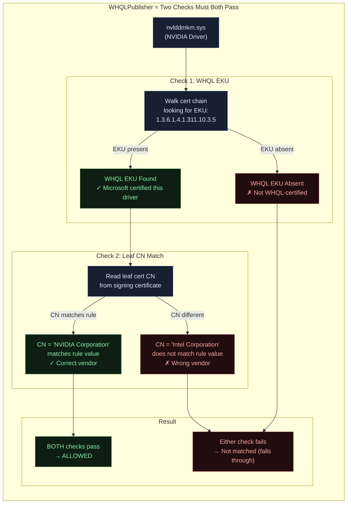
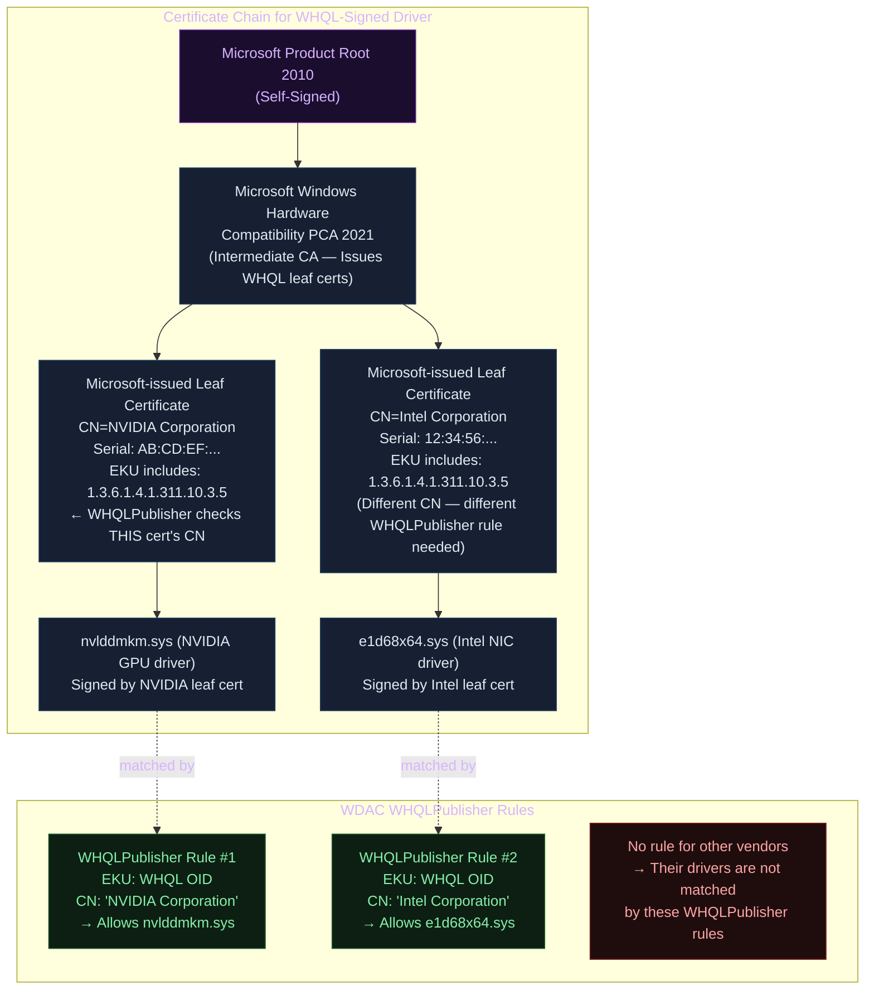
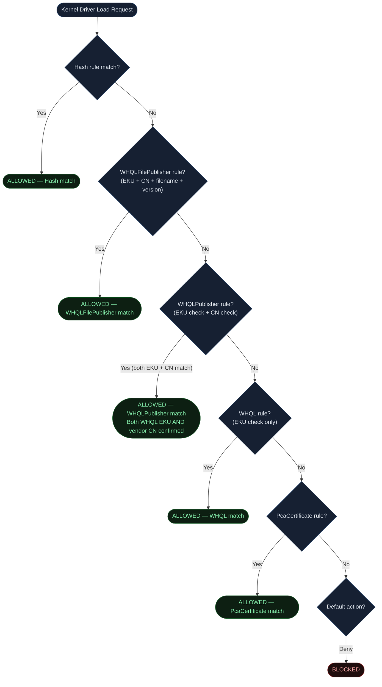
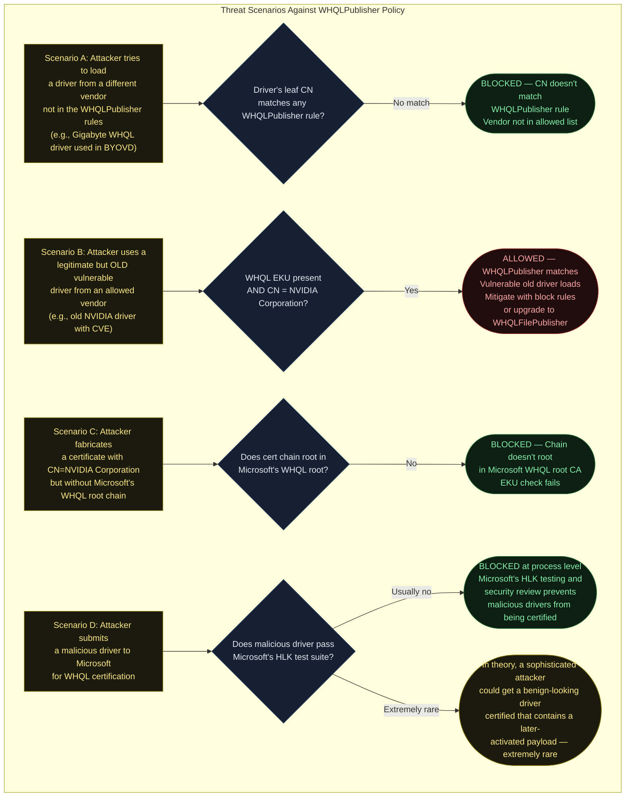
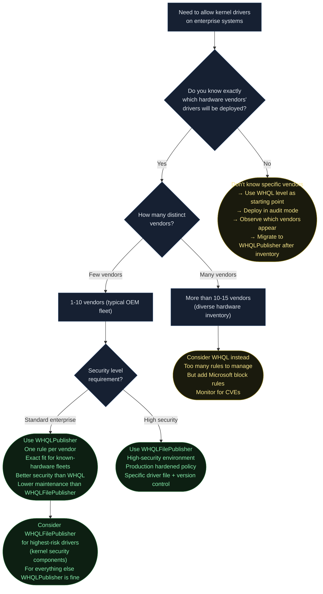
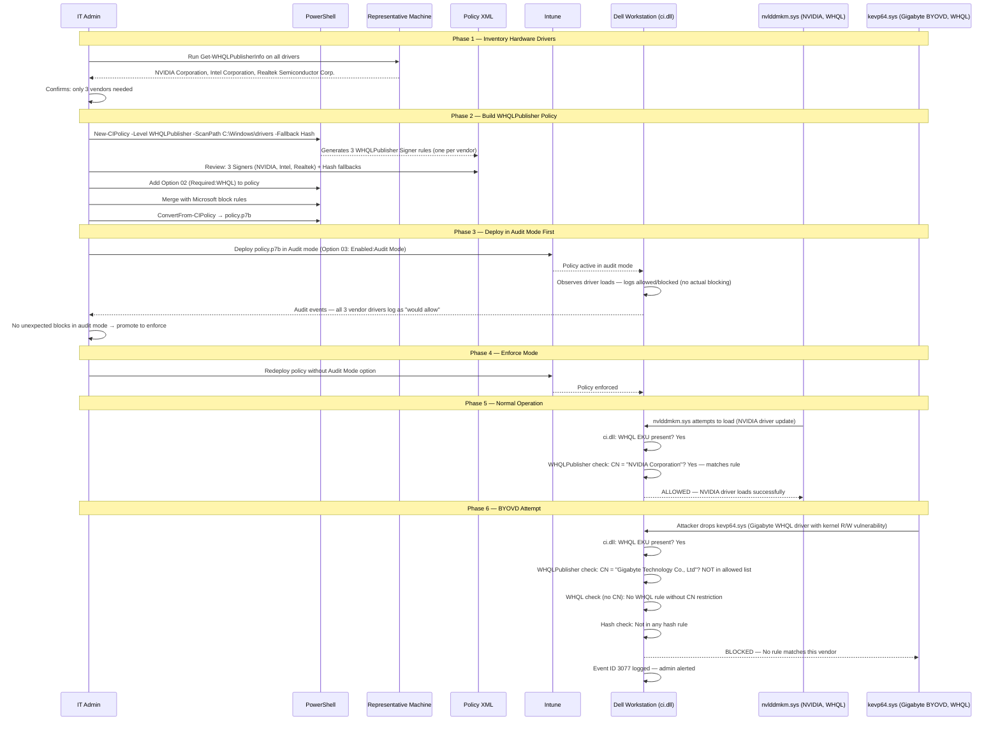

<!-- Author: Anubhav Gain | Category: WDAC File Rule Levels | Topic: WHQLPublisher -->

# WDAC File Rule Level: WHQLPublisher

> Combines the WHQL EKU trust check with the Common Name (CN) of the leaf certificate — allowing only WHQL-certified drivers from a **specific named hardware vendor**, rather than any WHQL-certified driver.

---

## Table of Contents

1. [Overview](#1-overview)
2. [How WHQLPublisher Differs from WHQL](#2-how-whqlpublisher-differs-from-whql)
3. [The Dual Trust Check](#3-the-dual-trust-check)
4. [Certificate Chain / Trust Anatomy](#4-certificate-chain--trust-anatomy)
5. [Where in the Evaluation Stack](#5-where-in-the-evaluation-stack)
6. [XML Representation](#6-xml-representation)
7. [PowerShell Examples](#7-powershell-examples)
8. [Comparison Table: WHQL vs. WHQLPublisher vs. WHQLFilePublisher](#8-comparison-table-whql-vs-whqlpublisher-vs-whqlfilepublisher)
9. [Pros & Cons Table](#9-pros--cons-table)
10. [Attack Resistance Analysis](#10-attack-resistance-analysis)
11. [When to Use vs. When to Avoid — Decision Flowchart](#11-when-to-use-vs-when-to-avoid--decision-flowchart)
12. [Real-World Scenario: OEM-Specific Driver Allowlisting](#12-real-world-scenario-oem-specific-driver-allowlisting)
13. [OS Version & Compatibility](#13-os-version--compatibility)
14. [Common Mistakes & Gotchas](#14-common-mistakes--gotchas)
15. [Summary Table](#15-summary-table)

---

## 1. Overview

The `WHQLPublisher` file rule level is a **compound trust check** that requires both:

1. The file's certificate chain contains the **WHQL EKU** (OID `1.3.6.1.4.1.311.10.3.5`) — confirming Microsoft certified the driver
2. The **leaf certificate's CN (Common Name)** matches a specific value — confirming the driver belongs to a particular vendor

This level sits between `WHQL` (broad — any certified vendor) and `WHQLFilePublisher` (very specific — particular file at particular version) in the specificity spectrum.

**Core use case:** Organizations that deploy hardware from known, specific vendors and want to permit only *that vendor's* WHQL-certified drivers, not drivers from all possible WHQL-certified vendors.

**Example distinction:**
- `WHQL`: "Allow any driver that Microsoft has WHQL-certified" (covers thousands of drivers from hundreds of vendors)
- `WHQLPublisher`: "Allow WHQL-certified drivers, but only if signed with `CN=NVIDIA Corporation`" (covers all NVIDIA WHQL drivers, no others)

---

## 2. How WHQLPublisher Differs from WHQL

The `WHQL` level checks only for the presence of the WHQL EKU in the certificate chain. The `WHQLPublisher` level adds an additional gate: the **leaf certificate's subject CN must match the specified publisher name**.

### The Critical Difference

In the WHQL signing model, **Microsoft signs the driver on behalf of the vendor**. The vendor's identity is preserved in the submission metadata and reflected in the leaf certificate's Common Name. While the signing certificate is Microsoft's, the CN embedded in it identifies the submitting organization:

- Driver submitted by NVIDIA → Leaf cert CN = `NVIDIA Corporation`
- Driver submitted by Intel → Leaf cert CN = `Intel Corporation`  
- Driver submitted by Dell → Leaf cert CN = `Dell Inc.`

The `WHQLPublisher` rule exploits this CN to achieve vendor-specific trust.

### Why the WHQL Signing Model Makes This Possible

Unlike standard Authenticode where each vendor has their own private key and their own certificate, WHQL drivers are all signed by **Microsoft's** private key. The differentiation between vendors comes from the **subject name on the Microsoft-issued leaf certificate** for that specific vendor's submission.

```
Standard Authenticode chain:
  Root CA → Vendor's Intermediate CA → Vendor's Leaf Cert → File
  (Vendor controls their own private key)

WHQL signing chain:
  Microsoft Root → Microsoft WHQL PCA → Microsoft-issued Leaf (CN=Vendor Name) → File
  (Microsoft controls the private key; vendor name is in the CN)
```

This is why `WHQLPublisher` can meaningfully distinguish between vendors even though Microsoft signs everything: the CN in the Microsoft-issued leaf cert identifies who submitted the driver.

---

## 3. The Dual Trust Check



Both conditions must be satisfied simultaneously. A file that is WHQL-signed but from a different vendor fails the CN check. A file that has the correct CN but lacks the WHQL EKU fails the EKU check. Only files meeting both conditions are allowed by a `WHQLPublisher` rule.

---

## 4. Certificate Chain / Trust Anatomy



**Important:** Even though NVIDIA and Intel drivers both chain through the same `Microsoft Windows Hardware Compatibility PCA`, their **leaf certificates have different CNs**. This is the binding point for `WHQLPublisher` rules. A separate rule is needed for each vendor whose drivers you want to allow.

---

## 5. Where in the Evaluation Stack



`WHQLPublisher` sits at a middle position in the WHQL family evaluation order: checked after the more specific `WHQLFilePublisher` and before the broader `WHQL`. If a file matches `WHQLFilePublisher`, evaluation stops there. If `WHQLPublisher` matches, evaluation stops. Only if `WHQLPublisher` does not match does evaluation continue to bare `WHQL`.

---

## 6. XML Representation

A `WHQLPublisher` rule requires three coordinated elements in the WDAC XML:
1. An `<EKU>` element defining the WHQL OID
2. A `<Signer>` element referencing both the WHQL EKU and the WHQL PCA
3. A `<CertPublisher>` child element specifying the vendor's CN

```xml
<?xml version="1.0" encoding="utf-8"?>
<SiPolicy xmlns="urn:schemas-microsoft-com:sipolicy">

  <!-- EKU Definitions -->
  <EKUs>
    <!-- Windows Hardware Driver Verification (WHQL) EKU -->
    <!-- OID: 1.3.6.1.4.1.311.10.3.5 -->
    <EKU ID="ID_EKU_WHQL" Value="010A2B0601040182370A0305" />
  </EKUs>

  <!-- Signer Definitions -->
  <Signers>

    <!--
      WHQLPublisher Rule for NVIDIA Corporation.
      Allows WHQL-certified drivers where leaf cert CN = "NVIDIA Corporation".
      Does NOT allow non-NVIDIA WHQL drivers or non-WHQL NVIDIA-branded binaries.
    -->
    <Signer ID="ID_SIGNER_WHQL_NVIDIA" Name="WHQLPublisher - NVIDIA Corporation">
      <!-- TBS hash of the Microsoft Windows Hardware Compatibility PCA 2021 -->
      <!-- This is the intermediate CA that issues WHQL leaf certs -->
      <CertRoot Type="TBS" Value="3085A90B03EE71B6B33F5EA8A07DBBD40B5B7A89" />
      <!-- Require WHQL EKU in the chain -->
      <CertEKU ID="ID_EKU_WHQL" />
      <!-- Restrict to this specific vendor's leaf cert CN -->
      <!-- This is what makes it WHQLPublisher vs. WHQL -->
      <CertPublisher Value="NVIDIA Corporation" />
    </Signer>

    <!--
      WHQLPublisher Rule for Intel Corporation.
      Separate rule needed per vendor.
    -->
    <Signer ID="ID_SIGNER_WHQL_INTEL" Name="WHQLPublisher - Intel Corporation">
      <CertRoot Type="TBS" Value="3085A90B03EE71B6B33F5EA8A07DBBD40B5B7A89" />
      <CertEKU ID="ID_EKU_WHQL" />
      <CertPublisher Value="Intel Corporation" />
    </Signer>

    <!--
      WHQLPublisher Rule for Realtek Semiconductor Corp.
    -->
    <Signer ID="ID_SIGNER_WHQL_REALTEK" Name="WHQLPublisher - Realtek Semiconductor Corp.">
      <CertRoot Type="TBS" Value="3085A90B03EE71B6B33F5EA8A07DBBD40B5B7A89" />
      <CertEKU ID="ID_EKU_WHQL" />
      <CertPublisher Value="Realtek Semiconductor Corp." />
    </Signer>

  </Signers>

  <!-- Signing Scenarios — Kernel Mode -->
  <SigningScenarios>
    <SigningScenario Value="131" ID="ID_SIGNINGSCENARIO_DRIVERS" FriendlyName="Kernel Mode Drivers">
      <ProductSigners>
        <AllowedSigner SignerID="ID_SIGNER_WHQL_NVIDIA" />
        <AllowedSigner SignerID="ID_SIGNER_WHQL_INTEL" />
        <AllowedSigner SignerID="ID_SIGNER_WHQL_REALTEK" />
      </ProductSigners>
    </SigningScenario>
  </SigningScenarios>

</SiPolicy>
```

### Key XML Elements Explained

| Element | Purpose in WHQLPublisher |
|---|---|
| `<EKU ID="..." Value="...">` | Defines the WHQL OID value (shared across all WHQL-family rules) |
| `<CertRoot Type="TBS" Value="...">` | Specifies the WHQL intermediate CA TBS hash (Microsoft's PCA) |
| `<CertEKU ID="...">` | Links to the EKU definition — requires WHQL EKU in chain |
| `<CertPublisher Value="...">` | The vendor CN from the leaf certificate — **this is what makes it WHQLPublisher** |

Removing `<CertPublisher>` from a `WHQLPublisher` rule degrades it to a `WHQL` rule (any WHQL vendor). Adding `<FileAttrib>` elements and linking them via `<FileAttribRef>` upgrades it to `WHQLFilePublisher`.

---

## 7. PowerShell Examples

### Generating WHQLPublisher Rules

```powershell
# Generate WHQLPublisher rules by scanning a specific vendor's drivers
# ConfigCI will extract the leaf CN and create WHQLPublisher rules
New-CIPolicy `
    -ScanPath "C:\Windows\System32\drivers\" `
    -Level WHQLPublisher `
    -Fallback Hash `
    -FilePath "C:\Policies\WHQLPublisher-Policy.xml" `
    -Drivers

# The output XML will contain Signer elements with CertPublisher child elements
# Each unique vendor CN found in WHQL-signed drivers gets its own Signer rule
```

```powershell
# Scan only NVIDIA drivers specifically
# Useful for building a policy that explicitly covers only one vendor
$nvidiaDrivers = Get-ChildItem "C:\Windows\System32\DriverStore\FileRepository" `
    -Recurse -Filter "*.sys" | Where-Object {
        (Get-AuthenticodeSignature $_.FullName).SignerCertificate.Subject -like "*NVIDIA*"
    }

# Build policy from just those files
New-CIPolicy `
    -Level WHQLPublisher `
    -Fallback Hash `
    -FilePath "C:\Policies\NVIDIA-WHQL-Policy.xml" `
    -ScanPath ($nvidiaDrivers | Select-Object -First 1).DirectoryName
```

### Inspecting the Leaf CN of a WHQL-Signed Driver

```powershell
function Get-WHQLPublisherInfo {
    param([string]$DriverPath)
    
    $whqlOid = "1.3.6.1.4.1.311.10.3.5"
    
    $sig = Get-AuthenticodeSignature -FilePath $DriverPath
    if ($sig.Status -ne "Valid") {
        Write-Warning "Not validly signed: $DriverPath"
        return
    }
    
    $chain = New-Object System.Security.Cryptography.X509Certificates.X509Chain
    $chain.Build($sig.SignerCertificate) | Out-Null
    
    # Check for WHQL EKU
    $isWhql = $false
    foreach ($el in $chain.ChainElements) {
        foreach ($ext in $el.Certificate.Extensions) {
            if ($ext -is [System.Security.Cryptography.X509Certificates.X509EnhancedKeyUsageExtension]) {
                if ($ext.EnhancedKeyUsages | Where-Object { $_.Value -eq $whqlOid }) {
                    $isWhql = $true
                }
            }
        }
    }
    
    if (-not $isWhql) {
        Write-Host "Not WHQL-signed: $DriverPath" -ForegroundColor Yellow
        return
    }
    
    # Extract leaf cert CN (this is the CertPublisher value in WHQLPublisher rules)
    $leafCert = $chain.ChainElements[0].Certificate
    $cnMatch = $leafCert.Subject -match "CN=([^,]+)"
    $cn = if ($cnMatch) { $Matches[1].Trim() } else { "Unknown" }
    
    Write-Host "WHQLPublisher Info for: $([System.IO.Path]::GetFileName($DriverPath))" -ForegroundColor Cyan
    Write-Host "  WHQL EKU: Present" -ForegroundColor Green
    Write-Host "  Leaf CN (CertPublisher value): $cn" -ForegroundColor Green
    Write-Host "  Leaf Thumbprint: $($leafCert.Thumbprint)"
    Write-Host ""
    Write-Host "  WDAC WHQLPublisher rule would use:"
    Write-Host "  <CertPublisher Value=`"$cn`" />" -ForegroundColor Yellow
}

# Examples
Get-WHQLPublisherInfo -DriverPath "C:\Windows\System32\drivers\nvlddmkm.sys"
Get-WHQLPublisherInfo -DriverPath "C:\Windows\System32\drivers\e1d68x64.sys"
```

### Building a Multi-Vendor WHQLPublisher Policy for a Dell Enterprise Fleet

```powershell
# Scenario: Dell workstation fleet with NVIDIA GPU, Intel NIC, Realtek audio
# Build a policy allowing only these specific vendors' WHQL drivers

$vendorDriverPaths = @(
    "C:\Windows\System32\drivers\nvlddmkm.sys",     # NVIDIA GPU
    "C:\Windows\System32\drivers\e1d68x64.sys",     # Intel NIC  
    "C:\Windows\System32\drivers\RTKVHD64.sys"      # Realtek Audio
)

# Create a temp directory with just these representative drivers
$tempDir = New-Item -ItemType Directory -Path "C:\Temp\VendorDriverScan" -Force
foreach ($driver in $vendorDriverPaths) {
    if (Test-Path $driver) {
        Copy-Item $driver $tempDir.FullName
    }
}

# Generate WHQLPublisher rules from these representative drivers
New-CIPolicy `
    -ScanPath $tempDir.FullName `
    -Level WHQLPublisher `
    -Fallback Hash `
    -FilePath "C:\Policies\Dell-VendorDrivers.xml" `
    -Drivers

Write-Host "Generated WHQLPublisher policy with vendor-specific rules"
Write-Host "Review C:\Policies\Dell-VendorDrivers.xml before deploying"

# Clean up
Remove-Item $tempDir.FullName -Recurse -Force
```

### Validating WHQLPublisher XML Output

```powershell
function Validate-WHQLPublisherPolicy {
    param([string]$PolicyXmlPath)
    
    [xml]$policy = Get-Content -Path $PolicyXmlPath -Raw
    $ns = New-Object System.Xml.XmlNamespaceManager($policy.NameTable)
    $ns.AddNamespace("si", "urn:schemas-microsoft-com:sipolicy")
    
    $signers = $policy.SelectNodes("//si:Signer", $ns)
    $whqlSigners = @()
    
    foreach ($signer in $signers) {
        $hasCertEKU = $signer.SelectSingleNode("si:CertEKU", $ns) -ne $null
        $hasCertPublisher = $signer.SelectSingleNode("si:CertPublisher", $ns) -ne $null
        $hasCertRoot = $signer.SelectSingleNode("si:CertRoot", $ns) -ne $null
        
        if ($hasCertEKU -and $hasCertPublisher -and $hasCertRoot) {
            $publisherValue = $signer.SelectSingleNode("si:CertPublisher", $ns).GetAttribute("Value")
            $whqlSigners += [PSCustomObject]@{
                SignerID  = $signer.GetAttribute("ID")
                Name      = $signer.GetAttribute("Name")
                Publisher = $publisherValue
                Level     = "WHQLPublisher"
            }
        } elseif ($hasCertEKU -and $hasCertRoot -and -not $hasCertPublisher) {
            $whqlSigners += [PSCustomObject]@{
                SignerID  = $signer.GetAttribute("ID")
                Name      = $signer.GetAttribute("Name")
                Publisher = "(Any — WHQL level)"
                Level     = "WHQL"
            }
        }
    }
    
    Write-Host "WHQL-related Signers in: $PolicyXmlPath" -ForegroundColor Cyan
    $whqlSigners | Format-Table -AutoSize
}
```

---

## 8. Comparison Table: WHQL vs. WHQLPublisher vs. WHQLFilePublisher

| Attribute | WHQL | WHQLPublisher | WHQLFilePublisher |
|---|---|---|---|
| **EKU check** | Yes | Yes | Yes |
| **Vendor CN check** | No | **Yes** | Yes |
| **Filename check** | No | No | **Yes** |
| **Version floor** | No | No | **Yes** |
| **Trust scope** | All WHQL vendors | One specific vendor | One specific file from one vendor |
| **Vendors covered** | Hundreds | One per rule | One per rule |
| **Files covered per rule** | All files from all WHQL vendors | All WHQL files from one vendor | One specific driver file from one vendor |
| **Maintenance on new driver** | Auto-covered | Auto-covered (if same vendor) | Auto-covered (if same filename, same vendor, version ≥ minimum) |
| **Maintenance on vendor rename** | Auto-covered | **RULE BREAKS** | **RULE BREAKS** |
| **XML complexity** | Low | Medium | High |
| **Attack surface** | Largest of WHQL family | Vendor-bounded | File-and-version-bounded |
| **BYOVD risk** | Highest | Vendor-scoped | Lowest |
| **Typical use case** | Broad enterprise driver coverage | OEM-specific fleet management | Production-hardened driver control |

---

## 9. Pros & Cons Table

| Attribute | Assessment |
|---|---|
| **Security improvement over WHQL** | Significant — eliminates drivers from unrelated vendors |
| **Trust scope** | All WHQL-certified drivers from named vendor |
| **Maintenance burden** | Low per-vendor — new certified drivers from same vendor automatically match |
| **Scalability** | Moderate — one rule per vendor; 5-10 rules typical for enterprise fleets |
| **Precision** | Medium — still allows all driver versions from the vendor |
| **BYOVD risk** | Reduced (vendor-scoped) but still present if vendor has vulnerable old drivers |
| **Vendor rename risk** | Rule breaks silently if vendor CN changes (company merger, rebranding) |
| **OEM fleet suitability** | Excellent — natural fit for "trust Dell hardware drivers on Dell machines" |
| **XML verbosity** | Moderate — one `<Signer>` block per vendor |
| **PowerShell support** | Full — `New-CIPolicy -Level WHQLPublisher` works natively |

---

## 10. Attack Resistance Analysis



The key security improvement of `WHQLPublisher` over `WHQL` is illustrated in **Scenario A**: a common BYOVD attack using a vulnerable Gigabyte or other vendor's WHQL driver is stopped simply because that vendor's CN is not in the allowed list. This significantly reduces the BYOVD attack surface without requiring a frequently-updated block list.

However, **Scenario B** remains: if an allowed vendor (e.g., NVIDIA or Intel) has released a WHQL driver that later received a CVE, that driver still matches the `WHQLPublisher` rule. Mitigations:
- Apply Microsoft's vendor-specific driver block rules
- Upgrade critical drivers to `WHQLFilePublisher` with a minimum version floor
- Monitor vendor security advisories

---

## 11. When to Use vs. When to Avoid — Decision Flowchart



---

## 12. Real-World Scenario: OEM-Specific Driver Allowlisting

**Scenario:** A healthcare organization runs a fleet of identical Dell workstations. Each machine has:
- NVIDIA Quadro GPU (medical imaging workloads)
- Intel I219 NIC
- Realtek HD Audio

The organization wants to allow only drivers from these three vendors, blocking drivers from all other vendors (including well-known ones like AMD, Broadcom, etc.) because those drivers are not on these machines and represent unnecessary attack surface.



This scenario demonstrates the key operational advantage of `WHQLPublisher`: the BYOVD attack is stopped without needing to explicitly block the Gigabyte driver by hash. It is blocked simply because Gigabyte is not in the allowlist. This is a **default-deny posture for driver vendors** that is practical and maintainable.

---

## 13. OS Version & Compatibility

| OS Version | WHQLPublisher Support | Notes |
|---|---|---|
| Windows 10 1507+ | Full support | Kernel mode driver control |
| Windows 10 1709+ | Full support | Dual-policy capability (audit + enforce) |
| Windows 11 21H2+ | Full support | HVCI integration |
| Windows Server 2016+ | Full support | Recommended for server deployments |
| Windows Server 2019+ | Full support | |
| Windows Server 2022+ | Full support | Secured-Core Server integration |

`WHQLPublisher` shares the same compatibility profile as `WHQL` since it is an extension of the same EKU-based mechanism.

---

## 14. Common Mistakes & Gotchas

### Mistake 1: Vendor Name Mismatch — Exact String Match Required

The `<CertPublisher Value="...">` element requires an **exact string match** with the CN in the leaf certificate. Common errors:

| What You Type | Actual CN in Cert | Match? |
|---|---|---|
| `NVIDIA` | `NVIDIA Corporation` | No |
| `Intel` | `Intel Corporation` | No |
| `Realtek` | `Realtek Semiconductor Corp.` | No |
| `NVIDIA Corporation` | `NVIDIA Corporation` | **Yes** |

Always use the `Get-WHQLPublisherInfo` function (or equivalent) to read the exact CN from the actual certificate before writing the XML rule.

### Mistake 2: Company Rebrand / Acquisition Breaking Rules

If a hardware vendor changes their certificate CN (due to merger, acquisition, or rebrand), existing `WHQLPublisher` rules break silently:

- New WHQL drivers signed with the new CN will not match old rules
- Old drivers may still work (old CN), but new drivers from the same company (now different CN) will be blocked
- **Example:** "XYZ Graphics Inc." is acquired by "MegaCorp" and re-files WHQL submissions as "MegaCorp XYZ Division" — rule `CN=XYZ Graphics Inc.` no longer matches new drivers

**Mitigation:** Monitor vendor security bulletins and WHQL certificate changes, especially for hardware from companies with known merger/acquisition activity. Consider `WHQLFilePublisher` for stability (filename-based, less affected by CN changes for the same driver file).

### Mistake 3: Using WHQLPublisher for Broad Trust (Should Use WHQL)

If your hardware inventory spans 15+ vendors, managing 15+ `WHQLPublisher` rules becomes complex. For environments with highly diverse hardware, the broad `WHQL` level combined with Microsoft's block rules is more maintainable. Use `WHQLPublisher` when you can enumerate your vendor list (typically 3-8 vendors for a homogeneous fleet).

### Mistake 4: Forgetting That WHQL Level Rules and WHQLPublisher Rules Coexist

If your policy contains both a broad `WHQL` rule and specific `WHQLPublisher` rules, the `WHQLPublisher` rules are evaluated first (as they are more specific), but the `WHQL` rule provides a fallback that allows **all** WHQL vendors anyway. If you intend to restrict to specific vendors only, you must **not** include a bare `WHQL` rule — only `WHQLPublisher` rules.

### Mistake 5: WHQLPublisher in User-Mode Scenario

Like `WHQL`, `WHQLPublisher` is primarily meaningful in the kernel-mode signing scenario. Adding `WHQLPublisher` rules to the user-mode signing scenario (12) is generally ineffective, as user-mode binaries from hardware vendors are typically signed with standard Authenticode certificates (not WHQL certificates). Use `Publisher` or `FilePublisher` levels for user-mode vendor software.

---

## 15. Summary Table

| Property | Value |
|---|---|
| **Level Name** | WHQLPublisher |
| **Trust Mechanism** | WHQL EKU (OID `1.3.6.1.4.1.311.10.3.5`) **AND** leaf cert CN match |
| **Specificity** | Vendor-specific (all WHQL drivers from one vendor) |
| **More Specific Than** | WHQL (any vendor) |
| **Less Specific Than** | WHQLFilePublisher (specific file + version) |
| **Primary Use Case** | OEM-specific WHQL driver allowlisting |
| **XML Key Element** | `<CertPublisher Value="[Vendor CN]" />` |
| **CN Source** | Leaf certificate Subject CN from Microsoft's WHQL signing cert |
| **BYOVD Risk** | Vendor-scoped — other vendor's vulnerable drivers are blocked |
| **CN Change Risk** | Rule breaks if vendor renames/rebrands their certificate CN |
| **PowerShell Level Name** | `WHQLPublisher` |
| **Signing Scenario** | Kernel mode (131) |
| **Kernel Component** | ci.dll |
| **OS Support** | Windows 10 1507+ / Server 2016+ |
| **Typical Rule Count** | One Signer rule per hardware vendor (3-8 for OEM fleets) |
| **Best Paired With** | Option 02 (Required:WHQL) + Microsoft block rules |
