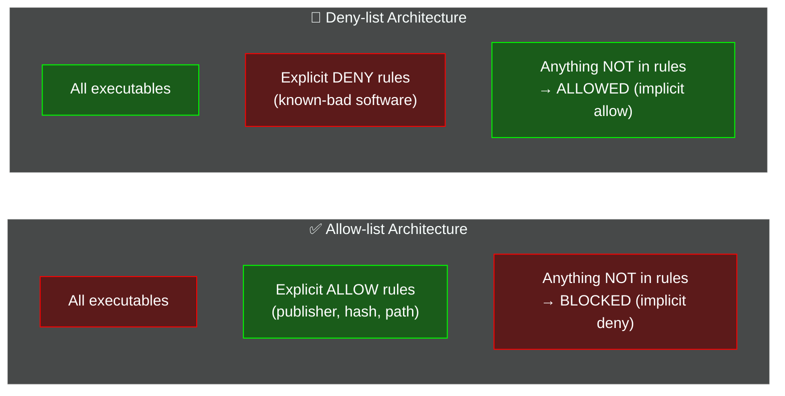
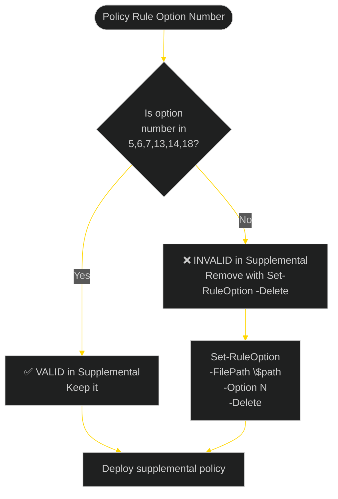
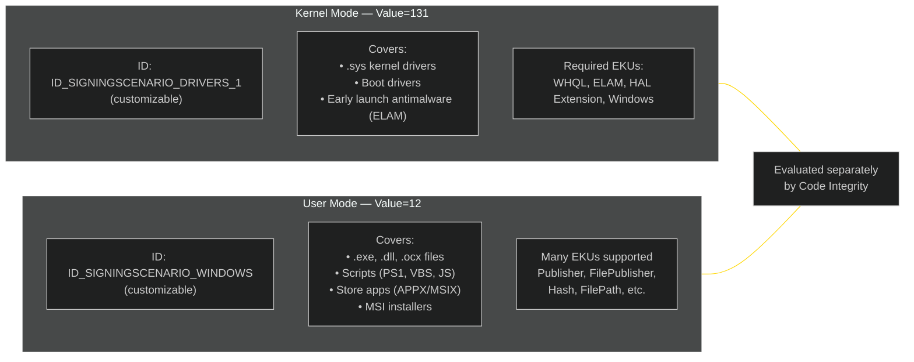
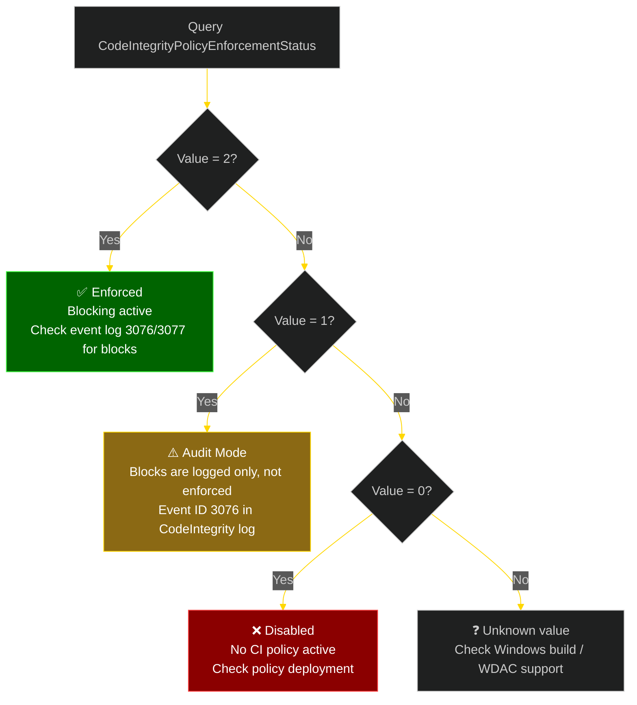
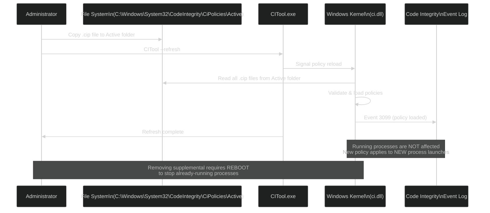
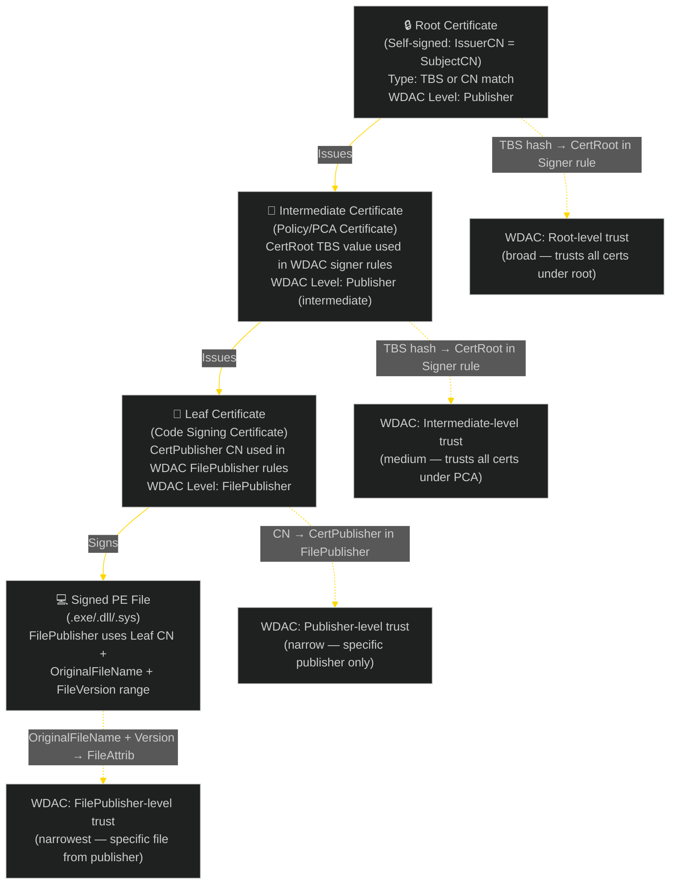
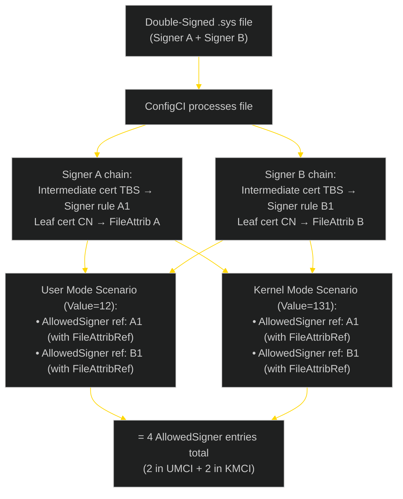
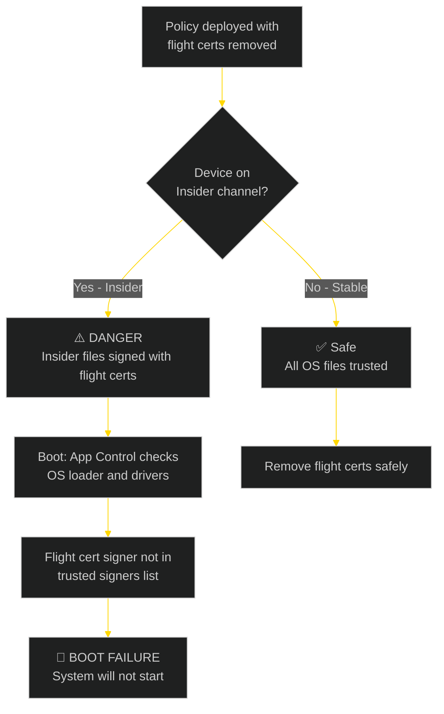
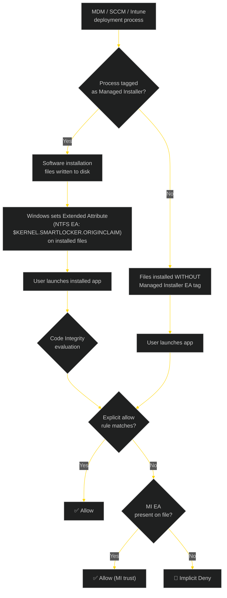

<!-- Author: Anubhav Gain | Category: WDAC Notes & Tips | Topic: Policy Management Reference -->

# App Control for Business — Complete Reference: Notes, Tips & Advanced Considerations

> **Formerly known as:** Windows Defender Application Control (WDAC)
> **Platform:** Windows 10 1903+ / Windows 11 / Windows Server 2016+
> **Owner:** Anubhav Gain
> **Last Updated:** 2026-05-02

---

<hr style="border: none; height: 3px; background: linear-gradient(to right, #b8860b, #ffd700, #daa520, #b8860b); margin: 2em 0;" />

## Table of Contents

1. [Branding & Background](#1-branding--background)
2. [Core Architecture: Allow-list, Not Deny-list](#2-core-architecture-allow-list-not-deny-list)
3. [Policy Types: Base vs. Supplemental](#3-policy-types-base-vs-supplemental)
4. [Supplemental Policy — Deep Dive](#4-supplemental-policy--deep-dive)
5. [Deny Rules — File Rules and Signer Rules](#5-deny-rules--file-rules-and-signer-rules)
6. [Rule Precedence Chain](#6-rule-precedence-chain)
7. [SigningScenarios Node](#7-signingscenarios-node)
8. [Verifying Enforcement Status](#8-verifying-enforcement-status)
9. [Refreshing Policies](#9-refreshing-policies)
10. [Merging Policies](#10-merging-policies)
11. [Microsoft Recommended Block Rules](#11-microsoft-recommended-block-rules)
12. [Microsoft Recommended Driver Block Rules](#12-microsoft-recommended-driver-block-rules)
13. [Signing Policies (Signed Policy Infrastructure)](#13-signing-policies-signed-policy-infrastructure)
14. [Removing Flight Signing Certificates](#14-removing-flight-signing-certificates)
15. [Removing App Control Policy Refresh Tool Certificates](#15-removing-app-control-policy-refresh-tool-certificates)
16. [Certificate Chain Facts](#16-certificate-chain-facts)
17. [Double-Signed Files](#17-double-signed-files)
18. [File Rule Levels — Selection Guide](#18-file-rule-levels--selection-guide)
19. [MSI Files and Rule Levels](#19-msi-files-and-rule-levels)
20. [Blocking Individual Windows Components](#20-blocking-individual-windows-components)
21. [Required: EV Signers (Option 8)](#21-required-ev-signers-option-8)
22. [User-Mode-Only Policy Rule Options](#22-user-mode-only-policy-rule-options)
23. [Pirated Software and Hash Mismatch](#23-pirated-software-and-hash-mismatch)
24. [Signed Policy + System Reset Danger](#24-signed-policy--system-reset-danger)
25. [CIP Binary File Naming](#25-cip-binary-file-naming)
26. [XML ID Length vs. CIP File Size](#26-xml-id-length-vs-cip-file-size)
27. [Flight Signing and Windows Insider Channels](#27-flight-signing-and-windows-insider-channels)
28. [Policy ID Setting for Event Log Details](#28-policy-id-setting-for-event-log-details)
29. [ISG (Intelligent Security Graph) Trust Flow](#29-isg-intelligent-security-graph-trust-flow)
30. [Managed Installer (MI) Trust Flow](#30-managed-installer-mi-trust-flow)
31. [Unsafe Practices](#31-unsafe-practices)
32. [Miscellaneous Tips & Edge Cases](#32-miscellaneous-tips--edge-cases)
33. [Quick PowerShell Cheat-Sheet](#33-quick-powershell-cheat-sheet)
34. [Appendix: Valid Supplemental Policy Options Table](#34-appendix-valid-supplemental-policy-options-table)

---

<hr style="border: none; height: 3px; background: linear-gradient(to right, #b8860b, #ffd700, #daa520, #b8860b); margin: 2em 0;" />

## 1. Branding & Background

**App Control for Business** is the current Microsoft branding (introduced with Windows 11 22H2 / late 2022 rebranding) for the technology previously called **Windows Defender Application Control (WDAC)**. Both names refer to the same kernel-enforced code integrity policy engine built into Windows.

### Key Points

- The PowerShell cmdlets, XML schema, event log sources, and `.cip` binary format **did not change** with the rebrand. You will still see `WDAC` everywhere in cmdlet names, log source names (`Microsoft-Windows-CodeIntegrity`), and documentation.
- App Control for Business is **not** the same as AppLocker. AppLocker is a legacy technology; App Control operates at the kernel level and is significantly more secure.
- App Control is **not** antivirus. It is a **whitelisting** (allowlisting) enforcement engine — only explicitly trusted code runs. Anything not trusted is blocked.
- The `SiPolicy.p7` / `.cip` binary is the compiled enforcement artefact deployed to the OS.

### Primary Use Cases

| Use Case | Description |
|---|---|
| Application whitelisting | Block all unsigned or untrusted executables |
| Driver control | Block vulnerable or malicious kernel drivers (BYOVD prevention) |
| Script enforcement | Restrict PowerShell to Constrained Language Mode |
| Software supply-chain | Ensure only publisher-signed software runs |
| Compliance | Meet CIS/NIST/ASD requirements for application control |

---

<hr style="border: none; height: 3px; background: linear-gradient(to right, #b8860b, #ffd700, #daa520, #b8860b); margin: 2em 0;" />

## 2. Core Architecture: Allow-list, Not Deny-list

App Control is fundamentally an **allow-list** engine. The default implicit action for any file not matched by a rule is **DENY**.



> **Critical Gotcha:** An empty deployed App Control policy means **nothing runs** — including Windows itself. Never deploy a policy with no ALLOW rules unless you are deliberately locking down a highly restricted device.

### Allow All Rules

Microsoft's recommended block rules ship with two special "Allow All" rules. These make the block rules function as a **deny-list overlay** — safe only because they are combined with existing allow-list base policies:

```xml
<Allow ID="ID_ALLOW_A_1" FriendlyName="Allow Kernel Drivers" FileName="*" />
<Allow ID="ID_ALLOW_A_2" FriendlyName="Allow User mode components" FileName="*" />
```

**WARNING:** If you merge block rules into an allow-list policy, you **must remove** `ID_ALLOW_A_1` and `ID_ALLOW_A_2` first. Keeping them turns your allow-list policy into an "allow everything except blocked items" policy.

### Multiple Base Policies Interaction

When multiple base policies are deployed simultaneously:

- A file must be **ALLOWED by ALL base policies** to run.
- One base policy blocking a file = the file is blocked, regardless of other policies.
- This is additive restriction, not additive permission.

---

<hr style="border: none; height: 3px; background: linear-gradient(to right, #b8860b, #ffd700, #daa520, #b8860b); margin: 2em 0;" />

## 3. Policy Types: Base vs. Supplemental

| Property | Base Policy | Supplemental Policy |
|---|---|---|
| Standalone deployment | Yes | No (requires a base) |
| Can contain DENY rules | Yes | **No** (silently ignored) |
| Can expand trust | Yes | Yes |
| Can restrict trust | Yes | **No** |
| Required XML attribute | `PolicyType="Base Policy"` | `PolicyType="Supplemental Policy"` |
| Required element | `<PolicyID>` | `<PolicyID>` + `<BasePolicyID>` |
| Signing status must match base | N/A | Yes |

### Checking Policy Type

Open the XML and inspect the `SiPolicy` root element:

```xml
<SiPolicy xmlns="urn:schemas-microsoft-com:sipolicy" PolicyType="Supplemental Policy">
```

Or use PowerShell:

```powershell
[xml]$policy = Get-Content .\Policy.xml
$policy.SiPolicy.PolicyType
# Returns: "Base Policy" or "Supplemental Policy"
```

### Converting Base → Supplemental

```powershell
Set-CiPolicyIdInfo `
    -FilePath .\Policy.xml `
    -SupplementsBasePolicyID "{GUID-OF-BASE-POLICY}" `
    -ResetPolicyId
```

This command:

1. Sets `PolicyType="Supplemental Policy"` on the `SiPolicy` element
2. Adds/updates `<BasePolicyID>` to the base policy's GUID
3. Resets the supplemental's own `<PolicyID>` to a new GUID (so it is unique)

---

<hr style="border: none; height: 3px; background: linear-gradient(to right, #b8860b, #ffd700, #daa520, #b8860b); margin: 2em 0;" />

## 4. Supplemental Policy — Deep Dive

### 4.1 Stripping Invalid Policy Options

Supplemental policies only support a subset of policy rule options. You **must** remove all non-supplemental-valid options before deploying:

```powershell
[System.String]$SupplementalPolicyPath = "<Path to SupplementalPolicy.xml>"

# Remove all options that are NOT valid in supplemental policies
@(0, 1, 2, 3, 4, 8, 9, 10, 11, 12, 15, 16, 17, 19, 20) | ForEach-Object -Process {
    Set-RuleOption -FilePath $SupplementalPolicyPath -Option $_ -Delete
}
```

### 4.2 Valid Options in Supplemental Policies

| Option Number | Name | Behavior |
|---|---|---|
| 5 | Enabled:Unsigned System Integrity Policy | Allows unsigned supplemental |
| 6 | Enabled:Advanced Boot Options Menu | Boot debug menu access |
| 7 | Allowed:Debug Policy Augmented | Debug policy augmentation |
| 13 | Enabled:Managed Installer | Trust software installed by MI |
| 14 | Enabled:Intelligent Security Graph Authorization | ISG cloud trust |
| 18 | Disabled:Runtime FilePath Rule Protection | Disable UNC hardening for FilePath rules |

All other options (0–4, 8–12, 15–17, 19–20) are **base-policy-only** and will be rejected or cause unexpected behavior in supplemental policies.

### 4.3 Decision Tree: Is This Option Valid in a Supplemental?



### 4.4 Deny Rules in Supplemental Policies Are Silently Ignored

This is one of the most common mistakes:

> **Supplemental policies can only ADD trust — they cannot RESTRICT it.**

- Any `<Deny>` file rules in a supplemental policy XML are **parsed without error** but **never enforced**.
- Any `<DeniedSigners>` in a supplemental policy are **silently ignored**.
- You do NOT need to include Microsoft recommended block rules in supplemental policies — they have zero effect.

### 4.5 Signing a Supplemental Policy

When using signed App Control policies, the signer rules for supplemental policies must be added to the **BASE** policy, not the supplemental itself:

```powershell
# Add supplemental signer to the BASE policy (correct)
Add-SignerRule `
    -FilePath .\BasePolicy.xml `
    -CertificatePath .\MyCert.cer `
    -Supplemental

# Do NOT do this on the supplemental policy itself (causes BOOT FAILURE)
# Add-SignerRule -FilePath .\SupplementalPolicy.xml -CertificatePath .\MyCert.cer -Supplemental
```

> **WARNING:** Using `-Supplemental` switch when calling `Add-SignerRule` on a *supplemental* policy (instead of the base) is a known gotcha that can result in **boot failure** on the endpoint. Always apply `-Supplemental` signer rules to the BASE policy.

### 4.6 Removing Supplemental Policies

```powershell
# Get current policies and their IDs
CITool --list-policies

# Remove a supplemental policy by its Policy ID
CITool --remove-policy "{PolicyID-GUID}"
```

Important behavior notes:

- This works for **both signed and unsigned** supplemental policies.
- Removing a supplemental policy does **NOT** immediately block applications that are already running.
- Apps that were launched under the supplemental's trust **continue running** until a reboot.
- **Reboot is required** for the removal to take full effect.

### 4.7 Unsigned Supplemental for a Signed Base

> If **all other policies** on the system are signed, an unsigned supplemental policy will be **silently ignored**.

The signing status of all deployed policies must match:

- Signed base + unsigned supplemental = supplemental ignored
- Signed base + signed supplemental = both enforced
- Unsigned base + unsigned supplemental = both enforced

---

<hr style="border: none; height: 3px; background: linear-gradient(to right, #b8860b, #ffd700, #daa520, #b8860b); margin: 2em 0;" />

## 5. Deny Rules — File Rules and Signer Rules

### 5.1 File Deny Rules — XML Anatomy

A file deny rule requires **two parts** in the XML:

**Part 1 — Define the rule in `<FileRules>`:**

```xml
<FileRules>
    <!-- Hash-based deny rule -->
    <Deny
        ID="ID_DENY_MALWARE_HASH_1"
        FriendlyName="Deny known malware by hash"
        Hash="E3B0C44298FC1C149AFBF4C8996FB92427AE41E4649B934CA495991B7852B855" />

    <!-- FileName-based deny rule (deny by original filename) -->
    <Deny
        ID="ID_DENY_MIMIKATZ"
        FriendlyName="Deny mimikatz by filename"
        FileName="mimikatz.exe"
        MinimumFileVersion="0.0.0.0" />
</FileRules>
```

**Part 2 — Reference the rule from a `<SigningScenario>`:**

```xml
<SigningScenarios>
    <SigningScenario Value="12" ID="ID_SIGNINGSCENARIO_WINDOWS" FriendlyName="User Mode">
        <ProductSigners>
            <FileRulesRef>
                <!-- Reference the deny rule defined above -->
                <FileRuleRef RuleID="ID_DENY_MALWARE_HASH_1" />
                <FileRuleRef RuleID="ID_DENY_MIMIKATZ" />
            </FileRulesRef>
        </ProductSigners>
    </SigningScenario>
</SigningScenarios>
```

> **Gotcha:** A `<Deny>` rule in `<FileRules>` with NO corresponding `<FileRuleRef>` in a `<SigningScenario>` is **never enforced**. Both parts are required.

### 5.2 Denied Certificates/Signers — XML Anatomy

Denying by certificate/signer is different from file deny rules:

```xml
<!-- Step 1: Define the signer in <Signers> (the Signer element itself is neutral) -->
<Signers>
    <Signer ID="ID_SIGNER_DENY_VULN_CERT" Name="Vulnerable Driver Publisher">
        <CertRoot Type="TBS" Value="AABBCCDDEEFF..." />
        <CertPublisher Value="Vulnerable Corp" />
    </Signer>
</Signers>

<!-- Step 2: Reference it in <DeniedSigners> within the SigningScenario -->
<SigningScenarios>
    <SigningScenario Value="131" ID="ID_SIGNINGSCENARIO_DRIVERS_1" FriendlyName="Kernel Mode">
        <ProductSigners>
            <DeniedSigners>
                <!-- This is what makes it a DENY — not the Signer element itself -->
                <DeniedSigner SignerId="ID_SIGNER_DENY_VULN_CERT" />
            </DeniedSigners>
        </ProductSigners>
    </SigningScenario>
</SigningScenarios>
```

> **Key Insight:** The `<Signer>` element in `<Signers>` does not specify allow or deny on its own. Placement in `<AllowedSigners>` or `<DeniedSigners>` within a `<SigningScenario>` determines the action.

---

<hr style="border: none; height: 3px; background: linear-gradient(to right, #b8860b, #ffd700, #daa520, #b8860b); margin: 2em 0;" />

## 6. Rule Precedence Chain

Understanding how App Control evaluates a file is critical for debugging unexpected blocks or unexpected allows.

```mermaid
%%{init: {'theme': 'dark', 'themeVariables': {'primaryColor': '#1a1a2e', 'primaryTextColor': '#e0e0e0', 'primaryBorderColor': '#ffd700', 'lineColor': '#ffd700', 'secondaryColor': '#16213e'}}}%%
flowchart TD
    Start([File execution request]) --> ExplicitDeny{Explicit DENY\nrule matches?}
    ExplicitDeny -->|Yes| BLOCK["🚫 BLOCKED\nAlways — cannot be overridden\nby supplemental or any other rule"]
    ExplicitDeny -->|No| BaseAllow{Explicit ALLOW\nin BASE policy?}
    BaseAllow -->|Yes| ALLOW["✅ ALLOWED"]
    BaseAllow -->|No| SupplementalAllow{Explicit ALLOW\nin SUPPLEMENTAL\npolicy?}
    SupplementalAllow -->|Yes| ALLOW
    SupplementalAllow -->|No| MICheck{Managed Installer\nEA (Extended\nAuthorization)?}
    MICheck -->|Yes| ALLOW
    MICheck -->|No| ISGCheck{ISG Extended\nAuthorization\n(cloud)?}
    ISGCheck -->|Yes| ALLOW
    ISGCheck -->|No| ImplicitDeny["🚫 IMPLICIT DENY\n(default)"]

    style BLOCK fill:#8b0000,stroke:#ff4444,color:#ffffff
    style ALLOW fill:#006400,stroke:#44ff44,color:#ffffff
    style ImplicitDeny fill:#4a0000,stroke:#cc0000,color:#ffffff
```

### Key Precedence Rules

1. **Explicit DENY beats EVERYTHING** — even if a supplemental policy explicitly allows the same file, a deny rule in any base policy wins.
2. **Base policy allow** is evaluated before supplemental allows.
3. **Supplemental allows** only extend trust, never override denies.
4. **Managed Installer (MI)** and **ISG** trust are evaluated last among allow mechanisms.
5. **Implicit deny** is the fallback — no matching allow rule = blocked.

---

<hr style="border: none; height: 3px; background: linear-gradient(to right, #b8860b, #ffd700, #daa520, #b8860b); margin: 2em 0;" />

## 7. SigningScenarios Node

The `<SigningScenarios>` element contains two child scenarios that cover different code execution contexts.



### Critical Facts

- The `Value` attribute **must** be exactly `131` (kernel) or `12` (user) — these are fixed constants defined by the Windows CI driver.
- The `ID` attribute is **customizable** — you can name it anything (e.g., `ID_SIGNINGSCENARIO_KERNEL`, `MY_KERNEL_SCENARIO`).
- The `FriendlyName` attribute is also fully customizable.
- If you use the wrong `Value` number (e.g., `Value="130"` instead of `131`), your kernel-mode rules will not be evaluated by the kernel Code Integrity driver, and drivers that should be blocked will load.

### What Happens with Wrong Value?

If a kernel driver signer is placed only in `Value="12"` (user mode scenario):

- The kernel Code Integrity check runs against `Value="131"` only.
- The driver is evaluated against the kernel scenario and finds no matching allow rule.
- Result: **driver blocked by implicit deny** even if you have a matching signer rule.

Conversely, if you put a user-mode .exe allow rule only in `Value="131"`:

- User mode CI checks `Value="12"` only.
- The exe is blocked by implicit deny.

---

<hr style="border: none; height: 3px; background: linear-gradient(to right, #b8860b, #ffd700, #daa520, #b8860b); margin: 2em 0;" />

## 8. Verifying Enforcement Status

### 8.1 PowerShell — CIM Query

```powershell
Get-CimInstance `
    -ClassName Win32_DeviceGuard `
    -Namespace root\Microsoft\Windows\DeviceGuard |
    Select-Object -Property *codeintegrity* |
    Format-List
```

Key properties returned:

| Property | Value | Meaning |
|---|---|---|
| `CodeIntegrityPolicyEnforcementStatus` | 2 | **Enforced** (blocking mode) |
| `CodeIntegrityPolicyEnforcementStatus` | 1 | **Audit mode** (log only, no blocking) |
| `CodeIntegrityPolicyEnforcementStatus` | 0 | **Disabled / Not running** |
| `UsermodeCodeIntegrityPolicyEnforcementStatus` | 2 | User mode **Enforced** |
| `UsermodeCodeIntegrityPolicyEnforcementStatus` | 1 | User mode **Audit** |

### 8.2 System Information (msinfo32)

Run `msinfo32.exe` → navigate to **System Summary**:

- **App Control for Business Policy (Kernel Mode):** `On` / `Audit Mode` / `Off`
- **App Control for Business User Mode Policy (User Mode):** `On` / `Audit Mode` / `Off`

### 8.3 Status Meanings and Actions



### 8.4 Relevant Event IDs

| Event ID | Source | Meaning |
|---|---|---|
| 3076 | Microsoft-Windows-CodeIntegrity/Operational | **Audit block** — file would have been blocked (audit mode) |
| 3077 | Microsoft-Windows-CodeIntegrity/Operational | **Enforce block** — file was blocked |
| 3089 | Microsoft-Windows-CodeIntegrity/Operational | Signature information for a blocked/audited file |
| 3099 | Microsoft-Windows-CodeIntegrity/Operational | Policy loaded — shows policy GUID, name, and version |
| 3004 | Microsoft-Windows-CodeIntegrity/Operational | Unsigned kernel driver blocked |
| 8028 | Microsoft-Windows-AppLocker/MSI and Script | Script enforcement audit event |
| 8029 | Microsoft-Windows-AppLocker/MSI and Script | Script enforcement block event |

---

<hr style="border: none; height: 3px; background: linear-gradient(to right, #b8860b, #ffd700, #daa520, #b8860b); margin: 2em 0;" />

## 9. Refreshing Policies

App Control policies are compiled from XML to `.cip` binary, then deployed. After deployment, the policy must be loaded by the kernel.

### 9.1 Modern Method — CITool (Windows 11 22H2+)

```powershell
# Refresh all deployed policies
CITool --refresh

# List all currently deployed policies
CITool --list-policies

# Update a specific policy from a .cip file
CITool --update-policy "C:\Policies\MyPolicy.cip"

# Remove a policy by GUID
CITool --remove-policy "{PolicyID-GUID}"
```

### 9.2 Legacy Method — RefreshPolicy.exe

For Windows 10 and earlier Windows 11 builds, use the `RefreshPolicy(AMD64).exe` tool downloaded from Microsoft:

```powershell
# Download from Microsoft, then run:
.\RefreshPolicy.exe
```

> **Note:** `CITool` is available in Windows 11 22H2 (build 22621) and later. For anything older, you need `RefreshPolicy.exe`. The refresh tool should no longer be needed on modern endpoints.

### 9.3 Policy Refresh Flow



### 9.4 Important Refresh Behavior

- Policy refresh applies to **new process launches** only.
- Processes already running under a now-removed supplemental's trust **continue running** until they exit or the system reboots.
- For kernel drivers: a refresh may immediately affect new driver loads, but loaded drivers stay loaded until reboot.
- **Signed policies** can be updated without reboot (if the new version is signed by the same signer).
- **Unsigned policies** in `/EFI/Microsoft/Boot/` still require reboot.

---

<hr style="border: none; height: 3px; background: linear-gradient(to right, #b8860b, #ffd700, #daa520, #b8860b); margin: 2em 0;" />

## 10. Merging Policies

### 10.1 Basic Merge

```powershell
# Merge two policies into one output file
Merge-CIPolicy `
    -PolicyPaths .\Policy1.xml, .\Policy2.xml `
    -OutputFilePath .\MergedPolicy.xml

# Merge a policy with itself (useful for cleanup — removes duplicate EKUs)
Merge-CIPolicy `
    -PolicyPaths .\Policy.xml `
    -OutputFilePath .\PolicyCleaned.xml
```

### 10.2 Merge Behavior Details

| Behavior | Description |
|---|---|
| Duplicate rules | Removed — no duplicate file rules or duplicate hashes in output |
| Duplicate EKUs | Removed when merging a policy with itself |
| ID suffix | IDs from the second+ policy get `_0`, `_1`, etc. suffix to avoid collision |
| File rule levels | Each input policy's rules are preserved unless they are exact duplicates |
| Allow All rules | **Not auto-removed** — you must manually delete them before merging |
| Policy options | Union of all options from both policies |

### 10.3 Self-Merge Cleanup

Merging a policy with itself is a useful maintenance operation:

```powershell
# Clean up duplicate/redundant EKUs
Merge-CIPolicy -PolicyPaths .\Policy.xml -OutputFilePath .\Policy_clean.xml
```

This:
- Removes duplicate EKU entries
- Adds `_0` suffix to IDs (note: IDs change, so update any references)
- Normalizes the XML structure

### 10.4 Pre-Merge Checklist

Before merging block rules or supplemental rules into an allow-list base policy:

- [ ] Remove `ID_ALLOW_A_1` ("Allow Kernel Drivers" wildcard) from block rules
- [ ] Remove `ID_ALLOW_A_2` ("Allow User mode components" wildcard) from block rules
- [ ] Verify the resulting merged policy still allows Windows OS files
- [ ] Test in Audit mode before enforcing

---

<hr style="border: none; height: 3px; background: linear-gradient(to right, #b8860b, #ffd700, #daa520, #b8860b); margin: 2em 0;" />

## 11. Microsoft Recommended Block Rules

Microsoft publishes a list of applications that should be blocked because they can be used to bypass App Control or for living-off-the-land attacks.

### 11.1 Obtaining and Using Block Rules

```powershell
# Download the latest block rules (check Microsoft docs for current URL)
# Then:
# 1. Copy the XML into a new file
# 2. Remove the Allow All rules (ID_ALLOW_A_1, ID_ALLOW_A_2)
# 3. Set a new unique Policy ID
Set-CiPolicyIdInfo -FilePath .\BlockRules.xml -ResetPolicyId

# 4. If merging into your allow-list policy:
Merge-CIPolicy `
    -PolicyPaths .\AllowListPolicy.xml, .\BlockRules_NoAllowAll.xml `
    -OutputFilePath .\MergedPolicy.xml
```

### 11.2 The Allow All Rules Problem (Detailed)

The shipped block rules XML contains:

```xml
<Allow ID="ID_ALLOW_A_1" FriendlyName="Allow Kernel Drivers" FileName="*" />
<Allow ID="ID_ALLOW_A_2" FriendlyName="Allow User mode components" FileName="*" />
```

These exist because block rules are designed to be deployed **alongside** existing policies (on systems that already have no App Control policy = allow all). In a multi-policy environment:

- System with no policy (default Windows): allow all. Adding block rules = deny-list on top of allow-all.
- System with allow-list policy: if you merge block rules including Allow All, the merged policy allows everything (wildcard `*` wins).

**Always remove these two rules before merging into any allow-list policy.**

### 11.3 Multiple Policy Format Requirement

Block rules must be in **multiple policy format** to coexist with other policies:

```powershell
Set-CiPolicyIdInfo -FilePath .\BlockRules.xml -ResetPolicyId
# This sets a new GUID-based PolicyID, enabling multiple policy support
```

### 11.4 How Allow All + Multiple Base Policies Work

```
Base Policy A: Allow Windows + Allow signed by "Publisher X"
Base Policy B: (Block rules) Allow * (wildcard) + Deny mimikatz.exe

Result: A file must be allowed by BOTH A and B.
- Windows files: allowed by A (specific rule) AND allowed by B (wildcard) → RUNS
- Publisher X file: allowed by A AND allowed by B (wildcard) → RUNS
- mimikatz.exe: allowed by A? No specific rule... implicit deny from A → BLOCKED
  (Even though B has Allow *, A doesn't allow it → blocked by A)
```

---

<hr style="border: none; height: 3px; background: linear-gradient(to right, #b8860b, #ffd700, #daa520, #b8860b); margin: 2em 0;" />

## 12. Microsoft Recommended Driver Block Rules

### 12.1 Overview

Microsoft maintains a separate list of **vulnerable and malicious kernel drivers** that should be blocked via WDAC. This protects against **Bring-Your-Own-Vulnerable-Driver (BYOVD)** attacks.

Key facts:

- Windows 11 22H2 and later **already enforce** the Microsoft recommended driver block list by default, even without deploying a custom policy.
- Event ID `3099` in the Code Integrity operational log shows the version of the deployed block list.
- The driver block list is updated via Windows Update, independent of your custom policies.
- **ISG does NOT include the recommended driver blocklists** — ISG cloud reputation does not substitute for the driver block rules.

### 12.2 Windows 11 22H2+ Behavior

On Windows 11 22H2+:

```powershell
# Check what driver block list version is deployed
Get-WinEvent -LogName "Microsoft-Windows-CodeIntegrity/Operational" |
    Where-Object Id -eq 3099 |
    Select-Object -First 5 -Property TimeCreated, Message
```

Because the OS enforces the Microsoft driver block list automatically, you generally do **not** need to include it in your own policy on 22H2+ systems. Including it is harmless but redundant.

### 12.3 Updating Driver Block Rules

For older Windows versions without automatic enforcement:

```powershell
# Deploy the driver block rules as a separate policy
# Download from: https://learn.microsoft.com/en-us/windows/security/application-security/application-control/app-control-for-business/design/microsoft-recommended-driver-block-rules

Set-CiPolicyIdInfo -FilePath .\DriverBlockRules.xml -ResetPolicyId
ConvertFrom-CIPolicy -XmlFilePath .\DriverBlockRules.xml -BinaryFilePath .\DriverBlockRules.cip
# Copy to C:\Windows\System32\CodeIntegrity\CiPolicies\Active\
CITool --refresh
```

---

<hr style="border: none; height: 3px; background: linear-gradient(to right, #b8860b, #ffd700, #daa520, #b8860b); margin: 2em 0;" />

## 13. Signing Policies (Signed Policy Infrastructure)

Signing an App Control policy provides the highest security level — a signed policy cannot be removed or tampered with by even an administrator (without the signing certificate).

### 13.1 Why Sign a Policy?

- Unsigned policies can be removed/modified by local admins or attackers with admin rights.
- A signed policy stored in the EFI partition is enforced by UEFI Secure Boot — extremely difficult to bypass.
- Required for Maximum protection level in Windows 11 Security Baseline.

### 13.2 Signing Workflow

```powershell
# Step 1: Add signer rules to the policy (do HVCI AFTER this step)
Add-SignerRule `
    -FilePath .\BasePolicy.xml `
    -CertificatePath .\PolicySigningCert.cer `
    -Update `
    -Supplemental   # Add this if you want supplemental policies supported

# Step 2: Set HVCI AFTER Add-SignerRule (important — Add-SignerRule resets HvciOptions to 0)
Set-HVCIOptions -Strict -FilePath .\BasePolicy.xml

# Step 3: Compile to binary
ConvertFrom-CIPolicy `
    -XmlFilePath .\BasePolicy.xml `
    -BinaryFilePath .\BasePolicy.cip

# Step 4: Sign the binary
# Note: -fd certHash defaults to the algorithm of the signing certificate
signtool sign `
    -v `
    -n "PolicySigningCert" `
    -p7 . `
    -p7co 1.3.6.1.4.1.311.79.1 `
    -fd sha256 `
    .\BasePolicy.cip
```

> **Critical HVCI Ordering:** `Add-SignerRule` **resets `HvciOptions` to 0** every time it runs. Always run `Set-HVCIOptions` **after** all `Add-SignerRule` calls are complete, never before.

### 13.3 EFI Partition Behavior

When a signed policy is placed in the EFI partition:

- The policy is enforced before the OS fully loads.
- Even Safe Mode respects the signed policy.
- Bypassing requires physical access and disabling Secure Boot.
- **Cannot be removed by Windows Reset** (see Section 24).

### 13.4 CMS v1 Workaround

App Control policy signing requires **CMS (Cryptographic Message Syntax) version 1** format. Some signing tools default to CMS v2. The SignTool parameters shown above (`-p7co 1.3.6.1.4.1.311.79.1`) ensure CMS v1 output.

---

<hr style="border: none; height: 3px; background: linear-gradient(to right, #b8860b, #ffd700, #daa520, #b8860b); margin: 2em 0;" />

## 14. Removing Flight Signing Certificates

Windows ships with certificates for signing **Windows Insider / Flight builds**. If your security posture doesn't require Insider channel support, you can remove these to reduce the attack surface.

### 14.1 Safety

- Safe to remove on **Stable**, **Release Preview**, and **Beta** channels.
- Do NOT remove on **Canary** or **Dev** channels if you need to stay on those channels.
- Removing flight certs causes Settings to show the Insider enrollment as unavailable (see Section 27 for more details).

### 14.2 Full Removal Commands

```powershell
# Remove all flight signing certificate rules from a policy
Remove-CIPolicyRule -FilePath .\Policy.xml -Id "ID_SIGNER_STORE_FLIGHT_ROOT"
Remove-CIPolicyRule -FilePath .\Policy.xml -Id "ID_SIGNER_WINDOWS_FLIGHT_ROOT"
Remove-CIPolicyRule -FilePath .\Policy.xml -Id "ID_SIGNER_ELAM_FLIGHT"
Remove-CIPolicyRule -FilePath .\Policy.xml -Id "ID_SIGNER_HAL_FLIGHT"
Remove-CIPolicyRule -FilePath .\Policy.xml -Id "ID_SIGNER_WHQL_FLIGHT_SHA2"
Remove-CIPolicyRule -FilePath .\Policy.xml -Id "ID_SIGNER_WINDOWS_FLIGHT_ROOT_USER"
Remove-CIPolicyRule -FilePath .\Policy.xml -Id "ID_SIGNER_FLIGHT_ROOT_USER_SHA256"
Remove-CIPolicyRule -FilePath .\Policy.xml -Id "ID_SIGNER_STORE_FLIGHT"
Remove-CIPolicyRule -FilePath .\Policy.xml -Id "ID_SIGNER_TEST_ROOT_USER"
Remove-CIPolicyRule -FilePath .\Policy.xml -Id "ID_SIGNER_DRM_FLIGHT_ROOT"
```

> These 10 `Remove-CIPolicyRule` calls cover all known flight signing certificate signers in the default Windows policy templates.

---

<hr style="border: none; height: 3px; background: linear-gradient(to right, #b8860b, #ffd700, #daa520, #b8860b); margin: 2em 0;" />

## 15. Removing App Control Policy Refresh Tool Certificates

The App Control Policy Refresh Tool (RefreshPolicy.exe) was necessary before `CITool` was introduced. If your endpoints run Windows 11 22H2+, this tool is no longer needed and its signing certificates can be removed.

### 15.1 Why Remove?

- Reduces trusted signing authorities in your policy.
- `CITool` is built into Windows 11 22H2+ and replaces all functionality.
- Removing the refresh tool certificates closes a potential trust path.

### 15.2 ORDER MATTERS

> **Important:** Remove the `FileAttrib` rule **before** removing the `Signer` rule. Removing the Signer first may leave an orphaned FileAttrib reference that causes XML validation errors.

```powershell
# Step 1: Remove FileAttrib rule FIRST
Remove-CIPolicyRule -FilePath .\Policy.xml -Id "ID_FILEATTRIB_REFRESH_POLICY"

# Step 2: Remove Signer rule SECOND
Remove-CIPolicyRule -FilePath .\Policy.xml -Id "ID_SIGNER_MICROSOFT_REFRESH_POLICY"
```

---

<hr style="border: none; height: 3px; background: linear-gradient(to right, #b8860b, #ffd700, #daa520, #b8860b); margin: 2em 0;" />

## 16. Certificate Chain Facts

Understanding the certificate chain structure helps when writing signer-based rules.



### Chain Rules

| Level | Description |
|---|---|
| Root | Exactly ONE root per chain. Self-signed (IssuerCN = SubjectCN). |
| Intermediate | Zero or more intermediate certs. No hard limit, but keep chains short (1-2 intermediates recommended). |
| Leaf | Exactly ONE leaf (code signing) cert at the end of the chain. |

### WDAC Rule Levels from Chain

| WDAC Level | What It Matches | Where in Chain |
|---|---|---|
| `RootCertificate` | Any file signed by anyone under this root CA | Root certificate TBS |
| `Publisher` (intermediate) | Any file signed by certs under this PCA | Intermediate cert TBS |
| `Publisher` (leaf) | Any file signed by this specific publisher | Leaf cert CN |
| `FilePublisher` | Specific file (by OriginalFileName + version) from a specific publisher | Leaf cert CN + FileAttrib |

---

<hr style="border: none; height: 3px; background: linear-gradient(to right, #b8860b, #ffd700, #daa520, #b8860b); margin: 2em 0;" />

## 17. Double-Signed Files

Some Windows binaries (especially kernel drivers) are signed by **two separate certificates** simultaneously — this is called "double signing."

### 17.1 What Generates Double-Signed Rules

When `New-CIPolicy` or `New-CIPolicyRule` processes a double-signed file:



### 17.2 Double-Signed Rule XML Example

```xml
<Signers>
    <!-- Signer from first certificate chain (e.g., Microsoft SHA256) -->
    <Signer ID="ID_SIGNER_DOUBLE_A" Name="Microsoft SHA256 PCA">
        <CertRoot Type="TBS" Value="ABC123..." />
        <CertPublisher Value="Microsoft Windows" />
        <FileAttribRef RuleID="ID_FILEATTRIB_DRIVER_1" />
    </Signer>
    <!-- Signer from second certificate chain (e.g., WHQL) -->
    <Signer ID="ID_SIGNER_DOUBLE_B" Name="Microsoft WHQL PCA">
        <CertRoot Type="TBS" Value="DEF456..." />
        <CertPublisher Value="Microsoft Windows Hardware Compatibility" />
        <FileAttribRef RuleID="ID_FILEATTRIB_DRIVER_1" />
    </Signer>
</Signers>

<SigningScenarios>
    <SigningScenario Value="131" ID="ID_SIGNINGSCENARIO_DRIVERS_1">
        <ProductSigners>
            <AllowedSigners>
                <AllowedSigner SignerId="ID_SIGNER_DOUBLE_A" />
                <AllowedSigner SignerId="ID_SIGNER_DOUBLE_B" />
            </AllowedSigners>
        </ProductSigners>
    </SigningScenario>
    <SigningScenario Value="12" ID="ID_SIGNINGSCENARIO_WINDOWS">
        <ProductSigners>
            <AllowedSigners>
                <AllowedSigner SignerId="ID_SIGNER_DOUBLE_A" />
                <AllowedSigner SignerId="ID_SIGNER_DOUBLE_B" />
            </AllowedSigners>
        </ProductSigners>
    </SigningScenario>
</SigningScenarios>
```

### 17.3 CertRoot TBS vs. CertPublisher CN

| XML Element | Contains | Matches Against |
|---|---|---|
| `<CertRoot Type="TBS" Value="...">` | SHA1 TBS hash of the intermediate/root cert | Certificate's thumbprint-by-subject |
| `<CertPublisher Value="...">` | Common Name (CN) from the leaf certificate | Leaf cert subject CN |

Using `Type="TBS"` (To-Be-Signed hash) is more secure than `Type="CN"` because TBS includes the full cert content, not just the name.

---

<hr style="border: none; height: 3px; background: linear-gradient(to right, #b8860b, #ffd700, #daa520, #b8860b); margin: 2em 0;" />

## 18. File Rule Levels — Selection Guide

Choosing the correct rule level is critical for security vs. maintainability tradeoffs.

```mermaid
%%{init: {'theme': 'dark', 'themeVariables': {'primaryColor': '#1a1a2e', 'primaryTextColor': '#e0e0e0', 'primaryBorderColor': '#ffd700', 'lineColor': '#ffd700'}}}%%
flowchart TD
    Start([What file are you trying to allow?]) --> IsMSI{Is it an\nMSI file?}
    IsMSI -->|Yes| MSI_Decision{Is it signed\nby a publisher?}
    MSI_Decision -->|Yes| UsePublisher["Use: Publisher\n(Signer-based, no FilePublisher\nMSI has no VERSIONINFO)"]
    MSI_Decision -->|No| UseHash["Use: Hash\n(Only option for unsigned MSI)"]

    IsMSI -->|No| IsSigned{Is the file\nPE-signed?}
    IsSigned -->|No| HashOnly["Use: Hash\n(Unsigned files — only option)"]
    IsSigned -->|Yes| NeedNarrow{Need fine-grained\ncontrol? (specific file,\nversion range)"}
    NeedNarrow -->|Yes| HasVersion{Does file have\nVERSIONINFO resource?\n(OriginalFileName etc)}
    HasVersion -->|Yes| UseFilePublisher["Use: FilePublisher\n(Most secure — publisher +\nfilename + version range)"]
    HasVersion -->|No| UsePub["Use: Publisher\n(No VERSIONINFO → can't use FilePublisher)"]
    NeedNarrow -->|No| TrustPublisher{Trust all files\nfrom this publisher?}
    TrustPublisher -->|Yes| UsePub2["Use: Publisher\n(All files from that cert chain)"]
    TrustPublisher -->|No| RootTrust{Trust entire\nCA hierarchy?}
    RootTrust -->|Yes| UseRoot["Use: RootCertificate\n(Broadest — trust all certs under root)"]
    RootTrust -->|No| UseFilePublisher

    style UseHash fill:#8b3a00,stroke:#ff6600,color:#ffffff
    style UseFilePublisher fill:#006400,stroke:#44ff44,color:#ffffff
    style UsePublisher fill:#004080,stroke:#4488ff,color:#ffffff
```

### Rule Level Security Spectrum

| Level | Security | Maintenance | Description |
|---|---|---|---|
| `Hash` | Highest | Highest overhead | Exact file hash — breaks on any update |
| `FileName` | Low | Low | Original file name only — easily spoofed |
| `FilePath` | Very Low | Low | File path — location-based, path spoofable |
| `FilePublisher` | High | Low | Publisher cert + filename + version range |
| `Publisher` | Medium-High | Very Low | Specific publisher cert — all their files |
| `SignedVersion` | High | Low | Publisher cert + minimum version |
| `PcaCertificate` | Medium | Very Low | Intermediate CA cert — many publishers |
| `RootCertificate` | Low | Minimal | Root CA — all certs under it |
| `WHQL` | Medium | Minimal | WHQL-signed drivers |

### File Extensions Supported

App Control rule levels only create rules for **PE file types**:
- `.exe`, `.dll`, `.sys`, `.ocx`, `.scr`, `.com`
- `.msi` (limited — no `FilePublisher`)
- `.ps1`, `.vbs`, `.js`, `.wsf` (scripts, when script enforcement is enabled)
- `.appx`/`.msix` (packaged apps)

Non-PE files (`.txt`, `.jpg`, `.pdf`, etc.) are not subject to App Control rules.

---

<hr style="border: none; height: 3px; background: linear-gradient(to right, #b8860b, #ffd700, #daa520, #b8860b); margin: 2em 0;" />

## 19. MSI Files and Rule Levels

### The Core Limitation

MSI files **do not contain a PE VERSIONINFO resource**. This means:

- `OriginalFileName` — **not available**
- `FileDescription` — **not available**
- `ProductName` — **not available**
- `FileVersion` / `ProductVersion` — **not available** (in the PE sense)

As a result, **FilePublisher level CANNOT be used for MSI files**. Trying to generate `FilePublisher` rules for MSIs will fall back to `Publisher` level silently.

### Valid Options for MSI Rules

| Rule Level | Applicable to MSI? | Notes |
|---|---|---|
| `Hash` | Yes | Exact hash — breaks if MSI is regenerated |
| `Publisher` | Yes | Signer certificate of the MSI |
| `FilePublisher` | **No** | Silently falls back to Publisher |
| `FilePath` | Technically yes | Weak security — path-based only |
| `FileName` | Technically yes | Matches on filename string only |

### PowerShell Example for MSI Publisher Rule

```powershell
# Generate Publisher-level rule for an MSI file
$Rules = New-CIPolicyRule `
    -DriverFilePath .\Setup.msi `
    -Level Publisher `
    -Fallback Hash

New-CIPolicy `
    -FilePath .\MsiPolicy.xml `
    -Rules $Rules
```

---

<hr style="border: none; height: 3px; background: linear-gradient(to right, #b8860b, #ffd700, #daa520, #b8860b); margin: 2em 0;" />

## 20. Blocking Individual Windows Components

You can block specific Windows inbox components using their package identity.

```powershell
# Example: Block the Microsoft Store
$Package = Get-AppXPackage -Name "Microsoft.WindowsStore"
$Rules += New-CIPolicyRule -Package $Package -Deny

New-CIPolicy -FilePath ".\DenyStore.xml" -Rules $Rules

# Example: Block Microsoft Teams (inbox)
$Package = Get-AppXPackage -Name "MicrosoftTeams"
$Rules += New-CIPolicyRule -Package $Package -Deny

# Example: Block Xbox Game Bar
$Package = Get-AppXPackage -Name "Microsoft.XboxGamingOverlay"
$Rules += New-CIPolicyRule -Package $Package -Deny
```

### Blocking by Folder (Package Family Name)

```powershell
# Deny an entire folder of applications
$FolderRules = New-CIPolicyRule `
    -FilePathRule "C:\ProgramData\Unwanted\*" `
    -Deny

New-CIPolicy -FilePath ".\DenyFolder.xml" -Rules $FolderRules
```

### Notes on Blocking Windows Components

- Be careful blocking core Windows components — you can break functionality.
- Test in **Audit mode** first.
- Some components cannot be fully blocked without also blocking dependencies.
- Windows Updates may re-enable blocked packages — re-enforce after major updates.

---

<hr style="border: none; height: 3px; background: linear-gradient(to right, #b8860b, #ffd700, #daa520, #b8860b); margin: 2em 0;" />

## 21. Required: EV Signers (Option 8)

Policy option 8 (`Required:EV Signers`) enforces that **all kernel-mode drivers** must be signed with an **Extended Validation (EV) code signing certificate**.

### Behavior When Option 8 is Enabled

- Every `.sys` kernel driver must have an EV signer certificate in its chain.
- Non-EV signed drivers are blocked **even in Audit mode** — this is one of the few rules that applies in Audit mode.
- **Cannot be overridden by supplemental policies** (Option 8 is base-policy-only, and EV enforcement is at the kernel level).
- Applies to **all base policy types**: DefaultWindows, AllowMicrosoft, custom policies.

### EV vs. Standard Code Signing

| Aspect | Standard Code Signing | EV Code Signing |
|---|---|---|
| Validation level | Organization or individual | Strict identity verification |
| Hardware token | Not required | **Required** (HSM or smart card) |
| Windows reputation | Builds slowly | Instant SmartScreen reputation |
| App Control Option 8 | Blocked | Allowed |
| Cost | Lower | Higher |

### Setting Option 8

```powershell
Set-RuleOption -FilePath .\Policy.xml -Option 8
# Enables: Required:EV Signers
```

### When to Use Option 8

- High-security environments where only EV-certified drivers are acceptable.
- Enterprise environments that can vet all installed driver software.
- Do **not** use in general enterprise without extensive driver auditing — many legitimate drivers use standard code signing.

---

<hr style="border: none; height: 3px; background: linear-gradient(to right, #b8860b, #ffd700, #daa520, #b8860b); margin: 2em 0;" />

## 22. User-Mode-Only Policy Rule Options

Some policy rule options only affect user-mode code integrity. If you build a **kernel-only** policy, these options become irrelevant.

### Options Specific to User Mode

| Option | Name | Effect | Applies To |
|---|---|---|---|
| 12 | Enabled:Enforce Store Applications | APPX/MSIX packages checked against policy | User mode only |
| 19 | Enabled:Dynamic Code Security | Prevents dynamic code injection attacks | User mode only |

### Kernel-Only Policy Construction

If you remove the `Value="12"` (user mode) SigningScenario AND remove all user-mode signer references, the resulting policy only enforces kernel-mode driver control.

When this happens, `Merge-CIPolicy` automatically removes EKUs that are only relevant to user mode.

### Required EKUs for Kernel-Only Policy

Only four EKUs are needed for a kernel-mode-only policy:

| EKU ID | Name | Hex Value |
|---|---|---|
| `ID_EKU_WINDOWS` | Windows System Component Verification | `010a2b0601040182370a0306` |
| `ID_EKU_ELAM` | Early Launch Anti-Malware | `010a2b0601040182373d0401` |
| `ID_EKU_HAL_EXT` | HAL Extension | `010a2b0601040182373d0501` |
| `ID_EKU_WHQL` | Windows Hardware Quality Labs | `010a2b0601040182370a0305` |

All other EKUs (store apps, scripts, etc.) can be removed from a pure kernel-mode policy, reducing the attack surface.

---

<hr style="border: none; height: 3px; background: linear-gradient(to right, #b8860b, #ffd700, #daa520, #b8860b); margin: 2em 0;" />

## 23. Pirated Software and Hash Mismatch

### The Technical Reality

Pirated/cracked software typically has been modified — executables are patched to remove license checks or to inject additional code. This modification invalidates the file's Authenticode signature.

When Windows verifies a signed PE file:

1. The Authenticode hash is computed over the file content (excluding the signature blob).
2. This computed hash is compared against the hash stored in the embedded signature.
3. If they don't match → **HashMismatch** status.

### What This Means for App Control

- A file with `HashMismatch` **cannot be allowed by any publisher/signer rule** — the certificate chain is valid, but the file was tampered with.
- Only a `Hash` rule could allow it (by its actual PE hash), which means you're explicitly trusting a tampered file. This is a security violation.
- App Control **correctly blocks** pirated software even when it appears "signed" — the cracked signature is always invalid.

### Detecting HashMismatch Files

```powershell
# Scan a folder for files with tampered signatures
foreach ($File in (Get-ChildItem -Path 'C:\Path\To\Folder' -File -Recurse)) {
    $Signature = Get-AuthenticodeSignature -FilePath $File.FullName
    if ($Signature.Status -eq 'HashMismatch') {
        Write-Output -InputObject $File.FullName
    }
}
```

### Signature Status Values

| Status | Meaning | Action |
|---|---|---|
| `Valid` | Signature intact and trusted | Allow by publisher/cert rule |
| `HashMismatch` | File was modified after signing | **Block — tampered file** |
| `NotSigned` | No signature | Allow by hash only (if trusted) |
| `UnknownError` | Cannot verify | Treat as untrusted |
| `NotTrusted` | Certificate not in trust store | Cert-level trust not established |

---

<hr style="border: none; height: 3px; background: linear-gradient(to right, #b8860b, #ffd700, #daa520, #b8860b); margin: 2em 0;" />

## 24. Signed Policy + System Reset Danger

This is a **critical safety concern** with signed App Control policies.

```mermaid
%%{init: {'theme': 'dark', 'themeVariables': {'primaryColor': '#1a1a2e', 'primaryTextColor': '#e0e0e0', 'primaryBorderColor': '#ffd700', 'lineColor': '#ffd700'}}}%%
sequenceDiagram
    participant User as User / IT Admin
    participant Windows as Windows Reset
    participant EFI as EFI Partition
    participant WinRE as Windows RE
    participant OS as Reinstalled OS

    User->>Windows: Initiate "Reset this PC"
    Windows->>WinRE: Boot into Windows Recovery Environment
    Note over WinRE: WinRE respects signed CI policy!
    WinRE->>EFI: Attempt to remove/overwrite OS files
    EFI->>WinRE: ❌ BLOCKED — signed policy still active
    Note over WinRE,EFI: Signed policy in EFI cannot be removed<br/>by Windows Reset process
    WinRE->>User: Reset FAILS — incomplete or error state
    Note over User: System may be left in<br/>unbootable or degraded state

    rect rgb(80, 20, 20)
        Note over User,OS: PREVENTION: Remove signed policy BEFORE reset
    end

    User->>Windows: Remove signed policy first via CITool
    Windows->>EFI: Policy removed
    User->>Windows: Now initiate Reset
    Windows->>OS: Reset succeeds normally
```



### Key Takeaways

| Scenario | Unsigned Policy | Signed Policy |
|---|---|---|
| Windows "Reset this PC" (Keep files) | Policy removed automatically | **Reset FAILS** |
| Windows "Reset this PC" (Remove everything) | Policy removed automatically | **Reset FAILS** |
| Windows in-place upgrade | Policy preserved | Policy preserved |
| Manual policy deletion by admin | Succeeds | Requires signing cert |

### Pre-Reset Procedure for Signed Policy

```powershell
# Step 1: List all deployed policies
CITool --list-policies

# Step 2: Remove the signed base policy
# Note: You must have the signing certificate available
# Re-sign and deploy an updated policy with the policy set to "no enforcement"
# OR boot from external media to remove from EFI partition manually

# Step 3: Verify removal
CITool --list-policies
# Verify your signed policy is no longer listed

# Step 4: Reboot to confirm
# Step 5: Proceed with Reset
```

---

<hr style="border: none; height: 3px; background: linear-gradient(to right, #b8860b, #ffd700, #daa520, #b8860b); margin: 2em 0;" />

## 25. CIP Binary File Naming

### Windows 11 22621+ (22H2+)

On Windows 11 22621 and later:

- `.cip` files can have **any name** — even no specific naming convention.
- Random-named `.cip` files deploy and are enforced correctly.
- GUIDs are no longer required in filenames.

```powershell
# All of these work on 22621+
ConvertFrom-CIPolicy -XmlFilePath .\Policy.xml -BinaryFilePath ".\MyPolicy.cip"
ConvertFrom-CIPolicy -XmlFilePath .\Policy.xml -BinaryFilePath ".\EnforcedPolicy_v2.cip"
ConvertFrom-CIPolicy -XmlFilePath .\Policy.xml -BinaryFilePath ".\{PolicyGUID}.cip"
```

### Legacy Convention (Pre-22621)

On older builds, the `.cip` file must be named using the policy's GUID:

```powershell
# Get the Policy ID from the XML
[xml]$policy = Get-Content .\Policy.xml
$policyId = $policy.SiPolicy.PolicyID.Trim("{}")

# Name the cip file with the GUID
ConvertFrom-CIPolicy `
    -XmlFilePath .\Policy.xml `
    -BinaryFilePath ".\{$policyId}.cip"
```

### Deployment Path

On both legacy and modern systems, the active policy directory is:

```
C:\Windows\System32\CodeIntegrity\CiPolicies\Active\
```

For EFI-based signed policies (highest security):

```
\EFI\Microsoft\Boot\
```

---

<hr style="border: none; height: 3px; background: linear-gradient(to right, #b8860b, #ffd700, #daa520, #b8860b); margin: 2em 0;" />

## 26. XML ID Length vs. CIP File Size

This is a commonly misunderstood aspect of App Control policy management.

### The Facts

- XML IDs (like `ID_ALLOW_A_1` or `{550ac00d-e432-4b04-a3ba-77826a5ed33f}`) are **string labels** used only in the XML source file.
- When compiled to a `.cip` binary via `ConvertFrom-CIPolicy`, IDs are **not stored as strings** — they are resolved to numeric indices or hashes.
- Therefore: **longer IDs in XML = same .cip binary size**.
- Using full GUIDs as IDs is completely fine and keeps IDs globally unique.

```powershell
# These produce identical .cip binaries:

# Short ID style
$rule1 = New-CIPolicyRule -DriverFilePath .\App.exe -Level Hash
# Generates: ID_ALLOW_A_1, etc.

# Long GUID ID style (equally valid)
# Manual XML edit to use: ID="{550ac00d-e432-4b04-a3ba-77826a5ed33f}"
# The .cip output will be byte-for-byte identical to the short ID version
# (assuming identical rules)
```

### Practical Implication

- Use verbose, descriptive IDs in manually authored XML for readability.
- Use GUIDs as IDs for programmatically generated policies to guarantee uniqueness across merged policies.
- Never worry about ID length causing performance issues or larger binaries.

---

<hr style="border: none; height: 3px; background: linear-gradient(to right, #b8860b, #ffd700, #daa520, #b8860b); margin: 2em 0;" />

## 27. Flight Signing and Windows Insider Channels

### What Disabled:Flight Signing Does

Policy option `Disabled:Flight Signing` (option 3) removes trust for certificates used to sign **Windows Insider / Flight builds**.

When this option is enabled in your deployed policy:

- Switching to an Insider channel (Canary, Dev, Beta, Release Preview) is **blocked in Settings**.
- The option to enroll or switch channels becomes greyed out / unavailable.
- This happens because Insider builds are signed with flight certificates that are no longer trusted.

### Restoring Insider Channel Access

```powershell
# Step 1: Remove the Disabled:Flight Signing option from your policy
Set-RuleOption -FilePath .\Policy.xml -Option 3 -Delete

# Step 2: Recompile and deploy
ConvertFrom-CIPolicy -XmlFilePath .\Policy.xml -BinaryFilePath .\Policy.cip
CITool --update-policy .\Policy.cip

# Step 3: Reboot
# After reboot, Insider channel options reappear in Settings
```

### Boot Failure Risk from Insider + Flight Cert Removal

If you:
1. Deploy a policy with flight certs **removed** (Section 14), AND
2. Switch the device to an Insider channel

The Insider build files are signed with flight certificates. Your policy no longer trusts them. On next reboot, **critical OS components may be blocked** → boot failure.



**Best Practice:** Use `Disabled:Flight Signing` (Option 3) instead of removing flight cert rules. This disables Insider switching without leaving the system in a risky state — if the option is later removed, certs are still in the policy.

---

<hr style="border: none; height: 3px; background: linear-gradient(to right, #b8860b, #ffd700, #daa520, #b8860b); margin: 2em 0;" />

## 28. Policy ID Setting for Event Log Details

When an App Control block event fires (Event IDs 3076 or 3077), the event log entry includes a **policy identifier** so you know which policy blocked the file. Without the `PolicyInfo` setting, this field is blank.

### XML Setting

```xml
<Settings>
    <Setting Provider="PolicyInfo" Key="Information" ValueName="Id">
        <Value>
            <String>MyEnterprisePolicy-v3</String>
        </Value>
    </Setting>
    <Setting Provider="PolicyInfo" Key="Information" ValueName="Name">
        <Value>
            <String>Enterprise Allow-List Policy</String>
        </Value>
    </Setting>
</Settings>
```

### Why This Matters

Without this setting:
- Event 3077 (block): "File blocked by policy \[NO POLICY NAME\]"
- Troubleshooting requires correlating Policy ID GUIDs from CITool output

With this setting:
- Event 3077: "File blocked by policy: **MyEnterprisePolicy-v3**"
- Instant identification in production — no GUID lookup required

### PowerShell to Add PolicyInfo Settings

```powershell
# There's no built-in cmdlet for this — use direct XML manipulation
[xml]$policy = Get-Content .\Policy.xml
$ns = "urn:schemas-microsoft-com:sipolicy"

# Create Settings element if it doesn't exist
if (-not $policy.SiPolicy.Settings) {
    $settings = $policy.CreateElement("Settings", $ns)
    $policy.SiPolicy.AppendChild($settings) | Out-Null
}

# Save modified policy
$policy.Save(".\Policy.xml")
```

> **Always add PolicyInfo settings to every policy before production deployment.** It costs nothing and is invaluable for incident response and audit trail clarity.

---

<hr style="border: none; height: 3px; background: linear-gradient(to right, #b8860b, #ffd700, #daa520, #b8860b); margin: 2em 0;" />

## 29. ISG (Intelligent Security Graph) Trust Flow

The Intelligent Security Graph is Microsoft's cloud-based file reputation service. When enabled (Option 14), App Control queries ISG to determine if an unrecognized file is trustworthy.

```mermaid
%%{init: {'theme': 'dark', 'themeVariables': {'primaryColor': '#1a1a2e', 'primaryTextColor': '#e0e0e0', 'primaryBorderColor': '#ffd700', 'lineColor': '#ffd700'}}}%%
flowchart TD
    FileExec["File execution request\n(not matched by explicit rules)"] --> ISGEnabled{Option 14\nEnabled:ISG\nactive?}
    ISGEnabled -->|No| ImplicitDeny["🚫 Implicit Deny"]
    ISGEnabled -->|Yes| CacheCheck{ISG Extended\nAuthorization (EA)\nin local cache?}
    CacheCheck -->|Yes, trusted| CacheAllow["✅ Allow (from cache)\nCache valid for some time"]
    CacheCheck -->|No| CloudQuery["Query Microsoft cloud\n(SmartScreen / ISG endpoint)"]
    CloudQuery --> CloudResult{Cloud\nreputation?}
    CloudResult -->|Known good| CloudAllow["✅ Allow\nStore EA in local cache"]
    CloudResult -->|Unknown| CloudDeny["🚫 Deny\n(Unknown = untrusted)"]
    CloudResult -->|Known bad| CloudBlock["🚫 Block\n(Known malicious)"]
    CloudResult -->|Cloud unavailable| Fallback{Fallback\nbehavior}
    Fallback -->|Cached EA exists| CacheAllow
    Fallback -->|No cache| FallbackDeny["🚫 Deny (fail-closed)"]

    CloudAllow --> EACached["EA cached locally\nValid for subsequent launches"]
    EACached --> Note["⚠️ Note: ISG does NOT\ninclude driver block lists"]
```

### ISG Limitations and Gotchas

1. **ISG requires internet connectivity.** Air-gapped systems cannot use ISG.
2. **ISG does NOT replace the Microsoft recommended driver block list.** ISG cloud queries are separate from HVCI driver blocklist enforcement.
3. **Unknown files are denied, not allowed.** ISG only grants trust for known-good reputation files.
4. **ISG + Managed Installer = over-authorization.** Using both dramatically increases the trusted software surface. Avoid in high-security environments.
5. **ISG is not suitable for signed policy scenarios.** Signed policies should use explicit certificate-based rules.
6. **EA caching:** Once a file is verified by ISG, subsequent launches use a local Extended Authorization cache (time-limited), avoiding repeated cloud queries.

---

<hr style="border: none; height: 3px; background: linear-gradient(to right, #b8860b, #ffd700, #daa520, #b8860b); margin: 2em 0;" />

## 30. Managed Installer (MI) Trust Flow

Managed Installer allows software installed by a trusted installation mechanism (like Intune, SCCM, or a custom installer) to automatically gain App Control trust.

### How MI Works



### MI Caveats

1. **MI tag is on the file, not the process.** If you copy a MI-installed file to a new location, the EA tag may or may not follow (depends on copy method).
2. **MI does NOT cover files modified after install.** If an installed binary is patched, the EA tag is invalidated.
3. **Intune as MI requires specific AppLocker policy** to designate Intune as a trusted installer process.
4. **Attackers can potentially abuse MI** if they can run code under a MI-tagged process. Use alongside strict installer policies.
5. **MI is not valid in supplemental policies for all scenarios** — use with care.

---

<hr style="border: none; height: 3px; background: linear-gradient(to right, #b8860b, #ffd700, #daa520, #b8860b); margin: 2em 0;" />

## 31. Unsafe Practices

### 31.1 FilePath or FileName Rules in Signed Policies

Using `FilePath` or `FileName` rules in a **signed policy** undermines the security model:

- `FilePath` rules trust files based on their location, not their content or identity.
- An attacker who can write to that path can place malicious code there and have it trusted.
- `FileName` rules match on OriginalFileName from VERSIONINFO — can be spoofed by embedding the same filename in a malicious binary.

**Rule:** Signed policies should ONLY use `Hash` or certificate-based (`Publisher`, `FilePublisher`) rules. Never `FilePath` or `FileName` rules.

### 31.2 FilePath Rules with UNC Paths

If you must use `FilePath` rules for network shares (UNC paths like `\\server\share\*.exe`):

- By default, these are spoofable via DNS/ARP poisoning or share redirection.
- **Require UNC Hardening** to be enabled (`RequireIntegrityAndAuthentication` AppLocker setting).
- Without UNC hardening, a FilePath rule for a UNC path is essentially an "allow everything from any server claiming that name."

```powershell
# Enable UNC path hardening (via AppLocker policy)
# This is a Group Policy setting: Computer Configuration\Windows Settings\Security Settings\
# Application Control Policies\AppLocker\Properties
```

### 31.3 Managed Installer + ISG in High-Security Environments

Using both MI and ISG together:

- MI trusts anything installed by your deployment tool.
- ISG trusts anything with good cloud reputation.
- Together: vastly expands the trusted software surface.
- Not appropriate for:
  - Signed policy deployments
  - High-security / air-gapped environments
  - Any environment requiring strict application control

### 31.4 Signer-Only Rules Without FileAttrib (Overly Broad)

A `Signer` rule without a `FileAttribRef` trusts **all files** signed by that publisher:

```xml
<!-- This trusts EVERYTHING signed by Microsoft Windows — very broad -->
<Signer ID="ID_SIGNER_BROAD" Name="Microsoft Windows">
    <CertRoot Type="TBS" Value="..." />
    <!-- No FileAttribRef = any file from this publisher is trusted -->
</Signer>
```

Use `FilePublisher` level rules (with `FileAttribRef`) for granular control:

```xml
<!-- This trusts ONLY notepad.exe version 10.0+ from Microsoft Windows -->
<Signer ID="ID_SIGNER_NARROW" Name="Microsoft Windows Notepad">
    <CertRoot Type="TBS" Value="..." />
    <CertPublisher Value="Microsoft Windows" />
    <FileAttribRef RuleID="ID_FILEATTRIB_NOTEPAD" />
</Signer>
```

---

<hr style="border: none; height: 3px; background: linear-gradient(to right, #b8860b, #ffd700, #daa520, #b8860b); margin: 2em 0;" />

## 32. Miscellaneous Tips & Edge Cases

### 32.1 HVCI Must Be Set AFTER Add-SignerRule

```powershell
# WRONG ORDER — HvciOptions gets reset to 0 by Add-SignerRule
Set-HVCIOptions -Strict -FilePath .\Policy.xml      # Set first
Add-SignerRule -FilePath .\Policy.xml ...             # Resets HvciOptions!

# CORRECT ORDER
Add-SignerRule -FilePath .\Policy.xml -CertificatePath .\Cert.cer -Update
Set-HVCIOptions -Strict -FilePath .\Policy.xml      # Set last — stays set
```

### 32.2 signtool -fd certHash Behavior

The `-fd` (file digest algorithm) parameter in signtool:

- `certHash` — uses the same hash algorithm as the signing certificate.
- If your cert is SHA-256, `-fd certHash` = `-fd sha256`.
- For App Control, always use SHA-256 or stronger.
- Using SHA-1 produces a policy binary that Windows 10 1903+ will reject.

### 32.3 New-CIPolicy Double Rule for .sys Files

When `New-CIPolicy` scans a `.sys` kernel driver file, it sometimes creates **two file rules**:

1. One rule in `SigningScenario Value="131"` (kernel mode) — for driver loading.
2. One rule in `SigningScenario Value="12"` (user mode) — because .sys files can also be loaded as DLLs in user mode (rare, but Windows checks both).

This is **not a bug** — it is correct behavior. Both rules are needed for complete coverage.

### 32.4 Strict BYOVD Kernel-Only Policy

For a Bring-Your-Own-Vulnerable-Driver prevention policy (kernel-only):

Remove from the DefaultWindows template:
- All user-mode signing scenarios (`Value="12"`)
- Script enforcement options (Options 11, 16)
- Store app enforcement (Option 12)
- All user-mode EKUs except the 4 kernel ones listed in Section 22

Keep:
- `Value="131"` signing scenario
- Driver block signer rules
- HVCI Strict option
- Option 8 (EV Signers) if desired

### 32.5 Policy Versioning

Include a version number in your policy and increment it on every update:

```xml
<VersionEx>1.0.0.5</VersionEx>
```

This helps with:
- Event log correlation (Event 3099 shows version)
- Rollback identification
- Audit trail

### 32.6 Testing Policy Before Enforcement

Always use Audit mode first:

```powershell
# Enable Audit mode (Option 3 = Enabled:Audit Mode)
Set-RuleOption -FilePath .\Policy.xml -Option 3

# After testing, switch to Enforce by removing Audit option
Set-RuleOption -FilePath .\Policy.xml -Option 3 -Delete
```

Monitor audit events during the testing period:

```powershell
# Watch for blocks in Audit mode
Get-WinEvent -LogName "Microsoft-Windows-CodeIntegrity/Operational" |
    Where-Object { $_.Id -in @(3076, 3089) } |
    Select-Object TimeCreated, Message |
    Format-List
```

### 32.7 Policy Deployment via Intune (MEM/MDM)

For MDM-managed deployments:

1. Compile policy: `ConvertFrom-CIPolicy -XmlFilePath .\Policy.xml -BinaryFilePath .\Policy.bin`
2. Base64 encode: `[Convert]::ToBase64String([IO.File]::ReadAllBytes(".\Policy.bin"))`
3. Create Intune `Custom OMA-URI` profile:
   - OMA-URI: `./Vendor/MSFT/ApplicationControl/Policies/{PolicyGUID}/Policy`
   - Data type: Base64
   - Value: (paste base64 string)

### 32.8 Script Enforcement Considerations

When `Enabled:Script Enforcement` (Option 11) is active:

- PowerShell runs in **Constrained Language Mode** for untrusted scripts.
- Only scripts with trusted signatures run in Full Language Mode.
- `.ps1`, `.psm1`, `.psd1`, `.vbs`, `.js`, `.wsf` — all subject to enforcement.
- PowerShell Core (pwsh.exe) is also enforced when the policy covers it.

Constrained Language Mode restrictions:
- No `Add-Type` (no C# compilation)
- No COM objects
- No direct .NET type access
- No `[System.IO.File]::` style calls
- Allowed: basic cmdlets, variables, simple scripts

---

<hr style="border: none; height: 3px; background: linear-gradient(to right, #b8860b, #ffd700, #daa520, #b8860b); margin: 2em 0;" />

## 33. Quick PowerShell Cheat-Sheet

```powershell
# ─── CREATE NEW POLICY ─────────────────────────────────────────────────────────

# Scan a folder and create a policy based on found files
New-CIPolicy `
    -ScanPath "C:\Program Files\MyApp" `
    -Level FilePublisher `
    -Fallback Publisher, Hash `
    -FilePath .\MyAppPolicy.xml `
    -UserPEs     # Include user-mode PEs (not just drivers)

# Create from a running system snapshot
New-CIPolicy `
    -Level Publisher `
    -Fallback Hash `
    -FilePath .\SystemPolicy.xml `
    -UserPEs `
    -MultiplePolicyFormat

# ─── CONFIGURE POLICY OPTIONS ──────────────────────────────────────────────────

# Set policy to Audit mode
Set-RuleOption -FilePath .\Policy.xml -Option 3    # Enabled:Audit Mode

# Set policy to Enforce mode (remove Audit option)
Set-RuleOption -FilePath .\Policy.xml -Option 3 -Delete

# Enable UMCI (User Mode Code Integrity)
Set-RuleOption -FilePath .\Policy.xml -Option 0    # Enabled:UMCI

# Disable script enforcement
Set-RuleOption -FilePath .\Policy.xml -Option 11 -Delete

# Disable flight signing (Insider builds)
Set-RuleOption -FilePath .\Policy.xml -Option 3    # Wait — option 3 is Audit Mode
# For flight signing: use Remove-CIPolicyRule for flight cert IDs (Section 14)
# OR: Set-RuleOption -Option 10  (Disabled:Boot Menu Protection — different)

# ─── MANAGE POLICY IDs ─────────────────────────────────────────────────────────

# Reset policy ID (generates new GUID — required for multiple policy format)
Set-CiPolicyIdInfo -FilePath .\Policy.xml -ResetPolicyId

# Set a human-readable policy name
Set-CiPolicyIdInfo -FilePath .\Policy.xml -PolicyName "My Enterprise Policy"

# Convert base policy to supplemental
Set-CiPolicyIdInfo `
    -FilePath .\Supp.xml `
    -SupplementsBasePolicyID "{BASE-POLICY-GUID}" `
    -ResetPolicyId

# ─── COMPILE & DEPLOY ──────────────────────────────────────────────────────────

# Compile XML to binary
ConvertFrom-CIPolicy `
    -XmlFilePath .\Policy.xml `
    -BinaryFilePath .\Policy.cip

# Deploy via CITool (22H2+)
CITool --update-policy .\Policy.cip

# Refresh all policies
CITool --refresh

# List deployed policies
CITool --list-policies

# Remove a policy
CITool --remove-policy "{PolicyID-GUID}"

# ─── MERGE POLICIES ────────────────────────────────────────────────────────────

# Merge two policies
Merge-CIPolicy `
    -PolicyPaths .\Policy1.xml, .\Policy2.xml `
    -OutputFilePath .\Merged.xml

# Self-merge to clean up duplicates
Merge-CIPolicy -PolicyPaths .\Policy.xml -OutputFilePath .\PolicyCleaned.xml

# ─── ADD/REMOVE SIGNERS ────────────────────────────────────────────────────────

# Add signer (for signed policy — base update, also allows supplemental policies)
Add-SignerRule `
    -FilePath .\BasePolicy.xml `
    -CertificatePath .\SigningCert.cer `
    -Update `
    -Supplemental

# Remove a specific rule by ID
Remove-CIPolicyRule -FilePath .\Policy.xml -Id "ID_SIGNER_SOMETHING"

# ─── SET HVCI ──────────────────────────────────────────────────────────────────

# Set HVCI to Strict (always after Add-SignerRule)
Set-HVCIOptions -Strict -FilePath .\Policy.xml

# ─── VERIFY STATUS ─────────────────────────────────────────────────────────────

# Check enforcement status
Get-CimInstance -ClassName Win32_DeviceGuard `
    -Namespace root\Microsoft\Windows\DeviceGuard |
    Select-Object *codeintegrity* | Format-List

# Check for audit blocks (last 24 hours)
$since = (Get-Date).AddHours(-24)
Get-WinEvent -LogName "Microsoft-Windows-CodeIntegrity/Operational" |
    Where-Object { $_.Id -eq 3076 -and $_.TimeCreated -gt $since } |
    Select-Object TimeCreated, Message

# Check for enforcement blocks
Get-WinEvent -LogName "Microsoft-Windows-CodeIntegrity/Operational" |
    Where-Object { $_.Id -eq 3077 } |
    Select-Object -First 20 TimeCreated, Message

# Check deployed policy versions (event 3099)
Get-WinEvent -LogName "Microsoft-Windows-CodeIntegrity/Operational" |
    Where-Object Id -eq 3099 |
    Select-Object -First 10 TimeCreated, Message
```

---

<hr style="border: none; height: 3px; background: linear-gradient(to right, #b8860b, #ffd700, #daa520, #b8860b); margin: 2em 0;" />

## 34. Appendix: Valid Supplemental Policy Options Table

| Option # | Name | Valid in Supplemental | Valid in Base | Notes |
|---|---|---|---|---|
| 0 | Enabled:UMCI | No | Yes | Enables user mode CI |
| 1 | Enabled:Boot Menu Protection | No | Yes | Protects F8 boot menu |
| 2 | Required:WHQL | No | Yes | WHQL required for drivers |
| 3 | Enabled:Audit Mode | No | Yes | Switches to audit mode |
| 4 | Disabled:Flight Signing | No | Yes | Disables Insider certs |
| **5** | **Enabled:Unsigned System Integrity Policy** | **Yes** | **Yes** | Allows unsigned policies |
| **6** | **Enabled:Advanced Boot Options Menu** | **Yes** | **Yes** | Debug boot menu |
| **7** | **Allowed:Debug Policy Augmented** | **Yes** | **Yes** | Debug augmentation |
| 8 | Required:EV Signers | No | Yes | EV cert required for drivers |
| 9 | Enabled:Boot Audit on Failure | No | Yes | Boot audit fallback |
| 10 | Enabled:Advanced Boot Options Menu (alt) | No | Yes | Variant boot option |
| 11 | Disabled:Script Enforcement | No | Yes | Turns off script enforcement |
| 12 | Enabled:Enforce Store Applications | No | Yes | APPX enforcement |
| **13** | **Enabled:Managed Installer** | **Yes** | **Yes** | MI trust |
| **14** | **Enabled:Intelligent Security Graph Authorization** | **Yes** | **Yes** | ISG cloud trust |
| 15 | Enabled:Invalidate EAs on Reboot | No | Yes | Clears EAs on reboot |
| 16 | Enabled:Update Policy No Reboot | No | Yes | Policy updates w/o reboot |
| 17 | Allowed:Supplemental Policies | No | Yes | Allows supplementals |
| **18** | **Disabled:Runtime FilePath Rule Protection** | **Yes** | **Yes** | Disable UNC hardening |
| 19 | Enabled:Dynamic Code Security | No | Yes | Dynamic code protection |
| 20 | Enabled:Revoked Expired As Unsigned | No | Yes | Treat revoked as unsigned |

> **Bold rows** = valid in supplemental policies (Options 5, 6, 7, 13, 14, 18).

---

<hr style="border: none; height: 3px; background: linear-gradient(to right, #b8860b, #ffd700, #daa520, #b8860b); margin: 2em 0;" />

## Quick Reference Card

```
┌─────────────────────────────────────────────────────────────────────────────┐
│              APP CONTROL FOR BUSINESS — ESSENTIAL RULES TO REMEMBER         │
├─────────────────────────────────────────────────────────────────────────────┤
│  1. EXPLICIT DENY beats everything — including supplemental allows          │
│  2. Supplementals ONLY add trust, NEVER restrict                            │
│  3. Unsigned supplemental is IGNORED if base policy is signed               │
│  4. Add-SignerRule RESETS HvciOptions to 0 — set HVCI AFTER signer rules    │
│  5. Signed policy + Windows Reset = SYSTEM FAILURE — remove policy first    │
│  6. Remove Allow All (ID_ALLOW_A_1/A_2) before merging block rules          │
│  7. MSI files CANNOT use FilePublisher — use Publisher or Hash              │
│  8. ISG does NOT include Microsoft driver block lists                       │
│  9. Supplemental deny rules are silently ignored — put denies in base       │
│ 10. Always add PolicyInfo Settings for production troubleshooting           │
│ 11. Remove supplemental: reboot required to stop running processes          │
│ 12. Flight cert removal + Insider channel = BOOT FAILURE                    │
│ 13. Supplemental signing rules go on BASE policy, not supplemental          │
│ 14. CITool available Windows 11 22H2+ (build 22621+)                        │
│ 15. Value="131" = kernel mode, Value="12" = user mode — FIXED constants     │
└─────────────────────────────────────────────────────────────────────────────┘
```

---

<hr style="border: none; height: 3px; background: linear-gradient(to right, #b8860b, #ffd700, #daa520, #b8860b); margin: 2em 0;" />

*This document is the definitive App Control for Business reference for Anubhav Gain's team. Keep it current with each major Windows release and policy update cycle. Report corrections or additions via the project issue tracker.*

*For the canonical Microsoft documentation, see: [App Control for Business documentation](https://learn.microsoft.com/en-us/windows/security/application-security/application-control/app-control-for-business/)*
