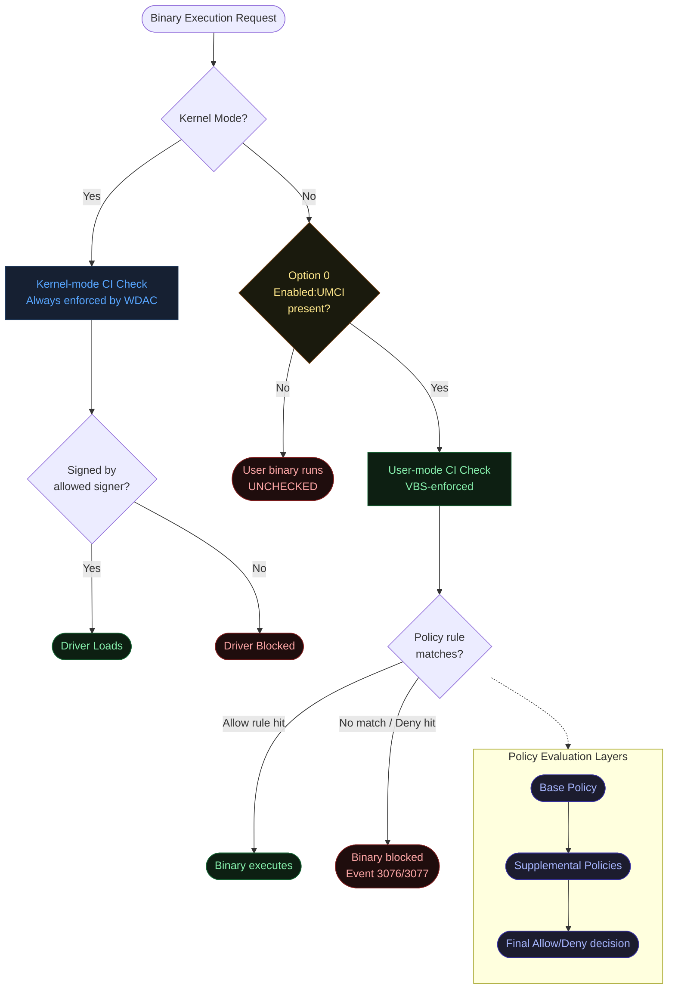
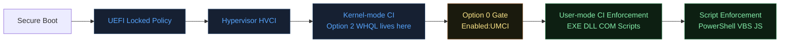
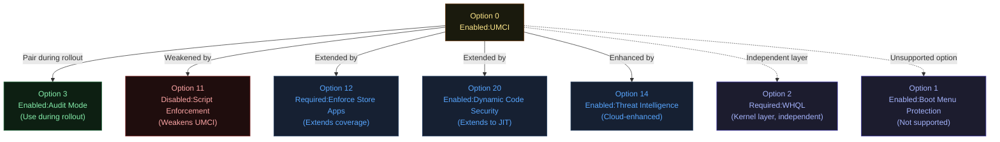
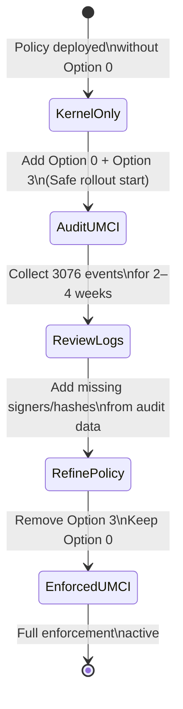
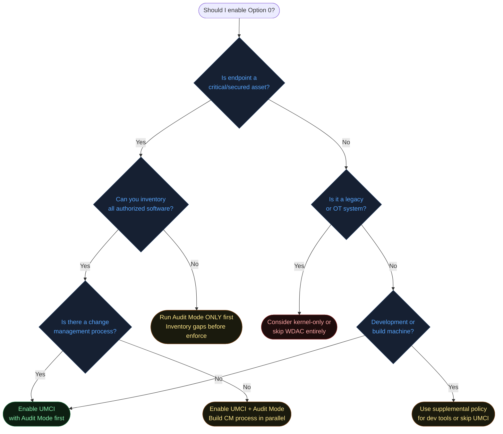
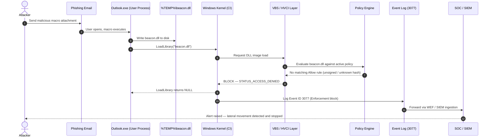
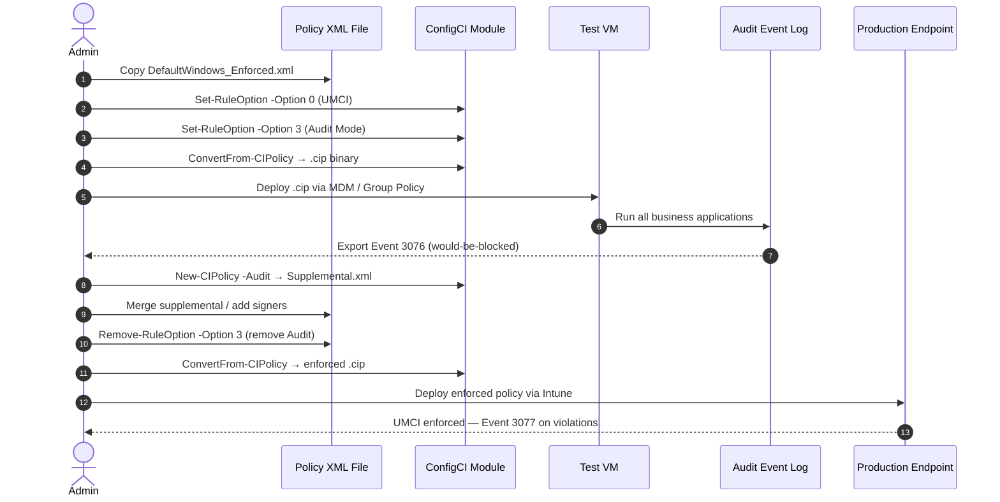
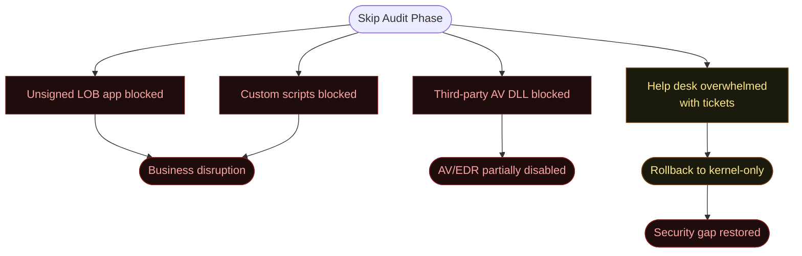
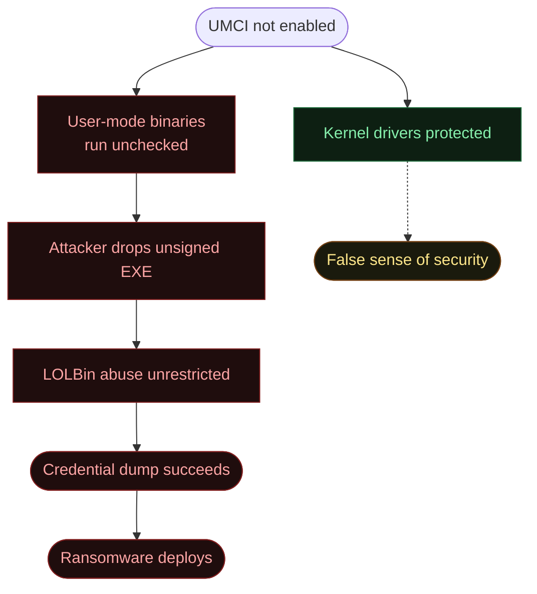

# Option 0 — Enabled:UMCI (User Mode Code Integrity)

**Author:** Anubhav Gain
**Category:** Endpoint Security
**Policy Rule Value:** `Enabled:UMCI`
**Rule Index:** 0
**Valid for Supplemental Policies:** No

---

## Table of Contents

1. [What It Does](#1-what-it-does)
2. [Why It Exists](#2-why-it-exists)
3. [Visual Anatomy — Policy Evaluation Stack](#3-visual-anatomy--policy-evaluation-stack)
4. [How to Set It (PowerShell)](#4-how-to-set-it-powershell)
5. [XML Representation](#5-xml-representation)
6. [Interaction with Other Options](#6-interaction-with-other-options)
7. [When to Enable vs Disable](#7-when-to-enable-vs-disable)
8. [Real-World Scenario — End-to-End Walkthrough](#8-real-world-scenario--end-to-end-walkthrough)
9. [What Happens If You Get It Wrong](#9-what-happens-if-you-get-it-wrong)
10. [Valid for Supplemental Policies?](#10-valid-for-supplemental-policies)
11. [OS Version Requirements](#11-os-version-requirements)
12. [Summary Table](#12-summary-table)

---

## 1. What It Does

**Enabled:UMCI** extends Windows Defender Application Control (WDAC / App Control for Business) enforcement from kernel-mode code down into the full user-mode execution space. Without this option, WDAC only validates drivers and other kernel-mode binaries — the hypervisor-protected layer that prevents unsigned code from loading into the Windows kernel. When you add `Enabled:UMCI`, the same policy rules are applied to every user-mode executable (`.exe`), dynamic-link library (`.dll`), COM object, packaged app, script host, and managed binary that is launched on the endpoint. The Virtualization-Based Security (VBS) Code Integrity component evaluates each binary against the allowed signers, hashes, and file attributes specified in the active policy; any binary that cannot satisfy at least one allow rule is blocked before it executes. This single rule option is the gateway that transforms WDAC from a kernel-only guardrail into a full application-whitelisting platform.

---

## 2. Why It Exists

### The Security Problem It Solves

Before WDAC, organizations relied on software restriction policies (SRP) or AppLocker to control which applications could run in user space. Both technologies have well-documented bypass paths: AppLocker can be circumvented by placing binaries in writable directories included in its path rules, or by exploiting trusted installers. SRP has even weaker enforcement. Neither uses hardware-backed integrity checking.

Meanwhile, the most dangerous attacker activity — lateral movement tools, credential dumpers, ransomware payloads, living-off-the-land binaries (LOLBins) — executes entirely in user mode. A policy that only protects the kernel leaves the entire user-mode attack surface unguarded.

`Enabled:UMCI` solves this by:

- **Closing the user-mode attack surface.** Every PE image that tries to map an executable section into a process must pass Code Integrity checks before the kernel grants execute permission.
- **Defeating LOLBin abuse.** Legitimate binaries like `wscript.exe`, `mshta.exe`, or `regsvr32.exe` can be permit-listed narrowly. Unsigned or unexpected payloads dropped by those hosts are blocked.
- **Enabling script enforcement.** Combined with Option 11 (Enabled:Script Enforcement, implicit when UMCI is on for WDAC v2), PowerShell, VBScript, and JScript are also policy-gated.
- **Complying with NIST SP 800-167, CIS Controls, and ACSC Essential Eight.** Application whitelisting at the user-mode layer is explicitly required by each of these frameworks for the highest maturity tiers.

---

## 3. Visual Anatomy — Policy Evaluation Stack



### Where Option 0 Sits in the Stack



---

## 4. How to Set It (PowerShell)

### Prerequisites

```powershell
# Requires the ConfigCI module (Windows 10/11 Enterprise or Education)
# Must run as Administrator
Import-Module ConfigCI
```

### Enable UMCI on an Existing Policy File

```powershell
# Enable Option 0 (adds Enabled:UMCI to the policy)
Set-RuleOption -FilePath "C:\Policies\MyBasePolicy.xml" -Option 0
```

### Remove UMCI (Revert to Kernel-Only Enforcement)

```powershell
# Remove Option 0 (policy reverts to kernel-mode-only enforcement)
Set-RuleOption -FilePath "C:\Policies\MyBasePolicy.xml" -Option 0 -Delete
```

### Create a New Policy with UMCI Enabled from the Start

```powershell
# Start from the DefaultWindows template (already includes UMCI)
$PolicyPath = "C:\Policies\Enforced_UMCI.xml"
Copy-Item "$env:SystemRoot\schemas\CodeIntegrity\ExamplePolicies\DefaultWindows_Enforced.xml" $PolicyPath

# Verify Option 0 is present
(Get-Content $PolicyPath) | Select-String "UMCI"

# Set the policy GUID and version
Set-CIPolicyIdInfo -FilePath $PolicyPath -PolicyName "Corp Baseline" -PolicyId (New-Guid).Guid
Set-HVCIOptions -Strict -FilePath $PolicyPath
```

### Compile and Deploy

```powershell
# Compile XML to binary
$BinPath = "C:\Policies\Enforced_UMCI.bin"
ConvertFrom-CIPolicy -XmlFilePath $PolicyPath -BinaryFilePath $BinPath

# Deploy (SiPolicy.p7 for legacy single-policy)
Copy-Item $BinPath "$env:SystemRoot\System32\CodeIntegrity\SiPolicy.p7b"

# For GUID-based multi-policy deployment
$GuidBin = "C:\Windows\System32\CodeIntegrity\CiPolicies\Active\{<PolicyGUID>}.cip"
Copy-Item $BinPath $GuidBin

# Refresh (no reboot required for update, reboot required for first enable)
& citool.exe --update-policy $BinPath
```

### Audit First Workflow

```powershell
# Step 1 — Enable Option 3 (Audit Mode) alongside Option 0
Set-RuleOption -FilePath $PolicyPath -Option 3   # Audit mode
Set-RuleOption -FilePath $PolicyPath -Option 0   # UMCI

# Step 2 — Deploy, collect logs, review 3076 events
Get-WinEvent -LogName "Microsoft-Windows-CodeIntegrity/Operational" |
    Where-Object Id -eq 3076 |
    Select-Object TimeCreated, Message |
    Export-Csv "$env:USERPROFILE\Desktop\umci_audit.csv" -NoTypeInformation

# Step 3 — Build supplemental from audit log
$AuditEvents = New-CIPolicy -Audit -Level FilePublisher -Fallback Hash -UserPEs `
    -FilePath "C:\Policies\Supplemental_Audit.xml"

# Step 4 — Remove Audit Mode, leave UMCI
Set-RuleOption -FilePath $PolicyPath -Option 3 -Delete
```

---

## 5. XML Representation

### Option 0 Present in Policy XML

```xml
<?xml version="1.0" encoding="utf-8"?>
<SiPolicy xmlns="urn:schemas-microsoft-com:sipolicy" PolicyType="Base Policy">

  <!-- Policy metadata -->
  <VersionEx>10.0.0.0</VersionEx>
  <PolicyTypeID>{A244370E-44C9-4C06-B551-F6016E563076}</PolicyTypeID>
  <PlatformID>{2E07F7E4-194C-4D20-B96C-1498495910E7}</PlatformID>

  <Rules>
    <!-- Option 0: Enabled:UMCI — enforces policy on user-mode binaries -->
    <Rule>
      <Option>Enabled:UMCI</Option>
    </Rule>

    <!-- Other rules follow... -->
    <Rule>
      <Option>Enabled:Audit Mode</Option>
    </Rule>
    <Rule>
      <Option>Required:WHQL</Option>
    </Rule>
  </Rules>

  <!-- Signers, FileRules, etc. -->

</SiPolicy>
```

### Option 0 Absent (Kernel-Only Mode)

```xml
<Rules>
  <!-- NO Enabled:UMCI entry = user-mode binaries are NOT checked -->
  <Rule>
    <Option>Required:WHQL</Option>
  </Rule>
</Rules>
```

### Verifying Presence via PowerShell

```powershell
# Parse the XML and check for the option
[xml]$Policy = Get-Content "C:\Policies\MyBasePolicy.xml"
$ns = New-Object System.Xml.XmlNamespaceManager($Policy.NameTable)
$ns.AddNamespace("si", "urn:schemas-microsoft-com:sipolicy")
$rules = $Policy.SelectNodes("//si:Rule/si:Option", $ns) | Select-Object -ExpandProperty '#text'
if ($rules -contains "Enabled:UMCI") {
    Write-Host "UMCI is ENABLED" -ForegroundColor Green
} else {
    Write-Host "UMCI is DISABLED (kernel-only)" -ForegroundColor Red
}
```

---

## 6. Interaction with Other Options

### Option Relationship Matrix

| Option | Name | Relationship with UMCI |
|--------|------|------------------------|
| 3 | Enabled:Audit Mode | **Companion** — pair during rollout to log without blocking |
| 6 | Enabled:Unsigned System Integrity Policy | Unrelated (signing of policy itself) |
| 9 | Enabled:Advanced Boot Options Menu | Unrelated |
| 10 | Enabled:Boot Audit on Failure | Unrelated |
| 11 | Disabled:Script Enforcement | **Conflict** — disables script checks that UMCI enables |
| 12 | Required:Enforce Store Applications | **Extends** UMCI coverage to MSIX packages |
| 14 | Enabled:Threat Intelligence | **Enhances** UMCI with cloud reputation |
| 16 | Enabled:Update Policy No Reboot | Deployment helper, neutral |
| 20 | Enabled:Dynamic Code Security | **Extends** UMCI to JIT-compiled code |

### Interaction Diagram



### The UMCI + Audit Mode Lifecycle



---

## 7. When to Enable vs Disable



### Decision Reference Table

| Scenario | Recommendation |
|----------|---------------|
| Corporate managed endpoint (standard user) | **Enable UMCI** — highest priority |
| Executive / VIP workstation | **Enable UMCI** — zero-tolerance posture |
| Developer workstation | **Audit mode first**, then scoped supplemental |
| OT / SCADA system | Evaluate carefully; legacy drivers may break |
| Kiosk / locked-down device | **Enable UMCI** — ideal use case |
| Domain controller | **Enable UMCI** — critical infrastructure |
| CI/CD build server | Consider **kernel-only** or tightly scoped UMCI |
| Air-gapped system | **Enable UMCI** — no internet needed |

---

## 8. Real-World Scenario — End-to-End Walkthrough

### Scenario: Ransomware Lateral Movement Blocked by UMCI

An attacker compromises a phishing-vulnerable endpoint and drops a Cobalt Strike beacon (`beacon.dll`) into `%TEMP%`. Without UMCI, the DLL loads freely. With UMCI enabled, every DLL must match a policy rule.



### Policy Preparation Walkthrough



---

## 9. What Happens If You Get It Wrong

### Scenario A: UMCI Enabled Without Audit Phase



### Scenario B: UMCI Disabled on Critical Asset



### Misconfig Consequences Summary

| Mistake | Impact | Severity |
|---------|--------|----------|
| Enable UMCI without audit phase | LOB apps / scripts break | High — operational outage |
| Forget to include AV/EDR DLLs in policy | EDR partially non-functional | Critical — security blind spot |
| Deploy to unsigned policy | Policy ignored if UEFI lock enabled | High — policy bypass |
| Remove UMCI from enforced policy | Full user-mode attack surface reopens | Critical |
| Enable UMCI without HVCI | UMCI weakened (can be bypassed via kernel exploit) | Medium |

---

## 10. Valid for Supplemental Policies?

**No.** `Enabled:UMCI` is **not valid** in supplemental policies. It is a base-policy-only rule option that controls the fundamental enforcement scope of the entire Code Integrity engine. Supplemental policies can only extend the allow rules of the base policy (additional signers, hashes, paths) — they cannot change the enforcement mode or scope.

Attempting to set Option 0 in a supplemental policy will either be silently ignored or cause a policy merge error. The enforcement boundary is always determined by the base policy.

**Reference:** `PolicyType="Supplemental Policy"` in the XML schema explicitly restricts which `<Option>` values are honored.

---

## 11. OS Version Requirements

| Windows Version | Support Level |
|----------------|--------------|
| Windows 10 1507 (TH1) | Kernel-mode CI only; UMCI introduced in 1607 |
| Windows 10 1607 (Anniversary Update) | **First full UMCI support** |
| Windows 10 1703+ | UMCI stable; script enforcement added |
| Windows 10 1903+ | Dynamic Code Security (Option 20) extends UMCI |
| Windows 11 21H2+ | Full support; improved audit tooling |
| Windows 11 22H2+ | Enhanced supplemental policy merge |
| Windows Server 2016 | Supported |
| Windows Server 2019+ | Supported; recommended for DC hardening |
| Windows Server 2022 | Supported; HVCI on by default on new installs |

> **Note:** UMCI is most effective when paired with **Virtualization-Based Security (VBS) / HVCI**. Without HVCI, a kernel-level exploit could bypass UMCI checks. With HVCI, the Code Integrity checks run in the isolated VBS environment, making them tamper-resistant.

---

## 12. Summary Table

| Attribute | Value |
|-----------|-------|
| Rule Option Name | `Enabled:UMCI` |
| Rule Option Index | 0 |
| Default State | **Disabled** (kernel-only) |
| Effect when Enabled | WDAC enforces on all user-mode PE images, DLLs, COM objects, scripts |
| Effect when Disabled | Only kernel-mode drivers are checked |
| Valid in Base Policy | **Yes** |
| Valid in Supplemental Policy | **No** |
| Requires Reboot on First Enable | **Yes** |
| Requires Reboot on Update | No (for policy updates after first enable) |
| Paired Best With | Option 3 (Audit Mode) during rollout |
| Conflicts With | Option 11 (Disabled:Script Enforcement) weakens coverage |
| Minimum OS Version | Windows 10 1607 / Server 2016 |
| PowerShell Cmdlet (Enable) | `Set-RuleOption -FilePath <xml> -Option 0` |
| PowerShell Cmdlet (Disable) | `Set-RuleOption -FilePath <xml> -Option 0 -Delete` |
| Event ID (Audit Block) | **3076** |
| Event ID (Enforce Block) | **3077** |
| Event Log Location | `Microsoft-Windows-CodeIntegrity/Operational` |
| Security Framework Alignment | NIST SP 800-167, CIS Controls v8 (Control 2), ACSC Essential Eight (App Control ML3) |
