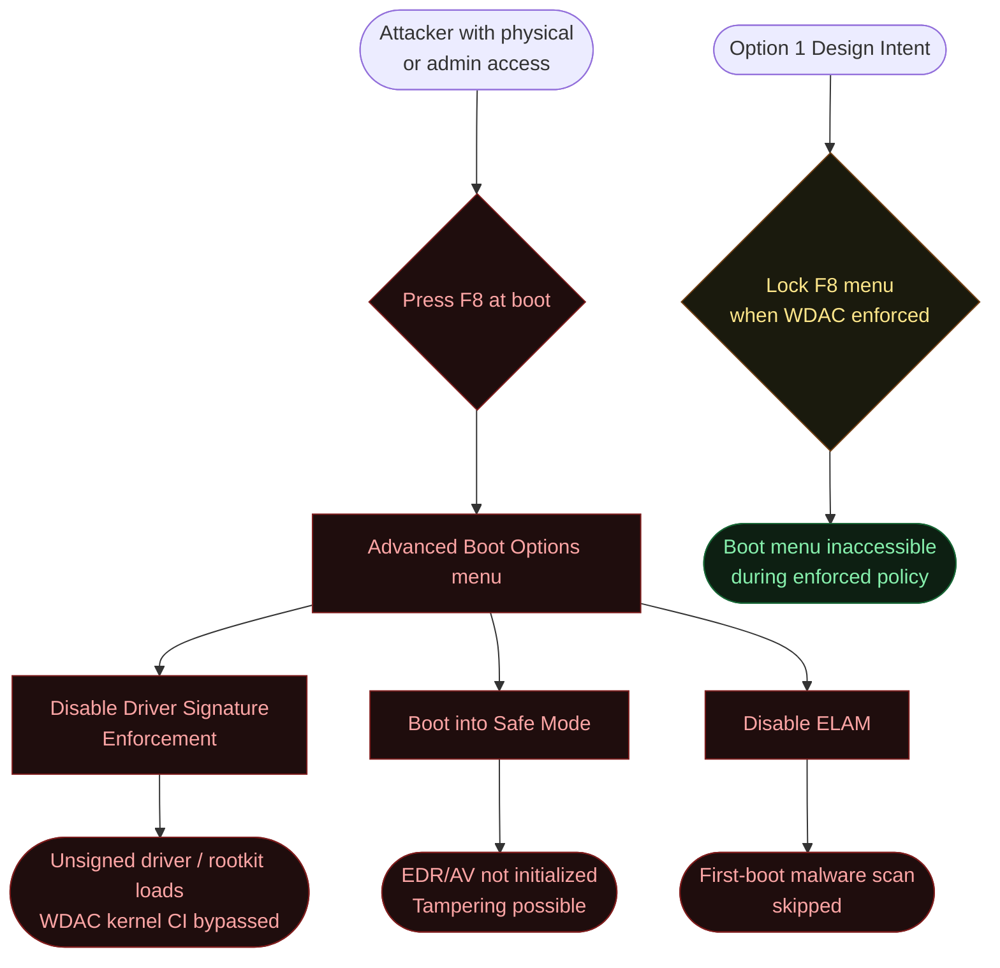
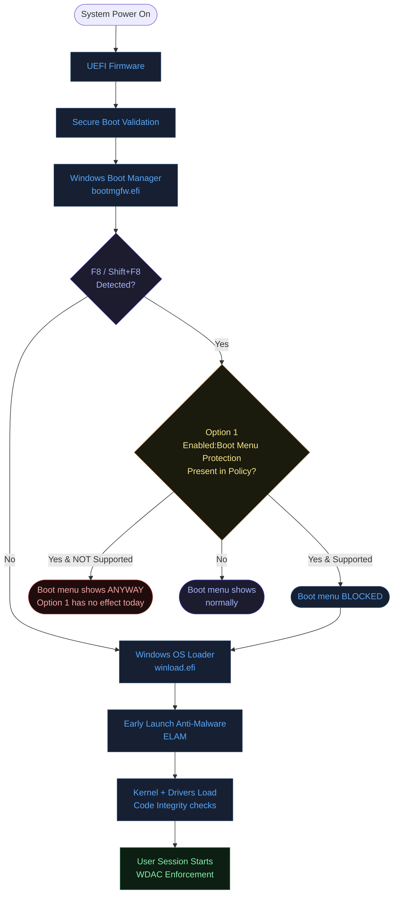
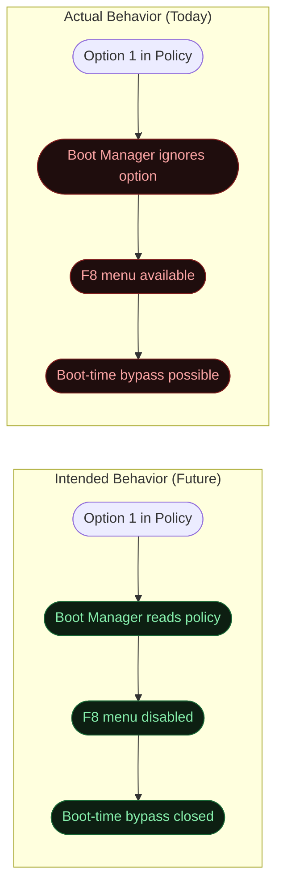
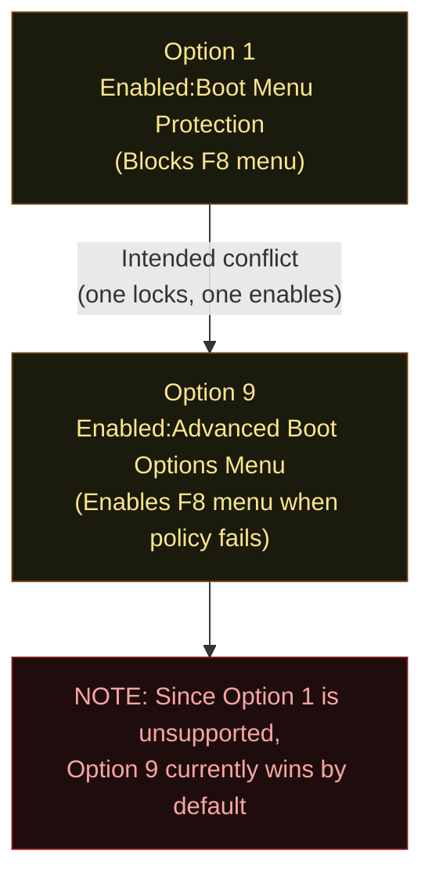
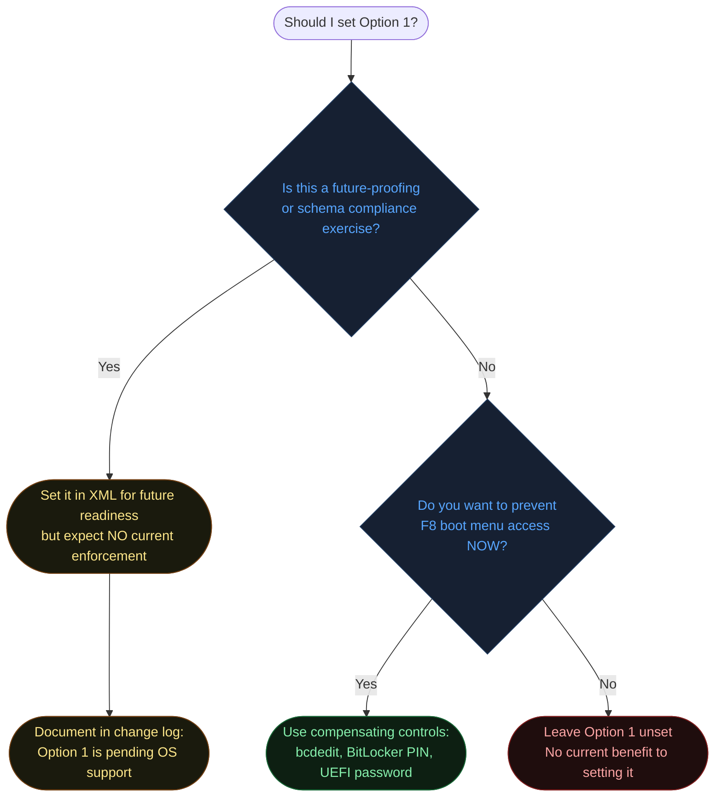
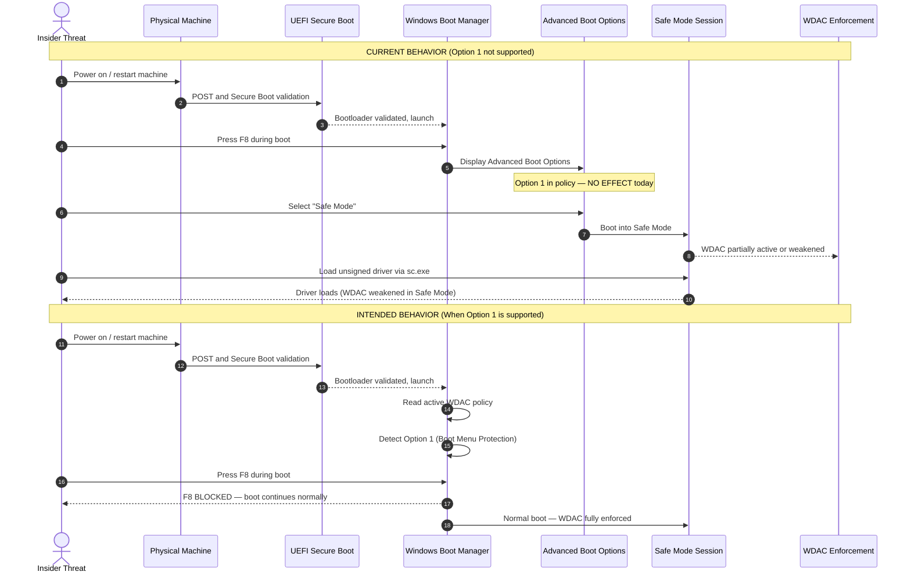
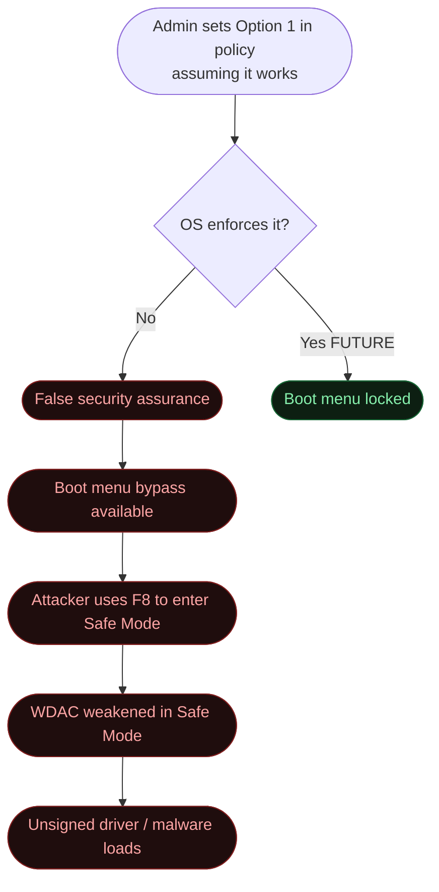

# Option 1 — Enabled:Boot Menu Protection

**Author:** Anubhav Gain
**Category:** Endpoint Security
**Policy Rule Value:** `Enabled:Boot Menu Protection`
**Rule Index:** 1
**Valid for Supplemental Policies:** No
**Current Support Status:** Not currently supported by Windows

---

## Table of Contents

1. [What It Does](#1-what-it-does)
2. [Why It Exists](#2-why-it-exists)
3. [Visual Anatomy — Policy Evaluation Stack](#3-visual-anatomy--policy-evaluation-stack)
4. [How to Set It (PowerShell)](#4-how-to-set-it-powershell)
5. [XML Representation](#5-xml-representation)
6. [Interaction with Other Options](#6-interaction-with-other-options)
7. [When to Enable vs Disable](#7-when-to-enable-vs-disable)
8. [Real-World Scenario — End-to-End Walkthrough](#8-real-world-scenario--end-to-end-walkthrough)
9. [What Happens If You Get It Wrong](#9-what-happens-if-you-get-it-wrong)
10. [Valid for Supplemental Policies?](#10-valid-for-supplemental-policies)
11. [OS Version Requirements](#11-os-version-requirements)
12. [Summary Table](#12-summary-table)

---

## 1. What It Does

`Enabled:Boot Menu Protection` is a WDAC / App Control for Business policy rule option with the index value 1 that, **in its intended design**, would prevent users from interrupting the boot sequence to access the Windows Advanced Boot Options menu — the menu that presents recovery options such as Safe Mode, Disable Driver Signature Enforcement, and Enable Low-Resolution Video. Accessing these options is a known pathway to bypassing code integrity enforcement because Safe Mode loads a minimal set of drivers and can disable or weaken Code Integrity policies. The intent of this option is to close that boot-time bypass by locking out the `F8`/`Shift+F8` interrupt that normally surfaces the boot menu.

**However, this option is currently not supported.** Microsoft has defined the rule option in the WDAC schema and tooling, assigned it an index, and documented it in the policy XML specification, but the underlying operating system does not yet implement the enforcement behavior. Setting this option in a policy XML has no observable effect on the boot menu behavior at runtime. The option is reserved for a future Windows release.

Despite being non-functional today, it is important to understand its design intent, placement in the boot trust chain, and what compensating controls exist in the current OS to achieve the same goal through other means (Secure Boot configuration, BitLocker lockout policies, and UEFI password protection).

---

## 2. Why It Exists

### The Boot-Time Attack Vector

The Windows Advanced Boot Options menu (`F8` during boot) is one of the few remaining user-accessible pathways to modify kernel behavior after Secure Boot has handed control to the Windows Boot Manager. Specifically:

- **"Disable Driver Signature Enforcement"** — Temporarily disables kernel-mode code integrity for the duration of that boot session. An attacker or privileged user can use this option to load unsigned drivers, rootkits, or kernel-level implants that would otherwise be blocked by WDAC.
- **Safe Mode** — Loads a minimal driver set and may start fewer security services. Some EDR/AV products do not fully initialize in Safe Mode, creating a window for tampering.
- **Startup Settings → Disable Early Launch Antimalware** — Disables ELAM protection, removing the first-boot malware scan.

### The Threat Model



### Why a Dedicated Option Is Needed

Secure Boot alone does not prevent F8 boot menu access — it only validates the bootloader signature before handing control to the Windows Boot Manager. Once the signed bootloader is running, it provides the `F8` pathway as a user convenience feature. Revoking that convenience programmatically, through the active Code Integrity policy, was the architectural goal of Option 1.

---

## 3. Visual Anatomy — Policy Evaluation Stack



### Current Reality vs Intended Design



---

## 4. How to Set It (PowerShell)

Although the option has no runtime effect today, the PowerShell syntax is defined and functional for XML manipulation. It is documented here for completeness and future readiness.

### Set Option 1 (No-Op Today)

```powershell
# Enable Option 1 — no effect on current Windows versions
Set-RuleOption -FilePath "C:\Policies\MyBasePolicy.xml" -Option 1
```

### Remove Option 1

```powershell
# Remove Option 1
Set-RuleOption -FilePath "C:\Policies\MyBasePolicy.xml" -Option 1 -Delete
```

### Verify the Option Is Present in Policy XML

```powershell
[xml]$Policy = Get-Content "C:\Policies\MyBasePolicy.xml"
$ns = New-Object System.Xml.XmlNamespaceManager($Policy.NameTable)
$ns.AddNamespace("si", "urn:schemas-microsoft-com:sipolicy")
$rules = $Policy.SelectNodes("//si:Rule/si:Option", $ns) | Select-Object -ExpandProperty '#text'
if ($rules -contains "Enabled:Boot Menu Protection") {
    Write-Host "Option 1 (Boot Menu Protection) is SET in policy XML" -ForegroundColor Yellow
    Write-Host "NOTE: This option has no effect on current Windows versions." -ForegroundColor Red
} else {
    Write-Host "Option 1 is not set." -ForegroundColor Gray
}
```

### Compensating Controls (Current Best Practice)

Since Option 1 is non-functional, the following compensating controls achieve the equivalent security goal today:

```powershell
# 1. Disable F8 boot menu via bcdedit (disables Advanced Options prompt)
bcdedit /set {bootmgr} displaybootmenu no
bcdedit /set {default} bootmenupolicy standard

# 2. Set a short boot timeout (prevents F8 window)
bcdedit /timeout 0

# 3. Require BitLocker PIN at boot (physical access attack mitigated)
# Enable BitLocker with TPM+PIN:
Enable-BitLocker -MountPoint "C:" -TpmAndPinProtector -Pin (Read-Host -AsSecureString "Enter PIN")

# 4. Lock UEFI settings with administrator password (prevent boot order change)
# (Done via UEFI firmware interface — no PowerShell API)

# 5. Verify HVCI is enabled (makes kernel CI tamper-resistant)
$hvci = Get-CimInstance -ClassName Win32_DeviceGuard -Namespace root\Microsoft\Windows\DeviceGuard
$hvci.SecurityServicesRunning  # Should include 2 (HVCI)
```

---

## 5. XML Representation

### Option 1 Present in Policy XML

```xml
<?xml version="1.0" encoding="utf-8"?>
<SiPolicy xmlns="urn:schemas-microsoft-com:sipolicy" PolicyType="Base Policy">

  <VersionEx>10.0.0.0</VersionEx>
  <PolicyTypeID>{A244370E-44C9-4C06-B551-F6016E563076}</PolicyTypeID>

  <Rules>
    <!-- Option 0: UMCI -->
    <Rule>
      <Option>Enabled:UMCI</Option>
    </Rule>

    <!-- Option 1: Boot Menu Protection — defined but NOT currently supported -->
    <!-- Setting this has NO EFFECT on current Windows versions              -->
    <Rule>
      <Option>Enabled:Boot Menu Protection</Option>
    </Rule>

    <!-- Other rules... -->
  </Rules>

</SiPolicy>
```

### XML Schema Reference

The WDAC XML schema (`sipolicy.xsd`) includes `Enabled:Boot Menu Protection` as a valid enumeration value in the `RuleOptionType` simple type. This is why `Set-RuleOption` accepts it without error and `ConvertFrom-CIPolicy` produces a valid binary. The binary compiler includes the option bit in the compiled policy, but the boot manager does not yet read or act on that bit.

---

## 6. Interaction with Other Options

### Option Relationship Matrix

| Option | Name | Relationship with Option 1 |
|--------|------|---------------------------|
| 0 | Enabled:UMCI | Independent; UMCI is user-mode enforcement, Option 1 is boot-time |
| 2 | Required:WHQL | Independent; WHQL is driver signing, Option 1 is boot menu access |
| 3 | Enabled:Audit Mode | Independent; audit mode does not affect boot menu |
| 9 | Enabled:Advanced Boot Options Menu | **Direct counterpart** — Option 9 explicitly enables the advanced boot menu; intended conflict with Option 1 |
| 10 | Enabled:Boot Audit on Failure | Related — both operate in the boot trust chain |

### Interaction with Option 9



---

## 7. When to Enable vs Disable



### Decision Reference Table

| Scenario | Recommendation |
|----------|---------------|
| High-security endpoint requiring boot menu lockout | Use bcdedit + BitLocker PIN (compensating controls) |
| Future OS compatibility preparation | Set Option 1 in base policy with documentation note |
| Standard enterprise rollout | Omit Option 1; no current benefit |
| Research / lab environment testing future features | Set Option 1 to observe when OS support arrives |
| Compliance requirement citing "boot menu protection" | Implement via compensating controls; note Option 1 gap in risk register |

---

## 8. Real-World Scenario — End-to-End Walkthrough

### Scenario: Insider Threat Attempts Safe Mode Bypass

An insider with physical access to an endpoint attempts to bypass WDAC enforcement by booting into Safe Mode to load an unsigned driver and exfiltrate data. This walkthrough shows current behavior vs intended behavior.



### Current Compensating Control Walkthrough

```mermaid
sequenceDiagram
    autonumber
    actor Admin
    participant Endpoint as Endpoint Machine
    participant bcdedit as bcdedit Tool
    participant BitLocker as BitLocker Service
    participant UEFI as UEFI Firmware

    Admin ->> bcdedit: bcdedit /set {bootmgr} displaybootmenu no
    bcdedit -->> Admin: Boot menu timeout suppressed
    Admin ->> bcdedit: bcdedit /timeout 0
    bcdedit -->> Admin: Zero-second boot timeout set
    Admin ->> BitLocker: Enable-BitLocker with TPM+PIN protector
    BitLocker -->> Admin: Drive encrypted; PIN required at boot
    Admin ->> UEFI: Set UEFI administrator password
    UEFI -->> Admin: UEFI settings locked
    Admin ->> Endpoint: Verify: attempt F8 at next boot
    Endpoint -->> Admin: Boot proceeds directly to Windows
    Note over Admin,UEFI: Option 1 effect achieved via compensating controls
```

---

## 9. What Happens If You Get It Wrong

### Misunderstanding: Assuming Option 1 Works Today



### Misunderstanding: Not Knowing It Is Non-Functional

An organization includes Option 1 in their WDAC baseline policy believing it closes the boot menu bypass vector. Their security audit passes because the policy XML contains the option. However, the control is not actually enforced, creating a compliance gap and a real security hole.

**Mitigation:** Always document Option 1 as "pending OS support" in your policy change log, and implement the bcdedit + BitLocker + UEFI compensating controls to achieve the actual security objective.

### Misconfig Consequences Summary

| Mistake | Impact | Severity |
|---------|--------|----------|
| Relying on Option 1 without compensating controls | Boot menu bypass unclosed | Critical — unmitigated bypass |
| Setting Option 1 thinking it blocks F8 today | False security posture | High — compliance gap |
| Not documenting Option 1 as non-functional | Audit findings at security review | Medium |
| Not implementing bcdedit compensating controls | Boot-time attack surface open | High |

---

## 10. Valid for Supplemental Policies?

**No.** `Enabled:Boot Menu Protection` is defined as a base-policy-only option. Even if it were supported by the OS, its effect would need to apply at the boot manager level before any user or tenant context is established — a point in the boot sequence where supplemental policies (which extend base policies at runtime) have no relevance. Supplemental policies are merged into the base policy by the Code Integrity engine after the kernel loads; they cannot retroactively affect the boot manager's behavior.

---

## 11. OS Version Requirements

| Windows Version | Status |
|----------------|--------|
| Windows 10 (all versions to date) | **Not supported** — option defined but not enforced |
| Windows 11 (all versions to date) | **Not supported** — same status |
| Windows Server 2016–2022 | **Not supported** |
| Future Windows release (TBD) | **Pending implementation** by Microsoft |

> **Official Microsoft Guidance:** "This option isn't currently supported." — Windows App Control for Business documentation.

### Why It Appears in Tooling Despite Being Unsupported

The rule option schema is versioned independently of OS enforcement capability. Microsoft pre-registers options in the schema to allow policy authors to future-proof their XML, enabling a smooth transition when OS support is eventually added without requiring policy rewrites. Setting the option today ensures the binary policy will automatically take effect once the OS gains enforcement support — provided the policy is redeployed or remains active.

---

## 12. Summary Table

| Attribute | Value |
|-----------|-------|
| Rule Option Name | `Enabled:Boot Menu Protection` |
| Rule Option Index | 1 |
| Default State | **Not set** |
| Current OS Enforcement | **None — not yet supported** |
| Intended Effect when Enabled | Block F8 / Advanced Boot Options menu during enforced WDAC boot |
| Intended Effect when Disabled | Advanced Boot Options accessible (default behavior) |
| Valid in Base Policy | **Yes** (syntactically valid, semantically no-op) |
| Valid in Supplemental Policy | **No** |
| Requires Reboot | N/A (no effect) |
| Compensating Controls | bcdedit displaybootmenu no, bcdedit /timeout 0, BitLocker TPM+PIN, UEFI password |
| Option 9 Relationship | Direct counterpart — Option 9 enables boot menu, Option 1 intended to disable it |
| Minimum OS Version for Enforcement | Unknown — future Windows release |
| PowerShell Cmdlet (Set) | `Set-RuleOption -FilePath <xml> -Option 1` |
| PowerShell Cmdlet (Remove) | `Set-RuleOption -FilePath <xml> -Option 1 -Delete` |
| Risk if Misconstrued as Working | Critical — unmitigated boot-time bypass pathway |
| Documentation Status | Pre-registered in schema; enforcement pending |
