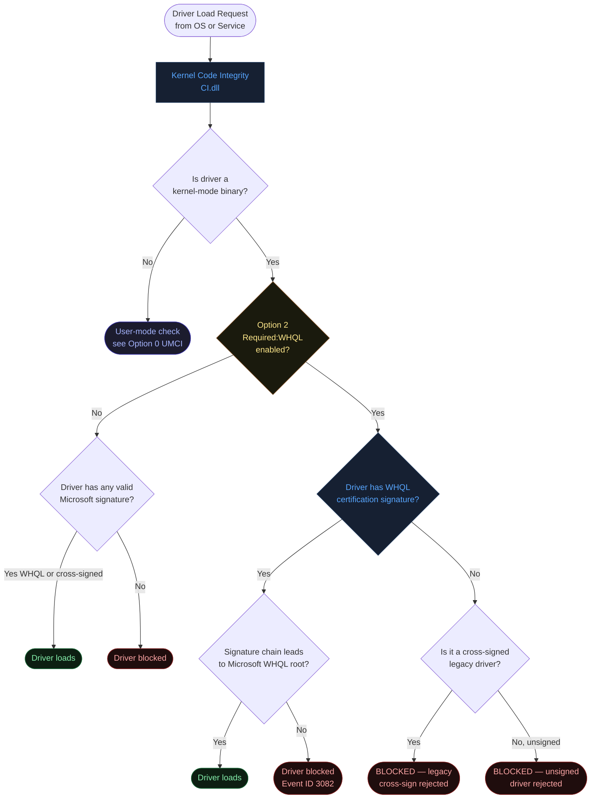
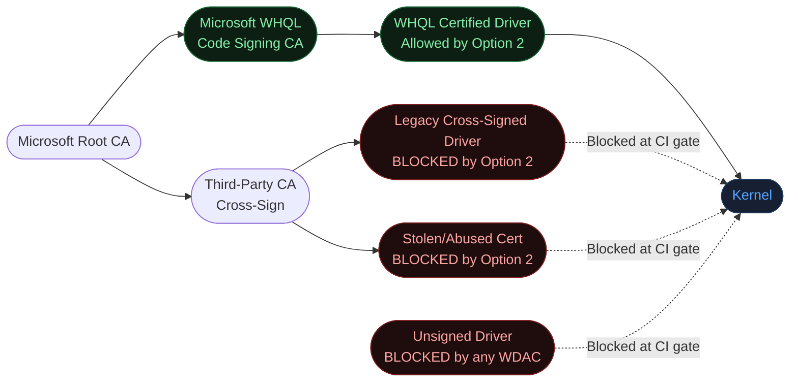
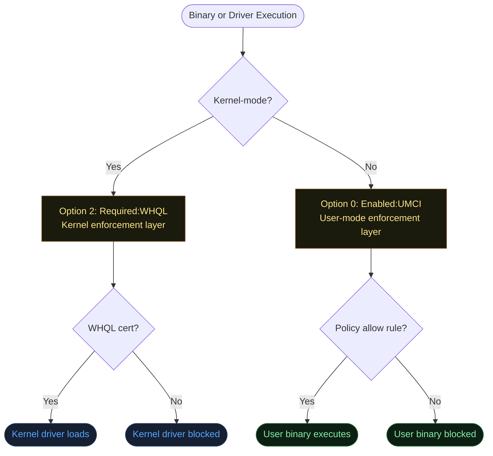
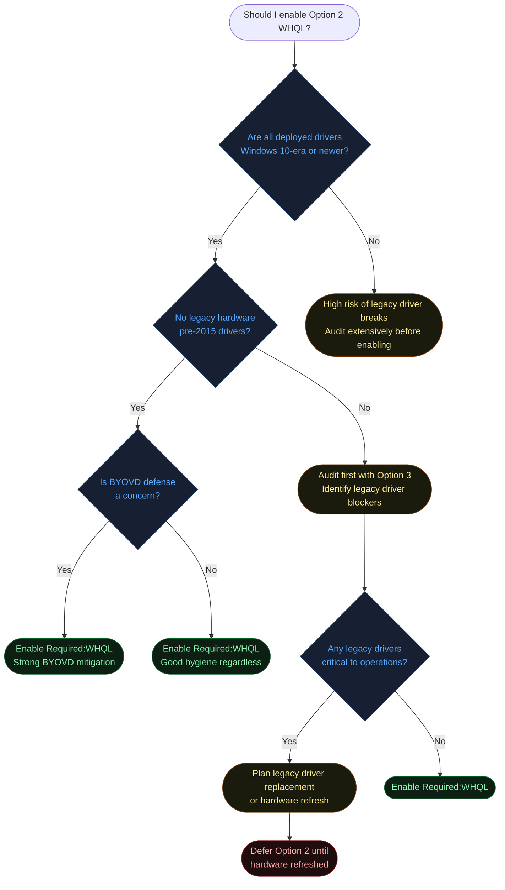
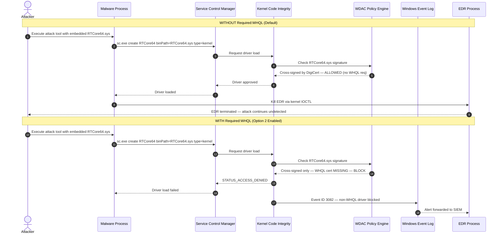
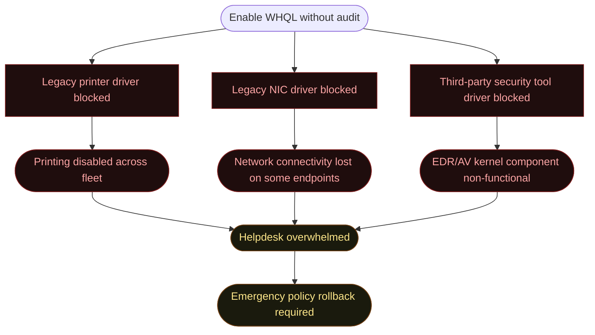

# Option 2 — Required:WHQL (Windows Hardware Quality Labs Certification)

**Author:** Anubhav Gain
**Category:** Endpoint Security
**Policy Rule Value:** `Required:WHQL`
**Rule Index:** 2
**Valid for Supplemental Policies:** No

---

## Table of Contents

1. [What It Does](#1-what-it-does)
2. [Why It Exists](#2-why-it-exists)
3. [Visual Anatomy — Policy Evaluation Stack](#3-visual-anatomy--policy-evaluation-stack)
4. [How to Set It (PowerShell)](#4-how-to-set-it-powershell)
5. [XML Representation](#5-xml-representation)
6. [Interaction with Other Options](#6-interaction-with-other-options)
7. [When to Enable vs Disable](#7-when-to-enable-vs-disable)
8. [Real-World Scenario — End-to-End Walkthrough](#8-real-world-scenario--end-to-end-walkthrough)
9. [What Happens If You Get It Wrong](#9-what-happens-if-you-get-it-wrong)
10. [Valid for Supplemental Policies?](#10-valid-for-supplemental-policies)
11. [OS Version Requirements](#11-os-version-requirements)
12. [Summary Table](#12-summary-table)

---

## 1. What It Does

`Required:WHQL` tightens the kernel-mode driver signing standard from the broader Microsoft-signed requirement to the stricter **Windows Hardware Quality Labs (WHQL) certification** standard. By default, WDAC (and Windows Driver Signing policy in general) allows any kernel-mode driver that carries a valid Microsoft signature — including drivers cross-signed by third-party Certificate Authorities under the legacy cross-signing program. When `Required:WHQL` is enabled, that broader acceptance is revoked: only drivers that have been formally submitted to, tested by, and signed through the **Windows Hardware Developer Center (WHDC)** portal and the Hardware Lab Kit (HLK) certification pipeline are permitted to load. This effectively eliminates legacy cross-signed drivers and imposes a strict quality and security gate at the kernel boundary. Every kernel driver loading on the machine must carry an authentic Microsoft WHQL signature to pass the Code Integrity check.

---

## 2. Why It Exists

### The Driver Supply-Chain Problem

Kernel-mode drivers operate at the highest privilege level in Windows — Ring 0. A malicious or compromised driver can read any memory, disable security software, intercept system calls, and persist invisibly across reboots. The kernel attack surface is the primary target for:

- **BYOVD (Bring Your Own Vulnerable Driver)** attacks — Attackers package legitimate but vulnerable signed drivers and exploit them to escalate privileges or kill EDR/AV processes.
- **Kernel-mode rootkits** — Malware that signs drivers through stolen or fraudulently obtained certificates and abuses the legacy cross-signing pathway.
- **Driver-based persistence** — Implants that survive OS reinstalls by hiding in driver storage.

### Why the Legacy Cross-Signing System Is a Risk

Before 2015, Microsoft allowed hardware vendors to sign their own drivers with certificates issued by trusted third-party CAs (Symantec, DigiCert, etc.) without submitting to WHQL testing. This "cross-signed" driver model had two problems:

1. **No quality gate.** Cross-signed drivers were not tested by Microsoft's HLK suite. Vendors could ship unstable, insecure, or intentionally malicious drivers and they would load on Windows.
2. **Certificate theft/abuse.** Malware authors obtained (or stole) valid cross-signing certificates and used them to legitimately sign rootkits and BYOVD payloads.

Microsoft deprecated new cross-signed drivers for 64-bit Windows 10+ in 2015, requiring WHQL submission for new drivers. However, pre-existing cross-signed drivers grandfathered under the old system remain trusted by default. `Required:WHQL` revokes that grandfather clause for the machines where it is deployed.

### WHQL Security Properties

```mermaid
flowchart TD
    classDef secure fill:#0d1f12,color:#86efac,stroke:#166534
    classDef weak fill:#1f0d0d,color:#fca5a5,stroke:#7f1d1d
    classDef neutral fill:#162032,color:#58a6ff,stroke:#1e3a5f

    subgraph WHQL_Certified["WHQL Certified Driver"]
        direction TB
        A1([Submitted to WHDC portal]):::secure
        A2([Tested against HLK suite]):::secure
        A3([Microsoft reviews submission]):::secure
        A4([Signed with Microsoft WHQL\ncertificate chain]):::secure
        A5([Listed in Windows Update catalog]):::secure
        A1 --> A2 --> A3 --> A4 --> A5
    end

    subgraph Legacy_Cross["Legacy Cross-Signed Driver"])"]
        direction TB
        B1([Vendor self-signs]):::weak
        B2([No HLK testing required]):::weak
        B3([No Microsoft review]):::weak
        B4([Signed by third-party CA\nunder cross-sign program]):::weak
        B5([Not in WHDC catalog]):::weak
        B1 --> B2 --> B3 --> B4 --> B5
    end
```

---

## 3. Visual Anatomy — Policy Evaluation Stack



### Driver Signing Hierarchy



---

## 4. How to Set It (PowerShell)

### Enable WHQL Requirement

```powershell
# Require WHQL certification for all kernel drivers
Set-RuleOption -FilePath "C:\Policies\MyBasePolicy.xml" -Option 2
```

### Remove WHQL Requirement (Revert to Any Microsoft-Signed)

```powershell
# Allow any Microsoft-signed driver (including cross-signed legacy)
Set-RuleOption -FilePath "C:\Policies\MyBasePolicy.xml" -Option 2 -Delete
```

### Audit Drivers Before Enabling WHQL Requirement

```powershell
# Find all currently loaded drivers and check for WHQL certification
$Drivers = Get-WindowsDriver -Online -All | Where-Object { $_.Driver -like "*.sys" }

foreach ($Driver in $Drivers) {
    $SigInfo = Get-AuthenticodeSignature -FilePath "C:\Windows\System32\drivers\$($Driver.OriginalFileName)" -ErrorAction SilentlyContinue
    if ($SigInfo) {
        [PSCustomObject]@{
            Driver    = $Driver.Driver
            Status    = $SigInfo.Status
            Signer    = $SigInfo.SignerCertificate.Subject
            WHQLSigned = $SigInfo.SignerCertificate.Subject -match "Microsoft Windows Hardware Compatibility"
        }
    }
} | Export-Csv "$env:USERPROFILE\Desktop\driver_audit.csv" -NoTypeInformation
```

### Identify Non-WHQL Drivers That Would Be Blocked

```powershell
# Check for drivers NOT bearing the WHQL certificate chain
Get-WinEvent -LogName "Microsoft-Windows-CodeIntegrity/Operational" |
    Where-Object { $_.Id -in @(3033, 3034, 3082) } |
    Select-Object TimeCreated, Id, Message |
    Format-Table -AutoSize
```

### Full Policy Creation with WHQL Enforcement

```powershell
$PolicyPath = "C:\Policies\WHQL_Enforced.xml"

# Copy the DefaultWindows base
Copy-Item "$env:SystemRoot\schemas\CodeIntegrity\ExamplePolicies\DefaultWindows_Enforced.xml" $PolicyPath

# Enable UMCI (Option 0) and WHQL (Option 2)
Set-RuleOption -FilePath $PolicyPath -Option 0  # UMCI
Set-RuleOption -FilePath $PolicyPath -Option 2  # WHQL
Set-RuleOption -FilePath $PolicyPath -Option 3  # Audit mode (safe rollout)

# Set policy identity
Set-CIPolicyIdInfo -FilePath $PolicyPath -PolicyName "Corp WHQL Baseline" -PolicyId (New-Guid).Guid

# Compile and deploy
$BinPath = "C:\Policies\WHQL_Enforced.cip"
ConvertFrom-CIPolicy -XmlFilePath $PolicyPath -BinaryFilePath $BinPath

# Deploy to test systems first
Copy-Item $BinPath "C:\Windows\System32\CodeIntegrity\CiPolicies\Active\{<PolicyGUID>}.cip"
```

---

## 5. XML Representation

### Option 2 Enabled in Policy XML

```xml
<?xml version="1.0" encoding="utf-8"?>
<SiPolicy xmlns="urn:schemas-microsoft-com:sipolicy" PolicyType="Base Policy">

  <VersionEx>10.0.0.0</VersionEx>
  <PolicyTypeID>{A244370E-44C9-4C06-B551-F6016E563076}</PolicyTypeID>
  <PlatformID>{2E07F7E4-194C-4D20-B96C-1498495910E7}</PlatformID>

  <Rules>
    <!-- Option 0: Enforce user-mode code integrity -->
    <Rule>
      <Option>Enabled:UMCI</Option>
    </Rule>

    <!-- Option 2: Only WHQL-certified kernel drivers allowed -->
    <!-- Removes support for legacy cross-signed drivers       -->
    <Rule>
      <Option>Required:WHQL</Option>
    </Rule>

    <!-- Option 3: Audit mode (remove when enforcing) -->
    <Rule>
      <Option>Enabled:Audit Mode</Option>
    </Rule>
  </Rules>

  <!-- Signers, FileRules, etc. -->

</SiPolicy>
```

### WHQL Signer Entry (For Reference)

When allowing WHQL-signed drivers, the policy typically relies on the built-in Microsoft WHQL signers that are pre-defined in the DefaultWindows templates. They appear in the `<Signers>` section as:

```xml
<Signers>
  <!-- Pre-defined Microsoft WHQL Production signer -->
  <Signer ID="ID_SIGNER_WINDOWS_PRODUCTION" Name="Microsoft Product Root 2010 Windows WHQL">
    <CertRoot Type="TBS" Value="..." />
    <CertEKU ID="ID_EKU_WINDOWS" />
  </Signer>
</Signers>
```

---

## 6. Interaction with Other Options

### Option Relationship Matrix

| Option | Name | Relationship with WHQL |
|--------|------|------------------------|
| 0 | Enabled:UMCI | **Companion** — UMCI extends enforcement to user-mode; WHQL tightens kernel-mode |
| 3 | Enabled:Audit Mode | **Companion during rollout** — log blocked non-WHQL drivers before enforcing |
| 4 | Disabled:Flight Signing | **Synergistic** — both restrict non-production binaries |
| 6 | Enabled:Unsigned System Integrity Policy | **Unrelated** — affects policy signing, not driver signing |
| 14 | Enabled:Threat Intelligence | **Independent** — cloud reputation check for user-mode |
| 16 | Enabled:Update Policy No Reboot | **Deployment helper** — neutral to WHQL |

### WHQL and UMCI Layered Enforcement



---

## 7. When to Enable vs Disable



### Decision Reference Table

| Scenario | Recommendation |
|----------|---------------|
| Modern corporate laptop fleet (post-2019) | **Enable WHQL** — safe, strong security gain |
| Legacy manufacturing/OT hardware | **Audit first** — older industrial drivers may lack WHQL |
| Domain controller / server | **Enable WHQL** — critical asset, minimal driver variety |
| Dev/build machine with custom drivers | **Audit first** — in-house driver builds need WHQL or exception |
| BYOVD attack mitigation priority | **Enable WHQL** — directly addresses BYOVD vector |
| Printer/scanner heavy environment | **Audit first** — many legacy printer drivers lack WHQL |

---

## 8. Real-World Scenario — End-to-End Walkthrough

### Scenario: BYOVD Attack Blocked by WHQL Requirement

An EDR vendor's vulnerable driver (`RTCore64.sys` — a known BYOVD target) is used by an attacker to kill the EDR process. Without `Required:WHQL`, the driver loads because it has a valid (if old) Microsoft cross-signature. With `Required:WHQL`, the cross-signed driver is rejected.



### WHQL Rollout Sequence

```mermaid
sequenceDiagram
    autonumber
    actor Admin
    participant PolicyXML as Policy XML
    participant TestMachines as Test Fleet (10 VMs)
    participant AuditLog as CodeIntegrity Event Log
    participant DriverStore as Windows Driver Store
    participant ProdFleet as Production Fleet (1000 Endpoints)

    Admin ->> PolicyXML: Set Option 2 + Option 3 (WHQL + Audit)
    Admin ->> PolicyXML: ConvertFrom-CIPolicy → audit_whql.cip
    Admin ->> TestMachines: Deploy audit_whql.cip via Intune test ring
    TestMachines ->> AuditLog: Generate Event 3082 for non-WHQL drivers
    Admin ->> AuditLog: Collect and analyze 3082 events
    AuditLog -->> Admin: List of 3 non-WHQL drivers found
    Admin ->> DriverStore: Check Windows Update catalog for WHQL versions
    DriverStore -->> Admin: 2 of 3 have WHQL updates available
    Admin ->> PolicyXML: Update driver inventory; update hardware for 1 exception
    Admin ->> PolicyXML: Remove Option 3 (Audit) — keep Option 2 (WHQL)
    Admin ->> PolicyXML: ConvertFrom-CIPolicy → enforced_whql.cip
    Admin ->> ProdFleet: Staged rollout: 100 → 500 → 1000 endpoints
    ProdFleet -->> Admin: Zero driver blocks reported — rollout successful
```

---

## 9. What Happens If You Get It Wrong

### Scenario A: Enable WHQL Without Audit Phase



### Scenario B: Disable WHQL on High-Security Asset

| Consequence | Description | Severity |
|-------------|-------------|----------|
| BYOVD attack surface open | Legacy cross-signed vulnerable drivers loadable | Critical |
| Rootkit pathway via stolen cert | Cross-sign certs in attacker hands can load kernel code | Critical |
| Compliance gap | NIST, CIS, ACSC controls may require strict driver signing | High |

### Misconfig Consequences Summary

| Mistake | Impact | Severity |
|---------|--------|----------|
| Skip audit phase | Mass driver blocks, operational outage | High |
| Assume all vendors have WHQL | Legacy hardware peripheral drivers break | High |
| Enable WHQL without inventory | Surprise blocks after deployment | Medium-High |
| Leave WHQL disabled on critical assets | Full kernel BYOVD exposure | Critical |
| Include legacy drivers in allow rules instead | Policy complexity increases; technical debt | Medium |

---

## 10. Valid for Supplemental Policies?

**No.** `Required:WHQL` is a kernel-layer enforcement directive that sets the minimum signing standard for all kernel-mode drivers. This is a system-wide policy scope that must be established by the base policy. Supplemental policies operate at a higher abstraction layer — they extend the list of allowed applications, publishers, and hashes. They cannot modify the kernel driver signing standard. The base policy's WHQL setting is authoritative and cannot be overridden or weakened by a supplemental policy.

---

## 11. OS Version Requirements

| Windows Version | WHQL Support Status |
|----------------|---------------------|
| Windows 10 1507 (TH1) | Basic WHQL support present |
| Windows 10 1607+ | Full WHQL enforcement via WDAC Option 2 |
| Windows 10 1703+ | Required for all new kernel drivers (policy or not) |
| Windows 11 21H2+ | WHQL enforced by default in Secured-core PCs |
| Windows Server 2016+ | Full support |
| Windows Server 2019+ | Recommended; HVCI makes Option 2 tamper-resistant |
| Windows Server 2022 | Secured-core server; WHQL integral to baseline |

> **WHQL Requirement by Default (Regardless of Option 2):** From Windows 10, all new kernel-mode drivers submitted to Microsoft must be WHQL-signed via the WHDC portal. Option 2 adds policy-level enforcement, rejecting even grandfathered legacy cross-signed drivers that Windows would otherwise still permit.

---

## 12. Summary Table

| Attribute | Value |
|-----------|-------|
| Rule Option Name | `Required:WHQL` |
| Rule Option Index | 2 |
| Default State | **Disabled** (cross-signed drivers allowed) |
| Effect when Enabled | Only WHQL-certified kernel drivers load; cross-signed legacy drivers blocked |
| Effect when Disabled | Any Microsoft-signed driver loads (including legacy cross-signed) |
| Valid in Base Policy | **Yes** |
| Valid in Supplemental Policy | **No** |
| Requires Reboot on Enable | **Yes** — kernel enforcement change takes effect at next boot |
| Primary Security Goal | BYOVD attack mitigation; kernel driver supply chain integrity |
| Primary Risk of Enabling | Legacy hardware driver compatibility breakage |
| Audit Strategy | Enable Option 3 + Option 2 together; review Event ID 3082 |
| Minimum OS Version | Windows 10 1607 / Server 2016 |
| PowerShell Cmdlet (Enable) | `Set-RuleOption -FilePath <xml> -Option 2` |
| PowerShell Cmdlet (Disable) | `Set-RuleOption -FilePath <xml> -Option 2 -Delete` |
| Event ID (Audit/Block) | **3082** — Non-WHQL kernel driver blocked |
| Event Log | `Microsoft-Windows-CodeIntegrity/Operational` |
| Security Framework Alignment | NIST SP 800-167 (Driver Signing), CIS Control 2.7, ACSC Essential Eight |
| Key Threat Mitigated | BYOVD, rootkits via legacy cross-signed certificates |
