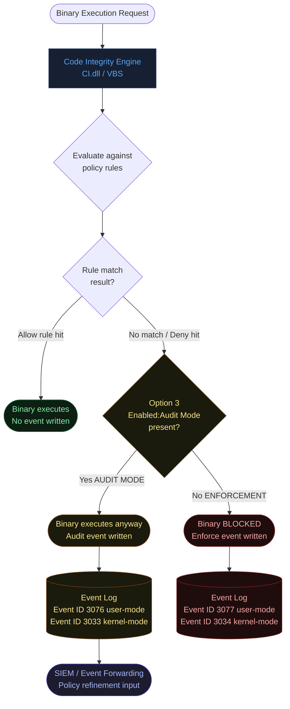
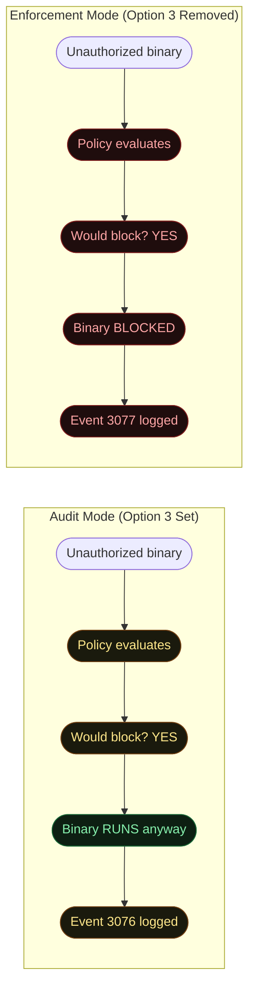
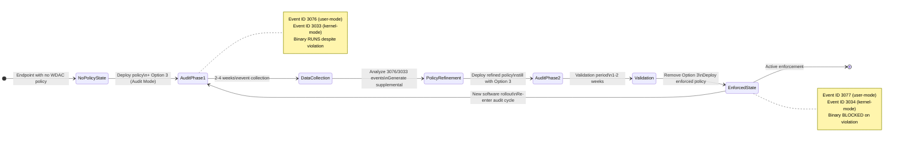
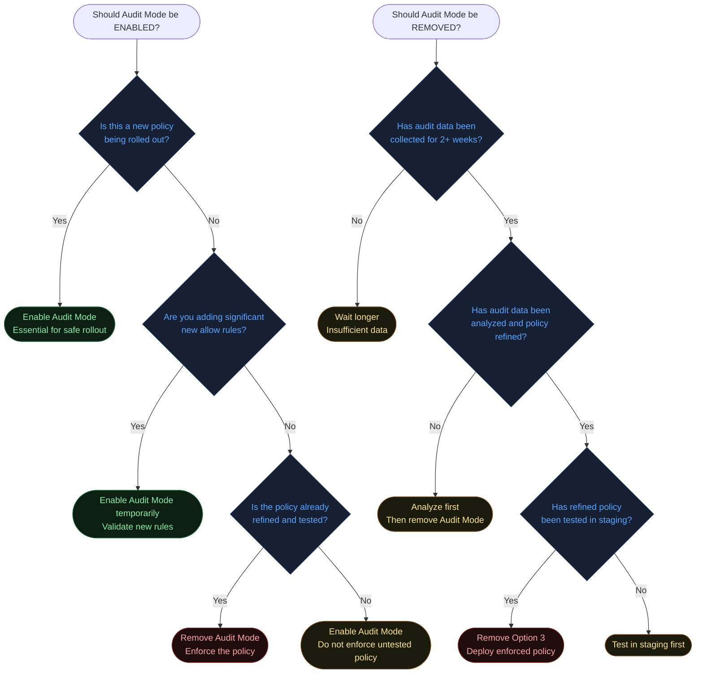
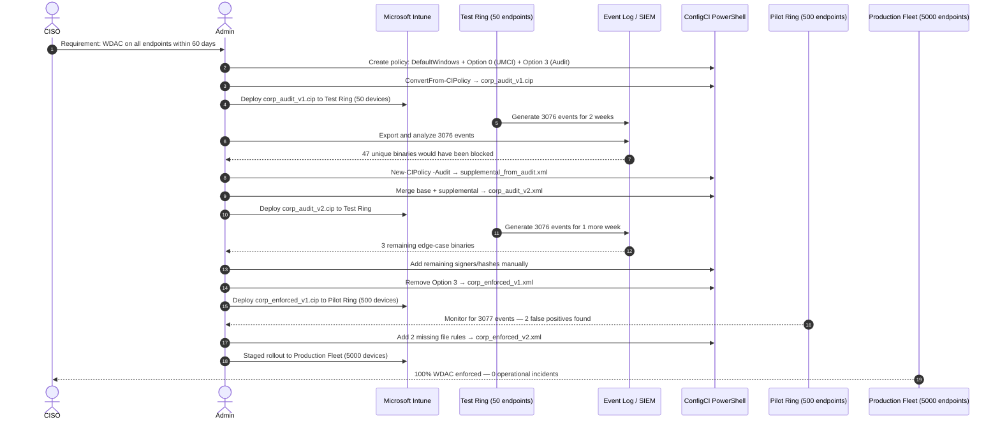
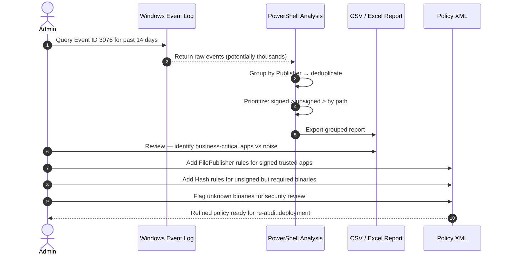
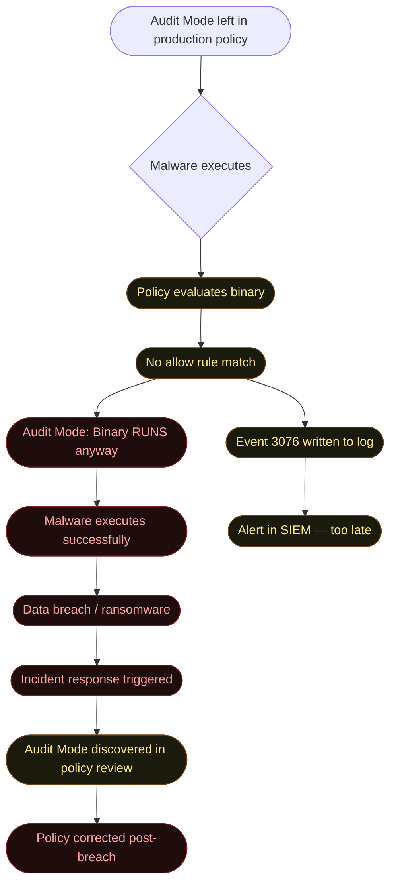
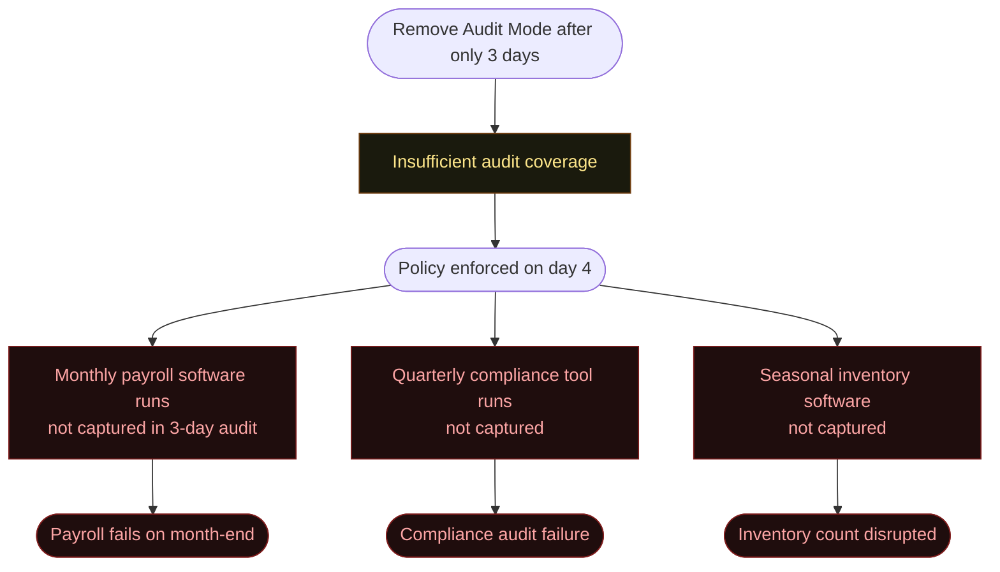

# Option 3 — Enabled:Audit Mode (Default)

**Author:** Anubhav Gain
**Category:** Endpoint Security
**Policy Rule Value:** `Enabled:Audit Mode`
**Rule Index:** 3
**Valid for Supplemental Policies:** No

---

## Table of Contents

1. [What It Does](#1-what-it-does)
2. [Why It Exists](#2-why-it-exists)
3. [Visual Anatomy — Policy Evaluation Stack](#3-visual-anatomy--policy-evaluation-stack)
4. [How to Set It (PowerShell)](#4-how-to-set-it-powershell)
5. [XML Representation](#5-xml-representation)
6. [Interaction with Other Options](#6-interaction-with-other-options)
7. [When to Enable vs Disable](#7-when-to-enable-vs-disable)
8. [Real-World Scenario — End-to-End Walkthrough](#8-real-world-scenario--end-to-end-walkthrough)
9. [What Happens If You Get It Wrong](#9-what-happens-if-you-get-it-wrong)
10. [Valid for Supplemental Policies?](#10-valid-for-supplemental-policies)
11. [OS Version Requirements](#11-os-version-requirements)
12. [Summary Table](#12-summary-table)

---

## 1. What It Does

`Enabled:Audit Mode` places an App Control for Business policy in a **non-enforcing observation state**. When Audit Mode is active, the Code Integrity engine evaluates every executable, DLL, script, and kernel driver against the policy rules exactly as it would in enforcement mode — but instead of blocking binaries that do not match an allow rule, it allows them to run while writing a detailed event to the `Microsoft-Windows-CodeIntegrity/Operational` Windows Event Log. These audit events (primarily **Event ID 3076** for user-mode and **Event ID 3033** for kernel-mode) capture the full file identity: name, path, hash, publisher certificate chain, and the reason the binary would have been blocked. Security and IT teams use this data to understand the real-world impact of a policy before it goes into enforcement, identify gaps in the allow rules, and refine the policy to avoid false-positive blocks of legitimate business applications. To transition from audit to enforcement, you simply remove the `Enabled:Audit Mode` option from the policy and redeploy — no structural changes to the rules are required.

---

## 2. Why It Exists

### The "Big Bang" Deployment Problem

Historically, application whitelisting technologies were notorious for causing operational outages when deployed without sufficient preparation. An enforced allowlist policy deployed to a production fleet without thorough testing would immediately block any legitimate application whose publisher, hash, or file path was not covered by the policy. The resulting flood of help-desk tickets, broken business processes, and emergency rollbacks eroded confidence in the technology and caused organizations to abandon it entirely.

`Enabled:Audit Mode` solves this by decoupling **policy learning** from **enforcement**. Teams can:

- Deploy a policy to live production endpoints with zero risk of blocking legitimate software.
- Collect weeks or months of audit data representing the real workload of each endpoint.
- Use the audit data to automatically generate supplemental policies that cover observed applications.
- Validate the refined policy in a staging environment.
- Flip to enforcement with high confidence.

### The Graduated Risk Reduction Model


---

## 3. Visual Anatomy — Policy Evaluation Stack



### Audit Mode vs Enforcement Side-by-Side



---

## 4. How to Set It (PowerShell)

### Enable Audit Mode (Add Option 3)

```powershell
# Place policy in Audit Mode — binaries run but violations are logged
Set-RuleOption -FilePath "C:\Policies\MyBasePolicy.xml" -Option 3
```

### Disable Audit Mode / Switch to Enforcement (Remove Option 3)

```powershell
# Remove Audit Mode — policy is now ENFORCED
# WARNING: After this, non-matching binaries will be BLOCKED
Set-RuleOption -FilePath "C:\Policies\MyBasePolicy.xml" -Option 3 -Delete
```

### Verify Current Mode

```powershell
[xml]$Policy = Get-Content "C:\Policies\MyBasePolicy.xml"
$ns = New-Object System.Xml.XmlNamespaceManager($Policy.NameTable)
$ns.AddNamespace("si", "urn:schemas-microsoft-com:sipolicy")
$rules = $Policy.SelectNodes("//si:Rule/si:Option", $ns) | Select-Object -ExpandProperty '#text'

if ($rules -contains "Enabled:Audit Mode") {
    Write-Host "Policy is in AUDIT MODE — not enforcing" -ForegroundColor Yellow
} else {
    Write-Host "Policy is in ENFORCEMENT MODE — blocking active" -ForegroundColor Red
}
```

### Collecting Audit Events

```powershell
# Collect all audit events (would-be-blocked binaries)
$AuditEvents = Get-WinEvent -LogName "Microsoft-Windows-CodeIntegrity/Operational" |
    Where-Object { $_.Id -in @(3076, 3033) } |
    Select-Object TimeCreated, Id,
        @{N="FilePath"; E={ $_.Properties[1].Value }},
        @{N="Publisher"; E={ $_.Properties[4].Value }},
        @{N="SHA256"; E={ $_.Properties[8].Value }}

$AuditEvents | Export-Csv "$env:USERPROFILE\Desktop\audit_events_$(Get-Date -Format yyyyMMdd).csv" -NoTypeInformation
Write-Host "Collected $($AuditEvents.Count) audit events"
```

### Auto-Generate Supplemental Policy from Audit Log

```powershell
# Generate a supplemental policy covering all audited binaries
$AuditPolicyPath = "C:\Policies\Supplemental_FromAudit.xml"

New-CIPolicy -Audit -Level FilePublisher -Fallback Hash -UserPEs `
    -MultiplePolicyFormat `
    -FilePath $AuditPolicyPath

# Review the generated policy before merging
Get-Content $AuditPolicyPath | Select-String "FileRuleRef"
```

### Full Audit-to-Enforcement Workflow

```powershell
# Phase 1: Deploy audit policy
$PolicyPath = "C:\Policies\Corp_Baseline.xml"
Set-RuleOption -FilePath $PolicyPath -Option 0   # UMCI
Set-RuleOption -FilePath $PolicyPath -Option 3   # Audit Mode
ConvertFrom-CIPolicy -XmlFilePath $PolicyPath -BinaryFilePath "C:\Policies\Corp_Baseline_Audit.cip"
# ... deploy via Intune/GPO ...

# Phase 2: Collect data (run for 2-4 weeks)
Start-Sleep -Seconds (60 * 60 * 24 * 14)   # Conceptual — in reality, manual review

# Phase 3: Build supplemental from audit log
New-CIPolicy -Audit -Level FilePublisher -Fallback Hash -UserPEs `
    -FilePath "C:\Policies\Supplemental_Audit.xml"

# Phase 4: Merge supplemental into base or add allow rules
Merge-CIPolicy -PolicyPaths $PolicyPath, "C:\Policies\Supplemental_Audit.xml" `
    -OutputFilePath "C:\Policies\Corp_Baseline_Refined.xml"

# Phase 5: Remove Audit Mode — transition to enforcement
Set-RuleOption -FilePath "C:\Policies\Corp_Baseline_Refined.xml" -Option 3 -Delete

# Phase 6: Compile enforced policy
ConvertFrom-CIPolicy -XmlFilePath "C:\Policies\Corp_Baseline_Refined.xml" `
    -BinaryFilePath "C:\Policies\Corp_Baseline_Enforced.cip"
# ... deploy enforced policy ...
```

---

## 5. XML Representation

### Audit Mode Enabled (Policy in Learning Phase)

```xml
<?xml version="1.0" encoding="utf-8"?>
<SiPolicy xmlns="urn:schemas-microsoft-com:sipolicy" PolicyType="Base Policy">

  <VersionEx>10.0.1.0</VersionEx>
  <PolicyTypeID>{A244370E-44C9-4C06-B551-F6016E563076}</PolicyTypeID>
  <PlatformID>{2E07F7E4-194C-4D20-B96C-1498495910E7}</PlatformID>

  <Rules>
    <Rule>
      <Option>Enabled:UMCI</Option>
    </Rule>

    <!-- Option 3: Audit Mode — policy evaluates but does NOT block -->
    <!-- Remove this Rule element to switch to ENFORCEMENT MODE     -->
    <Rule>
      <Option>Enabled:Audit Mode</Option>
    </Rule>

  </Rules>

  <!-- ... Signers, FileRules, etc. ... -->

</SiPolicy>
```

### Enforcement Mode (Option 3 Removed)

```xml
<Rules>
  <Rule>
    <Option>Enabled:UMCI</Option>
  </Rule>

  <!-- Enabled:Audit Mode is ABSENT — policy is ENFORCED -->
  <!-- Any binary not matching an allow rule will be BLOCKED -->

</Rules>
```

> **Critical Note:** The only XML difference between an auditing policy and an enforcing policy is the **presence or absence** of the `<Rule><Option>Enabled:Audit Mode</Option></Rule>` element. All signers, hashes, and file rules remain identical. This makes the audit-to-enforcement transition a minimal, low-risk operation.

---

## 6. Interaction with Other Options

### Option Relationship Matrix

| Option | Name | Relationship with Audit Mode |
|--------|------|------------------------------|
| 0 | Enabled:UMCI | **Essential pair** — UMCI must be present for meaningful user-mode audit data |
| 2 | Required:WHQL | **Pair for kernel driver auditing** — audit WHQL violations before enforcing |
| 4 | Disabled:Flight Signing | **Independent** — both can coexist; audit will log Flight-signed binaries |
| 10 | Enabled:Boot Audit on Failure | **Related** — extends audit concept to boot failures |
| 16 | Enabled:Update Policy No Reboot | **Deployment helper** — combined enables hot-swap from audit to enforcement |
| 20 | Enabled:Dynamic Code Security | **Pair** — audit JIT code violations before enforcing DCS |

### The Audit Mode Lifecycle State Machine



---

## 7. When to Enable vs Disable



### Decision Reference Table

| Scenario | Audit Mode State |
|----------|-----------------|
| Initial policy deployment to any environment | **Enable** — non-negotiable best practice |
| New major software rollout to fleet | **Enable** — collect new binary data |
| Policy already enforced and stable | **Remove** — keep enforcement active |
| Responding to policy enforcement incident | **Enable temporarily** — diagnose without disruption |
| Compliance certification requiring enforcement | **Remove** — auditors expect enforcement, not audit |
| Dev/test machine policy | **Keep enabled** indefinitely for flexibility |

---

## 8. Real-World Scenario — End-to-End Walkthrough

### Scenario: Enterprise-Wide WDAC Rollout via Audit-First Approach

A 5,000-endpoint enterprise deploys WDAC for the first time across all corporate laptops. Audit Mode is used to learn the environment over 30 days before any enforcement is activated.



### Analyzing Audit Events Efficiently



---

## 9. What Happens If You Get It Wrong

### Scenario A: Forget to Remove Audit Mode Before Production

The policy is deployed to production with Audit Mode still present. Enforcement never activates, but the team believes they are protected.



### Scenario B: Remove Audit Mode Without Sufficient Data Collection



### Misconfig Consequences Summary

| Mistake | Impact | Severity |
|---------|--------|----------|
| Leave Audit Mode in production permanently | Policy provides zero enforcement | Critical |
| Enforce without sufficient audit period | LOB app breaks at unexpected time | High |
| Ignore high-volume 3076 events | Policy gaps unaddressed before enforcement | High |
| Confuse audit coverage with full inventory | Seasonal/monthly apps missed | Medium |
| Run audit without UMCI option | Only kernel events logged; user-mode gaps invisible | High |

---

## 10. Valid for Supplemental Policies?

**No.** `Enabled:Audit Mode` is not valid in supplemental policies. The enforcement mode of the entire policy set is determined solely by the base policy. Supplemental policies cannot independently toggle between audit and enforcement — they inherit the base policy's mode. Setting Option 3 in a supplemental policy would be silently ignored or rejected during policy merge.

This design ensures a consistent enforcement posture across the base + supplemental policy set. You cannot have a "partially auditing" configuration where the base enforces but a supplemental audits — the base policy is authoritative.

---

## 11. OS Version Requirements

| Windows Version | Audit Mode Status |
|----------------|------------------|
| Windows 10 1507 (TH1) | Basic audit logging supported |
| Windows 10 1607+ | Full audit mode with UMCI audit (Event 3076) |
| Windows 10 1703+ | Audit events enriched with script enforcement data |
| Windows 10 1903+ | Structured audit event format improved |
| Windows 11 21H2+ | Enhanced audit tooling; `citool.exe` available |
| Windows Server 2016+ | Full support |
| Windows Server 2019+ | Recommended; enhanced event forwarding |

> **Event Forwarding for Scale:** In enterprise environments, configure Windows Event Forwarding (WEF) or a SIEM agent to centralize Event ID 3076 events from all endpoints. Processing thousands of per-endpoint logs manually is not scalable. Tools like `Microsoft WDAC Wizard` and `WDAC Policy Creator` can ingest event exports and generate policy fragments automatically.

---

## 12. Summary Table

| Attribute | Value |
|-----------|-------|
| Rule Option Name | `Enabled:Audit Mode` |
| Rule Option Index | 3 |
| Default State | **Enabled** in most Microsoft template policies |
| Effect when Enabled | Policy evaluates but does NOT block; violations logged |
| Effect when Disabled (Removed) | Policy ENFORCES — violating binaries are BLOCKED |
| Valid in Base Policy | **Yes** |
| Valid in Supplemental Policy | **No** |
| Requires Reboot on Change | **No** — audit/enforce switch takes effect on policy update |
| Primary Use Case | Safe initial deployment; policy validation; troubleshooting |
| Recommended Audit Duration | 2–4 weeks minimum; 4–8 weeks for complex environments |
| Event ID (Audit — User-Mode) | **3076** — would-be-blocked user-mode binary |
| Event ID (Audit — Kernel-Mode) | **3033** — would-be-blocked kernel-mode driver |
| Event ID (Enforce — User-Mode) | **3077** — blocked user-mode binary |
| Event ID (Enforce — Kernel-Mode) | **3034** — blocked kernel-mode driver |
| Event Log | `Microsoft-Windows-CodeIntegrity/Operational` |
| PowerShell Cmdlet (Enable) | `Set-RuleOption -FilePath <xml> -Option 3` |
| PowerShell Cmdlet (Disable) | `Set-RuleOption -FilePath <xml> -Option 3 -Delete` |
| Policy Generation from Audit | `New-CIPolicy -Audit -Level FilePublisher -Fallback Hash -UserPEs` |
| Critical Warning | Leaving Audit Mode in production = zero enforcement |
| Security Framework Alignment | NIST SP 800-167 (Phased deployment), CIS Controls (baseline scanning) |
