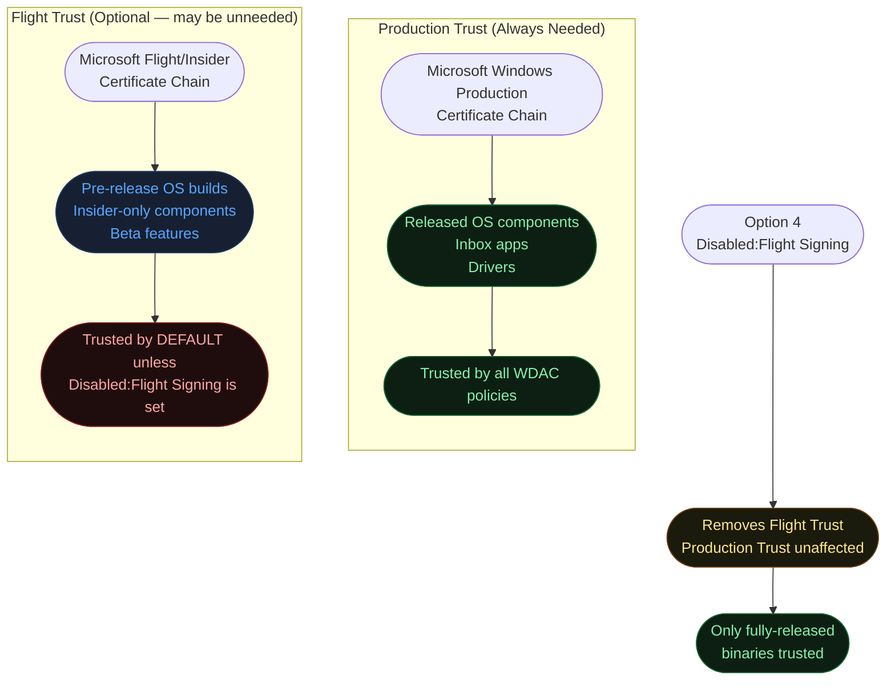
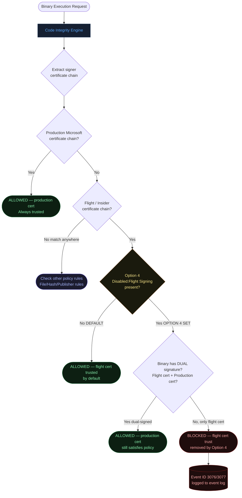
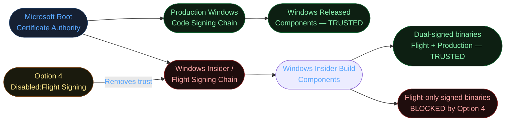
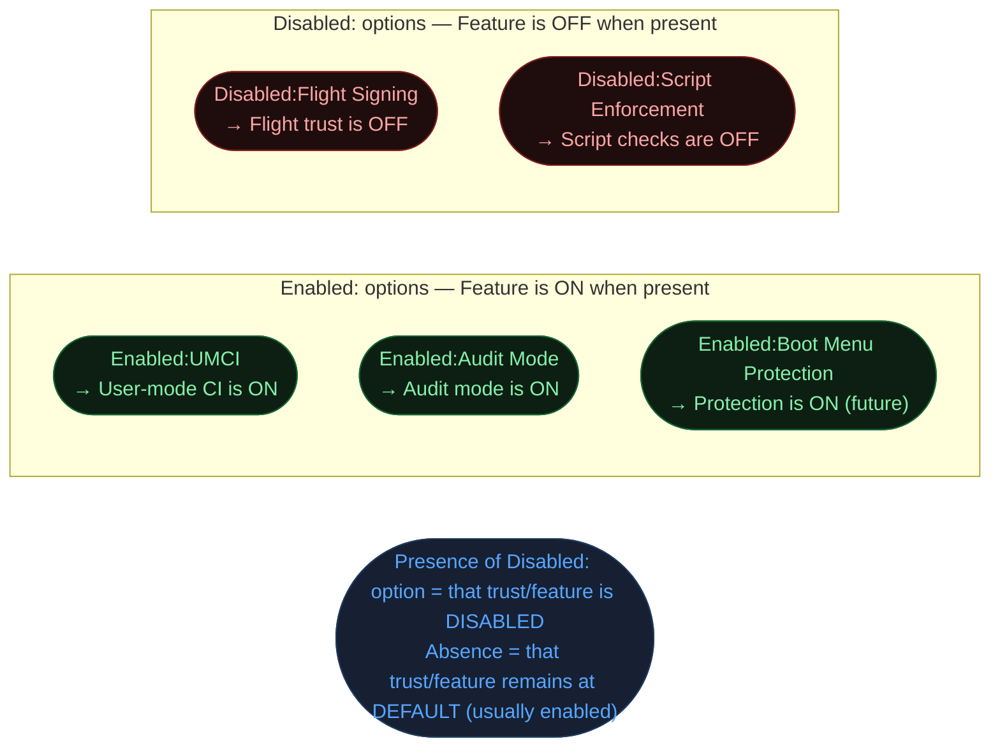
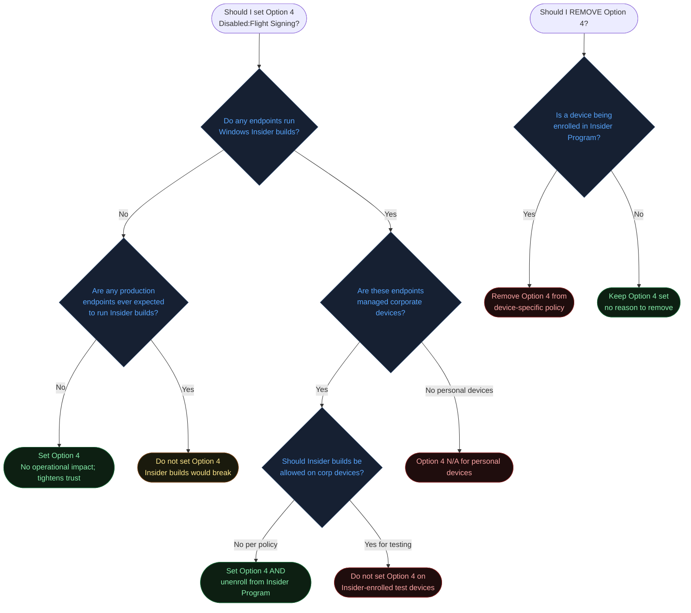
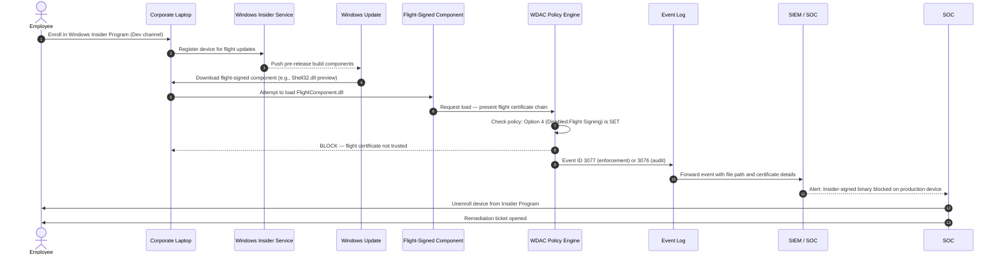
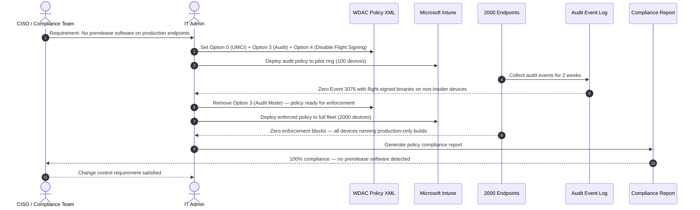
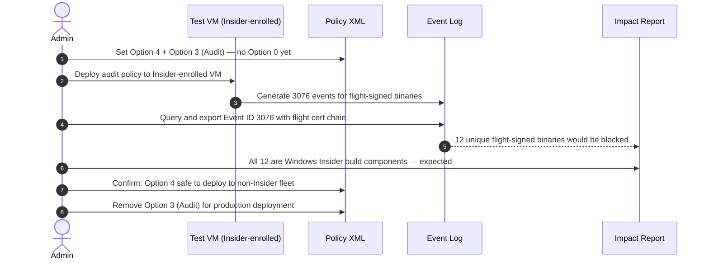
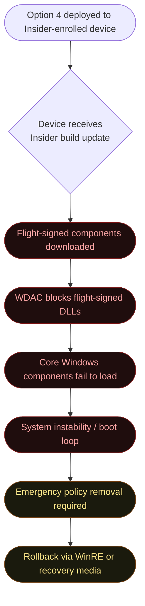
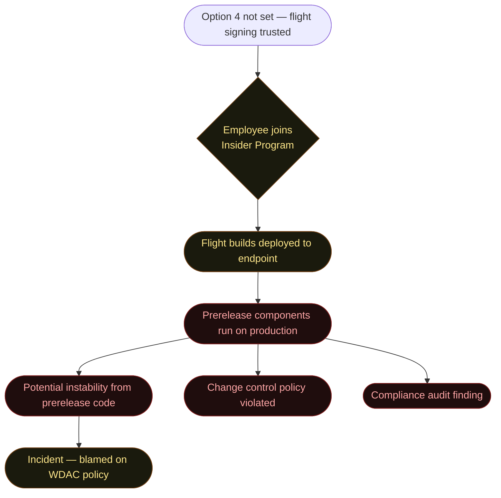

# Option 4 — Disabled:Flight Signing

**Author:** Anubhav Gain
**Category:** Endpoint Security
**Policy Rule Value:** `Disabled:Flight Signing`
**Rule Index:** 4
**Valid for Supplemental Policies:** No

---

## Table of Contents

1. [What It Does](#1-what-it-does)
2. [Why It Exists](#2-why-it-exists)
3. [Visual Anatomy — Policy Evaluation Stack](#3-visual-anatomy--policy-evaluation-stack)
4. [How to Set It (PowerShell)](#4-how-to-set-it-powershell)
5. [XML Representation](#5-xml-representation)
6. [Interaction with Other Options](#6-interaction-with-other-options)
7. [When to Enable vs Disable](#7-when-to-enable-vs-disable)
8. [Real-World Scenario — End-to-End Walkthrough](#8-real-world-scenario--end-to-end-walkthrough)
9. [What Happens If You Get It Wrong](#9-what-happens-if-you-get-it-wrong)
10. [Valid for Supplemental Policies?](#10-valid-for-supplemental-policies)
11. [OS Version Requirements](#11-os-version-requirements)
12. [Summary Table](#12-summary-table)

---

## 1. What It Does

`Disabled:Flight Signing` removes the implicit trust that WDAC / App Control for Business policies grant to **Windows Insider build (flight) certificates**. In the default WDAC configuration, binaries signed with Microsoft's Windows Insider / Flighting signing certificates are treated as trusted — the same way production Windows binaries are trusted. This makes sense for Insider Program participants who need pre-release Windows components to function alongside an enforced WDAC policy. However, for organizations that operate **exclusively on stable, released Windows builds** and have no need to run prerelease Microsoft components, this trust extension is unnecessary and represents a slightly expanded trust surface.

When `Disabled:Flight Signing` is set in the policy, binaries carrying **only** the Windows Insider/Flighting certificate chain are **not trusted** and will be blocked (or logged in audit mode). Binaries that carry dual signatures — one from the Insider/Flight certificate and one from a production Microsoft certificate — will still pass because the production certificate remains trusted. This option is targeted at production-locked environments that want to close the flight-signing trust pathway entirely.

---

## 2. Why It Exists

### Windows Insider Program and Flight Signing

Microsoft's Windows Insider Program delivers pre-release builds of Windows, system components, inbox apps, and OS features to volunteer testers. These builds are signed with a separate Microsoft certificate chain — the **Windows Flighting/Insider signing certificate** — distinct from the production Microsoft Windows certificate chain used for publicly released builds.

### The Security Rationale



### Why Organizations Want This

1. **Compliance and change control**: Organizations subject to strict change management (financial services, healthcare, government) require all software running on endpoints to have gone through the vendor's full release process. Prerelease binaries, by definition, have not.

2. **Stability requirements**: Flight-signed OS components are pre-release and may contain bugs, incomplete features, or regressions. Blocking them from running on production systems prevents accidental installation.

3. **Supply chain integrity**: Restricting trust to the narrowest necessary set of certificate chains is a foundational supply-chain security principle (zero-trust philosophy applied to code signing).

4. **Preventing Insider Program misuse**: An employee who opts into the Windows Insider Program on a corporate device would begin receiving flight-signed components. Without Option 4, those prerelease binaries are trusted by the WDAC policy. With Option 4, they are blocked, enforcing the policy that production endpoints must run released software only.

---

## 3. Visual Anatomy — Policy Evaluation Stack



### Certificate Trust Hierarchy with Option 4



---

## 4. How to Set It (PowerShell)

### Enable the Option (Disable Flight Signing Trust)

```powershell
# Disable trust for Windows Insider / Flight-signed binaries
# NOTE: The option is named "Disabled:Flight Signing"
# Setting it = flight signing is DISABLED (trust removed)
Set-RuleOption -FilePath "C:\Policies\MyBasePolicy.xml" -Option 4
```

### Remove the Option (Restore Default Flight Signing Trust)

```powershell
# Remove Option 4 = flight signing is TRUSTED again (default behavior)
Set-RuleOption -FilePath "C:\Policies\MyBasePolicy.xml" -Option 4 -Delete
```

### Verify Option State

```powershell
[xml]$Policy = Get-Content "C:\Policies\MyBasePolicy.xml"
$ns = New-Object System.Xml.XmlNamespaceManager($Policy.NameTable)
$ns.AddNamespace("si", "urn:schemas-microsoft-com:sipolicy")
$rules = $Policy.SelectNodes("//si:Rule/si:Option", $ns) | Select-Object -ExpandProperty '#text'

if ($rules -contains "Disabled:Flight Signing") {
    Write-Host "Option 4 SET: Flight/Insider-signed binaries are NOT trusted" -ForegroundColor Red
    Write-Host "Only production Microsoft-signed binaries are trusted" -ForegroundColor Green
} else {
    Write-Host "Option 4 NOT SET: Flight/Insider-signed binaries are trusted (default)" -ForegroundColor Yellow
}
```

### Check Whether Any Running Processes Use Flight-Signed Binaries

```powershell
# Scan loaded modules for Insider/Flight signatures
$Processes = Get-Process
foreach ($Process in $Processes) {
    try {
        $Modules = $Process.Modules
        foreach ($Module in $Modules) {
            $Sig = Get-AuthenticodeSignature -FilePath $Module.FileName -ErrorAction SilentlyContinue
            if ($Sig -and $Sig.SignerCertificate.Subject -match "(?i)insider|flight|prerelease") {
                [PSCustomObject]@{
                    ProcessName = $Process.Name
                    PID         = $Process.Id
                    Module      = $Module.FileName
                    Signer      = $Sig.SignerCertificate.Subject
                }
            }
        }
    } catch {}
} | Format-Table -AutoSize
```

### Determine If Device Is Enrolled in Windows Insider Program

```powershell
# Check Insider Program enrollment
$InsiderReg = Get-ItemProperty "HKLM:\SOFTWARE\Microsoft\WindowsSelfHost\UI\Selection" -ErrorAction SilentlyContinue
if ($InsiderReg) {
    Write-Host "Device is enrolled in Windows Insider Program" -ForegroundColor Yellow
    Write-Host "Branch: $($InsiderReg.UIContentType)" -ForegroundColor Yellow
    Write-Host "Option 4 (Disabled:Flight Signing) will block Insider components on next policy enforcement" -ForegroundColor Red
} else {
    Write-Host "Device is NOT enrolled in Windows Insider Program" -ForegroundColor Green
    Write-Host "Option 4 has no operational impact on this device" -ForegroundColor Green
}
```

### Full Policy with Option 4 (Production-Locked Environment)

```powershell
$PolicyPath = "C:\Policies\Production_Locked.xml"

# Start from DefaultWindows template
Copy-Item "$env:SystemRoot\schemas\CodeIntegrity\ExamplePolicies\DefaultWindows_Enforced.xml" $PolicyPath

# Configure production-locked options
Set-RuleOption -FilePath $PolicyPath -Option 0  # UMCI
Set-RuleOption -FilePath $PolicyPath -Option 2  # WHQL (optional, additional hardening)
Set-RuleOption -FilePath $PolicyPath -Option 3  # Audit Mode (remove when enforcing)
Set-RuleOption -FilePath $PolicyPath -Option 4  # Disable Flight Signing

# Set identity
Set-CIPolicyIdInfo -FilePath $PolicyPath `
    -PolicyName "Corp Production-Locked Baseline" `
    -PolicyId (New-Guid).Guid

# Compile
ConvertFrom-CIPolicy -XmlFilePath $PolicyPath -BinaryFilePath "C:\Policies\Production_Locked.cip"
```

---

## 5. XML Representation

### Option 4 Set (Flight Signing Disabled)

```xml
<?xml version="1.0" encoding="utf-8"?>
<SiPolicy xmlns="urn:schemas-microsoft-com:sipolicy" PolicyType="Base Policy">

  <VersionEx>10.0.0.0</VersionEx>
  <PolicyTypeID>{A244370E-44C9-4C06-B551-F6016E563076}</PolicyTypeID>
  <PlatformID>{2E07F7E4-194C-4D20-B96C-1498495910E7}</PlatformID>

  <Rules>
    <!-- Option 0: Enforce user-mode code integrity -->
    <Rule>
      <Option>Enabled:UMCI</Option>
    </Rule>

    <!-- Option 3: Audit mode — remove when ready to enforce -->
    <Rule>
      <Option>Enabled:Audit Mode</Option>
    </Rule>

    <!-- Option 4: Disabled:Flight Signing                            -->
    <!-- Presence of this rule = flight/insider signing is DISTRUSTED -->
    <!-- Absence of this rule = flight/insider signing is TRUSTED     -->
    <Rule>
      <Option>Disabled:Flight Signing</Option>
    </Rule>

  </Rules>

</SiPolicy>
```

### Option 4 Absent (Default — Flight Signing Trusted)

```xml
<Rules>
  <Rule>
    <Option>Enabled:UMCI</Option>
  </Rule>
  <!-- No Disabled:Flight Signing entry = Insider/Flight certs ARE trusted -->
</Rules>
```

> **Important Naming Convention Note:** The name `Disabled:Flight Signing` follows the `Disabled:` prefix convention, which means the feature being described (Flight Signing trust) is **disabled** when this option is **present**. This is the inverse of `Enabled:` options where the feature is **enabled** when present. When reviewing policy XML, a `Disabled:` option present means that feature is turned OFF.

---

## 6. Interaction with Other Options

### Option Relationship Matrix

| Option | Name | Relationship with Disabled:Flight Signing |
|--------|------|-------------------------------------------|
| 0 | Enabled:UMCI | **Prerequisite for meaningful effect** — without UMCI, only kernel-mode binaries are checked and flight-signed user-mode binaries run freely |
| 2 | Required:WHQL | **Synergistic** — both restrict non-standard Microsoft signing; WHQL tightens kernel, Option 4 tightens prerelease |
| 3 | Enabled:Audit Mode | **Use during rollout** — audit which flight-signed binaries exist before blocking them |
| 5 | Enabled:Inherit Default Policy | **Neutral** — policy inheritance unaffected by flight signing trust |
| 14 | Enabled:Threat Intelligence | **Independent** — cloud reputation check applies after signing check |

### Naming Convention Diagram



---

## 7. When to Enable vs Disable



### Decision Reference Table

| Scenario | Recommendation |
|----------|---------------|
| Corporate production fleet (no Insider Program) | **Set Option 4** — no impact, tightens trust surface |
| Windows Insider Program test machines | **Do NOT set Option 4** — would block prerelease components |
| Regulated industry (finance, healthcare, gov) | **Set Option 4** — only released software permitted |
| Developer machines testing Windows features | **Do NOT set Option 4** — flight components needed |
| Kiosk / fixed-function devices | **Set Option 4** — maximum restriction appropriate |
| Hybrid fleet with some Insider devices | **Set Option 4 in separate policy** for non-Insider ring |

---

## 8. Real-World Scenario — End-to-End Walkthrough

### Scenario A: Employee Accidentally Enrolls Corporate Laptop in Insider Program

An employee joins the Windows Insider Program on their corporate laptop to get early access to a new Windows feature. The laptop begins receiving pre-release flight-signed OS components. With Option 4 set, WDAC blocks these components, generating events and surfacing the unauthorized enrollment.



### Scenario B: Financial Institution Production-Locking Policy Deployment

A financial institution deploys WDAC with Option 4 to ensure all endpoints run only production-released Microsoft software, satisfying their change management policy.



### Scenario C: Identifying Impact Before Setting Option 4



---

## 9. What Happens If You Get It Wrong

### Scenario A: Set Option 4 on Windows Insider Program Devices



### Scenario B: Fail to Set Option 4 on Production-Locked Environment



### Misconfig Consequences Summary

| Mistake | Impact | Severity |
|---------|--------|----------|
| Deploy Option 4 to Insider-enrolled devices | Flight components blocked; potential system instability | High — may require recovery |
| Forget to set Option 4 on production fleet | Insider builds can run unchecked on corporate endpoints | Medium — policy/compliance violation |
| Set Option 4 without auditing first | Unknown if any flight-signed components are in use | Medium |
| Confuse "Disabled:Flight Signing present" with flight signing being enabled | Policy posture misread | Medium — documentation/training issue |

---

## 10. Valid for Supplemental Policies?

**No.** `Disabled:Flight Signing` is a base-policy-level trust configuration. It modifies the fundamental set of trusted certificate chains recognized by the Code Integrity engine. Supplemental policies cannot remove or add to the list of inherently trusted certificate authorities — they can only add allow rules for specific publishers, hashes, or file paths on top of the base policy's signing trust configuration. The decision about whether to trust flight certificates must be made at the base policy level, where it applies uniformly across the entire policy set.

---

## 11. OS Version Requirements

| Windows Version | Option 4 Support |
|----------------|-----------------|
| Windows 10 1507 | Not available |
| Windows 10 1607 | Available |
| Windows 10 1703+ | Full support |
| Windows 10 1903+ | Stable |
| Windows 11 (all) | Full support |
| Windows Server 2016+ | Supported; Insider builds not typically enrolled on servers |
| Windows Server 2019+ | Supported |

> **Note for Server Environments:** Windows Server is not enrolled in the Windows Insider Program in the same way as Windows Client. However, if an organization uses Windows Server Insider Preview builds in any environment (e.g., lab, pre-production testing), Option 4 on a WDAC policy would block flight-signed server components on those builds. In fully production-locked server environments where Insider Preview builds are prohibited, setting Option 4 adds a technical enforcement layer to the administrative prohibition.

### Flight Signing Certificate Characteristics

The Microsoft Windows Insider / Flighting signing certificates are identifiable by their OID and subject name patterns. While the exact certificate details are subject to Microsoft's internal certificate rotation policies, the distinguishing pattern is typically in the enhanced key usage (EKU) values and the issuing CA chain, which leads to a different intermediate CA than production Windows binaries. When reviewing Event 3076/3077 details, flight-certificate-blocked binaries will show an issuer chain that differs from the standard `Microsoft Windows Production PCA` chain.

---

## 12. Summary Table

| Attribute | Value |
|-----------|-------|
| Rule Option Name | `Disabled:Flight Signing` |
| Rule Option Index | 4 |
| Default State | **Not set** (flight signing trusted by default) |
| Effect when Set (Option Present) | Flight / Windows Insider signed binaries are NOT trusted and will be blocked |
| Effect when Not Set (Option Absent) | Flight / Windows Insider signed binaries are trusted (default) |
| Valid in Base Policy | **Yes** |
| Valid in Supplemental Policy | **No** |
| Requires Reboot on Change | No — takes effect on next policy update cycle |
| Primary Use Case | Production-locked environments; compliance environments requiring released-only software |
| Target: Who Is Affected | Windows Insider Program participants; devices receiving pre-release OS components |
| Impact on Dual-Signed Binaries | **No impact** — dual-signed (flight + production) binaries remain trusted via production cert |
| Impact on Production Windows | **None** — production Microsoft certificates unaffected |
| Prerequisite for Full Effect | Option 0 (UMCI) must be set; otherwise user-mode flight binaries run unchecked |
| Event ID (Audit — Option 4 violation) | **3076** |
| Event ID (Enforce — Option 4 violation) | **3077** |
| Event Log | `Microsoft-Windows-CodeIntegrity/Operational` |
| Risk of Misdeployment | System instability if deployed to Insider-enrolled devices |
| PowerShell Cmdlet (Set) | `Set-RuleOption -FilePath <xml> -Option 4` |
| PowerShell Cmdlet (Remove) | `Set-RuleOption -FilePath <xml> -Option 4 -Delete` |
| Naming Convention | `Disabled:` prefix — option PRESENT means trust is DISABLED |
| Security Framework Alignment | NIST SP 800-167 (Allowlisting), change management frameworks, supply-chain integrity |
| Recommended for | All production corporate fleets not enrolled in Windows Insider Program |
