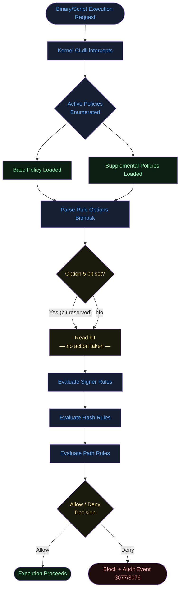
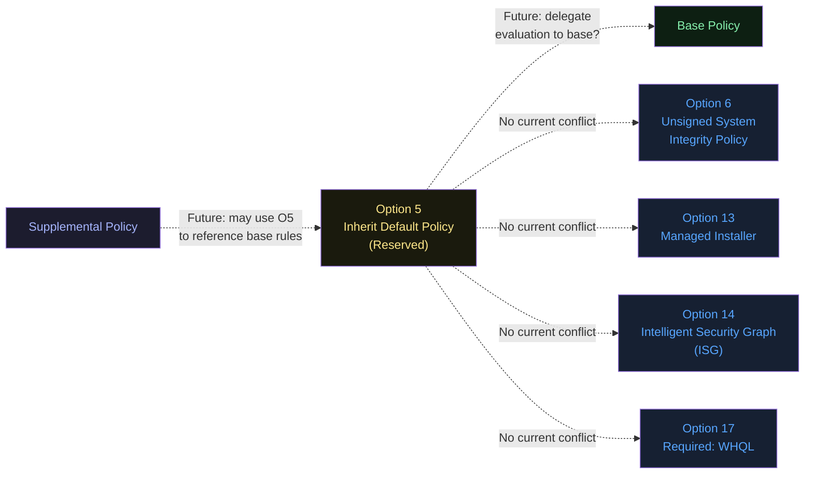
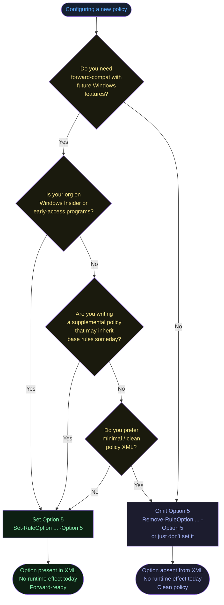
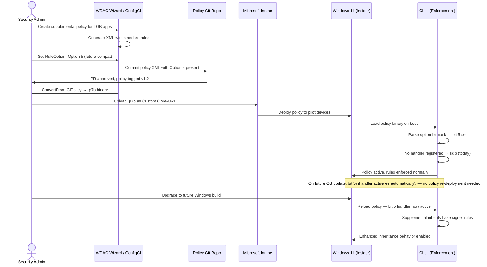
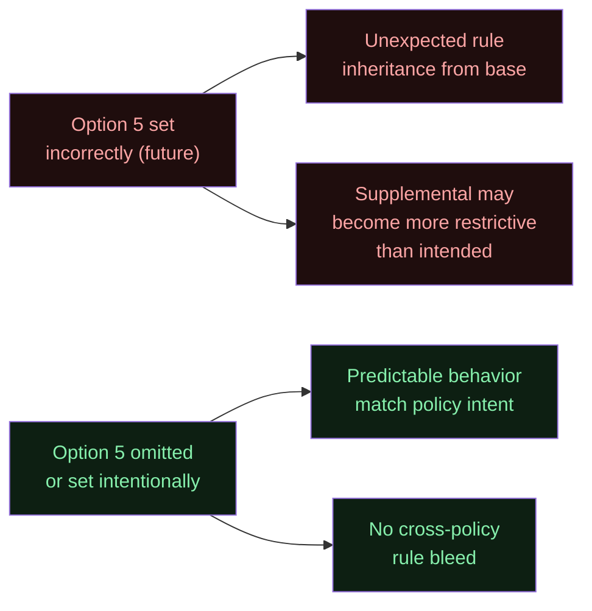

# Option 5 — Enabled:Inherit Default Policy

**Author:** Anubhav Gain  
**Category:** Endpoint Security  
**Policy Rule Option Index:** 5  
**XML Value:** `<Rule><Option>Enabled:Inherit Default Policy</Option></Rule>`  
**Valid for Supplemental Policies:** Yes  
**Status:** Reserved for future use — currently has no runtime effect

---

## Table of Contents

1. [What It Does](#1-what-it-does)
2. [Why It Exists](#2-why-it-exists)
3. [Visual Anatomy — Policy Evaluation Stack](#3-visual-anatomy--policy-evaluation-stack)
4. [How to Set It (PowerShell)](#4-how-to-set-it-powershell)
5. [XML Representation](#5-xml-representation)
6. [Interaction with Other Options](#6-interaction-with-other-options)
7. [When to Enable vs Disable](#7-when-to-enable-vs-disable)
8. [Real-World Scenario / End-to-End Walkthrough](#8-real-world-scenario--end-to-end-walkthrough)
9. [What Happens If You Get It Wrong](#9-what-happens-if-you-get-it-wrong)
10. [Valid for Supplemental Policies?](#10-valid-for-supplemental-policies)
11. [OS Version Requirements](#11-os-version-requirements)
12. [Summary Table](#12-summary-table)

---

## 1. What It Does

Option 5, **Enabled:Inherit Default Policy**, is a placeholder rule option that is reserved for future use by Microsoft. As of current Windows releases, enabling or omitting this option produces **no observable change** in policy enforcement behavior. The kernel-mode code-integrity engine (CI.dll / WDAC enforcement layer) reads this bit from the policy XML but takes no action on it. Its presence in a policy file is syntactically valid and will not cause parsing errors, but it does not alter allow/deny decisions, signing requirements, boot-time behavior, or any other enforcement outcome. Despite its current no-op status, the option is documented and tested by Windows because it is expected to carry semantics in a future OS release, and its position in the option bitmask is already reserved so that no other option can inadvertently claim that slot.

---

## 2. Why It Exists

### The Reservation Pattern in WDAC Policy Design

App Control for Business (formerly WDAC) policy rule options are encoded as a compact bitmask inside the policy binary. Microsoft follows a conservative extension model: before a new behavioral option is shipped to end-users, the bit position is claimed and documented in advance so that:

1. **Policy files authored today remain forward-compatible.** When the OS eventually implements the behavior, existing policies that already set the flag will automatically gain the new capability without re-authoring.
2. **Policy tooling (ConfigCI, WDAC Wizard, Intune) can expose the option early** so administrators can learn about it and plan deployment before the feature lands.
3. **Interoperability with pre-release builds is preserved.** Windows Insider / Preview channels may implement the flag earlier; reservation ensures production policies can be tested on those builds.

The conceptual intent suggested by the name — *inherit from a default policy* — points toward a future model where a supplemental policy can explicitly delegate evaluation back to the default base policy for a given signer or path, rather than adding its own rules on top. This would allow a supplemental policy to say "use whatever the base says here" rather than remaining silent (which already causes fall-through to the base). The exact semantics remain unspecified in public documentation.

---

## 3. Visual Anatomy — Policy Evaluation Stack

The diagram below shows where Option 5 is positioned in the full WDAC evaluation chain. Because it currently has no effect, the option bit is read and then immediately bypassed by the enforcement engine.



**Key takeaway:** The option bit is read during policy parsing (step F → G) but the decision node H is a dead branch — both paths converge to the same next step.

---

## 4. How to Set It (PowerShell)

The standard ConfigCI cmdlets `Set-RuleOption` and `Remove-RuleOption` operate on the policy XML file. The option index for **Enabled:Inherit Default Policy** is **5**.

### Enable Option 5

```powershell
# Enable:Inherit Default Policy on a base policy
Set-RuleOption -FilePath "C:\Policies\MyBasePolicy.xml" -Option 5

# Enable on a supplemental policy
Set-RuleOption -FilePath "C:\Policies\MySupplementalPolicy.xml" -Option 5
```

### Disable / Remove Option 5

```powershell
# Remove the option (return to default — absent from XML)
Remove-RuleOption -FilePath "C:\Policies\MyBasePolicy.xml" -Option 5
```

### Verify Current State

```powershell
# Read back all options present in a policy file
[xml]$policy = Get-Content "C:\Policies\MyBasePolicy.xml"
$policy.SiPolicy.Rules.Rule | Select-Object -ExpandProperty Option
```

### Full Scripted Example with Conversion

```powershell
$policyPath   = "C:\Policies\MyBasePolicy.xml"
$binaryOutput = "C:\Policies\MyBasePolicy.p7b"

# 1. Set option 5 (reserved, no current effect)
Set-RuleOption -FilePath $policyPath -Option 5

# 2. Confirm it was written
$xml = [xml](Get-Content $policyPath)
$opts = $xml.SiPolicy.Rules.Rule | Select-Object -ExpandProperty Option
Write-Host "Active options: $($opts -join ', ')"

# 3. Compile to binary
ConvertFrom-CIPolicy -XmlFilePath $policyPath -BinaryFilePath $binaryOutput

# 4. (Optional) Deploy via CiTool
CiTool --update-policy $binaryOutput
```

> **Note:** Because this option currently has no runtime effect, steps 1–2 are purely administrative. The compiled binary will contain the bit, but the enforcement engine will ignore it.

---

## 5. XML Representation

### Option Present in Policy XML

When Option 5 is set via `Set-RuleOption`, the following element appears inside the `<Rules>` block of the policy XML:

```xml
<?xml version="1.0" encoding="utf-8"?>
<SiPolicy xmlns="urn:schemas-microsoft-com:sipolicy"
          PolicyType="Base Policy">

  <VersionEx>10.0.0.0</VersionEx>
  <PolicyTypeID>{A244370E-44C9-4C06-B551-F6016E563076}</PolicyTypeID>
  <PlatformID>{2E07F7E4-194C-4D20-B96C-1498069CCC11}</PlatformID>

  <Rules>
    <!-- Option 5: Reserved for future use -->
    <Rule>
      <Option>Enabled:Inherit Default Policy</Option>
    </Rule>
    <!-- Other options would appear as additional <Rule> elements -->
    <Rule>
      <Option>Enabled:Unsigned System Integrity Policy</Option>
    </Rule>
  </Rules>

  <!-- ... FileRules, Signers, SigningScenarios, etc. -->
</SiPolicy>
```

### Option Absent from Policy XML

When the option is not set (the default state), the `<Rule>` element for Option 5 simply does not appear. There is no explicit "disabled" element; absence equals disabled.

### Bitmask Position

Inside the compiled binary (`.p7b` / `.bin`), policy rule options are stored as a 32-bit flags field. Option 5 occupies **bit position 5** (0-indexed from the LSB). Its hex mask value is `0x00000020`.

---

## 6. Interaction with Other Options

Because Option 5 currently has no effect, it does not conflict with or depend on any other option. The interaction diagram below is provided to show its **intended future relationship** based on its name and position in the option set.



### Compatibility Matrix

| Option | Name | Conflicts with O5? | Notes |
|--------|------|--------------------|-------|
| 0 | Enabled:UMCI | No | Orthogonal |
| 1 | Enabled:Boot Menu Protection | No | Orthogonal |
| 2 | Required:WHQL | No | Orthogonal |
| 3 | Enabled:Audit Mode | No | Orthogonal |
| 4 | Disabled:Flight Signing | No | Orthogonal |
| 6 | Enabled:Unsigned System Integrity Policy | No | Orthogonal |
| 7 | Allowed:Debug Policy Augmented | No | Orthogonal |
| 8 | Required:EV Signers | No | Orthogonal |
| 9 | Enabled:Advanced Boot Options Menu | No | Orthogonal |
| 10 | Enabled:Boot Audit On Failure | No | Orthogonal |
| 11 | Disabled:Script Enforcement | No | Orthogonal |
| 12 | Required:Enforce Store Applications | No | Orthogonal |
| 13 | Enabled:Managed Installer | No | Orthogonal |
| 14 | Enabled:Intelligent Security Graph | No | Orthogonal |

---

## 7. When to Enable vs Disable



**Recommendation:** In production environments today, **omit this option**. The only reason to explicitly set it is if your organization is running Windows Insider builds where Microsoft may have begun implementing its behavior, or if you want to future-proof policy authoring pipelines.

---

## 8. Real-World Scenario / End-to-End Walkthrough

### Scenario: Enterprise Prepares Policies for an Upcoming Windows Feature Release

An enterprise security team receives a preview of an upcoming Windows feature that will use Option 5 to allow supplemental policies to explicitly inherit rules from the base. They decide to pre-stage their supplemental policies with the flag set so that, when the OS update ships, no policy re-deployment is needed.



This workflow illustrates that setting the option early is purely administrative but carries zero risk and zero overhead today. The only cost is a single additional `<Rule>` element in the XML.

---

## 9. What Happens If You Get It Wrong

Because this option currently has no runtime effect, there is **no meaningful misconfiguration risk** today.

### Potential Future Risk

If and when Microsoft implements the behavior behind this flag, misconfiguring it could produce unintended rule inheritance. For example, if the future semantics are "supplemental policy inherits all deny rules from base," then setting this flag on a supplemental policy that was designed to be additive-only could cause unexpected blocks.

### Misconfiguration Consequence Matrix (Current + Future Projection)

| Scenario | Today | Future (Projected) |
|----------|-------|-------------------|
| Set Option 5 on base policy | No effect | May enable inheritance cascade |
| Set Option 5 on supplemental | No effect | May allow base-rule delegation |
| Omit Option 5 everywhere | No effect | No inheritance behavior |
| Set on unsigned policy | No effect | Likely still allowed (Option 6 governs signing) |
| Set on signed policy | No effect | Likely still allowed |



---

## 10. Valid for Supplemental Policies?

**Yes.** Option 5 is explicitly valid for supplemental policies. This is actually the most likely target for its future semantics, given that the name "Inherit Default Policy" implies a relationship between a supplemental and its parent base policy.

### Supplemental Policy Constraints Context

Supplemental policies can only expand what a base policy allows — they cannot tighten restrictions. Option 5 may eventually let a supplemental policy explicitly acknowledge its inheritance relationship with a specific base, potentially unlocking behaviors like:
- Explicit base-signer trust propagation
- Rule deduplication (supplemental does not re-state rules already in base)
- Priority ordering (supplemental defers to base for unresolved code identities)

For now, placing Option 5 in a supplemental policy is harmless and syntactically correct.

---

## 11. OS Version Requirements

| Requirement | Details |
|-------------|---------|
| Minimum OS | Windows 10, version 1903 (Build 18362) — when WDAC option parsing was formalized |
| Current effect | No runtime effect on any released Windows version |
| Future effect | Unknown — not yet implemented as of Windows 11 24H2 |
| Server support | Windows Server 2019+ |
| ARM support | Yes — same binary encoding |
| Hypervisor dependency | None |

Option 5 does not require Virtualization-Based Security (VBS), Secure Boot, or any particular hardware feature. Its future implementation will determine whether hardware dependencies apply.

---

## 12. Summary Table

| Property | Value |
|----------|-------|
| Option Index | 5 |
| Option Name | Enabled:Inherit Default Policy |
| XML Element | `<Option>Enabled:Inherit Default Policy</Option>` |
| Binary Bitmask Position | Bit 5 (0x00000020) |
| Default State | **Not set** (absent from XML) |
| Current Runtime Effect | **None — reserved for future use** |
| Valid for Base Policy | Yes |
| Valid for Supplemental | Yes |
| Conflicts with | None (currently) |
| PowerShell Set | `Set-RuleOption -FilePath <path> -Option 5` |
| PowerShell Remove | `Remove-RuleOption -FilePath <path> -Option 5` |
| Risk Level (Today) | None |
| Risk Level (Future) | Low–Medium (depends on implemented semantics) |
| Recommendation | Omit unless forward-compat staging is required |
| Minimum OS Version | Windows 10 1903 / Server 2019 |
| Requires VBS | No |
| Requires Secure Boot | No |
