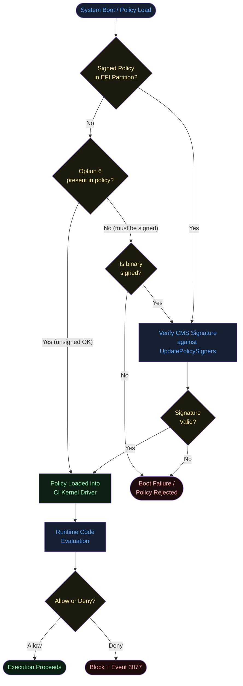
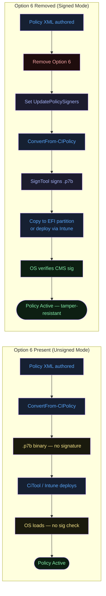
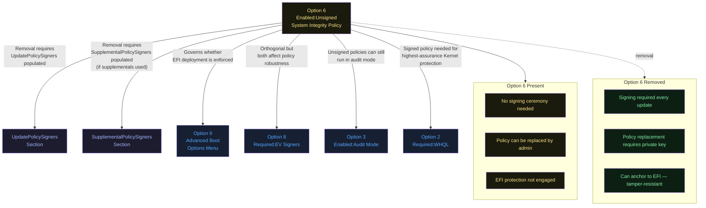
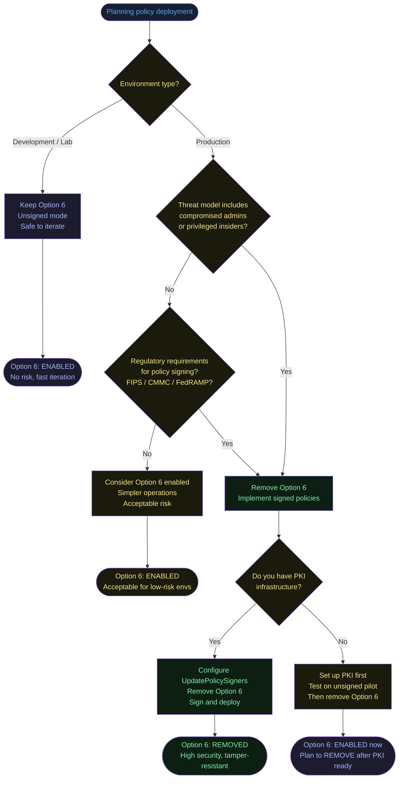
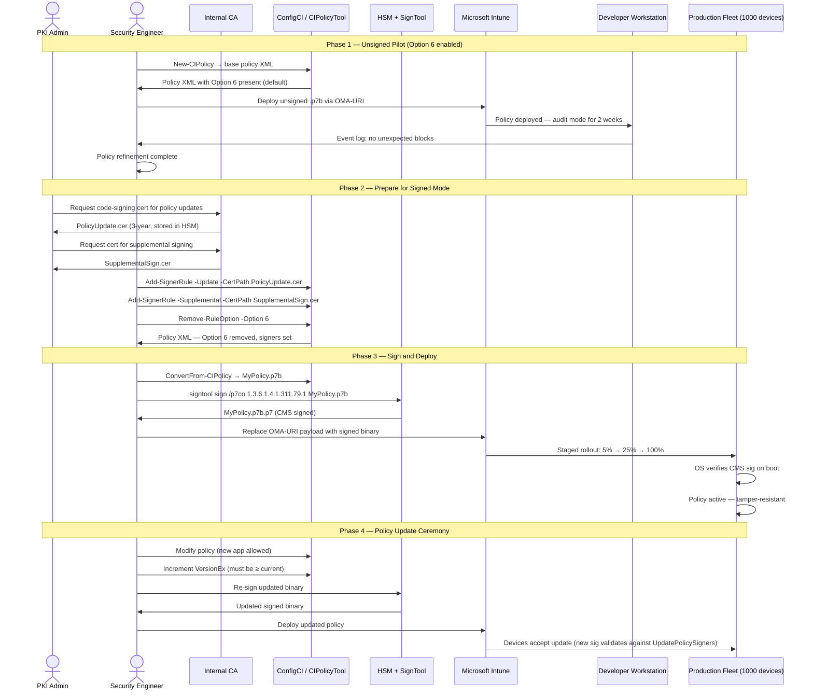
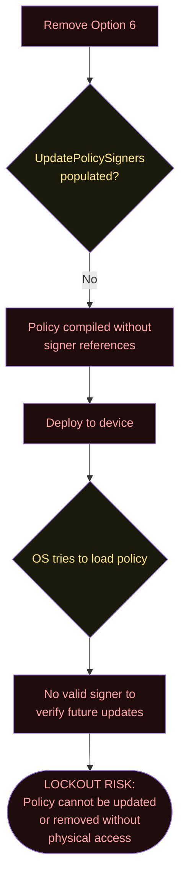

# Option 6 — Enabled:Unsigned System Integrity Policy

**Author:** Anubhav Gain  
**Category:** Endpoint Security  
**Policy Rule Option Index:** 6  
**XML Value:** `<Rule><Option>Enabled:Unsigned System Integrity Policy</Option></Rule>`  
**Valid for Supplemental Policies:** Yes  
**Status:** Default — present in all Microsoft-provided policy templates

---

## Table of Contents

1. [What It Does](#1-what-it-does)
2. [Why It Exists](#2-why-it-exists)
3. [Visual Anatomy — Policy Evaluation Stack](#3-visual-anatomy--policy-evaluation-stack)
4. [How to Set It (PowerShell)](#4-how-to-set-it-powershell)
5. [XML Representation](#5-xml-representation)
6. [Interaction with Other Options](#6-interaction-with-other-options)
7. [When to Enable vs Disable](#7-when-to-enable-vs-disable)
8. [Real-World Scenario / End-to-End Walkthrough](#8-real-world-scenario--end-to-end-walkthrough)
9. [What Happens If You Get It Wrong](#9-what-happens-if-you-get-it-wrong)
10. [Valid for Supplemental Policies?](#10-valid-for-supplemental-policies)
11. [OS Version Requirements](#11-os-version-requirements)
12. [Summary Table](#12-summary-table)

---

## 1. What It Does

Option 6, **Enabled:Unsigned System Integrity Policy**, is the default state for all new App Control for Business policies and permits a policy file to exist and be enforced **without a cryptographic signature**. When this option is present, Windows accepts the policy binary (`.p7b` / `.cip`) whether or not it carries a valid Authenticode or CMS signature. Removing this option triggers the enforcement engine's **signed-policy mode**: the policy binary must be cryptographically signed by a certificate whose public key is listed in the `<UpdatePolicySigners>` section, and any supplemental policies that attach to this base must themselves be signed by a certificate listed in `<SupplementalPolicySigners>`. In signed-policy mode the system will refuse to load any unsigned or incorrectly signed policy, and—critically—the active signed policy **cannot be removed without presenting a correctly signed replacement or destruction of the local signing certificate material**.

---

## 2. Why It Exists

### The Trust Escalation Problem

Without the concept of a signed policy, any administrator (or attacker who has obtained local admin rights) can simply deploy a new, more permissive unsigned policy and override all App Control restrictions. This defeats the purpose of App Control in high-security environments where the threat model includes compromised administrator accounts or privileged insider threats.

Signed policies solve this by anchoring policy changes to **cryptographic trust** rather than OS-level privilege:

1. **Only the entity holding the signing certificate can modify the policy.** Even SYSTEM cannot deploy a replacement without the private key.
2. **The policy cannot be deleted at runtime.** Signed policies stored in the EFI System Partition (ESP) or System32 cannot be removed by the OS itself.
3. **Chain of custody is cryptographically provable.** Every policy update carries a signature that can be traced back to a known Certificate Authority.

Option 6 exists as the **escape hatch** — the default on/off switch that determines whether this entire protection model is active. Keeping it set (unsigned mode) is safe for development and testing; removing it (moving to signed mode) is the production-hardened posture.

### The Default-On Design Choice

Microsoft ships all policy templates with Option 6 enabled (unsigned mode) deliberately, because:
- Accidental lockout during testing would be catastrophic
- Certificate provisioning requires planning
- Most organizations should learn WDAC on unsigned policies before signing

---

## 3. Visual Anatomy — Policy Evaluation Stack



### Unsigned vs Signed Policy Mode Side-by-Side



---

## 4. How to Set It (PowerShell)

### Enable Option 6 (Unsigned Mode — Default)

```powershell
# Restore unsigned mode (if it was previously removed)
Set-RuleOption -FilePath "C:\Policies\MyPolicy.xml" -Option 6
```

### Remove Option 6 (Enable Signed-Policy Mode)

```powershell
# CAUTION: After removing, you MUST sign the policy before deploying
# or the OS will refuse to load it.
Remove-RuleOption -FilePath "C:\Policies\MyPolicy.xml" -Option 6
```

### Full Signed Policy Workflow

```powershell
# Step 1: Configure UpdatePolicySigners (certificate that can update this policy)
# The certificate must be in your local cert store as a code-signing cert
$cert = Get-Item -Path "Cert:\CurrentUser\My\<thumbprint>"
Add-SignerRule -FilePath "C:\Policies\MyPolicy.xml" `
              -CertificatePath "C:\Certs\PolicySigning.cer" `
              -Update

# Step 2: Configure SupplementalPolicySigners (certs that can sign supplementals)
Add-SignerRule -FilePath "C:\Policies\MyPolicy.xml" `
              -CertificatePath "C:\Certs\SupplementalSigning.cer" `
              -Supplemental

# Step 3: Remove Option 6 — switch to signed mode
Remove-RuleOption -FilePath "C:\Policies\MyPolicy.xml" -Option 6

# Step 4: Compile to binary
ConvertFrom-CIPolicy -XmlFilePath "C:\Policies\MyPolicy.xml" `
                     -BinaryFilePath "C:\Policies\MyPolicy.p7b"

# Step 5: Sign the binary using SignTool (requires Windows SDK)
& "C:\Program Files (x86)\Windows Kits\10\bin\10.0.22621.0\x64\signtool.exe" sign `
    /fd sha256 `
    /p7 "C:\Policies\" `
    /p7co 1.3.6.1.4.1.311.79.1 `
    /p7ce DetachedSignedData `
    /sha1 "<cert-thumbprint>" `
    "C:\Policies\MyPolicy.p7b"

# Step 6: Deploy (the .p7 file is the final signed binary)
CiTool --update-policy "C:\Policies\MyPolicy.p7b.p7"
```

### Check Current Option 6 State

```powershell
[xml]$pol = Get-Content "C:\Policies\MyPolicy.xml"
$hasOption6 = $pol.SiPolicy.Rules.Rule |
    Where-Object { $_.Option -eq "Enabled:Unsigned System Integrity Policy" }

if ($hasOption6) {
    Write-Host "UNSIGNED MODE — Policy does not require signing" -ForegroundColor Yellow
} else {
    Write-Host "SIGNED MODE — Policy must be signed to deploy" -ForegroundColor Cyan
}
```

---

## 5. XML Representation

### Option 6 Present (Unsigned Mode)

```xml
<SiPolicy xmlns="urn:schemas-microsoft-com:sipolicy" PolicyType="Base Policy">
  <VersionEx>10.0.0.0</VersionEx>

  <Rules>
    <!-- Option 6: Policy does not require a cryptographic signature -->
    <Rule>
      <Option>Enabled:Unsigned System Integrity Policy</Option>
    </Rule>
    <!-- Additional options ... -->
  </Rules>

  <!-- UpdatePolicySigners is ignored in unsigned mode -->
  <UpdatePolicySigners/>

  <!-- SupplementalPolicySigners is ignored in unsigned mode -->
  <SupplementalPolicySigners/>

  <!-- ... FileRules, Signers, SigningScenarios ... -->
</SiPolicy>
```

### Option 6 Removed (Signed Mode) — Required Sections

```xml
<SiPolicy xmlns="urn:schemas-microsoft-com:sipolicy" PolicyType="Base Policy">
  <VersionEx>10.0.0.0</VersionEx>

  <Rules>
    <!-- Option 6 is NOT present — signed policy mode active -->
    <Rule>
      <Option>Enabled:UMCI</Option>
    </Rule>
    <!-- Other options but NOT Option 6 -->
  </Rules>

  <!-- REQUIRED in signed mode: certificate(s) authorized to update this policy -->
  <UpdatePolicySigners>
    <UpdatePolicySigner>
      <SignerId>ID_SIGNER_POLICY_UPDATE_CERT</SignerId>
    </UpdatePolicySigner>
  </UpdatePolicySigners>

  <!-- REQUIRED if supplementals allowed: certificate(s) for supplemental policy signing -->
  <SupplementalPolicySigners>
    <SupplementalPolicySigner>
      <SignerId>ID_SIGNER_SUPPLEMENTAL_CERT</SignerId>
    </SupplementalPolicySigner>
  </SupplementalPolicySigners>

  <Signers>
    <Signer ID="ID_SIGNER_POLICY_UPDATE_CERT" Name="Policy Update Certificate">
      <CertRoot Type="TBS" Value="<TBS-hash-of-cert>"/>
    </Signer>
    <Signer ID="ID_SIGNER_SUPPLEMENTAL_CERT" Name="Supplemental Signing Certificate">
      <CertRoot Type="TBS" Value="<TBS-hash-of-supplemental-cert>"/>
    </Signer>
  </Signers>

  <!-- ... FileRules, SigningScenarios ... -->
</SiPolicy>
```

---

## 6. Interaction with Other Options

Option 6 is one of the most consequential options because its removal has **cascading effects** on how many other options and policy features behave.



### Conflict and Dependency Table

| Option | Relationship | Notes |
|--------|-------------|-------|
| Option 2 — Required:WHQL | Complementary | Signed policies benefit from WHQL for kernel drivers |
| Option 3 — Enabled:Audit Mode | Compatible | Unsigned policies can run in audit mode for safe testing |
| Option 8 — Required:EV Signers | Partially complementary | EV signer requirement applies to code, not the policy itself |
| Option 9 — Advanced Boot Options | Complementary | Signed policies should disable F8 to prevent bypass |
| Option 10 — Enabled:Boot Audit On Failure | Compatible | Works in both unsigned and signed modes |
| UpdatePolicySigners | **Mandatory dependency** (when O6 removed) | Must be populated before removing O6 |
| SupplementalPolicySigners | **Required dependency** (when supplementals + O6 removed) | Must list certs for supplemental signing |

---

## 7. When to Enable vs Disable



---

## 8. Real-World Scenario / End-to-End Walkthrough

### Scenario: Transitioning an Enterprise from Unsigned to Signed Policies

A financial services company is moving from pilot WDAC deployment (unsigned) to production hardening (signed) to satisfy SOC 2 Type II and their cyber insurance requirements.



### Key Operational Constraint

Once Option 6 is removed and the signed policy is deployed and active on a device, **you cannot replace it with an unsigned policy**. The only valid replacements are:
1. A newer (higher VersionEx) policy signed with a cert in `UpdatePolicySigners`
2. Physical access + boot into WinPE to delete the policy binary from the EFI partition
3. UEFI Secure Boot key rotation (extreme measure)

This is by design — it is the entire point of signed policies.

---

## 9. What Happens If You Get It Wrong

### Scenario A: Remove Option 6 Without Setting UpdatePolicySigners



### Scenario B: Remove Option 6, Lose the Signing Certificate

If the private key for the certificate listed in `UpdatePolicySigners` is lost or destroyed:
- No further policy updates can be signed
- The active policy is **permanently frozen**
- Only OS re-install or EFI partition manipulation can recover the device

### Scenario C: Leave Option 6 in Production (Under-hardening)

An attacker who gains local admin rights can:
1. Deploy a new unsigned, permissive policy
2. Execute previously blocked malware
3. Remove App Control protections entirely


### Misconfiguration Consequence Matrix

| Mistake | Severity | Recovery |
|---------|----------|---------|
| Remove O6, no UpdatePolicySigners | Critical | Physical access only |
| Remove O6, lose signing cert | Critical | OS reinstall |
| Keep O6 in high-security environment | High | No recovery needed, but exposed |
| Remove O6 on supplemental without base being signed | Medium | Policy load error |
| Forget to increment VersionEx on signed update | Medium | Policy rejected, previous version remains |

---

## 10. Valid for Supplemental Policies?

**Yes.** Supplemental policies also support Option 6 and the same signing logic applies.

**Critical rule:** If the base policy has Option 6 **removed** (signed base), then **all supplemental policies must also be signed** by a certificate listed in the base policy's `<SupplementalPolicySigners>` section. You cannot attach an unsigned supplemental to a signed base.

If the base is unsigned (Option 6 present), supplemental policies may be unsigned as well.

### Supplemental Signing Matrix

| Base Option 6 | Supplemental Option 6 | Result |
|---|---|---|
| Present (unsigned) | Present (unsigned) | Both load fine |
| Present (unsigned) | Absent (signed) | Supplemental loads (signed > unsigned) |
| Absent (signed) | Present (unsigned) | **Supplemental rejected** |
| Absent (signed) | Absent (signed, correct cert) | Both load — highest security |

---

## 11. OS Version Requirements

| Requirement | Details |
|-------------|---------|
| Unsigned policy support | Windows 10 1903+ / Server 2019+ |
| Signed policy enforcement | Windows 10 1709+ / Server 2019+ |
| EFI partition policy anchoring | Windows 10 1803+ with Secure Boot |
| SupplementalPolicySigners enforcement | Windows 10 1903+ |
| Intune OMA-URI delivery | Windows 10 1709+ |
| CiTool deployment | Windows 11 21H2+ (earlier versions use manual file copy) |
| ARM64 | Fully supported |

---

## 12. Summary Table

| Property | Value |
|----------|-------|
| Option Index | 6 |
| Option Name | Enabled:Unsigned System Integrity Policy |
| XML Element | `<Option>Enabled:Unsigned System Integrity Policy</Option>` |
| Default State | **Set / Present** in all template policies |
| Effect When Present | Policy loads without signature verification |
| Effect When Removed | Policy must be signed; UpdatePolicySigners must be populated |
| Valid for Base Policy | Yes |
| Valid for Supplemental | Yes |
| Depends On | UpdatePolicySigners (when removed), SupplementalPolicySigners (when supplementals used) |
| PowerShell Set | `Set-RuleOption -FilePath <path> -Option 6` |
| PowerShell Remove | `Remove-RuleOption -FilePath <path> -Option 6` |
| Risk if Left Enabled in Production | High — admin-level bypass possible |
| Risk if Removed Without Planning | Critical — potential device lockout |
| Minimum OS Version | Windows 10 1903 / Server 2019 |
| Requires VBS | No |
| Requires Secure Boot | No (recommended for EFI anchoring) |
| Recommendation | **Enable during development; Remove for production hardening** |
