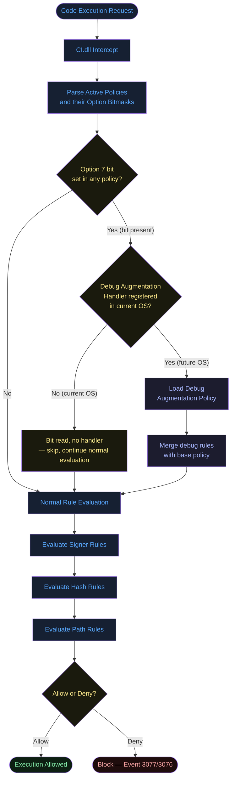
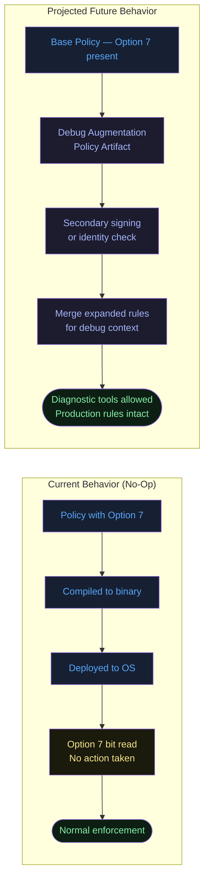
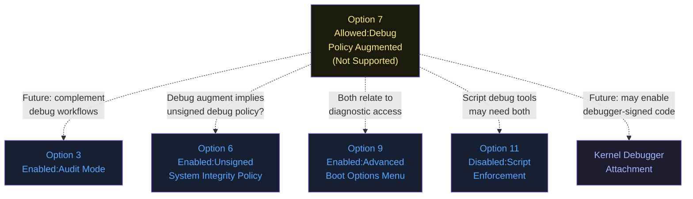
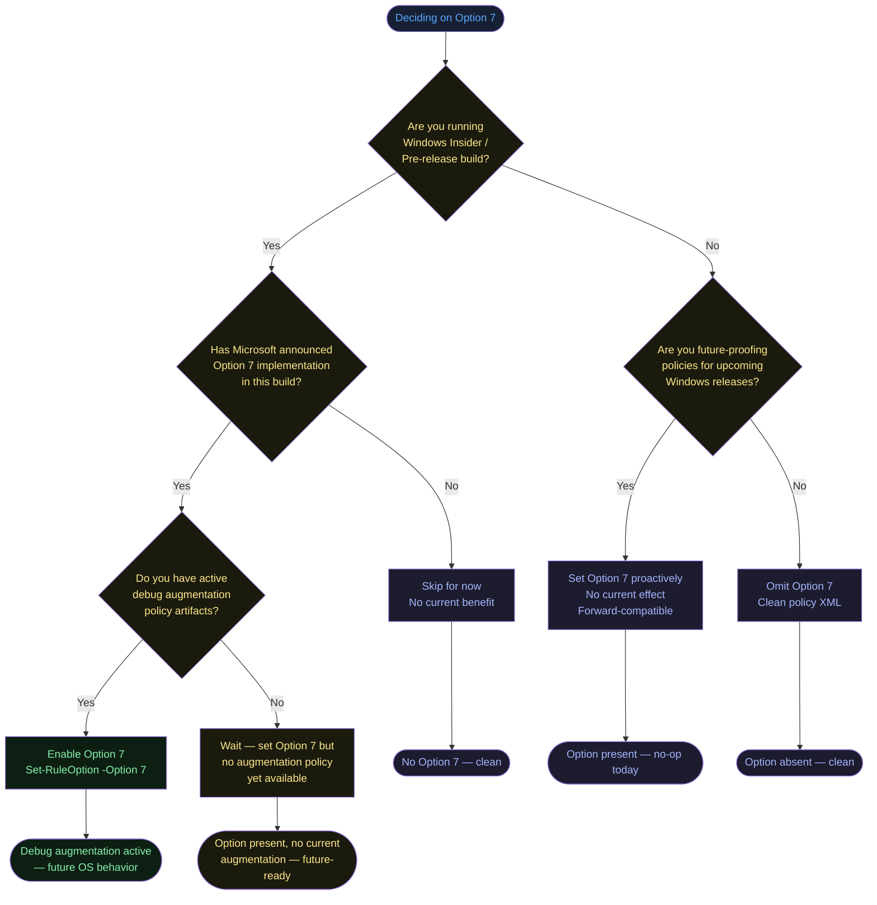
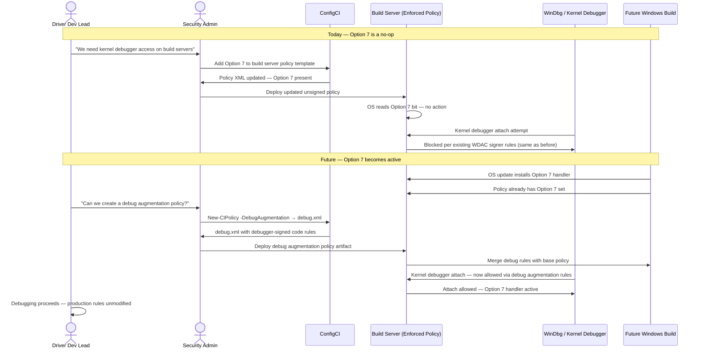
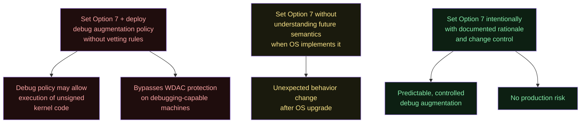

# Option 7 — Allowed:Debug Policy Augmented

**Author:** Anubhav Gain  
**Category:** Endpoint Security  
**Policy Rule Option Index:** 7  
**XML Value:** `<Rule><Option>Allowed:Debug Policy Augmented</Option></Rule>`  
**Valid for Supplemental Policies:** Yes  
**Status:** Not currently supported — reserved for future debug/diagnostic use

---

## Table of Contents

1. [What It Does](#1-what-it-does)
2. [Why It Exists](#2-why-it-exists)
3. [Visual Anatomy — Policy Evaluation Stack](#3-visual-anatomy--policy-evaluation-stack)
4. [How to Set It (PowerShell)](#4-how-to-set-it-powershell)
5. [XML Representation](#5-xml-representation)
6. [Interaction with Other Options](#6-interaction-with-other-options)
7. [When to Enable vs Disable](#7-when-to-enable-vs-disable)
8. [Real-World Scenario / End-to-End Walkthrough](#8-real-world-scenario--end-to-end-walkthrough)
9. [What Happens If You Get It Wrong](#9-what-happens-if-you-get-it-wrong)
10. [Valid for Supplemental Policies?](#10-valid-for-supplemental-policies)
11. [OS Version Requirements](#11-os-version-requirements)
12. [Summary Table](#12-summary-table)

---

## 1. What It Does

Option 7, **Allowed:Debug Policy Augmented**, is a policy rule option that is documented in the WDAC schema and toolchain but is **not currently supported** by any released Windows version. When present in a policy XML, the option is parsed and the bit is stored in the compiled binary, but the kernel-mode code integrity enforcement driver (CI.dll) takes no action on it at runtime. The name suggests its intended purpose: to allow a policy to be supplemented or overridden by a separate debug-oriented policy artifact at runtime, potentially enabling diagnostic code paths, kernel debugger attachments, or relaxed enforcement for development tooling without requiring a full policy replacement. Until Microsoft implements the feature in a shipping Windows build, this option is purely a reserved placeholder.

---

## 2. Why It Exists

### Debug and Diagnostic Tooling as a First-Class Concern

In mature software platforms, the ability to debug running systems is a fundamental operational requirement. For App Control for Business, strict enforcement of code integrity creates a tension with developer and security researcher workflows:

1. **Kernel debuggers** (WinDbg, kd) attach to the OS in ways that conflict with strict code integrity verification
2. **Driver development** requires loading unsigned or self-signed test drivers without disabling the entire policy
3. **Security research** needs the ability to run custom analysis tools that may not have production code signatures
4. **Incident response** tools are often custom-built and unsigned

Option 7 represents Microsoft's planned solution: rather than requiring organizations to choose between full enforcement and full permissiveness, a "debug augmentation" mechanism would allow a secondary policy layer to expand permissions for specific diagnostic scenarios, scoped in time or by cryptographic identity.

### The "Allowed" Prefix Semantic

Unlike options prefixed with "Enabled:" or "Required:", Option 7 uses the **"Allowed:"** prefix. In WDAC option naming conventions, this prefix indicates the option *permits* a behavior rather than *requiring* or *enabling* it. The distinction matters:
- "Enabled" options turn on a feature
- "Required" options mandate a condition
- "Allowed" options declare that a condition is acceptable/permissible

For a debug augmentation, "Allowed" means: the policy permits an augmentation layer to exist, not that it requires one. This preserves backward compatibility — a policy without an attached debug augmentation behaves identically to one without Option 7.

---

## 3. Visual Anatomy — Policy Evaluation Stack



### Projected Architecture (Future Implementation)



---

## 4. How to Set It (PowerShell)

The option index for **Allowed:Debug Policy Augmented** is **7**.

### Enable Option 7

```powershell
# Set Option 7 on a base policy
Set-RuleOption -FilePath "C:\Policies\MyPolicy.xml" -Option 7

# Set Option 7 on a supplemental policy
Set-RuleOption -FilePath "C:\Policies\MySupplementalPolicy.xml" -Option 7
```

### Remove Option 7

```powershell
# Remove the option
Remove-RuleOption -FilePath "C:\Policies\MyPolicy.xml" -Option 7
```

### Inspect All Current Options

```powershell
function Get-PolicyOptions {
    param([string]$PolicyPath)
    [xml]$pol = Get-Content $PolicyPath
    $options = $pol.SiPolicy.Rules.Rule | Select-Object -ExpandProperty Option
    Write-Host "Policy: $PolicyPath" -ForegroundColor Cyan
    Write-Host "Active Options:" -ForegroundColor White
    $options | ForEach-Object { Write-Host "  - $_" -ForegroundColor Gray }
    $hasO7 = $options -contains "Allowed:Debug Policy Augmented"
    Write-Host "Option 7 (Debug Augmented): $(if ($hasO7) { 'PRESENT (no-op today)' } else { 'ABSENT' })" `
        -ForegroundColor $(if ($hasO7) { 'Yellow' } else { 'Green' })
}

Get-PolicyOptions -PolicyPath "C:\Policies\MyPolicy.xml"
```

### Batch Policy Audit Script

```powershell
# Scan all policy XML files in a directory for Option 7 presence
$policyDir = "C:\Policies"
Get-ChildItem -Path $policyDir -Filter "*.xml" | ForEach-Object {
    [xml]$pol = Get-Content $_.FullName
    $opts = $pol.SiPolicy.Rules.Rule | Select-Object -ExpandProperty Option
    $hasO7 = $opts -contains "Allowed:Debug Policy Augmented"
    [PSCustomObject]@{
        PolicyFile = $_.Name
        Option7Set = $hasO7
        AllOptions = $opts -join "; "
    }
} | Format-Table -AutoSize
```

---

## 5. XML Representation

### Option 7 Present

```xml
<?xml version="1.0" encoding="utf-8"?>
<SiPolicy xmlns="urn:schemas-microsoft-com:sipolicy"
          PolicyType="Base Policy">

  <VersionEx>10.0.0.0</VersionEx>
  <PolicyTypeID>{A244370E-44C9-4C06-B551-F6016E563076}</PolicyTypeID>
  <PlatformID>{2E07F7E4-194C-4D20-B96C-1498069CCC11}</PlatformID>

  <Rules>
    <!-- Standard options -->
    <Rule>
      <Option>Enabled:Unsigned System Integrity Policy</Option>
    </Rule>
    <!-- Option 7: Not currently supported — reserved for debug augmentation -->
    <Rule>
      <Option>Allowed:Debug Policy Augmented</Option>
    </Rule>
  </Rules>

  <!-- When Option 7 is implemented, a DebugPolicySigners section
       may be required here, analogous to SupplementalPolicySigners -->

  <!-- ... FileRules, Signers, SigningScenarios ... -->
</SiPolicy>
```

### Option 7 Absent (Default)

When not set, the option element is simply absent from the `<Rules>` block. No explicit negation element exists in the schema.

### Bitmask Position

Option 7 occupies **bit position 7** in the 32-bit option flags field: `0x00000080`.

---

## 6. Interaction with Other Options

Because Option 7 is not yet implemented, all interactions described here are based on the option's name semantics and neighboring option behavior.



### Current Interaction Matrix

| Option | Interaction | Description |
|--------|------------|-------------|
| Option 3 — Audit Mode | Complementary | Both relate to non-blocking diagnostics |
| Option 6 — Unsigned Policy | Likely complementary | Debug augmentation policy probably unsigned |
| Option 9 — Boot Options Menu | Loosely related | Both concern diagnostic access paths |
| Option 11 — Disable Script Enforcement | Potentially complementary | Debug scripts may need script enforcement relaxed |
| All others | No conflict | Orthogonal to current enforcement |

---

## 7. When to Enable vs Disable



**Practical guidance:** Omit Option 7 from all production and pilot policies. There is no operational benefit today. For policy template maintenance pipelines, you may choose to set it to track its eventual implementation.

---

## 8. Real-World Scenario / End-to-End Walkthrough

### Scenario: Driver Development Team Prepares for Future Debug Augmentation

A Windows device driver team at a hardware manufacturer uses App Control to protect their build servers. They want to plan ahead for when Microsoft ships Option 7 functionality so that their kernel debugging workflow can be enabled without compromising production security.



This sequence illustrates the **two-phase preparation** model: set the option now so that when the OS capability ships, the team only needs to create the augmentation artifact rather than also redeploying the base policy across all devices.

---

## 9. What Happens If You Get It Wrong

### Current Risk Profile (No-Op Era)

Because Option 7 has no current runtime effect, there is **zero risk** from setting or omitting it today.

### Projected Future Risk Scenarios



### Misconfiguration Consequence Table

| Scenario | Today | Future (Projected) |
|----------|-------|-------------------|
| Set O7 on production policy | No effect | May allow debug augmentation — review required |
| Set O7 on isolated dev machines | No effect | Intentional — expected |
| Set O7 with permissive augment policy | No effect | Could bypass WDAC if augment allows broad signing |
| Forget O7 is set, OS updates | No effect | May activate unexpected debug permissions |
| Explicitly omit O7 | No effect | Debug augmentation permanently disabled |

**Best practice:** Maintain an audit log of which policies have Option 7 set, so that when the OS implements the feature, your change management process is triggered automatically.

---

## 10. Valid for Supplemental Policies?

**Yes.** Option 7 is valid for supplemental policies. Its intended semantics — allowing a debug augmentation policy to extend enforcement decisions — would be equally applicable in supplemental contexts, possibly even more so, since supplemental policies are designed to extend base policies for specific use cases (like developer machines).

A potential future model:
- Base policy: strict, Option 7 present (allows debug augmentation if attached)
- Supplemental policy: targets dev machines, also has Option 7, attaches a debug augmentation artifact
- Production machines: no debug augmentation artifact deployed, Option 7 effectively dormant

---

## 11. OS Version Requirements

| Requirement | Details |
|-------------|---------|
| Minimum OS for parsing | Windows 10 1903+ (option stored in binary) |
| Current runtime effect | None on any released Windows version |
| Future implementation target | Not yet announced — track Windows Insider blog |
| Server support | Windows Server 2019+ (for parsing) |
| ARM64 | Fully supported |
| Kernel debugger dependency | Likely — feature appears related to debug attach |
| Secure Boot dependency | Unknown — may require Secure Boot for augmentation policy verification |

---

## 12. Summary Table

| Property | Value |
|----------|-------|
| Option Index | 7 |
| Option Name | Allowed:Debug Policy Augmented |
| XML Element | `<Option>Allowed:Debug Policy Augmented</Option>` |
| Binary Bitmask Position | Bit 7 (0x00000080) |
| Default State | **Not set** (absent from XML) |
| Current Runtime Effect | **None — not currently supported** |
| Valid for Base Policy | Yes |
| Valid for Supplemental | Yes |
| Conflicts with | None (currently) |
| PowerShell Set | `Set-RuleOption -FilePath <path> -Option 7` |
| PowerShell Remove | `Remove-RuleOption -FilePath <path> -Option 7` |
| Risk Level (Today) | None |
| Risk Level (Future) | Medium–High if debug augmentation artifact is permissive |
| Recommendation | Omit from production; optionally set in dev/build policies for forward-compat |
| Minimum OS Version | Windows 10 1903 / Server 2019 (for schema parsing) |
| Requires VBS | Unknown (future implementation may require) |
| Requires Secure Boot | Unknown (future implementation may require) |
