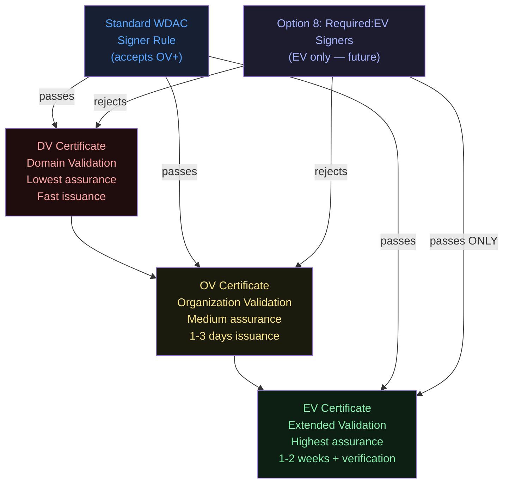
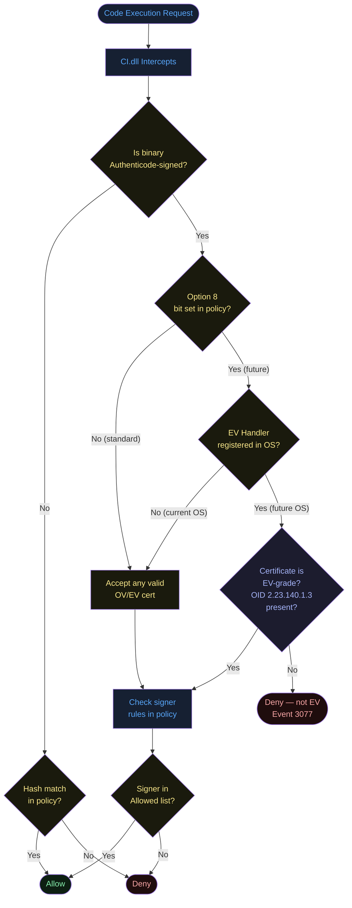
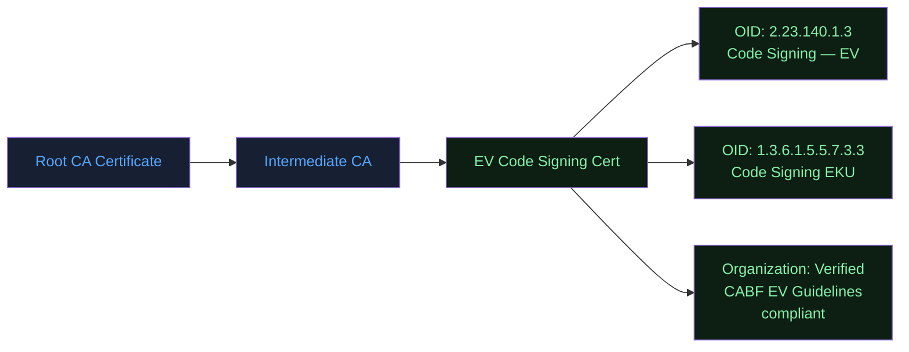
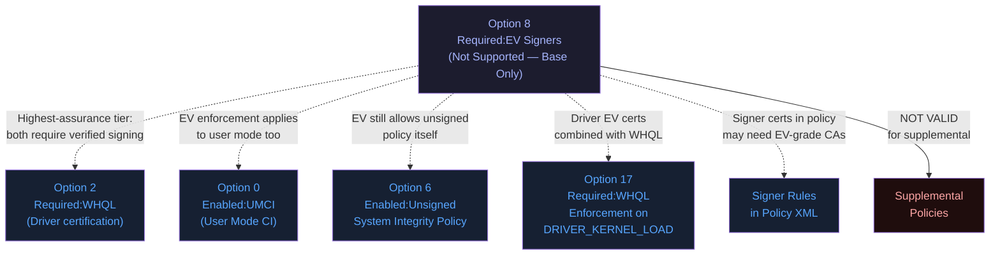
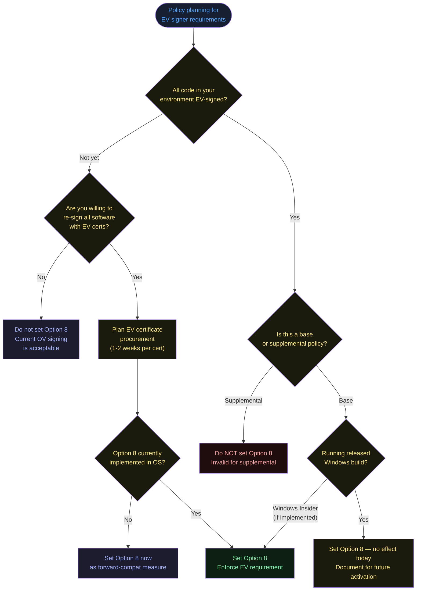
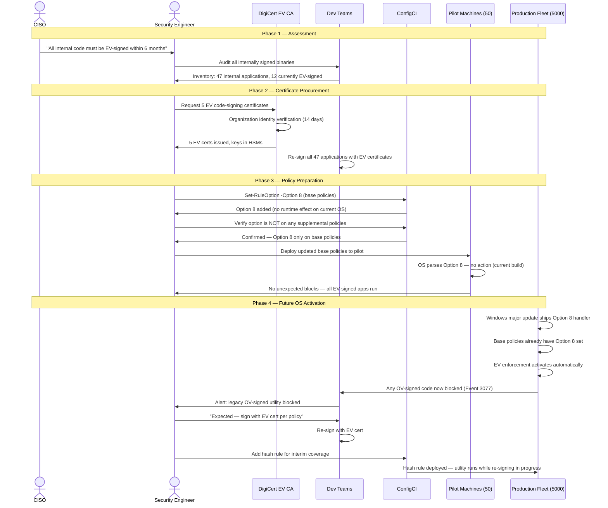
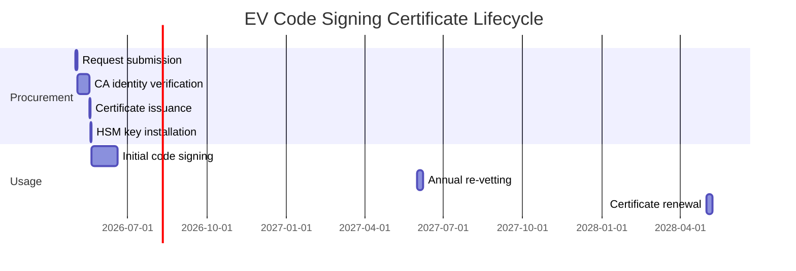
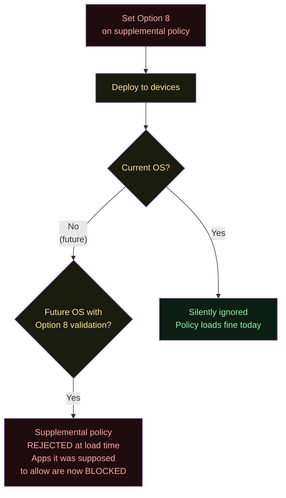

# Option 8 — Required:EV Signers

**Author:** Anubhav Gain  
**Category:** Endpoint Security  
**Policy Rule Option Index:** 8  
**XML Value:** `<Rule><Option>Required:EV Signers</Option></Rule>`  
**Valid for Supplemental Policies:** No  
**Status:** Not currently supported — reserved for future Extended Validation (EV) enforcement

---

## Table of Contents

1. [What It Does](#1-what-it-does)
2. [Why It Exists](#2-why-it-exists)
3. [Visual Anatomy — Policy Evaluation Stack](#3-visual-anatomy--policy-evaluation-stack)
4. [How to Set It (PowerShell)](#4-how-to-set-it-powershell)
5. [XML Representation](#5-xml-representation)
6. [Interaction with Other Options](#6-interaction-with-other-options)
7. [When to Enable vs Disable](#7-when-to-enable-vs-disable)
8. [Real-World Scenario / End-to-End Walkthrough](#8-real-world-scenario--end-to-end-walkthrough)
9. [What Happens If You Get It Wrong](#9-what-happens-if-you-get-it-wrong)
10. [Valid for Supplemental Policies?](#10-valid-for-supplemental-policies)
11. [OS Version Requirements](#11-os-version-requirements)
12. [Summary Table](#12-summary-table)

---

## 1. What It Does

Option 8, **Required:EV Signers**, is a policy rule option that is reserved in the WDAC schema and toolchain but is **not currently supported** on any shipping Windows release. When implemented, this option would mandate that all code permitted to execute under the policy must be signed by an **Extended Validation (EV) code-signing certificate** — a class of certificate that requires more rigorous identity verification by the issuing Certificate Authority than standard (OV/DV) code-signing certificates. EV certificates require the signing entity to undergo verified identity vetting, physical address confirmation, and organization validation before issuance, making them significantly harder to fraudulently obtain. As of today, enabling this option in a policy XML has no runtime effect: the bit is stored in the compiled binary but the enforcement engine has no handler for it. The option is **not valid for supplemental policies** — this restriction itself signals that EV signer enforcement is intended as a base-policy-level trust anchor requirement, not an additive extension mechanism.

---

## 2. Why It Exists

### The Code Signing Trust Problem

Standard Authenticode code-signing certificates (OV — Organization Validation) can be obtained with relatively minimal identity verification. This has historically led to malware authors obtaining legitimate certificates to sign malicious code, which then passes standard WDAC signer-rule checks. Several high-profile supply chain attacks have leveraged legitimately signed but malicious binaries.

Extended Validation (EV) certificates address this problem through:

1. **CA/Browser Forum (CABF) EV Guidelines compliance** — issuers must follow strict procedures
2. **Physical organization verification** — the CA must confirm the organization's legal existence and physical location
3. **Phone/postal verification** — direct human contact required for issuance
4. **Annual or biennial revetting** — identity is periodically re-confirmed
5. **Dedicated hardware tokens** — EV private keys often must be stored in HSMs, reducing theft risk

When Option 8 is eventually implemented, it would allow security teams to require not just *any* valid Authenticode signature but specifically an *EV-grade* signature, dramatically raising the bar for attackers to produce policy-compliant signed malware.

### Why "Required" Prefix

The "Required:" prefix in the option name means the condition is **mandatory** — no code without an EV signature would pass, not even code signed with a standard OV certificate. This is the strictest possible signer quality gate.

### EV vs OV vs DV in Context



---

## 3. Visual Anatomy — Policy Evaluation Stack



### EV Certificate OID Structure (Reference)



---

## 4. How to Set It (PowerShell)

The option index for **Required:EV Signers** is **8**.

### Enable Option 8

```powershell
# Set Option 8 on a base policy
# Note: No runtime effect on current Windows releases
Set-RuleOption -FilePath "C:\Policies\MyBasePolicy.xml" -Option 8
```

### Remove Option 8

```powershell
Remove-RuleOption -FilePath "C:\Policies\MyBasePolicy.xml" -Option 8
```

### Check EV Certificate Status of a Signed Binary

While Option 8 is not yet enforced by WDAC, you can manually verify whether a binary is EV-signed using:

```powershell
function Test-EVSignature {
    param([string]$BinaryPath)

    $sig = Get-AuthenticodeSignature -FilePath $BinaryPath
    if ($sig.Status -ne "Valid") {
        Write-Host "NOT SIGNED or invalid signature: $BinaryPath" -ForegroundColor Red
        return
    }

    $cert = $sig.SignerCertificate
    $chain = New-Object -TypeName System.Security.Cryptography.X509Certificates.X509Chain
    $chain.Build($cert) | Out-Null

    # Check for EV OID in certificate policies extension
    $evOid = "2.23.140.1.3"
    $isEV = $false

    foreach ($element in $chain.ChainElements) {
        foreach ($ext in $element.Certificate.Extensions) {
            if ($ext.Oid.Value -eq "2.5.29.32") {  # Certificate Policies OID
                if ($ext.Format($false) -like "*$evOid*") {
                    $isEV = $true
                    break
                }
            }
        }
        if ($isEV) { break }
    }

    Write-Host "Binary: $BinaryPath"
    Write-Host "Signer: $($cert.Subject)"
    Write-Host "EV Certificate: $(if ($isEV) { 'YES — EV grade' } else { 'NO — OV or lower' })" `
        -ForegroundColor $(if ($isEV) { 'Green' } else { 'Yellow' })
}

# Usage
Test-EVSignature -BinaryPath "C:\Windows\System32\notepad.exe"
Test-EVSignature -BinaryPath "C:\Program Files\MyApp\myapp.exe"
```

### Audit Existing Policy File for EV Readiness

```powershell
# Check if a policy has Option 8 set
function Test-PolicyEVOption {
    param([string]$PolicyPath)
    [xml]$pol = Get-Content $PolicyPath
    $opts = $pol.SiPolicy.Rules.Rule | Select-Object -ExpandProperty Option
    $isEVRequired = $opts -contains "Required:EV Signers"

    Write-Host "Policy: $(Split-Path $PolicyPath -Leaf)"
    Write-Host "Option 8 (EV Signers): $(if ($isEVRequired) {'REQUIRED (no-op today)'} else {'NOT SET'})" `
        -ForegroundColor $(if ($isEVRequired) {'Yellow'} else {'Gray'})

    # Warn about supplemental policy incompatibility
    $policyType = $pol.SiPolicy.PolicyType
    if ($isEVRequired -and $policyType -eq "Supplemental Policy") {
        Write-Warning "Option 8 is NOT valid for supplemental policies. Remove it."
    }
}
```

---

## 5. XML Representation

### Option 8 Present in Base Policy

```xml
<?xml version="1.0" encoding="utf-8"?>
<SiPolicy xmlns="urn:schemas-microsoft-com:sipolicy"
          PolicyType="Base Policy">

  <VersionEx>10.0.0.0</VersionEx>
  <PolicyTypeID>{A244370E-44C9-4C06-B551-F6016E563076}</PolicyTypeID>

  <Rules>
    <Rule>
      <Option>Enabled:Unsigned System Integrity Policy</Option>
    </Rule>
    <!-- Option 8: Reserved — will require EV code-signing certificates
         when implemented. Currently has no runtime enforcement effect. -->
    <Rule>
      <Option>Required:EV Signers</Option>
    </Rule>
  </Rules>

  <!-- ... FileRules, Signers, SigningScenarios ... -->

  <!--
    When Option 8 is implemented, signers listed here will need to be
    EV-grade certificates (carrying OID 2.23.140.1.3 in their policy chain).
    Non-EV signers in the policy may generate policy compilation warnings.
  -->

</SiPolicy>
```

### Invalid: Option 8 in Supplemental Policy

```xml
<!-- THIS IS INVALID — Option 8 is NOT valid for supplemental policies -->
<SiPolicy xmlns="urn:schemas-microsoft-com:sipolicy"
          PolicyType="Supplemental Policy">
  <Rules>
    <!-- WRONG: Option 8 cannot appear in supplemental policies -->
    <Rule>
      <Option>Required:EV Signers</Option>
    </Rule>
  </Rules>
</SiPolicy>
```

When attempting to compile a supplemental policy with Option 8, future OS versions may reject the policy or throw a compilation error. Current OS versions will silently ignore it.

### Bitmask Position

Option 8 occupies **bit position 8** in the 32-bit option flags field: `0x00000100`.

---

## 6. Interaction with Other Options



### Interaction Table

| Option | Interaction | Notes |
|--------|------------|-------|
| Option 0 — Enabled:UMCI | Complementary | EV requirement applies to user-mode code |
| Option 2 — Required:WHQL | Synergistic | Both raise the bar for driver signing quality |
| Option 3 — Enabled:Audit Mode | Compatible | EV checking in audit mode generates events without blocking |
| Option 6 — Unsigned Policy | Compatible (different scope) | EV applies to signed *code*, not policy signing |
| Option 10 — Boot Audit On Failure | Compatible | EV failures would generate boot audit events |
| Supplemental Policies | **Incompatible** | Option 8 explicitly invalid for supplemental policies |

### Why Not Valid for Supplemental Policies?

The "Required:EV Signers" option sets a system-wide trust floor. This kind of foundational trust requirement must come from the **base policy**, which governs the overall security posture of the device. A supplemental policy is an extension mechanism — allowing supplementals to set EV requirements would create ordering dependencies and potential conflicts between competing supplemental policies. By restricting Option 8 to base policies only, WDAC ensures a single authoritative trust tier definition.

---

## 7. When to Enable vs Disable



---

## 8. Real-World Scenario / End-to-End Walkthrough

### Scenario: Financial Institution Prepares for Maximum-Assurance Code Signing

A tier-1 bank's CISO mandates that all internally deployed code must eventually be signed with EV certificates to satisfy a new cyber-risk framework. The security team begins preparing policy infrastructure before the OS feature ships.



### EV Certificate Procurement Timeline



---

## 9. What Happens If You Get It Wrong

### Current (No-Op Era) — Minimal Risk

The only risk today is **administrative confusion**: setting Option 8 on a supplemental policy violates the schema spec even though the OS currently ignores it. If a future OS update validates this constraint during policy load, the supplemental policy may fail to load.

### Scenario A: Option 8 on Supplemental Policy (Invalid)



### Scenario B: Enable Option 8 (When Implemented) Without EV-Signing All Code

If Option 8 becomes active and your environment has OV-signed code:
- Every OV-signed binary triggers a block (Event 3077)
- Includes third-party software that uses OV certs (likely most commercial software)
- Potential system instability if critical system tools are blocked

### Risk Matrix

| Mistake | Today | Future |
|---------|-------|--------|
| Option 8 on supplemental | Silent, no effect | Policy load failure — apps blocked |
| Option 8 without EV re-signing all code | No effect | Mass block of OV-signed binaries |
| Option 8 without understanding EV OID | No effect | Surprise enforcement activation |
| Forgetting Option 8 is set pre-activation | No effect | Unexpected hardening on OS update |
| Option 8 on base, no audit mode testing | No effect now | Untested enforcement gap discovery in production |

**Recommendation:** If you set Option 8 proactively, also maintain an OV-signed binary inventory so that when the feature activates, you have a clear remediation plan.

---

## 10. Valid for Supplemental Policies?

**No.** Option 8 is explicitly **not valid for supplemental policies**. This is one of only a few options with this restriction (alongside Option 9).

### Why This Restriction Exists

EV signer requirements establish a minimum trust bar for *all code* on the system. This is a foundational security invariant that must be set at the base policy level, not selectively applied by extensions. If supplemental policies could set EV requirements, conflicts would arise:

- Supplemental A: EV required for path X
- Supplemental B: No EV required for path X
- Result: Undefined behavior — race condition on policy merge

By reserving Option 8 for base policies only, WDAC ensures a single, authoritative, non-conflicting EV requirement definition.

### Enforcement of This Restriction

Currently (no runtime effect): The restriction is not enforced — a supplemental with Option 8 will load fine. This is expected to change when Option 8 is implemented.

Future enforcement will likely throw an error code similar to `HRESULT: 0xC0E90003` (policy configuration error) when loading a supplemental with invalid options.

---

## 11. OS Version Requirements

| Requirement | Details |
|-------------|---------|
| Minimum OS for parsing | Windows 10 1903+ / Server 2019+ |
| Current runtime EV enforcement | **None** — not implemented on any released version |
| Future implementation | Not announced — track Windows 11 Insider Preview release notes |
| EV certificate standard | CA/Browser Forum (CABF) EV Code Signing v1.3+ |
| EV OID | 2.23.140.1.3 (EV Code Signing) |
| ARM64 | Fully supported |
| Secure Boot dependency | Unknown — likely required for full trust chain verification |
| TPM dependency | Possible — EV key storage in TPM/HSM may be required |

### EV Certificate Standards Reference

| Standard | Body | Relevance |
|----------|------|----------|
| CA/Browser Forum EV Guidelines | CABF | Defines EV issuance requirements |
| RFC 5280 | IETF | X.509 certificate structure |
| RFC 3280 Certificate Policies | IETF | Policy OID structure |
| OID 2.23.140.1.3 | CABF arc | EV code signing marker |
| Microsoft Authenticode | Microsoft | Windows code signing format |

---

## 12. Summary Table

| Property | Value |
|----------|-------|
| Option Index | 8 |
| Option Name | Required:EV Signers |
| XML Element | `<Option>Required:EV Signers</Option>` |
| Binary Bitmask Position | Bit 8 (0x00000100) |
| Default State | **Not set** (absent from XML) |
| Current Runtime Effect | **None — not currently supported** |
| Valid for Base Policy | Yes |
| Valid for Supplemental | **No** — explicitly invalid |
| Conflicts with | Supplemental policy context |
| PowerShell Set | `Set-RuleOption -FilePath <path> -Option 8` |
| PowerShell Remove | `Remove-RuleOption -FilePath <path> -Option 8` |
| Risk Level (Today) | None for base; Low for supplemental (future schema violation) |
| Risk Level (Future, if enabled) | High if OV-signed software is not re-signed |
| Recommendation | Plan EV certificate procurement; set proactively on base policies only |
| Minimum OS Version | Windows 10 1903 / Server 2019 (for parsing) |
| EV OID | 2.23.140.1.3 |
| Requires VBS | Unknown |
| Requires Secure Boot | Likely for future implementation |
