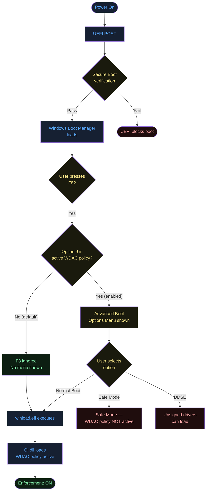
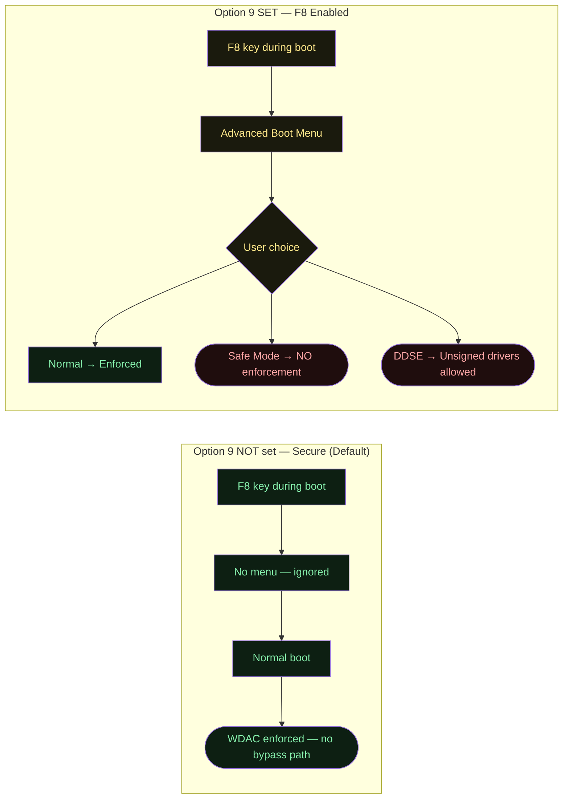
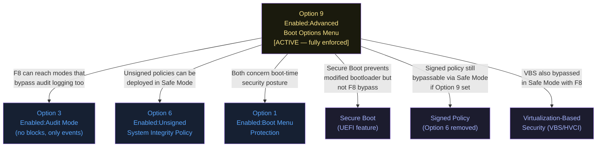
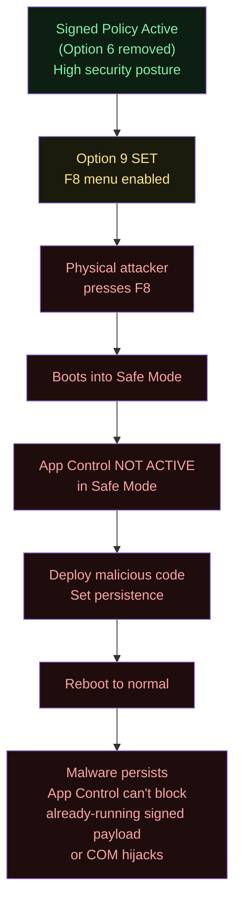
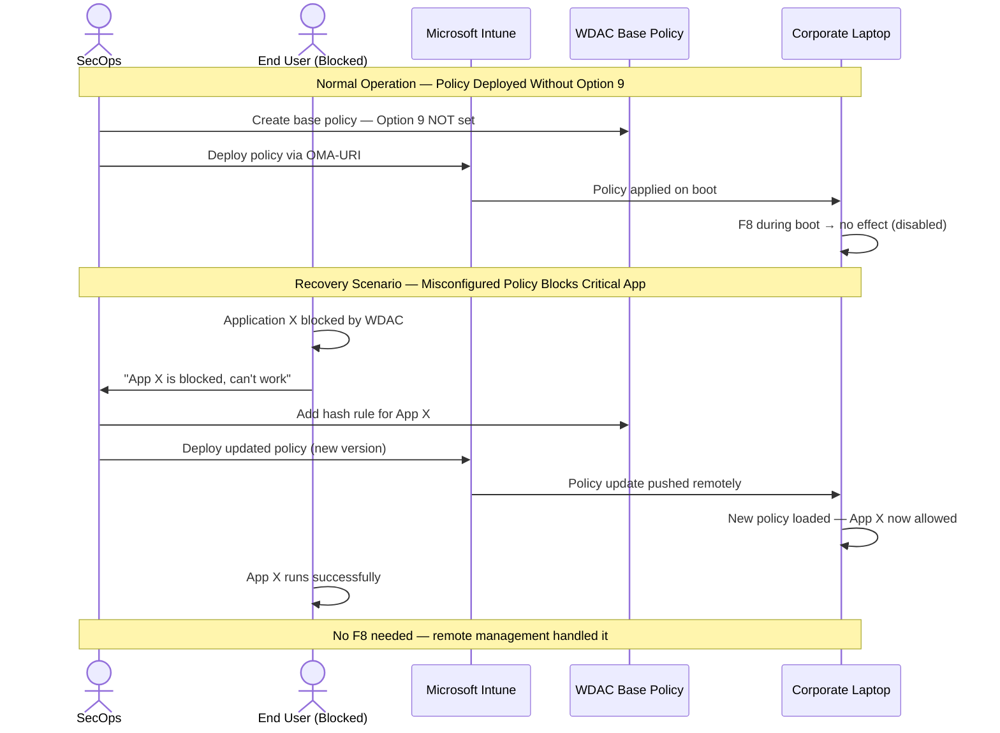
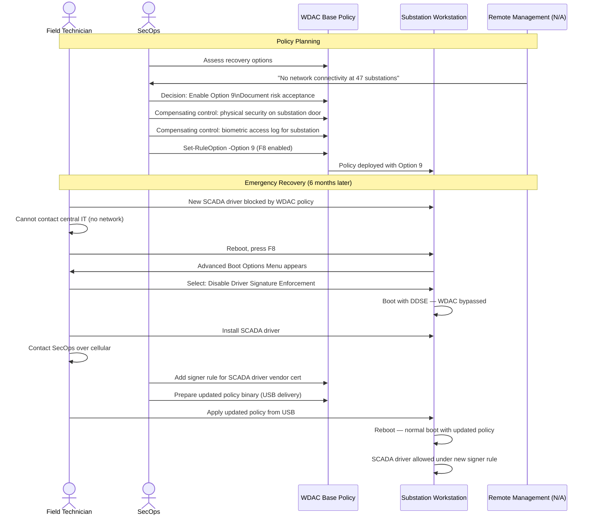
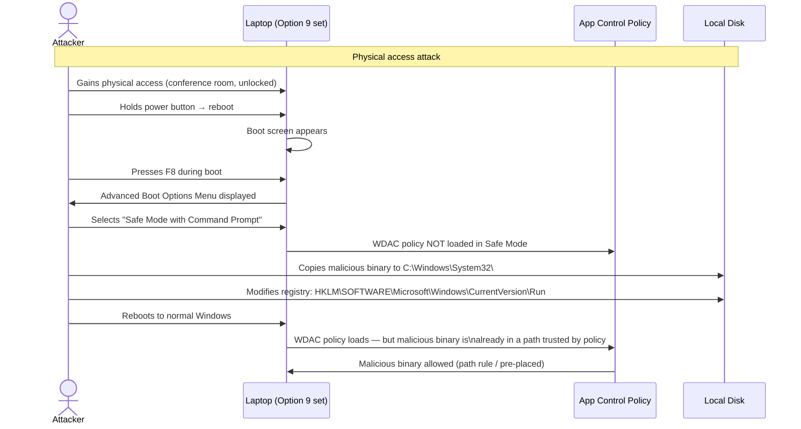
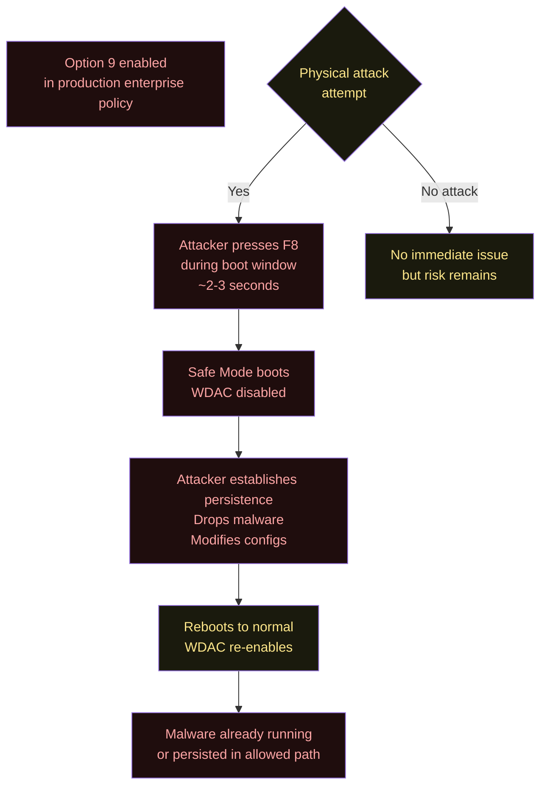
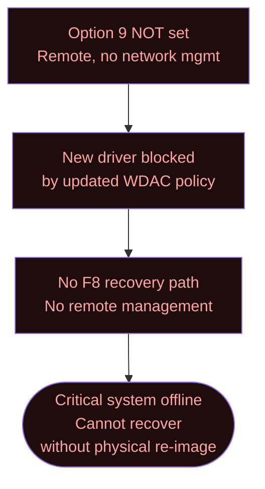
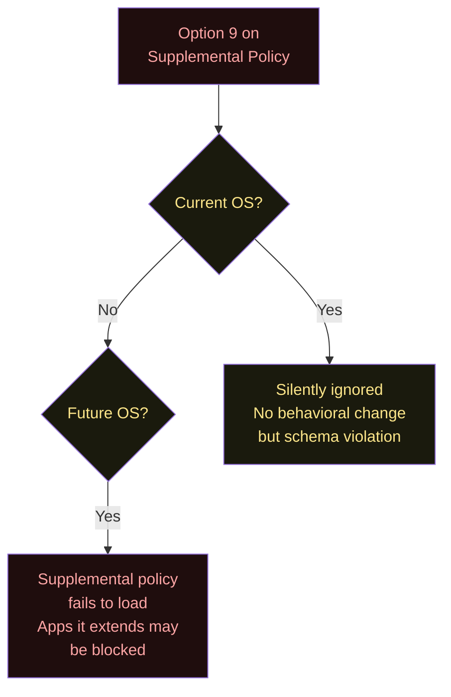

# Option 9 — Enabled:Advanced Boot Options Menu

**Author:** Anubhav Gain  
**Category:** Endpoint Security  
**Policy Rule Option Index:** 9  
**XML Value:** `<Rule><Option>Enabled:Advanced Boot Options Menu</Option></Rule>`  
**Valid for Supplemental Policies:** No  
**Status:** Fully implemented and enforced on all supported Windows versions

---

## Table of Contents

1. [What It Does](#1-what-it-does)
2. [Why It Exists](#2-why-it-exists)
3. [Visual Anatomy — Policy Evaluation Stack](#3-visual-anatomy--policy-evaluation-stack)
4. [How to Set It (PowerShell)](#4-how-to-set-it-powershell)
5. [XML Representation](#5-xml-representation)
6. [Interaction with Other Options](#6-interaction-with-other-options)
7. [When to Enable vs Disable](#7-when-to-enable-vs-disable)
8. [Real-World Scenario / End-to-End Walkthrough](#8-real-world-scenario--end-to-end-walkthrough)
9. [What Happens If You Get It Wrong](#9-what-happens-if-you-get-it-wrong)
10. [Valid for Supplemental Policies?](#10-valid-for-supplemental-policies)
11. [OS Version Requirements](#11-os-version-requirements)
12. [Summary Table](#12-summary-table)

---

## 1. What It Does

Option 9, **Enabled:Advanced Boot Options Menu**, controls whether a physically present user can access the Windows **F8 preboot menu** on a device protected by an App Control for Business policy. By default, when any App Control policy is active on a device, the F8 preboot menu is **disabled** — pressing F8 during boot produces no effect and the OS boots directly into enforcement mode. This is a deliberate security design: the F8 menu can be used to boot into Safe Mode or other diagnostic modes that bypass App Control enforcement, creating a physical-access vector for policy circumvention. Setting Option 9 **re-enables** the F8 menu so that a user physically present at the device can access Safe Mode, Last Known Good Configuration, Disable Driver Signature Enforcement (DDSE), and other advanced boot options. This is a **live, fully-enforced** option on all shipping Windows versions — unlike Options 5, 7, and 8, which are no-ops today.

---

## 2. Why It Exists

### The Physical Access Attack Vector

App Control policies are enforced by the Windows kernel at runtime. However, Windows also provides legitimate administrative recovery mechanisms that operate *before* the kernel fully loads enforcement rules:

- **F8 → Safe Mode with Networking:** Minimal driver set loaded, App Control not active
- **F8 → Disable Driver Signature Enforcement:** Loads unsigned kernel drivers
- **F8 → Last Known Good Configuration:** Reverts to a previous boot state
- **Windows Recovery Environment (WinRE):** Offline tools that bypass running-OS protections

Without Option 9, Microsoft locks out these pre-boot options entirely when an App Control policy is active. The rationale: if an attacker (or an overly curious user) can boot into Safe Mode, they can run arbitrary unsigned code, copy unsigned binaries to startup locations, and then reboot into normal mode with malicious persistence.

### Why Option 9 Exists as an Explicit Enable

Some legitimate operational scenarios *require* F8 access:

1. **Break-glass recovery:** If a misconfigured policy blocks critical drivers, Safe Mode is the only recovery path
2. **Field service technicians:** Hardware repair may require diagnostic boot modes
3. **Kiosk devices:** In some locked-down kiosk deployments, the physical operator needs recovery access
4. **Development and testing labs:** Machines may need to load test drivers via DDSE
5. **Machines without remote management:** If SCCM/Intune is unavailable, boot menu is the only recovery path

Option 9 exists to give administrators explicit control: opt-in to F8 access when operationally necessary, knowing the security trade-off.

### The "Physically Present User" Requirement

The option is specifically designed for physical access scenarios. Remote attackers cannot press F8, so enabling Option 9 does **not** introduce remote exploitation vectors. The threat model is:
- Physical attacker at an unattended machine who can access the keyboard during the brief boot window
- An employee rebooting their own machine and holding F8

---

## 3. Visual Anatomy — Policy Evaluation Stack

### Boot Flow with Option 9 Disabled (Default)



### Security Posture Comparison



---

## 4. How to Set It (PowerShell)

The option index for **Enabled:Advanced Boot Options Menu** is **9**.

### Enable Option 9 (Allow F8 Menu)

```powershell
# Allow F8 preboot menu access on this policy
Set-RuleOption -FilePath "C:\Policies\MyBasePolicy.xml" -Option 9
```

### Remove Option 9 (Disable F8 Menu — Default / Most Secure)

```powershell
# Disable F8 menu (recommended for production — this is also the default)
Remove-RuleOption -FilePath "C:\Policies\MyBasePolicy.xml" -Option 9
```

### Check Current F8 State

```powershell
function Test-F8MenuEnabled {
    param([string]$PolicyPath)
    [xml]$pol = Get-Content $PolicyPath
    $opts = $pol.SiPolicy.Rules.Rule | Select-Object -ExpandProperty Option
    $f8Enabled = $opts -contains "Enabled:Advanced Boot Options Menu"
    $policyType = $pol.SiPolicy.PolicyType

    if ($policyType -eq "Supplemental Policy" -and $f8Enabled) {
        Write-Warning "Option 9 is set on a SUPPLEMENTAL policy — this is invalid!"
    }

    Write-Host "Policy: $(Split-Path $PolicyPath -Leaf)" -ForegroundColor Cyan
    Write-Host "Policy Type: $policyType"
    Write-Host "F8 Boot Menu: $(if ($f8Enabled) { 'ENABLED (security risk)' } else { 'DISABLED (secure)' })" `
        -ForegroundColor $(if ($f8Enabled) { 'Yellow' } else { 'Green' })
}

Test-F8MenuEnabled -PolicyPath "C:\Policies\MyBasePolicy.xml"
```

### Full Hardening Script: Ensure F8 is Disabled Across All Policies

```powershell
# Audit all policy XML files and report/fix Option 9 presence
$policyDir = "C:\Policies"
$report = @()

Get-ChildItem -Path $policyDir -Filter "*.xml" | ForEach-Object {
    [xml]$pol = Get-Content $_.FullName
    $opts = $pol.SiPolicy.Rules.Rule | Select-Object -ExpandProperty Option
    $f8Set = $opts -contains "Enabled:Advanced Boot Options Menu"
    $type = $pol.SiPolicy.PolicyType

    $report += [PSCustomObject]@{
        PolicyFile  = $_.Name
        PolicyType  = $type
        F8Enabled   = $f8Set
        Compliant   = -not $f8Set
        InvalidOption9OnSupplemental = ($type -eq "Supplemental Policy" -and $f8Set)
    }

    # Auto-fix: remove Option 9 from supplemental policies (invalid)
    if ($type -eq "Supplemental Policy" -and $f8Set) {
        Write-Warning "Removing invalid Option 9 from supplemental: $($_.Name)"
        Remove-RuleOption -FilePath $_.FullName -Option 9
    }
}

$report | Format-Table -AutoSize

# Summary
$nonCompliant = $report | Where-Object { -not $_.Compliant }
if ($nonCompliant) {
    Write-Host "`nNon-compliant policies (F8 enabled):" -ForegroundColor Yellow
    $nonCompliant | Select-Object PolicyFile, PolicyType | Format-Table
}
```

---

## 5. XML Representation

### Option 9 Present (F8 Menu Enabled)

```xml
<?xml version="1.0" encoding="utf-8"?>
<SiPolicy xmlns="urn:schemas-microsoft-com:sipolicy"
          PolicyType="Base Policy">

  <VersionEx>10.0.0.0</VersionEx>
  <PolicyTypeID>{A244370E-44C9-4C06-B551-F6016E563076}</PolicyTypeID>
  <PlatformID>{2E07F7E4-194C-4D20-B96C-1498069CCC11}</PlatformID>

  <Rules>
    <Rule>
      <Option>Enabled:Unsigned System Integrity Policy</Option>
    </Rule>
    <!-- Option 9: F8 preboot Advanced Boot Options Menu is PERMITTED -->
    <!-- WARNING: This weakens physical-access security. Enable only when
         operational recovery requirements justify the trade-off. -->
    <Rule>
      <Option>Enabled:Advanced Boot Options Menu</Option>
    </Rule>
  </Rules>

  <!-- ... FileRules, Signers, SigningScenarios ... -->
</SiPolicy>
```

### Option 9 Absent (F8 Menu Disabled — Secure Default)

```xml
<?xml version="1.0" encoding="utf-8"?>
<SiPolicy xmlns="urn:schemas-microsoft-com:sipolicy"
          PolicyType="Base Policy">

  <VersionEx>10.0.0.0</VersionEx>

  <Rules>
    <Rule>
      <Option>Enabled:Unsigned System Integrity Policy</Option>
    </Rule>
    <!-- Option 9 absent = F8 menu disabled = most secure posture -->
  </Rules>

  <!-- ... FileRules, Signers, SigningScenarios ... -->
</SiPolicy>
```

### Invalid: Option 9 in Supplemental Policy

```xml
<!-- INVALID CONFIGURATION — will be ignored today, may fail in future -->
<SiPolicy xmlns="urn:schemas-microsoft-com:sipolicy"
          PolicyType="Supplemental Policy">
  <Rules>
    <!-- This is WRONG — Option 9 is not valid for supplemental policies -->
    <Rule>
      <Option>Enabled:Advanced Boot Options Menu</Option>
    </Rule>
  </Rules>
</SiPolicy>
```

### Bitmask Position

Option 9 occupies **bit position 9** in the 32-bit option flags field: `0x00000200`.

---

## 6. Interaction with Other Options

Option 9 is one of the most security-sensitive options because it controls a **physical bypass path** for all other App Control enforcement.



### Critical Security Interaction: Option 9 Bypasses Signed Policies

This is the most important interaction to understand. Even if you have removed Option 6 (signed policy mode, tamper-resistant), **enabling Option 9 can still allow a physically present attacker to bypass the policy**:



**Lesson:** Signed policies + Option 9 = false sense of security. If F8 is enabled, physical access defeats the policy.

### Interaction Table

| Option / Feature | Interaction | Notes |
|-----------------|------------|-------|
| Option 1 — Boot Menu Protection | Related | Both protect boot-time paths |
| Option 3 — Audit Mode | Weakened by O9 | Safe Mode bypasses audit events too |
| Option 6 — Unsigned Policy | Undermined | Even signed policies bypass-able via F8 |
| Secure Boot | Complementary but insufficient | Secure Boot prevents unsigned bootloader, not F8 Safe Mode |
| VBS / HVCI | Bypassed by F8 in some configs | VBS not active in Safe Mode |
| Supplemental Policies | **Invalid** — O9 only for base | Cannot set on supplemental |

---

## 7. When to Enable vs Disable

```mermaid
flowchart TD
    START([Deciding on Option 9]) --> Q_TYPE{Is this a\nbase or supplemental\npolicy?}
    Q_TYPE -- Supplemental --> INVALID([Do NOT set\nOption 9 is invalid\nfor supplemental])
    Q_TYPE -- Base --> Q1{What type of\ndevice is this policy for?}

    Q1 -- "Corporate workstation / laptop" --> Q2{Do you have remote\nmanagement recovery\npath? (Intune/SCCM)}
    Q2 -- Yes --> Q3{High-security\nenvironment?\nThreat model includes\nphysical attacks?}
    Q3 -- Yes --> DISABLE[Omit Option 9\nF8 disabled\nRemote recovery only]
    Q3 -- No --> Q4{Have you had\nF8-recovery incidents\nin the past year?}
    Q4 -- No --> DISABLE
    Q4 -- Yes --> EVAL[Evaluate risk:\nEnable O9 or improve\nremote management?]

    Q2 -- No --> Q5{Are devices in\nunmanned remote\nlocations?}
    Q5 -- Yes --> ENABLE_CAREFULLY[Enable Option 9\nDocument + monitor\nPhysical security controls]
    Q5 -- No --> Q6{Helpdesk can reach\ndevice in reasonable time?}
    Q6 -- Yes --> DISABLE
    Q6 -- No --> ENABLE_CAREFULLY

    Q1 -- "Kiosk / ATM / POS" --> KIOSK{Physical security\ncontrols on device?}
    KIOSK -- Yes --> DISABLE
    KIOSK -- No --> ENABLE_CAREFULLY

    Q1 -- "Developer / IT workstation" --> DEV_Q{WDAC in\naudit mode?}
    DEV_Q -- Yes --> ENABLE_DEV[May enable O9\nLower risk in audit mode]
    DEV_Q -- No --> DISABLE

    style START fill:#162032,color:#58a6ff
    style Q_TYPE fill:#1a1a0d,color:#fde68a
    style Q1 fill:#1a1a0d,color:#fde68a
    style Q2 fill:#1a1a0d,color:#fde68a
    style Q3 fill:#1a1a0d,color:#fde68a
    style Q4 fill:#1a1a0d,color:#fde68a
    style Q5 fill:#1a1a0d,color:#fde68a
    style Q6 fill:#1a1a0d,color:#fde68a
    style KIOSK fill:#1a1a0d,color:#fde68a
    style DEV_Q fill:#1a1a0d,color:#fde68a
    style INVALID fill:#1f0d0d,color:#fca5a5
    style DISABLE fill:#0d1f12,color:#86efac
    style ENABLE_CAREFULLY fill:#1a1a0d,color:#fde68a
    style ENABLE_DEV fill:#1c1c2e,color:#a5b4fc
    style EVAL fill:#1a1a0d,color:#fde68a
```

---

## 8. Real-World Scenario / End-to-End Walkthrough

### Scenario A: Enterprise Security — F8 Disabled (Default / Recommended)

A corporate security team deploys App Control to 8,000 workstations. They deliberately leave Option 9 unset (F8 disabled) and implement remote recovery via Microsoft Intune.



### Scenario B: Remote Deployment — F8 Enabled (Operational Requirement)

A utility company deploys WDAC to industrial control system workstations in unmanned substations. No remote management is available. F8 must be accessible for emergency recovery.



### Scenario C: Attacker Exploiting Option 9



---

## 9. What Happens If You Get It Wrong

### Mistake A: Leaving Option 9 Set in High-Security Environment



### Mistake B: Not Setting Option 9 in Isolated Remote Environment



### Mistake C: Option 9 on a Supplemental Policy



### Consequence Matrix

| Mistake | Severity | Consequence | Recovery |
|---------|----------|-------------|---------|
| O9 set, no physical security on device | Critical | Physical access → WDAC bypass | Remove O9, add physical security |
| O9 set on signed policy | High | Signed policy remains bypassed via F8 | Remove O9 |
| O9 not set, no remote mgmt | High | Recovery requires physical re-image | Add remote mgmt or enable O9 with physical controls |
| O9 on supplemental | Low (today) | Schema violation, future load failure | Remove O9 from supplemental |
| O9 not documented in change record | Low | Audit failure during compliance review | Document decision rationale |

---

## 10. Valid for Supplemental Policies?

**No.** Option 9 is **not valid for supplemental policies**. This restriction is enforced because F8 menu behavior is a system-wide, device-level setting that must be controlled by the base policy. A supplemental policy by definition is scoped to extend permissions for specific applications or scenarios — it has no mechanism to control boot-time behavior.

### Why the Restriction Makes Sense

The F8 preboot menu is evaluated by the Windows Boot Manager (`bootmgr.efi` / `winload.efi`) before the full OS loads. At that point, only the base policy is evaluated. Supplemental policies are loaded later, after the OS kernel starts. Therefore, even if the schema allowed Option 9 on supplemental policies, the Boot Manager would never see it.

The restriction in the schema is thus both a **logical correctness** requirement (Boot Manager only reads base policy) and a **security** requirement (prevent confusion about which policy controls F8).

---

## 11. OS Version Requirements

| Requirement | Details |
|-------------|---------|
| Minimum OS | Windows 10, version 1709 (Build 16299) |
| Windows 11 | Fully supported |
| Windows Server | Server 2019+ |
| ARM64 | Fully supported |
| Hypervisor dependency | None |
| Secure Boot dependency | None (but Secure Boot is recommended alongside) |
| UEFI requirement | UEFI firmware (not legacy BIOS) recommended for full enforcement |
| Safe Mode behavior | F8 → Safe Mode bypasses WDAC on ALL versions when O9 is set |

### Boot Mode vs. WDAC Enforcement Status

| Boot Mode | App Control Active? | Notes |
|-----------|-------------------|-------|
| Normal boot | Yes | Full enforcement |
| Safe Mode | No | WDAC does not load |
| Safe Mode with Networking | No | WDAC does not load |
| Safe Mode with Command Prompt | No | WDAC does not load |
| Disable Driver Signature Enforcement | No | Unsigned drivers allowed, WDAC bypassed |
| WinRE (Recovery Environment) | No | Offline environment |
| WinPE | No | Separate OS instance |

---

## 12. Summary Table

| Property | Value |
|----------|-------|
| Option Index | 9 |
| Option Name | Enabled:Advanced Boot Options Menu |
| XML Element | `<Option>Enabled:Advanced Boot Options Menu</Option>` |
| Binary Bitmask Position | Bit 9 (0x00000200) |
| Default State | **Not set** — F8 menu DISABLED by default |
| Current Runtime Effect | **Fully active** — controls F8 behavior on all releases |
| Valid for Base Policy | Yes |
| Valid for Supplemental | **No** — boot-time evaluation predates supplemental loading |
| Conflicts with | Security posture goals when set alongside signed policies |
| PowerShell Set | `Set-RuleOption -FilePath <path> -Option 9` |
| PowerShell Remove | `Remove-RuleOption -FilePath <path> -Option 9` |
| Security Risk When Set | High — physical access bypasses all WDAC enforcement |
| Operational Risk When Not Set | Medium — no F8 recovery without remote management |
| Recommendation | **Omit in production**; enable only with documented physical security controls |
| Minimum OS Version | Windows 10 1709 / Server 2019 |
| Requires VBS | No |
| Requires Secure Boot | No (but Secure Boot is recommended for defense-in-depth) |
| Compensating Controls When Enabled | Physical security locks, badge access logs, CCTV, biometrics |
