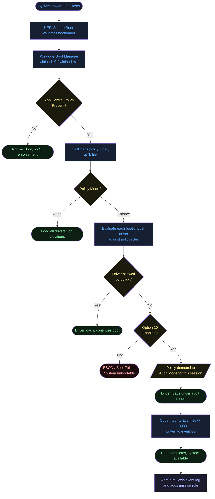
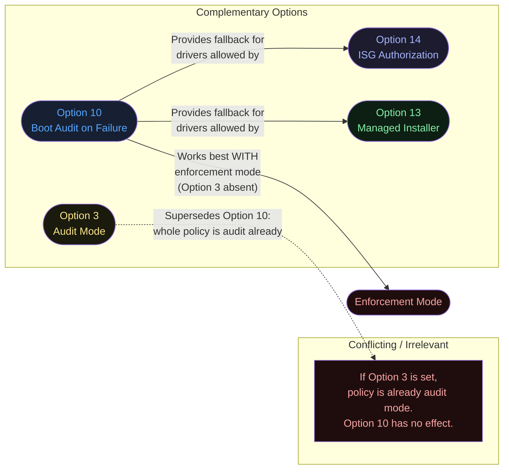
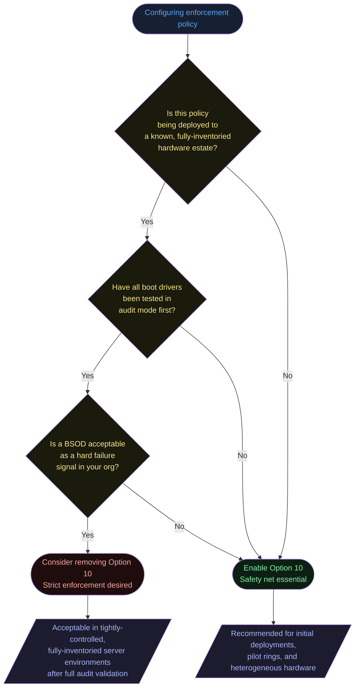
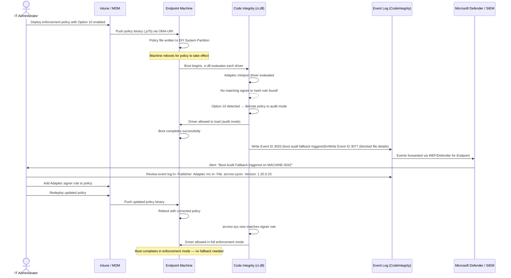

# Option 10 — Enabled:Boot Audit on Failure

**Author:** Anubhav Gain
**Category:** Endpoint Security
**Policy Rule Option:** 10
**Rule Name:** `Enabled:Boot Audit on Failure`
**Applies to Supplemental Policies:** No

---

## Table of Contents

1. [What It Does](#what-it-does)
2. [Why It Exists](#why-it-exists)
3. [Visual Anatomy — Policy Evaluation Stack](#visual-anatomy--policy-evaluation-stack)
4. [How to Set It (PowerShell)](#how-to-set-it-powershell)
5. [XML Representation](#xml-representation)
6. [Interaction With Other Options](#interaction-with-other-options)
7. [When to Enable vs Disable](#when-to-enable-vs-disable)
8. [Real-World Scenario — End-to-End Walkthrough](#real-world-scenario--end-to-end-walkthrough)
9. [What Happens If You Get It Wrong](#what-happens-if-you-get-it-wrong)
10. [Valid for Supplemental Policies?](#valid-for-supplemental-policies)
11. [OS Version Requirements](#os-version-requirements)
12. [Summary Table](#summary-table)

---

## What It Does

When **Enabled:Boot Audit on Failure** is active in an enforcement-mode App Control for Business (WDAC) policy, Windows acts as a safety net during early boot. If a boot-critical driver or binary is blocked by the policy—causing the system to fail to initialize—the kernel automatically demotes the entire App Control policy from **enforcement mode to audit mode** for that boot session. Windows continues loading, the blocked driver is permitted to run in this fallback mode, and a Code Integrity event is written to the event log so administrators can investigate and resolve the rule gap before the next restart. Without this option, a misconfigured policy that blocks a critical boot driver would render the machine unbootable.

---

## Why It Exists

Deploying an enforcement-mode WDAC policy is inherently risky when the full software inventory of a machine is unknown or when third-party hardware (RAID controllers, storage drivers, NIC firmware) is present. If the policy is missing a signer rule or hash for a boot-critical component, the result is a **blue screen** or **recovery loop**, requiring physical access or WinRE intervention to remove the policy.

Option 10 solves this problem by providing a **graceful degradation path**: the machine recovers automatically, no user data is lost, and the administrator has a clear log trail pointing to exactly which binary caused the failure. This is especially valuable during phased enforcement rollouts or when deploying policies to a hardware estate that includes uncommon OEM drivers.

---

## Visual Anatomy — Policy Evaluation Stack

The following diagram shows where Option 10 intercepts the normal boot-time policy enforcement flow.



---

## How to Set It (PowerShell)

### Enable Option 10

```powershell
# Enable Boot Audit on Failure in an existing policy XML
Set-RuleOption -FilePath "C:\Policies\MyPolicy.xml" -Option 10
```

### Remove (Disable) Option 10

```powershell
# Remove Boot Audit on Failure (system will BSOD if boot driver is blocked)
Remove-RuleOption -FilePath "C:\Policies\MyPolicy.xml" -Option 10
```

### Full Example — Creating a Policy with Option 10 Enabled

```powershell
# Start from the DefaultWindows template
$PolicyPath = "C:\Policies\EnforceWithBootAudit.xml"

Copy-Item -Path "C:\Windows\schemas\CodeIntegrity\ExamplePolicies\DefaultWindows_Enforced.xml" `
          -Destination $PolicyPath

# Ensure enforcement mode
Set-RuleOption -FilePath $PolicyPath -Option 3   # Enabled:Audit Mode (remove this for enforcement)
Remove-RuleOption -FilePath $PolicyPath -Option 3 # Remove audit mode to enforce

# Enable Boot Audit on Failure
Set-RuleOption -FilePath $PolicyPath -Option 10

# Convert to binary
ConvertFrom-CIPolicy -XmlFilePath $PolicyPath `
                     -BinaryFilePath "C:\Policies\EnforceWithBootAudit.p7b"
```

### Verify the Option is Set

```powershell
[xml]$policy = Get-Content "C:\Policies\MyPolicy.xml"
$policy.SiPolicy.Rules.Rule | Where-Object { $_.Option -eq "Enabled:Boot Audit on Failure" }
```

---

## XML Representation

Within the policy XML, Option 10 appears as a `<Rule>` element inside the `<Rules>` block:

```xml
<?xml version="1.0" encoding="utf-8"?>
<SiPolicy xmlns="urn:schemas-microsoft-com:sipolicy" PolicyType="Base Policy">
  <VersionEx>10.0.0.0</VersionEx>
  <PolicyTypeID>{A244370E-44C9-4C06-B551-F6016E563076}</PolicyTypeID>
  <PlatformID>{2E07F7E4-194C-4D20-B96C-134CA31A5C3F}</PlatformID>
  <Rules>

    <!-- Option 10: Enabled:Boot Audit on Failure -->
    <Rule>
      <Option>Enabled:Boot Audit on Failure</Option>
    </Rule>

    <!-- Enforcement mode is the absence of Option 3 (Enabled:Audit Mode) -->
    <!-- Other rules follow... -->

  </Rules>
  <!-- FileRules, Signers, SigningScenarios, etc. -->
</SiPolicy>
```

**Important:** Option 10 is only meaningful when the policy is in **enforcement mode** (i.e., Option 3 `Enabled:Audit Mode` is NOT present). In audit mode, all violations are already logged without blocking, so the boot-audit fallback is irrelevant.

---

## Interaction With Other Options



| Option | Relationship | Notes |
|--------|-------------|-------|
| Option 3 — Enabled:Audit Mode | Supersedes | If Option 3 is present, the policy is already audit-only. Option 10 has no additional effect. |
| Option 6 — Enabled:Unsigned System Integrity Policy | Neutral | Independent of boot-audit behavior. |
| Option 13 — Enabled:Managed Installer | Complementary | Option 10 provides a safety net if a MI-stamped boot driver lacks an explicit rule. |
| Option 14 — Enabled:ISG Authorization | Complementary | Option 10 protects against ISG connectivity failure during early boot (ISG cannot be queried before network stack initializes). |

---

## When to Enable vs Disable



**Enable Option 10 when:**
- Deploying enforcement policy for the first time to a broad hardware estate
- Machines have heterogeneous OEM drivers (RAID, NIC, GPU firmware helpers)
- Full audit-mode soak has not been completed prior to enforcement
- High-availability machines where an unplanned BSOD is unacceptable
- Pilot ring rollouts where coverage gaps are still being discovered

**Remove Option 10 when:**
- The policy has been fully validated through an extended audit-mode period
- The hardware estate is tightly controlled and fully inventoried
- You want a hard failure signal to catch any policy regression immediately
- Security posture demands zero tolerance for policy bypass, even temporary

---

## Real-World Scenario — End-to-End Walkthrough

**Scenario:** Contoso IT is rolling out an enforcement-mode WDAC policy to 5,000 endpoints. A subset of machines has a third-party RAID controller (Adaptec) whose miniport driver is not covered by any signer rule in the policy. Option 10 is enabled as a precaution.



---

## What Happens If You Get It Wrong

### Scenario A: Option 10 absent, boot driver blocked

- The machine experiences a **BSOD** (typically `STOP: 0xC0000428` — `STATUS_INVALID_IMAGE_HASH`)
- Windows enters **automatic repair** or **blue screen loop**
- Recovery requires booting into **WinRE** and manually deleting or disabling the policy file from the EFI partition
- If BitLocker is enabled, the recovery key is required
- Remote machines become **unreachable** — requiring physical or IPMI/iLO access
- Severity: **Critical** — potential for large-scale outage if deployed broadly before audit validation

### Scenario B: Option 10 present but forgotten — never removing it after full validation

- If the policy perpetually relies on boot-audit fallback, a misconfigured policy silently passes
- Attackers with physical access could theoretically exploit the transient audit-mode window during boot
- Over time, the organization may believe the policy is enforcing when it is only auditing
- **Recommendation:** Remove Option 10 after audit-mode soak confirms all boot drivers are covered

### Event IDs to Monitor

| Event ID | Log | Meaning |
|----------|-----|---------|
| 3033 | Microsoft-Windows-CodeIntegrity/Operational | A boot-start driver failed to meet the requirements. Boot audit mode was activated. |
| 3077 | Microsoft-Windows-CodeIntegrity/Operational | A file was blocked. Details include file name, hash, and publisher. |
| 3076 | Microsoft-Windows-CodeIntegrity/Operational | Audit-mode violation (file would have been blocked in enforcement). |

---

## Valid for Supplemental Policies?

**No.** Option 10 is only valid in **base policies**.

Supplemental policies extend or override the rules of a base policy, but boot-time behavior — including the audit fallback — is governed entirely by the base policy. A supplemental policy cannot modify boot-time enforcement behavior. If you attempt to set Option 10 in a supplemental policy XML, the policy will fail validation or the option will be silently ignored.

---

## OS Version Requirements

| Platform | Minimum Version | Notes |
|----------|----------------|-------|
| Windows 10 | 1709 (Fall Creators Update) | App Control (WDAC) multiple-policy format introduced |
| Windows 11 | All versions | Fully supported |
| Windows Server 2019 | All versions | Fully supported |
| Windows Server 2022 | All versions | Fully supported |
| Windows Server 2016 | Limited | Single-policy format only; Option 10 supported but multi-policy features unavailable |

Option 10 itself has been available since the original WDAC feature introduction in Windows 10 1507. No special kernel version is required beyond standard WDAC prerequisites.

---

## Summary Table

| Attribute | Value |
|-----------|-------|
| Option Number | 10 |
| XML String | `Enabled:Boot Audit on Failure` |
| Policy Type | Base policy only |
| Enforcement Mode Required | Yes (no effect in audit-mode policies) |
| Default State | Not set (disabled) |
| PowerShell Enable | `Set-RuleOption -FilePath <xml> -Option 10` |
| PowerShell Remove | `Remove-RuleOption -FilePath <xml> -Option 10` |
| Risk if Missing | Boot failure / BSOD if critical driver is blocked |
| Risk if Kept Too Long | Transient policy bypass at boot time; silent audit fallback |
| Supplemental Policy | Not valid |
| Recommended For | All initial enforcement deployments; heterogeneous hardware |
| Key Event IDs | 3033, 3077 (CodeIntegrity/Operational) |
