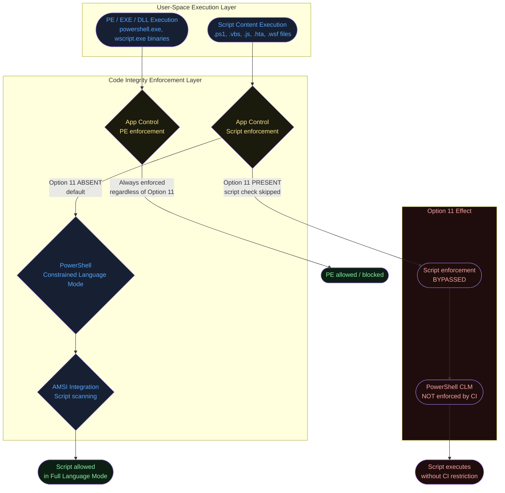
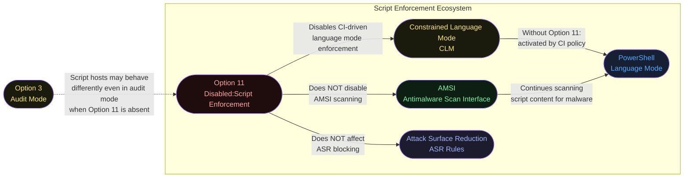
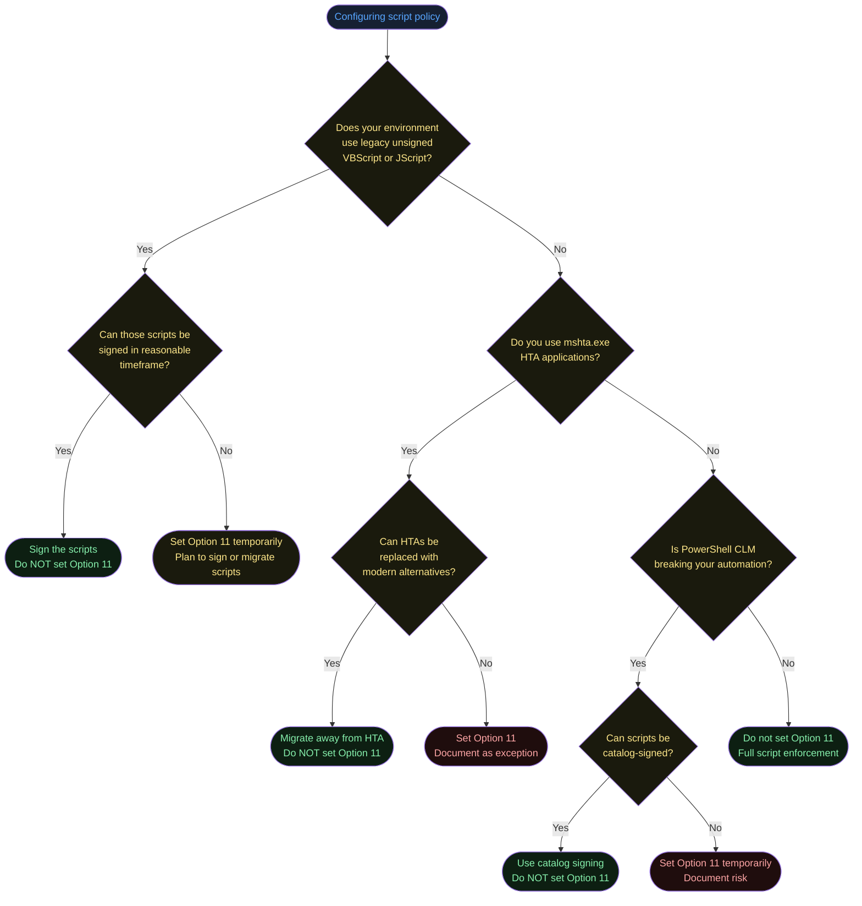
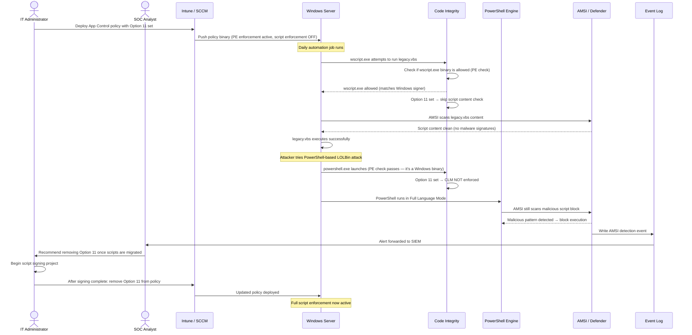

# Option 11 — Disabled:Script Enforcement

**Author:** Anubhav Gain
**Category:** Endpoint Security
**Policy Rule Option:** 11
**Rule Name:** `Disabled:Script Enforcement`
**Applies to Supplemental Policies:** No

---

## Table of Contents

1. [What It Does](#what-it-does)
2. [Why It Exists](#why-it-exists)
3. [Visual Anatomy — Policy Evaluation Stack](#visual-anatomy--policy-evaluation-stack)
4. [How to Set It (PowerShell)](#how-to-set-it-powershell)
5. [XML Representation](#xml-representation)
6. [Interaction With Other Options](#interaction-with-other-options)
7. [When to Enable vs Disable](#when-to-enable-vs-disable)
8. [Real-World Scenario — End-to-End Walkthrough](#real-world-scenario--end-to-end-walkthrough)
9. [What Happens If You Get It Wrong](#what-happens-if-you-get-it-wrong)
10. [Valid for Supplemental Policies?](#valid-for-supplemental-policies)
11. [OS Version Requirements](#os-version-requirements)
12. [Summary Table](#summary-table)

---

## What It Does

**Disabled:Script Enforcement** instructs App Control for Business to stop evaluating scripts and interpreted code against the active policy. When this option is set, the following script hosts are excluded from App Control enforcement:

- **PowerShell** (`powershell.exe`, `pwsh.exe`) — including PowerShell Constrained Language Mode (CLM) enforcement
- **Windows Script Host** (`wscript.exe`) — `.vbs`, `.js`, `.wsf` files
- **Windows Console Script Host** (`cscript.exe`) — same file types as wscript
- **Microsoft HTML Application Host** (`mshta.exe`) — `.hta` files
- **MSXML** — XML-based scripts executed via the MSXML COM component

Without this option (the default), App Control integrates deeply with these script hosts: PowerShell enters **Constrained Language Mode (CLM)** unless a script is explicitly allowed by the policy, and the other hosts refuse to run unsigned or untrusted scripts. Setting Option 11 removes all of these restrictions, leaving script execution ungoverned by App Control.

---

## Why It Exists

Script enforcement, while powerful, introduces significant operational friction in environments where:

1. **Legacy automation** relies on unsigned VBScript or JScript files that predate modern code-signing practices
2. **PowerShell CLM** breaks complex scripts that use `.NET` type accelerators, reflection, or advanced language features (CLM blocks these by design)
3. **Administrative tools** use `mshta.exe`-based HTA UI frontends that cannot easily be signed
4. **Rapid deployment scenarios** require faster iteration than code-signing workflows allow
5. **Compatibility testing** needs to isolate whether a failure is a policy rule problem or a script enforcement problem

Option 11 provides a clean **escape hatch** that preserves PE (executable) enforcement while removing the complexity of script-layer enforcement. This is particularly valuable when an organization is incrementally adopting App Control and cannot yet sign all their scripts.

---

## Visual Anatomy — Policy Evaluation Stack



**Key insight:** Option 11 only affects the *script content* layer. The **binary executables** (`powershell.exe`, `wscript.exe`, etc.) are still subject to normal PE enforcement. If `powershell.exe` itself is not allowed by the policy, it will still be blocked even with Option 11 set.

---

## How to Set It (PowerShell)

> **Note:** The naming convention is inverted. The *option name* is `Disabled:Script Enforcement`, meaning the feature described (script enforcement) is *disabled*. Setting the option = disabling enforcement. Removing the option = enabling enforcement (default behavior).

### Disable Script Enforcement (Set Option 11)

```powershell
# Setting Option 11 DISABLES script enforcement
Set-RuleOption -FilePath "C:\Policies\MyPolicy.xml" -Option 11
```

### Re-enable Script Enforcement (Remove Option 11)

```powershell
# Removing Option 11 RE-ENABLES script enforcement (default state)
Remove-RuleOption -FilePath "C:\Policies\MyPolicy.xml" -Option 11
```

### Full Example — Policy with Script Enforcement Disabled

```powershell
$PolicyPath = "C:\Policies\NoScriptEnforce.xml"

# Start from default Windows template
Copy-Item "C:\Windows\schemas\CodeIntegrity\ExamplePolicies\DefaultWindows_Enforced.xml" `
          -Destination $PolicyPath

# Disable script enforcement
Set-RuleOption -FilePath $PolicyPath -Option 11

# Confirm the option is present
[xml]$xml = Get-Content $PolicyPath
$xml.SiPolicy.Rules.Rule | Select-Object -ExpandProperty Option

# Convert to binary for deployment
ConvertFrom-CIPolicy -XmlFilePath $PolicyPath `
                     -BinaryFilePath "C:\Policies\NoScriptEnforce.p7b"
```

### Verify Current Script Enforcement State in PowerShell

```powershell
# Check if PowerShell is running in Constrained Language Mode
# (CLM is enforced by App Control when Option 11 is NOT set)
$ExecutionContext.SessionState.LanguageMode
# Returns: "ConstrainedLanguage" (enforced) or "FullLanguage" (not enforced / Option 11 set)
```

---

## XML Representation

```xml
<?xml version="1.0" encoding="utf-8"?>
<SiPolicy xmlns="urn:schemas-microsoft-com:sipolicy" PolicyType="Base Policy">
  <VersionEx>10.0.0.0</VersionEx>
  <PolicyTypeID>{A244370E-44C9-4C06-B551-F6016E563076}</PolicyTypeID>
  <PlatformID>{2E07F7E4-194C-4D20-B96C-134CA31A5C3F}</PlatformID>
  <Rules>

    <!-- Option 11: Script enforcement is disabled when this rule is present -->
    <Rule>
      <Option>Disabled:Script Enforcement</Option>
    </Rule>

    <!-- Without this Rule element, script enforcement is ACTIVE by default -->

  </Rules>
</SiPolicy>
```

**Absence means enforcement:** Unlike most security features where you must explicitly enable protection, script enforcement in App Control is **on by default**. The `Disabled:Script Enforcement` rule *opts out* of a default-on behavior. This is a common source of confusion when reading policy XML — if you see this element, script enforcement is off.

---

## Interaction With Other Options



| Option | Relationship | Notes |
|--------|-------------|-------|
| Option 3 — Enabled:Audit Mode | Notable quirk | Even in audit mode, **script hosts may still enforce** CLM. Option 11 is the only way to fully disable script enforcement regardless of audit/enforce mode. |
| Option 13 — Enabled:Managed Installer | Independent | MI-stamped scripts are allowed by App Control; Option 11 makes this moot for scripts but they are separate controls. |
| Option 14 — Enabled:ISG Authorization | Independent | ISG can authorize scripts as "known good." Option 11 bypasses this evaluation entirely. |
| AMSI (not a policy option) | Not affected | Option 11 has no effect on AMSI. Windows Defender and other AV still scan script content at runtime. |
| Attack Surface Reduction rules | Not affected | ASR rules governing scripts (e.g., "Block Office VBA macros from spawning child processes") operate independently of App Control. |

---

## When to Enable vs Disable



**Set Option 11 when:**
- Legacy unsigned scripts are business-critical and cannot be signed in the short term
- `mshta.exe`-based HTA admin tools are in active production use
- PowerShell CLM is breaking critical administrative workflows
- You are in early rollout and want to validate PE enforcement before adding script complexity
- macOS/Linux agents must not impact Windows script enforcement (cross-platform policy split)

**Do NOT set Option 11 when:**
- You want full defense-in-depth against script-based attacks (living-off-the-land techniques)
- PowerShell remoting and JEA (Just Enough Administration) configurations depend on CLM
- Your threat model includes PowerShell-based commodity malware
- CIS Benchmark or STIG compliance requires script enforcement

---

## Real-World Scenario — End-to-End Walkthrough

**Scenario:** Fabrikam's operations team has a critical legacy IT automation suite written in VBScript that runs daily on 300 servers. The team is deploying App Control but cannot sign the VBScript files because the vendor no longer provides updates and the source code is lost. Option 11 is set to allow the legacy scripts while PE enforcement remains active.



**Key takeaway:** Even with Option 11 set, AMSI continues to provide a defense layer against malicious scripts. Option 11 removes the *policy-based* content check, not the *AV-based* scan.

---

## What Happens If You Get It Wrong

### Scenario A: Option 11 absent, legacy script breaks

- `wscript.exe` or `cscript.exe` refuses to run unsigned `.vbs`/`.js` files
- PowerShell enters **Constrained Language Mode** — blocking `.NET` type accelerators, `Add-Type`, `[System.Reflection.*]`, COM object creation, and other advanced features
- `mshta.exe` refuses to execute unsigned `.hta` files
- **Impact:** IT automation failures, missed maintenance windows, operator error from manual workarounds
- **Recovery:** Set Option 11 in policy, redeploy — scripts begin working again

### Scenario B: Option 11 set permanently with no remediation plan

- Attackers using **PowerShell-based malware** (Empire, Cobalt Strike, PowerSploit) gain full PowerShell language access
- **Living-off-the-land** techniques (`Invoke-Expression`, `[Reflection.Assembly]::Load()`) are unrestricted by App Control
- Script-based supply chain attacks (malicious `.ps1` modules) execute without policy checks
- Compliance frameworks (NIST, CIS, DISA STIG) may flag the absence of script enforcement
- **Severity:** High — significantly reduces the defense value of App Control against modern attack patterns

### Audit Mode Caveat

The `Disabled:Script Enforcement` option has unusual behavior: **even in audit mode, some script hosts enforce CLM**. This means that setting a policy to audit mode does NOT necessarily preview what script behavior will look like before going to enforcement. If you want to audit-test scripts without enforcement, you must explicitly set Option 11.

---

## Valid for Supplemental Policies?

**No.** Option 11 is only valid in **base policies**.

Script enforcement behavior is a fundamental property of the base policy. Supplemental policies can add or modify file rules (signers, hashes, paths) but cannot override the base policy's script enforcement mode. If set in a supplemental policy, the option will be ignored.

---

## OS Version Requirements

| Platform | Minimum Version | Notes |
|----------|----------------|-------|
| Windows 10 (LTSB/LTSC 1607) | **Not supported** | Option 11 is explicitly unsupported on Windows 10 1607 LTSB |
| Windows Server 2016 | **Not supported** | Same codebase as Windows 10 1607; Option 11 not supported |
| Windows 10 1703+ | Supported | Minimum version for reliable Option 11 support |
| Windows 10 1709+ | Supported | Recommended minimum |
| Windows 11 | Fully supported | All versions |
| Windows Server 2019+ | Fully supported | All versions |

**Critical:** Deploying a policy with Option 11 to Windows Server 2016 or Windows 10 1607 LTSB is unsupported and may produce unexpected results. Test on a dedicated ring before broad deployment to these OS versions.

---

## Summary Table

| Attribute | Value |
|-----------|-------|
| Option Number | 11 |
| XML String | `Disabled:Script Enforcement` |
| Policy Type | Base policy only |
| Default State | Script enforcement ON (Option 11 not set) |
| Setting the option | Disables script enforcement |
| Removing the option | Enables script enforcement (default) |
| PowerShell Set | `Set-RuleOption -FilePath <xml> -Option 11` |
| PowerShell Remove | `Remove-RuleOption -FilePath <xml> -Option 11` |
| Affects PowerShell CLM | Yes — CLM not enforced when Option 11 is set |
| Affects wscript / cscript | Yes — unsigned scripts allowed |
| Affects mshta / MSXML | Yes — HTA and MSXML scripts unrestricted |
| Affects PE enforcement | No — binary enforcement unchanged |
| Affects AMSI | No — AMSI scans continue regardless |
| Supplemental Policy | Not valid |
| Unsupported On | Windows 10 1607 LTSB, Windows Server 2016 |
| Risk if Left Set | Unrestricted script execution; LOLBin attacks unimpeded |
