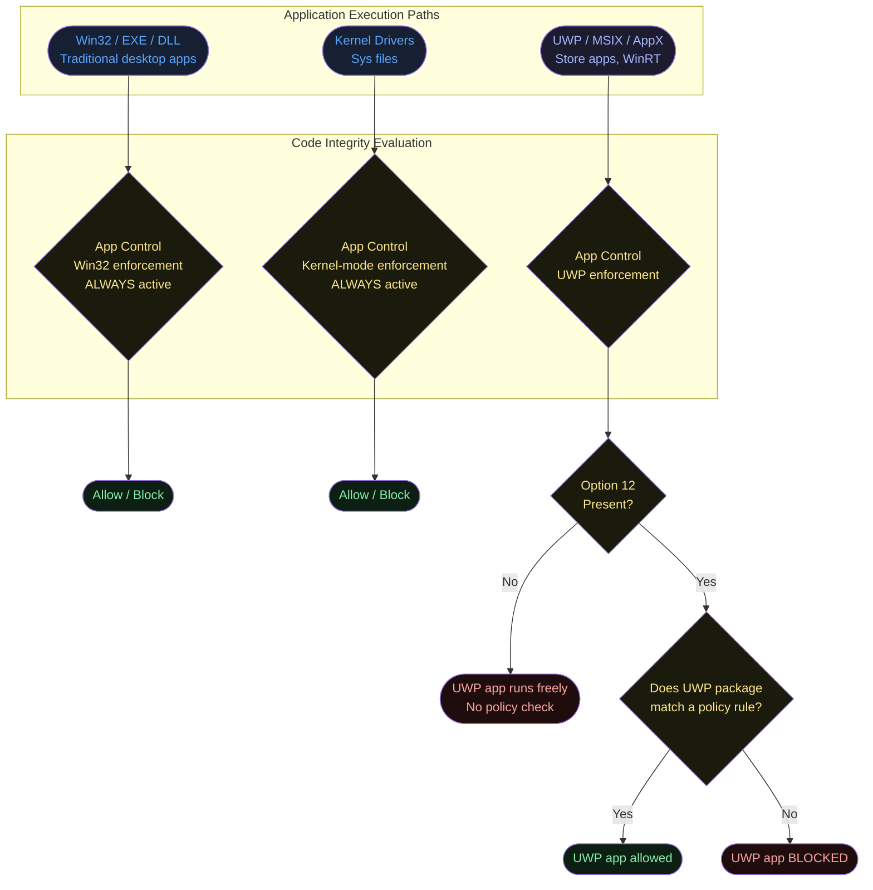
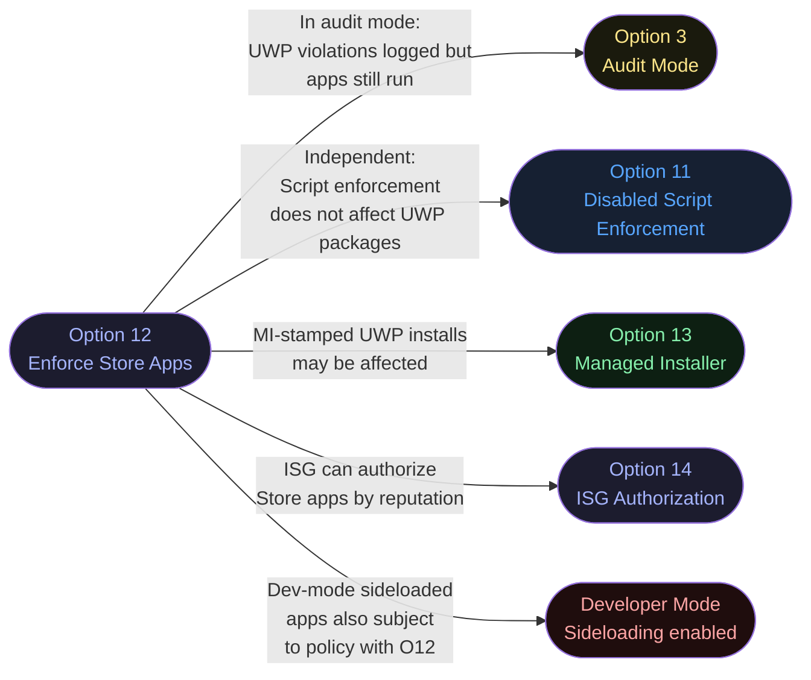
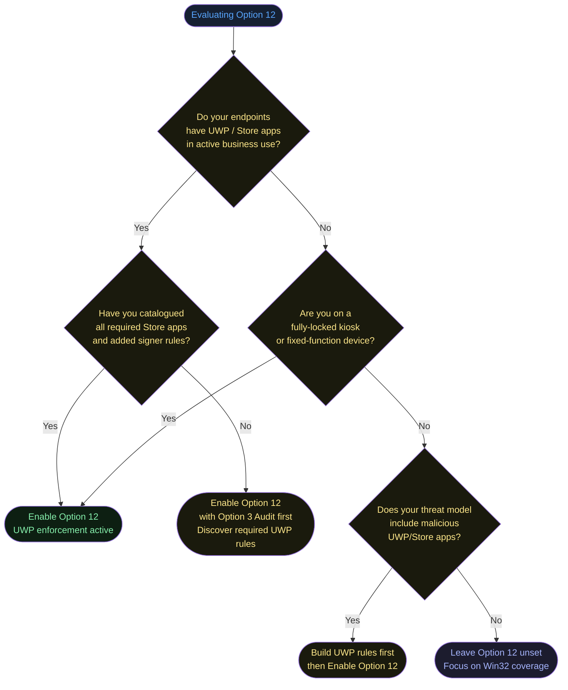
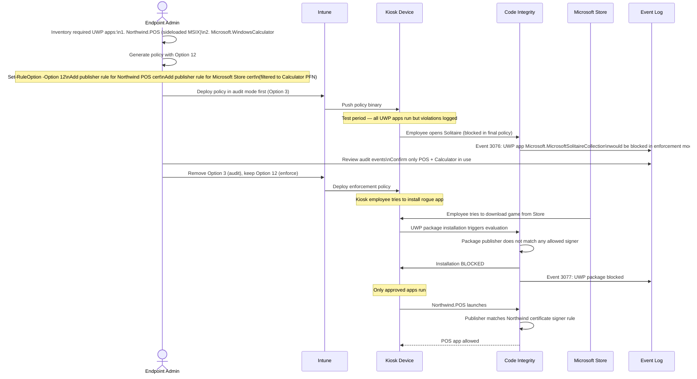

# Option 12 — Required:Enforce Store Applications

**Author:** Anubhav Gain
**Category:** Endpoint Security
**Policy Rule Option:** 12
**Rule Name:** `Required:Enforce Store Applications`
**Applies to Supplemental Policies:** No

---

## Table of Contents

1. [What It Does](#what-it-does)
2. [Why It Exists](#why-it-exists)
3. [Visual Anatomy — Policy Evaluation Stack](#visual-anatomy--policy-evaluation-stack)
4. [How to Set It (PowerShell)](#how-to-set-it-powershell)
5. [XML Representation](#xml-representation)
6. [Interaction With Other Options](#interaction-with-other-options)
7. [When to Enable vs Disable](#when-to-enable-vs-disable)
8. [Real-World Scenario — End-to-End Walkthrough](#real-world-scenario--end-to-end-walkthrough)
9. [What Happens If You Get It Wrong](#what-happens-if-you-get-it-wrong)
10. [Valid for Supplemental Policies?](#valid-for-supplemental-policies)
11. [OS Version Requirements](#os-version-requirements)
12. [Summary Table](#summary-table)

---

## What It Does

**Required:Enforce Store Applications** extends App Control for Business policy enforcement to cover **Universal Windows Platform (UWP) applications** — also known as Microsoft Store apps or Windows Runtime (WinRT) apps. Without this option, UWP apps are entirely outside the scope of App Control policy evaluation: they load and run regardless of what your policy says. When Option 12 is enabled, UWP app packages (`.appx`, `.msix`, `.appxbundle`) are subject to the same policy rules as traditional Win32 executables — a UWP app must have an explicit allow rule (by publisher, package family name, or hash) or it will be blocked.

---

## Why It Exists

UWP applications run in a sandboxed execution environment provided by the Windows Runtime, separate from the traditional Win32 loader. Historically, this sandbox was considered sufficiently isolated that App Control did not extend into it by default. However, as UWP applications have become more capable — including UWP apps with device access, background tasks, and full-trust declarations — the threat surface has expanded.

Option 12 exists for organizations that need a **complete application control posture** covering both Win32 and UWP code paths. Without it, an attacker could potentially sideload a malicious UWP app (if developer mode is enabled) or install a malicious Store app without triggering App Control blocks. It also provides compliance evidence for regulated environments that require "all executable code is governed by policy."

The reason it is **not the default** is that UWP app identity and signing are handled differently from Win32 apps. UWP apps are always Microsoft-signed (or sideloaded developer apps), and allowing all Microsoft Store apps by publisher is the typical baseline — this works well without Option 12. Enabling Option 12 without appropriate rules for Store apps will block UWP apps, which can severely impact user experience.

---

## Visual Anatomy — Policy Evaluation Stack



**Critical gap without Option 12:** Any UWP application — including sideloaded or developer-signed packages — bypasses App Control entirely. Option 12 closes this gap.

---

## How to Set It (PowerShell)

### Enable Store Application Enforcement (Set Option 12)

```powershell
# Enable enforcement for UWP/Store applications
Set-RuleOption -FilePath "C:\Policies\MyPolicy.xml" -Option 12
```

### Disable Store Application Enforcement (Remove Option 12)

```powershell
# Remove enforcement for UWP/Store applications (default — Store apps bypass policy)
Remove-RuleOption -FilePath "C:\Policies\MyPolicy.xml" -Option 12
```

### Full Example — Policy with Store App Enforcement

```powershell
$PolicyPath = "C:\Policies\StoreEnforced.xml"

Copy-Item "C:\Windows\schemas\CodeIntegrity\ExamplePolicies\DefaultWindows_Enforced.xml" `
          -Destination $PolicyPath

# Enable Store app enforcement
Set-RuleOption -FilePath $PolicyPath -Option 12

# Add a rule to allow all Store-signed UWP apps
# (Without this, ALL UWP apps will be blocked once Option 12 is set)
# The Microsoft Store signing certificate covers all genuine Store apps

# Get the Store app signer info for rule generation
# Typically use: Publisher = "CN=Microsoft Corporation, O=Microsoft Corporation, L=Redmond, S=Washington, C=US"
# Or use New-CIPolicy to automatically generate rules from installed UWP apps:
$UWPApps = Get-AppxPackage -AllUsers
New-CIPolicy -FilePath "C:\Policies\UWPRules.xml" `
             -Level Publisher `
             -UserPEs `
             -ScanPath "C:\Program Files\WindowsApps"

# Merge the UWP rules into the main policy
Merge-CIPolicy -PolicyPaths $PolicyPath, "C:\Policies\UWPRules.xml" `
               -OutputFilePath $PolicyPath

# Convert to binary
ConvertFrom-CIPolicy -XmlFilePath $PolicyPath `
                     -BinaryFilePath "C:\Policies\StoreEnforced.p7b"
```

### Identify Package Family Names for UWP Rules

```powershell
# List all installed UWP apps with their Package Family Name (PFN)
Get-AppxPackage -AllUsers | Select-Object Name, PackageFamilyName, Publisher | Format-Table -AutoSize

# Get the signing certificate for a specific app (for writing a Signer rule)
$pkg = Get-AppxPackage -Name "Microsoft.WindowsCalculator"
$pkg | Select-Object PackageFamilyName, SignatureKind, Publisher
```

---

## XML Representation

```xml
<?xml version="1.0" encoding="utf-8"?>
<SiPolicy xmlns="urn:schemas-microsoft-com:sipolicy" PolicyType="Base Policy">
  <VersionEx>10.0.0.0</VersionEx>
  <PolicyTypeID>{A244370E-44C9-4C06-B551-F6016E563076}</PolicyTypeID>
  <PlatformID>{2E07F7E4-194C-4D20-B96C-134CA31A5C3F}</PlatformID>
  <Rules>

    <!-- Option 12: Extend App Control enforcement to UWP/Store applications -->
    <Rule>
      <Option>Required:Enforce Store Applications</Option>
    </Rule>

  </Rules>

  <!-- When Option 12 is set, UWP signer rules are required.
       Example: Allow all apps signed by Microsoft (covers genuine Store apps) -->
  <FileRules>
    <!-- File rules here -->
  </FileRules>
  <Signers>
    <Signer ID="ID_SIGNER_MICROSOFT_STORE" Name="Microsoft Store">
      <CertRoot Type="TBS" Value="..." />
      <!-- TBS value from Microsoft Store signing certificate -->
    </Signer>
  </Signers>
  <SigningScenarios>
    <SigningScenario Value="12" ID="ID_SIGNINGSCENARIO_WINDOWS" FriendlyName="Auto generated policy on...">
      <ProductSigners>
        <AllowedSigners>
          <AllowedSigner SignerId="ID_SIGNER_MICROSOFT_STORE" />
        </AllowedSigners>
      </ProductSigners>
    </SigningScenario>
  </SigningScenarios>
</SiPolicy>
```

**Important:** Signing scenario `Value="12"` covers Windows (user-mode) binaries. UWP packages are evaluated under this signing scenario. When Option 12 is set and a UWP package is evaluated, it must match an `AllowedSigner` or `AllowedFile` in scenario 12.

---

## Interaction With Other Options



| Option | Relationship | Notes |
|--------|-------------|-------|
| Option 3 — Enabled:Audit Mode | Works together | In audit mode with Option 12, UWP violations are logged but not blocked. Useful for pre-enforcement testing. |
| Option 11 — Disabled:Script Enforcement | Independent | Script enforcement and UWP enforcement are separate code paths. |
| Option 13 — Enabled:Managed Installer | Complex | If a managed installer installs a UWP app via MSIX, the MI stamp applies to extracted files. Option 12 may still evaluate the package differently. Test this combination carefully. |
| Option 14 — Enabled:ISG | Compatible | ISG can provide reputation data for Store apps, potentially authorizing them without explicit signer rules. |
| Developer Mode | High impact | With developer mode enabled, sideloaded packages bypass Store signing. Option 12 brings these sideloaded packages under policy control. |

---

## When to Enable vs Disable



**Enable Option 12 when:**
- Kiosk or fixed-function devices — complete application control is required
- Developer mode is enabled on endpoints (brings sideloaded apps under control)
- Regulatory compliance requires governance of all executable code including UWP
- You have inventoried all required UWP apps and built corresponding signer rules
- The environment has no general-purpose UWP app usage beyond a known set

**Leave Option 12 unset when:**
- General-purpose knowledge worker endpoints with diverse Store app usage
- You have not yet built UWP signer rules (risk: all UWP apps blocked)
- The primary threat vector is Win32 malware (most malware is not packaged as UWP)
- Store app ecosystem changes frequently and maintaining rules would be high-overhead

---

## Real-World Scenario — End-to-End Walkthrough

**Scenario:** Northwind deploying locked kiosk devices (retail POS). Only two UWP apps are permitted: the company POS application (custom MSIX) and the Windows Calculator. All other Store apps must be blocked.



---

## What Happens If You Get It Wrong

### Scenario A: Option 12 set without UWP signer rules

- **Every UWP app is blocked**, including built-in Windows apps (Settings, Calculator, Mail, Edge)
- User experience is severely degraded — many Windows features are UWP-based
- Windows Settings app may fail to open (it is a UWP app)
- System notifications, Windows Update UI, and other shell components may fail
- **Recovery:** Remove Option 12 from policy or add Microsoft Store publisher rule

### Scenario B: Option 12 not set on developer-mode machines

- Developer mode enables sideloading of any developer-signed MSIX package
- A malicious actor with user-level access could install a sideloaded malicious UWP app
- The malicious app runs with all UWP permissions (including potentially `broadFileSystemAccess` capability)
- App Control provides no visibility into this UWP execution
- **Recommendation:** Either disable developer mode on managed endpoints, or set Option 12 with appropriate rules

### Key UWP-Specific Events

| Event ID | Log | Meaning |
|----------|-----|---------|
| 3076 | Microsoft-Windows-CodeIntegrity/Operational | UWP package would be blocked (audit mode) |
| 3077 | Microsoft-Windows-CodeIntegrity/Operational | UWP package blocked (enforcement mode) |
| 8028 | Microsoft-Windows-CodeIntegrity/Operational | UWP package publisher information |

---

## Valid for Supplemental Policies?

**No.** Option 12 is only valid in **base policies**.

UWP enforcement scope is a fundamental policy property that must be declared at the base policy level. Supplemental policies can add rules for specific UWP packages (by publisher or hash) to extend what is allowed, but they cannot toggle whether UWP enforcement is active. That decision belongs to the base policy.

---

## OS Version Requirements

| Platform | Minimum Version | Notes |
|----------|----------------|-------|
| Windows 10 | 1709+ | UWP enforcement via App Control supported |
| Windows 11 | All versions | Fully supported |
| Windows Server 2019+ | Supported | UWP apps are rarely deployed on servers; Option 12 is less relevant |
| Windows Server 2016 | Limited | UWP app model is limited on Server; Option 12 behavior may be unpredictable |

UWP as an application model requires the Windows Runtime (WinRT), which is available from Windows 8 onwards. However, App Control integration with UWP enforcement via Option 12 is effectively a Windows 10 1709+ feature.

---

## Summary Table

| Attribute | Value |
|-----------|-------|
| Option Number | 12 |
| XML String | `Required:Enforce Store Applications` |
| Policy Type | Base policy only |
| Default State | Not set — UWP apps bypass App Control |
| Setting the option | Brings UWP / Store apps under policy enforcement |
| Removing the option | UWP apps exempt from policy (default) |
| PowerShell Set | `Set-RuleOption -FilePath <xml> -Option 12` |
| PowerShell Remove | `Remove-RuleOption -FilePath <xml> -Option 12` |
| Prerequisite | UWP signer rules must exist in policy before enforcing |
| Risk if set without rules | All UWP apps blocked, including built-in Windows apps |
| Risk if not set | Sideloaded UWP apps bypass App Control entirely |
| Supplemental Policy | Not valid |
| Best For | Kiosk devices, fixed-function endpoints, dev-mode machines |
| Key Event IDs | 3076, 3077 (CodeIntegrity/Operational) |
