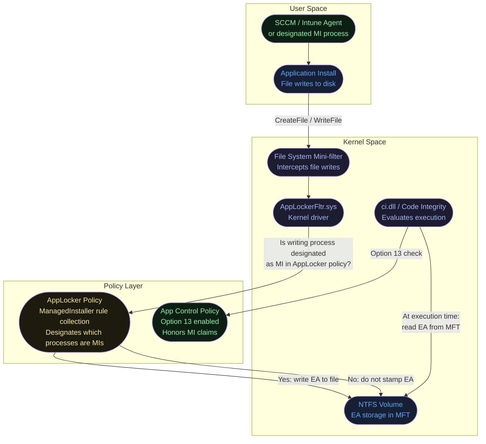
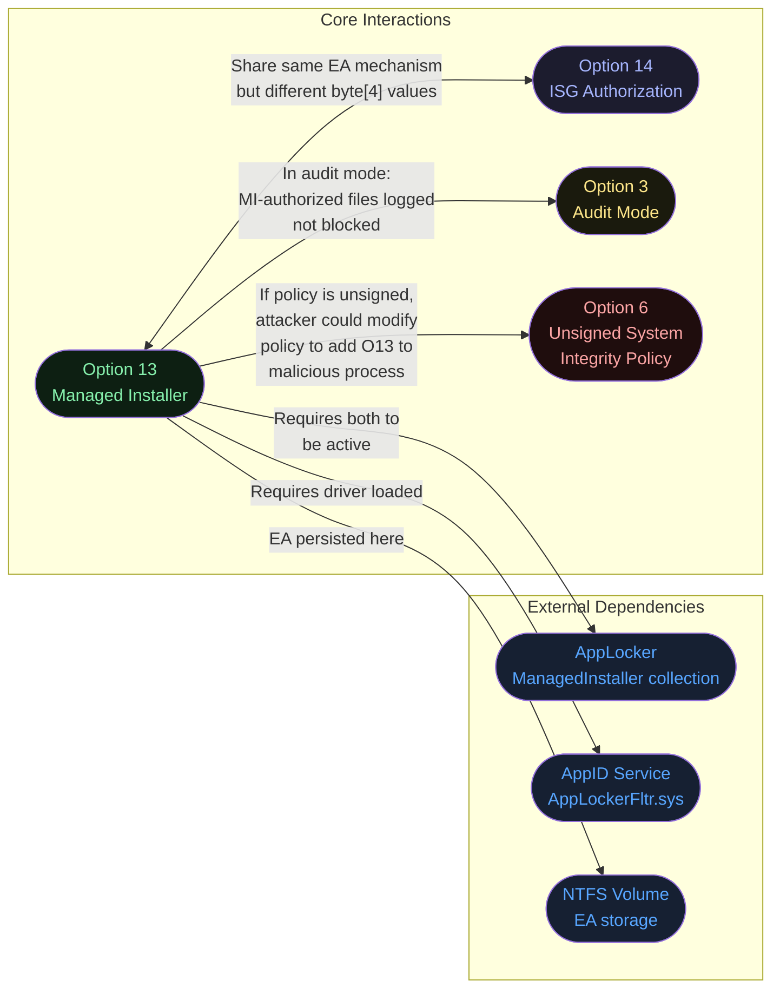
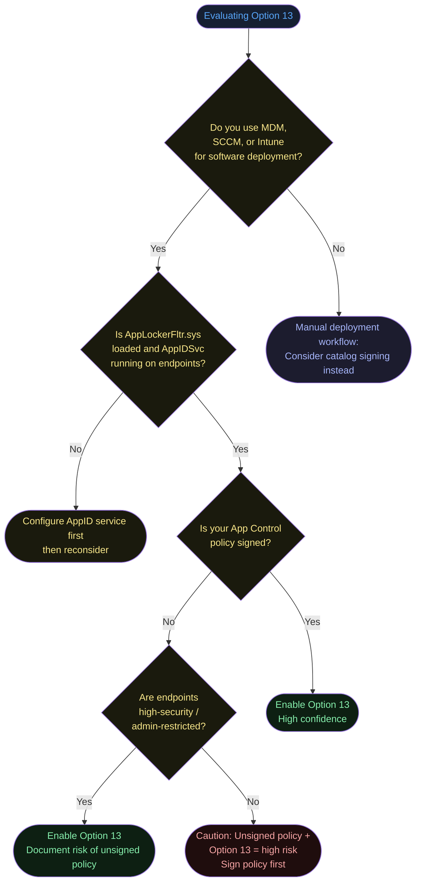
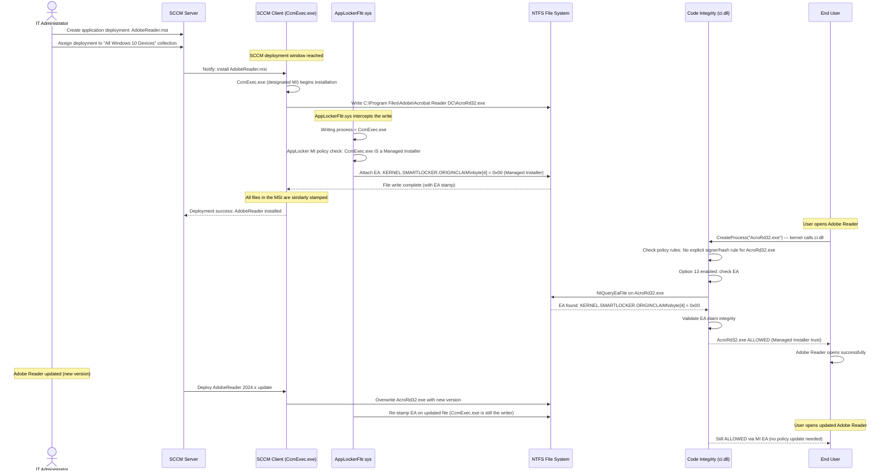

# Option 13 — Enabled:Managed Installer

**Author:** Anubhav Gain
**Category:** Endpoint Security
**Policy Rule Option:** 13
**Rule Name:** `Enabled:Managed Installer`
**Applies to Supplemental Policies:** Yes

---

## Table of Contents

1. [What It Does](#what-it-does)
2. [Why It Exists](#why-it-exists)
3. [The Kernel EA Mechanism — Deep Dive](#the-kernel-ea-mechanism--deep-dive)
4. [AppLockerFltr.sys — The Bridge Between AppLocker and App Control](#applockerfltr-sys--the-bridge-between-applocker-and-app-control)
5. [Visual Anatomy — Policy Evaluation Stack](#visual-anatomy--policy-evaluation-stack)
6. [How to Set It (PowerShell)](#how-to-set-it-powershell)
7. [XML Representation](#xml-representation)
8. [Interaction With Other Options](#interaction-with-other-options)
9. [When to Enable vs Disable](#when-to-enable-vs-disable)
10. [Real-World Scenario — End-to-End Walkthrough](#real-world-scenario--end-to-end-walkthrough)
11. [What Happens If You Get It Wrong](#what-happens-if-you-get-it-wrong)
12. [Valid for Supplemental Policies?](#valid-for-supplemental-policies)
13. [OS Version Requirements](#os-version-requirements)
14. [Security Considerations and Limitations](#security-considerations-and-limitations)
15. [Summary Table](#summary-table)

---

## What It Does

**Enabled:Managed Installer** is one of the most powerful App Control policy options. When active, it creates an automated trust channel: any file written to disk by a **designated managed installer process** (such as Microsoft Endpoint Configuration Manager, Intune Win32 app installs, or any custom-designated process) is **automatically trusted** by App Control and allowed to execute — without requiring an explicit signer rule or hash rule in the policy.

In plain terms: once you designate your software deployment tool as a "managed installer," all software it deploys becomes implicitly trusted, dramatically reducing the ongoing rule management overhead of running App Control in enforcement mode.

The trust grant works through a kernel-level extended attribute (EA) tag written to each file at install time. When a user or process later tries to execute that file, the Code Integrity module (`ci.dll`) checks for this EA tag and, if found (with the correct byte value for MI), allows the execution without requiring an explicit policy rule.

---

## Why It Exists

The core tension in App Control deployment is between **security** (only known-good files execute) and **operational agility** (IT continuously deploys new software). Without Managed Installer:

- Every application deployed by IT must be covered by an explicit signer rule or hash rule
- New software deployments require policy updates, which require testing and redeployment
- Hash-based rules are fragile — every version bump requires a new rule
- Signer-based rules require verifying the publisher chain for every new application
- The IT team becomes a bottleneck — policy updates must precede every software deployment

Managed Installer solves this by **delegating the trust decision to the deployment tool itself**. The logic is: if your MDM/SCCM system installed it, it was approved through your change management process. App Control honors that process-level trust, converting administrative approval (the act of deploying software) into technical enforcement (the kernel allows that specific file to run).

---

## The Kernel EA Mechanism — Deep Dive

This is the beating heart of Managed Installer. Understanding it is essential for troubleshooting and security analysis.

### What Is an Extended Attribute (EA)?

Windows NTFS extended attributes are metadata fields attached to a file that live in the NTFS master file table (MFT) alongside the file's standard attributes (name, size, timestamps). They are key-value pairs that applications and the kernel can read and write. Most user-space tools don't expose them, but they are accessible via the `NtQueryEaFile` / `NtSetEaFile` NT native API calls and the `fsutil` command.

### The KERNEL.SMARTLOCKER.ORIGINCLAIM EA

When a managed installer process writes a file to disk, the AppLocker kernel driver (`AppLockerFltr.sys`) intercepts the write operation and attaches a special extended attribute to the written file:

```
EA Name:  KERNEL.SMARTLOCKER.ORIGINCLAIM
EA Value: Binary blob (variable length)
          ├── Header fields (version, flags)
          └── byte[4] = 0x00  ← This byte identifies the claim as "Managed Installer"
```

The critical discriminator is **byte[4] of the EA value**:

| byte[4] value | Meaning | Source |
|---------------|---------|--------|
| `0x00` | File was written by a Managed Installer | Option 13 (AppLockerFltr.sys) |
| `0x01` | File has known-good ISG reputation | Option 14 (cloud lookup) |

### How ci.dll Uses the EA at Execution Time

```mermaid
flowchart TD
    Exec([User/process calls CreateProcess or LoadLibrary])
    --> KernelCheck[Windows kernel\ncalls into ci.dll for code integrity check]
    KernelCheck --> PolicyCheck{Does file match\nany explicit policy rule?\nSigner / Hash / Path}
    PolicyCheck -- Yes --> Allow([File execution allowed])
    PolicyCheck -- No --> O13Check{Option 13\nEnabled in policy?}
    O13Check -- No --> Block([File execution blocked])
    O13Check -- Yes --> EARead[ci.dll calls NtQueryEaFile\non the file being executed]
    EARead --> EAExists{EA name\nKERNEL.SMARTLOCKER.ORIGINCLAIM\npresent?}
    EAExists -- No --> Block
    EAExists -- Yes --> EAByte{byte[4] of EA value\n== 0x00?}
    EAByte -- No --> O14Path([Route to ISG check\nsee Option 14])
    EAByte -- Yes --> ValidateClaim[ci.dll validates EA integrity\nChecks claim is not spoofed]
    ValidateClaim --> ClaimValid{EA claim\ncryptographically valid?}
    ClaimValid -- No --> Block
    ClaimValid -- Yes --> Allow

    style Exec fill:#162032,color:#58a6ff
    style KernelCheck fill:#162032,color:#58a6ff
    style PolicyCheck fill:#1a1a0d,color:#fde68a
    style Allow fill:#0d1f12,color:#86efac
    style O13Check fill:#1a1a0d,color:#fde68a
    style Block fill:#1f0d0d,color:#fca5a5
    style EARead fill:#162032,color:#58a6ff
    style EAExists fill:#1a1a0d,color:#fde68a
    style EAByte fill:#1a1a0d,color:#fde68a
    style O14Path fill:#1c1c2e,color:#a5b4fc
    style ValidateClaim fill:#162032,color:#58a6ff
    style ClaimValid fill:#1a1a0d,color:#fde68a
```

### Inspecting the EA on a File

```powershell
# Check if a file has the Managed Installer EA
# Using fsutil (requires admin)
fsutil file queryEA "C:\Program Files\MyApp\myapp.exe"

# PowerShell alternative using P/Invoke to NtQueryEaFile
# (No built-in cmdlet; requires low-level API call)
# The presence of KERNEL.SMARTLOCKER.ORIGINCLAIM indicates MI-stamped file
```

```cmd
REM From elevated command prompt:
fsutil file queryEA "C:\Program Files\MyApp\myapp.exe"
REM Output will show: KERNEL.SMARTLOCKER.ORIGINCLAIM if MI-stamped
```

### EA Persistence and Inheritance

- The EA is written to the **file's NTFS metadata** at write time
- It **persists** as long as the file is on an NTFS volume
- It is **NOT inherited** by child files or copies made to non-NTFS volumes (FAT32, exFAT)
- If a file is copied to a FAT32 USB drive and back, the EA is **lost** — the copy will not be trusted
- File overwrites by non-MI processes do NOT re-stamp the EA; the original EA remains
- If a file is overwritten by a malicious process (not the MI), the overwritten content runs under the original EA — this is a known attack surface (see Security Considerations)

---

## AppLockerFltr.sys — The Bridge Between AppLocker and App Control

### Architecture Overview

The Managed Installer feature requires two separate but tightly integrated subsystems:



### What AppLockerFltr.sys Does

`AppLockerFltr.sys` is a **file system mini-filter driver** loaded by the AppLocker service. Its responsibilities in the Managed Installer flow:

1. **Intercepts all file write operations** at the file system layer
2. **Checks the writing process** against the AppLocker ManagedInstaller rule collection
3. **Stamps the EA** (`KERNEL.SMARTLOCKER.ORIGINCLAIM` with byte[4]=0x00) on files written by designated MI processes
4. **Propagates the stamp** to extracted archives (if the installer extracts a ZIP/CAB, the extracted files are also stamped)

### Verifying AppLockerFltr.sys is Loaded

```powershell
# Verify the AppLocker filter driver is loaded
Get-Service -Name AppIDSvc | Select-Object Status, StartType
# Should be: Running, Automatic

# Check the kernel module directly
fltMC | Where-Object { $_ -match "AppLocker" }
# or
Get-WmiObject Win32_SystemDriver | Where-Object Name -eq "AppLockerFltr"
```

```cmd
REM From elevated command prompt:
fltMC
REM Look for "AppLockerFltr" in the output with an altitude number
REM Altitude ~130000 range for AppLocker
```

### AppLocker ManagedInstaller Rule Collection

The AppLocker **ManagedInstaller** rule collection is separate from the standard AppLocker Executable, Script, DLL, and Packaged Apps rule collections. It designates which processes have MI privileges.

```xml
<!-- AppLocker policy XML: ManagedInstaller rule collection -->
<!-- Applied via Group Policy: Computer Config > Windows Settings > Security Settings > AppLocker -->
<AppLockerPolicy Version="1">
  <RuleCollection Type="ManagedInstaller" EnforcementMode="Enabled">

    <!-- Allow SCCM client (ccmsetup.exe and CcmExec.exe) as managed installer -->
    <FilePublisherRule Id="6CC9B840-B4A0-49B1-A9B0-1358E4F4173F"
                       Name="CCM Client - Managed Installer"
                       Description="Microsoft SCCM client as managed installer"
                       UserOrGroupSid="S-1-1-0"
                       Action="Allow">
      <Conditions>
        <FilePublisherCondition PublisherName="O=MICROSOFT CORPORATION, L=REDMOND, S=WASHINGTON, C=US"
                                ProductName="*"
                                BinaryName="CCMEXEC.EXE"
                                FileVersionRange>
          <BinaryVersionRange LowSection="*" HighSection="*" />
        </FilePublisherCondition>
      </Conditions>
    </FilePublisherRule>

    <!-- Allow Intune Management Extension -->
    <FilePublisherRule Id="...">
      <Conditions>
        <FilePublisherCondition PublisherName="O=MICROSOFT CORPORATION, ..."
                                BinaryName="INTUNEMANAGEMENTEXTENSION.EXE"
                                .../>
      </Conditions>
    </FilePublisherRule>

  </RuleCollection>
</AppLockerPolicy>
```

### Configuring AppLocker Managed Installer via PowerShell

```powershell
# Get current AppLocker policy
$Policy = Get-AppLockerPolicy -Local

# Create a new ManagedInstaller rule for SCCM
$Rule = New-AppLockerPolicy -FileInformation (
    Get-AppLockerFileInformation -Path "C:\Windows\CCM\CcmExec.exe"
) -RuleType Publisher -User Everyone -RuleNamePrefix "MI_SCCM"

# Note: AppLocker ManagedInstaller rules require manual XML editing
# as PowerShell cmdlets don't directly expose the ManagedInstaller collection type.
# Use Set-AppLockerPolicy with a manually crafted XML:
Set-AppLockerPolicy -XmlPolicy "C:\Policies\AppLockerMI.xml" -Merge

# Verify the AppID service is running (required for MI stamping)
Start-Service AppIDSvc
Set-Service AppIDSvc -StartupType Automatic
```

---

## Visual Anatomy — Policy Evaluation Stack

```mermaid
flowchart TD
    subgraph DeployPhase["Software Deployment Phase"]
        MDM([MDM / SCCM / Intune\nDesignated Managed Installer])
        FileWrite([Files written to disk\ne.g., C:\Program Files\MyApp\])
        AppLockerFltr([AppLockerFltr.sys intercepts write])
        EAStamp([EA stamped on each file\nKERNEL.SMARTLOCKER.ORIGINCLAIM\nbyte[4]=0x00])
    end

    subgraph ExecutionPhase["Execution Phase"]
        UserRun([User launches application])
        KernelCI([ci.dll invoked by kernel])
        PolicyRules{Explicit policy\nrule match?}
        OptionCheck{Option 13\nenabled?}
        EACheck{EA present\nand byte[4]==0x00?}
        IntegrityCheck{EA claim\ncryptographically valid?}
        Allow([Allow execution])
        Deny([Block execution])
    end

    MDM --> FileWrite
    FileWrite --> AppLockerFltr
    AppLockerFltr --> EAStamp
    EAStamp -.->|"EA persists in NTFS MFT"| UserRun

    UserRun --> KernelCI
    KernelCI --> PolicyRules
    PolicyRules -- Match found --> Allow
    PolicyRules -- No match --> OptionCheck
    OptionCheck -- Disabled --> Deny
    OptionCheck -- Enabled --> EACheck
    EACheck -- No EA --> Deny
    EACheck -- EA found --> IntegrityCheck
    IntegrityCheck -- Invalid --> Deny
    IntegrityCheck -- Valid --> Allow

    style MDM fill:#0d1f12,color:#86efac
    style FileWrite fill:#162032,color:#58a6ff
    style AppLockerFltr fill:#1c1c2e,color:#a5b4fc
    style EAStamp fill:#1c1c2e,color:#a5b4fc
    style UserRun fill:#162032,color:#58a6ff
    style KernelCI fill:#162032,color:#58a6ff
    style PolicyRules fill:#1a1a0d,color:#fde68a
    style OptionCheck fill:#1a1a0d,color:#fde68a
    style EACheck fill:#1a1a0d,color:#fde68a
    style IntegrityCheck fill:#1a1a0d,color:#fde68a
    style Allow fill:#0d1f12,color:#86efac
    style Deny fill:#1f0d0d,color:#fca5a5
```

---

## How to Set It (PowerShell)

### Step 1: Configure AppLocker Managed Installer Rule

Before enabling Option 13 in your WDAC policy, you **must** configure the AppLocker ManagedInstaller rule collection and ensure `AppLockerFltr.sys` is active.

```powershell
# Step 1: Enable the AppID Service (required for AppLockerFltr.sys)
Set-Service -Name AppIDSvc -StartupType Automatic
Start-Service -Name AppIDSvc

# Step 2: Verify AppLockerFltr is loaded as a file system filter
fltMC  # Look for AppLockerFltr in the output

# Step 3: Create and apply AppLocker ManagedInstaller policy
# (must be done via XML — no direct PS cmdlet for ManagedInstaller collection)
$AppLockerXml = @"
<AppLockerPolicy Version="1">
  <RuleCollection Type="ManagedInstaller" EnforcementMode="Enabled">
    <FilePublisherRule Id="6CC9B840-B4A0-49B1-A9B0-1358E4F4173F"
                       Name="SCCM Client"
                       Description="ConfigMgr managed installer"
                       UserOrGroupSid="S-1-1-0"
                       Action="Allow">
      <Conditions>
        <FilePublisherCondition
            PublisherName="O=MICROSOFT CORPORATION, L=REDMOND, S=WASHINGTON, C=US"
            ProductName="*"
            BinaryName="CCMEXEC.EXE">
          <BinaryVersionRange LowSection="*" HighSection="*" />
        </FilePublisherCondition>
      </Conditions>
    </FilePublisherRule>
  </RuleCollection>
</AppLockerPolicy>
"@
$AppLockerXml | Out-File "C:\Policies\AppLockerMI.xml" -Encoding UTF8
Set-AppLockerPolicy -XmlPolicy "C:\Policies\AppLockerMI.xml" -Merge
```

### Step 2: Enable Option 13 in WDAC Policy

```powershell
# Enable Managed Installer in the WDAC policy
Set-RuleOption -FilePath "C:\Policies\MyPolicy.xml" -Option 13

# Verify
[xml]$xml = Get-Content "C:\Policies\MyPolicy.xml"
$xml.SiPolicy.Rules.Rule | Where-Object { $_.Option -eq "Enabled:Managed Installer" }

# Convert to binary and deploy
ConvertFrom-CIPolicy -XmlFilePath "C:\Policies\MyPolicy.xml" `
                     -BinaryFilePath "C:\Policies\MyPolicy.p7b"
```

### Step 3: Verify MI Stamping is Working

```powershell
# After deploying software via the designated MI tool,
# verify the EA stamp was written

# Method 1: fsutil (requires admin)
fsutil file queryEA "C:\Program Files\DeployedApp\app.exe"

# Method 2: Check Code Integrity event log for MI authorization events
Get-WinEvent -LogName "Microsoft-Windows-CodeIntegrity/Operational" |
    Where-Object { $_.Id -in @(3090, 3091, 3092) } |
    Select-Object TimeCreated, Id, Message |
    Format-Table -Wrap
```

### Disable Option 13

```powershell
# Remove Managed Installer from WDAC policy
Remove-RuleOption -FilePath "C:\Policies\MyPolicy.xml" -Option 13
```

---

## XML Representation

```xml
<?xml version="1.0" encoding="utf-8"?>
<SiPolicy xmlns="urn:schemas-microsoft-com:sipolicy" PolicyType="Base Policy">
  <VersionEx>10.0.0.0</VersionEx>
  <PolicyTypeID>{A244370E-44C9-4C06-B551-F6016E563076}</PolicyTypeID>
  <PlatformID>{2E07F7E4-194C-4D20-B96C-134CA31A5C3F}</PlatformID>
  <Rules>

    <!-- Option 13: Trust files installed by the designated Managed Installer -->
    <Rule>
      <Option>Enabled:Managed Installer</Option>
    </Rule>

    <!-- Often paired with Option 16 to prevent policy tampering -->
    <!-- <Rule><Option>Enabled:Update Policy No Reboot</Option></Rule> -->

  </Rules>

  <!-- No explicit rule is needed for MI-installed files.
       Trust is derived from the KERNEL.SMARTLOCKER.ORIGINCLAIM EA at runtime.
       However, you still need rules for:
       - Pre-existing files installed before MI was configured
       - Files on non-NTFS volumes (where EA is not preserved)
       - Executables launched from network shares
  -->

</SiPolicy>
```

**Note for supplemental policies:** Option 13 is one of the few options valid in supplemental policies. A supplemental policy can enable Managed Installer trust even if the base policy does not have Option 13. This allows selective MI trust extension without modifying the base policy.

---

## Interaction With Other Options



| Option / Component | Relationship | Notes |
|-------------------|-------------|-------|
| AppLocker ManagedInstaller | Hard dependency | Without AppLocker MI rules, no processes are designated as MI. No EA stamps will be written. |
| AppLockerFltr.sys (AppIDSvc) | Hard dependency | The AppID service must be running. Without it, the file system filter driver is unloaded and no EA stamps are written. |
| Option 14 — ISG | Complementary | Options 13 and 14 share the same EA field (`KERNEL.SMARTLOCKER.ORIGINCLAIM`) but use different byte[4] values (0x00 vs 0x01). They are additive — a policy can have both active simultaneously. |
| Option 3 — Audit Mode | Compatible | In audit mode, MI-authorized files are logged but not blocked. Use audit mode to validate MI coverage before enforcement. |
| Option 6 — Unsigned Policy | Security risk | If Option 13 is used with an unsigned policy, an attacker with admin rights could modify the AppLocker MI designation to elevate a malicious tool to MI status. Use signed policies when using Option 13. |
| NTFS volumes | Hard dependency | EA storage requires NTFS. FAT32/exFAT volumes cannot store the MI stamp. Files installed to non-NTFS paths (rare) will not be trusted by MI. |

---

## When to Enable vs Disable



---

## Real-World Scenario — End-to-End Walkthrough

**Scenario:** Contoso uses Microsoft Endpoint Configuration Manager (SCCM) to deploy software to 10,000 endpoints. App Control is in enforcement mode. The security team wants to avoid managing explicit hash rules for every deployed application. Option 13 is enabled, with SCCM's `CcmExec.exe` designated as the managed installer.



**Key value demonstrated:** Adobe Reader was deployed, updated, and re-deployed — all without a single policy rule change. The MI mechanism handled trust automatically.

---

## What Happens If You Get It Wrong

### Scenario A: Option 13 enabled but AppIDSvc not running

- `AppLockerFltr.sys` is NOT loaded as a file system filter
- Files written by the designated MI process are NOT stamped with the EA
- When users try to execute deployed applications, `ci.dll` finds no EA and no policy rule
- **Result:** All applications deployed via MDM/SCCM are **blocked at execution time**
- **Symptoms:** Event ID 3077 floods the CodeIntegrity log for every application
- **Recovery:** Start AppIDSvc, ensure it is set to Automatic, redeploy applications via MI to re-stamp files

### Scenario B: AppLocker MI rules not configured (only Option 13 in WDAC policy)

- `AppLockerFltr.sys` is loaded, but no process is designated as a managed installer
- No EA stamps are ever written (there is no MI process to trigger them)
- Same result as Scenario A: all MDM-deployed apps are blocked
- **Recovery:** Create AppLocker ManagedInstaller rule collection, designate the deployment agent

### Scenario C: File copied from NTFS to FAT32 and back

- The EA (`KERNEL.SMARTLOCKER.ORIGINCLAIM`) is lost during the FAT32 step
- The copy does not have MI trust
- **Result:** The file is blocked even though it was originally MI-installed
- **Recommendation:** Always deploy from the MI tool directly; do not copy from external media

### Scenario D: Attacker exploits an MI-designated process

- If an attacker compromises the SCCM client (`CcmExec.exe`) or the SCCM server
- They can deploy malicious files that receive the MI EA stamp
- Those files will be trusted by App Control even without policy rules
- **Mitigation:** Use signed WDAC policies, protect the SCCM infrastructure with strong access controls, monitor for unexpected SCCM deployments via audit logs
- **Severity:** Critical — MI trust is only as secure as the designated installer process

### Scenario E: Pre-existing files (installed before MI was configured)

- Files installed before MI was enabled do NOT have the EA stamp
- They are not retroactively trusted
- **Resolution:** Redeploy applications via the MI tool after MI is configured, OR add explicit policy rules for pre-existing applications

### Event IDs to Monitor

| Event ID | Log | Meaning |
|----------|-----|---------|
| 3090 | Microsoft-Windows-CodeIntegrity/Operational | Managed Installer audit event — file would be allowed by MI |
| 3091 | Microsoft-Windows-CodeIntegrity/Operational | Managed Installer audit event — file blocked despite MI check |
| 3092 | Microsoft-Windows-CodeIntegrity/Operational | MI claim found and honored — file allowed by MI trust |
| 3076 | Microsoft-Windows-CodeIntegrity/Operational | Audit-mode block (would be blocked in enforcement) |
| 3077 | Microsoft-Windows-CodeIntegrity/Operational | Enforcement-mode block |

---

## Valid for Supplemental Policies?

**Yes.** Option 13 is one of the few rule options valid in both **base and supplemental policies**.

This is intentional: organizations may want to enable Managed Installer trust for a specific subset of machines or organizational units without modifying the enterprise base policy. A supplemental policy covering a specific OU can enable Option 13 for that group while the base policy remains unchanged.

When Option 13 appears in a supplemental policy, it extends the trust decision to the supplemental policy's scope. The base policy does not need to have Option 13 for the supplemental policy's MI trust to be honored.

---

## OS Version Requirements

| Platform | Minimum Version | Notes |
|----------|----------------|-------|
| Windows 10 | 1703 | Managed Installer first introduced |
| Windows 10 | 1709+ | Recommended minimum; improved EA validation |
| Windows 11 | All versions | Fully supported |
| Windows Server 2019 | All versions | Fully supported |
| Windows Server 2022 | All versions | Fully supported |
| Windows Server 2016 | Limited | AppLocker available but MI integration may have limitations |

The AppLockerFltr.sys driver and the ManagedInstaller rule collection type require the AppLocker service infrastructure, available in Windows 10 and Windows Server 2016+. The NTFS EA mechanism is available on all NTFS-formatted volumes.

---

## Security Considerations and Limitations

### Trust Chain Security

The security of Managed Installer is entirely dependent on the security of the designated installer process. If that process is compromised, it becomes an unrestricted application deployment channel. Security recommendations:

1. **Sign the WDAC policy** (use a hardware-backed certificate). An unsigned policy can be replaced by an admin-level attacker who could designate any process as MI.
2. **Protect the MI process** (SCCM/Intune). Use privileged access workstations for SCCM administration. Enable MFA and PIM for Intune admin roles.
3. **Monitor MI deployment events** in SCCM/Intune. Unexpected deployments to production machines should trigger alerts.
4. **Limit who can designate MI processes**. AppLocker MI policy changes require GPO admin privileges.

### Known Limitations

- **No file provenance after copy**: EA is lost when copying to non-NTFS volumes
- **No retrospective stamping**: Files installed before MI was configured are not trusted retroactively
- **Network shares**: Files on SMB shares do not receive local NTFS EA stamps (the EA would be on the share server, not evaluated by the local ci.dll)
- **Container workloads**: Docker/Windows containers have their own file system layers; MI EA behavior in container contexts requires validation
- **In-place upgrades**: Windows OS upgrades may reset or alter AppLocker configuration; verify MI designation post-upgrade

### EA Spoofing Defense

`ci.dll` does not simply trust the presence of the EA byte value. The EA includes a cryptographic claim structure that ci.dll validates against the current AppLocker MI policy configuration. An attacker cannot manually write a fake `KERNEL.SMARTLOCKER.ORIGINCLAIM` EA to an arbitrary file and have it trusted — the claim must be consistent with the active MI policy as validated by the kernel. This prevents trivial EA injection attacks.

---

## Summary Table

| Attribute | Value |
|-----------|-------|
| Option Number | 13 |
| XML String | `Enabled:Managed Installer` |
| Policy Type | Base and supplemental policies |
| Default State | Not set — no MI trust |
| PowerShell Enable | `Set-RuleOption -FilePath <xml> -Option 13` |
| PowerShell Remove | `Remove-RuleOption -FilePath <xml> -Option 13` |
| Kernel Mechanism | NTFS EA: `KERNEL.SMARTLOCKER.ORIGINCLAIM` with byte[4]=0x00 |
| Required Driver | `AppLockerFltr.sys` (loaded by AppIDSvc) |
| Required AppLocker Config | ManagedInstaller rule collection designating MI processes |
| Trust Persists | In NTFS EA; lost on non-NTFS copy |
| Retroactive Stamping | No — only files written after MI is configured |
| Risk if MI process compromised | Unlimited trusted execution of malicious files |
| Supplemental Policy | Valid — Yes |
| Key Event IDs | 3090, 3091, 3092 (CodeIntegrity/Operational) |
| Works With | Option 14 (ISG), Option 3 (Audit), supplemental policies |
| Security Recommendation | Use signed policy when Option 13 is active |
