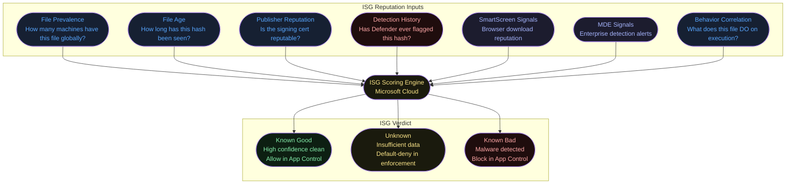
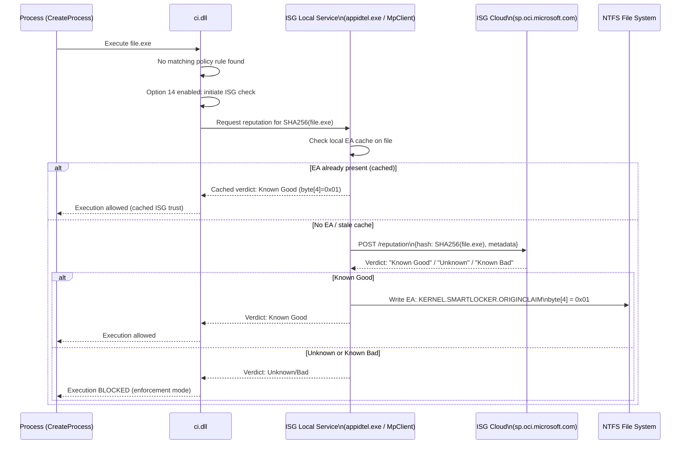
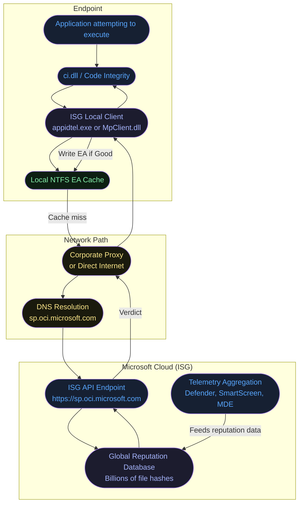
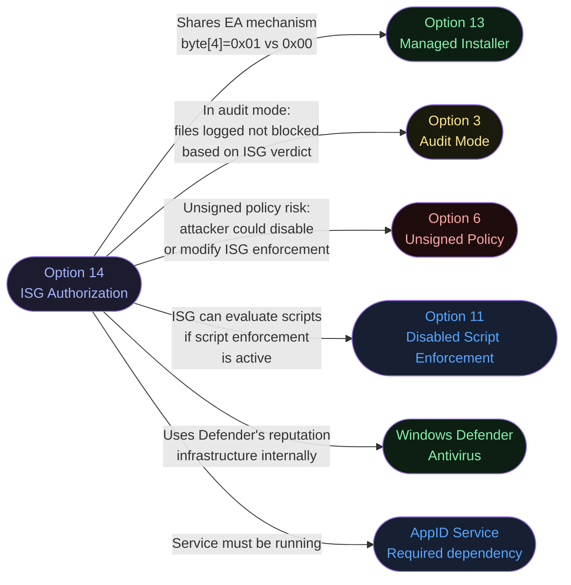
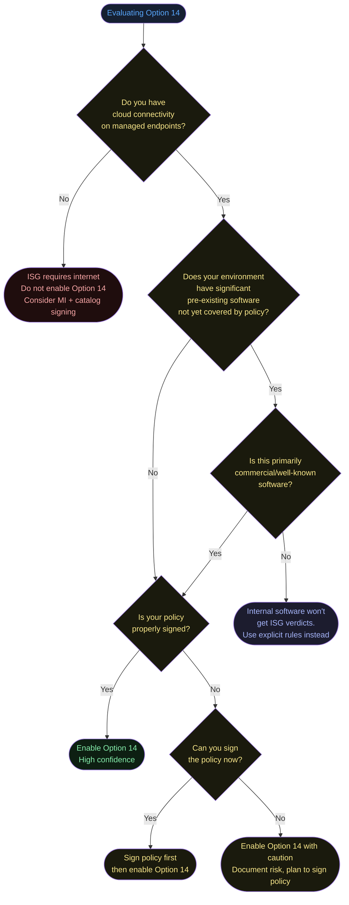
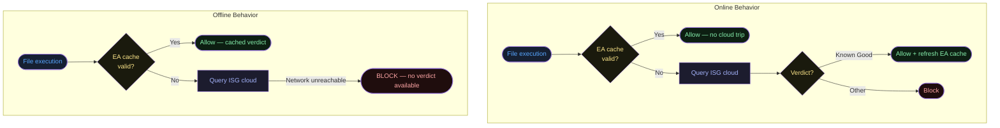
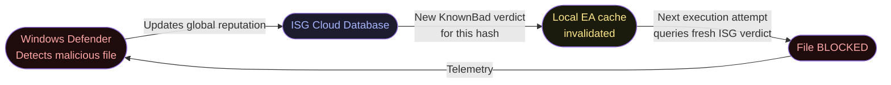

# Option 14 — Enabled:Intelligent Security Graph Authorization

**Author:** Anubhav Gain
**Category:** Endpoint Security
**Policy Rule Option:** 14
**Rule Name:** `Enabled:Intelligent Security Graph Authorization`
**Applies to Supplemental Policies:** Yes

---

## Table of Contents

1. [What It Does](#what-it-does)
2. [Why It Exists](#why-it-exists)
3. [The ISG Reputation System — Deep Dive](#the-isg-reputation-system--deep-dive)
4. [The Kernel EA Mechanism for ISG](#the-kernel-ea-mechanism-for-isg)
5. [Cloud Reputation Query Flow — Detailed Architecture](#cloud-reputation-query-flow--detailed-architecture)
6. [Visual Anatomy — Policy Evaluation Stack](#visual-anatomy--policy-evaluation-stack)
7. [How to Set It (PowerShell)](#how-to-set-it-powershell)
8. [XML Representation](#xml-representation)
9. [Interaction With Other Options](#interaction-with-other-options)
10. [When to Enable vs Disable](#when-to-enable-vs-disable)
11. [Real-World Scenario — End-to-End Walkthrough](#real-world-scenario--end-to-end-walkthrough)
12. [What Happens If You Get It Wrong](#what-happens-if-you-get-it-wrong)
13. [Offline Behavior and Caching](#offline-behavior-and-caching)
14. [Privacy and Data Transmission](#privacy-and-data-transmission)
15. [Valid for Supplemental Policies?](#valid-for-supplemental-policies)
16. [OS Version Requirements](#os-version-requirements)
17. [Security Considerations and Limitations](#security-considerations-and-limitations)
18. [Summary Table](#summary-table)

---

## What It Does

**Enabled:Intelligent Security Graph Authorization** integrates Microsoft's global telemetry-powered threat intelligence service — the **Intelligent Security Graph (ISG)** — directly into the App Control file execution decision pipeline. When this option is active, any file that lacks an explicit policy rule (no matching signer or hash rule) is automatically evaluated against the ISG cloud service. If the ISG returns a "known good" reputation verdict for the file, App Control allows it to execute. If the ISG returns unknown or bad reputation, the file follows normal enforcement (typically a block in enforcement mode).

The reputation verdict from ISG is **cached locally** using the same kernel extended attribute mechanism as Managed Installer: a `KERNEL.SMARTLOCKER.ORIGINCLAIM` EA is written to the file on the NTFS volume with `byte[4]=0x01` (distinguishing it from the MI value of `0x00`). Subsequent executions of the same file hit the local cache first, avoiding cloud round-trips on every launch.

---

## Why It Exists

App Control in strict enforcement mode requires **complete software inventory coverage** before deployment. For large enterprises with thousands of unique applications, building and maintaining explicit signer/hash rules for every binary is a massive operational undertaking. The Managed Installer option (13) solves this for newly deployed software, but leaves a gap for:

1. **Pre-existing software** installed before MI was configured
2. **Portable applications** (no installer, just dropped to disk)
3. **Third-party tools** installed directly by technical users with admin rights
4. **Software discovered in the environment** whose provenance is unclear
5. **Rapid adoption scenarios** where organizations want to deploy App Control quickly without months of policy building

ISG solves these gaps by leveraging Microsoft's **industry-scale telemetry**. The ISG aggregates file reputation data from:
- Billions of Windows Defender telemetry endpoints worldwide
- Microsoft Defender for Endpoint (MDE) detections and clean signals
- SmartScreen reputation verdicts
- Windows Update and Microsoft Store file metadata
- VirusTotal and partner threat intelligence feeds

A file seen running safely on millions of machines globally carries extremely high ISG confidence. This means well-known commercial software (Adobe, Zoom, Slack, Chrome, etc.) is automatically trusted without explicit rules — because ISG already knows these files are legitimate.

---

## The ISG Reputation System — Deep Dive

### How ISG Assigns Reputation

ISG is not a simple hash-lookup database. It uses **multi-dimensional reputation signals**:



### What "Known Good" Actually Means

ISG "Known Good" does not mean "this file is 100% safe." It means:
- The file hash has been seen on a statistically significant number of machines
- No malware detections are associated with this hash across the global telemetry fleet
- The combination of prevalence, age, publisher trust, and behavior signals exceeds the ISG confidence threshold for the "clean" verdict

Files that are **brand new** (never seen before), **internally developed** (low global prevalence), or **rarely distributed** (niche tools) will typically receive an "Unknown" verdict — and will be **blocked** in enforcement mode even with Option 14 enabled. This is a critical limitation to understand: ISG helps with well-known commercial software but does NOT help with custom/internal applications.

### ISG Limitations by File Type

| File Category | ISG Effectiveness | Notes |
|---------------|------------------|-------|
| Major commercial software (Adobe, Chrome, Office) | Very High | Global prevalence is in billions |
| Popular open-source tools (Git, VS Code, 7-Zip) | High | Wide enterprise adoption |
| Niche commercial tools (small ISV) | Medium | Lower global prevalence |
| Custom/internal enterprise apps | None | Zero or near-zero global prevalence |
| Scripts (.ps1, .py, .vbs) with Option 11 absent | Medium | ISG can evaluate interpreted scripts |
| Freshly compiled executables | None | No reputation data exists yet |
| Malware families | Blocked | Known-bad ISG verdict |

---

## The Kernel EA Mechanism for ISG

### How ISG Caching Works

Unlike Managed Installer (where the EA is written at install time by a designated process), the ISG EA is written **at first execution time** — after a successful cloud reputation query returns "Known Good."



### The EA Value for ISG

```
EA Name:  KERNEL.SMARTLOCKER.ORIGINCLAIM
EA Value: Binary blob
          ├── Header (version, flags, timestamp)
          ├── byte[4] = 0x01   ← ISG authorization (vs 0x00 for MI)
          ├── Hash of the file being authorized
          └── Expiry/validity information
```

**Cache expiry:** The ISG EA is not permanent. It has an embedded expiry. When the expiry is reached, the next execution triggers a fresh cloud query. This ensures that if a file's reputation changes (e.g., a previously clean file is later detected as malicious), the cached trust is eventually invalidated.

### Inspecting the ISG EA

```powershell
# Check EA on a file (requires admin)
fsutil file queryEA "C:\Program Files\SomeApp\app.exe"
# Look for: KERNEL.SMARTLOCKER.ORIGINCLAIM
# byte[4] = 0x01 indicates ISG authorization

# Check ISG service status
Get-Service -Name AppIDSvc
Get-Process appidtel -ErrorAction SilentlyContinue
```

---

## Cloud Reputation Query Flow — Detailed Architecture

### Network Requirements



### ISG Service Architecture on Endpoint

The ISG query on the endpoint is handled by the **AppID** service infrastructure, specifically:

- **AppIDSvc** — The AppLocker/AppID Windows service that hosts the MI and ISG functionality
- **appidtel.exe** — The AppID telemetry process that communicates with the ISG cloud
- **MpClient.dll** — Microsoft Defender's client library, used for reputation queries in some OS versions

```powershell
# Verify ISG service infrastructure is running
Get-Service AppIDSvc | Select-Object Status, StartType
# Required: Status = Running, StartType = Automatic

# Check appidtel process
Get-Process appidtel -ErrorAction SilentlyContinue | Select-Object Id, CPU, Name

# Test ISG connectivity (the endpoint used by ISG)
Test-NetConnection -ComputerName "sp.oci.microsoft.com" -Port 443
# Should return: TcpTestSucceeded = True
```

### ISG API Communication

The ISG client sends a HTTPS request to Microsoft's cloud containing:
- **File hash (SHA256)** — the primary lookup key
- **File metadata** — publisher, version, file name (assists disambiguation)
- **Machine context** — OS version, tenant ID (for enterprise-specific reputation data)
- **Policy context** — that App Control Option 14 is active (affects response format)

The cloud response contains:
- **Reputation verdict** — KnownGood / Unknown / KnownBad
- **Confidence score** — internal metric (not exposed to policy evaluation directly)
- **Cache TTL** — how long the local EA cache is valid

---

## Visual Anatomy — Policy Evaluation Stack

```mermaid
flowchart TD
    subgraph Layer1["Layer 1: Explicit Policy Rules"]
        SignerRule{Signer rule match?}
        HashRule{Hash rule match?}
        PathRule{Path rule match?\nif enabled}
    end

    subgraph Layer2["Layer 2: Dynamic Trust — Option 13"]
        MI_EA{KERNEL.SMARTLOCKER\n.ORIGINCLAIM EA\nbyte[4]==0x00?}
    end

    subgraph Layer3["Layer 3: Dynamic Trust — Option 14"]
        ISG_Cache{Local EA cache\nbyte[4]==0x01\nvalid & not expired?}
        ISG_Cloud{Cloud ISG query\nsp.oci.microsoft.com}
        ISG_Verdict{ISG verdict?}
    end

    subgraph Outcome["Outcome"]
        Allow([Execution Allowed])
        Block([Execution Blocked])
    end

    Exec([File execution attempt]) --> SignerRule
    SignerRule -- Match --> Allow
    SignerRule -- No Match --> HashRule
    HashRule -- Match --> Allow
    HashRule -- No Match --> PathRule
    PathRule -- Match --> Allow
    PathRule -- No Match --> MI_EA

    MI_EA -- EA present, valid --> Allow
    MI_EA -- No EA / byte mismatch --> ISG_Cache

    ISG_Cache -- Cache hit, not expired --> Allow
    ISG_Cache -- Cache miss / expired --> ISG_Cloud
    ISG_Cloud --> ISG_Verdict
    ISG_Verdict -- Known Good --> Allow
    ISG_Verdict -- Unknown --> Block
    ISG_Verdict -- Known Bad --> Block
    ISG_Verdict -- Cloud unreachable --> Block

    style Exec fill:#162032,color:#58a6ff
    style SignerRule fill:#1a1a0d,color:#fde68a
    style HashRule fill:#1a1a0d,color:#fde68a
    style PathRule fill:#1a1a0d,color:#fde68a
    style MI_EA fill:#0d1f12,color:#86efac
    style ISG_Cache fill:#1c1c2e,color:#a5b4fc
    style ISG_Cloud fill:#1c1c2e,color:#a5b4fc
    style ISG_Verdict fill:#1a1a0d,color:#fde68a
    style Allow fill:#0d1f12,color:#86efac
    style Block fill:#1f0d0d,color:#fca5a5
```

**Evaluation priority:** Explicit policy rules (Layer 1) always take precedence. Dynamic trust (Layers 2 and 3) is only consulted when no explicit rule matches. Within dynamic trust, MI (Layer 2) is checked before ISG (Layer 3).

---

## How to Set It (PowerShell)

### Prerequisites

Before enabling Option 14, the following infrastructure must be in place:

```powershell
# 1. Ensure AppID Service is running
Set-Service -Name AppIDSvc -StartupType Automatic
Start-Service -Name AppIDSvc

# 2. Verify ISG endpoint connectivity
Test-NetConnection -ComputerName "sp.oci.microsoft.com" -Port 443

# 3. Verify Windows Defender (Antivirus) is running
# ISG leverages Defender's reputation infrastructure
Get-MpComputerStatus | Select-Object AMServiceEnabled, AntispywareEnabled, AntivirusEnabled
```

### Enable ISG Authorization (Set Option 14)

```powershell
# Enable ISG in the WDAC policy
Set-RuleOption -FilePath "C:\Policies\MyPolicy.xml" -Option 14

# Verify
[xml]$xml = Get-Content "C:\Policies\MyPolicy.xml"
$xml.SiPolicy.Rules.Rule | Where-Object { $_.Option -eq "Enabled:Intelligent Security Graph Authorization" }

# Convert to binary
ConvertFrom-CIPolicy -XmlFilePath "C:\Policies\MyPolicy.xml" `
                     -BinaryFilePath "C:\Policies\MyPolicy.p7b"
```

### Disable ISG Authorization (Remove Option 14)

```powershell
Remove-RuleOption -FilePath "C:\Policies\MyPolicy.xml" -Option 14
```

### Full Example — Policy with Both MI and ISG

```powershell
$PolicyPath = "C:\Policies\MI_ISG_Policy.xml"

Copy-Item "C:\Windows\schemas\CodeIntegrity\ExamplePolicies\DefaultWindows_Enforced.xml" `
          -Destination $PolicyPath

# Enable both dynamic trust mechanisms
Set-RuleOption -FilePath $PolicyPath -Option 13   # Managed Installer
Set-RuleOption -FilePath $PolicyPath -Option 14   # ISG

# Verify both options are set
[xml]$xml = Get-Content $PolicyPath
$xml.SiPolicy.Rules.Rule | Select-Object -ExpandProperty Option

ConvertFrom-CIPolicy -XmlFilePath $PolicyPath -BinaryFilePath "C:\Policies\MI_ISG_Policy.p7b"
```

### Monitor ISG Activity

```powershell
# Watch for ISG authorization events in real time
Get-WinEvent -LogName "Microsoft-Windows-CodeIntegrity/Operational" -MaxEvents 50 |
    Where-Object { $_.Id -in @(3080, 3082, 3083, 3084, 3085, 3086) } |
    Select-Object TimeCreated, Id, Message |
    Format-Table -Wrap

# ISG Event ID meanings:
# 3080 = ISG check initiated
# 3082 = ISG authorized file (known good)
# 3083 = ISG blocked file (not known good)
# 3084 = ISG query failed (connectivity issue)
# 3085 = ISG cache hit (used cached verdict)
# 3086 = ISG authorization in audit mode
```

---

## XML Representation

```xml
<?xml version="1.0" encoding="utf-8"?>
<SiPolicy xmlns="urn:schemas-microsoft-com:sipolicy" PolicyType="Base Policy">
  <VersionEx>10.0.0.0</VersionEx>
  <PolicyTypeID>{A244370E-44C9-4C06-B551-F6016E563076}</PolicyTypeID>
  <PlatformID>{2E07F7E4-194C-4D20-B96C-134CA31A5C3F}</PlatformID>
  <Rules>

    <!-- Option 14: Trust files with known-good ISG reputation -->
    <Rule>
      <Option>Enabled:Intelligent Security Graph Authorization</Option>
    </Rule>

    <!-- Recommended companion options: -->

    <!-- Option 13: Also trust MI-installed files (often paired with 14) -->
    <Rule>
      <Option>Enabled:Managed Installer</Option>
    </Rule>

    <!-- Option 16: Allow policy updates without reboot (optional) -->
    <!-- <Rule><Option>Enabled:Update Policy No Reboot</Option></Rule> -->

  </Rules>

  <!-- Note: No explicit file rules needed for ISG-covered software.
       ISG dynamically authorizes well-known commercial software at runtime.
       Internal/custom apps still need explicit rules — ISG won't know them. -->

</SiPolicy>
```

---

## Interaction With Other Options



| Option / Component | Relationship | Notes |
|-------------------|-------------|-------|
| Option 13 — Managed Installer | Complementary | Both use the same EA field; they are additive. Use both for maximum coverage: MI for IT-deployed software, ISG for pre-existing commercial software. |
| Option 3 — Audit Mode | Compatible | In audit mode with ISG, executions are logged based on what ISG verdict would produce in enforcement. Useful for measuring ISG coverage before enforcement. |
| Option 6 — Unsigned Policy | Security risk | An unsigned policy with Option 14 can be tampered by an admin-level attacker to disable ISG enforcement. Signed policies prevent this. |
| Option 11 — Disabled Script Enforcement | Interaction | When script enforcement is active (Option 11 not set), ISG can be queried for script reputations. When Option 11 disables script enforcement, ISG for scripts is irrelevant. |
| Windows Defender Antivirus | Hard dependency | The ISG client leverages Defender's cloud reputation infrastructure (`MpClient.dll`). If Defender is disabled or tampered with, ISG reputation queries may fail. |
| AppID Service | Hard dependency | `AppIDSvc` must be running for ISG to function. Without it, ISG queries will not occur and files without explicit rules will be blocked. |
| Network / Firewall | Infrastructure dependency | Port 443 to `sp.oci.microsoft.com` must be reachable. Corporate proxies must allow this traffic. |

---

## When to Enable vs Disable



**Enable Option 14 when:**
- Transitioning an existing environment to App Control where software inventory is incomplete
- Most software on endpoints is commercial and well-known (high ISG coverage expected)
- Cloud connectivity is reliable and consistent
- You want faster time-to-enforcement without months of policy rule building
- Used as a "catch-all" alongside MI for mixed environments

**Do NOT enable Option 14 when:**
- Endpoints are air-gapped or have restricted internet access
- The environment is primarily internally-developed software (ISG won't know it)
- You require deterministic, policy-only trust (no cloud dependency)
- Compliance frameworks prohibit cloud-dependent security controls
- You are deploying to classified or government-sensitive environments where ISG telemetry participation is not approved

---

## Real-World Scenario — End-to-End Walkthrough

**Scenario:** Megacorp has 50,000 endpoints. The security team is deploying App Control enforcement but has ~3,000 unique commercial applications installed across the fleet, with no time to build explicit rules for all of them. Option 14 (ISG) is enabled alongside Option 13 (MI) and a base Windows signer rule. The goal is to reach enforcement mode within 30 days.

```mermaid
sequenceDiagram
    actor Admin as Security Team
    participant MDM as Intune
    participant Endpoint as Employee Laptop
    participant CI as ci.dll
    participant ISGClient as ISG Client (appidtel)
    participant ISGCloud as ISG Cloud\n(sp.oci.microsoft.com)
    participant NTFS as NTFS File System
    participant SIEM as SIEM / Sentinel

    Admin->>MDM: Deploy App Control policy:\n- Windows signer rules (base)\n- Option 13 (MI)\n- Option 14 (ISG)\n- Option 3 (Audit mode initially)

    MDM->>Endpoint: Policy deployed in AUDIT mode
    Note over Endpoint: Audit period: 2 weeks

    Endpoint->>CI: User opens Zoom.exe
    CI->>CI: No explicit Zoom signer rule in policy
    CI->>CI: Option 14 enabled: check ISG
    CI->>ISGClient: Request ISG for Zoom.exe SHA256
    ISGClient->>ISGCloud: POST reputation request\n{hash: abc123..., file: "Zoom.exe",\npublisher: "Zoom Video Communications"}
    ISGCloud-->>ISGClient: Verdict: Known Good\n(prevalence: 400M+ machines)
    ISGClient->>NTFS: Write KERNEL.SMARTLOCKER.ORIGINCLAIM\nbyte[4]=0x01 (ISG authorized)
    ISGClient-->>CI: Verdict: Known Good
    CI->>CI: Audit mode: log authorization event
    Note over Endpoint: Zoom runs; event 3086 logged

    Endpoint->>CI: User opens InternalCRM.exe\n(custom-built internal app)
    CI->>CI: No explicit rule for InternalCRM.exe
    CI->>ISGClient: Request ISG reputation
    ISGClient->>ISGCloud: POST reputation request\n{hash: xyz789..., file: "InternalCRM.exe"}
    ISGCloud-->>ISGClient: Verdict: Unknown\n(hash never seen globally — internal app)
    ISGClient-->>CI: Verdict: Unknown
    CI->>CI: Audit mode: log BLOCK event (would block in enforcement)
    CI->>SIEM: Event 3076: InternalCRM.exe would be blocked

    Admin->>SIEM: Review audit events after 2 weeks
    Admin->>Admin: Identify InternalCRM.exe as legitimate internal app
    Admin->>MDM: Add signer rule for internal code-signing cert
    Admin->>MDM: Add catalog hash for InternalCRM.exe
    Admin->>MDM: Remove Option 3 (switch from Audit to Enforce)
    MDM->>Endpoint: Updated enforcement policy

    Note over Endpoint: Now in ENFORCEMENT mode
    Endpoint->>CI: User opens Zoom.exe
    CI->>CI: No explicit Zoom rule
    CI->>NTFS: Check EA cache
    NTFS-->>CI: EA present, byte[4]=0x01, not expired
    CI-->>Endpoint: Zoom allowed (cached ISG verdict)
    Note over Endpoint: No cloud round-trip needed — local cache hit

    Endpoint->>CI: User attempts to run suspicious_tool.exe\n(downloaded from internet)
    CI->>CI: No explicit rule
    CI->>ISGClient: Request ISG reputation
    ISGClient->>ISGCloud: POST reputation request
    ISGCloud-->>ISGClient: Verdict: Unknown\n(new file, limited distribution)
    ISGClient-->>CI: Verdict: Unknown
    CI-->>Endpoint: BLOCKED (enforcement mode + unknown ISG verdict)
    CI->>SIEM: Event 3077: suspicious_tool.exe blocked
    SIEM->>Admin: Alert: blocked file on endpoint
```

---

## What Happens If You Get It Wrong

### Scenario A: ISG enabled, AppIDSvc not running

- ISG queries cannot be made
- Files without explicit policy rules are blocked (ISG verdict is effectively "Unknown")
- Commercial software (Zoom, Slack, Chrome, Adobe) all blocked if not explicitly ruled
- **Symptoms:** Mass block events (Event 3077) for well-known commercial software; users unable to open everyday apps
- **Recovery:** Start AppIDSvc, set to Automatic; ISG will query and cache verdicts on next execution attempt

### Scenario B: ISG enabled, no network connectivity to sp.oci.microsoft.com

- ISG cloud queries fail (network timeout)
- Files without explicit rules or valid cached EA are blocked
- If a machine has been offline and cached ISG EAs have expired, re-running previously-working apps may fail
- **Impact:** Laptops going offline (travel, remote locations) may experience app blocks after re-connecting if caches expired
- **Recommendation:** Ensure sufficient EA cache TTL; build explicit rules for critical business applications rather than relying solely on ISG

### Scenario C: ISG treated as primary trust mechanism for internal apps

- Internal applications (CRM, ERP, custom tools) have low/zero global prevalence
- ISG returns "Unknown" for these files
- All internal apps are blocked in enforcement mode
- **Root cause misunderstanding:** ISG is designed for commercial software, not internally-developed applications
- **Correction:** Use Option 13 (MI) for IT-deployed internal apps, or add explicit signer/hash rules for internal software signed with your corporate code-signing cert

### Scenario D: ISG + unsigned policy combination

- An attacker with admin rights modifies the policy to remove Option 14 or to add malicious publisher rules
- The unsigned policy can be replaced without reboot or approval
- ISG protection is bypassed
- **Severity:** High — policy integrity is the foundation; ISG adds value only when the policy itself cannot be tampered

### Scenario E: Malicious file achieves "Known Good" ISG verdict

- Theoretically possible if a malicious file is distributed at sufficient global scale before Defender detects it
- In practice, Defender's real-time protection and automated investigation (AIR) typically detect and propagate malware verdicts within hours
- ISG verdict TTLs ensure stale "Known Good" caches expire and are re-queried
- **Defense in depth:** ISG is a trust augmentation, not a replacement for AV/EDR

### Event IDs to Monitor

| Event ID | Log | Meaning |
|----------|-----|---------|
| 3080 | Microsoft-Windows-CodeIntegrity/Operational | ISG check initiated |
| 3082 | Microsoft-Windows-CodeIntegrity/Operational | File authorized by ISG (known good verdict) |
| 3083 | Microsoft-Windows-CodeIntegrity/Operational | File not authorized by ISG (unknown/bad verdict) |
| 3084 | Microsoft-Windows-CodeIntegrity/Operational | ISG query failed (connectivity issue) |
| 3085 | Microsoft-Windows-CodeIntegrity/Operational | ISG authorization from local cache |
| 3086 | Microsoft-Windows-CodeIntegrity/Operational | ISG authorization in audit mode |

---

## Offline Behavior and Caching

ISG is fundamentally a cloud service, which raises critical questions about offline scenarios.



### Offline Cache Strategy

When designing ISG deployments for environments with periodic offline periods (remote workers, travel, factory floors):

1. **Ensure ISG queries happen while online**: Users should open all critical applications while connected, populating the EA cache before going offline
2. **Cache TTL is sufficient for expected offline duration**: The EA cache TTL is managed by Microsoft; typical values support several days to weeks of offline operation for previously-seen files
3. **Build explicit rules for offline-critical applications**: Applications that must run when offline should have explicit signer or hash rules in the policy, not relying on ISG
4. **Test offline scenarios**: Before enforcement rollout, simulate offline conditions and verify critical apps still launch from cached ISG EAs

```powershell
# Simulate offline scenario: temporarily block ISG endpoint
# (for testing purposes in a lab environment)
netsh advfirewall firewall add rule name="Block ISG Test" `
      dir=out action=block remoteip="sp.oci.microsoft.com" protocol=TCP remoteport=443

# Run application — should use cached EA
# Then check event log for 3085 (cache hit) vs 3084 (failed query)

# Re-enable connectivity
netsh advfirewall firewall delete rule name="Block ISG Test"
```

---

## Privacy and Data Transmission

### What ISG Transmits to Microsoft

When an ISG query is made, the following data is sent to Microsoft:

| Data Element | Transmitted | Purpose |
|--------------|-------------|---------|
| File SHA256 hash | Yes | Primary lookup key |
| File name | Yes | Disambiguation |
| Publisher/signer info | Yes | Reputation context |
| OS version | Yes | Platform context |
| Windows Defender status | Yes | Security posture context |
| Tenant ID (Azure AD) | Yes (if enrolled) | Enterprise-specific reputation |
| File content | **No** | Never transmitted — only the hash |
| User identity | **No** | Not transmitted |
| File path | Limited | May be sent as metadata |

### Organizational Considerations

- If your organization has strict data residency requirements, verify ISG data flows comply
- For government or classified environments, ISG may not be permissible; use MI + catalog signing instead
- Enterprise customers enrolled in Defender for Endpoint may have enhanced ISG verdicts based on their organization's telemetry

---

## Valid for Supplemental Policies?

**Yes.** Option 14 is valid in both **base and supplemental policies**.

This enables scenarios where:
- The base policy is strict (no ISG) but a supplemental policy for a specific OU enables ISG trust for that group
- A supplemental policy for pilot machines enables ISG while the enterprise base policy requires explicit rules
- Different departments have different ISG trust levels managed through separate supplemental policies

When Option 14 is in a supplemental policy, it extends ISG trust only to the scope governed by that supplemental policy (defined by its PolicyID/BasePolicyID relationship).

---

## OS Version Requirements

| Platform | Minimum Version | Notes |
|----------|----------------|-------|
| Windows 10 | 1709 | ISG Authorization first available |
| Windows 10 | 1803+ | Recommended minimum; improved ISG caching |
| Windows 11 | All versions | Fully supported |
| Windows Server 2019 | All versions | Supported; note servers often have lower ISG prevalence for server-specific software |
| Windows Server 2022 | All versions | Fully supported |
| Windows Server 2016 | Limited | AppIDSvc available but ISG integration is limited |

**Note for Windows Server:** The ISG database is heavily populated with client-side application telemetry. Server-specific software (database engines, monitoring agents, backup software) may have lower global prevalence and therefore receive "Unknown" ISG verdicts even when legitimate. On servers, explicit signer rules are recommended over ISG reliance.

---

## Security Considerations and Limitations

### ISG Is Not a Replacement for Explicit Rules

ISG is an **acceleration mechanism** for initial deployment, not a permanent replacement for careful policy rule management. Over time, organizations should:
1. Audit which files are being authorized by ISG (Event IDs 3082, 3085)
2. Convert high-frequency ISG-authorized files to explicit signer rules
3. Reduce dependence on cloud connectivity for security decisions

### Supply Chain Attacks and ISG

A sophisticated supply chain attack (malicious update to legitimate software) may briefly be authorized by ISG if:
- The attacker injects into a file that retains the original hash (unlikely but possible via DLL injection scenarios)
- The malicious update appears under the same publisher certificate as the legitimate software

The ISG is not immune to sophisticated attacks but provides a meaningful barrier against:
- Novel malware with zero prevalence
- Attacker-created tools (typically have no ISG reputation)
- Cracked/pirated software (different hashes from originals, unknown to ISG)

### ISG + Defender Integration

ISG and Windows Defender Antivirus are deeply integrated. If Defender detects a file as malicious:
1. The ISG verdict for that hash transitions from "Known Good" to "Known Bad"
2. The local EA cache is invalidated for that hash
3. Future execution attempts are blocked

This creates a feedback loop: Defender detections improve ISG accuracy, and ISG blocks help prevent further spread of detected malware.



---

## Summary Table

| Attribute | Value |
|-----------|-------|
| Option Number | 14 |
| XML String | `Enabled:Intelligent Security Graph Authorization` |
| Policy Type | Base and supplemental policies |
| Default State | Not set — ISG not consulted |
| PowerShell Enable | `Set-RuleOption -FilePath <xml> -Option 14` |
| PowerShell Remove | `Remove-RuleOption -FilePath <xml> -Option 14` |
| Kernel EA Name | `KERNEL.SMARTLOCKER.ORIGINCLAIM` |
| ISG EA byte[4] value | `0x01` (MI uses `0x00`) |
| ISG Cloud Endpoint | `https://sp.oci.microsoft.com` |
| Required Service | AppIDSvc (AppLockerFltr.sys driver) |
| Required Connectivity | Port 443 to sp.oci.microsoft.com |
| Cache Mechanism | NTFS Extended Attribute with TTL |
| Best For | Commercial software coverage; accelerated enforcement rollout |
| Does NOT cover | Internal/custom apps, offline files without cached EA |
| Supplemental Policy | Valid — Yes |
| Minimum OS | Windows 10 1709 |
| Key Event IDs | 3080, 3082, 3083, 3084, 3085, 3086 (CodeIntegrity/Operational) |
| Security recommendation | Use signed policy; supplement with explicit rules for critical apps |
| Offline behavior | Uses cached EA; blocks if cache expired and cloud unreachable |
| Data sent to Microsoft | File SHA256, name, publisher, OS version, tenant ID (no file content) |
