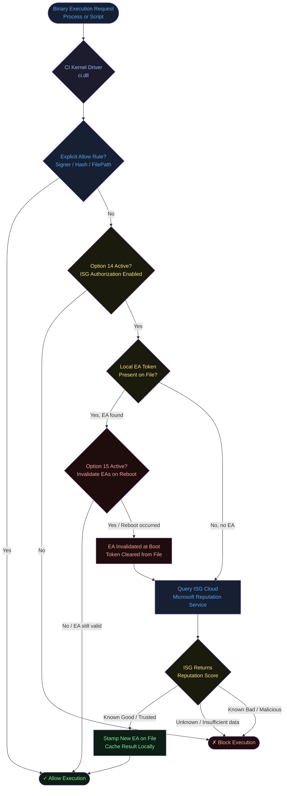
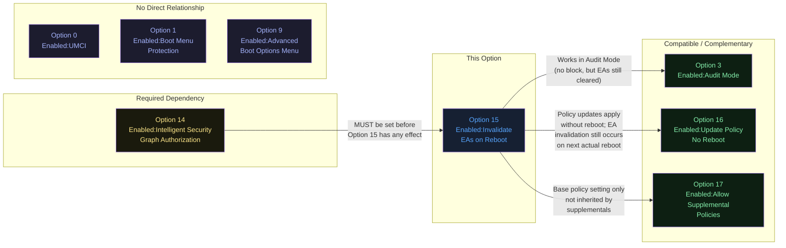
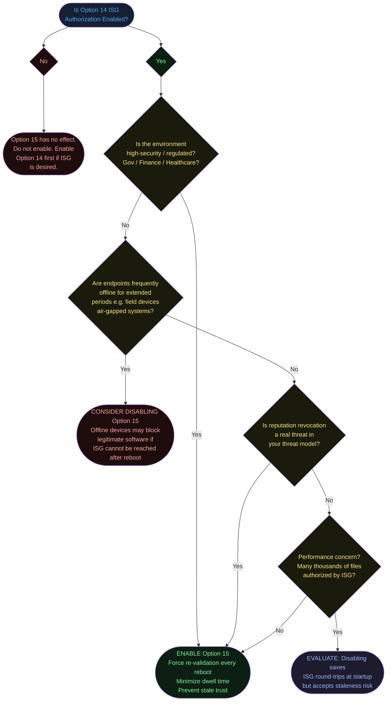
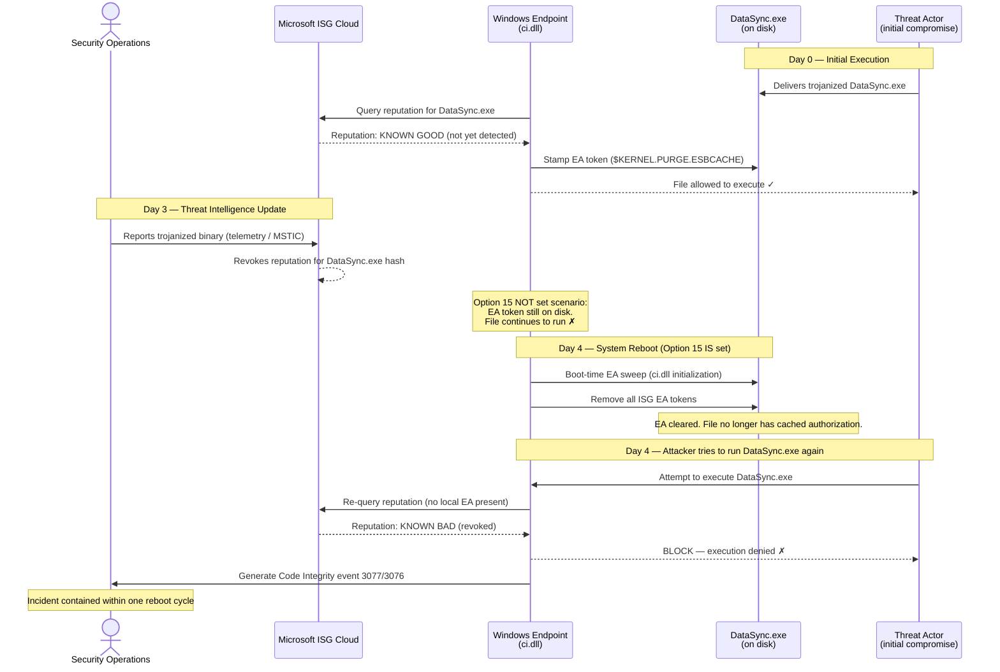

# Option 15 — Enabled:Invalidate EAs on Reboot

**Author:** Anubhav Gain
**Category:** Endpoint Security
**Rule Option ID:** 15
**Rule String:** `Enabled:Invalidate EAs on Reboot`
**Dependency:** Requires Option 14 (Enabled:Intelligent Security Graph Authorization)
**Valid for Supplemental Policies:** No

---

## Table of Contents

1. [What It Does](#what-it-does)
2. [Why It Exists](#why-it-exists)
3. [Visual Anatomy — Policy Evaluation Stack](#visual-anatomy--policy-evaluation-stack)
4. [How to Set It (PowerShell)](#how-to-set-it-powershell)
5. [XML Representation](#xml-representation)
6. [Interaction with Other Options](#interaction-with-other-options)
7. [When to Enable vs Disable](#when-to-enable-vs-disable)
8. [Real-World Scenario / End-to-End Walkthrough](#real-world-scenario--end-to-end-walkthrough)
9. [What Happens If You Get It Wrong](#what-happens-if-you-get-it-wrong)
10. [Valid for Supplemental Policies?](#valid-for-supplemental-policies)
11. [OS Version Requirements](#os-version-requirements)
12. [Summary Table](#summary-table)

---

## What It Does

When Microsoft's **Intelligent Security Graph (ISG)** authorizes a file to run (Option 14), App Control for Business stamps a special **extended file attribute (EA)** directly onto the file on disk. This EA acts as a cached "good reputation" token, meaning subsequent execution attempts read the local attribute rather than querying the cloud graph service again. **Option 15 — Enabled:Invalidate EAs on Reboot** instructs App Control's kernel driver (`ci.dll`) to **periodically clear those cached EA stamps at each system reboot**, forcing every ISG-authorized file to re-query the cloud reputation service the next time it attempts to execute. In plain terms: the trust you received last session is not permanent — the slate is wiped clean on reboot, and the file must re-earn its authorization from the ISG cloud before it runs again.

---

## Why It Exists

The Intelligent Security Graph provides **cloud-based reputation scores** for files across Microsoft's telemetry network. While this is a powerful mechanism for allowing known-good software without explicit policy rules, it creates an implicit trust chain that can become stale or exploited:

- **Reputation drift:** A file that had a good reputation on Monday may be reclassified as malicious by Tuesday. Without invalidation, a compromised or newly-flagged file retains its local EA token and continues executing even after ISG would refuse a fresh authorization.
- **Offline exploitation:** An attacker who gains brief network access (or the ability to write EAs) can pre-stamp files with trusted attributes while the system is offline. Without periodic revalidation, those stamps persist indefinitely.
- **Dwell-time minimization:** Incident response doctrine seeks to reduce the window between compromise detection and containment. If ISG revokes a file's reputation, Option 15 ensures that revocation takes effect at the next reboot, bounding the dwell time to at most one reboot cycle rather than indefinitely.
- **Defense-in-depth against EA tampering:** If an attacker manages to forge or copy the extended attribute onto a malicious binary, Option 15 ensures that forgery has a maximum lifespan of one reboot cycle.

In short, Option 15 converts ISG-based trust from **permanent** to **ephemeral** — you must re-prove trustworthiness each time the system starts.

---

## Visual Anatomy — Policy Evaluation Stack

The diagram below shows exactly where ISG EA caching and invalidation fits within the full App Control kernel evaluation pipeline.



**Key insight:** The invalidation happens at **boot time** — not at file execution time. `ci.dll` sweeps and removes cached EAs during kernel initialization. The file is not blocked until its next attempted execution after the reboot, at which point there is no valid EA and the ISG must be queried fresh.

---

## How to Set It (PowerShell)

### Prerequisites

- Windows PowerShell 5.1+ or PowerShell 7+
- `ConfigCI` module (built into Windows; no separate install)
- Option 14 (`Enabled:Intelligent Security Graph Authorization`) **must already be set** — Option 15 has no effect without it
- An existing policy XML file to modify

### Enable Option 15 (Add the Rule)

```powershell
# Step 1: Define your policy XML path
$PolicyPath = "C:\Policies\MyBasePolicy.xml"

# Step 2: Ensure Option 14 is already enabled (prerequisite)
Set-RuleOption -FilePath $PolicyPath -Option 14

# Step 3: Enable Option 15 — Invalidate EAs on Reboot
Set-RuleOption -FilePath $PolicyPath -Option 15

# Step 4: Verify the rule was added
(Get-Content $PolicyPath) | Select-String "Rule"
```

### Disable Option 15 (Remove the Rule)

```powershell
# Remove Option 15 — revert to persistent EA caching (EA tokens never expire)
Remove-RuleOption -FilePath $PolicyPath -Option 15
```

### Full Policy Build with Option 15 Enabled

```powershell
# Complete workflow: create policy, add ISG + invalidation, deploy
$PolicyPath    = "C:\Policies\ISGPolicy.xml"
$BinaryPath    = "C:\Policies\ISGPolicy.bin"

# Start from the default Windows template
Copy-Item -Path "C:\Windows\schemas\CodeIntegrity\ExamplePolicies\DefaultWindows_Enforced.xml" `
          -Destination $PolicyPath

# Set a unique policy ID
$PolicyId = [System.Guid]::NewGuid().ToString()
Set-CIPolicyIdInfo -FilePath $PolicyPath -PolicyName "ISG-Enforced-Policy" -PolicyId $PolicyId

# Enable ISG (Option 14) + EA Invalidation on Reboot (Option 15)
Set-RuleOption -FilePath $PolicyPath -Option 14
Set-RuleOption -FilePath $PolicyPath -Option 15

# Optionally enable audit mode for testing before enforcement
# Set-RuleOption -FilePath $PolicyPath -Option 3

# Convert to binary and deploy
ConvertFrom-CIPolicy -XmlFilePath $PolicyPath -BinaryFilePath $BinaryPath

# Deploy to the standard location
Copy-Item -Path $BinaryPath -Destination "C:\Windows\System32\CodeIntegrity\CiPolicies\Active\" -Force
```

### Verify Current Rule Options on an Existing Policy

```powershell
# Parse and display all current rule options
[xml]$Policy = Get-Content "C:\Policies\ISGPolicy.xml"
$Policy.SiPolicy.Rules.Rule | ForEach-Object {
    Write-Host "Option: $($_.Option)"
}
```

---

## XML Representation

When Option 15 is enabled, the following XML element is added to the `<Rules>` section of the policy file:

```xml
<?xml version="1.0" encoding="utf-8"?>
<SiPolicy xmlns="urn:schemas-microsoft-com:sipolicy" PolicyType="Base Policy">

  <VersionEx>10.0.0.0</VersionEx>
  <PlatformID>{2E07F7E4-194C-4D20-B96C-1AEF9CF5A3CA}</PlatformID>
  <Rules>

    <!-- Option 14: ISG Authorization (REQUIRED prerequisite for Option 15) -->
    <Rule>
      <Option>Enabled:Intelligent Security Graph Authorization</Option>
    </Rule>

    <!-- Option 15: Invalidate EAs on Reboot -->
    <!-- When present, App Control clears all ISG-cached EA tokens at each system boot -->
    <!-- Forces re-query of ISG cloud reputation on next execution attempt -->
    <Rule>
      <Option>Enabled:Invalidate EAs on Reboot</Option>
    </Rule>

  </Rules>

  <!-- ... FileRules, Signers, CiSigners etc ... -->

</SiPolicy>
```

### What the EA Looks Like at the File System Level

App Control stores its ISG trust attribute in the **$KERNEL.PURGE.ESBCACHE** alternate data stream / NTFS EA on NTFS volumes. You can inspect it with:

```powershell
# View extended attributes on a file (requires Sysinternals streams or direct WinAPI)
# The EA name is typically: $KERNEL.PURGE.ESBCACHE
Get-Item "C:\SomeApp\app.exe" -Stream *

# With streams.exe (Sysinternals):
# streams.exe C:\SomeApp\app.exe
```

After a reboot with Option 15 active, this EA will be absent until the file is next authorized by ISG.

---

## Interaction with Other Options



### Option Compatibility Matrix

| Option | Relationship | Notes |
|--------|-------------|-------|
| **14 — ISG Authorization** | **Hard dependency** | Option 15 is meaningless without Option 14. ci.dll ignores the invalidation rule if ISG is not active. Always enable 14 before 15. |
| **3 — Audit Mode** | Compatible | In audit mode, ISG EA invalidation still occurs on reboot. Files are not blocked but the re-query process functions normally. Useful for testing without risking production blockage. |
| **16 — Update Policy No Reboot** | Compatible | Policy updates can be applied live; EA invalidation still triggers on next organic reboot. These options address different concerns. |
| **17 — Allow Supplemental Policies** | Base only | Option 15 can only appear in a base policy. Supplemental policies cannot set this rule. |
| **18 — Disable Runtime FilePath Protection** | Unrelated | Addresses FilePath rule writable-path checks; orthogonal concern to ISG EA lifecycle. |

---

## When to Enable vs Disable



### Guidance Summary

| Scenario | Recommendation |
|----------|---------------|
| High-security enterprise (finance, gov, healthcare) | **Enable** — periodic revalidation is mandatory for compliance |
| Standard enterprise with connected endpoints | **Enable** — low risk, strong security benefit |
| Kiosk or fixed-function device with rare reboots | **Enable** — minimal overhead since reboots are rare |
| Field devices with intermittent connectivity | **Evaluate** — if ISG is unreachable after reboot, ISG-only-authorized files may block |
| ISG not enabled (Option 14 absent) | **Irrelevant** — Option 15 has zero effect |
| Performance-critical startup scenarios | **Evaluate** — ISG re-queries on every boot for all EA-cached files adds latency |

---

## Real-World Scenario / End-to-End Walkthrough

**Scenario:** A security operations team learns that a third-party utility, `DataSync.exe`, which was previously authorized by ISG and cached with an EA on all endpoints, has been flagged as a trojanized backdoor. Microsoft's threat intelligence has revoked its ISG reputation. The team needs to ensure no endpoint can run it after the next reboot.



**Timeline comparison:**

| Configuration | Time to block after ISG revocation |
|--------------|-------------------------------------|
| Option 15 disabled (EA persists forever) | **Never** — file runs indefinitely on cached EA |
| Option 15 enabled | **Next reboot** — maximum one reboot cycle dwell time |

---

## What Happens If You Get It Wrong

### Scenario A: You enable Option 15 WITHOUT Option 14

**Result:** No visible error, no policy compilation failure, but Option 15 is silently inert. ISG is not running, so there are no EA tokens to invalidate. The option consumes no system resources and produces no output — it simply does nothing. This is harmless but wasteful and can create a false sense of security in a policy audit.

```
Policy state: Option 14 absent, Option 15 present
Runtime behavior: ISG not active; no EAs ever written; no EAs invalidated.
Security posture: Same as having neither option — all unknown files blocked by default rules.
```

### Scenario B: You enable Option 14 but NOT Option 15

**Result:** ISG authorizations are cached indefinitely. A file authorized today retains its EA token through all future boots until the file is modified (which updates its hash and triggers re-evaluation anyway). The risk is that ISG reputation revocations have **no enforcement path** — revoked reputation never causes a block because the cached EA is never cleared.

**Concrete risk:** A threat actor or malware that achieves EA injection (or that genuinely had good reputation when first seen) will continue to execute through all future reboots even after Microsoft's intelligence network flags it as malicious.

### Scenario C: Option 15 enabled, endpoint has no internet access on reboot

**Result:** After reboot, EA tokens are cleared. When the file attempts to execute, App Control queries ISG, but the endpoint cannot reach the ISG service. ISG returns no response. App Control's fallback behavior for unreachable ISG is to **deny execution** (fail closed). This can cause legitimate, previously-ISG-authorized software to break on endpoints with connectivity issues.

**Mitigation:** Ensure all ISG-authorized files also have explicit allow rules (signer rules, hash rules) as a fallback. Do not rely solely on ISG for business-critical applications on endpoints with intermittent connectivity.

### Scenario D: You remove Option 14 but leave Option 15

**Result:** Same as Scenario A — Option 15 is inert without its dependency. No harm, but cleanup is advisable.

---

## Valid for Supplemental Policies?

**No.** Option 15 is only valid in **base policies**.

The reason is architectural: supplemental policies expand the rule set of a base policy but do not control the behavior of core enforcement mechanisms like the ISG EA lifecycle. The ISG authorization mechanism and its EA management are base-policy-level concerns that control how `ci.dll` fundamentally operates. Supplemental policies are layered on top after base policy evaluation and have no authority to alter how the kernel-level trust cache is managed.

If you place Option 15 in a supplemental policy XML and attempt to compile it, the `ConvertFrom-CIPolicy` cmdlet will either ignore the option or produce a validation error depending on the version of the tooling. The compiled binary will not enforce the rule from a supplemental context.

**Rule:** Always place Options 14 and 15 together in the base policy.

---

## OS Version Requirements

| Operating System | Minimum Version | Notes |
|-----------------|----------------|-------|
| Windows 10 | Any version with App Control support | ISG (Option 14) requires connectivity to `*.nis.microsoft.com` |
| Windows 11 | All versions | Fully supported |
| Windows Server | 2016+ | ISG EA management available; test in your environment |
| Windows Server Core | 2016+ | Supported; ensure ISG cloud connectivity |

**Note:** The ISG service itself requires the endpoint to be able to reach Microsoft's Network Intelligence Service cloud endpoints. In air-gapped or heavily proxied environments, ISG may be unavailable, making Option 15 a potential cause of denial-of-service for ISG-authorized software on reboot. The option itself has no specific minimum OS version beyond the general App Control prerequisites.

---

## Summary Table

| Attribute | Value |
|-----------|-------|
| **Option Number** | 15 |
| **Full Option String** | `Enabled:Invalidate EAs on Reboot` |
| **Rule Type** | Enabled (presence = active) |
| **Hard Dependency** | Option 14 (Enabled:Intelligent Security Graph Authorization) |
| **Effect** | Clears ISG-cached EA tokens at each system reboot, forcing re-query |
| **Security Benefit** | Bounds ISG revocation enforcement to one reboot cycle maximum |
| **Security Risk (if disabled)** | Stale ISG trust — revoked reputations never enforced |
| **Operational Risk (if enabled)** | Offline endpoints may block ISG-only-authorized software after reboot |
| **Valid in Base Policy** | Yes |
| **Valid in Supplemental Policy** | **No** |
| **Minimum OS Version** | Windows 10 / Server 2016 (ISG connectivity required) |
| **PowerShell Enable** | `Set-RuleOption -FilePath $PolicyPath -Option 15` |
| **PowerShell Disable** | `Remove-RuleOption -FilePath $PolicyPath -Option 15` |
| **XML Tag** | `<Option>Enabled:Invalidate EAs on Reboot</Option>` |
