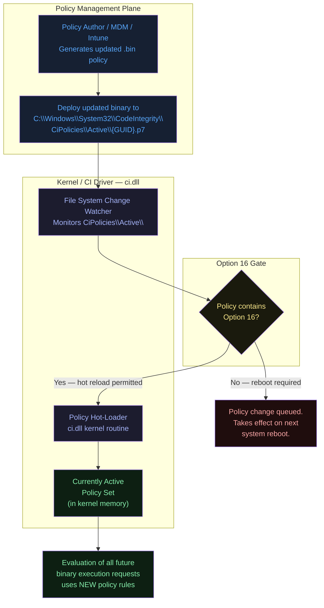
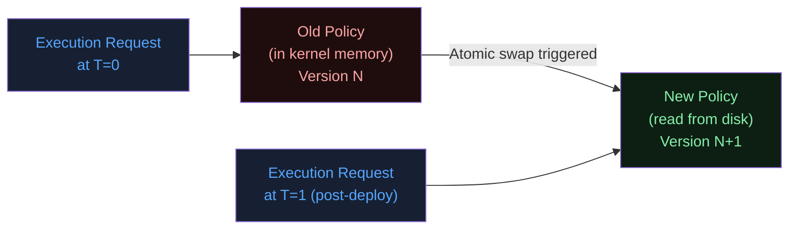
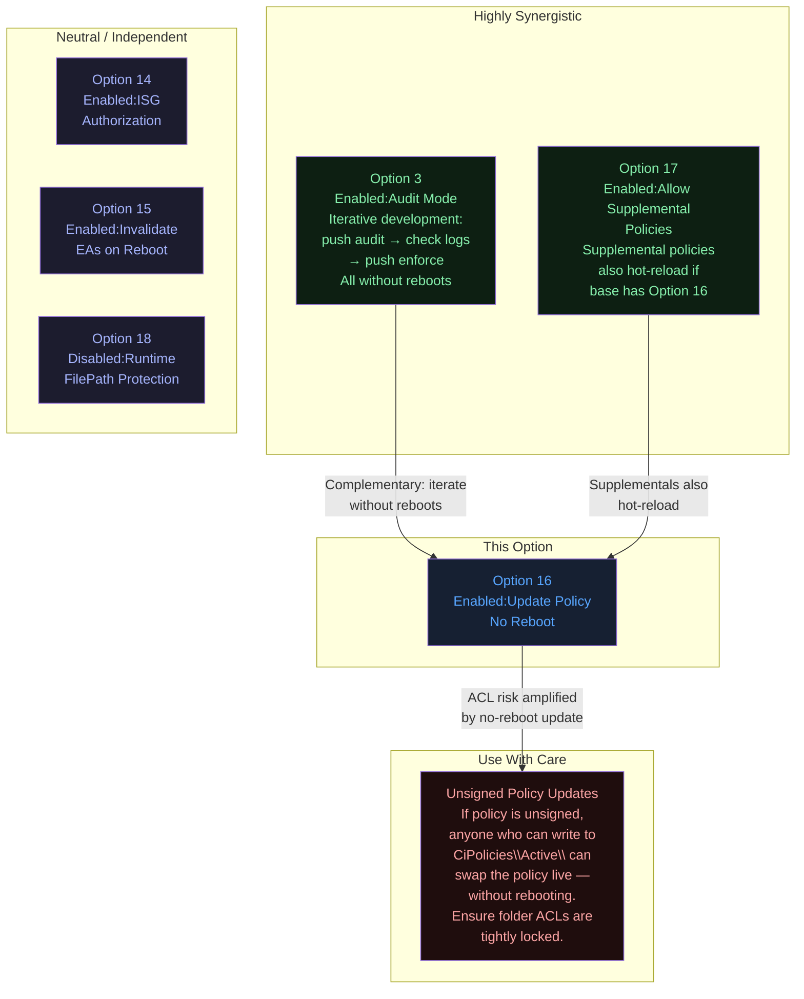
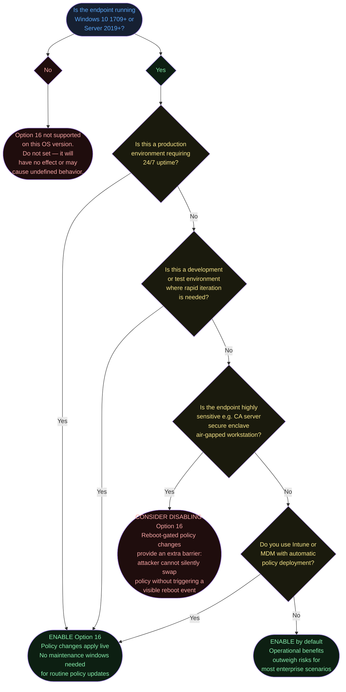
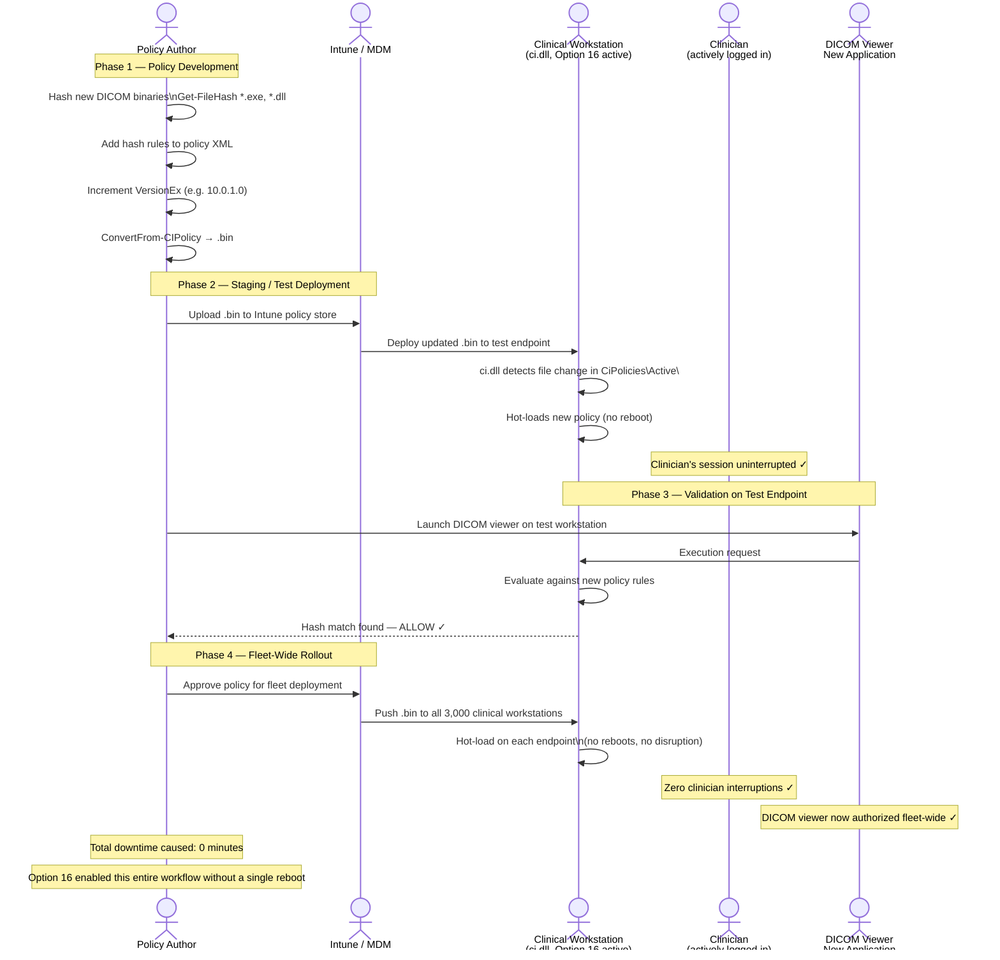

# Option 16 — Enabled:Update Policy No Reboot

**Author:** Anubhav Gain
**Category:** Endpoint Security
**Rule Option ID:** 16
**Rule String:** `Enabled:Update Policy No Reboot`
**Valid for Supplemental Policies:** No
**Minimum OS Version:** Windows 10 version 1709 / Windows Server 2019

---

## Table of Contents

1. [What It Does](#what-it-does)
2. [Why It Exists](#why-it-exists)
3. [Visual Anatomy — Policy Evaluation Stack](#visual-anatomy--policy-evaluation-stack)
4. [How to Set It (PowerShell)](#how-to-set-it-powershell)
5. [XML Representation](#xml-representation)
6. [Interaction with Other Options](#interaction-with-other-options)
7. [When to Enable vs Disable](#when-to-enable-vs-disable)
8. [Real-World Scenario / End-to-End Walkthrough](#real-world-scenario--end-to-end-walkthrough)
9. [What Happens If You Get It Wrong](#what-happens-if-you-get-it-wrong)
10. [Valid for Supplemental Policies?](#valid-for-supplemental-policies)
11. [OS Version Requirements](#os-version-requirements)
12. [Summary Table](#summary-table)

---

## What It Does

**Option 16 — Enabled:Update Policy No Reboot** allows an App Control for Business policy to be **updated and immediately activated on a running system without requiring a reboot**. Without this option, any change to the policy binary — whether adding new signer rules, updating hash allow-lists, switching between audit and enforce mode, or modifying any other attribute — takes effect only after the next full system restart. With Option 16 present in the policy, the Windows Code Integrity (`ci.dll`) subsystem monitors for changes to the deployed policy binary and hot-loads the updated policy into the running kernel, making the change effective within seconds of the new binary being placed in the active policies folder. The endpoint continues running throughout the update; users never see a reboot prompt, and services are never interrupted simply for a policy change.

---

## Why It Exists

Enterprise endpoint management at scale creates a fundamental tension between **security agility** and **operational continuity**:

- **Security agility:** Threat actors operate on timescales of minutes to hours. When a new malware family is discovered, security teams need to push updated block rules and allowlist changes across thousands of endpoints immediately — not at the next scheduled maintenance window.
- **Operational continuity:** Forcing reboots for every policy change is unacceptable in environments with 24/7 operations — hospital workstations, trading floor terminals, manufacturing control systems, call centers. A reboot during business hours can mean patient record unavailability, missed trades, or production line stoppage.
- **Iterative policy development:** Policy authors iterating through audit → enforce cycles, or tuning allowlists based on CI events, would face enormous friction if every policy tweak required a maintenance window reboot.
- **Emergency response:** When a critical vulnerability or active threat is detected, security teams cannot wait hours for coordinated reboots across a fleet. Immediate policy updates that block the attack vector without disruption are essential.

Option 16 was introduced in Windows 10 version 1709 specifically to resolve this tension, enabling policy-as-code workflows where CI/CD pipelines can push policy updates continuously without operational disruption.

---

## Visual Anatomy — Policy Evaluation Stack



### Deep Dive: How the Hot-Reload Works

When the policy binary changes on disk and Option 16 is active, `ci.dll` detects the modification via kernel-level file system notification. It reads the new policy, validates its signature and integrity (if the policy is signed), and atomically swaps the in-memory policy object. This is an **atomic swap** — there is no window where some execution requests use the old policy and others use the new one. The transition happens at the next evaluation boundary.



---

## How to Set It (PowerShell)

### Enable Option 16 (Add the Rule)

```powershell
# Define the path to your base policy XML
$PolicyPath = "C:\Policies\MyBasePolicy.xml"

# Enable no-reboot policy updates
Set-RuleOption -FilePath $PolicyPath -Option 16

# Verify it was added
[xml]$Policy = Get-Content $PolicyPath
$Policy.SiPolicy.Rules.Rule | Select-Object -ExpandProperty Option
```

### Disable Option 16 (Remove the Rule)

```powershell
# Remove Option 16 — future updates will require a reboot to take effect
Remove-RuleOption -FilePath $PolicyPath -Option 16
```

### Complete Workflow: Create, Enable Option 16, Deploy, Then Update Without Reboot

```powershell
#--------------------------------------------------------------------
# INITIAL POLICY CREATION
#--------------------------------------------------------------------
$PolicyPath  = "C:\Policies\LiveUpdatePolicy.xml"
$BinaryPath  = "C:\Policies\LiveUpdatePolicy.bin"
$ActivePath  = "C:\Windows\System32\CodeIntegrity\CiPolicies\Active\"

# Start from a known-good base template
Copy-Item -Path "C:\Windows\schemas\CodeIntegrity\ExamplePolicies\DefaultWindows_Enforced.xml" `
          -Destination $PolicyPath -Force

# Assign unique GUID
$PolicyId = [System.Guid]::NewGuid().ToString()
Set-CIPolicyIdInfo -FilePath $PolicyPath `
                   -PolicyName "LiveUpdate-BasePolicy" `
                   -PolicyId $PolicyId

# Enable no-reboot updates (Option 16)
Set-RuleOption -FilePath $PolicyPath -Option 16

# Start in audit mode for initial deployment (Option 3)
Set-RuleOption -FilePath $PolicyPath -Option 3

# Compile and deploy
ConvertFrom-CIPolicy -XmlFilePath $PolicyPath -BinaryFilePath $BinaryPath
$DeployedName = "{$PolicyId}.p7"
Copy-Item -Path $BinaryPath -Destination "$ActivePath$DeployedName" -Force

Write-Host "Initial policy deployed. No reboot required because Option 16 is set."

#--------------------------------------------------------------------
# LATER: UPDATE THE POLICY (e.g., switch from Audit to Enforce)
# WITHOUT REBOOTING
#--------------------------------------------------------------------
# Remove audit mode
Remove-RuleOption -FilePath $PolicyPath -Option 3

# Recompile the updated binary
ConvertFrom-CIPolicy -XmlFilePath $PolicyPath -BinaryFilePath $BinaryPath

# Drop the updated binary in the active folder — takes effect immediately
Copy-Item -Path $BinaryPath -Destination "$ActivePath$DeployedName" -Force

Write-Host "Policy updated to enforce mode. No reboot required. Takes effect immediately."
```

### Check Whether Option 16 Is Active on a Running System

```powershell
# List all active CI policies and check for Option 16
$ActivePolicies = "C:\Windows\System32\CodeIntegrity\CiPolicies\Active\"
Get-ChildItem -Path $ActivePolicies -Filter "*.p7" | ForEach-Object {
    Write-Host "Active policy binary: $($_.Name)"
}

# To decode a binary policy back to XML (for inspection):
# There is no built-in cmdlet for this; use CiTool.exe (Windows 11) or
# the PowerShell module from the MSFT App Control team
# CiTool.exe --list-policies  (Windows 11 22H2+)
```

### Using CiTool.exe (Windows 11 22H2+ and newer)

```powershell
# List all currently loaded policies with their attributes
& "C:\Windows\System32\CiTool.exe" --list-policies

# Update a policy using CiTool (respects Option 16 for live reload)
& "C:\Windows\System32\CiTool.exe" --update-policy "C:\Policies\LiveUpdatePolicy.bin"
```

---

## XML Representation

```xml
<?xml version="1.0" encoding="utf-8"?>
<SiPolicy xmlns="urn:schemas-microsoft-com:sipolicy" PolicyType="Base Policy">

  <VersionEx>10.0.0.0</VersionEx>
  <PlatformID>{2E07F7E4-194C-4D20-B96C-1AEF9CF5A3CA}</PlatformID>
  <Rules>

    <!-- Option 3: Audit Mode — useful during iterative policy development -->
    <Rule>
      <Option>Enabled:Audit Mode</Option>
    </Rule>

    <!-- Option 16: Update Policy No Reboot -->
    <!-- When present: policy binary changes in CiPolicies\Active\ are hot-loaded -->
    <!-- When absent: policy changes queue until next system reboot -->
    <Rule>
      <Option>Enabled:Update Policy No Reboot</Option>
    </Rule>

  </Rules>

  <!-- FileRules, Signers, etc. -->

</SiPolicy>
```

### Version Tracking in XML

When deploying live updates, always increment the `VersionEx` to distinguish policy generations:

```xml
<!-- Version 1: Initial audit deployment -->
<VersionEx>10.0.0.0</VersionEx>

<!-- Version 2: Switched to enforce mode — no reboot required with Option 16 -->
<VersionEx>10.0.0.1</VersionEx>

<!-- Version 3: Added new signer rule — no reboot required -->
<VersionEx>10.0.0.2</VersionEx>
```

Version is represented as four 16-bit integers. Convention: `Major.Minor.Build.Revision`. Increment the revision for minor updates, build for significant rule changes, minor for mode changes, major for structural redesigns.

---

## Interaction with Other Options



### Option Compatibility Matrix

| Option | Relationship | Notes |
|--------|-------------|-------|
| **3 — Audit Mode** | Highly synergistic | Enables complete audit→enforce workflow without reboots. The canonical development cycle. |
| **17 — Allow Supplemental Policies** | Synergistic | Supplemental policy additions/removals also take effect without reboot when the base carries Option 16. |
| **14 — ISG Authorization** | Neutral | No direct interaction. ISG EA lifecycle is independent of policy update mechanics. |
| **15 — Invalidate EAs on Reboot** | Neutral | EA invalidation is triggered by reboot, not policy update. These options address separate lifecycles. |
| **18 — Disable Runtime FilePath Protection** | Neutral | Orthogonal. Addresses FilePath rule semantics, not policy update delivery. |

---

## When to Enable vs Disable



---

## Real-World Scenario / End-to-End Walkthrough

**Scenario:** A hospital's IT security team is managing App Control policies across 3,000 workstations in an active clinical environment. A new medical imaging software package (DICOM viewer) needs to be deployed and authorized. The team must update the App Control allowlist, test it, and push it to all workstations — without triggering reboots that would interrupt active patient care sessions.



### Comparison: With vs Without Option 16

| Step | Without Option 16 | With Option 16 |
|------|-------------------|----------------|
| Policy update generated | Same | Same |
| Deployed to endpoint | Binary placed in active folder | Same |
| Policy takes effect | **Next reboot** (scheduled maintenance window, ~48hr delay in hospitals) | **Immediately** (seconds after binary lands) |
| User impact | Mandatory reboot or long wait | None |
| DICOM available | Only after next reboot window | Within 60 seconds of MDM push |

---

## What Happens If You Get It Wrong

### Scenario A: Option 16 absent — you expect live updates but get stale policy

**Symptom:** You deploy a new policy binary via Intune or script. The updated rules don't appear to take effect. Newly allowed apps still block, or newly blocked apps still run.

**Root cause:** Without Option 16, `ci.dll` does not hot-reload. The on-disk binary is the new version, but the in-kernel policy object is still the old one. The new policy will only be active after reboot.

**Detection:** Check running processes or attempt the application. Cross-reference the deployed binary timestamp with the expected effective date.

**Resolution:** Either add Option 16 to the policy and redeploy, or schedule reboots as part of your policy change management process.

### Scenario B: Option 16 on OS version older than Windows 10 1709

**Symptom:** Policy deploys, but live updates never take effect. Behavior identical to Option 16 being absent.

**Root cause:** The no-reboot policy update mechanism was not introduced until Windows 10 version 1709 (Fall Creators Update). On older versions, `ci.dll` does not implement the hot-reload path.

**Resolution:** Upgrade the OS to a supported version. There is no workaround.

### Scenario C: ACL misconfiguration on CiPolicies\Active\ folder

**Risk amplified by Option 16:** If an attacker or rogue process can write to `C:\Windows\System32\CodeIntegrity\CiPolicies\Active\`, they can silently swap the policy binary and it will take effect immediately (with Option 16) rather than requiring a reboot. Without Option 16, a malicious policy swap would at least require a reboot to activate, which might trigger monitoring alerts or require physical/remote access to initiate.

**Mitigation:**
- The `CiPolicies\Active\` folder should be writable only by `SYSTEM` and `Administrators`
- Audit writes to this folder via Windows Security auditing (Object Access events)
- Use signed policies to ensure unsigned policy binaries are rejected even if placed in the correct folder
- Monitor for unexpected policy version changes via WMI/Event Log (Code Integrity Event ID 3099 — policy loaded)

### Scenario D: Policy downgrade via live update

**Risk:** An older, weaker policy binary (e.g., a policy with fewer restrictions, or one in audit mode) can be hot-loaded onto a running system with Option 16 active. Without a reboot requirement, there is no natural "checkpoint" where an administrator would notice the change.

**Mitigation:** Use signed policies with version control enforcement. Higher version numbers cannot be replaced by lower versions if the policy is configured to prevent rollback.

---

## Valid for Supplemental Policies?

**No.** Option 16 is only valid in **base policies**.

The no-reboot update mechanism is a base-policy-level capability that controls how the Code Integrity driver manages the policy loading lifecycle. Supplemental policies are loaded by the CI driver as extensions of the base policy — they participate in the same hot-reload mechanism automatically when the base policy has Option 16 enabled.

Put differently: the **base policy with Option 16** unlocks no-reboot updates for the **entire policy set**, including all associated supplemental policies. Setting Option 16 in a supplemental policy is redundant at best and invalid at worst.

**Practical implication:** If you want supplemental policy additions and removals to take effect without reboots, ensure Option 16 is set in the base policy. The supplemental policies themselves require no special configuration for this behavior.

---

## OS Version Requirements

| Operating System | Minimum Version Required | Notes |
|-----------------|--------------------------|-------|
| Windows 10 | **1709 (Fall Creators Update)** | Minimum required; earlier builds ignore Option 16 |
| Windows 11 | All versions | Fully supported from day one |
| Windows Server | **2019** | Earlier Server versions (2016) do not support hot-reload |
| Windows Server Core | 2019+ | Supported; no GUI required for policy hot-reload |
| Windows IoT | 1709 equivalent | Verify your IoT build version |

### Checking OS Version in PowerShell

```powershell
# Check Windows build to confirm Option 16 support
$OsVersion = [System.Environment]::OSVersion.Version
$Build = (Get-ItemProperty "HKLM:\SOFTWARE\Microsoft\Windows NT\CurrentVersion").CurrentBuildNumber

Write-Host "Build: $Build"
if ([int]$Build -ge 16299) {  # 16299 = Windows 10 1709
    Write-Host "Option 16 supported on this OS build."
} else {
    Write-Host "Option 16 NOT supported. Minimum build is 16299 (Windows 10 1709)."
}
```

---

## Summary Table

| Attribute | Value |
|-----------|-------|
| **Option Number** | 16 |
| **Full Option String** | `Enabled:Update Policy No Reboot` |
| **Rule Type** | Enabled (presence = active) |
| **Dependencies** | None (self-contained) |
| **Effect** | Policy binary changes hot-loaded by ci.dll without system reboot |
| **Security Benefit** | Enables rapid policy response to threats without waiting for reboots |
| **Security Risk (if enabled)** | ACL misconfiguration on CiPolicies\Active\ allows silent live policy swaps |
| **Operational Risk (if disabled)** | Policy updates require reboots — creates lag between rule change and enforcement |
| **Valid in Base Policy** | Yes |
| **Valid in Supplemental Policy** | **No** |
| **Minimum OS — Windows 10** | **Version 1709 (Build 16299)** |
| **Minimum OS — Windows Server** | **2019** |
| **PowerShell Enable** | `Set-RuleOption -FilePath $PolicyPath -Option 16` |
| **PowerShell Disable** | `Remove-RuleOption -FilePath $PolicyPath -Option 16` |
| **XML Tag** | `<Option>Enabled:Update Policy No Reboot</Option>` |
