# Option 17 — Enabled:Allow Supplemental Policies

**Author:** Anubhav Gain
**Category:** Endpoint Security
**Rule Option ID:** 17
**Rule String:** `Enabled:Allow Supplemental Policies`
**Valid for Supplemental Policies:** No
**Minimum OS Version:** Windows 10 version 1903 / Windows Server 2022

---

## Table of Contents

1. [What It Does](#what-it-does)
2. [Why It Exists](#why-it-exists)
3. [The Base / Supplemental Policy Architecture — Deep Dive](#the-base--supplemental-policy-architecture--deep-dive)
4. [Visual Anatomy — Policy Evaluation Stack](#visual-anatomy--policy-evaluation-stack)
5. [How to Set It (PowerShell)](#how-to-set-it-powershell)
6. [XML Representation](#xml-representation)
7. [PolicyID Linking — How the Kernel Connects Base to Supplemental](#policyid-linking--how-the-kernel-connects-base-to-supplemental)
8. [How ci.dll Loads and Evaluates Both Policies](#how-cidll-loads-and-evaluates-both-policies)
9. [Interaction with Other Options](#interaction-with-other-options)
10. [When to Enable vs Disable](#when-to-enable-vs-disable)
11. [Real-World Scenario / End-to-End Walkthrough](#real-world-scenario--end-to-end-walkthrough)
12. [What Happens If You Get It Wrong](#what-happens-if-you-get-it-wrong)
13. [Valid for Supplemental Policies?](#valid-for-supplemental-policies)
14. [OS Version Requirements](#os-version-requirements)
15. [Summary Table](#summary-table)

---

## What It Does

**Option 17 — Enabled:Allow Supplemental Policies** activates the **multi-policy architecture** in App Control for Business. When this option is present in a base policy, the Windows Code Integrity kernel driver (`ci.dll`) will accept additional **supplemental policy** files that reference this base policy and **expand its allow-list**. Supplemental policies add new rules on top of the base — they can authorize additional signers, hashes, file paths, or entire application groups — without modifying the original base policy itself. A single base policy can be supplemented by **multiple independent supplemental policies simultaneously**, each layered additively on top. The base policy continues to define the security floor: its deny rules, enforcement mode, and core allow-list cannot be overridden by supplementals. Supplementals can only add permissions — they cannot remove restrictions or switch the policy from enforce to audit mode.

---

## Why It Exists

The fundamental challenge of managing App Control in diverse enterprises is the **tension between centralized security control and distributed operational needs**:

### The Problem Without Supplemental Policies

Before supplemental policies existed (Windows 10 versions prior to 1903), every organization had a binary choice:

1. **Centralized monolithic policy:** The security team manages a single policy file for all endpoints. Every new application addition requires a policy change, review, re-signing (if signed), and redeployment across the entire fleet. This creates a bottleneck: business units, developers, and operations teams must all queue through a central change process just to run new software.

2. **Per-device or per-group fragmented policies:** Different organizational units maintain their own policies. Centralized security controls are impossible to enforce uniformly. Tracking and auditing becomes a nightmare.

### What Supplemental Policies Enable

Option 17 enables a **hub-and-spoke governance model**:

```
Central Security Team → Base Policy → Security Floor (cannot be weakened)
       ↕ delegates customization authority to ↕
Business Unit A → Supplemental Policy A → Adds their approved apps
Business Unit B → Supplemental Policy B → Adds their approved apps
IT Operations   → Supplemental Policy C → Adds admin tools
Development Team → Supplemental Policy D → Adds dev toolchain
```

Each spoke can add to the allowlist without touching the security floor. The central team retains full control of what cannot be overridden (the base), while operational agility is distributed to those who need it.

### Additional Benefits

- **Staged rollouts:** Test new applications with a supplemental before promoting rules to the base policy
- **Temporary authorization windows:** Deploy a supplemental for a limited maintenance period, then remove it — no base policy change required
- **Organizational mergers:** Two merged companies can run their respective supplemental policies alongside a common corporate base policy
- **Separation of concerns:** Security team owns the base; IT operations owns supplementals for admin tools; application teams own supplementals for their apps
- **Blast-radius reduction:** A mistake in a supplemental policy affects only that supplemental's scope — it cannot corrupt the base policy

---

## The Base / Supplemental Policy Architecture — Deep Dive

### Conceptual Model

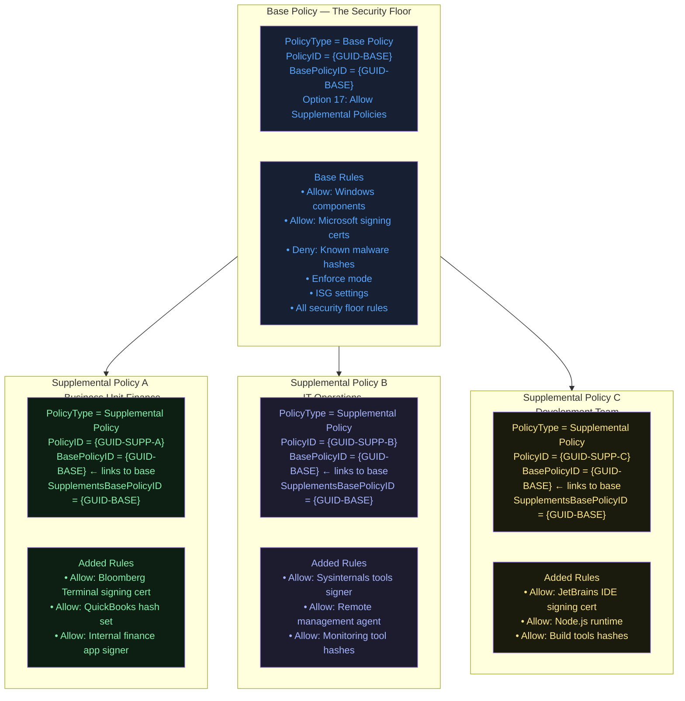

### What Supplemental Policies Can and Cannot Do

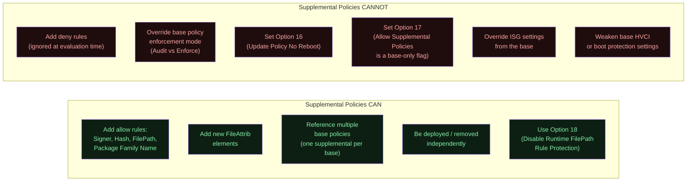

---

## Visual Anatomy — Policy Evaluation Stack

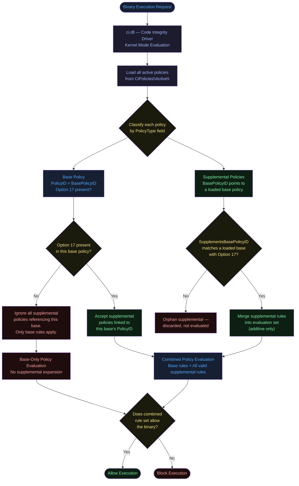

---

## How to Set It (PowerShell)

### Step 1: Enable Option 17 in the Base Policy

```powershell
$BasePolicyPath = "C:\Policies\CorporateBase.xml"

# Enable supplemental policy support
Set-RuleOption -FilePath $BasePolicyPath -Option 17

# Verify
[xml]$Policy = Get-Content $BasePolicyPath
$Policy.SiPolicy.Rules.Rule | Select-Object -ExpandProperty Option
```

### Step 2: Create a Supplemental Policy

```powershell
$SupplementalPath = "C:\Policies\FinanceDept-Supplemental.xml"

# Create a new supplemental policy (starts from scratch or from another policy)
# Method 1: Create a minimal supplemental from scratch
New-CIPolicy -FilePath $SupplementalPath `
             -ScanPath "C:\Program Files\Bloomberg\" `
             -Level Publisher `
             -Fallback Hash

# Method 2: Create supplemental from existing policy (extract rules from an existing XML)
# Then trim it down to only the rules you want to add

# Set the policy as Supplemental type and link to base
$BasePolicyId = ([xml](Get-Content $BasePolicyPath)).SiPolicy.PolicyID
Set-CIPolicyIdInfo -FilePath $SupplementalPath `
                   -SupplementsBasePolicyID $BasePolicyId `
                   -PolicyName "Finance-Department-Supplemental"
```

### Step 3: Configure Supplemental Policy Options

```powershell
# Supplemental policies must NOT have Option 17 set
# Remove it if accidentally present
Remove-RuleOption -FilePath $SupplementalPath -Option 17

# Option 18 (Disable Runtime FilePath Protection) is valid in supplementals
# Set it if you have FilePath rules that target non-admin-exclusive paths
# Set-RuleOption -FilePath $SupplementalPath -Option 18

# Supplementals should NOT have Option 3 (Audit Mode) — it's ignored
# Remove-RuleOption -FilePath $SupplementalPath -Option 3
```

### Step 4: Compile and Deploy Both Policies

```powershell
$BaseBin    = "C:\Policies\CorporateBase.bin"
$SuppBin    = "C:\Policies\FinanceDept-Supplemental.bin"
$ActiveDir  = "C:\Windows\System32\CodeIntegrity\CiPolicies\Active\"

# Get the base policy ID for file naming
$BasePolicyId = ([xml](Get-Content $BasePolicyPath)).SiPolicy.PolicyID

# Compile base policy
ConvertFrom-CIPolicy -XmlFilePath $BasePolicyPath -BinaryFilePath $BaseBin

# Compile supplemental policy
ConvertFrom-CIPolicy -XmlFilePath $SupplementalPath -BinaryFilePath $SuppBin

# Deploy base policy
Copy-Item -Path $BaseBin -Destination "$ActiveDir{$BasePolicyId}.p7" -Force

# Deploy supplemental (use its own PolicyID for the filename)
$SuppPolicyId = ([xml](Get-Content $SupplementalPath)).SiPolicy.PolicyID
Copy-Item -Path $SuppBin -Destination "$ActiveDir{$SuppPolicyId}.p7" -Force

Write-Host "Base and supplemental deployed."
```

### Removing a Supplemental Policy

```powershell
# To remove a supplemental policy, simply delete its binary from the active folder
$SuppPolicyId = "YOUR-SUPP-POLICY-GUID-HERE"
Remove-Item -Path "C:\Windows\System32\CodeIntegrity\CiPolicies\Active\{$SuppPolicyId}.p7" -Force

# With CiTool (Windows 11 22H2+):
& CiTool.exe --remove-policy "{$SuppPolicyId}"
```

### Inspecting Policy Relationships

```powershell
# List all active policies and their types
& "C:\Windows\System32\CiTool.exe" --list-policies

# Or parse the XML directly
$AllPolicies = Get-ChildItem "C:\Windows\System32\CodeIntegrity\CiPolicies\Active\" -Filter "*.p7"
foreach ($PolicyFile in $AllPolicies) {
    # Note: .p7 are binary files; you need your XML counterparts for inspection
    Write-Host "Active: $($PolicyFile.Name)"
}

# Inspect base policy ID from XML
$BasePolicyId = ([xml](Get-Content $BasePolicyPath)).SiPolicy.PolicyID
Write-Host "Base PolicyID: $BasePolicyId"

# Inspect supplemental's link to base
[xml]$Supp = Get-Content $SupplementalPath
Write-Host "Supplemental PolicyID: $($Supp.SiPolicy.PolicyID)"
Write-Host "Supplemental links to base: $($Supp.SiPolicy.BasePolicyID)"
```

---

## XML Representation

### Base Policy (must contain Option 17)

```xml
<?xml version="1.0" encoding="utf-8"?>
<SiPolicy xmlns="urn:schemas-microsoft-com:sipolicy" PolicyType="Base Policy">

  <VersionEx>10.0.0.0</VersionEx>
  <PlatformID>{2E07F7E4-194C-4D20-B96C-1AEF9CF5A3CA}</PlatformID>

  <!--
    PolicyID and BasePolicyID are THE SAME for a base policy.
    This is how ci.dll identifies it as a base rather than a supplemental.
  -->
  <PolicyID>{A1B2C3D4-E5F6-7890-ABCD-EF1234567890}</PolicyID>
  <BasePolicyID>{A1B2C3D4-E5F6-7890-ABCD-EF1234567890}</BasePolicyID>

  <Rules>

    <!-- Option 16: Live policy updates (recommended alongside Option 17) -->
    <Rule>
      <Option>Enabled:Update Policy No Reboot</Option>
    </Rule>

    <!-- Option 17: THIS IS THE KEY FLAG -->
    <!-- Its presence tells ci.dll: "I accept supplemental policies that reference my PolicyID" -->
    <!-- Without this, ALL supplemental policies linked to this base are ignored/rejected -->
    <Rule>
      <Option>Enabled:Allow Supplemental Policies</Option>
    </Rule>

  </Rules>

  <!-- Base FileRules — the security floor -->
  <FileRules>
    <!-- ... Windows component allow rules ... -->
    <!-- ... Microsoft signing cert allow rules ... -->
    <!-- ... Known malware deny rules ... -->
  </FileRules>

  <!-- Base Signers, CiSigners, etc. -->

</SiPolicy>
```

### Supplemental Policy (references the base via BasePolicyID)

```xml
<?xml version="1.0" encoding="utf-8"?>
<!--
  PolicyType="Supplemental Policy" tells ci.dll this is an extension, not a standalone base.
  The BasePolicyID MUST match the PolicyID of the base policy that has Option 17 enabled.
  The SupplementsBasePolicyID is an informational attribute that documents the relationship.
-->
<SiPolicy xmlns="urn:schemas-microsoft-com:sipolicy" PolicyType="Supplemental Policy">

  <VersionEx>10.0.0.0</VersionEx>

  <!--
    PolicyID: Unique GUID for THIS supplemental policy.
    Used as the filename: {THIS-GUID}.p7 in CiPolicies\Active\
  -->
  <PolicyID>{F9E8D7C6-B5A4-3210-FEDC-BA9876543210}</PolicyID>

  <!--
    BasePolicyID: MUST equal the PolicyID of the base policy that has Option 17.
    This is the cryptographic link that ties this supplemental to its base.
    ci.dll validates this link at load time.
  -->
  <BasePolicyID>{A1B2C3D4-E5F6-7890-ABCD-EF1234567890}</BasePolicyID>

  <Rules>
    <!--
      Supplemental policies can use Option 18 (Disable Runtime FilePath Rule Protection).
      They CANNOT use Options 3 (Audit Mode), 16 (No Reboot Update), or 17 (Allow Supplemental).
      Those are base-policy-only options.
    -->

    <!-- Optionally: Option 18 if FilePath rules need to cover non-admin-writable paths -->
    <!-- <Rule><Option>Disabled:Runtime FilePath Rule Protection</Option></Rule> -->
  </Rules>

  <!--
    Supplemental FileRules — ADDITIVE ONLY.
    These expand the allow-list of the base. They cannot add deny rules
    that override the base, and they cannot remove base policy rules.
  -->
  <FileRules>
    <!-- Allow Bloomberg Terminal by publisher certificate -->
    <Allow ID="ID_ALLOW_BLOOMBERG" FriendlyName="Bloomberg Terminal - Publisher" FileName="*">
      <!-- Signer reference ... -->
    </Allow>

    <!-- Allow QuickBooks by hash -->
    <Allow ID="ID_ALLOW_QB_HASH" FriendlyName="QuickBooks 2024" Hash="..." FileName="QBW32.exe" />
  </FileRules>

  <!-- Supplemental signers for the added allow rules -->
  <Signers>
    <!-- ... -->
  </Signers>

</SiPolicy>
```

---

## PolicyID Linking — How the Kernel Connects Base to Supplemental

This is the most critical technical detail for understanding why supplemental policies work (or fail).

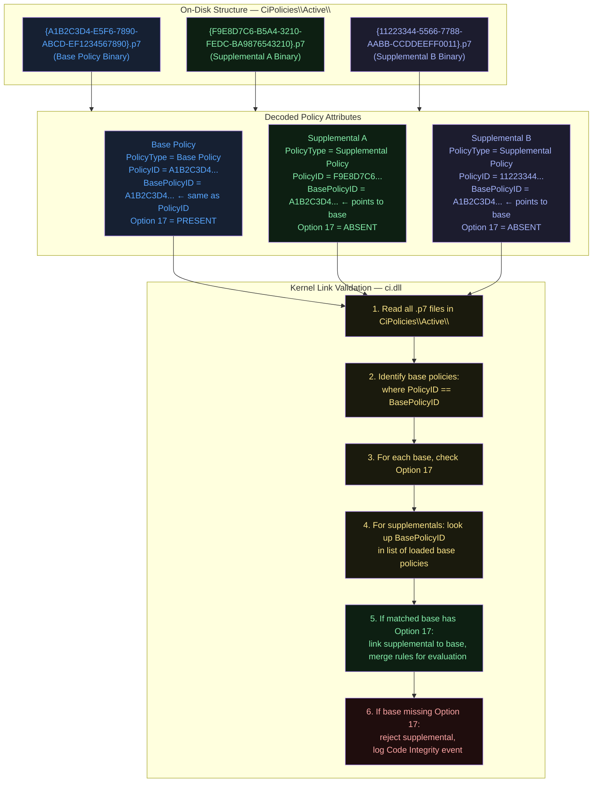

### The GUID Chain — Why It Cannot Be Forged (Signed Policies)

When using **signed policies**, the GUID linkage is protected by cryptographic signatures:

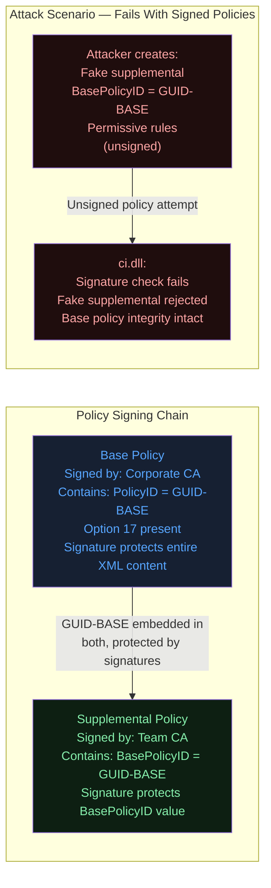

**Critical Security Note:** If the base policy is **unsigned**, any party who can write to `CiPolicies\Active\` can create a fake supplemental policy with a matching `BasePolicyID` and load arbitrary allow rules. Always use signed policies in production environments where Option 17 is active.

---

## How ci.dll Loads and Evaluates Both Policies

### Boot-Time Policy Loading

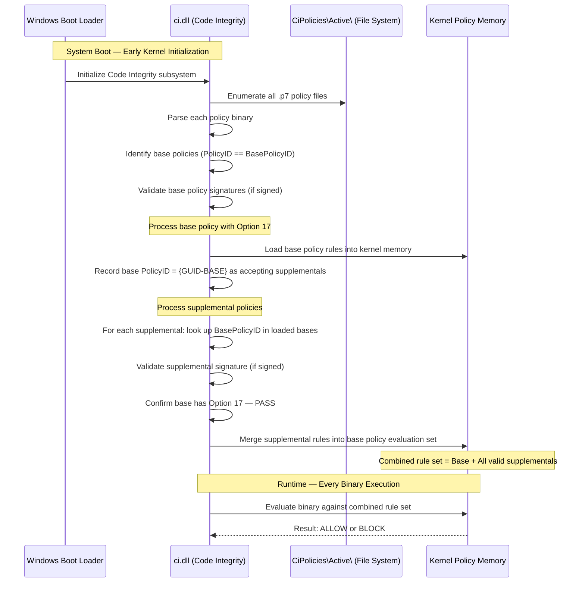

### Rule Merging Logic at Evaluation Time

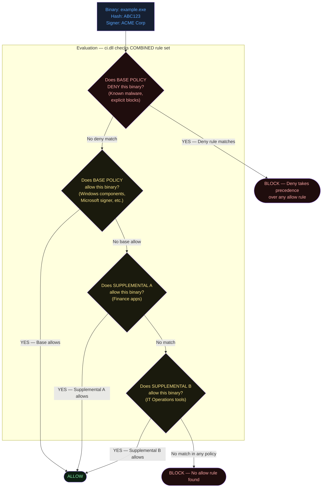

**Key rule: Base policy DENY rules always win.** No supplemental can override a deny rule in the base. This is the guarantee that maintains the security floor.

---

## Interaction with Other Options

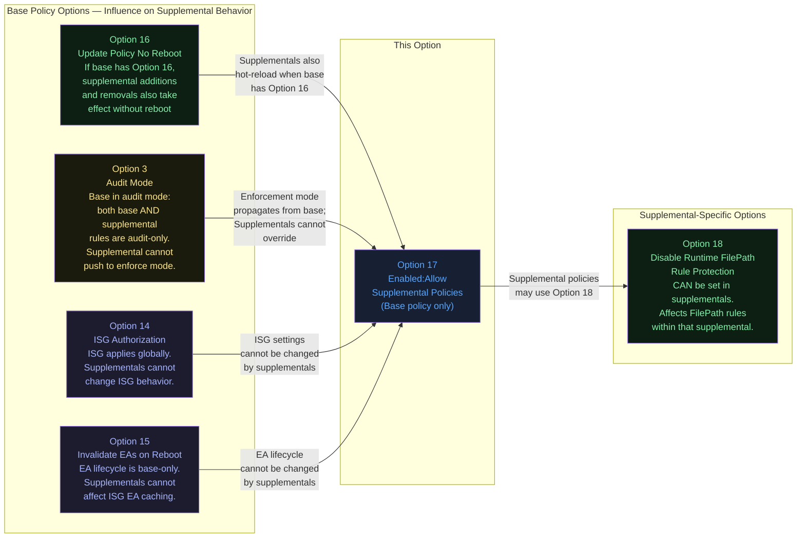

### Option Compatibility Matrix

| Option | Relationship | Notes |
|--------|-------------|-------|
| **3 — Audit Mode** | Inherited by supplementals | If the base is in audit mode, supplemental rules are also audit-only. Supplementals cannot switch to enforce mode independently. |
| **16 — Update Policy No Reboot** | Enables hot-reload for supplementals | When the base has Option 16, deploying/removing supplementals also takes effect without reboot. |
| **14 — ISG Authorization** | Base-only, cannot be changed by supplementals | Supplementals cannot enable or disable ISG. |
| **15 — Invalidate EAs on Reboot** | Base-only, cannot be changed by supplementals | EA lifecycle is a base-policy concern. |
| **18 — Disable Runtime FilePath Protection** | Valid in supplementals | The only option that can appear in supplemental policies. |

---

## When to Enable vs Disable

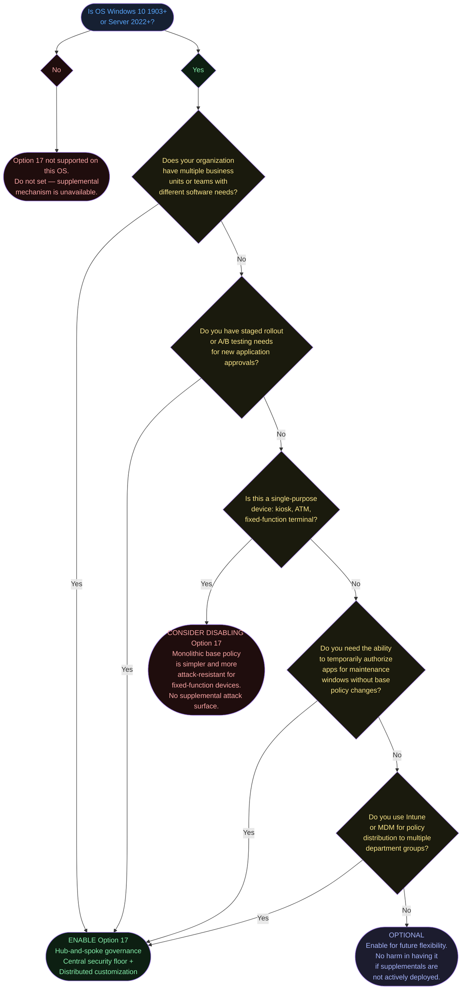

---

## Real-World Scenario / End-to-End Walkthrough

**Scenario:** A financial services firm is deploying App Control across 5,000 workstations. The central security team owns the base policy. The Finance department needs Bloomberg Terminal, the IT Operations team needs Sysinternals tools, and the Development team needs their IDE and build tools — all without the security team having to touch the base policy for every new application request.

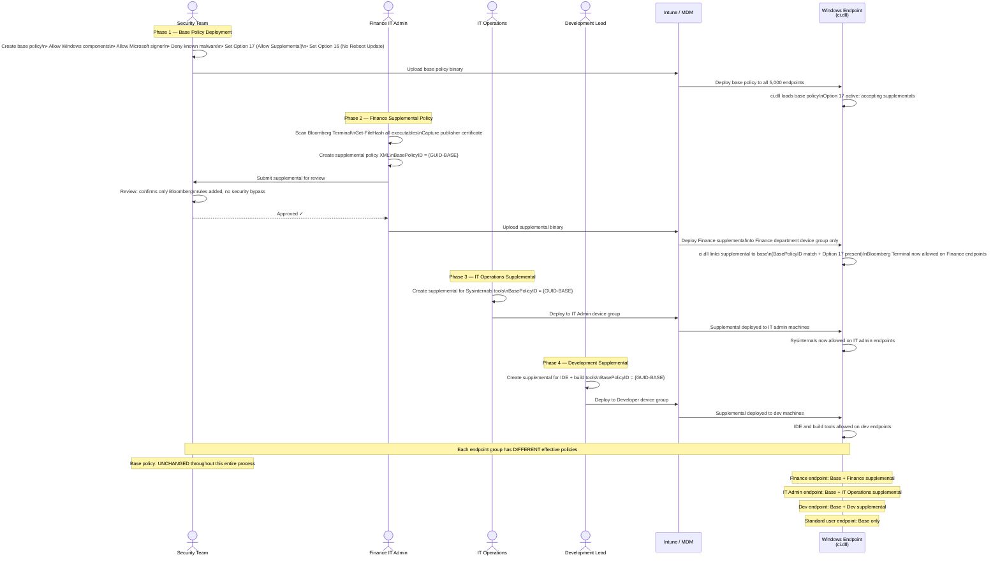

### Governance Structure Achieved

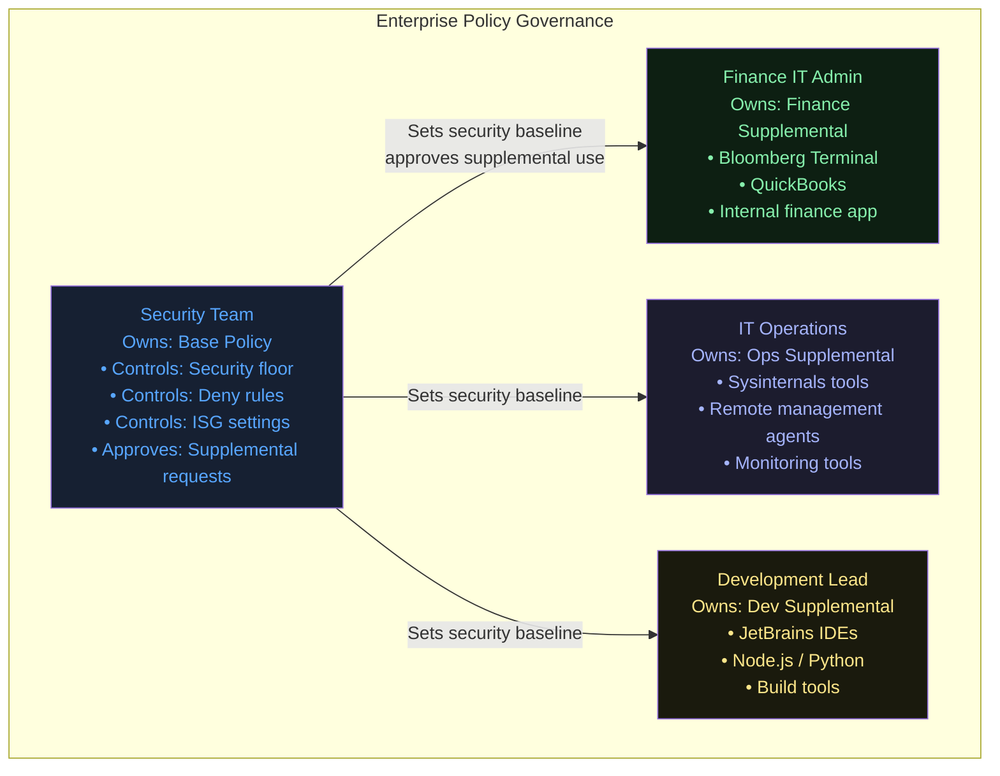

---

## What Happens If You Get It Wrong

### Scenario A: Option 17 absent in base — supplemental policies silently rejected

**Symptom:** You deploy a supplemental policy with correct `BasePolicyID` linking. Applications covered by the supplemental still block. Event Viewer shows Code Integrity events indicating the binary is not authorized.

**Root cause:** Without Option 17 in the base, `ci.dll` will not accept any supplemental policies, regardless of their `BasePolicyID`. The supplemental binary sits in `CiPolicies\Active\` but is never linked or evaluated.

**Resolution:** Add Option 17 to the base policy and redeploy. If Option 16 is also set, the change takes effect without a reboot.

**Detection:**
```powershell
# Check if Option 17 is in the base policy XML
[xml]$Policy = Get-Content $BasePolicyPath
$hasOpt17 = $Policy.SiPolicy.Rules.Rule | Where-Object { $_.Option -eq "Enabled:Allow Supplemental Policies" }
if ($hasOpt17) { "Option 17 present" } else { "Option 17 MISSING — supplementals will not load" }
```

### Scenario B: Wrong BasePolicyID in supplemental

**Symptom:** Identical to Scenario A. Supplemental deployed but rules not enforced.

**Root cause:** The `BasePolicyID` in the supplemental XML does not match the `PolicyID` of any loaded base policy.

**Common cause:** Copy-paste error when creating supplemental XML; using the base policy's `BasePolicyID` field (which equals `PolicyID` in a base) from a different policy; GUID format mismatch (e.g., missing braces).

**Resolution:** Verify the GUIDs match exactly:
```powershell
$BaseGuid = ([xml](Get-Content $BasePolicyPath)).SiPolicy.PolicyID
$SuppBaseRef = ([xml](Get-Content $SuppPath)).SiPolicy.BasePolicyID
if ($BaseGuid -eq $SuppBaseRef) {
    "GUIDs match ✓"
} else {
    "MISMATCH: Base='$BaseGuid', Supplemental references='$SuppBaseRef'"
}
```

### Scenario C: Option 17 set on a supplemental policy

**Symptom:** Policy compilation may succeed, but the option is meaningless and ignored. A supplemental policy cannot itself accept sub-supplemental policies. There is no "supplemental of a supplemental" in the App Control model.

**Resolution:** Remove Option 17 from supplemental policies. The multi-policy tree is intentionally flat (one level of hierarchy: base → supplemental). There are no grandchild supplementals.

### Scenario D: Supplemental policy with deny rules — rules silently ignored

**Symptom:** You add a deny rule to a supplemental policy expecting it to block an application. The application still runs if allowed by another rule (base or supplemental allow).

**Root cause:** Deny rules in supplemental policies are **not evaluated**. Only allow rules in supplemental policies affect the combined evaluation set. The deny rule is parsed but discarded at evaluation time.

**Resolution:** All deny rules must be placed in the **base policy**. This is by design — supplementals can only expand permissions, not restrict them.

### Scenario E: Unsigned base policy with Option 17 — supplemental injection attack

**Risk:** If the base policy is unsigned, an attacker with write access to `CiPolicies\Active\` can craft a supplemental policy with `BasePolicyID` matching the base, containing permissive allow rules (e.g., allow all by path). Because the base has Option 17 and is unsigned, there is no signature chain to validate, so `ci.dll` will accept the attacker's supplemental.

**Mitigation:**
1. Use signed policies in all production environments
2. Lock down `CiPolicies\Active\` folder ACLs to SYSTEM + Administrators only
3. Enable Windows Defender Credential Guard and HVCI for additional kernel protection
4. Monitor for unexpected policy additions via Code Integrity Event ID 3099

---

## Valid for Supplemental Policies?

**No.** Option 17 is only valid in **base policies**, and this restriction is fundamental to the architecture.

The multi-policy model is intentionally **one level deep**: base policies can have supplementals, but supplemental policies cannot themselves have sub-supplementals. This flat hierarchy ensures:

1. **Predictable evaluation:** The evaluation model remains simple — base rules plus one set of supplemental expansions. There is no recursive policy tree to trace.
2. **Clear security floor:** The base policy's authority is unambiguous. Allowing supplementals-of-supplementals would create potential for authority laundering (a permissive supplemental-of-supplemental appearing to be authorized by a strict intermediate supplemental).
3. **Administrative clarity:** Policy ownership is clear — the base policy team always knows exactly which policies are expanding their rule set.

If you set Option 17 in a supplemental policy, `ci.dll` ignores it. The supplemental cannot become a pseudo-base.

---

## OS Version Requirements

| Operating System | Minimum Version Required | Notes |
|-----------------|--------------------------|-------|
| Windows 10 | **1903 (May 2019 Update, Build 18362)** | Minimum required; earlier builds cannot load supplemental policies |
| Windows 11 | All versions | Fully supported |
| Windows Server | **2022** | Windows Server 2019 does NOT support supplemental policies |
| Windows Server Core | 2022+ | Supported |

### Checking OS Version

```powershell
$Build = [int](Get-ItemProperty "HKLM:\SOFTWARE\Microsoft\Windows NT\CurrentVersion").CurrentBuildNumber
Write-Host "Current build: $Build"
if ($Build -ge 18362) {
    Write-Host "Option 17 / Supplemental Policies: SUPPORTED"
} elseif ($Build -ge 16299) {
    Write-Host "Option 16 (no reboot update): SUPPORTED"
    Write-Host "Option 17 (supplemental policies): NOT SUPPORTED on this build"
} else {
    Write-Host "Basic App Control only. Options 16 and 17 not supported."
}
```

**Windows Server 2019 note:** This is a common trap. Server 2019 supports Option 16 (no-reboot updates) but does **not** support Option 17 (supplemental policies). You need Server 2022 or later for supplemental policy support on server OS.

---

## Summary Table

| Attribute | Value |
|-----------|-------|
| **Option Number** | 17 |
| **Full Option String** | `Enabled:Allow Supplemental Policies` |
| **Rule Type** | Enabled (presence = active) |
| **Dependencies** | None (self-contained; supplementals need matching BasePolicyID) |
| **Effect** | Base policy accepts supplemental policies that expand its allow-list |
| **Architecture** | Hub-and-spoke: one base, multiple independent supplementals |
| **Deny Rule Behavior** | Base deny rules override any supplemental allow rules |
| **Supplemental Limitation** | Supplementals can only ADD allow rules, never restrict |
| **Security Risk (if enabled)** | Unsigned base + write access to CiPolicies\Active\ = supplemental injection |
| **Mitigation** | Use signed policies in production |
| **Valid in Base Policy** | **Yes** |
| **Valid in Supplemental Policy** | **No** |
| **Minimum OS — Windows 10** | **Version 1903 (Build 18362)** |
| **Minimum OS — Windows Server** | **2022** (NOT 2019) |
| **PowerShell Enable** | `Set-RuleOption -FilePath $BasePolicyPath -Option 17` |
| **PowerShell Disable** | `Remove-RuleOption -FilePath $BasePolicyPath -Option 17` |
| **XML Tag** | `<Option>Enabled:Allow Supplemental Policies</Option>` |
| **PolicyID link** | Supplemental's `<BasePolicyID>` must equal base's `<PolicyID>` |
