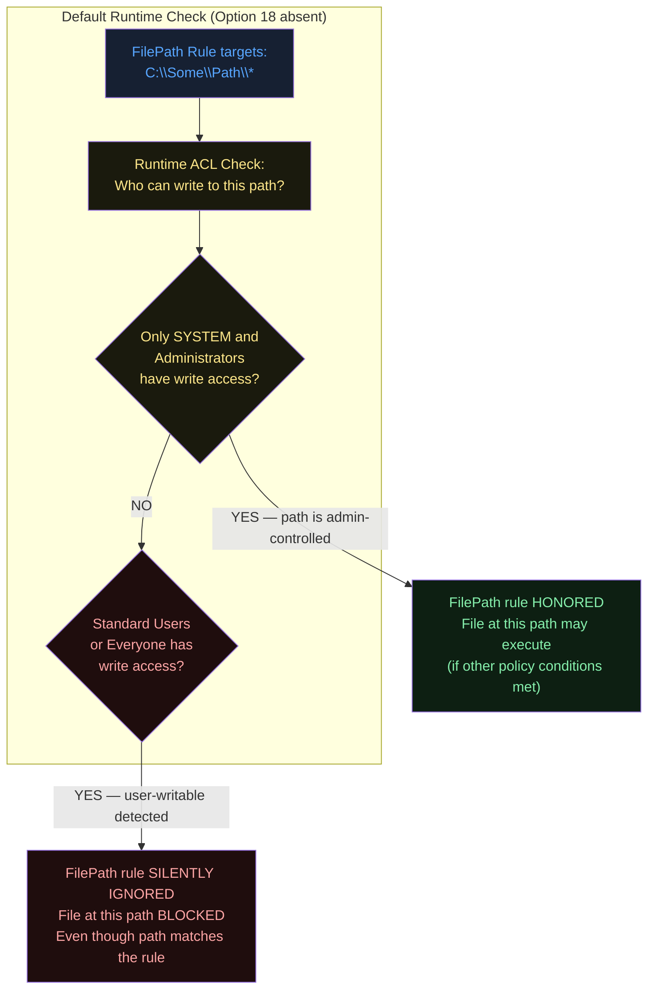
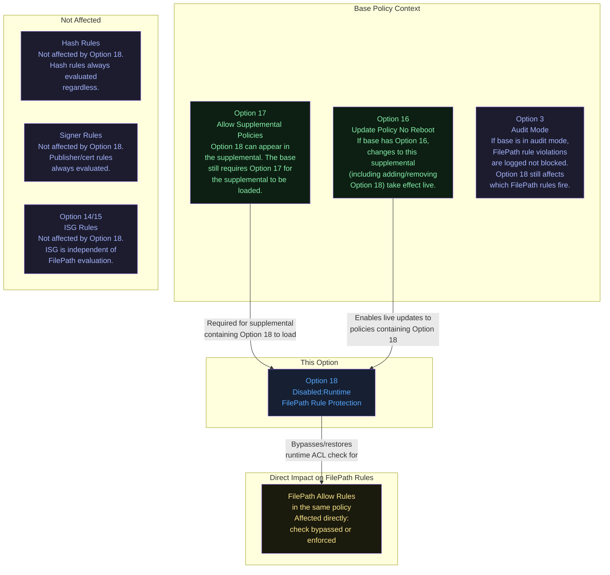
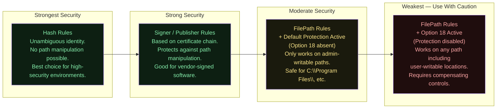
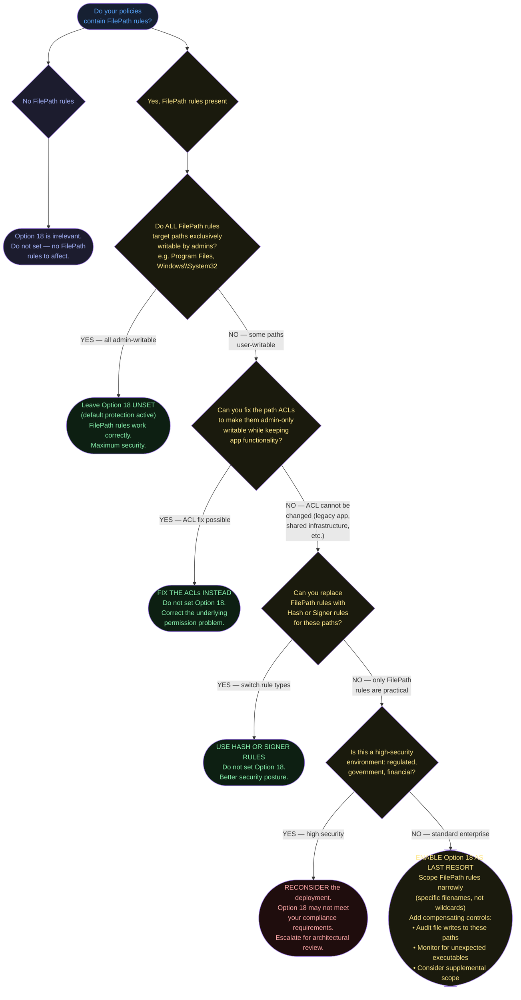
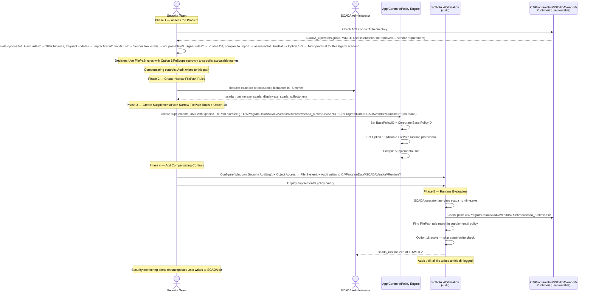
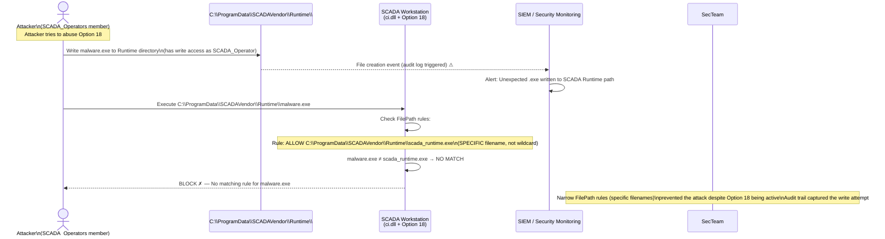

# Option 18 — Disabled:Runtime FilePath Rule Protection

**Author:** Anubhav Gain
**Category:** Endpoint Security
**Rule Option ID:** 18
**Rule String:** `Disabled:Runtime FilePath Rule Protection`
**Valid for Supplemental Policies:** Yes
**Minimum OS Version:** Windows 10 version 1903 / Windows Server 2022

---

## Table of Contents

1. [What It Does](#what-it-does)
2. [Why It Exists](#why-it-exists)
3. [Understanding Runtime FilePath Rule Protection (The Default)](#understanding-runtime-filepath-rule-protection-the-default)
4. [Visual Anatomy — Policy Evaluation Stack](#visual-anatomy--policy-evaluation-stack)
5. [How to Set It (PowerShell)](#how-to-set-it-powershell)
6. [XML Representation](#xml-representation)
7. [Interaction with Other Options](#interaction-with-other-options)
8. [When to Enable vs Disable](#when-to-enable-vs-disable)
9. [Real-World Scenario / End-to-End Walkthrough](#real-world-scenario--end-to-end-walkthrough)
10. [What Happens If You Get It Wrong](#what-happens-if-you-get-it-wrong)
11. [Valid for Supplemental Policies?](#valid-for-supplemental-policies)
12. [OS Version Requirements](#os-version-requirements)
13. [Summary Table](#summary-table)

---

## What It Does

**Option 18 — Disabled:Runtime FilePath Rule Protection** turns off a **runtime security check** that App Control for Business normally performs before honoring a FilePath-based allow rule. By default (when Option 18 is absent), App Control's kernel driver evaluates every FilePath rule at execution time against a critical condition: **is this path exclusively writable by an administrator?** If any non-administrator user can write files to that path, the FilePath rule is silently ignored — the file is not allowed even though a FilePath rule appears to match it. Option 18 **disables this check entirely**, causing App Control to honor FilePath rules regardless of who can write to the target path. In plain terms: without this option, FilePath rules only work on admin-controlled directories; with this option, FilePath rules work on any path, including those writable by standard users.

---

## Why It Exists

### The Default Protection — The Problem It Solves

**FilePath rules** are the most operationally convenient way to authorize software — you simply specify a directory path like `C:\ProgramData\MyApp\*` or `%ProgramFiles%\Vendor\*` and all executables in that path are allowed. However, paths introduce a subtle and dangerous attack vector:

**If a standard user can write files to a path covered by a FilePath allow rule, they can write a malicious executable there and have it automatically authorized by App Control.**

Example attack:
1. Policy has FilePath rule: `Allow C:\Temp\*`
2. Standard users have write access to `C:\Temp\`
3. Attacker (or malware running as standard user) writes `malware.exe` to `C:\Temp\`
4. `C:\Temp\malware.exe` matches the FilePath rule → App Control allows it
5. Privilege escalation or lateral movement executed

The **default runtime protection** (when Option 18 is absent) prevents this by checking at execution time whether the path is exclusively admin-writable. If standard users can write there, the FilePath rule is invalidated at runtime.

### Why Option 18 Exists — The Operational Escape Hatch

The default protection is sound from a security perspective, but it creates operational friction in specific legitimate scenarios:

- **Application directories outside Program Files:** Some legacy enterprise applications install to `C:\ProgramData\<App>\` or `C:\Users\Public\` paths where standard users may need write access (log files, config files written alongside executables)
- **Shared network paths:** Applications running from UNC paths (`\\fileserver\apps\`) where share permissions are managed at a different level than NTFS ACLs
- **Non-standard deployment patterns:** Installer technologies that write executables to locations outside the default admin-only paths
- **Kiosk / specialized devices:** Where the operating model intentionally allows controlled user-writable paths that are still considered safe by local policy

Rather than forcing organizations to restructure their file system permissions to use FilePath rules at all, Option 18 provides an explicit escape hatch: "I understand the risk, I accept responsibility for ensuring these paths are safe through other means, and I need FilePath rules to work here."

---

## Understanding Runtime FilePath Rule Protection (The Default)

Before examining Option 18, it is essential to fully understand the protection being disabled.

### What "Admin-Writable Only" Means



### What "Admin-Writable" Means in Practice

The runtime check evaluates the **effective write permissions** on the target path:

| Path Type | Typically Admin-Writable? | FilePath Rule Honored by Default? |
|-----------|--------------------------|-----------------------------------|
| `C:\Windows\*` | Yes (SYSTEM + Admins only) | Yes |
| `C:\Program Files\*` | Yes (Admins only) | Yes |
| `C:\Program Files (x86)\*` | Yes (Admins only) | Yes |
| `C:\ProgramData\<App>\*` | Usually No (often user-writable) | **No — rule ignored** |
| `C:\Users\Public\*` | No (all users writable) | **No — rule ignored** |
| `C:\Temp\*` | No (all users writable) | **No — rule ignored** |
| `C:\Users\<User>\AppData\*` | No (user owns it) | **No — rule ignored** |
| `\\server\share\*` (UNC) | Depends on share ACLs | Often **No** |

---

## Visual Anatomy — Policy Evaluation Stack

```mermaid
flowchart TD
    EXEC([Binary Execution Request:\nC:\\ProgramData\\App\\app.exe]) --> CI["ci.dll — Code Integrity Driver"]

    CI --> RULE_LOOKUP{Find matching rule\nin active policy set}

    RULE_LOOKUP -- "Hash rule match" --> HASH_ALLOW([Allow — Hash is unambiguous])
    RULE_LOOKUP -- "Signer rule match" --> SIGNER_ALLOW([Allow — Publisher verified])
    RULE_LOOKUP -- "FilePath rule match" --> FILEPATH_BRANCH{Rule type: FilePath}

    FILEPATH_BRANCH --> OPT18_CHECK{Option 18:\nDisabled:Runtime FilePath\nRule Protection — present?}

    OPT18_CHECK -- "Option 18 PRESENT\n(protection disabled)" --> SKIP_CHECK["Skip admin-write check\nAccept FilePath rule at face value"]
    SKIP_CHECK --> ALLOW_PATH([Allow — FilePath rule honored\nregardless of path write permissions])

    OPT18_CHECK -- "Option 18 ABSENT\n(protection active — default)" --> ACL_CHECK["Runtime ACL Check:\nEvaluate write permissions\non the target path"]

    ACL_CHECK --> ADMIN_ONLY{Path exclusively\nwritable by\nAdministrators?}
    ADMIN_ONLY -- "YES" --> ALLOW_PROTECTED([Allow — FilePath rule honored\n(path is admin-controlled, safe)])
    ADMIN_ONLY -- "NO — users can write here" --> BLOCK_FILEPATH([Block — FilePath rule silently overridden\nPath is user-writable, unsafe])

    RULE_LOOKUP -- "No rule matches" --> BLOCK_DEFAULT([Block — Default deny])

    style EXEC fill:#162032,color:#58a6ff
    style CI fill:#1c1c2e,color:#a5b4fc
    style RULE_LOOKUP fill:#1a1a0d,color:#fde68a
    style HASH_ALLOW fill:#0d1f12,color:#86efac
    style SIGNER_ALLOW fill:#0d1f12,color:#86efac
    style FILEPATH_BRANCH fill:#162032,color:#58a6ff
    style OPT18_CHECK fill:#1a1a0d,color:#fde68a
    style SKIP_CHECK fill:#1f0d0d,color:#fca5a5
    style ALLOW_PATH fill:#1f0d0d,color:#fca5a5
    style ACL_CHECK fill:#1c1c2e,color:#a5b4fc
    style ADMIN_ONLY fill:#1a1a0d,color:#fde68a
    style ALLOW_PROTECTED fill:#0d1f12,color:#86efac
    style BLOCK_FILEPATH fill:#1f0d0d,color:#fca5a5
    style BLOCK_DEFAULT fill:#1f0d0d,color:#fca5a5
```

**Note on diagram coloring:** The `SKIP_CHECK` and `ALLOW_PATH` nodes are red not because they block execution, but because they represent a **security risk path** — allowing execution without the admin-write safety check.

---

## How to Set It (PowerShell)

### The Naming Convention Warning

Option 18 uses the `Disabled:` prefix rather than `Enabled:`. This is intentional — the **feature being disabled** is the runtime protection, not the option being "disabled" as an inactive state. The presence of this rule in the policy XML means the protection is turned off. Absence of the rule means the protection is active (the default safe state).

```
Disabled:Runtime FilePath Rule Protection → PRESENT in XML → Protection is OFF
Disabled:Runtime FilePath Rule Protection → ABSENT from XML → Protection is ON (default, secure)
```

This naming convention can be confusing. `Set-RuleOption -Option 18` adds the "Disabled:" rule — turning the protection OFF. `Remove-RuleOption -Option 18` removes the "Disabled:" rule — turning the protection back ON.

### Disable the Runtime Protection (Turn Option 18 ON)

```powershell
# DISABLES the runtime FilePath protection (allows FilePath rules on user-writable paths)
# Use this when you NEED FilePath rules to work on non-admin-writable directories
$PolicyPath = "C:\Policies\MyPolicy.xml"
Set-RuleOption -FilePath $PolicyPath -Option 18
```

### Re-Enable the Runtime Protection (Turn Option 18 OFF)

```powershell
# ENABLES the runtime FilePath protection (restores default safe behavior)
# Use this to return to secure defaults
Remove-RuleOption -FilePath $PolicyPath -Option 18
```

### Complete Workflow: Supplemental Policy with Option 18 for ProgramData Paths

```powershell
#--------------------------------------------------------------------
# Scenario: Legacy app installs to C:\ProgramData\LegacyApp\
# Standard users can write to this directory (log files written there)
# FilePath rule needed but default protection would block it
# Solution: Supplemental policy with Option 18 scoped to this app only
#--------------------------------------------------------------------

$BasePolicyPath   = "C:\Policies\CorporateBase.xml"
$SuppPath         = "C:\Policies\LegacyApp-Supplemental.xml"
$SuppBin          = "C:\Policies\LegacyApp-Supplemental.bin"
$ActiveDir        = "C:\Windows\System32\CodeIntegrity\CiPolicies\Active\"

# Get base policy ID for the link
$BasePolicyId = ([xml](Get-Content $BasePolicyPath)).SiPolicy.PolicyID

# Create a new supplemental policy
New-CIPolicy -FilePath $SuppPath `
             -ScanPath "C:\ProgramData\LegacyApp\" `
             -Level FilePath `
             -Fallback Hash

# Link supplemental to base policy
Set-CIPolicyIdInfo -FilePath $SuppPath `
                   -SupplementsBasePolicyID $BasePolicyId `
                   -PolicyName "LegacyApp-FilePath-Supplemental"

# Option 18: Disable runtime FilePath protection
# This allows the FilePath rule to work even though C:\ProgramData\ is user-writable
Set-RuleOption -FilePath $SuppPath -Option 18

# Compile and deploy supplemental
ConvertFrom-CIPolicy -XmlFilePath $SuppPath -BinaryFilePath $SuppBin
$SuppId = ([xml](Get-Content $SuppPath)).SiPolicy.PolicyID
Copy-Item -Path $SuppBin -Destination "$ActiveDir{$SuppId}.p7" -Force

Write-Host "Supplemental with Option 18 deployed. LegacyApp FilePath rules now active."
```

### Verifying Option 18 Status in a Policy

```powershell
# Check if Option 18 is set (i.e., runtime protection is DISABLED)
[xml]$Policy = Get-Content "C:\Policies\MyPolicy.xml"
$opt18 = $Policy.SiPolicy.Rules.Rule | Where-Object {
    $_.Option -eq "Disabled:Runtime FilePath Rule Protection"
}
if ($opt18) {
    Write-Warning "Option 18 is SET — Runtime FilePath protection is DISABLED. FilePath rules apply to ALL paths."
} else {
    Write-Host "Option 18 is NOT set — Runtime FilePath protection is ACTIVE (default, secure)."
}
```

---

## XML Representation

### Policy WITHOUT Option 18 (Default — Protection Active)

```xml
<?xml version="1.0" encoding="utf-8"?>
<SiPolicy xmlns="urn:schemas-microsoft-com:sipolicy" PolicyType="Supplemental Policy">

  <VersionEx>10.0.0.0</VersionEx>
  <PolicyID>{F9E8D7C6-B5A4-3210-FEDC-BA9876543210}</PolicyID>
  <BasePolicyID>{A1B2C3D4-E5F6-7890-ABCD-EF1234567890}</BasePolicyID>

  <Rules>
    <!--
      Option 18 is ABSENT.
      Default behavior: runtime FilePath protection is ACTIVE.
      FilePath rules will be silently ignored for user-writable paths.
      Only FilePath rules targeting admin-only paths will be honored.
    -->
  </Rules>

  <FileRules>
    <!-- This FilePath rule will ONLY be honored if C:\Program Files\App\ is admin-writable -->
    <Allow ID="ID_ALLOW_APP_PATH"
           FriendlyName="MyApp - FilePath Rule"
           FilePath="C:\Program Files\MyApp\*" />
  </FileRules>

</SiPolicy>
```

### Policy WITH Option 18 (Runtime Protection Disabled)

```xml
<?xml version="1.0" encoding="utf-8"?>
<SiPolicy xmlns="urn:schemas-microsoft-com:sipolicy" PolicyType="Supplemental Policy">

  <VersionEx>10.0.0.0</VersionEx>
  <PolicyID>{F9E8D7C6-B5A4-3210-FEDC-BA9876543210}</PolicyID>
  <BasePolicyID>{A1B2C3D4-E5F6-7890-ABCD-EF1234567890}</BasePolicyID>

  <Rules>
    <!--
      Option 18: Disabled:Runtime FilePath Rule Protection
      PRESENT in the policy = protection is TURNED OFF.
      FilePath rules will be honored regardless of the write permissions on the target path.
      WARNING: This allows FilePath rules on user-writable paths — potential security risk.
      Ensure the target paths are monitored and access is controlled by other means.
    -->
    <Rule>
      <Option>Disabled:Runtime FilePath Rule Protection</Option>
    </Rule>
  </Rules>

  <FileRules>
    <!--
      This FilePath rule will be honored even though C:\ProgramData\ may be user-writable.
      Option 18 disables the check that would normally block this.
      RISK: If malware writes to C:\ProgramData\LegacyApp\, it would match this rule.
      MITIGATION: Scope FilePath rules as narrowly as possible (specific filenames, not wildcards).
    -->
    <Allow ID="ID_ALLOW_LEGACY_PATH"
           FriendlyName="LegacyApp - FilePath Rule (Option 18 required)"
           FilePath="C:\ProgramData\LegacyApp\bin\LegacyApp.exe" />

    <!--
      Prefer specific filenames over wildcards when Option 18 is active
      BAD:  FilePath="C:\ProgramData\LegacyApp\*"   — too broad
      GOOD: FilePath="C:\ProgramData\LegacyApp\bin\LegacyApp.exe" — specific
    -->
  </FileRules>

</SiPolicy>
```

---

## Interaction with Other Options



### FilePath Rule Security Spectrum



### Option Compatibility Matrix

| Option | Relationship | Notes |
|--------|-------------|-------|
| **17 — Allow Supplemental Policies** | Prerequisite for supplemental use | If Option 18 is in a supplemental, the base needs Option 17 to load that supplemental. |
| **16 — Update Policy No Reboot** | Enables live updates | Option 18 additions/removals take effect without reboot when base has Option 16. |
| **3 — Audit Mode** | Contextual | In audit mode, App Control logs but doesn't block. Option 18 affects whether FilePath rules fire audit events. |
| **Hash rules** | Not affected | Hash rules always evaluated; Option 18 has no impact on hash evaluation. |
| **Signer rules** | Not affected | Publisher/cert rules always evaluated; Option 18 has no impact. |

---

## When to Enable vs Disable



### Decision Priority Order

When you have a FilePath rule targeting a user-writable path, evaluate options in this order:

1. **First choice:** Fix the path ACLs to make the directory admin-writable only
2. **Second choice:** Replace FilePath rule with a Hash or Signer rule for the specific files
3. **Third choice:** Scope the FilePath rule to specific filenames (not wildcards) to minimize attack surface before enabling Option 18
4. **Last resort:** Enable Option 18 with compensating controls (audit logging, path monitoring, narrow scope)

---

## Real-World Scenario / End-to-End Walkthrough

**Scenario:** A manufacturing company runs a legacy SCADA software package that installs its runtime executables to `C:\ProgramData\SCADAVendor\Runtime\`. The vendor's installer requires this location and grants write access to the `SCADA_Operators` group (standard users who run the SCADA interface). The executables themselves are signed by the vendor, but the certificate is from a private CA that is not in the policy's trusted signer list. The security team must allow these executables without allowing arbitrary code from this path.



### Attack Attempt Under This Configuration



**Key lesson from the scenario:** Even with Option 18 active, using **specific filenames** rather than wildcards in FilePath rules dramatically reduces the attack surface. Option 18 disables the admin-write check but does not change how the path pattern is matched — a rule for `scada_runtime.exe` will not match `malware.exe`.

---

## What Happens If You Get It Wrong

### Scenario A: Wildcard FilePath rules with Option 18 — write-anywhere exploit

**Configuration:**
```xml
<!-- DANGEROUS: Wildcard + Option 18 + user-writable path -->
<Allow ID="ID_FILEPATH" FilePath="C:\ProgramData\App\*" />
```
With Option 18 active.

**Attack:** Any user who can write to `C:\ProgramData\App\` can write any executable there and have it authorized by App Control. This completely defeats the purpose of having App Control in that directory. Any malware running as a standard user can drop a payload there and execute it.

**Mitigation:** Replace wildcards with specific filenames when Option 18 is active:
```xml
<!-- SAFER: Specific filename + Option 18 + monitoring -->
<Allow ID="ID_FILEPATH_SPECIFIC" FilePath="C:\ProgramData\App\application.exe" />
```

### Scenario B: Option 18 in base policy instead of supplemental — overly broad scope

**Risk:** Option 18 in a base policy disables runtime FilePath protection for ALL FilePath rules across the entire base policy and all loaded supplemental policies. If the base policy has broad FilePath rules (as is common in permissive base policies), the attack surface is enormous.

**Best practice:** Scope Option 18 to a **supplemental policy** that contains only the specific FilePath rules requiring it. This limits the scope of the disabled protection to those specific rules.

```
BAD:  Base Policy + Option 18 + all FilePath rules → broad attack surface
GOOD: Base Policy (no Option 18) + Supplemental with Option 18 + narrow FilePath rules only
```

### Scenario C: Forgetting to add compensating controls

**Risk:** You deploy Option 18 with FilePath rules on user-writable paths without adding:
- File system audit logging on those paths
- Security monitoring alerts for unexpected executable writes
- Regular review of what executables are present at the target paths

Result: An attacker can place a specifically-named malicious executable at the target path (name it the same as the legitimate application, replacing it), and App Control will allow it — with no alert fired.

**Mitigation checklist when using Option 18:**
- [ ] Enable Windows Security Auditing on all paths covered by Option 18 FilePath rules
- [ ] Configure SIEM alerts for unexpected file writes to these directories
- [ ] Implement file integrity monitoring (FIM) on these directories
- [ ] Restrict the FilePath rules to specific executable names (not wildcards)
- [ ] Document the justification and compensating controls for compliance records

### Scenario D: Option 18 set on OS versions prior to Windows 10 1903

**Symptom:** Option 18 has no effect. The runtime FilePath protection that Option 18 is supposed to disable does not exist on older OS versions. FilePath rules behave as if Option 18 were not present — but on pre-1903 systems, FilePath rules evaluated differently anyway (the admin-write check was introduced alongside Option 18 in 1903).

**Note:** Pre-1903 FilePath rule behavior is different from both the "Option 18 active" and "Option 18 absent on 1903+" states. If migrating policies from older OS versions, test FilePath rule behavior explicitly.

### Scenario E: Relying on Option 18 when Hash rules would suffice

**Risk:** This is a policy design anti-pattern rather than a misconfiguration. If your application's executables change infrequently (e.g., only on major version updates), hash rules provide stronger security than FilePath rules even with Option 18 disabled. Organizations sometimes reach for Option 18 as a quick fix without evaluating whether hash rules are practical.

**Guidance:**
- Applications updated quarterly or less → prefer Hash rules
- Applications with stable publisher certificates → prefer Signer rules
- Applications with frequent, unpredictable updates AND no stable certificate AND user-writable install paths → consider Option 18 as last resort

---

## Valid for Supplemental Policies?

**Yes.** Option 18 is one of the very few options that can be set in **supplemental policies**, and this is by design.

The rationale is practical and security-conscious:

1. **Scoped risk:** By allowing Option 18 in supplemental policies, the security risk of disabled FilePath protection can be **contained to the scope of that supplemental**. The base policy maintains its full runtime FilePath protection for all its own FilePath rules. Only the supplemental policy's FilePath rules are affected by Option 18.

2. **Delegation without base policy changes:** When the central security team has a strict base policy with full runtime FilePath protection, they can allow a business unit or IT team to create a supplemental policy with Option 18 for their specific legacy application — without weakening the base policy.

3. **Granular control:** Different supplemental policies can have different Option 18 settings, allowing fine-grained control over which sets of FilePath rules bypass the admin-write check.

**Supplemental policy example where Option 18 is appropriate:**

```
Corporate Base Policy:
  - No FilePath rules at all (uses only Hash + Signer rules)
  - Option 17: Allow Supplemental Policies
  - Option 16: Update Policy No Reboot
  - NO Option 18

Legacy SCADA Supplemental Policy:
  - FilePath rules for specific SCADA executables (user-writable install path)
  - Option 18: Disable Runtime FilePath Protection
  - Scoped to specific filenames only

Standard App Supplemental Policy:
  - Hash rules for additional approved applications
  - NO Option 18 (not needed — using hash rules)
```

In this architecture, Option 18's risk is entirely contained within the SCADA supplemental policy. If that supplemental is removed (e.g., during a migration to a properly-signed SCADA version), the risk disappears without touching the base policy.

---

## OS Version Requirements

| Operating System | Minimum Version Required | Notes |
|-----------------|--------------------------|-------|
| Windows 10 | **1903 (May 2019 Update, Build 18362)** | The runtime FilePath protection (and therefore Option 18) was introduced in 1903 |
| Windows 11 | All versions | Fully supported |
| Windows Server | **2022** | Server 2019 does not have this feature |
| Windows Server Core | 2022+ | Supported |

**Pre-1903 / Pre-Server 2022 behavior:** FilePath rules did not have the admin-write runtime check on older OS versions. The concept of Option 18 "disabling" a check did not apply — FilePath rules simply worked differently. If you are standardizing on newer OS versions, be aware that FilePath rules that worked on older systems may not work the same way on 1903+ unless either the paths are admin-writable or Option 18 is set.

```powershell
# Check OS build for Option 18 support
$Build = [int](Get-ItemProperty "HKLM:\SOFTWARE\Microsoft\Windows NT\CurrentVersion").CurrentBuildNumber
if ($Build -ge 18362) {
    Write-Host "Build $Build: Option 18 and runtime FilePath protection both supported."
    Write-Host "FilePath rules on user-writable paths require Option 18 to function."
} else {
    Write-Host "Build $Build: Pre-1903 OS. FilePath rules behave differently."
    Write-Host "Option 18 has no effect on this OS version."
}
```

---

## Summary Table

| Attribute | Value |
|-----------|-------|
| **Option Number** | 18 |
| **Full Option String** | `Disabled:Runtime FilePath Rule Protection` |
| **Rule Type** | Disabled (presence = feature OFF; absence = feature ON/default) |
| **Dependencies** | None (standalone); FilePath rules must be present for it to have any effect |
| **Effect** | Bypasses the runtime check that restricts FilePath rules to admin-writable paths only |
| **Affects** | FilePath allow rules only; Hash and Signer rules are unaffected |
| **Security Risk (if enabled)** | FilePath rules on user-writable paths allow any user to place an authorized-by-name executable there |
| **Mitigation** | Use specific filenames not wildcards; add file system audit logging; monitor for unexpected executables |
| **Security Risk (if disabled)** | FilePath rules on user-writable paths are silently ignored — apps may unexpectedly block |
| **Valid in Base Policy** | Yes |
| **Valid in Supplemental Policy** | **Yes** (only option valid in supplementals; scope risk to supplemental) |
| **Minimum OS — Windows 10** | **Version 1903 (Build 18362)** |
| **Minimum OS — Windows Server** | **2022** (NOT 2019) |
| **Best Practice** | Use in supplemental policies only; scope to specific filenames; prefer hash/signer rules where practical |
| **PowerShell Enable (disable protection)** | `Set-RuleOption -FilePath $PolicyPath -Option 18` |
| **PowerShell Disable (restore protection)** | `Remove-RuleOption -FilePath $PolicyPath -Option 18` |
| **XML Tag** | `<Option>Disabled:Runtime FilePath Rule Protection</Option>` |
