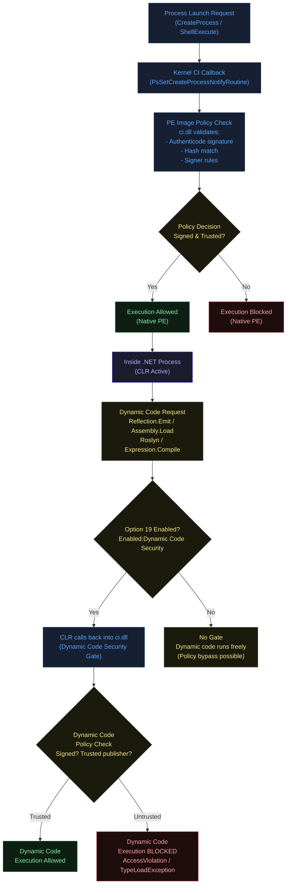
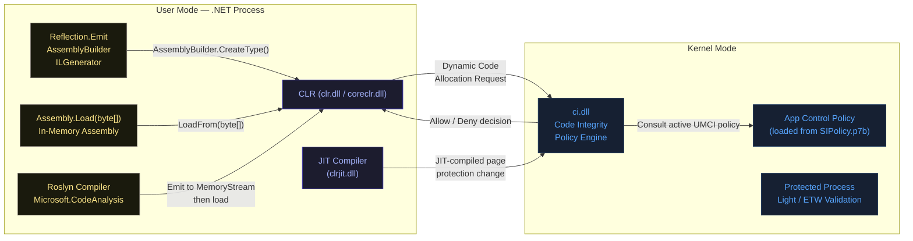
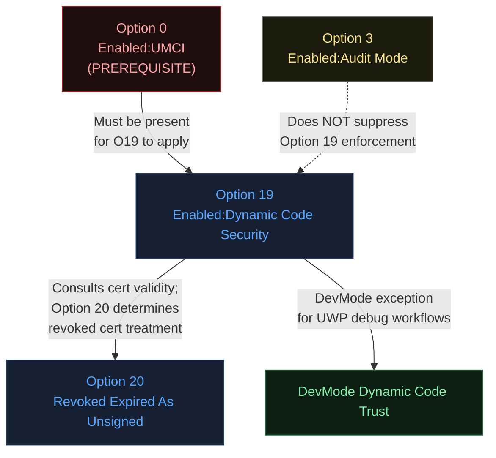
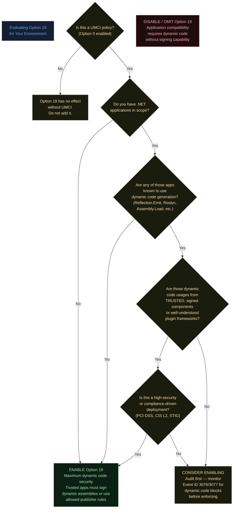
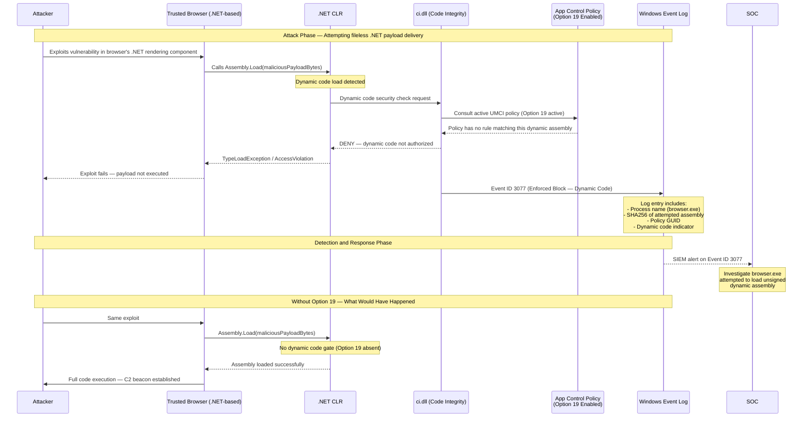
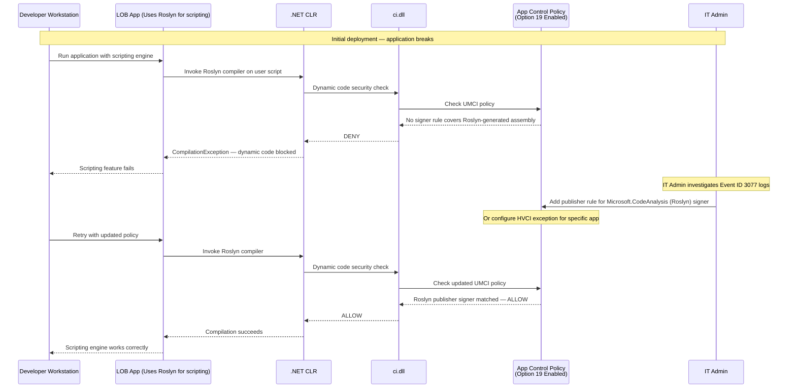
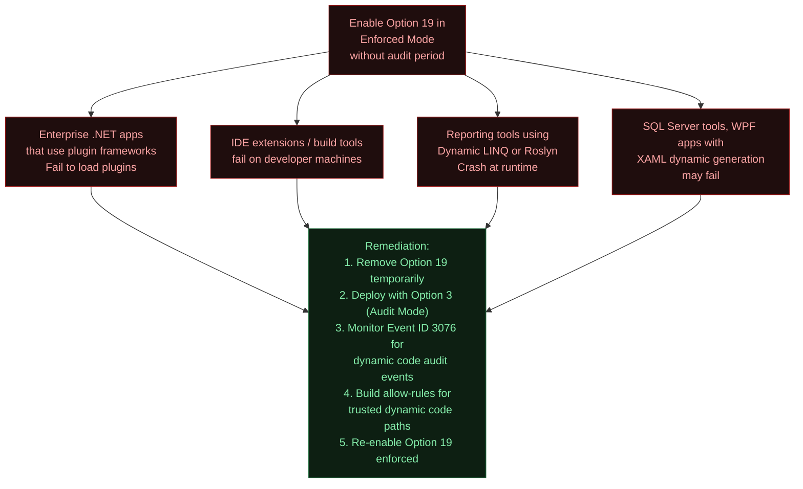
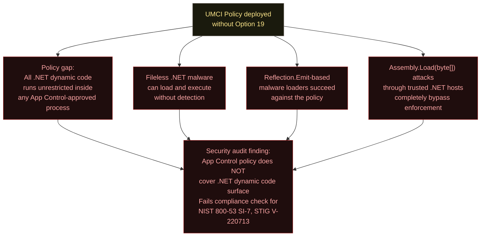

# Option 19 — Enabled:Dynamic Code Security

**Author:** Anubhav Gain  
**Category:** Endpoint Security  
**Policy Rule Option Number:** 19  
**XML Token:** `Enabled:Dynamic Code Security`  
**Applies To:** User Mode Code Integrity (UMCI)  
**Minimum OS:** Windows 10 version 1803 (RS4) / Windows Server 2019  
**Valid for Supplemental Policies:** No  

---

## Table of Contents

1. [What It Does](#1-what-it-does)
2. [Why It Exists](#2-why-it-exists)
3. [Visual Anatomy — Policy Evaluation Stack](#3-visual-anatomy--policy-evaluation-stack)
4. [How to Set It](#4-how-to-set-it)
5. [XML Representation](#5-xml-representation)
6. [Interaction with Other Options](#6-interaction-with-other-options)
7. [When to Enable vs Disable](#7-when-to-enable-vs-disable)
8. [Real-World Scenario — End-to-End Walkthrough](#8-real-world-scenario--end-to-end-walkthrough)
9. [What Happens If You Get It Wrong](#9-what-happens-if-you-get-it-wrong)
10. [Valid for Supplemental Policies](#10-valid-for-supplemental-policies)
11. [OS Version Requirements](#11-os-version-requirements)
12. [Summary Table](#12-summary-table)

---

## 1. What It Does

Option 19, **Enabled:Dynamic Code Security**, extends App Control for Business (formerly WDAC) policy enforcement into the .NET runtime, specifically targeting code that is generated, loaded, or compiled at runtime rather than existing as a static file on disk. Without this option, a malicious or untrusted actor can bypass a perfectly crafted App Control policy by leveraging the .NET Common Language Runtime (CLR) to generate executable code in memory using APIs such as `System.Reflection.Emit`, `System.CodeDom.Compiler`, `Roslyn`-based compilation, or by loading unsigned assemblies dynamically via `Assembly.Load(byte[])`. When Option 19 is enabled, the CLR consults the active App Control UMCI policy before allowing any dynamically generated or loaded code to execute, meaning that all .NET dynamic code paths are subject to the same signing and trust requirements as traditional PE-format executables. This option is always enforced once any UMCI policy enables it — there is no audit-only mode for .NET dynamic code security hardening. The kernel-level component responsible for this check is `ci.dll` (Code Integrity), and the CLR is instrumented to call back into Code Integrity at the appropriate execution boundaries.

---

## 2. Why It Exists

### The Problem: .NET as a Policy Bypass Surface

Traditional App Control enforcement operates at the PE (Portable Executable) level — it gates `CreateProcess`, `LoadLibrary`, and related kernel-mode callbacks that fire when native DLLs and executables are mapped into memory. These kernel hooks work extremely well for native code because every native binary starts as a file on disk that must pass through the OS loader.

The .NET runtime breaks this model in several important ways:

**JIT Compilation.** When a .NET assembly runs, the CLR JIT-compiles Intermediate Language (IL) bytecode into native x86/x64 machine code at runtime. The compiled native code lives in pages marked executable within the process address space — but it never originated from a signed file that the OS loader inspected.

**Reflection.Emit.** The `System.Reflection.Emit` namespace provides classes like `AssemblyBuilder`, `ModuleBuilder`, `TypeBuilder`, and `ILGenerator` that allow a .NET program to construct entirely new assemblies in memory at runtime, compile them, and then invoke methods on the generated types. There is no file on disk, no signature to check, no hash to match. This is one of the most powerful and most abused APIs in the .NET ecosystem from an endpoint-security standpoint.

**In-memory Assembly Loading.** `Assembly.Load(byte[])` accepts a raw byte array representing a compiled .NET assembly. The assembly is loaded directly from memory without any file system involvement. Malware loaders routinely use this pattern to avoid writing payloads to disk entirely.

**Roslyn/Dynamic Compilation.** The Roslyn compiler SDK (`Microsoft.CodeAnalysis`) is a NuGet package that ships inside many legitimate applications. It allows an application to accept C# or VB.NET source code as a string and compile it into an executable assembly at runtime. This is used legitimately by scripting hosts and plugin frameworks, but it is also an extremely capable attack primitive.

**Expression Trees.** LINQ expression trees compiled via `Expression.Compile()` also generate native code dynamically, though the risk profile is lower.

Without Option 19, an attacker who gains execution inside a trusted .NET host process (legitimate, signed, App Control approved) can use any of these mechanisms to load and run arbitrary code that was never vetted by the policy engine. The net effect is that a comprehensive file-based App Control policy has a gaping hole: any trusted .NET process can act as a "living off the land" loader for unsigned or malicious code.

Option 19 closes this gap by enforcing Code Integrity checks on dynamically generated code pages at the CLR/OS interface, so that even in-memory generated code must satisfy the trust model.

### The Attack Pattern It Defeats

```
Attacker gains foothold
    → Injects into or exploits a trusted, App Control-approved .NET process
    → Uses Assembly.Load(byte[]) or Reflection.Emit to load attacker payload
    → Payload executes natively in memory — never touches disk
    → App Control file-based policy never fires
    → Attacker has full code execution inside a trusted process context
```

Option 19 forces the CLR to call `ci.dll` before allowing execution of dynamically generated code, collapsing this entire attack surface.

---

## 3. Visual Anatomy — Policy Evaluation Stack

### Where Option 19 Operates in the Enforcement Stack



### The CLR / ci.dll Interface



---

## 4. How to Set It

### Enable Option 19

```powershell
# Enable Dynamic Code Security on an existing policy XML
Set-RuleOption -FilePath "C:\Policies\MyPolicy.xml" -Option 19

# Verify the option was added
(Get-Content "C:\Policies\MyPolicy.xml") | Select-String "Dynamic Code"
```

### Remove (Disable) Option 19

```powershell
# Remove Dynamic Code Security enforcement
Set-RuleOption -FilePath "C:\Policies\MyPolicy.xml" -Option 19 -Delete

# Confirm removal
(Get-Content "C:\Policies\MyPolicy.xml") | Select-String "Dynamic Code"
# Should return no output if successfully removed
```

### Create a New Policy with Option 19 Enabled

```powershell
# Start from the DefaultWindows template and add Option 19
$PolicyPath = "C:\Policies\DynamicCodePolicy.xml"

# Copy the DefaultWindows base template
Copy-Item "C:\Windows\schemas\CodeIntegrity\ExamplePolicies\DefaultWindows_Enforced.xml" $PolicyPath

# Enable Dynamic Code Security
Set-RuleOption -FilePath $PolicyPath -Option 19

# Also enable UMCI if not already set (Option 0)
Set-RuleOption -FilePath $PolicyPath -Option 0

# Review all current rule options
$xml = [xml](Get-Content $PolicyPath)
$xml.SiPolicy.Rules.Rule | Select-Object -ExpandProperty Option
```

### Full Production Deployment Workflow

```powershell
# 1. Build and configure the policy
$PolicyPath    = "C:\Policies\Production-UMCI.xml"
$BinaryPath    = "C:\Policies\Production-UMCI.p7b"
$PolicyId      = "{$(New-Guid)}"

# 2. Apply required rule options
Set-RuleOption -FilePath $PolicyPath -Option 0   # Enabled:UMCI
Set-RuleOption -FilePath $PolicyPath -Option 3   # Enabled:Audit Mode (test first)
Set-RuleOption -FilePath $PolicyPath -Option 19  # Enabled:Dynamic Code Security

# 3. Audit mode — deploy and test
ConvertFrom-CIPolicy -XmlFilePath $PolicyPath -BinaryFilePath $BinaryPath
# Deploy $BinaryPath, monitor Event ID 3076 (audit block)

# 4. After audit validation, remove audit mode and deploy enforced
Set-RuleOption -FilePath $PolicyPath -Option 3 -Delete
ConvertFrom-CIPolicy -XmlFilePath $PolicyPath -BinaryFilePath $BinaryPath
# Redeploy in enforced mode
```

> **Critical Note:** There is no audit mode for Option 19 itself. Even if your policy is in Audit Mode (Option 3), once Option 19 is present in any active UMCI policy on the system, .NET dynamic code security enforcement is fully active. This is unlike most other App Control options where Audit Mode changes the enforcement behavior.

---

## 5. XML Representation

### Single Option

```xml
<Rules>
  <Rule>
    <Option>Enabled:Dynamic Code Security</Option>
  </Rule>
</Rules>
```

### Full Policy Context (Relevant Sections)

```xml
<?xml version="1.0" encoding="utf-8"?>
<SiPolicy xmlns="urn:schemas-microsoft-com:sipolicy" PolicyType="Base Policy">
  <VersionEx>10.0.0.0</VersionEx>
  <PolicyTypeID>{A244370E-44C9-4C06-B551-F6016E563076}</PolicyTypeID>
  <PlatformID>{2E07F7E4-194C-4D20-B96C-1253577D5412}</PlatformID>
  <Rules>
    <!-- Option 0: Enforce UMCI -->
    <Rule>
      <Option>Enabled:UMCI</Option>
    </Rule>
    <!-- Option 19: Dynamic Code Security -->
    <Rule>
      <Option>Enabled:Dynamic Code Security</Option>
    </Rule>
    <!-- Additional options as appropriate -->
    <Rule>
      <Option>Required:Enforce Store Applications</Option>
    </Rule>
  </Rules>
  <!-- FileRules, Signers, etc. -->
</SiPolicy>
```

### Verifying in a Deployed Binary Policy

```powershell
# Inspect a compiled .p7b policy for Option 19
# (requires CIPolicyParser or manual inspection via certutil)
certutil -dump "C:\Windows\System32\CodeIntegrity\SIPolicy.p7b" | Select-String -Pattern "Dynamic|Option.*19"
```

---

## 6. Interaction with Other Options

### Compatibility and Dependency Matrix

| Option | Name | Relationship with Option 19 |
|--------|------|-----------------------------|
| 0 | Enabled:UMCI | **Required prerequisite.** Dynamic code security only applies in UMCI mode. Without Option 0, Option 19 has no effect. |
| 3 | Enabled:Audit Mode | **Does NOT suppress Option 19.** Audit mode applies to file-based checks; Option 19 is always enforced regardless of Audit Mode status. |
| 7 | Enabled:Unsigned System Integrity Policy | **Orthogonal.** Controls whether the policy itself must be signed; independent of runtime code checks. |
| 9 | Enabled:Advanced Boot Options Menu | **Orthogonal.** Boot-time behavior; unrelated to dynamic code checks. |
| 14 | Enabled:Lifetime WHQL Only | **Orthogonal.** Kernel driver signing; unrelated to .NET user mode. |
| 20 | Enabled:Revoked Expired As Unsigned | **Complementary.** If a .NET assembly is loaded dynamically and signed with a revoked cert, Option 20 determines whether that cert is treated as untrusted. |
| DevMode Dynamic Code Trust | Enabled:Developer Mode Dynamic Code Trust | **Situationally complementary.** Allows UWP apps in Developer Mode to use dynamic code. Provides a controlled exception for development workflows without disabling Option 19 globally. |

### Interaction Diagram



---

## 7. When to Enable vs Disable



### Key Guidance

**Enable Option 19 when:**
- You are running high-security workstations or servers where application compatibility is controlled and managed
- All .NET applications are vetted and either do not use dynamic code generation, or those that do come from trusted, authenticode-signed publishers
- You are pursuing compliance with CIS Benchmarks Level 2, NIST 800-53, or DoD STIG requirements for application whitelisting
- You need to defeat fileless .NET malware techniques (living-off-the-land .NET loader attacks)

**Disable or omit Option 19 when:**
- Your environment runs line-of-business .NET applications that rely heavily on dynamic compilation or plugin architectures that cannot be readily signed
- You are managing developer workstations where build tools, IDE extensions, and scripting engines legitimately require dynamic code
- You have not yet audited which .NET applications use dynamic code paths and cannot accept the application compatibility risk
- You are deploying to legacy systems on Windows 10 versions prior to 1803 (option is ignored/unsupported)

---

## 8. Real-World Scenario — End-to-End Walkthrough

### Scenario: Defeating a Fileless .NET Loader Attack on a Corporate Workstation



### Legitimate App Compatibility Scenario



---

## 9. What Happens If You Get It Wrong

### Enabling Option 19 Without Proper Testing



### Omitting Option 19 from a UMCI Policy



### Assuming Audit Mode Suppresses Option 19

This is the most dangerous misconception. When Option 19 is present:

- **Audit Mode (Option 3) does NOT create an audit-only path for dynamic code**
- The block is **hard enforcement** even in audit mode policies
- Apps will fail **immediately** upon deployment if they use unsupported dynamic code patterns
- There are no Event ID 3076 "would have been blocked" events for dynamic code — only hard 3077 blocks

**Recommendation:** Test Option 19 impact in a controlled lab environment before any production deployment, because you cannot use standard audit mode to soft-land the rollout.

---

## 10. Valid for Supplemental Policies

**No.** Option 19 is not valid for supplemental policies.

Supplemental policies extend a base policy by adding signer rules, file rules, or file attributes. They cannot introduce new enforcement behaviors or change the fundamental trust model that the base policy establishes. Dynamic Code Security is a base-policy enforcement flag because:

1. It changes the fundamental behavior of how the CLR interacts with `ci.dll`
2. It must be consistent across the entire policy merge set — you cannot have one supplemental turn it on while another turns it off
3. The "always enforced" semantic means that even if multiple policies are merged, once any base policy has Option 19, all UMCI enforcement on the system applies dynamic code security

If you attempt to set Option 19 in a supplemental policy, the policy compiler may reject it or the merged enforcement behavior will be undefined. Always set Option 19 in your base policy.

---

## 11. OS Version Requirements

| Platform | Minimum Version | Notes |
|----------|----------------|-------|
| Windows 10 | Version 1803 (RS4, April 2018 Update) | Build 17134 or higher |
| Windows 11 | All versions | Fully supported from initial release |
| Windows Server | Windows Server 2019 | Server Core and Desktop Experience |
| Windows Server 2022 | All versions | Fully supported |
| Windows Server 2025 | All versions | Fully supported |
| Windows 10 < 1803 | **Not supported** | Option is silently ignored or unsupported; do not rely on it |
| Windows Server 2016 | **Not supported** | Use Windows Server 2019+ for this option |

### Detection Script — Verify OS Compatibility

```powershell
# Check if the current OS supports Option 19
$OS       = Get-CimInstance Win32_OperatingSystem
$Build    = [int]$OS.BuildNumber
$Caption  = $OS.Caption

$MinBuild = 17134  # Windows 10 1803

if ($Build -ge $MinBuild) {
    Write-Host "OS $Caption (Build $Build) SUPPORTS Option 19" -ForegroundColor Green
} else {
    Write-Host "OS $Caption (Build $Build) does NOT support Option 19 (min build: $MinBuild)" -ForegroundColor Red
}
```

---

## 12. Summary Table

| Property | Value |
|----------|-------|
| **Option Number** | 19 |
| **XML Token** | `Enabled:Dynamic Code Security` |
| **Policy Type** | UMCI (User Mode Code Integrity) |
| **Default State** | Disabled (must be explicitly enabled) |
| **Audit Mode Override** | No — always enforced when present, regardless of Option 3 (Audit Mode) |
| **Supplemental Policy Valid** | No |
| **Prerequisite** | Option 0 (Enabled:UMCI) must be present |
| **Minimum OS (Client)** | Windows 10 version 1803 (Build 17134) |
| **Minimum OS (Server)** | Windows Server 2019 |
| **What It Protects** | .NET JIT-compiled code, Reflection.Emit, Assembly.Load(byte[]), Roslyn dynamic compilation, Expression.Compile |
| **Primary Threat Defeated** | Fileless .NET malware, living-off-the-land .NET loaders, unsigned dynamic assemblies in trusted processes |
| **PowerShell — Enable** | `Set-RuleOption -FilePath <policy.xml> -Option 19` |
| **PowerShell — Disable** | `Set-RuleOption -FilePath <policy.xml> -Option 19 -Delete` |
| **Event IDs (Block)** | 3077 (enforced), 3076 (audit — but NOTE: Option 19 produces only enforced blocks) |
| **Kernel Component** | `ci.dll` (Code Integrity), CLR instrumentation callback |
| **Risk if Omitted** | .NET dynamic code bypass of App Control policy; fileless execution possible |
| **Risk if Mis-enabled** | Application compatibility failures in .NET apps using dynamic compilation |
| **Recommended Deployment** | Enable in base policy after lab testing; no standard audit mode rollout path |
