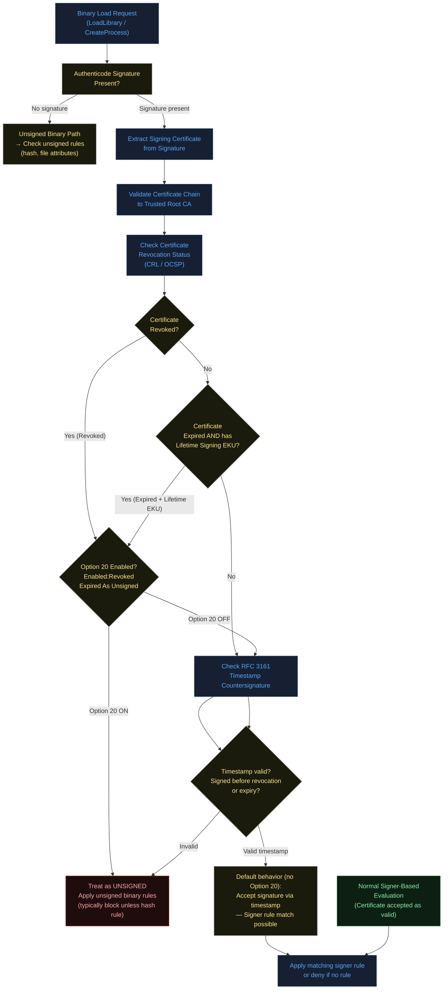
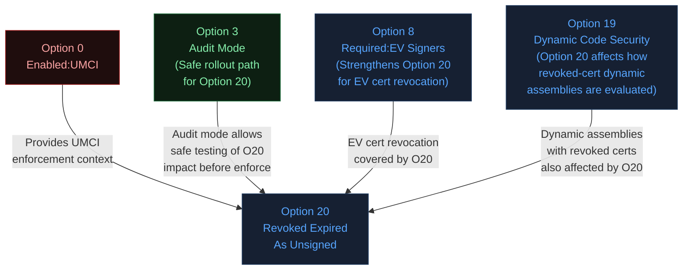
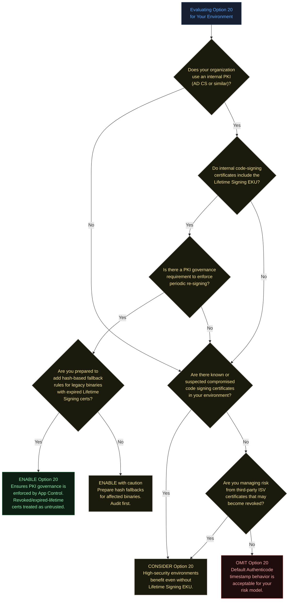
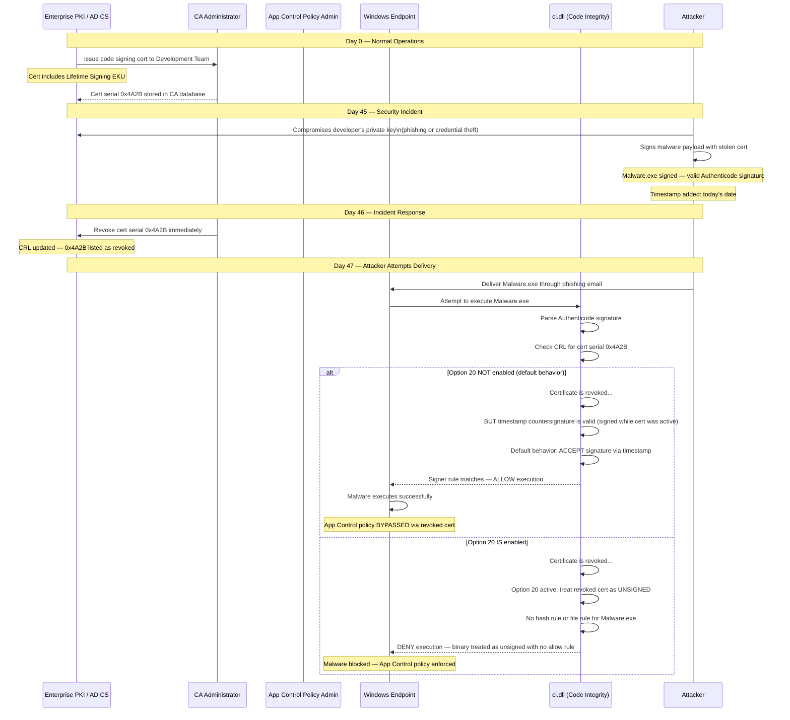
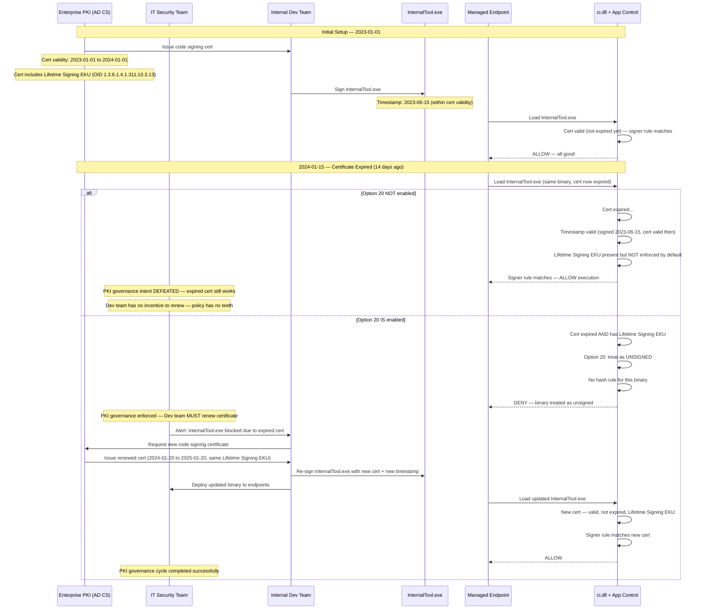
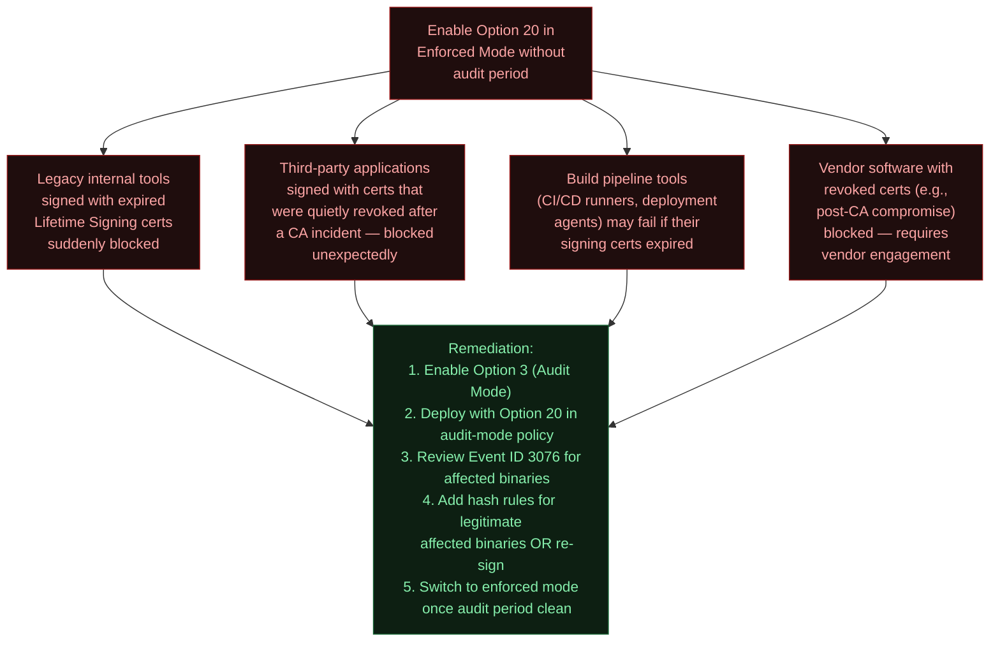
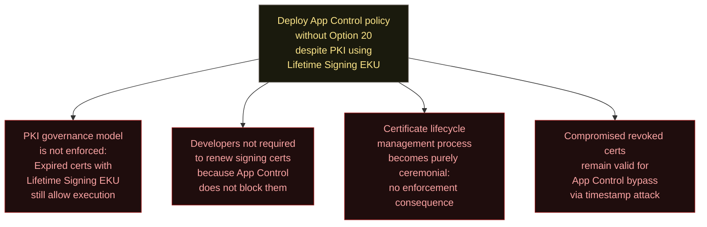

# Option 20 — Enabled:Revoked Expired As Unsigned

**Author:** Anubhav Gain  
**Category:** Endpoint Security  
**Policy Rule Option Number:** 20  
**XML Token:** `Enabled:Revoked Expired As Unsigned`  
**Applies To:** User Mode Code Integrity (UMCI) — enterprise signing scenarios  
**Minimum OS:** Windows 10 / Windows Server 2016  
**Valid for Supplemental Policies:** No  

---

## Table of Contents

1. [What It Does](#1-what-it-does)
2. [Why It Exists](#2-why-it-exists)
3. [Visual Anatomy — Policy Evaluation Stack](#3-visual-anatomy--policy-evaluation-stack)
4. [How to Set It](#4-how-to-set-it)
5. [XML Representation](#5-xml-representation)
6. [Interaction with Other Options](#6-interaction-with-other-options)
7. [When to Enable vs Disable](#7-when-to-enable-vs-disable)
8. [Real-World Scenario — End-to-End Walkthrough](#8-real-world-scenario--end-to-end-walkthrough)
9. [What Happens If You Get It Wrong](#9-what-happens-if-you-get-it-wrong)
10. [Valid for Supplemental Policies](#10-valid-for-supplemental-policies)
11. [OS Version Requirements](#11-os-version-requirements)
12. [Summary Table](#12-summary-table)

---

## 1. What It Does

Option 20, **Enabled:Revoked Expired As Unsigned**, instructs App Control for Business to treat two specific categories of signed user-mode binaries as if they were completely unsigned, rather than applying the normal certificate validation path. The first category is binaries signed with a **revoked certificate** — where the certificate's serial number appears in a Certificate Revocation List (CRL) published by the issuing Certificate Authority. The second category is binaries signed with an **expired certificate** that carries the **Lifetime Signing** Extended Key Usage (EKU) in the signature — where the Lifetime Signing EKU explicitly signals that the signature should only be trusted while the signing certificate remains valid. Without this option, App Control's default behavior is to accept these signatures as valid because the binary was legitimately signed at the time of signing and Authenticode validation does not, by itself, block revoked or expired-with-lifetime-signing signatures under normal enterprise trust anchor configurations. When Option 20 is enabled, such binaries fall through to the "unsigned" evaluation path, meaning they are subject to unsigned binary rules (typically blocked unless an explicit hash or file attribute rule exists to allow them).

---

## 2. Why It Exists

### Understanding Authenticode Signature Validity

Authenticode signatures — the code signing mechanism used by Windows — operate on a timestamp model. When a binary is signed, the signature includes:

1. A **cryptographic hash** of the binary content
2. The **signing certificate** (with its chain to a trusted root CA)
3. An optional **RFC 3161 countersignature timestamp** from a Timestamp Authority (TSA)

The timestamp countersignature is crucial: it proves that the binary was signed **at a specific point in time** when the certificate was valid. This is the mechanism that allows you to run software signed years ago even though the code-signing certificate has long since expired — the timestamp proves the signature was created before expiry.

### The Problem: Revoked Certificates

Certificate revocation is a different scenario. A CA revokes a certificate when:
- The private key has been compromised or suspected of compromise
- The certificate holder (signer) has engaged in malicious activity
- The certificate was issued in error or fraudulently
- The organization associated with the certificate no longer exists or has transferred ownership

When a certificate is revoked, the CA publishes the certificate serial number in a Certificate Revocation List (CRL) or via OCSP (Online Certificate Status Protocol). The semantic intent of revocation is clear: **this certificate should no longer be trusted for any purpose, regardless of when the signature was created.**

However, Authenticode's default behavior honors the timestamp countersignature even for revoked certificates. If a binary was signed, timestamped, and the certificate was later revoked, Windows Authenticode validation will still report the signature as valid because the timestamp proves the signing occurred before revocation. This is a deliberate design choice for software distribution (you don't want millions of legitimately installed applications to suddenly break because a CA's sub-CA was compromised), but it creates a meaningful security gap in an App Control enforcement context.

**The attack surface:** A threat actor who compromises or otherwise obtains access to a code-signing private key — even after that key's certificate has been revoked by the CA — can still produce signed binaries that will pass standard Authenticode validation and thus pass App Control policies that use signer-based rules, because the timestamp-based validity model accepts the signature.

### The Problem: Lifetime Signing EKU

The Lifetime Signing EKU (OID `1.3.6.1.4.1.311.10.3.13`) is a Microsoft-specific Extended Key Usage that explicitly changes the semantics of timestamp validation. When a certificate includes this EKU, it signals:

> "The signature produced by this certificate should only be considered valid for the duration of the certificate's validity period. After the certificate expires, the signature itself should be considered expired, regardless of the timestamp countersignature."

This is the signing CA's explicit statement that they do not intend for the signature to remain valid after certificate expiry. Enterprise PKI administrators use this EKU specifically when they want to enforce certificate renewal cycles — the Lifetime Signing EKU is a deliberate binding of signature lifetime to certificate lifetime.

Without Option 20, App Control does not honor the Lifetime Signing EKU semantic — it still uses the timestamp to determine validity, rendering the EKU's intent moot from an enforcement perspective. Option 20 restores the intended semantics: expired certificates bearing the Lifetime Signing EKU produce signatures that are treated as unsigned.

### The Enterprise PKI Scenario

In enterprise environments with internal Certificate Authorities (e.g., Microsoft Active Directory Certificate Services), organizations sign their internal tooling, scripts, and line-of-business applications with internal CA certificates. The Lifetime Signing EKU is commonly used in enterprise PKI to:
- Force re-signing on a renewal schedule (e.g., annually)
- Ensure applications are reviewed and re-authorized periodically
- Prevent long-lived signatures from bypassing security reviews

Option 20 is the enforcement mechanism that makes this PKI governance model effective within App Control. Without it, an enterprise policy's intent to require periodic re-signing is not enforced — expired certificates with Lifetime Signing EKU still produce "valid" signatures.

---

## 3. Visual Anatomy — Policy Evaluation Stack

### Certificate Validation Decision Tree



### The Lifetime Signing EKU — What It Looks Like in a Certificate

```mermaid
flowchart LR
    subgraph Cert ["Code Signing Certificate"]
        Subject["Subject: CN=Contoso Internal Signer\nOU=IT Security"]:::eval
        Issuer["Issuer: CN=Contoso Enterprise CA"]:::eval
        Validity["Not Before: 2023-01-01\nNot After:  2024-01-01 (EXPIRED)"]:::warn
        EKU["Extended Key Usages:\n- Code Signing (1.3.6.1.5.5.7.3.3)\n- Lifetime Signing (1.3.6.1.4.1.311.10.3.13) ← KEY"]:::block
        KeyUsage["Key Usage: Digital Signature"]:::eval
    end

    subgraph Sig ["Binary Authenticode Signature"]
        Hash["SHA-256 content hash"]:::eval
        CertEmbed["Embedded certificate chain"]:::eval
        Timestamp["RFC 3161 countersignature\n(signed 2023-06-15 — within cert validity)"]:::allow
        LifetimeNote["Lifetime Signing EKU present:\nTimestamp does NOT extend trust\nbeyond certificate expiry\n(when Option 20 is active)"]:::block
    end

    Cert --> Sig

    classDef eval fill:#162032,color:#58a6ff,stroke:#1e3a5f
    classDef warn fill:#1a1a0d,color:#fde68a,stroke:#78716c
    classDef block fill:#1f0d0d,color:#fca5a5,stroke:#991b1b
    classDef allow fill:#0d1f12,color:#86efac,stroke:#166534
```



---

## 4. How to Set It

### Enable Option 20

```powershell
# Enable Revoked/Expired-as-Unsigned on an existing policy
Set-RuleOption -FilePath "C:\Policies\MyPolicy.xml" -Option 20

# Confirm the rule was added
[xml]$Policy = Get-Content "C:\Policies\MyPolicy.xml"
$Policy.SiPolicy.Rules.Rule | Where-Object { $_.Option -like "*Revoked*" }
```

### Remove (Disable) Option 20

```powershell
# Remove the option (revert to default Authenticode timestamp behavior)
Set-RuleOption -FilePath "C:\Policies\MyPolicy.xml" -Option 20 -Delete
```

### Create an Enterprise Policy with Option 20 and Enterprise PKI Signing

```powershell
# Full enterprise PKI policy configuration with Option 20
$PolicyPath = "C:\Policies\Enterprise-PKI-Policy.xml"

# Start from a base template
Copy-Item "C:\Windows\schemas\CodeIntegrity\ExamplePolicies\DefaultWindows_Enforced.xml" $PolicyPath

# Core options
Set-RuleOption -FilePath $PolicyPath -Option 0   # Enabled:UMCI
Set-RuleOption -FilePath $PolicyPath -Option 3   # Enabled:Audit Mode (for testing)
Set-RuleOption -FilePath $PolicyPath -Option 20  # Enabled:Revoked Expired As Unsigned

# Add your enterprise CA as a trusted signer
# (First extract CA cert thumbprint from your PKI)
$CACert = Get-ChildItem Cert:\LocalMachine\Root | Where-Object { $_.Subject -like "*Contoso*" }

# Reference the signer in the policy via New-CIPolicyRule
$SignerRule = New-CIPolicyRule -DriverFilePath "C:\Tools\SignedByEnterpriseCa.exe" -Level Publisher

# Merge signer rule into policy
Merge-CIPolicy -PolicyPaths $PolicyPath -Rules @($SignerRule) -OutputFilePath $PolicyPath

# Review final policy options
$xml = [xml](Get-Content $PolicyPath)
Write-Host "Policy Rules:"
$xml.SiPolicy.Rules.Rule | ForEach-Object { Write-Host "  - $($_.Option)" }
```

### Check Whether a Binary Would Be Affected by Option 20

```powershell
# Inspect a binary's signing certificate for revocation and Lifetime Signing EKU
param(
    [string]$BinaryPath = "C:\Tools\MySoftware.exe"
)

$Sig = Get-AuthenticodeSignature -FilePath $BinaryPath

if ($Sig.Status -eq "Valid") {
    $Cert = $Sig.SignerCertificate
    Write-Host "Signer: $($Cert.Subject)"
    Write-Host "Valid Until: $($Cert.NotAfter)"
    Write-Host "Is Expired: $($Cert.NotAfter -lt (Get-Date))"

    # Check for Lifetime Signing EKU (OID 1.3.6.1.4.1.311.10.3.13)
    $LifetimeEKU = $Cert.Extensions | Where-Object {
        $_ -is [System.Security.Cryptography.X509Certificates.X509EnhancedKeyUsageExtension]
    } | ForEach-Object {
        $_.EnhancedKeyUsages | Where-Object { $_.Value -eq "1.3.6.1.4.1.311.10.3.13" }
    }

    if ($LifetimeEKU) {
        Write-Host "Lifetime Signing EKU: PRESENT" -ForegroundColor Yellow
        if ($Cert.NotAfter -lt (Get-Date)) {
            Write-Host "WARNING: Certificate is expired AND has Lifetime Signing EKU" -ForegroundColor Red
            Write-Host "With Option 20 enabled, this binary will be treated as UNSIGNED" -ForegroundColor Red
        }
    } else {
        Write-Host "Lifetime Signing EKU: Not present" -ForegroundColor Green
    }

    # Check CRL status (requires network access to CRL distribution point)
    try {
        $Chain = [System.Security.Cryptography.X509Certificates.X509Chain]::new()
        $Chain.ChainPolicy.RevocationFlag = "EndCertificateOnly"
        $Chain.ChainPolicy.RevocationMode = "Online"
        $Built = $Chain.Build($Cert)
        if (-not $Built) {
            $Chain.ChainStatus | ForEach-Object {
                Write-Host "Chain status: $($_.StatusInformation)" -ForegroundColor Red
            }
        } else {
            Write-Host "Certificate Revocation Status: Not revoked (CRL check passed)" -ForegroundColor Green
        }
    } catch {
        Write-Host "Could not check CRL status (offline?): $_" -ForegroundColor Yellow
    }
} else {
    Write-Host "Signature status: $($Sig.Status)"
}
```

---

## 5. XML Representation

### Option in Policy XML

```xml
<Rules>
  <Rule>
    <Option>Enabled:Revoked Expired As Unsigned</Option>
  </Rule>
</Rules>
```

### Full Policy Context

```xml
<?xml version="1.0" encoding="utf-8"?>
<SiPolicy xmlns="urn:schemas-microsoft-com:sipolicy" PolicyType="Base Policy">
  <VersionEx>10.0.0.0</VersionEx>
  <PolicyTypeID>{B70B9A08-C15F-4B33-AEB5-2ABAD7D1B5B3}</PolicyTypeID>
  <PlatformID>{2E07F7E4-194C-4D20-B96C-1253577D5412}</PlatformID>
  <Rules>
    <Rule>
      <Option>Enabled:UMCI</Option>
    </Rule>
    <!-- Option 20: Treat revoked certs and expired Lifetime Signing EKU certs as unsigned -->
    <Rule>
      <Option>Enabled:Revoked Expired As Unsigned</Option>
    </Rule>
    <!-- Other options as appropriate for your environment -->
    <Rule>
      <Option>Enabled:Audit Mode</Option>
    </Rule>
  </Rules>

  <EKUs>
    <!-- No special EKU entries needed for Option 20 — it affects ALL signers
         that use revoked or Lifetime Signing expired certificates -->
  </EKUs>

  <FileRules>
    <!-- Hash-based fallback rules for any binaries that become "unsigned"
         due to Option 20 but must still be allowed -->
    <!-- Example: Allow a specific binary by hash even if its cert is expired+Lifetime -->
    <!--
    <Allow ID="ID_ALLOW_LEGACY_TOOL"
           FriendlyName="Legacy internal tool — cert expired, allow by hash"
           Hash="SHA256HashValue..." />
    -->
  </FileRules>

  <Signers>
    <!-- Enterprise CA signer rules for currently-valid internal PKI certificates -->
    <!--
    <Signer ID="ID_SIGNER_ENTERPRISE_CA" Name="Contoso Enterprise CA">
      <CertRoot Type="TBS" Value="TBS_Hash_of_CA_cert" />
    </Signer>
    -->
  </Signers>
</SiPolicy>
```

---

## 6. Interaction with Other Options

### Compatibility Matrix

| Option | Name | Relationship with Option 20 |
|--------|------|-----------------------------|
| 0 | Enabled:UMCI | **Context prerequisite.** Option 20 applies in UMCI enforcement context for user-mode binaries. |
| 3 | Enabled:Audit Mode | **Compatible and useful together.** Audit Mode allows you to see which binaries would be blocked before enforcing. Unlike Option 19, Option 20 respects audit mode. |
| 7 | Enabled:Unsigned System Integrity Policy | **Orthogonal.** Controls policy file signing; does not affect binary certificate evaluation. |
| 8 | Required:EV Signers | **Complementary.** Requires Extended Validation certificates; if an EV cert is revoked, Option 20 ensures it is treated as unsigned rather than trusted via timestamp. |
| 11 | Disabled:Script Enforcement | **Orthogonal.** Script enforcement context; Option 20 applies to PE binaries. |
| 19 | Enabled:Dynamic Code Security | **Complementary.** Option 19 gates dynamic code; Option 20 ensures dynamically loaded assemblies signed with revoked/expired-LifetimeSigning certs are treated as unsigned. |

### Interaction Diagram



---

## 7. When to Enable vs Disable



### Key Guidance

**Enable Option 20 when:**
- Your enterprise PKI uses the Lifetime Signing EKU and you want App Control to honor certificate expiry as a signature expiry boundary
- You operate a governance model requiring all internal software to be re-signed periodically (e.g., annually during security reviews)
- You have had a code signing certificate compromised or revoked and want to ensure that binaries signed with that certificate are automatically treated as untrusted
- You manage high-security environments where the Authenticode timestamp bypass of revocation is a known risk in your threat model
- You use third-party software with certificates that have been or could be revoked (e.g., following CA compromises like DigiNotar, Comodo, etc.)

**Omit or disable Option 20 when:**
- Your enterprise PKI does not use Lifetime Signing EKU and you do not have a specific concern about revoked certificate exploitation
- You have legacy software signed with certificates that are now expired-with-Lifetime-EKU and you cannot re-sign or create hash rules before deploying
- The operational burden of maintaining current signatures on all internal tools outweighs the security benefit in your risk assessment
- You are deploying to environments where CRL distribution points are not reliably accessible (air-gapped or restricted networks) and the revocation check model is unreliable

---

## 8. Real-World Scenario — End-to-End Walkthrough

### Scenario A: Compromised Enterprise Code Signing Certificate



### Scenario B: Enterprise PKI Renewal Governance with Lifetime Signing EKU



---

## 9. What Happens If You Get It Wrong

### Enabling Option 20 Without Auditing First



### Omitting Option 20 When Lifetime Signing EKU Is Present in Your PKI



### Air-Gapped Environment: CRL Accessibility Issue

One subtle misconfiguration involves environments where CRL distribution points (CDPs) are not accessible from the endpoints. If the endpoint cannot check the CRL, the revocation status check may fail or default to "not revoked" depending on the `ChainPolicy.RevocationMode` setting and system configuration. In this scenario:

- Option 20 may not trigger correctly for revoked certificates if CRL checks are failing silently
- The Lifetime Signing EKU expiry check is purely local (no network required) and will work correctly
- **Mitigation:** Ensure CRL distribution points are accessible or use OCSP stapling; alternatively, configure `DisallowedCertificates` in the policy to explicitly distrust compromised certificates regardless of CRL accessibility

```powershell
# For air-gapped scenarios: add revoked cert directly to DisallowedCertificates
# rather than relying solely on Option 20 + CRL
$RevokedCert = Get-ChildItem Cert:\LocalMachine\Disallowed | Where-Object { 
    $_.SerialNumber -eq "4A2B..." 
}
# Or import the revoked cert thumbprint directly into the policy's denied signers
```

---

## 10. Valid for Supplemental Policies

**No.** Option 20 is not valid for supplemental policies.

The reasoning parallels that for other enforcement-model options:

1. **Enforcement-model consistency:** The decision to treat revoked or expired-LifetimeSigning certificates as unsigned affects the entire signer evaluation model. This cannot be toggled differently by different supplemental policies — the base policy must establish the rule.

2. **Trust hierarchy:** Supplemental policies operate within the trust boundaries established by the base policy. Changing how certificate revocation is evaluated is a base-policy concern, not a supplemental extension.

3. **PKI governance:** If a base policy establishes that revoked certs are treated as unsigned (Option 20), no supplemental policy should be able to override this for specific binaries via a signer rule — it would undermine the entire governance model.

4. **Merge semantics:** When multiple policies are merged at enforcement time, having contradictory revocation behavior in different supplemental policies would produce undefined or inconsistent behavior. Microsoft scopes this option to base policies to avoid this ambiguity.

---

## 11. OS Version Requirements

| Platform | Minimum Version | Notes |
|----------|----------------|-------|
| Windows 10 | Version 1507 (RTM) and later | Supported from initial App Control / WDAC availability |
| Windows 11 | All versions | Fully supported |
| Windows Server 2016 | All versions | Supported |
| Windows Server 2019 | All versions | Fully supported |
| Windows Server 2022 | All versions | Fully supported |
| Windows Server 2025 | All versions | Fully supported |

Option 20 does not have the elevated OS version requirement that Option 19 carries. It leverages existing Authenticode revocation checking infrastructure that has been present since the original WDAC/Device Guard deployment in Windows 10. The Lifetime Signing EKU (OID `1.3.6.1.4.1.311.10.3.13`) is a Microsoft-defined extension with long-standing support in the Windows certificate infrastructure.

### Verify CRL Infrastructure Readiness

```powershell
# Check that CRL distribution points are accessible from the endpoint
# (Important for revocation checking to work correctly with Option 20)

# Get all CDP URLs from code signing certs on the machine
Get-ChildItem Cert:\LocalMachine\My | ForEach-Object {
    $Cert = $_
    $CDP = $Cert.Extensions | Where-Object { $_.Oid.Value -eq "2.5.29.31" }
    if ($CDP) {
        Write-Host "Cert: $($Cert.Subject)"
        # Parse CDP extension value for URLs
        $CDPString = $CDP.Format($true)
        Write-Host "CDP: $CDPString"
        Write-Host "---"
    }
}

# Test connectivity to a specific CDP (replace with your CA's CDP URL)
$TestUrl = "http://crl.contoso.com/ContosoCa.crl"
try {
    $Response = Invoke-WebRequest -Uri $TestUrl -UseBasicParsing -TimeoutSec 10
    Write-Host "CRL accessible: $TestUrl (HTTP $($Response.StatusCode))" -ForegroundColor Green
} catch {
    Write-Host "CRL NOT accessible: $TestUrl — $_" -ForegroundColor Red
    Write-Host "WARNING: Option 20 revocation checks may not function correctly" -ForegroundColor Yellow
}
```

---

## 12. Summary Table

| Property | Value |
|----------|-------|
| **Option Number** | 20 |
| **XML Token** | `Enabled:Revoked Expired As Unsigned` |
| **Policy Type** | UMCI (User Mode Code Integrity) |
| **Default State** | Disabled (Authenticode timestamp behavior: revoked certs accepted if timestamped) |
| **Audit Mode Behavior** | Respects Audit Mode (Option 3) — produces Event ID 3076 before enforcement |
| **Supplemental Policy Valid** | No |
| **Prerequisite** | Option 0 (Enabled:UMCI) for user-mode enforcement context |
| **Minimum OS (Client)** | Windows 10 (all versions) |
| **Minimum OS (Server)** | Windows Server 2016 |
| **Affected Scenario 1** | Binaries signed with **revoked certificates** — treated as unsigned regardless of timestamp |
| **Affected Scenario 2** | Binaries signed with **expired certificates bearing Lifetime Signing EKU** (OID 1.3.6.1.4.1.311.10.3.13) — treated as unsigned |
| **Not Affected** | Expired certificates WITHOUT Lifetime Signing EKU — these continue to use timestamp-based validity |
| **PowerShell — Enable** | `Set-RuleOption -FilePath <policy.xml> -Option 20` |
| **PowerShell — Disable** | `Set-RuleOption -FilePath <policy.xml> -Option 20 -Delete` |
| **Event IDs (Audit)** | 3076 (audit block — binary would be blocked in enforce mode) |
| **Event IDs (Block)** | 3077 (enforced block) |
| **Lifetime Signing EKU OID** | `1.3.6.1.4.1.311.10.3.13` |
| **Primary Use Case** | Enterprise PKI governance enforcement; revoked certificate risk mitigation |
| **Risk if Omitted** | Revoked/expired-LifetimeSigning certs continue to satisfy signer-based allow rules; PKI governance not enforced |
| **Risk if Mis-enabled** | Legacy binaries with expired Lifetime Signing certs blocked; requires re-signing or hash fallback rules |
| **Network Dependency** | CRL/OCSP access required for revocation checks (Lifetime Signing EKU check is local/offline) |
| **Recommended Deployment** | Enable with Audit Mode (Option 3) first; review affected binaries; add hash fallbacks; then enforce |
