# Developer Mode Dynamic Code Trust

**Author:** Anubhav Gain  
**Category:** Endpoint Security  
**Policy Rule Option:** (No numeric identifier)  
**XML Token:** `Enabled:Developer Mode Dynamic Code Trust`  
**Applies To:** User Mode Code Integrity (UMCI) — UWP / Windows App development workflows  
**Minimum OS:** Windows 10 version 1809 (RS5) / Windows Server 2019  
**Valid for Supplemental Policies:** No  

---

## Table of Contents

1. [What It Does](#1-what-it-does)
2. [Why It Exists](#2-why-it-exists)
3. [Visual Anatomy — Policy Evaluation Stack](#3-visual-anatomy--policy-evaluation-stack)
4. [How to Set It](#4-how-to-set-it)
5. [XML Representation](#5-xml-representation)
6. [Interaction with Other Options](#6-interaction-with-other-options)
7. [When to Enable vs Disable](#7-when-to-enable-vs-disable)
8. [Real-World Scenario — End-to-End Walkthrough](#8-real-world-scenario--end-to-end-walkthrough)
9. [What Happens If You Get It Wrong](#9-what-happens-if-you-get-it-wrong)
10. [Valid for Supplemental Policies](#10-valid-for-supplemental-policies)
11. [OS Version Requirements](#11-os-version-requirements)
12. [Summary Table](#12-summary-table)

---

## 1. What It Does

The **Enabled:Developer Mode Dynamic Code Trust** option instructs App Control for Business to extend dynamic code trust to UWP (Universal Windows Platform) applications that are being debugged through Visual Studio or deployed via the Windows Device Portal while the Windows Developer Mode setting is active on the system. In a standard App Control UMCI enforcement environment, dynamically generated code — including the code that UWP application frameworks generate and execute at debug-time — must meet the same signing and trust requirements as any other executable code. This creates a friction point for developers: when writing and iterating on UWP applications, the development toolchain relies on side-loading, debug-mode code generation, and Device Portal deployment flows that do not produce traditionally signed binaries. When this option is present in the policy and Windows Developer Mode is simultaneously enabled via Settings, App Control treats code generated in these specific UWP debugging contexts as trusted, allowing the development workflow to proceed without requiring full PKI signing of every debug build. This option is entirely dependent on the system-level Developer Mode toggle: if Developer Mode is off, the option has no effect even if it is present in the policy XML.

---

## 2. Why It Exists

### The Fundamental Tension: Security vs Developer Productivity

App Control for Business, in UMCI enforcement mode, is designed to ensure that only trusted, authorized code runs on a managed endpoint. This is an excellent security property for production workstations and servers. However, it creates a direct conflict with the needs of software developers building UWP applications:

**The development iteration loop requires:**
1. Write code in Visual Studio
2. Compile to a debug or test build (unsigned or developer-signed only)
3. Deploy the app to a local or remote test device
4. Attach debugger and observe runtime behavior
5. Modify code and repeat

Steps 2–4 involve code that is fundamentally different from production-signed software:
- Debug builds are typically signed with a developer test certificate, not a production code-signing certificate
- The Visual Studio debugger attaches to the process and generates additional code (debug shims, instrumentation)
- Device Portal deployment bypasses the Microsoft Store signing and distribution pipeline entirely
- The UWP app container generates dynamic code as part of its runtime execution model

### Why Standard UMCI Enforcement Breaks Development Workflows

Without this option, a developer working on a machine with App Control UMCI enforced faces these obstacles:

**Visual Studio Debugger Attachment:** When VS attaches to a UWP process, it generates native shim code for breakpoint handling and variable inspection. This code is generated dynamically and is not part of any signed binary. Under UMCI enforcement, this code would be blocked.

**Side-loading / Device Portal Deployment:** Developers frequently deploy test builds directly to devices for UI and hardware testing. These builds are signed with locally generated test certificates, not enterprise CA certificates or Microsoft Store certificates. App Control UMCI enforcement rejects them.

**Debug/Test Certificate Trust:** Visual Studio generates per-developer test certificates for package signing. These certificates are self-signed, not anchored to an enterprise PKI, and do not satisfy standard signer rules.

**F5 Deploy-and-Debug Cycle:** The "press F5 to run" workflow in Visual Studio for UWP projects involves a rapid sequence of: build, package, sign with test cert, deploy locally, launch in debug host, attach debugger. Every step of this sequence involves either unsigned code or test-signed code that would not pass UMCI enforcement.

### The Solution: Tie Trust to Developer Mode

Microsoft's solution is elegant: rather than requiring developers to maintain a separate, less-secure policy or continuously toggle App Control enforcement, the Developer Mode Dynamic Code Trust option ties the trust exception to the Windows Developer Mode setting. Developer Mode is a separate, explicit, administratively controlled toggle that:

1. Must be enabled by an administrator (or a user with appropriate privileges depending on MDM policy)
2. Signals that the device is in a development context where reduced security constraints are acceptable
3. Is visible in Windows Settings and auditable
4. Can be prevented or controlled via Group Policy and MDM (Intune)

When both the App Control option AND Developer Mode are active, the trust exception applies. When Developer Mode is off (the default on production systems), the option has zero effect — the policy behaves identically to a policy without this option. This means a single policy can be deployed to both developer machines and production machines, with behavior automatically adapting based on the Developer Mode state.

### What "Dynamic Code Trust" Means Here

The trust extended by this option is specifically:
- **UWP app debugging contexts** — code generated by the VS debugger and debug runtime for UWP app processes
- **Device Portal deployed packages** — apps deployed via the Windows Device Portal (`localhost:11443`) while in Developer Mode
- **Test-signed or developer-signed packages** — UWP packages signed with developer test certificates that would not otherwise satisfy UMCI signer rules

This is not a blanket exemption for all dynamic code. It is scoped to specific, identifiable development workflows that are gated behind the Developer Mode system state.

---

## 3. Visual Anatomy — Policy Evaluation Stack

### Where Developer Mode Dynamic Code Trust Operates

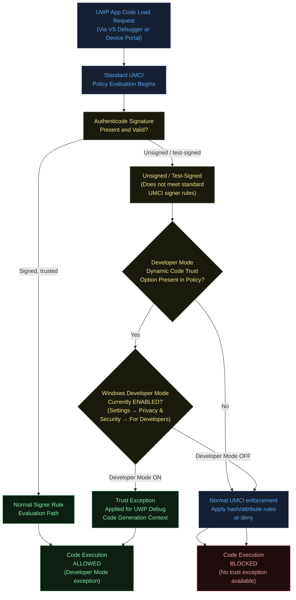

### The Dual-Gate Architecture

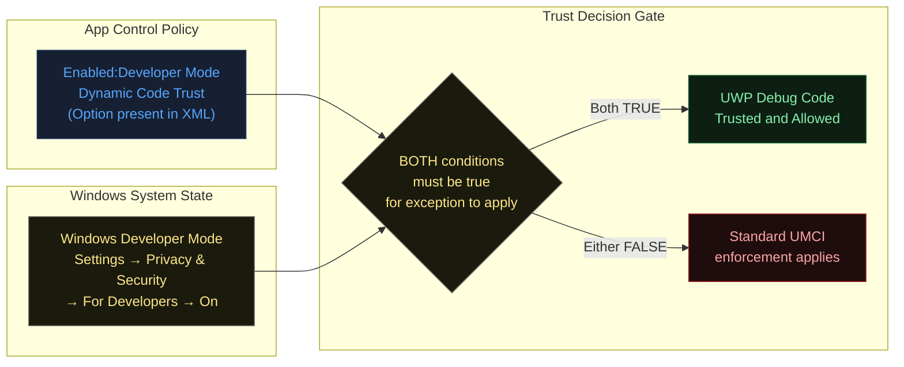

### Developer Mode System State in Windows Settings

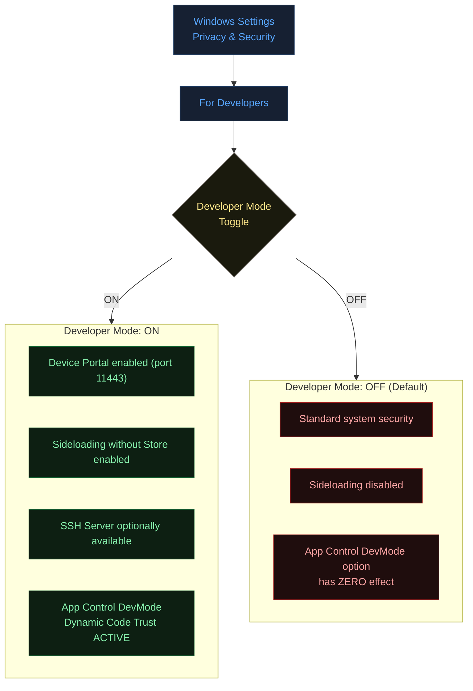

---

## 4. How to Set It

### Enable Developer Mode Dynamic Code Trust

```powershell
# The option is identified by its string token, not a numeric ID
# Use Set-RuleOption with the appropriate option value

# Note: The option token for this rule is listed differently in PowerShell
# Check the available options list to get the exact numeric value or use the string form

# Method 1: View all available options to confirm the token
(Get-Command Set-RuleOption).Parameters.Option.Attributes | 
    Where-Object { $_ -is [System.Management.Automation.ValidateSetAttribute] } |
    Select-Object -ExpandProperty ValidValues |
    Where-Object { $_ -like "*Developer*" -or $_ -like "*Dynamic*" }

# Method 2: Add the rule directly via XML manipulation (reliable approach)
$PolicyPath = "C:\Policies\DevPolicy.xml"
[xml]$Policy = Get-Content $PolicyPath

# Check if Rules element exists
$RulesNode = $Policy.SiPolicy.Rules
if (-not $RulesNode) {
    $RulesNode = $Policy.CreateElement("Rules", $Policy.DocumentElement.NamespaceURI)
    $Policy.SiPolicy.AppendChild($RulesNode) | Out-Null
}

# Add the Developer Mode Dynamic Code Trust rule
$NewRule = $Policy.CreateElement("Rule", $Policy.DocumentElement.NamespaceURI)
$NewOption = $Policy.CreateElement("Option", $Policy.DocumentElement.NamespaceURI)
$NewOption.InnerText = "Enabled:Developer Mode Dynamic Code Trust"
$NewRule.AppendChild($NewOption) | Out-Null
$RulesNode.AppendChild($NewRule) | Out-Null

$Policy.Save($PolicyPath)
Write-Host "Developer Mode Dynamic Code Trust option added to policy."

# Method 3: Via Set-RuleOption (if numeric option is available in your PS module version)
# Set-RuleOption -FilePath $PolicyPath -Option <check your module for the number>
```

### Remove (Disable) Developer Mode Dynamic Code Trust

```powershell
# Via XML manipulation
$PolicyPath = "C:\Policies\DevPolicy.xml"
[xml]$Policy = Get-Content $PolicyPath

$RulesToRemove = $Policy.SiPolicy.Rules.Rule | Where-Object {
    $_.Option -eq "Enabled:Developer Mode Dynamic Code Trust"
}

foreach ($Rule in $RulesToRemove) {
    $Policy.SiPolicy.Rules.RemoveChild($Rule) | Out-Null
}

$Policy.Save($PolicyPath)
Write-Host "Developer Mode Dynamic Code Trust option removed from policy."
```

### Verify Developer Mode State on Target System

```powershell
# Check if Developer Mode is currently enabled
$DevModeKey = "HKLM:\SOFTWARE\Microsoft\Windows\CurrentVersion\AppModelUnlock"
$DevModeValue = Get-ItemProperty -Path $DevModeKey -Name "AllowDevelopmentWithoutDevLicense" -ErrorAction SilentlyContinue

if ($DevModeValue -and $DevModeValue.AllowDevelopmentWithoutDevLicense -eq 1) {
    Write-Host "Developer Mode: ENABLED" -ForegroundColor Yellow
    Write-Host "NOTE: DevMode Dynamic Code Trust option will be ACTIVE if present in policy"
} else {
    Write-Host "Developer Mode: DISABLED (default)" -ForegroundColor Green
    Write-Host "NOTE: DevMode Dynamic Code Trust option has NO EFFECT on this system"
}

# Also check via WMI for enterprise environments
try {
    $Setting = Get-CimInstance -Namespace root/StandardCimv2 -ClassName MSFT_DeviceGuard -ErrorAction Stop
    Write-Host "VBS / App Control state: $($Setting.VirtualizationBasedSecurityStatus)"
} catch {
    Write-Host "DeviceGuard WMI class not available: $_" -ForegroundColor Yellow
}
```

### Full Development Workstation Policy Setup

```powershell
# Build a policy suitable for development workstations
# where developers need the VS/Device Portal workflow

$DevPolicyPath   = "C:\Policies\DevWorkstation-Policy.xml"
$ProdPolicyPath  = "C:\Windows\schemas\CodeIntegrity\ExamplePolicies\DefaultWindows_Enforced.xml"
$OutputBinary    = "C:\Policies\DevWorkstation-Policy.p7b"

# Start from DefaultWindows enforced template
Copy-Item $ProdPolicyPath $DevPolicyPath

# Enable UMCI
Set-RuleOption -FilePath $DevPolicyPath -Option 0

# Enable Audit Mode for initial testing
Set-RuleOption -FilePath $DevPolicyPath -Option 3

# Enable Developer Mode Dynamic Code Trust
# (Safe on developer machines — gated by Developer Mode toggle)
# Add via XML as shown above, or use Set-RuleOption with correct option number

# Do NOT add Option 19 (Dynamic Code Security) to dev workstations
# if the development workflow requires unsigned dynamic code generation
# Set-RuleOption -FilePath $DevPolicyPath -Option 19  # OMIT for dev machines

# Compile to binary
ConvertFrom-CIPolicy -XmlFilePath $DevPolicyPath -BinaryFilePath $OutputBinary

Write-Host "Development workstation policy compiled: $OutputBinary"
Write-Host "Deploy to: C:\Windows\System32\CodeIntegrity\SIPolicy.p7b"
Write-Host ""
Write-Host "Remember: The Developer Mode exception only activates when:"
Write-Host "  1. This policy option is present (check: yes)"
Write-Host "  2. Developer Mode is ON in Windows Settings"
```

---

## 5. XML Representation

### Option in Policy XML

```xml
<Rules>
  <Rule>
    <Option>Enabled:Developer Mode Dynamic Code Trust</Option>
  </Rule>
</Rules>
```

### Full Development Workstation Policy Context

```xml
<?xml version="1.0" encoding="utf-8"?>
<SiPolicy xmlns="urn:schemas-microsoft-com:sipolicy" PolicyType="Base Policy">
  <VersionEx>10.0.0.0</VersionEx>
  <PolicyTypeID>{E79E3A2C-90D7-4A76-843E-57F5A22F4D88}</PolicyTypeID>
  <PlatformID>{2E07F7E4-194C-4D20-B96C-1253577D5412}</PlatformID>
  <Rules>
    <!-- UMCI enforcement for user-mode code -->
    <Rule>
      <Option>Enabled:UMCI</Option>
    </Rule>
    <!-- Developer Mode Dynamic Code Trust:
         Allows UWP debug/Device Portal workflows when Developer Mode is ON.
         Has NO EFFECT when Developer Mode is OFF. -->
    <Rule>
      <Option>Enabled:Developer Mode Dynamic Code Trust</Option>
    </Rule>
    <!-- Note: Option 19 (Dynamic Code Security) intentionally omitted
         for developer workstations, as it would conflict with
         VS debugging workflows even with DevMode trust enabled. -->
    
    <!-- Enforce Store Applications (optional, depending on UWP usage) -->
    <Rule>
      <Option>Required:Enforce Store Applications</Option>
    </Rule>
  </Rules>

  <EKUs />

  <FileRules>
    <!-- Additional file rules for development tools as needed -->
  </FileRules>

  <Signers>
    <!-- Microsoft signer (from DefaultWindows template) -->
    <!-- Enterprise CA signer for internal tools -->
    <!-- Visual Studio / development tool signers -->
  </Signers>

  <SigningScenarios>
    <!-- User mode signing scenario -->
    <SigningScenario Value="12" ID="ID_SIGNINGSCENARIO_WINDOWS" FriendlyName="User Mode">
      <!-- ProductSigners, etc. -->
    </SigningScenario>
  </SigningScenarios>
</SiPolicy>
```

---

## 6. Interaction with Other Options

### Compatibility Matrix

| Option | Name | Relationship with DevMode Dynamic Code Trust |
|--------|------|----------------------------------------------|
| 0 | Enabled:UMCI | **Context prerequisite.** DevMode trust applies within the UMCI enforcement context. |
| 3 | Enabled:Audit Mode | **Compatible.** Use audit mode to test the development workflow without full enforcement. DevMode trust respects audit mode. |
| 7 | Enabled:Unsigned System Integrity Policy | **Orthogonal.** Controls policy signing; does not affect DevMode dynamic code trust. |
| 9 | Enabled:Advanced Boot Options Menu | **Orthogonal.** Boot-time feature; unrelated to UWP debug trust. |
| 11 | Disabled:Script Enforcement | **Orthogonal.** Script enforcement is separate from UWP app dynamic code trust. |
| 14 | Enabled:Lifetime WHQL Only | **Orthogonal.** Kernel driver signing; unrelated to UWP user-mode context. |
| 19 | Enabled:Dynamic Code Security | **Potentially conflicting.** Option 19 enforces policy on .NET dynamic code even in audit mode. For UWP developers using .NET, enabling both Option 19 AND DevMode Dynamic Code Trust may still block .NET dynamic code generated by debug builds, depending on the specific code paths. Test thoroughly. |
| 20 | Enabled:Revoked Expired As Unsigned | **Orthogonal but relevant.** Dev test certificates are typically not revoked; Option 20 primarily affects production PKI scenarios. No direct conflict. |

### Interaction Diagram

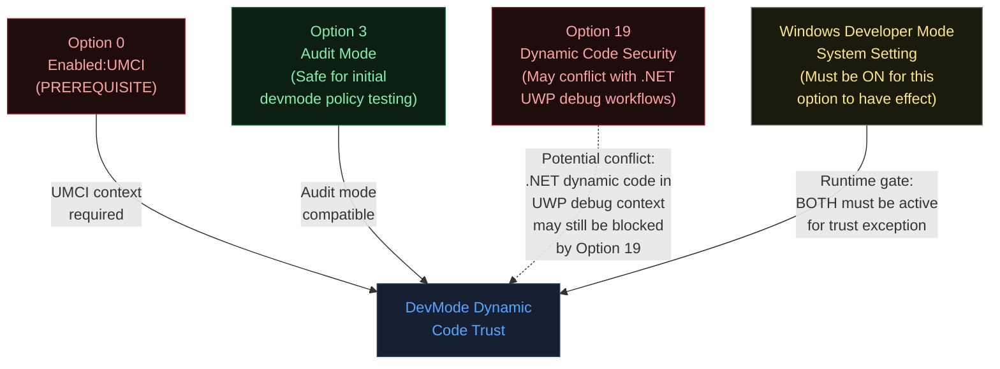

---

## 7. When to Enable vs Disable

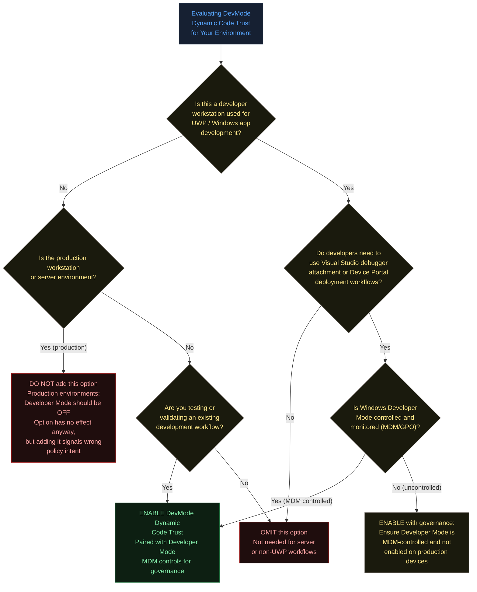

### Deployment Strategy by Device Tier

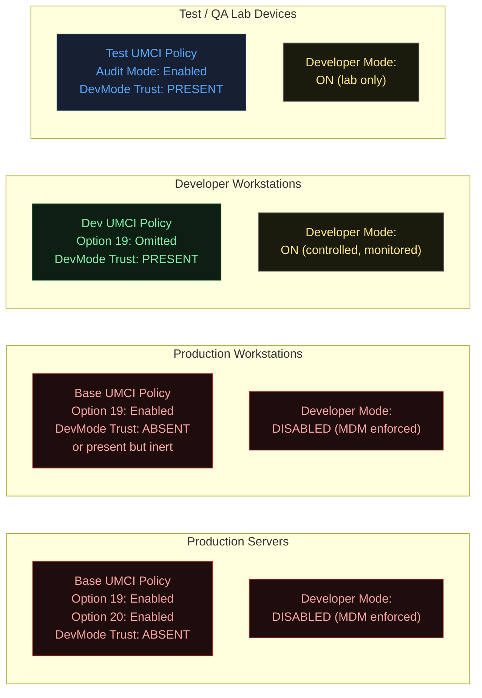

---

## 8. Real-World Scenario — End-to-End Walkthrough

### Scenario A: Developer Debugging a UWP App on a Managed Workstation

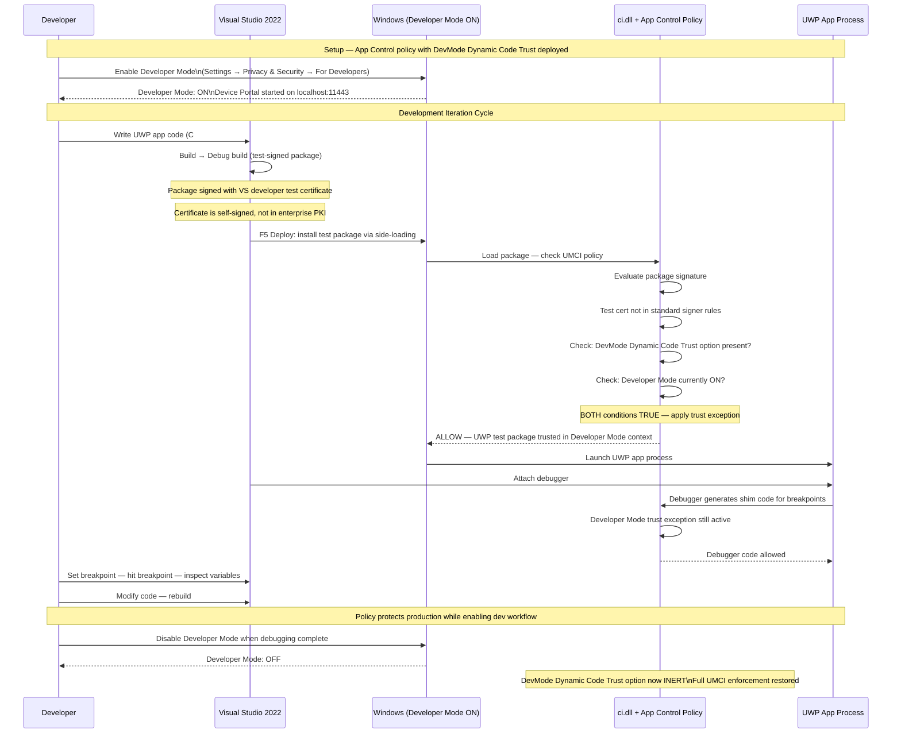

### Scenario B: Device Portal Deployment for Hardware Testing

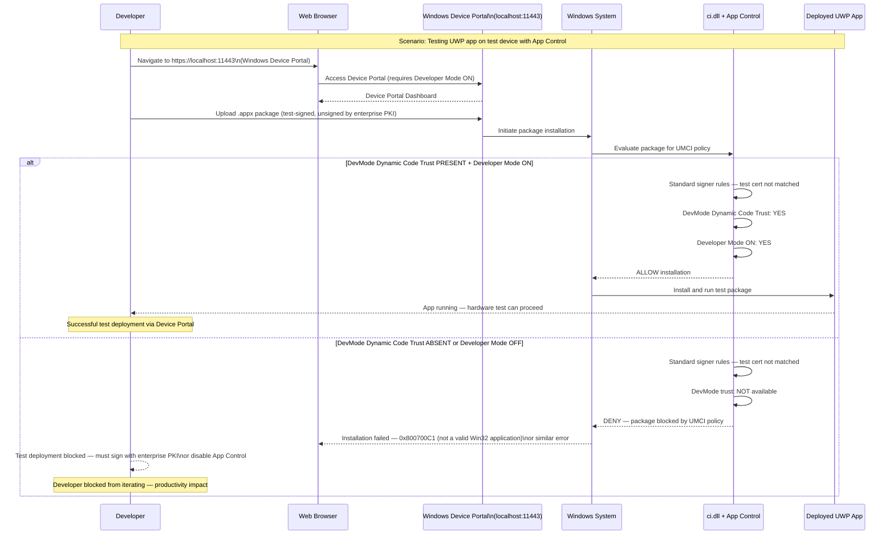

### Scenario C: MDM-Controlled Developer Mode on Enterprise Fleet

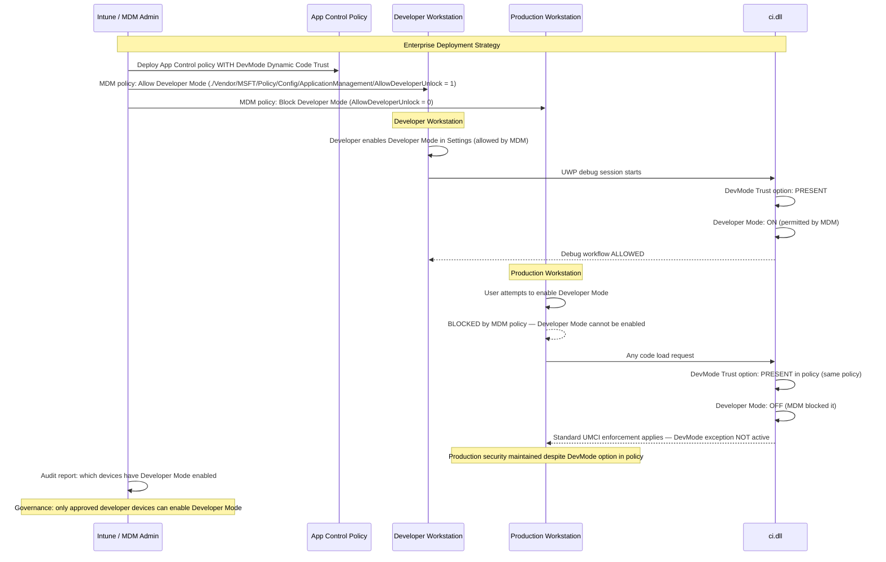

---

## 9. What Happens If You Get It Wrong

### Enabling This Option Without MDM Control of Developer Mode

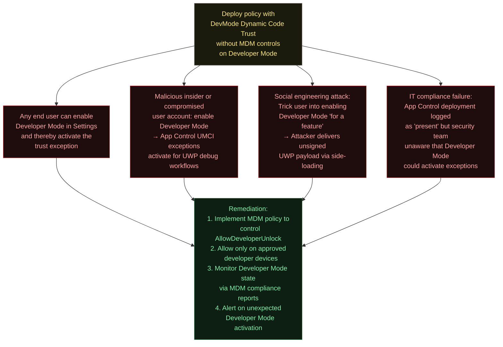

### Leaving This Option in Production Policies

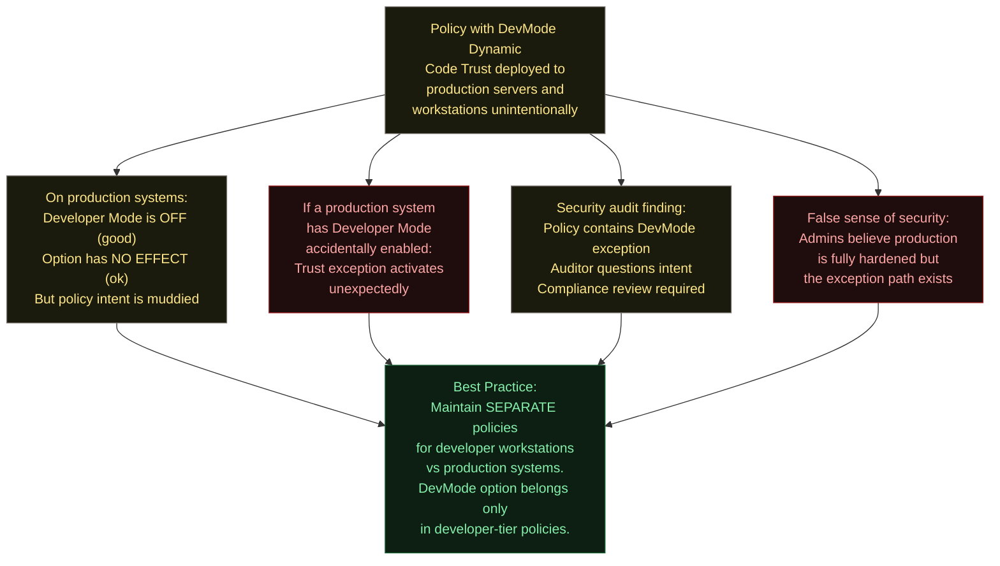

### Enabling Option 19 (Dynamic Code Security) Alongside This Option on Developer Machines

This pairing requires careful consideration:

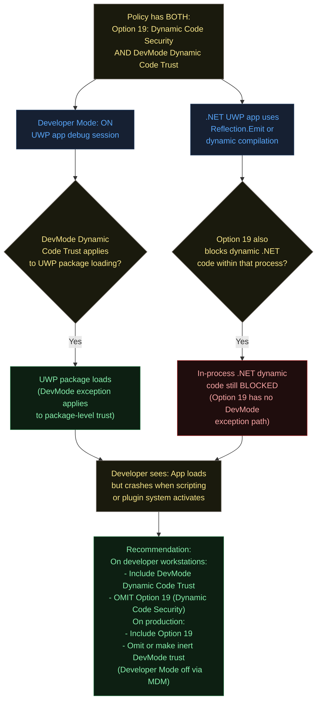

---

## 10. Valid for Supplemental Policies

**No.** Developer Mode Dynamic Code Trust is not valid for supplemental policies.

This restriction exists for the following reasons:

1. **Enforcement model coherence:** The trust exception tied to Developer Mode is a fundamental behavioral change in how the policy evaluates code loading in specific runtime contexts. This must be established at the base policy level, not layered on via supplemental extensions.

2. **Security boundary:** Allowing a supplemental policy to introduce Developer Mode trust exceptions would mean that deploying a supplemental policy to a production machine could inadvertently open a trust exception — even on machines where the base policy was deliberately hardened without this option.

3. **Developer Mode governance:** Because the effectiveness of this option depends entirely on the Developer Mode system state, and because Developer Mode control should be a deliberate, governed decision (ideally via MDM), it belongs in the base policy where IT administrators have explicit visibility and control.

4. **Consistent with other behavioral options:** Like Options 19 and 20, this option changes the fundamental trust evaluation model rather than adding specific file or signer rules. Such behavioral options are consistently restricted to base policies in App Control's design.

---

## 11. OS Version Requirements

| Platform | Minimum Version | Notes |
|----------|----------------|-------|
| Windows 10 | Version 1809 (RS5, October 2018 Update) | Build 17763 — aligns with UWP tooling maturity and Device Portal improvements |
| Windows 11 | All versions | Fully supported; Developer Mode controls in Settings redesigned but functionally equivalent |
| Windows Server 2019 | Supported | Server with Desktop Experience only — Server Core has limited UWP support |
| Windows Server 2022 | Supported | Desktop Experience; Server Core UWP support limited |
| Windows 10 < 1809 | Not recommended | Feature may be absent or behave inconsistently; UWP debugging toolchain also less mature |

### Checking Developer Mode Availability and State

```powershell
# Comprehensive Developer Mode state check
function Get-DeveloperModeState {
    $Results = [ordered]@{}

    # Registry-based check
    $RegPath = "HKLM:\SOFTWARE\Microsoft\Windows\CurrentVersion\AppModelUnlock"
    $RegValue = Get-ItemProperty -Path $RegPath -Name "AllowDevelopmentWithoutDevLicense" -ErrorAction SilentlyContinue
    $Results["DeveloperModeEnabled"]     = ($RegValue -and $RegValue.AllowDevelopmentWithoutDevLicense -eq 1)

    # MDM control check
    $MDMPath = "HKLM:\SOFTWARE\Microsoft\PolicyManager\current\device\ApplicationManagement"
    $MDMValue = Get-ItemProperty -Path $MDMPath -Name "AllowDeveloperUnlock" -ErrorAction SilentlyContinue
    $Results["MDMControlled"]            = ($null -ne $MDMValue)
    $Results["MDMAllowsDeveloperMode"]   = ($MDMValue -and $MDMValue.AllowDeveloperUnlock -eq 1)

    # Device Portal service state
    $DevPortal = Get-Service -Name "DevQueryBroker" -ErrorAction SilentlyContinue
    $Results["DevicePortalServiceState"] = if ($DevPortal) { $DevPortal.Status } else { "Service not found" }

    # OS version
    $OS = Get-CimInstance Win32_OperatingSystem
    $Results["OSBuildNumber"]            = [int]$OS.BuildNumber
    $Results["MinimumBuildForOption"]    = 17763
    $Results["OSMeetsMinimum"]           = ([int]$OS.BuildNumber -ge 17763)

    return $Results
}

$State = Get-DeveloperModeState
$State | Format-List

if ($State["DeveloperModeEnabled"]) {
    Write-Host "ADVISORY: Developer Mode is currently ENABLED on this system." -ForegroundColor Yellow
    Write-Host "If App Control policy includes DevMode Dynamic Code Trust, the exception is ACTIVE." -ForegroundColor Yellow
    if (-not $State["MDMControlled"]) {
        Write-Host "WARNING: Developer Mode is NOT MDM-controlled. User can toggle it." -ForegroundColor Red
    }
} else {
    Write-Host "Developer Mode: DISABLED. DevMode Dynamic Code Trust option is inert." -ForegroundColor Green
}
```

---

## 12. Summary Table

| Property | Value |
|----------|-------|
| **Option Identifier** | No numeric ID — string token only |
| **XML Token** | `Enabled:Developer Mode Dynamic Code Trust` |
| **Policy Type** | UMCI (User Mode Code Integrity) |
| **Default State** | Disabled (not present in default policy templates) |
| **Dual-Gate Requirement** | Option must be in policy AND Windows Developer Mode must be ON — BOTH required |
| **Effect When Developer Mode OFF** | No effect whatsoever — standard UMCI enforcement applies fully |
| **Audit Mode Behavior** | Respects Audit Mode (Option 3) when Developer Mode is ON — produces Event ID 3076 |
| **Supplemental Policy Valid** | No |
| **Prerequisite** | Option 0 (Enabled:UMCI); Windows Developer Mode system setting |
| **Minimum OS (Client)** | Windows 10 version 1809 (Build 17763) |
| **Minimum OS (Server)** | Windows Server 2019 (Desktop Experience) |
| **Scope of Trust Exception** | UWP apps debugged in Visual Studio; apps deployed via Windows Device Portal |
| **What It Does NOT Trust** | General unsigned Win32 executables; non-UWP .NET dynamic code (see Option 19 interaction) |
| **PowerShell — Enable** | XML manipulation: set `<Option>Enabled:Developer Mode Dynamic Code Trust</Option>` |
| **PowerShell — Disable** | Remove the Rule element containing this token |
| **Developer Mode MDM CSP** | `./Vendor/MSFT/Policy/Config/ApplicationManagement/AllowDeveloperUnlock` |
| **Registry Key (Developer Mode)** | `HKLM\SOFTWARE\Microsoft\Windows\CurrentVersion\AppModelUnlock\AllowDevelopmentWithoutDevLicense` |
| **Governance Requirement** | MDM control of Developer Mode strongly recommended; without it, any user can activate the exception |
| **Recommended Use** | Developer workstation policies only; separate from production policies |
| **Risk if Misdeployed to Production** | If Developer Mode enabled on a production machine, unsigned UWP debug code gains trust — potential attack vector |
| **Risk if Omitted on Dev Machines** | VS debugger and Device Portal deployment workflows blocked; developer productivity severely impacted |
| **Compatible With Option 19** | Use with caution — Option 19 may still block in-process .NET dynamic code even with DevMode trust active |
| **Best Practice Policy Architecture** | Maintain separate DEVELOPER and PRODUCTION policy sets with this option only in developer-tier policies |
